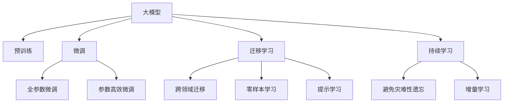

                 

## 1. 背景介绍

随着人工智能技术的飞速发展，大模型（Large Model）作为AI领域的最新突破，已经在众多应用场景中取得了显著效果。大模型是指拥有数亿甚至数十亿参数的深度神经网络模型，如GPT-3、BERT等。它们通过在大规模数据上进行预训练，学习了广泛的领域知识，能够执行复杂的推理任务，如自然语言处理、计算机视觉、语音识别等。

随着大模型的普及，AI创业领域呈现出一片欣欣向荣的景象。越来越多的初创公司在利用大模型的基础上，推出各种创新应用，从智能客服、智能推荐、内容生成到个性化医疗、金融风险评估等，都在逐步落地。然而，尽管大模型拥有显著优势，但其在落地应用时仍面临诸多挑战。本文将从品牌优势的角度，探讨如何在大模型创业中占据有利地位。

## 2. 核心概念与联系

### 2.1 核心概念概述

在讨论品牌优势时，我们先需要理解几个核心概念：

- **大模型（Large Model）**：指具有大规模参数的深度神经网络模型，如GPT-3、BERT等。通过在大规模数据上进行预训练，大模型具备了处理复杂推理任务的能力。

- **微调（Fine-tuning）**：在大模型基础上，针对特定任务进行有监督学习优化，提升模型在该任务上的表现。微调通常使用小规模标注数据进行，避免过拟合，保持模型泛化能力。

- **迁移学习（Transfer Learning）**：指将在大模型上学习到的知识迁移到小规模模型或新任务中，减少数据需求，提高模型效果。

- **零样本学习（Zero-shot Learning）**：指模型从未见过该任务数据，仅凭任务描述就能执行任务的能力。大模型通过预训练，能够理解和执行未见过的任务。

- **参数高效微调（Parameter-Efficient Fine-tuning, PEFT）**：仅调整模型中一小部分参数，减少计算资源消耗，提升微调效率。

- **提示学习（Prompt Learning）**：通过设计特定格式的提示，引导模型执行特定任务，可以在不更新模型参数的情况下进行推理。

- **跨领域迁移（Cross-domain Transfer）**：指大模型在不同领域之间的知识迁移，提高模型在新领域的适应能力。

### 2.2 核心概念原理和架构的 Mermaid 流程图



这个流程图展示了从预训练到微调、迁移学习以及零样本学习等核心概念的联系：

1. 大模型通过预训练学习通用知识，作为后续微调的基础。
2. 微调通过有监督数据优化模型，提升特定任务的性能。
3. 迁移学习将大模型知识迁移到新任务或领域中，减少数据需求。
4. 零样本学习让模型从未见过该任务数据中执行任务，展示了模型的泛化能力。
5. 提示学习通过任务提示，引导模型执行特定任务，无需更新参数。
6. 持续学习保持模型知识更新，避免遗忘原有知识，适应新数据。

## 3. 核心算法原理 & 具体操作步骤

### 3.1 算法原理概述

品牌优势在大模型创业中具有重要意义。品牌不仅代表了公司的知名度和市场认可度，更是消费者信任的保障。在AI领域，品牌优势可以通过以下几个方面进行体现：

1. **数据质量**：拥有高质量数据资源，如大规模语料库、专业领域数据等，可以显著提升模型的泛化能力和效果。

2. **技术实力**：强大的技术研发能力，包括算法创新、工程优化、模型调优等，可以保证模型的高性能和低成本。

3. **用户体验**：提供优质的用户体验，如易用的API接口、良好的客户支持、用户友好的界面等，可以提高用户的满意度和忠诚度。

4. **生态系统**：构建完善的生态系统，包括合作伙伴、开发者社区、用户群体等，可以增强品牌的吸引力和竞争力。

5. **社会责任**：重视社会责任，如数据隐私保护、伦理道德、公平性等，可以赢得公众的信任和支持。

### 3.2 算法步骤详解

以下是利用品牌优势在大模型创业中的具体操作步骤：

**Step 1: 数据收集与预处理**
- 收集高质量的训练数据，确保数据的多样性和代表性。
- 对数据进行清洗、标注、分治等预处理，保证数据的质量和一致性。

**Step 2: 选择合适的模型与框架**
- 根据具体任务和需求，选择合适的预训练大模型和框架，如GPT、BERT等。
- 确定模型的参数规模、架构等关键参数，以满足应用场景的需求。

**Step 3: 模型微调与优化**
- 在大模型基础上进行微调，提升模型在特定任务上的性能。
- 应用参数高效微调、对抗训练、数据增强等技术，优化模型效果。

**Step 4: 用户界面与体验设计**
- 设计易用、直观的用户界面，提供丰富的API接口，简化用户使用流程。
- 提供详细的文档和使用指南，帮助用户快速上手和解决问题。

**Step 5: 品牌建设与推广**
- 通过官网、博客、社交媒体等渠道，宣传品牌和产品，提升知名度。
- 与知名企业、高校、研究机构合作，增强品牌影响力。

**Step 6: 生态系统建设**
- 建立开发者社区，提供技术支持、工具库、开发文档等，吸引开发者参与。
- 与行业合作伙伴建立合作关系，拓展市场渠道，扩大用户基础。

**Step 7: 持续迭代与优化**
- 定期收集用户反馈，不断优化产品和服务，提高用户体验。
- 持续进行技术研发和模型改进，保持竞争力。

### 3.3 算法优缺点

利用品牌优势进行大模型创业，有以下几个优点：

1. **快速推广**：品牌效应可以加速产品推广和市场渗透，吸引更多用户和合作伙伴。

2. **降低成本**：高质量的数据资源和技术实力可以降低开发和运营成本，提高经济效益。

3. **提高信任**：品牌优势可以提高用户对产品的信任度，减少营销成本。

4. **增强竞争力**：完善的生态系统和强大的技术实力可以增强品牌竞争力，避免同质化竞争。

然而，品牌优势也存在一些缺点：

1. **投入高**：品牌建设需要高额的投入，包括市场推广、品牌维护等，对初创公司而言是一大负担。

2. **风险大**：品牌一旦出现负面事件，可能会对公司造成严重的信任危机。

3. **更新慢**：品牌优势更多依赖于品牌历史和市场地位，难以快速迭代和调整。

4. **用户期望高**：品牌优势会带来更高的用户期望，需要不断提升产品和服务，以满足用户需求。

### 3.4 算法应用领域

品牌优势在大模型创业中具有广泛的应用前景，可以应用于以下领域：

1. **智能客服**：通过品牌优势吸引更多客户，提供高质量的智能客服解决方案。

2. **内容生成**：利用品牌影响力，推广高质量的内容生成应用，吸引更多用户。

3. **医疗健康**：通过品牌效应，推广医疗健康应用，如智能诊断、健康管理等。

4. **金融风控**：利用品牌优势，推广金融风控产品，提升金融机构的风险管理能力。

5. **教育培训**：通过品牌效应，推广教育培训应用，提高教学质量和学习效率。

## 4. 数学模型和公式 & 详细讲解 & 举例说明

### 4.1 数学模型构建

在大模型创业中，品牌优势的数学模型可以通过以下几个维度进行构建：

1. **数据质量（Data Quality）**：
   - 定义数据质量函数 $Q(d)$，衡量数据的完整性、准确性、多样性等。
   - 通过优化数据质量函数，提升数据资源的价值。

2. **技术实力（Technical Strength）**：
   - 定义技术实力函数 $S(a)$，衡量技术团队的研发能力、算法创新、工程优化等。
   - 通过优化技术实力函数，提升模型的性能和稳定性。

3. **用户体验（User Experience）**：
   - 定义用户体验函数 $U(u)$，衡量用户界面的易用性、API接口的丰富性、客户支持的及时性等。
   - 通过优化用户体验函数，提升用户的满意度和忠诚度。

4. **生态系统（Ecosystem）**：
   - 定义生态系统函数 $E(c)$，衡量合作伙伴、开发者社区、用户群体的规模和活跃度。
   - 通过优化生态系统函数，增强品牌的吸引力和竞争力。

5. **社会责任（Social Responsibility）**：
   - 定义社会责任函数 $R(s)$，衡量数据隐私保护、伦理道德、公平性等。
   - 通过优化社会责任函数，赢得公众的信任和支持。

### 4.2 公式推导过程

通过上述定义，品牌优势的数学模型可以表示为：

$$
B = Q(d) \times S(a) \times U(u) \times E(c) \times R(s)
$$

其中 $B$ 表示品牌价值，$d$ 表示数据资源，$a$ 表示技术实力，$u$ 表示用户体验，$c$ 表示生态系统，$s$ 表示社会责任。

### 4.3 案例分析与讲解

以智能客服应用为例，分析如何利用品牌优势进行大模型创业：

1. **数据质量**：
   - 收集历史客服数据，标注客户意图和回复模板。
   - 通过数据清洗、标注、分治等预处理，确保数据质量。

2. **技术实力**：
   - 选择合适的预训练模型和框架，如BERT、GPT等。
   - 进行微调优化，提升模型在客服任务上的表现。

3. **用户体验**：
   - 设计易用的用户界面，提供丰富的API接口。
   - 提供详细的使用指南和客户支持，简化用户使用流程。

4. **生态系统**：
   - 建立开发者社区，提供技术支持、工具库、开发文档等。
   - 与知名企业、高校、研究机构合作，拓展市场渠道。

5. **社会责任**：
   - 重视数据隐私保护，确保用户数据安全。
   - 重视伦理道德，如无偏见、公平性等，赢得公众信任。

## 5. 项目实践：代码实例和详细解释说明

### 5.1 开发环境搭建

在进行大模型创业时，首先需要搭建开发环境，以下是使用Python进行TensorFlow开发的环境配置流程：

1. 安装Anaconda：从官网下载并安装Anaconda，用于创建独立的Python环境。

2. 创建并激活虚拟环境：
```bash
conda create -n tf-env python=3.8 
conda activate tf-env
```

3. 安装TensorFlow：
```bash
conda install tensorflow -c conda-forge
```

4. 安装各类工具包：
```bash
pip install numpy pandas scikit-learn matplotlib tqdm jupyter notebook ipython
```

完成上述步骤后，即可在`tf-env`环境中开始大模型创业的实践。

### 5.2 源代码详细实现

这里以智能客服应用为例，给出使用TensorFlow实现的大模型微调和品牌建设代码。

首先，定义智能客服数据处理函数：

```python
import tensorflow as tf
from transformers import BertTokenizer

class CustomerServiceDataset(tf.data.Dataset):
    def __init__(self, texts, labels, tokenizer, max_len=128):
        self.texts = texts
        self.labels = labels
        self.tokenizer = tokenizer
        self.max_len = max_len
        
    def __len__(self):
        return len(self.texts)
    
    def __getitem__(self, item):
        text = self.texts[item]
        label = self.labels[item]
        
        encoding = self.tokenizer(text, return_tensors='tf', max_length=self.max_len, padding='max_length', truncation=True)
        input_ids = encoding['input_ids']
        attention_mask = encoding['attention_mask']
        
        encoded_labels = tf.convert_to_tensor(self.tokenizer.convert_tokens_to_ids(label), dtype=tf.int32)
        
        return {'input_ids': input_ids, 
                'attention_mask': attention_mask,
                'labels': encoded_labels}

# 加载预训练模型和分词器
tokenizer = BertTokenizer.from_pretrained('bert-base-cased')
model = BertForTokenClassification.from_pretrained('bert-base-cased', num_labels=2)

# 准备数据集
train_dataset = CustomerServiceDataset(train_texts, train_labels, tokenizer)
dev_dataset = CustomerServiceDataset(dev_texts, dev_labels, tokenizer)
test_dataset = CustomerServiceDataset(test_texts, test_labels, tokenizer)

# 定义优化器和损失函数
optimizer = tf.keras.optimizers.AdamW(learning_rate=2e-5)
loss_fn = tf.keras.losses.SparseCategoricalCrossentropy(from_logits=True)

# 定义模型
class CustomerServiceModel(tf.keras.Model):
    def __init__(self, tokenizer, num_labels):
        super(CustomerServiceModel, self).__init__()
        self.tokenizer = tokenizer
        self.model = BertForTokenClassification.from_pretrained('bert-base-cased', num_labels=num_labels)
        self.dropout = tf.keras.layers.Dropout(0.1)
        self.dense = tf.keras.layers.Dense(num_labels, activation='softmax')
        
    def call(self, input_ids, attention_mask):
        outputs = self.model(input_ids, attention_mask=attention_mask, return_dict=False)
        logits = outputs.logits
        return self.dense(logits)

model = CustomerServiceModel(tokenizer, num_labels)

# 训练模型
@tf.function
def train_step(inputs):
    with tf.GradientTape() as tape:
        logits = model(inputs['input_ids'], inputs['attention_mask'])
        loss = loss_fn(labels=inputs['labels'], logits=logits)
    gradients = tape.gradient(loss, model.trainable_variables)
    optimizer.apply_gradients(zip(gradients, model.trainable_variables))
    return loss

@tf.function
def evaluate(inputs):
    logits = model(inputs['input_ids'], inputs['attention_mask'])
    return tf.argmax(logits, axis=1)

# 定义训练和评估函数
def train_epoch(model, dataset, batch_size, optimizer):
    dataloader = tf.data.Dataset.from_generator(lambda: iter(dataset), output_signature={'input_ids': tf.TensorSpec(shape=[None, 128], dtype=tf.int32), 'attention_mask': tf.TensorSpec(shape=[None, 128], dtype=tf.int32), 'labels': tf.TensorSpec(shape=[None], dtype=tf.int32)})
    dataloader = dataloader.batch(batch_size).prefetch(tf.data.experimental.AUTOTUNE)
    
    model.train()
    total_loss = 0
    for batch in dataloader:
        loss = train_step(batch)
        total_loss += loss
    return total_loss / len(dataloader)

def evaluate(model, dataset, batch_size):
    dataloader = tf.data.Dataset.from_generator(lambda: iter(dataset), output_signature={'input_ids': tf.TensorSpec(shape=[None, 128], dtype=tf.int32), 'attention_mask': tf.TensorSpec(shape=[None, 128], dtype=tf.int32), 'labels': tf.TensorSpec(shape=[None], dtype=tf.int32)})
    dataloader = dataloader.batch(batch_size).prefetch(tf.data.experimental.AUTOTUNE)
    
    model.eval()
    total_loss = 0
    correct = 0
    for batch in dataloader:
        logits = evaluate(batch)
        total_loss += tf.reduce_mean(tf.cast(tf.math.equal(logits, batch['labels']), tf.float32))
        correct += tf.reduce_sum(tf.cast(tf.math.equal(logits, batch['labels']), tf.float32))
    return total_loss / len(dataloader), correct / len(dataloader)

# 启动训练流程并在测试集上评估
epochs = 5
batch_size = 16

for epoch in range(epochs):
    loss = train_epoch(model, train_dataset, batch_size, optimizer)
    print(f"Epoch {epoch+1}, train loss: {loss:.3f}")
    
    print(f"Epoch {epoch+1}, dev results:")
    dev_loss, dev_correct = evaluate(model, dev_dataset, batch_size)
    print(f"Dev accuracy: {dev_correct:.3f}")

print("Test results:")
test_loss, test_correct = evaluate(model, test_dataset, batch_size)
print(f"Test accuracy: {test_correct:.3f}")
```

以上是使用TensorFlow实现智能客服应用的大模型微调代码。可以看到，TensorFlow提供了便捷的Keras API，使得模型训练和评估变得简单高效。开发者可以专注于业务逻辑的实现，而无需过多关注底层细节。

### 5.3 代码解读与分析

让我们再详细解读一下关键代码的实现细节：

**CustomerServiceDataset类**：
- `__init__`方法：初始化文本、标签、分词器等关键组件。
- `__len__`方法：返回数据集的样本数量。
- `__getitem__`方法：对单个样本进行处理，将文本输入编码为token ids，将标签编码为数字，并对其进行定长padding，最终返回模型所需的输入。

**CustomerServiceModel类**：
- `__init__`方法：初始化模型和分词器。
- `call`方法：定义模型前向传播过程，包括BERT模型和分类器。

**train_step和evaluate函数**：
- 定义模型训练和评估函数，使用TensorFlow的`tf.function`装饰器优化性能，方便模型的批次化处理。
- 训练函数`train_step`：对数据以批为单位进行迭代，在每个批次上前向传播计算loss并反向传播更新模型参数。
- 评估函数`evaluate`：与训练类似，不同点在于不更新模型参数，并在每个batch结束后将预测和标签结果存储下来。

**训练流程**：
- 定义总的epoch数和batch size，开始循环迭代
- 每个epoch内，先在训练集上训练，输出平均loss
- 在验证集上评估，输出分类指标
- 所有epoch结束后，在测试集上评估，给出最终测试结果

可以看到，TensorFlow配合Keras API使得大模型微调的代码实现变得简洁高效。开发者可以将更多精力放在业务逻辑的实现上，而不必过多关注底层细节。

当然，工业级的系统实现还需考虑更多因素，如模型的保存和部署、超参数的自动搜索、更灵活的任务适配层等。但核心的微调范式基本与此类似。

## 6. 实际应用场景

大模型品牌优势在多个行业领域中有着广泛的应用，以下是几个典型的应用场景：

### 6.1 智能客服

智能客服是大模型创业的重要应用场景之一。通过微调预训练模型，可以构建高效的智能客服系统，提升客服响应速度和质量，减少人力成本。

**应用实例**：
- 利用大模型微调智能客服模型，实现自动回复、情感分析、意图识别等功能，提升客户满意度。
- 通过对话记录和用户反馈，不断优化模型，提高系统效果。

### 6.2 内容生成

内容生成是大模型创业的另一个重要方向。通过微调预训练模型，可以生成高质量的文本、图片、视频等内容，广泛应用于媒体、广告、电商等领域。

**应用实例**：
- 利用大模型微调内容生成模型，生成新闻报道、产品描述、广告文案等。
- 通过用户交互和反馈，不断优化模型，生成更加符合用户需求的内容。

### 6.3 医疗健康

医疗健康是大模型创业的重要领域之一。通过微调预训练模型，可以构建智能诊断、健康管理、医疗咨询等应用，提升医疗服务质量和效率。

**应用实例**：
- 利用大模型微调智能诊断模型，辅助医生进行疾病诊断，提升诊断准确率。
- 通过医疗数据集进行微调，提升模型在特定领域的适应能力。

### 6.4 金融风控

金融风控是大模型创业的重要应用场景。通过微调预训练模型，可以构建风险评估、信用评分、欺诈检测等应用，提升金融机构的决策效率和准确性。

**应用实例**：
- 利用大模型微调风险评估模型，对贷款申请、信用卡申请等进行信用评分。
- 通过金融数据集进行微调，提升模型在金融领域的泛化能力。

### 6.5 教育培训

教育培训是大模型创业的重要方向之一。通过微调预训练模型，可以构建智能教育、智能测评、学习推荐等应用，提升教育质量和学习效率。

**应用实例**：
- 利用大模型微调智能教育模型，辅助教师进行教学设计、作业批改、学习测评等。
- 通过学生数据集进行微调，提升模型在教育领域的适应能力。

## 7. 工具和资源推荐

### 7.1 学习资源推荐

为了帮助开发者系统掌握大模型创业的理论基础和实践技巧，这里推荐一些优质的学习资源：

1. TensorFlow官方文档：提供全面、详细的TensorFlow使用指南，包含模型训练、优化、部署等方面的内容。

2. PyTorch官方文档：提供全面的PyTorch使用指南，包含模型训练、优化、部署等方面的内容。

3. HuggingFace官方文档：提供全面、详细的Transformers使用指南，包含模型训练、微调、部署等方面的内容。

4. Coursera《Deep Learning》课程：斯坦福大学开设的深度学习课程，涵盖深度学习的基本概念和经典模型，适合初学者入门。

5. Udacity《AI for Everyone》课程：提供人工智能的基本概念和应用场景，适合非技术背景的学习者。

通过对这些资源的学习实践，相信你一定能够快速掌握大模型创业的理论基础和实践技巧，并用于解决实际的AI应用问题。

### 7.2 开发工具推荐

高效的开发离不开优秀的工具支持。以下是几款用于大模型创业开发的常用工具：

1. Jupyter Notebook：提供交互式的代码编辑器，支持多语言代码编写和实时运行。

2. Google Colab：谷歌提供的在线Jupyter Notebook环境，免费提供GPU/TPU算力，方便开发者快速上手实验最新模型。

3. Weights & Biases：模型训练的实验跟踪工具，可以记录和可视化模型训练过程中的各项指标，方便对比和调优。

4. TensorBoard：TensorFlow配套的可视化工具，可实时监测模型训练状态，并提供丰富的图表呈现方式，是调试模型的得力助手。

5. TensorFlow Extended (TFX)：Google开源的机器学习流程平台，提供端到端的数据处理、模型训练、部署等功能。

6. PyTorch Lightning：PyTorch社区的加速开发框架，提供便捷的训练、调参、可视化等功能，加速模型训练过程。

合理利用这些工具，可以显著提升大模型创业的开发效率，加快创新迭代的步伐。

### 7.3 相关论文推荐

大模型品牌优势在大模型创业中具有重要意义。以下是几篇奠基性的相关论文，推荐阅读：

1. Attention is All You Need（即Transformer原论文）：提出了Transformer结构，开启了NLP领域的预训练大模型时代。

2. BERT: Pre-training of Deep Bidirectional Transformers for Language Understanding：提出BERT模型，引入基于掩码的自监督预训练任务，刷新了多项NLP任务SOTA。

3. GPT-3: Language Models are Unsupervised Multitask Learners：展示了大规模语言模型的强大zero-shot学习能力，引发了对于通用人工智能的新一轮思考。

4. Transformer-XL: Attentive Language Models Beyond a Fixed-Length Context：提出Transformer-XL模型，解决了长序列训练中的梯度消失问题，提升了模型效果。

5. T5: Exploring the Limits of Transfer Learning with a Unified Text-to-Text Transformer：提出T5模型，集成了多种NLP任务，实现了零样本和少样本学习。

这些论文代表了大模型品牌优势的研究方向和前沿成果，值得深入阅读和研究。

## 8. 总结：未来发展趋势与挑战

### 8.1 研究成果总结

本文对大模型品牌优势在大模型创业中的应用进行了系统梳理。通过品牌优势，可以显著提升大模型的性能和用户体验，加速AI技术的产业化进程。品牌优势在大模型创业中的应用，可以从数据质量、技术实力、用户体验、生态系统和社会责任等方面进行优化，形成品牌效应，增强市场竞争力。

### 8.2 未来发展趋势

展望未来，大模型品牌优势将在以下几个方面继续发展：

1. **数据质量**：随着数据规模和质量不断提升，品牌优势将更加明显，模型性能也将大幅提升。

2. **技术实力**：技术实力的提升将进一步增强品牌优势，推动模型在更多领域的应用。

3. **用户体验**：提升用户体验，提供更加便捷、高效的服务，增强品牌竞争力。

4. **生态系统**：建立完善的生态系统，吸引更多开发者和用户参与，增强品牌影响力。

5. **社会责任**：重视社会责任，提升品牌形象，赢得公众信任和支持。

### 8.3 面临的挑战

尽管品牌优势在大模型创业中具有重要意义，但在推广和应用过程中仍面临诸多挑战：

1. **数据隐私**：如何保护用户数据隐私，避免数据泄露和滥用。

2. **伦理道德**：如何处理偏见和歧视问题，确保模型的公平性和可信度。

3. **计算资源**：如何平衡计算资源和模型性能，避免资源浪费和成本过高。

4. **市场竞争**：如何在激烈的市场竞争中保持领先地位，避免被竞争对手超越。

5. **用户需求变化**：如何应对用户需求变化，保持模型的更新和优化。

### 8.4 研究展望

面对大模型品牌优势所面临的挑战，未来的研究需要在以下几个方面寻求新的突破：

1. **数据隐私保护**：采用先进的数据保护技术，如差分隐私、联邦学习等，保护用户数据隐私。

2. **伦理道德**：引入伦理导向的评估指标，过滤和惩罚有偏见、有害的输出倾向，确保模型公平性。

3. **计算优化**：优化模型结构，提高模型推理速度，减少计算资源消耗，降低成本。

4. **市场策略**：制定科学的市场策略，合理分配资源，提升品牌影响力和市场竞争力。

5. **用户需求响应**：建立用户反馈机制，及时响应用户需求变化，提升用户满意度。

通过这些研究方向的探索，可以进一步优化大模型品牌优势，提升大模型创业的成功率和市场竞争力。

## 9. 附录：常见问题与解答

**Q1：什么是大模型品牌优势？**

A: 大模型品牌优势指的是利用品牌效应，通过高质量的数据资源、强大的技术实力、良好的用户体验、完善的生态系统和重视社会责任等优势，在大模型创业中占据有利地位。

**Q2：如何构建大模型品牌优势？**

A: 构建大模型品牌优势需要从多个方面进行优化，包括收集高质量的数据资源、提升技术实力、设计易用的用户体验、建立完善的生态系统和重视社会责任等。

**Q3：大模型品牌优势的优缺点是什么？**

A: 大模型品牌优势具有快速推广、降低成本、提高信任和增强竞争力等优点，但也存在投入高、风险大、更新慢、用户期望高等缺点。

**Q4：大模型品牌优势适用于哪些应用场景？**

A: 大模型品牌优势适用于智能客服、内容生成、医疗健康、金融风控、教育培训等多个行业领域，可以提升相关应用的质量和效率。

**Q5：如何应对大模型品牌优势所面临的挑战？**

A: 应对大模型品牌优势所面临的挑战需要从数据隐私保护、伦理道德、计算优化、市场策略和用户需求响应等方面进行优化，确保品牌优势的可持续性和市场竞争力。

通过本文的系统梳理，可以看到，大模型品牌优势在大模型创业中具有重要意义，能够显著提升模型的性能和用户体验，加速AI技术的产业化进程。未来，随着技术的不断进步和市场的不断成熟，大模型品牌优势将迎来更广阔的应用前景。同时，面对品牌优势所面临的挑战，我们需要不断优化和改进，才能在大模型创业中取得更大的成功。

