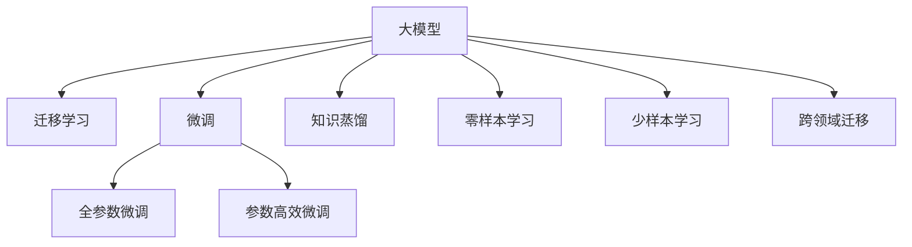

                 

# AI 大模型创业：如何利用商业优势？

在人工智能（AI）快速发展的今天，大模型（Large Models）已经成为推动NLP、CV、自然交互等多个领域进步的重要引擎。但是，随着大模型的广泛应用，如何从AI创业的角度挖掘其商业价值，并充分利用其优势，成为了一个值得深思的话题。本文将从商业角度探讨如何利用AI大模型的优势，同时展示其在企业战略、产品研发、用户运营等环节的具体应用。

## 1. 背景介绍

### 1.1 背景与现状

随着深度学习技术的发展，大模型已经在图像识别、自然语言处理、智能推荐等众多领域取得了显著的成果。比如BERT、GPT-3、DALL·E等，这些模型基于庞大的数据集进行预训练，具备出色的泛化能力和迁移学习能力。

然而，尽管这些模型在学术界取得了重大突破，但在实际商业化过程中仍面临诸多挑战。企业如何充分利用大模型的优势，使其在商业竞争中占据先机，成为AI创业的重要课题。

### 1.2 大模型的商业价值

AI大模型不仅具备强大的计算能力和训练数据支持，还具有以下几个商业优势：

- **数据处理能力**：大模型能够处理海量数据，快速提取有价值的信息。
- **泛化能力**：模型具备跨领域、跨任务泛化能力，适应性强。
- **性能提升**：大模型能大幅提升任务精度和效率。
- **可扩展性**：能够高效扩展至多任务、多模态场景。

这些优势使得大模型成为各行各业创新发展的关键。通过合理运用大模型，企业可以在短时间内实现技术突破，提升竞争地位。

## 2. 核心概念与联系

### 2.1 核心概念概述

为了更好地理解大模型的商业应用，本节将介绍几个关键概念：

- **大模型（Large Models）**：指在大规模无标签数据上进行预训练的深度学习模型，如BERT、GPT等。
- **迁移学习（Transfer Learning）**：指利用预训练模型的知识进行微调，从而提升下游任务的性能。
- **微调（Fine-Tuning）**：指在预训练模型的基础上，使用下游任务的标注数据进行微调，调整模型参数以适配特定任务。
- **知识蒸馏（Knowledge Distillation）**：指通过转移教师模型的知识，训练一个更小的模型以提升性能。
- **零样本学习（Zero-Shot Learning）**：指模型在未见过的样本上也能推理预测的能力。
- **少样本学习（Few-Shot Learning）**：指在少量样本上进行训练，快速适应新任务的能力。
- **跨领域迁移（Cross-Domain Transfer）**：指模型能将在一个领域学到的知识迁移到另一个领域的能力。

这些概念之间的逻辑关系可以通过以下Mermaid流程图来展示：



### 2.2 核心概念原理和架构

#### 2.2.1 大模型原理

大模型的训练过程可以分为预训练和微调两个阶段：

- **预训练**：在无标签数据集上对模型进行训练，目的是学习通用的语言、图像等表示。
- **微调**：利用下游任务的标注数据对预训练模型进行微调，使其适应特定任务。

预训练通常采用自监督任务，如掩码语言模型（Masked Language Model）、自编码器（Autoencoder）等，这些任务可以让模型从无标签数据中学习到强大的特征表示能力。

#### 2.2.2 微调原理

微调在大模型的基础上，针对特定任务进行有监督训练。微调的目标是最小化任务损失，使得模型在特定任务上的表现达到最优。微调过程中，通常会采用小批量梯度下降等优化算法，对模型参数进行更新。

## 3. 核心算法原理 & 具体操作步骤

### 3.1 算法原理概述

AI大模型的微调过程通常包括以下几个关键步骤：

1. **数据准备**：收集下游任务的标注数据集。
2. **模型选择**：选择适合的预训练模型。
3. **任务适配**：设计任务特定的输出层和损失函数。
4. **微调训练**：使用标注数据对预训练模型进行微调，优化模型参数。
5. **模型评估**：在测试集上评估微调后的模型表现。
6. **模型部署**：将模型部署到实际应用中。

### 3.2 算法步骤详解

以自然语言处理（NLP）中的情感分析任务为例，以下是详细的微调步骤：

1. **数据准备**：收集情感分析任务的标注数据集，划分为训练集、验证集和测试集。例如IMDb电影评论数据集。
2. **模型选择**：选择适合的预训练模型，如BERT、GPT等。
3. **任务适配**：在模型顶层添加全连接层和Sigmoid激活函数，输出情感类别概率。同时定义交叉熵损失函数。
4. **微调训练**：使用训练集数据进行模型微调，设置合适的学习率和批量大小，避免过拟合。例如使用AdamW优化器。
5. **模型评估**：在测试集上评估模型表现，例如使用F1分数和准确率。
6. **模型部署**：将训练好的模型部署到线上服务，提供API接口供用户调用。

### 3.3 算法优缺点

#### 3.3.1 优点

- **效率高**：利用预训练模型的知识，可以快速提升模型在特定任务上的表现。
- **泛化能力强**：大模型具备强大的泛化能力，能适应多种不同领域和任务。
- **可扩展性强**：大模型可扩展到多任务、多模态场景，提升应用范围。

#### 3.3.2 缺点

- **计算资源需求高**：大模型需要大量计算资源进行预训练和微调。
- **过拟合风险大**：大模型在微调过程中容易过拟合，需要谨慎处理。
- **模型解释性差**：大模型通常缺乏可解释性，难以解释其决策过程。

## 4. 数学模型和公式 & 详细讲解

### 4.1 数学模型构建

在情感分析任务中，可以采用如下数学模型进行建模：

设$M$为预训练模型，$D$为训练集，$L$为损失函数，$P$为预测概率，$y$为真实标签。则情感分析任务的优化目标为：

$$
\min_{M} \frac{1}{N} \sum_{i=1}^{N} L(P(x_i), y_i)
$$

其中$N$为训练集大小。

### 4.2 公式推导过程

情感分析任务的损失函数通常采用交叉熵损失，即：

$$
L(P(x_i), y_i) = -y_i\log P(x_i) - (1-y_i)\log(1-P(x_i))
$$

在微调过程中，可以使用小批量梯度下降法进行优化。例如，AdamW优化器的更新公式为：

$$
\theta \leftarrow \theta - \eta\frac{\partial L(P(x_i), y_i)}{\partial \theta}
$$

其中$\eta$为学习率，$\theta$为模型参数。

### 4.3 案例分析与讲解

以BERT模型为例，我们可以用微调的方法对情感分析任务进行建模。首先，使用预训练的BERT模型作为基础模型。然后，在模型顶层添加全连接层，设置情感类别数为2（正面、负面），最后使用交叉熵损失函数进行训练。通过微调，模型能够学习到情感分析任务中的特定特征，提升模型预测精度。

## 5. 项目实践：代码实例和详细解释说明

### 5.1 开发环境搭建

为了进行情感分析任务的微调，首先需要搭建开发环境。以下是在Python中使用PyTorch进行情感分析任务微调的示例：

1. 安装Python环境：
   ```bash
   pip install python
   ```

2. 安装PyTorch：
   ```bash
   pip install torch torchvision
   ```

3. 安装nltk工具包：
   ```bash
   pip install nltk
   ```

4. 安装BERT模型：
   ```bash
   pip install transformers
   ```

### 5.2 源代码详细实现

以下是使用BERT模型进行情感分析任务微调的Python代码实现：

```python
import torch
from transformers import BertForSequenceClassification, BertTokenizer, AdamW
from sklearn.metrics import accuracy_score, precision_score, recall_score, f1_score
from torch.utils.data import Dataset, DataLoader

# 定义情感分析数据集
class SentimentDataset(Dataset):
    def __init__(self, texts, labels):
        self.tokenizer = BertTokenizer.from_pretrained('bert-base-uncased')
        self.texts = texts
        self.labels = labels

    def __len__(self):
        return len(self.texts)

    def __getitem__(self, idx):
        text = self.texts[idx]
        label = self.labels[idx]

        encoding = self.tokenizer(text, add_special_tokens=True, return_tensors='pt')
        input_ids = encoding['input_ids']
        attention_mask = encoding['attention_mask']

        return {
            'input_ids': input_ids,
            'attention_mask': attention_mask,
            'labels': torch.tensor(label)
        }

# 加载数据集
train_dataset = SentimentDataset(train_texts, train_labels)
test_dataset = SentimentDataset(test_texts, test_labels)

# 定义模型
model = BertForSequenceClassification.from_pretrained('bert-base-uncased', num_labels=2)

# 定义优化器
optimizer = AdamW(model.parameters(), lr=2e-5)

# 定义训练和评估函数
def train(model, train_loader, optimizer, device):
    model.train()
    for batch in train_loader:
        input_ids = batch['input_ids'].to(device)
        attention_mask = batch['attention_mask'].to(device)
        labels = batch['labels'].to(device)

        outputs = model(input_ids, attention_mask=attention_mask, labels=labels)
        loss = outputs.loss
        optimizer.zero_grad()
        loss.backward()
        optimizer.step()

def evaluate(model, test_loader, device):
    model.eval()
    with torch.no_grad():
        correct_predictions = 0
        total_predictions = 0
        for batch in test_loader:
            input_ids = batch['input_ids'].to(device)
            attention_mask = batch['attention_mask'].to(device)
            labels = batch['labels'].to(device)

            outputs = model(input_ids, attention_mask=attention_mask, labels=labels)
            predictions = torch.argmax(outputs.logits, dim=1)
            total_predictions += len(predictions)
            correct_predictions += (predictions == labels).sum().item()

        accuracy = correct_predictions / total_predictions
        return accuracy

# 训练模型
device = torch.device('cuda' if torch.cuda.is_available() else 'cpu')
train_loader = DataLoader(train_dataset, batch_size=16, shuffle=True)
test_loader = DataLoader(test_dataset, batch_size=16, shuffle=False)

for epoch in range(10):
    train(model, train_loader, optimizer, device)
    acc = evaluate(model, test_loader, device)
    print(f'Epoch {epoch+1}, Accuracy: {acc:.4f}')
```

### 5.3 代码解读与分析

在上述代码中，我们首先定义了情感分析数据集，并使用`BertTokenizer`将文本转换为BERT模型所需的token id序列。然后，我们使用`BertForSequenceClassification`定义情感分析模型，并设置分类数为2（正面、负面）。接下来，我们使用AdamW优化器进行模型微调，并在训练过程中使用准确率作为评价指标。最后，在测试集上评估模型性能，输出准确率。

## 6. 实际应用场景

### 6.1 产品推荐

大模型在产品推荐领域的应用前景广阔。利用大模型的泛化能力和迁移学习能力，可以根据用户的历史行为数据和兴趣偏好，推荐符合其需求的物品。例如，电商平台可以利用大模型对用户评论进行情感分析，了解用户对商品的喜好程度，从而提升推荐精度。

### 6.2 舆情监控

大模型在舆情监控方面也具有独特优势。通过对社交媒体、新闻等海量文本数据进行情感分析，可以实时监测用户对某一事件的情感倾向，及时预警负面舆情，帮助企业进行风险防控。

### 6.3 智能客服

大模型在智能客服领域的应用也十分广泛。利用大模型的自然语言处理能力，可以构建智能客服系统，自动回答用户咨询，提高客户满意度。例如，银行客服可以通过大模型对用户提问进行情感分析，自动匹配合适的答案模板，提高服务质量。

## 7. 工具和资源推荐

### 7.1 学习资源推荐

为了帮助开发者更好地掌握大模型的商业应用，以下是一些推荐的学习资源：

1. 《深度学习实战》系列书籍：该书详细介绍了深度学习模型的实现和商业应用，涵盖NLP、CV等多个领域。
2. 《自然语言处理入门》课程：由清华大学开设，系统讲解NLP的基本概念和技术，适合初学者学习。
3. HuggingFace官方文档：提供丰富的预训练模型和微调样例代码，帮助开发者快速上手。
4. TensorFlow官网：提供详细的TensorFlow教程和文档，支持GPU/TPU算力，适合大规模模型训练。

### 7.2 开发工具推荐

在实际应用中，可以使用以下工具进行大模型的开发：

1. PyTorch：基于Python的开源深度学习框架，灵活性高，易于迭代优化。
2. TensorFlow：由Google主导的开源深度学习框架，支持大规模工程应用。
3. Transformers库：提供丰富的预训练模型和微调工具，方便开发者使用。
4. Jupyter Notebook：可视化开发环境，支持代码调试和交互式学习。

### 7.3 相关论文推荐

为了深入了解大模型在商业应用中的最新进展，以下是一些推荐的相关论文：

1. 《BERT: Pre-training of Deep Bidirectional Transformers for Language Understanding》：提出BERT模型，引入掩码语言模型预训练任务。
2. 《GPT-3: Language Models are Unsupervised Multitask Learners》：展示GPT-3模型的强大零样本学习能力。
3. 《Transfer Learning with Static Representations》：介绍知识蒸馏方法，利用预训练模型的知识提升模型泛化能力。
4. 《Few-Shot Learning with Self-Distillation》：提出少样本学习方法，通过自蒸馏提升模型在小样本情况下的性能。
5. 《Scalable Cross-Domain Transfer Learning with Feature Selective Alignment》：提出跨领域迁移方法，提升模型在不同领域之间的泛化能力。

## 8. 总结：未来发展趋势与挑战

### 8.1 研究成果总结

本文从商业角度探讨了AI大模型的应用，详细介绍了大模型的预训练和微调过程，并结合实际应用场景进行讲解。通过系统地梳理大模型的优势和应用，希望能帮助AI创业者更好地挖掘其商业潜力，利用大模型在商业竞争中取得优势。

### 8.2 未来发展趋势

随着技术的不断进步，AI大模型的应用将更加广泛。未来，AI大模型将在以下几个方面得到发展：

1. **自监督学习**：通过自监督任务进行预训练，减少对标注数据的依赖，提升模型泛化能力。
2. **跨领域迁移**：利用大模型的跨领域迁移能力，提升模型在不同领域之间的性能。
3. **知识蒸馏**：通过知识蒸馏方法，将大模型的知识传递给小模型，提升小模型性能。
4. **零样本和少样本学习**：提升模型在未见过的样本上的推理能力，降低对标注数据的依赖。
5. **多模态融合**：将视觉、语音、文本等多种模态的信息进行融合，提升模型的综合能力。

### 8.3 面临的挑战

尽管AI大模型在商业应用中取得了显著进展，但仍面临以下挑战：

1. **数据获取困难**：标注数据的获取和处理成本较高，制约大模型在实际应用中的推广。
2. **模型过大**：大模型需要大量的计算资源进行训练和推理，资源消耗较大。
3. **过拟合风险**：大模型在微调过程中容易过拟合，需要采取有效措施进行优化。
4. **可解释性不足**：大模型通常缺乏可解释性，难以解释其决策过程。
5. **伦理和安全问题**：大模型可能学习到有害信息，影响其应用的安全性。

### 8.4 研究展望

为解决上述挑战，未来的研究需要在以下几个方面进行深入探索：

1. **自监督预训练**：开发更多的自监督学习任务，提升模型的泛化能力。
2. **参数高效微调**：开发更加高效的微调方法，减少模型训练和推理的资源消耗。
3. **跨领域迁移**：深入研究跨领域迁移方法，提升模型的适应性。
4. **知识蒸馏**：探索更多知识蒸馏方法，提升小模型的性能。
5. **可解释性研究**：研究模型的可解释性，提供更好的解释和调试手段。
6. **伦理与安全**：加强对模型伦理和安全性的研究，避免有害信息的传播。

## 9. 附录：常见问题与解答

### Q1: 大模型在实际应用中面临哪些挑战？

A: 大模型在实际应用中面临以下挑战：
- **数据获取困难**：标注数据的获取和处理成本较高，制约大模型在实际应用中的推广。
- **模型过大**：大模型需要大量的计算资源进行训练和推理，资源消耗较大。
- **过拟合风险**：大模型在微调过程中容易过拟合，需要采取有效措施进行优化。
- **可解释性不足**：大模型通常缺乏可解释性，难以解释其决策过程。
- **伦理和安全问题**：大模型可能学习到有害信息，影响其应用的安全性。

### Q2: 如何提升大模型的可解释性？

A: 提升大模型的可解释性可以从以下几个方面进行：
- **可视化**：通过可视化工具展示模型训练过程中的变化，帮助理解模型的学习过程。
- **特征解释**：分析模型中各个特征的重要性，解释模型决策的依据。
- **层级分析**：对模型的不同层级进行可视化，理解每一层的作用和贡献。
- **对抗样本**：通过对抗样本分析模型的鲁棒性，找出模型决策中的脆弱点。
- **模型压缩**：对模型进行压缩，减少模型复杂度，提升可解释性。

### Q3: 大模型在实际应用中如何降低过拟合风险？

A: 降低大模型的过拟合风险可以从以下几个方面进行：
- **数据增强**：通过数据增强技术，丰富训练集的多样性，减少模型对特定样本的依赖。
- **正则化**：采用L2正则、Dropout等正则化技术，防止模型过拟合。
- **早停**：在模型训练过程中，监控验证集上的性能，及时停止训练，避免过拟合。
- **小批量训练**：使用小批量梯度下降法，避免模型对训练集的过度拟合。
- **知识蒸馏**：通过知识蒸馏方法，将大模型的知识传递给小模型，提升小模型的泛化能力。

### Q4: 大模型在商业应用中如何发挥优势？

A: 大模型在商业应用中可以发挥以下几个优势：
- **数据处理能力**：大模型能够处理海量数据，快速提取有价值的信息。
- **泛化能力**：模型具备跨领域、跨任务泛化能力，适应性强。
- **性能提升**：大模型能大幅提升任务精度和效率。
- **可扩展性强**：大模型可扩展到多任务、多模态场景，提升应用范围。

### Q5: 大模型在实际应用中如何提高资源利用效率？

A: 提高大模型在实际应用中的资源利用效率可以从以下几个方面进行：
- **模型压缩**：对模型进行压缩，减少模型大小和计算资源消耗。
- **量化**：将模型从浮点模型转为定点模型，压缩存储空间，提高计算效率。
- **模型并行**：采用模型并行技术，利用多GPU/TPU进行分布式训练，提高计算效率。
- **缓存机制**：使用缓存机制，减少模型多次加载和计算的开销。
- **数据优化**：通过数据优化技术，减少数据传输和计算的开销。

