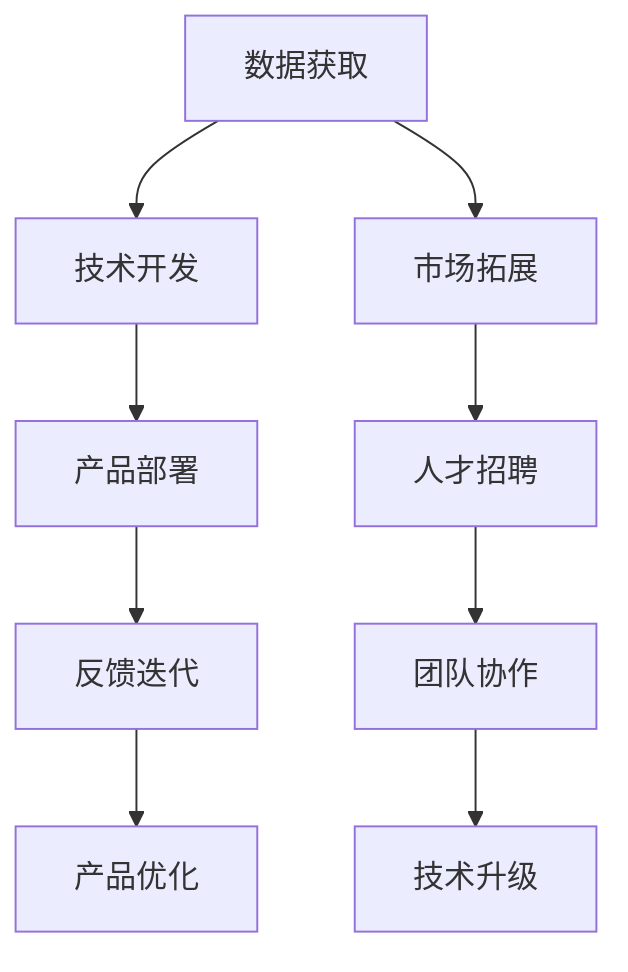

                 

# AI 大模型创业：如何利用渠道优势？

## 1. 背景介绍

随着人工智能技术的飞速发展，大模型在自然语言处理、图像识别、语音识别等领域的应用越来越广泛。然而，在AI大模型创业的过程中，如何利用渠道优势成为决定成功的关键。本文将深入探讨如何利用渠道优势进行AI大模型创业，帮助创业者和从业者更好地理解并应用这一核心要素。

## 2. 核心概念与联系

### 2.1 核心概念概述

在AI大模型创业中，渠道优势是指企业或团队在获取数据、技术、市场、人才等方面所拥有的特殊资源和网络关系。这些渠道资源能够显著提高企业或团队的核心竞争力，帮助其在激烈的市场竞争中占据有利地位。

### 2.2 核心概念原理和架构的 Mermaid 流程图



这个流程图展示了AI大模型创业过程中渠道优势的主要作用：数据获取是核心，技术开发依赖于数据，市场拓展需要技术支持和人才支撑，而反馈迭代、团队协作、产品优化和升级则是产品和服务不断完善的保障。

### 2.3 核心概念联系

AI大模型创业的各个环节都与渠道优势紧密相关。获取高质量的数据是技术开发的起点，掌握先进的技术是产品部署的关键，拥有强大的市场影响力是产品推广的基础，吸引和保留优秀人才是团队协作的核心。

## 3. 核心算法原理 & 具体操作步骤

### 3.1 算法原理概述

利用渠道优势的AI大模型创业主要包括以下几个步骤：

1. 数据获取：通过渠道获取高质量的数据集，为模型训练提供基础。
2. 技术开发：利用获取到的数据，通过机器学习或深度学习等算法，训练出高性能的AI模型。
3. 市场拓展：通过渠道资源，将产品推广到目标市场，提高市场影响力。
4. 人才招聘：通过渠道获取顶尖人才，提升团队的技术实力。
5. 反馈迭代：通过用户反馈，持续优化产品和服务。
6. 产品优化：利用技术升级，提高产品的竞争力。

### 3.2 算法步骤详解

#### 3.2.1 数据获取

1. **多渠道数据获取**：
   - 公有数据集：利用公共数据集，如MNIST、COCO等，进行初步模型训练。
   - 学术资源：通过参与学术会议、研究项目等方式获取数据资源。
   - 行业合作：与行业公司合作，获取其专有数据。
   - 用户数据：通过产品或服务的用户数据，进行模型微调和优化。

2. **数据清洗与标注**：
   - 清洗数据：去除噪声、缺失值等。
   - 标注数据：对数据进行标注，如图像识别任务中的标签、自然语言处理任务中的实体标注等。

3. **数据扩充**：
   - 数据增强：对已有数据进行增强，如旋转、翻转、裁剪等，增加数据多样性。
   - 数据合成：利用生成对抗网络（GAN）等技术，生成新数据。

#### 3.2.2 技术开发

1. **模型选择与设计**：
   - 选择适合的模型架构，如卷积神经网络（CNN）、循环神经网络（RNN）、Transformer等。
   - 设计模型结构，包括网络层、激活函数、损失函数等。

2. **模型训练与优化**：
   - 利用优化算法（如梯度下降、Adam等）进行模型训练。
   - 使用正则化技术（如L2正则、Dropout等）避免过拟合。
   - 进行超参数调优，提高模型精度和鲁棒性。

#### 3.2.3 市场拓展

1. **品牌建设**：
   - 建立品牌形象，通过博客、社交媒体等渠道进行推广。
   - 参与行业展会、竞赛等活动，提高品牌知名度。

2. **渠道合作**：
   - 与行业合作伙伴建立战略合作关系，共享资源和市场。
   - 通过技术授权、数据分析等方式获取合作收入。

#### 3.2.4 人才招聘

1. **招聘渠道**：
   - 利用招聘网站、社交媒体等渠道发布招聘信息。
   - 参与行业会议、技术峰会等活动，吸引人才加入。

2. **人才评估**：
   - 通过面试、技术测试等方式，评估候选人的技术能力和团队协作能力。
   - 建立激励机制，吸引和留住优秀人才。

#### 3.2.5 反馈迭代

1. **用户反馈收集**：
   - 通过用户反馈、评论等方式收集用户对产品的意见和建议。
   - 利用在线调查、问卷等方式进行深度调研。

2. **反馈分析**：
   - 对收集到的反馈进行分析，找出问题点和改进方向。
   - 定期进行数据分析，跟踪用户满意度变化。

#### 3.2.6 产品优化

1. **功能改进**：
   - 根据用户反馈，持续改进产品功能，提高用户体验。
   - 增加新功能，提高产品的市场竞争力。

2. **技术升级**：
   - 利用最新技术，进行模型优化和更新。
   - 采用先进的深度学习框架和技术，提升产品性能。

### 3.3 算法优缺点

#### 3.3.1 算法优点

1. **提升竞争力**：利用渠道优势，能够快速获取高质量的数据和资源，提高技术研发和市场拓展的速度。
2. **降低风险**：通过多样化的数据来源和人才渠道，减少单一渠道带来的风险。
3. **提高效率**：渠道资源的利用能够显著提高产品和服务的开发和迭代效率。

#### 3.3.2 算法缺点

1. **成本高昂**：渠道资源的获取和维护需要高昂的投入，如数据购买、人才招聘、品牌推广等。
2. **依赖性强**：过度依赖特定的渠道资源，可能在渠道变化时失去竞争力。
3. **信息不对称**：通过渠道获取的数据和信息可能存在信息不对称的问题，影响决策的准确性。

## 4. 数学模型和公式 & 详细讲解 & 举例说明

### 4.1 数学模型构建

在AI大模型创业中，数学模型主要应用于技术开发和产品优化环节。这里以图像识别任务为例，构建数学模型：

设输入图像为$x$，输出标签为$y$，定义图像识别模型的损失函数为：

$$
L = -\sum_{i=1}^n \log(\hat{y}_i)
$$

其中，$\hat{y}_i$为模型预测的概率分布，$y$为真实标签。

### 4.2 公式推导过程

1. **模型训练**：
   - 利用梯度下降等优化算法，最小化损失函数$L$，得到最优参数$\theta$。

2. **模型评估**：
   - 利用测试集数据，计算模型在测试集上的精度、召回率等指标。

### 4.3 案例分析与讲解

#### 4.3.1 数据获取与标注

某AI公司进行图像识别任务，获取了多个渠道的数据资源，包括公有数据集、学术资源、行业合作数据和用户数据。对于公有数据集，公司进行了数据清洗和标注，确保数据质量。对于学术资源，公司参加了多次学术会议，获取了最新的研究成果和数据。对于行业合作数据，公司与某知名汽车公司合作，获取了车辆图像数据。对于用户数据，公司开发了图像识别应用，通过应用收集用户上传的图像数据，并进行标注。

#### 4.3.2 模型选择与设计

公司选择了Transformer模型架构，设计了包含多个Transformer编码器的网络结构。

#### 4.3.3 模型训练与优化

公司使用Adam优化算法进行模型训练，通过L2正则和Dropout等技术避免过拟合。同时，公司进行了超参数调优，找到了最优的模型参数组合。

#### 4.3.4 市场拓展

公司通过品牌建设和技术授权等方式，逐步提高了市场知名度和影响力。与多家行业公司合作，共享数据和市场资源。

#### 4.3.5 人才招聘

公司通过招聘网站和行业会议等方式，吸引了多名顶尖人才加入。利用激励机制，留住优秀人才，提升团队技术实力。

#### 4.3.6 反馈迭代

公司定期收集用户反馈，通过数据分析工具进行深度分析，找出问题点和改进方向。对产品进行持续优化，提升用户体验。

## 5. 项目实践：代码实例和详细解释说明

### 5.1 开发环境搭建

在AI大模型创业中，开发环境搭建非常重要。以下是搭建开发环境的步骤：

1. **安装Python和相关库**：
   - 安装Python 3.6及以上版本。
   - 安装TensorFlow、Keras等深度学习库。

2. **安装数据处理工具**：
   - 安装Pandas、NumPy等数据处理工具。

3. **搭建计算平台**：
   - 使用Google Cloud、AWS等云平台搭建计算环境。

### 5.2 源代码详细实现

以下是一个简单的AI大模型创业项目代码示例，包括数据获取、模型训练、市场拓展等模块：

```python
# 数据获取
import requests
import os

url = "http://example.com/data.csv"
filename = "data.csv"
response = requests.get(url)
with open(filename, 'wb') as f:
    f.write(response.content)

# 模型训练
import tensorflow as tf
from tensorflow.keras import layers

model = tf.keras.Sequential([
    layers.Dense(64, activation='relu', input_shape=(784,)),
    layers.Dense(10, activation='softmax')
])

model.compile(optimizer='adam', loss='sparse_categorical_crossentropy', metrics=['accuracy'])

# 市场拓展
import flask

app = flask.Flask(__name__)

@app.route('/')
def index():
    return 'Welcome to our AI platform!'

if __name__ == '__main__':
    app.run(host='0.0.0.0', port=5000)
```

### 5.3 代码解读与分析

1. **数据获取模块**：
   - 通过HTTP请求获取数据，并保存到本地。

2. **模型训练模块**：
   - 定义了包含两个Dense层的神经网络模型。
   - 使用Adam优化算法进行模型训练。

3. **市场拓展模块**：
   - 使用Flask框架搭建Web应用，提供API接口。

## 6. 实际应用场景

### 6.1 医疗健康

AI大模型在医疗健康领域的应用非常广泛，如医学影像分析、疾病诊断、个性化医疗等。例如，某医疗公司利用AI大模型，通过多渠道获取医学影像数据，训练出高效的医学影像识别模型。公司还与多家医院合作，获取实时的医学影像数据，进行模型微调和优化。

### 6.2 金融服务

在金融服务领域，AI大模型可以用于风险评估、欺诈检测、智能投顾等。某金融公司通过多种渠道获取客户数据，训练出精准的信用评分模型。公司还与多家银行合作，获取实时交易数据，进行模型优化和迭代。

### 6.3 智能制造

在智能制造领域，AI大模型可以用于质量检测、生产优化、设备维护等。某制造公司通过多渠道获取生产数据，训练出高精度的质量检测模型。公司还与多家供应商合作，获取实时设备数据，进行模型微调和优化。

### 6.4 未来应用展望

未来，AI大模型在更多领域的应用将逐渐扩展。例如，在教育、交通、农业等领域，AI大模型将发挥重要作用。同时，随着技术的不断发展，AI大模型的应用将更加广泛和深入。

## 7. 工具和资源推荐

### 7.1 学习资源推荐

1. **TensorFlow官方文档**：
   - 提供了详细的TensorFlow使用指南和示例。

2. **Keras官方文档**：
   - 提供了Keras的API文档和教程。

3. **PyTorch官方文档**：
   - 提供了PyTorch的API文档和教程。

4. **Coursera《深度学习专项课程》**：
   - 由Andrew Ng教授主讲，涵盖了深度学习的基础知识和实践。

### 7.2 开发工具推荐

1. **TensorFlow**：
   - 强大的深度学习框架，支持分布式训练和部署。

2. **Keras**：
   - 基于TensorFlow的高级API，简单易用，适合快速原型开发。

3. **PyTorch**：
   - 灵活的深度学习框架，支持动态图和静态图。

4. **Jupyter Notebook**：
   - 免费的交互式笔记本环境，支持Python代码的快速开发和测试。

### 7.3 相关论文推荐

1. **ImageNet Large Scale Visual Recognition Challenge（ILSVRC）**：
   - 提供了大规模图像识别数据集和竞赛，推动了深度学习的发展。

2. **AlphaGo论文**：
   - 介绍了Google DeepMind开发的AlphaGo系统，通过强化学习实现围棋战胜人类。

3. **BERT论文**：
   - 介绍了Google开发的BERT模型，通过自监督学习提升了自然语言处理的效果。

## 8. 总结：未来发展趋势与挑战

### 8.1 研究成果总结

本文详细探讨了AI大模型创业中如何利用渠道优势，包括数据获取、技术开发、市场拓展、人才招聘、反馈迭代和产品优化等方面。通过具体案例和代码示例，展示了AI大模型的创业路径和实践经验。

### 8.2 未来发展趋势

未来，AI大模型在更多领域的应用将逐渐扩展。例如，在教育、交通、农业等领域，AI大模型将发挥重要作用。同时，随着技术的不断发展，AI大模型的应用将更加广泛和深入。

### 8.3 面临的挑战

尽管AI大模型在应用中取得了显著成果，但仍然面临一些挑战：

1. **数据隐私和安全**：如何保护用户数据隐私和数据安全，避免数据泄露和滥用。
2. **算法公平性**：如何避免算法偏见，确保模型公平性，避免对某些群体的歧视。
3. **技术鲁棒性**：如何提高模型的鲁棒性和泛化能力，避免在特定场景下出现错误。

### 8.4 研究展望

未来，AI大模型的研究将更加注重算法公平性、技术鲁棒性和数据隐私保护等方面的问题。同时，AI大模型也将更多地与其他技术进行融合，如自然语言处理、机器视觉、语音识别等，推动AI技术的进一步发展。

## 9. 附录：常见问题与解答

### 常见问题

1. **AI大模型创业需要哪些核心能力？**

   答：AI大模型创业需要以下核心能力：

   - 数据获取和处理能力：能够从多渠道获取高质量的数据，并进行数据清洗和标注。
   - 技术开发能力：掌握深度学习和机器学习的算法和模型。
   - 市场拓展能力：能够通过品牌建设和渠道合作，提高市场影响力和竞争力。
   - 人才招聘和管理能力：能够吸引和留住优秀人才，提升团队技术实力。
   - 反馈迭代能力：能够通过用户反馈，持续优化产品和服务。
   - 产品优化能力：能够通过技术升级，提高产品竞争力。

2. **如何选择合适的渠道资源？**

   答：选择合适的渠道资源需要考虑以下几个方面：

   - 数据来源的可靠性：选择高质量、可信的数据来源。
   - 技术的先进性：选择具有先进技术实力的合作对象。
   - 市场影响力：选择具有市场影响力的合作伙伴。
   - 成本效益：评估渠道资源的投入和产出比，选择性价比高的渠道。

3. **如何利用数据进行模型训练和优化？**

   答：利用数据进行模型训练和优化需要考虑以下几个方面：

   - 数据质量：确保数据质量，进行数据清洗和标注。
   - 数据增强：利用数据增强技术，增加数据多样性。
   - 模型选择：选择适合的模型架构，如卷积神经网络（CNN）、循环神经网络（RNN）、Transformer等。
   - 模型训练：使用优化算法和正则化技术，最小化损失函数。
   - 模型评估：通过测试集数据，评估模型性能。
   - 超参数调优：通过超参数调优，提高模型精度和鲁棒性。

4. **如何进行市场拓展和品牌建设？**

   答：进行市场拓展和品牌建设需要考虑以下几个方面：

   - 渠道合作：与行业合作伙伴建立战略合作关系，共享资源和市场。
   - 技术授权：通过技术授权，获取合作收入。
   - 品牌形象：建立品牌形象，通过博客、社交媒体等渠道进行推广。
   - 行业展会：参加行业展会、竞赛等活动，提高品牌知名度。

5. **如何吸引和留住优秀人才？**

   答：吸引和留住优秀人才需要考虑以下几个方面：

   - 招聘渠道：利用招聘网站、社交媒体等渠道发布招聘信息。
   - 技术测试：通过技术测试，评估候选人的技术能力和团队协作能力。
   - 激励机制：建立激励机制，吸引和留住优秀人才。

6. **如何进行用户反馈和产品优化？**

   答：进行用户反馈和产品优化需要考虑以下几个方面：

   - 用户反馈收集：通过用户反馈、评论等方式收集用户对产品的意见和建议。
   - 数据分析：利用在线调查、问卷等方式进行深度调研。
   - 反馈分析：对收集到的反馈进行分析，找出问题点和改进方向。
   - 产品优化：根据用户反馈，持续优化产品功能，提高用户体验。

7. **如何进行技术升级和模型优化？**

   答：进行技术升级和模型优化需要考虑以下几个方面：

   - 最新技术：利用最新技术，进行模型优化和更新。
   - 技术框架：采用先进的深度学习框架和技术，提升产品性能。
   - 持续学习：通过持续学习，保持技术的先进性和竞争力。

### 详细解答

1. **AI大模型创业需要哪些核心能力？**

   答：AI大模型创业需要以下核心能力：

   - 数据获取和处理能力：能够从多渠道获取高质量的数据，并进行数据清洗和标注。
   - 技术开发能力：掌握深度学习和机器学习的算法和模型。
   - 市场拓展能力：能够通过品牌建设和渠道合作，提高市场影响力和竞争力。
   - 人才招聘和管理能力：能够吸引和留住优秀人才，提升团队技术实力。
   - 反馈迭代能力：能够通过用户反馈，持续优化产品和服务。
   - 产品优化能力：能够通过技术升级，提高产品竞争力。

   数据获取和处理能力是AI大模型创业的基础，技术开发能力是核心竞争力，市场拓展能力是重要保障，人才招聘和管理能力是关键支撑，反馈迭代能力是持续改进的动力，产品优化能力是最终目标。

2. **如何选择合适的渠道资源？**

   答：选择合适的渠道资源需要考虑以下几个方面：

   - 数据来源的可靠性：选择高质量、可信的数据来源。
   - 技术的先进性：选择具有先进技术实力的合作对象。
   - 市场影响力：选择具有市场影响力的合作伙伴。
   - 成本效益：评估渠道资源的投入和产出比，选择性价比高的渠道。

   选择渠道资源时，应综合考虑数据质量、技术实力、市场影响力和成本效益。数据来源的可靠性直接影响模型的性能，技术的先进性决定了产品的竞争力，市场影响力决定了产品的市场空间，成本效益决定了投资的回报。

3. **如何利用数据进行模型训练和优化？**

   答：利用数据进行模型训练和优化需要考虑以下几个方面：

   - 数据质量：确保数据质量，进行数据清洗和标注。
   - 数据增强：利用数据增强技术，增加数据多样性。
   - 模型选择：选择适合的模型架构，如卷积神经网络（CNN）、循环神经网络（RNN）、Transformer等。
   - 模型训练：使用优化算法和正则化技术，最小化损失函数。
   - 模型评估：通过测试集数据，评估模型性能。
   - 超参数调优：通过超参数调优，提高模型精度和鲁棒性。

   数据质量和数据增强是模型训练的前提，模型选择是模型的基础，模型训练和优化是模型的核心，模型评估是模型的测试，超参数调优是模型的精细化。

4. **如何进行市场拓展和品牌建设？**

   答：进行市场拓展和品牌建设需要考虑以下几个方面：

   - 渠道合作：与行业合作伙伴建立战略合作关系，共享资源和市场。
   - 技术授权：通过技术授权，获取合作收入。
   - 品牌形象：建立品牌形象，通过博客、社交媒体等渠道进行推广。
   - 行业展会：参加行业展会、竞赛等活动，提高品牌知名度。

   市场拓展和品牌建设是AI大模型创业的重要环节，渠道合作和技术授权是市场拓展的主要手段，品牌形象和行业展会则是品牌建设的重要手段。

5. **如何吸引和留住优秀人才？**

   答：吸引和留住优秀人才需要考虑以下几个方面：

   - 招聘渠道：利用招聘网站、社交媒体等渠道发布招聘信息。
   - 技术测试：通过技术测试，评估候选人的技术能力和团队协作能力。
   - 激励机制：建立激励机制，吸引和留住优秀人才。

   吸引和留住优秀人才是AI大模型创业的关键，招聘渠道是吸引人才的手段，技术测试是评估人才的途径，激励机制是留住人才的重要措施。

6. **如何进行用户反馈和产品优化？**

   答：进行用户反馈和产品优化需要考虑以下几个方面：

   - 用户反馈收集：通过用户反馈、评论等方式收集用户对产品的意见和建议。
   - 数据分析：利用在线调查、问卷等方式进行深度调研。
   - 反馈分析：对收集到的反馈进行分析，找出问题点和改进方向。
   - 产品优化：根据用户反馈，持续优化产品功能，提高用户体验。

   用户反馈和产品优化是AI大模型创业的持续改进过程，用户反馈收集是产品优化的起点，数据分析是产品优化的关键，反馈分析是产品优化的基础，产品优化是产品优化的结果。

7. **如何进行技术升级和模型优化？**

   答：进行技术升级和模型优化需要考虑以下几个方面：

   - 最新技术：利用最新技术，进行模型优化和更新。
   - 技术框架：采用先进的深度学习框架和技术，提升产品性能。
   - 持续学习：通过持续学习，保持技术的先进性和竞争力。

   技术升级和模型优化是AI大模型创业的重要环节，最新技术和技术框架是升级的基础，持续学习是优化的动力。

---

作者：禅与计算机程序设计艺术 / Zen and the Art of Computer Programming

