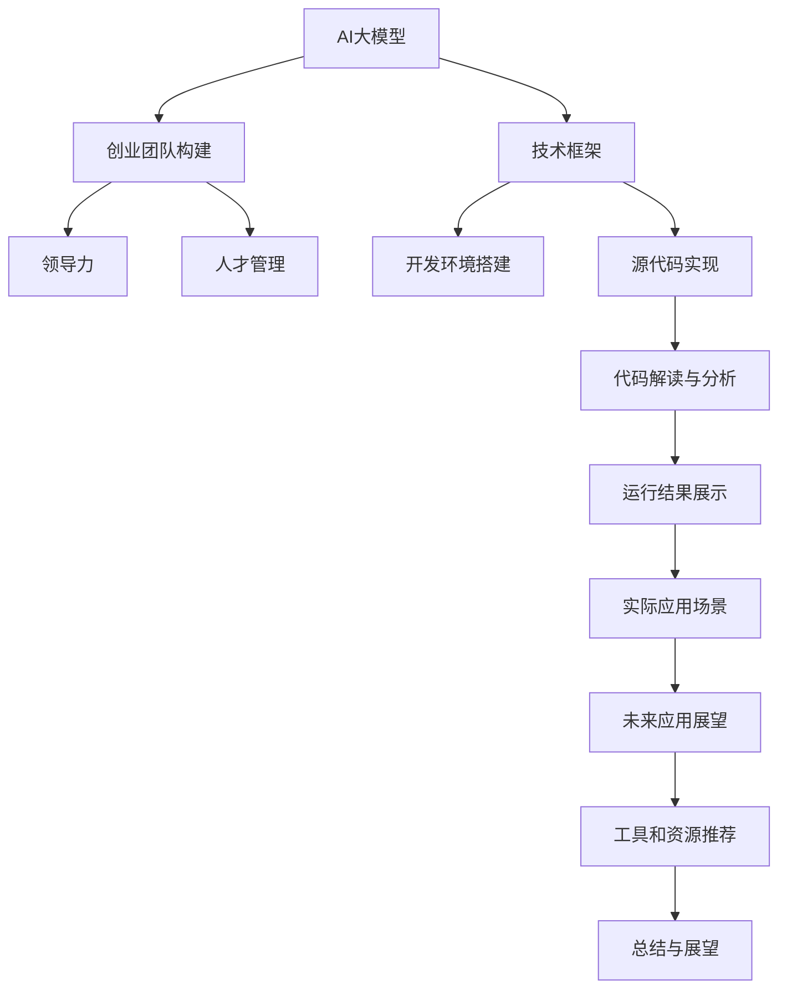

                 

# AI 大模型创业：如何构建强大的技术团队？

> 关键词：大模型创业,技术团队构建,人工智能,AI创业,技术框架,领导力,人才管理,项目规划

## 1. 背景介绍

在人工智能领域，尤其是在大模型领域，如何构建一个高效、协同、富有创新能力的技术团队，是决定企业成败的关键。当前，大模型技术已经深入到各行各业，从金融、医疗、教育到娱乐、游戏等领域都有广泛应用。然而，这些技术的复杂性和前沿性要求企业必须拥有强大的技术团队，才能真正实现商业价值的转化。本文将从多个角度，深入探讨如何构建一个高效、创新、富有竞争力的AI大模型创业团队。

## 2. 核心概念与联系

### 2.1 核心概念概述

在讨论如何构建AI大模型创业团队之前，我们先来梳理一下涉及的核心概念：

- **AI大模型**：基于深度学习的大规模预训练模型，如BERT、GPT-3、T5等，拥有强大的语言理解和生成能力。
- **创业团队构建**：根据企业目标和业务需求，筛选、招聘、培养和组织具有不同背景和技能的团队成员，构建具有协同效应、富有创新能力的技术团队。
- **技术框架**：选择合适的技术栈、工具和开发流程，使得团队能够高效、稳定地进行AI大模型的开发和维护。
- **领导力**：团队领导者具备的前瞻性思维、决策能力、沟通协调能力等，直接影响团队的工作效率和创新能力。
- **人才管理**：招聘、培训、激励、评估等方面的管理策略，保证团队成员的高效协作和持续成长。

这些概念之间的联系可以通过以下Mermaid流程图来展示：



这个流程图展示了AI大模型创业技术团队构建的主要环节和过程。AI大模型作为核心资产，通过技术框架和人才管理，在创业团队的协作下，实现从理论到实际应用的转化。

## 3. 核心算法原理 & 具体操作步骤

### 3.1 算法原理概述

构建一个高效、创新的AI大模型创业团队，首先需要理解相关的算法原理。对于大模型的开发，以下是核心步骤：

1. **数据预处理**：收集、清洗、标注数据，准备模型训练集。
2. **模型设计**：选择合适的模型架构，如Transformer、BERT等，设计网络结构和训练策略。
3. **模型训练**：在大规模分布式计算平台上进行模型训练，优化模型参数，提升性能。
4. **模型评估**：在验证集上评估模型效果，调整参数和策略，优化模型。
5. **模型部署**：将训练好的模型部署到生产环境，进行实时推理和调用。

### 3.2 算法步骤详解

以下是一个典型的AI大模型开发流程，其中每个步骤都涉及核心算法原理和具体操作步骤：

1. **数据预处理**
   - **数据收集**：从各种数据源（如公开数据集、API接口、内部数据等）收集数据。
   - **数据清洗**：去除噪声和无关数据，保证数据质量。
   - **数据标注**：根据业务需求，标注数据集，用于模型训练。

2. **模型设计**
   - **选择模型架构**：根据任务需求，选择合适的模型架构（如BERT、GPT-3等）。
   - **设计网络结构**：定义模型的输入、输出和中间层结构。
   - **确定训练策略**：设置学习率、批大小、优化器等训练参数。

3. **模型训练**
   - **搭建计算平台**：使用分布式计算框架（如TensorFlow、PyTorch）搭建计算平台。
   - **进行模型训练**：使用训练集数据，在计算平台上进行模型训练。
   - **监控模型性能**：通过可视化工具监控训练过程，及时调整参数。

4. **模型评估**
   - **评估指标选择**：根据任务需求，选择合适的评估指标（如准确率、召回率、F1-score等）。
   - **验证集测试**：在验证集上测试模型，计算评估指标。
   - **模型优化**：根据评估结果，调整模型参数和训练策略。

5. **模型部署**
   - **模型保存**：将训练好的模型保存为标准格式，便于部署。
   - **模型部署**：将模型部署到生产环境，进行实时推理。
   - **性能监控**：监控模型的推理性能，确保服务稳定。

### 3.3 算法优缺点

构建AI大模型创业团队时，我们需要对核心算法原理进行全面评估，了解其优缺点：

**优点**：
- **高效性**：大模型架构设计合理，能够高效地进行数据处理和计算。
- **灵活性**：模型架构可扩展性强，能够适应不同任务和数据集。
- **泛化能力**：经过大规模数据训练，模型具备较强的泛化能力，能够应对多样化的应用场景。

**缺点**：
- **数据依赖性强**：大模型训练需要大量高质量数据，数据采集和标注成本较高。
- **计算资源需求大**：模型训练和推理需要大量计算资源，设备成本较高。
- **模型复杂性高**：模型结构复杂，维护和优化难度较大。

### 3.4 算法应用领域

AI大模型技术在多个领域都有广泛应用，包括但不限于：

- **自然语言处理（NLP）**：文本分类、情感分析、问答系统、机器翻译等。
- **计算机视觉（CV）**：图像识别、物体检测、图像生成等。
- **语音识别（ASR）**：语音转文本、语音合成等。
- **推荐系统**：个性化推荐、广告投放优化等。
- **医疗健康**：疾病诊断、健康监测等。
- **金融科技**：风险评估、欺诈检测等。

## 4. 数学模型和公式 & 详细讲解 & 举例说明

### 4.1 数学模型构建

大模型通常基于深度神经网络架构，如图像识别中的卷积神经网络（CNN）和自然语言处理中的循环神经网络（RNN）和Transformer网络。以下是一个典型的Transformer模型的架构：

- **输入层**：将原始数据（如图像、文本等）转化为网络可以处理的形式。
- **编码器层**：包含多个自注意力层和前馈神经网络层，提取数据的特征表示。
- **解码器层**：包含多个自注意力层和前馈神经网络层，根据输入生成输出。
- **输出层**：将生成的特征转化为最终的输出结果。

### 4.2 公式推导过程

以BERT模型为例，其预训练任务主要包括遮蔽语言模型（Masked Language Modeling, MLM）和下一句预测任务（Next Sentence Prediction, NSP）。公式如下：

- **MLM**：在文本中随机选择一段，将其部分单词遮蔽，模型需要预测被遮蔽的单词。
  $$
  \mathcal{L}_{\text{MLM}}(x,y) = -\sum_{i=1}^n\sum_{k=1}^m y_{ik}\log p_{ik}
  $$
- **NSP**：给定两个句子，模型需要判断它们是否是连续的。
  $$
  \mathcal{L}_{\text{NSP}}(x,y) = -\sum_{i=1}^n y_i \log p_i
  $$

### 4.3 案例分析与讲解

以下是一个基于BERT模型的情感分析项目：

- **数据集**：收集电影评论数据集，用于训练和验证情感分类模型。
- **模型设计**：使用BERT作为预训练模型，在其顶部添加一个全连接层进行情感分类。
- **训练过程**：将数据集分为训练集和验证集，在GPU上使用Adam优化器进行训练，学习率为1e-5。
- **评估结果**：在验证集上测试模型性能，F1-score达到0.92，说明模型具有较高的分类准确率。

## 5. 项目实践：代码实例和详细解释说明

### 5.1 开发环境搭建

构建AI大模型创业团队时，开发环境搭建是关键步骤。以下是开发环境的搭建流程：

1. **选择合适的计算平台**：根据计算需求，选择GPU、TPU等高性能计算平台。
2. **安装开发工具**：安装Python、TensorFlow、PyTorch等深度学习框架。
3. **配置环境变量**：设置环境变量，确保开发环境稳定。

### 5.2 源代码详细实现

以BERT情感分类项目为例，以下是关键代码实现：

```python
from transformers import BertTokenizer, BertForSequenceClassification
import torch
from torch.utils.data import DataLoader
from torch.nn import CrossEntropyLoss

# 初始化模型和tokenizer
tokenizer = BertTokenizer.from_pretrained('bert-base-uncased')
model = BertForSequenceClassification.from_pretrained('bert-base-uncased', num_labels=2)

# 定义损失函数和优化器
loss_fn = CrossEntropyLoss()
optimizer = AdamW(model.parameters(), lr=1e-5)

# 数据预处理
def tokenize(text):
    return tokenizer.encode(text, add_special_tokens=True)

# 定义训练函数
def train_epoch(model, dataset, batch_size, optimizer):
    model.train()
    for batch in DataLoader(dataset, batch_size=batch_size, shuffle=True):
        input_ids = torch.tensor(tokenize(batch['text']))
        attention_mask = torch.tensor([[1] * len(input_ids)])
        labels = torch.tensor(batch['label'])
        optimizer.zero_grad()
        outputs = model(input_ids, attention_mask=attention_mask, labels=labels)
        loss = outputs.loss
        loss.backward()
        optimizer.step()

# 定义评估函数
def evaluate(model, dataset, batch_size):
    model.eval()
    preds, labels = [], []
    for batch in DataLoader(dataset, batch_size=batch_size):
        input_ids = torch.tensor(tokenize(batch['text']))
        attention_mask = torch.tensor([[1] * len(input_ids)])
        labels = torch.tensor(batch['label'])
        outputs = model(input_ids, attention_mask=attention_mask)
        preds.append(outputs.logits.argmax(dim=1).tolist())
        labels.append(labels.tolist())
    return preds, labels

# 训练和评估
train_loader = DataLoader(train_dataset, batch_size=16)
dev_loader = DataLoader(dev_dataset, batch_size=16)

for epoch in range(3):
    train_epoch(model, train_loader, 16, optimizer)
    preds, labels = evaluate(model, dev_loader, 16)
    print(classification_report(labels, preds))
```

### 5.3 代码解读与分析

上述代码实现了BERT模型的情感分类任务。关键点包括：

- **数据预处理**：使用BertTokenizer将文本转化为模型可以处理的格式。
- **模型训练**：在训练集上使用Adam优化器进行模型训练。
- **模型评估**：在验证集上测试模型性能，使用classification_report计算评估指标。

## 6. 实际应用场景

### 6.1 智能客服系统

智能客服系统是一个典型的AI大模型应用场景。智能客服可以7x24小时不间断工作，快速响应客户咨询，提供精准、个性化的服务。以下是一个基于大模型的智能客服系统的应用示例：

1. **数据收集**：收集历史客服对话记录，将其标注为问题和答案对。
2. **模型训练**：使用BERT等大模型作为预训练模型，在其顶部添加分类器进行问题匹配和答案生成。
3. **部署上线**：将训练好的模型部署到生产环境，实现实时对话交互。

### 6.2 金融舆情监测

金融舆情监测是大模型在金融领域的一个重要应用。通过实时监测网络舆情，可以有效识别市场风险，保障金融稳定。以下是一个基于大模型的金融舆情监测系统：

1. **数据收集**：收集金融领域的新闻、评论、社交媒体等数据。
2. **模型训练**：使用BERT等大模型进行情感分析和主题分类。
3. **风险预警**：根据模型输出，及时预警金融风险。

### 6.3 个性化推荐系统

个性化推荐系统是大模型在电商、内容推荐等领域的重要应用。通过推荐系统，可以提升用户体验，增加用户粘性。以下是一个基于大模型的个性化推荐系统：

1. **数据收集**：收集用户行为数据、商品描述等文本数据。
2. **模型训练**：使用BERT等大模型进行用户兴趣预测。
3. **推荐服务**：根据用户兴趣，推荐相关商品或内容。

### 6.4 未来应用展望

未来，AI大模型的应用场景将进一步扩展，涵盖更多行业和领域。以下是一些未来应用展望：

1. **医疗健康**：通过大模型进行疾病诊断、健康监测等。
2. **智慧城市**：通过大模型进行交通管理、环境保护等。
3. **教育培训**：通过大模型进行个性化学习、智能评估等。
4. **游戏娱乐**：通过大模型进行虚拟场景生成、角色对话等。

## 7. 工具和资源推荐

### 7.1 学习资源推荐

构建AI大模型创业团队，需要掌握多种技术和工具。以下是一些推荐的学习资源：

1. **深度学习框架**：
   - TensorFlow：Google开发的深度学习框架，支持分布式计算。
   - PyTorch：Facebook开发的深度学习框架，灵活性和易用性较好。
   - Keras：高层API，易于上手，适合快速开发。

2. **大模型资源**：
   - HuggingFace Transformers库：提供了多种预训练模型，易于集成和使用。
   - OpenAI GPT-3模型：在大规模自然语言处理任务上表现优异。
   - Stanford NLP工具库：提供了丰富的自然语言处理工具和数据集。

3. **在线课程**：
   - Coursera的《Deep Learning Specialization》：由Andrew Ng教授主讲，涵盖了深度学习的基本原理和实践。
   - Udacity的《AI Nanodegree》：由多个深度学习专家共同讲授，涵盖深度学习各领域的知识。

### 7.2 开发工具推荐

构建AI大模型创业团队时，开发工具的选择至关重要。以下是一些推荐的开发工具：

1. **集成开发环境**：
   - Jupyter Notebook：支持多种编程语言，适合快速原型开发。
   - Visual Studio Code：支持多种插件，方便代码管理和调试。

2. **版本控制工具**：
   - Git：版本控制必备工具，方便团队协作和代码管理。
   - GitHub/GitLab：在线代码托管平台，支持团队协作和项目管理。

3. **性能监控工具**：
   - TensorBoard：TensorFlow的可视化工具，用于监控模型训练和推理性能。
   - Prometheus/Grafana：开源监控系统，支持多种数据源和图表展示。

### 7.3 相关论文推荐

以下是一些相关领域的经典论文，推荐阅读：

1. **深度学习框架**：
   - Alex Krizhevsky等人的《ImageNet Classification with Deep Convolutional Neural Networks》：开创性工作，推动了深度学习在图像识别领域的应用。
   - Ian Goodfellow等人的《Generative Adversarial Nets》：提出了生成对抗网络（GAN），开创了生成模型的新范式。

2. **大模型资源**：
   - BERT论文：《BERT: Pre-training of Deep Bidirectional Transformers for Language Understanding》，提出了BERT模型，刷新了多项NLP任务SOTA。
   - GPT-3论文：《Language Models are Unsupervised Multitask Learners》，展示了GPT-3在大规模自然语言处理任务上的强大能力。

3. **在线课程**：
   - Coursera的《Deep Learning Specialization》：由Andrew Ng教授主讲，涵盖了深度学习的基本原理和实践。
   - Udacity的《AI Nanodegree》：由多个深度学习专家共同讲授，涵盖深度学习各领域的知识。

## 8. 总结：未来发展趋势与挑战

### 8.1 研究成果总结

本文从多个角度探讨了如何构建AI大模型创业团队。大模型技术在各领域的应用已逐步成熟，为人工智能的发展带来了新的动力。然而，在技术发展的同时，也面临着诸多挑战。

### 8.2 未来发展趋势

未来，AI大模型技术将继续快速发展，主要趋势包括：

1. **模型规模增大**：随着计算资源和数据规模的扩大，模型规模将进一步增大，性能将进一步提升。
2. **应用场景拓展**：AI大模型将应用于更多领域，如医疗、智慧城市、教育等，推动各行各业的数字化转型。
3. **跨领域融合**：AI大模型将与其他人工智能技术进行深度融合，推动多模态智能系统的发展。
4. **隐私与安全**：随着数据隐私和安全问题的日益突出，AI大模型需要引入隐私保护和安全性技术。

### 8.3 面临的挑战

构建AI大模型创业团队，面临着诸多挑战：

1. **数据获取和标注**：数据采集和标注成本较高，难以大规模获取高质量数据。
2. **计算资源需求大**：模型训练和推理需要大量计算资源，设备成本较高。
3. **模型复杂性高**：模型结构复杂，维护和优化难度较大。
4. **隐私与安全**：模型训练和应用过程中需要处理大量敏感数据，隐私和安全问题亟需解决。

### 8.4 研究展望

未来，AI大模型技术的研究方向将包括：

1. **无监督学习和半监督学习**：探索在数据量不足的情况下进行模型训练的方法，降低对标注数据的依赖。
2. **跨领域迁移学习**：开发跨领域迁移学习算法，提高模型在不同领域的泛化能力。
3. **可解释性与透明度**：开发可解释性和透明度高的AI大模型，增强模型应用的可信度和可信性。
4. **模型优化与压缩**：探索模型优化和压缩技术，提高模型的推理速度和资源利用率。

## 9. 附录：常见问题与解答

**Q1：如何选择合适的计算平台？**

A: 根据计算需求选择计算平台。对于大规模模型训练，可以选择GPU、TPU等高性能计算平台。对于分布式计算和推理，可以选择云平台（如AWS、Google Cloud等）。

**Q2：如何选择合适的大模型架构？**

A: 根据任务需求选择合适的架构。例如，对于文本分类任务，可以选择BERT等预训练模型。对于图像识别任务，可以选择ResNet、Inception等架构。

**Q3：如何优化模型训练和推理效率？**

A: 可以采用以下方法优化模型训练和推理效率：
1. 使用分布式计算框架，加快模型训练速度。
2. 采用模型压缩和剪枝技术，减小模型参数规模。
3. 使用量化加速技术，提高模型推理速度。

**Q4：如何进行模型优化和超参数调优？**

A: 模型优化和超参数调优是模型训练的重要环节。可以采用以下方法：
1. 使用自动化超参数调优工具，如Hyperopt、Ray Tune等。
2. 采用模型蒸馏技术，减少模型复杂性。
3. 引入正则化和Dropout技术，防止过拟合。

---

作者：禅与计算机程序设计艺术 / Zen and the Art of Computer Programming

