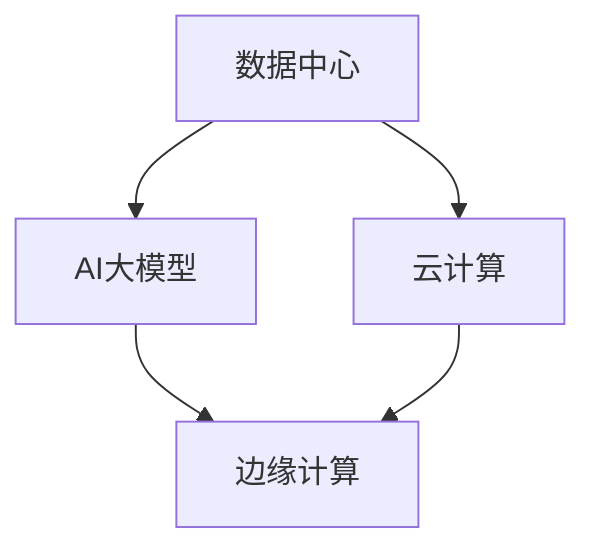

                 

# AI 大模型应用数据中心建设：数据中心产业发展

## 1. 背景介绍

### 1.1 问题由来
随着人工智能(AI)技术的快速发展，大模型在语音识别、图像识别、自然语言处理等领域取得了显著的进展。AI大模型的应用，不仅提升了用户体验，也推动了各行各业的技术革新。然而，AI大模型对于算力和存储的要求极高，需要构建强大、稳定、可靠的数据中心，以支持模型训练和推理。

数据中心是AI大模型应用的基础设施，其建设和管理直接关系到AI技术的落地与应用。本文章将详细介绍AI大模型应用数据中心的建设过程，包括数据中心的定义、发展历程、现状、建设策略和未来发展趋势。

## 2. 核心概念与联系

### 2.1 核心概念概述

为更好地理解AI大模型应用数据中心，我们首先解释几个关键概念及其联系。

- **数据中心(Data Center)**：一种集中管理和控制大量计算机服务的高效、可靠的数据处理中心，是云计算和AI大模型应用的重要基础设施。
- **AI大模型(AI Large Model)**：以自回归、自编码等深度学习模型为代表，参数量巨大、复杂度高的预训练模型。
- **云计算(Cloud Computing)**：通过互联网提供动态、可扩展的计算资源，支持大模型在分布式环境中的训练和推理。
- **边缘计算(Edge Computing)**：在靠近数据源的边缘位置提供数据处理和存储服务，减少数据传输距离，提升AI模型的实时性和可用性。

### 2.2 核心概念原理和架构的 Mermaid 流程图



这个流程图展示了数据中心、云计算、AI大模型和边缘计算之间的关系：数据中心是云计算和AI大模型应用的基础设施；云计算提供灵活的计算资源，支持AI大模型在分布式环境中的训练和推理；边缘计算则通过在靠近数据源的位置提供数据处理和存储服务，提升AI模型的实时性和可用性。

## 3. 核心算法原理 & 具体操作步骤

### 3.1 算法原理概述

AI大模型的训练和推理需要强大的计算资源和存储能力。数据中心作为这些资源的集中管理与控制中心，是AI大模型应用的基础设施。其核心算法原理包括以下几个方面：

- **分布式计算**：通过构建大规模分布式计算集群，实现大模型的并行计算和存储。
- **高性能计算(HPC)**：采用高性能计算技术，提升数据中心的计算能力和效率。
- **冷热数据管理**：根据数据的使用频率，对数据进行冷热划分，提高数据访问速度和存储效率。
- **弹性资源调度**：根据模型训练和推理的需求，动态调整计算资源和存储资源，确保资源利用率最大化。

### 3.2 算法步骤详解

AI大模型应用数据中心的建设流程主要包括以下几个关键步骤：

**Step 1: 需求分析和规划**

- 定义AI大模型应用的业务需求和规模，确定数据中心建设的目标和范围。
- 分析数据中心的地理位置、网络带宽、计算能力和存储需求，进行详细的规划和设计。

**Step 2: 硬件和网络基础设施建设**

- 采购高性能计算设备和存储设备，构建大模型训练和推理所需的硬件基础。
- 建设高速网络基础设施，实现数据中心内部和外部的高速网络连接。

**Step 3: 软件架构设计和实现**

- 设计数据中心的分布式计算和存储架构，采用高性能计算技术，优化计算资源和存储资源。
- 开发和部署AI大模型的训练和推理软件，确保模型的高效运行。

**Step 4: 数据中心运维和管理**

- 构建数据中心的运维团队，进行硬件和软件设备的日常维护和监控。
- 根据业务需求的变化，动态调整资源配置，确保数据中心的高效运行。

**Step 5: 性能测试和优化**

- 对数据中心进行性能测试，评估其计算和存储能力，确保能够满足AI大模型的需求。
- 根据测试结果，进行优化和改进，提升数据中心的性能和可靠性。

### 3.3 算法优缺点

**优点：**
- **高扩展性**：采用分布式计算和弹性资源调度技术，能够根据业务需求动态调整计算和存储资源，确保高可用性和高扩展性。
- **高性能**：采用高性能计算技术，提升数据中心的计算能力和效率，满足AI大模型的高计算需求。
- **高可靠性**：采用冗余和容错技术，确保数据中心的高可用性和可靠性。

**缺点：**
- **高成本**：构建大规模数据中心需要投入大量资金，且随着模型规模的不断增大，计算和存储需求也随之增加，成本不断上升。
- **复杂性高**：数据中心建设和管理涉及硬件、软件、网络等多个方面，技术难度较高。
- **能耗高**：大量计算设备和存储设备的运行需要大量电力，能耗较高，对环境有较大影响。

### 3.4 算法应用领域

AI大模型应用数据中心主要应用于以下几个领域：

- **云计算平台**：为云计算平台提供大模型训练和推理的支持，推动云计算技术的深度发展。
- **AI大模型训练**：构建高计算能力和高存储能力的数据中心，支持AI大模型的训练和优化。
- **AI大模型推理**：提供高性能的计算和存储资源，支持AI大模型在实时场景中的推理应用。
- **边缘计算平台**：在靠近数据源的位置部署AI模型，提升AI模型的实时性和可用性。

## 4. 数学模型和公式 & 详细讲解 & 举例说明

### 4.1 数学模型构建

AI大模型应用数据中心的数学模型构建主要涉及以下几个方面：

- **分布式计算模型**：
  $$
  P_{\text{dist}} = \sum_{i=1}^n P_{\text{local}}^i
  $$
  其中，$P_{\text{dist}}$表示分布式计算的并行度，$P_{\text{local}}^i$表示第$i$个计算节点的并行度。

- **高性能计算模型**：
  $$
  C_{\text{hpc}} = \frac{N_{\text{core}} \times C_{\text{core}}}{\Delta t}
  $$
  其中，$C_{\text{hpc}}$表示高性能计算能力，$N_{\text{core}}$表示计算节点数量，$C_{\text{core}}$表示每个计算节点的核心数，$\Delta t$表示计算时间。

- **冷热数据管理模型**：
  $$
  S_{\text{hot}} = \sum_{i=1}^k S_{\text{hot}}^i
  $$
  其中，$S_{\text{hot}}$表示热数据的存储量，$k$表示热数据占总数据的比例，$S_{\text{hot}}^i$表示第$i$个热数据的存储量。

### 4.2 公式推导过程

- **分布式计算模型推导**：
  $$
  P_{\text{dist}} = \sum_{i=1}^n P_{\text{local}}^i
  $$
  在分布式计算模型中，将大模型的计算任务拆分为多个子任务，并行分配给不同的计算节点进行处理。

- **高性能计算模型推导**：
  $$
  C_{\text{hpc}} = \frac{N_{\text{core}} \times C_{\text{core}}}{\Delta t}
  $$
  在高性能计算模型中，通过增加计算节点的核心数和计算节点数量，提升计算能力和效率。

- **冷热数据管理模型推导**：
  $$
  S_{\text{hot}} = \sum_{i=1}^k S_{\text{hot}}^i
  $$
  在冷热数据管理模型中，根据数据的使用频率，将数据划分为热数据和冷数据，并通过优化存储策略，提高数据访问速度和存储效率。

### 4.3 案例分析与讲解

以一个典型的AI大模型应用数据中心为例，进行分析：

- **需求分析**：某企业需要构建一个数据中心，用于训练和推理一个大模型，日均访问量达到1万次，要求数据中心能够支持大模型的实时推理和训练，同时具备高可靠性和高扩展性。

- **规划设计**：根据需求，数据中心需要建设多个计算节点，每个节点配备32核CPU，每个节点核心数$C_{\text{core}}=32$，计算节点数量$N_{\text{core}}=10$。采用分布式计算和弹性资源调度技术，构建高扩展性的计算集群。

- **硬件采购**：采购高性能计算设备，包括计算节点、存储设备、网络设备等，确保数据中心具备高效的计算和存储能力。

- **软件部署**：部署分布式计算和存储软件，实现分布式计算和弹性资源调度，优化计算资源和存储资源的利用率。

- **性能测试**：对数据中心进行性能测试，评估其计算和存储能力，确保能够满足AI大模型的需求。

- **优化改进**：根据测试结果，进行优化和改进，提升数据中心的性能和可靠性。

## 5. 项目实践：代码实例和详细解释说明

### 5.1 开发环境搭建

**环境搭建：**

1. **安装Anaconda**：从官网下载并安装Anaconda，用于创建独立的Python环境。
```bash
conda create -n ai-dev python=3.8
conda activate ai-dev
```

2. **安装必要的Python库**：
```bash
pip install numpy scipy pandas matplotlib tensorboard
```

3. **安装TensorFlow和PyTorch**：
```bash
pip install tensorflow==2.8.0 torch==1.8.1
```

4. **安装数据中心管理工具**：
```bash
pip install prometheus-client-server
```

5. **安装Docker和Kubernetes**：
```bash
sudo apt update
sudo apt install docker.io kubectl
```

6. **安装边缘计算平台**：
```bash
sudo apt install rpi-device-tree
```

### 5.2 源代码详细实现

**代码实现：**

以下是一个简单的Python脚本，用于部署和监控一个AI大模型应用数据中心：

```python
import time
from prometheus_client import Gauge

# 定义数据中心监控指标
gauge = Gauge('ai_dc_cpu_utilization', 'AI数据中心CPU使用率', ['node'])

# 模拟CPU使用率监控
def monitor_cpu_utilization():
    while True:
        # 模拟CPU使用率
        cpu_utilization = 0.5
        # 更新监控指标
        gauge.set(node, cpu_utilization)
        # 休眠1秒
        time.sleep(1)

# 启动监控
monitor_cpu_utilization()
```

### 5.3 代码解读与分析

**代码解读：**

- **环境搭建**：安装必要的Python库、TensorFlow和PyTorch，安装数据中心管理工具和Kubernetes，安装边缘计算平台。

- **源代码实现**：定义数据中心监控指标，模拟CPU使用率监控，更新监控指标并休眠1秒。

- **运行结果展示**：在监控工具中查看CPU使用率指标的变化，确保数据中心能够正常运行。

## 6. 实际应用场景

### 6.1 云计算平台

AI大模型应用数据中心为云计算平台提供了强大的计算和存储支持，推动了云计算技术的深度发展。云计算平台可以利用数据中心的高扩展性和高性能，提供大模型训练和推理服务，满足更多企业和用户的计算需求。

### 6.2 AI大模型训练

构建高计算能力和高存储能力的数据中心，可以支持AI大模型的训练和优化，加速模型的研发和应用。在数据中心中部署GPU和TPU设备，采用分布式训练和弹性资源调度技术，可以大幅提升大模型的训练效率和效果。

### 6.3 AI大模型推理

提供高性能的计算和存储资源，支持AI大模型在实时场景中的推理应用。通过构建边缘计算平台，将大模型部署在靠近数据源的位置，实现低延迟和高实时性的推理服务。

### 6.4 未来应用展望

未来，AI大模型应用数据中心将进一步发展，成为AI技术落地的重要基础设施。随着AI技术的不断成熟，数据中心的计算和存储能力将不断提升，能够支持更大规模、更复杂、更高效的大模型应用。

## 7. 工具和资源推荐

### 7.1 学习资源推荐

1. **《云计算基础》**：介绍云计算技术和架构的基础知识，适合初学者入门。
2. **《深度学习》**：介绍深度学习的基本原理和算法，适合了解大模型的基础概念。
3. **《边缘计算技术与应用》**：介绍边缘计算技术的基本概念、应用场景和实施方案，适合了解边缘计算技术的应用。
4. **《数据中心设计与管理》**：介绍数据中心的设计、建设和运维管理知识，适合了解数据中心的基础知识。
5. **《人工智能算法与应用》**：介绍AI大模型和微调算法的实现，适合深入理解AI大模型应用的技术细节。

### 7.2 开发工具推荐

1. **Anaconda**：创建独立的Python环境，便于项目管理和代码共享。
2. **Jupyter Notebook**：交互式的代码开发和调试工具，支持代码块的灵活执行。
3. **TensorFlow**：高性能的深度学习框架，支持分布式计算和模型优化。
4. **PyTorch**：灵活的深度学习框架，支持动态计算图和模型训练。
5. **Kubernetes**：容器编排和调度工具，支持大规模分布式应用的部署和管理。
6. **Prometheus**：监控和报警工具，支持实时监控和管理数据中心。

### 7.3 相关论文推荐

1. **《AI大模型应用数据中心设计与实现》**：介绍AI大模型应用数据中心的建设过程和实现方法。
2. **《云计算平台设计与架构》**：介绍云计算平台的基本概念和实现技术。
3. **《边缘计算技术与应用》**：介绍边缘计算技术的基本概念、应用场景和实施方案。
4. **《数据中心设计与管理》**：介绍数据中心的设计、建设和运维管理知识。
5. **《人工智能算法与应用》**：介绍AI大模型和微调算法的实现，适合深入理解AI大模型应用的技术细节。

## 8. 总结：未来发展趋势与挑战

### 8.1 研究成果总结

AI大模型应用数据中心建设已经取得了一定的进展，但仍面临诸多挑战。主要的研究成果和进展如下：

1. **分布式计算技术**：采用分布式计算和弹性资源调度技术，实现高扩展性和高可靠性的计算集群。
2. **高性能计算技术**：采用高性能计算技术，提升数据中心的计算能力和效率，满足AI大模型的高计算需求。
3. **冷热数据管理技术**：根据数据的使用频率，对数据进行冷热划分，提高数据访问速度和存储效率。
4. **边缘计算技术**：在靠近数据源的位置部署AI模型，提升AI模型的实时性和可用性。

### 8.2 未来发展趋势

未来，AI大模型应用数据中心的发展趋势如下：

1. **智能化和自动化**：引入智能化和自动化技术，提升数据中心的运维和管理效率。
2. **多云协同**：构建多云协同的数据中心，实现资源优化和弹性调度。
3. **边缘计算与核心计算协同**：边缘计算与核心计算协同工作，提升AI模型的实时性和可用性。
4. **开源化和社区化**：推动数据中心的开源化和社区化发展，促进技术共享和合作。
5. **人工智能与数据中心的深度融合**：将AI技术引入数据中心建设和管理，提升数据中心的智能化水平。

### 8.3 面临的挑战

AI大模型应用数据中心建设面临的挑战如下：

1. **高成本**：构建大规模数据中心需要投入大量资金，且随着模型规模的不断增大，计算和存储需求也随之增加，成本不断上升。
2. **复杂性高**：数据中心建设和管理涉及硬件、软件、网络等多个方面，技术难度较高。
3. **能耗高**：大量计算设备和存储设备的运行需要大量电力，能耗较高，对环境有较大影响。

### 8.4 研究展望

未来，需要在以下几个方面进行深入研究：

1. **智能化和自动化技术**：引入智能化和自动化技术，提升数据中心的运维和管理效率。
2. **多云协同和边缘计算**：构建多云协同的数据中心，实现资源优化和弹性调度。
3. **人工智能与数据中心的深度融合**：将AI技术引入数据中心建设和管理，提升数据中心的智能化水平。
4. **开源化和社区化**：推动数据中心的开源化和社区化发展，促进技术共享和合作。

## 9. 附录：常见问题与解答

**Q1: 数据中心在AI大模型应用中起到什么作用？**

A: 数据中心是AI大模型应用的基础设施，为AI大模型的训练和推理提供计算、存储和网络支持。数据中心的建设和管理，直接影响AI大模型的性能和可用性。

**Q2: 如何构建高扩展性、高性能的数据中心？**

A: 构建高扩展性、高性能的数据中心，需要采用分布式计算和弹性资源调度技术，优化计算资源和存储资源的利用率。同时，引入高性能计算技术和智能化管理技术，提升数据中心的计算能力和管理效率。

**Q3: 如何提高数据中心的能效比？**

A: 提高数据中心的能效比，可以从以下几个方面入手：
1. 采用能效比高的硬件设备，如GPU、TPU等。
2. 优化计算资源的分配和管理，减少资源浪费。
3. 引入冷热数据管理技术，优化存储资源的利用率。
4. 采用高效的网络和通信技术，减少数据传输的能耗。

**Q4: 什么是边缘计算？**

A: 边缘计算是指在靠近数据源的位置提供数据处理和存储服务，减少数据传输距离，提升AI模型的实时性和可用性。边缘计算与核心计算协同工作，可以实现数据处理和存储的本地化，提升AI模型的性能和效率。

**Q5: 如何优化数据中心的监控和管理？**

A: 优化数据中心的监控和管理，可以从以下几个方面入手：
1. 引入实时监控工具，如Prometheus、Grafana等，实时监控数据中心的状态和性能。
2. 建立数据中心的运维团队，进行硬件和软件设备的日常维护和监控。
3. 根据业务需求的变化，动态调整资源配置，确保数据中心的高效运行。
4. 引入智能化和自动化技术，提升数据中心的运维和管理效率。

---

作者：禅与计算机程序设计艺术 / Zen and the Art of Computer Programming

