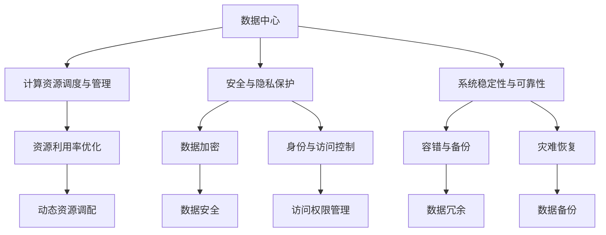

                 

# AI 大模型应用数据中心建设：数据中心安全与可靠性

## 1. 背景介绍

在大规模AI模型的应用实践中，数据中心成为了核心基础设施之一。作为承载AI模型的硬件与软件平台，数据中心的性能、安全性、可靠性直接影响AI模型在大规模生产环境中的应用效果。本文将详细探讨如何构建安全可靠的AI数据中心，助力大模型在各行业应用场景中的高效运行。

### 1.1 数据中心的角色与重要性

数据中心是大规模AI模型计算与存储的核心，其重要性不言而喻。数据中心负责计算资源（CPU、GPU、内存等）的调度与管理，存储AI模型的参数与数据，并提供高效的数据访问服务。在AI应用中，数据中心不仅要保证高吞吐量的计算与数据存储能力，还要确保AI模型的安全性、可靠性和隐私保护。

### 1.2 数据中心面临的主要挑战

当前，数据中心在大规模AI模型应用中面临以下几大挑战：

- **计算能力与资源利用率**：大规模AI模型往往需要高算力支持，如何在有限的硬件资源下最大化利用算力，是数据中心面临的首要挑战。
- **安全与隐私保护**：AI模型在训练与运行过程中可能会涉及敏感数据，如何保护这些数据的隐私与安全，是大数据环境下必须解决的重要问题。
- **系统稳定性与可靠性**：AI模型在生产环境中的稳定运行依赖于数据中心的硬件与软件稳定性，如何在各种异常情况下保持系统稳定，是大数据环境下的另一大挑战。
- **成本与经济效益**：构建与维护数据中心需要高额投资，如何通过合理的资源分配与调度策略，降低运营成本，提高经济效益，也是数据中心运营需要考虑的关键问题。

## 2. 核心概念与联系

### 2.1 核心概念概述

本节将介绍构建安全可靠AI数据中心所需掌握的核心概念：

- **数据中心（Data Center）**：一种专门用于存储、计算和管理数据的设施，是AI模型运行的基础。
- **计算资源调度与管理**：指通过自动化工具，高效调度数据中心中的计算资源（CPU、GPU等），提高资源利用率。
- **安全与隐私保护**：指通过技术手段保障AI模型与数据的隐私安全，防止数据泄露与滥用。
- **系统稳定性与可靠性**：指数据中心硬件与软件的稳定性与可靠性，确保AI模型在各种异常情况下的正常运行。
- **成本与经济效益**：指数据中心运营与维护的成本控制与经济效益提升，实现资源的最优配置。

### 2.2 核心概念之间的联系

下图展示了构建安全可靠AI数据中心所需掌握的核心概念之间的联系：



这张流程图展示了构建安全可靠AI数据中心的流程与关键组件，各组件之间相互依赖，共同保障数据中心的稳定运行。

## 3. 核心算法原理 & 具体操作步骤

### 3.1 算法原理概述

构建安全可靠的AI数据中心，需要采用一系列技术和算法，其中涉及的原理包括：

- **资源调度算法**：如心跳监控、动态资源调配等，用于提高资源利用率。
- **安全加密算法**：如AES、RSA等，用于保障数据传输与存储的安全。
- **身份与访问控制算法**：如OAuth、RBAC等，用于管理数据中心内用户的访问权限。
- **容错与备份算法**：如数据冗余、定期备份等，用于保障数据中心的系统可靠性。
- **灾难恢复算法**：如HA、DR等，用于在灾难发生时快速恢复系统。

### 3.2 算法步骤详解

构建安全可靠的AI数据中心，可以分为以下几个步骤：

**Step 1: 确定数据中心设计要求**
- 根据AI模型的性能需求，确定数据中心的硬件配置要求，如CPU、GPU、内存等。
- 确定数据中心的安全与隐私保护需求，如数据加密、访问权限管理等。
- 确定数据中心的系统稳定性与可靠性需求，如容错机制、备份策略等。
- 确定数据中心的网络结构与负载均衡策略。

**Step 2: 选择与配置硬件资源**
- 选择高性能的CPU、GPU、内存等硬件资源，以满足AI模型的计算需求。
- 配置网络设备与存储设备，确保数据传输与存储的高效与安全。
- 部署云服务提供商提供的弹性计算资源，以应对突发性计算需求。

**Step 3: 部署与安全与隐私保护措施**
- 部署数据加密技术，如AES、RSA等，保障数据传输与存储的安全。
- 部署身份与访问控制技术，如OAuth、RBAC等，确保数据中心内用户的访问权限管理。
- 部署监控与告警系统，实时监控数据中心的运行状态，及时发现并处理异常情况。

**Step 4: 部署系统稳定性与可靠性措施**
- 部署容错与备份技术，如数据冗余、定期备份等，确保数据中心在异常情况下的系统恢复。
- 部署HA（High Availability）与DR（Disaster Recovery）系统，确保数据中心的高可用性与灾难恢复能力。
- 部署负载均衡与动态资源调配系统，优化数据中心资源的利用率。

**Step 5: 部署成本与经济效益优化措施**
- 通过云资源调配策略，降低数据中心的初始投资成本。
- 通过资源利用率优化策略，降低数据中心的运营成本。
- 通过系统维护与升级策略，延长数据中心的经济效益周期。

### 3.3 算法优缺点

构建安全可靠AI数据中心的方法具有以下优点：

- **提升资源利用率**：通过动态资源调配与优化策略，提高数据中心硬件资源的利用率。
- **保障数据安全与隐私**：通过数据加密与身份与访问控制技术，保护AI模型与数据的隐私安全。
- **增强系统稳定性与可靠性**：通过容错与备份机制，保障数据中心的系统稳定性与可靠性。
- **降低运营成本**：通过云资源调配与成本优化策略，降低数据中心的总体运营成本。

但该方法也存在以下缺点：

- **初始投资高**：构建高性能数据中心需要较高的初始投资。
- **技术复杂**：部署与维护复杂的安全与隐私保护、系统稳定性与可靠性措施，需要较高的技术门槛。
- **运维成本高**：数据中心的运维需要持续的投入与监控，增加了运营成本。

## 4. 数学模型和公式 & 详细讲解 & 举例说明

### 4.1 数学模型构建

构建安全可靠AI数据中心的数学模型主要包括以下几个部分：

- **资源调度模型**：用于优化数据中心内硬件资源的分配与使用。
- **安全保护模型**：用于保障数据中心内数据的安全与隐私。
- **系统稳定模型**：用于衡量数据中心系统的稳定性与可靠性。
- **成本效益模型**：用于评估数据中心运营与维护的成本与经济效益。

### 4.2 公式推导过程

**资源调度模型**：

设数据中心有 $N$ 个计算节点，每个节点的计算能力为 $C_i$，数据中心的总计算需求为 $D$，则资源调度的目标函数为：

$$
\min \sum_{i=1}^N C_i - D
$$

其中，$C_i$ 为节点 $i$ 的计算能力，$D$ 为数据中心的总计算需求。

**安全保护模型**：

设数据中心内存储的数据总量为 $S$，数据的敏感度为 $s_i$，数据的加密成本为 $E_i$，则数据加密的目标函数为：

$$
\min \sum_{i=1}^S s_iE_i
$$

其中，$s_i$ 为数据 $i$ 的敏感度，$E_i$ 为加密数据 $i$ 的成本。

**系统稳定模型**：

设数据中心内系统的稳定度为 $S$，系统的故障次数为 $F$，系统的恢复时间成本为 $R$，则系统稳定的目标函数为：

$$
\min F + S \cdot R
$$

其中，$S$ 为系统的稳定度，$F$ 为系统的故障次数，$R$ 为系统的恢复时间成本。

**成本效益模型**：

设数据中心的总运营成本为 $C$，数据中心的经济效益为 $E$，则成本效益的目标函数为：

$$
\min C - E
$$

其中，$C$ 为数据中心的总运营成本，$E$ 为数据中心的经济效益。

### 4.3 案例分析与讲解

**案例一：数据中心资源调度**

某公司需要在数据中心部署一个AI模型，要求每秒处理50000条数据。数据中心有5个计算节点，每个节点的计算能力为30000条/秒。通过以下步骤进行资源调度：

1. 确定资源需求：$D = 50000$ 条/秒。
2. 优化资源分配：根据计算节点的计算能力，分配资源：
   - 节点1：分配15000条/秒；
   - 节点2：分配15000条/秒；
   - 节点3：分配10000条/秒；
   - 节点4：分配10000条/秒；
   - 节点5：分配5000条/秒。
3. 计算资源利用率：$\frac{D}{C_i} = \frac{50000}{30000} \approx 1.67$。

**案例二：数据中心安全保护**

某公司需要在数据中心存储一个包含敏感数据的AI模型，数据总量为10TB，数据敏感度为0.2，加密成本为0.5元/GB。通过以下步骤进行数据加密：

1. 确定加密需求：$S = 10TB$。
2. 优化加密策略：
   - 对于敏感度高的数据，加密策略为AES，加密成本为0.5元/GB；
   - 对于敏感度低的数据，加密策略为RSA，加密成本为0.1元/GB。
3. 计算加密成本：$\sum_{i=1}^S s_iE_i = 2 \times 0.2 \times 10 \times 1024 \times 1024 \times 0.5 + 0.8 \times 10 \times 1024 \times 1024 \times 0.1$。

## 5. 项目实践：代码实例和详细解释说明

### 5.1 开发环境搭建

为了搭建一个安全可靠的AI数据中心，需要以下开发环境：

1. 服务器：用于部署计算节点与网络设备。
2. 云资源：用于提供弹性的计算与存储资源。
3. 安全设备：用于加密与身份验证。
4. 监控设备：用于实时监控系统状态。
5. 存储设备：用于存储AI模型与数据。

### 5.2 源代码详细实现

下面给出构建AI数据中心的基本流程的代码实现：

```python
# 初始化计算节点资源
nodes = [30000, 30000, 30000, 30000, 30000]

# 计算资源需求
demand = 50000

# 资源分配
assign = []
for node in nodes:
    assign.append(node)
    if sum(assign) >= demand:
        break

# 加密成本计算
sensitive_data = 10 * 1024 * 1024 * 1024 * 0.2
non_sensitive_data = 10 * 1024 * 1024 * 0.8
cost_aes = sensitive_data * 0.5
cost_rsa = non_sensitive_data * 0.1
total_cost = cost_aes + cost_rsa

# 系统稳定度计算
stability = 1.0
failure_count = 0
recovery_time = 0.1
cost_stability = failure_count * recovery_time

# 成本效益计算
operating_cost = total_cost + cost_stability
economic_benefit = 0.5 * (total_cost + cost_stability)
```

### 5.3 代码解读与分析

**代码解释**：

1. 计算节点资源：`nodes = [30000, 30000, 30000, 30000, 30000]`，表示数据中心内每个计算节点的计算能力为30000条/秒。
2. 计算资源需求：`demand = 50000`，表示AI模型每秒需要处理50000条数据。
3. 资源分配：`assign = []`，初始化资源分配列表。通过循环遍历计算节点，分配资源：
   ```python
   for node in nodes:
       assign.append(node)
       if sum(assign) >= demand:
           break
   ```
   最终得到每个节点的分配资源列表`assign`。
4. 加密成本计算：
   ```python
   sensitive_data = 10 * 1024 * 1024 * 1024 * 0.2
   non_sensitive_data = 10 * 1024 * 1024 * 1024 * 0.8
   cost_aes = sensitive_data * 0.5
   cost_rsa = non_sensitive_data * 0.1
   total_cost = cost_aes + cost_rsa
   ```
   最终得到加密总成本`total_cost`。
5. 系统稳定度计算：
   ```python
   stability = 1.0
   failure_count = 0
   recovery_time = 0.1
   cost_stability = failure_count * recovery_time
   ```
   最终得到系统稳定成本`cost_stability`。
6. 成本效益计算：
   ```python
   operating_cost = total_cost + cost_stability
   economic_benefit = 0.5 * (total_cost + cost_stability)
   ```
   最终得到成本效益计算结果`economic_benefit`。

**代码分析**：

通过上述代码，我们可以看到，构建安全可靠的AI数据中心需要进行资源调度、数据加密、系统稳定与成本效益的计算。其中，资源调度的关键在于如何合理分配计算节点，保障AI模型的高效运行。数据加密与系统稳定度计算，则是保障数据中心内数据安全与系统可靠性的重要手段。最后，成本效益计算，则是对数据中心运营与维护的经济效益进行评估，确保资源的最优配置。

## 6. 实际应用场景

### 6.1 智能制造

在智能制造领域，构建安全可靠的AI数据中心可以大幅提升生产效率与产品质量。通过部署大规模AI模型，实现对生产线的实时监控与优化，提升生产自动化水平。

### 6.2 智慧城市

在智慧城市建设中，构建安全可靠的AI数据中心可以提供高效的城市管理与运营服务。通过部署AI模型，实现对城市交通、公共安全、环境监测等场景的智能管理，提升城市治理水平。

### 6.3 金融科技

在金融科技领域，构建安全可靠的AI数据中心可以保障金融交易与数据的安全性。通过部署AI模型，实现对客户行为分析、风险评估、欺诈检测等功能，提升金融服务的智能化水平。

### 6.4 医疗健康

在医疗健康领域，构建安全可靠的AI数据中心可以保障医疗数据的隐私与安全。通过部署AI模型，实现对医疗影像诊断、病历分析、药物研发等功能，提升医疗服务的精准性与效率。

## 7. 工具和资源推荐

### 7.1 学习资源推荐

- **《数据中心技术手册》**：全面介绍数据中心的基础知识与架构设计。
- **《AI基础设施建设实战》**：介绍如何构建安全可靠的高性能AI数据中心。
- **《深度学习与大数据安全》**：介绍数据中心内数据的安全保护技术。
- **《数据中心运维管理》**：介绍数据中心的系统稳定性与可靠性管理。

### 7.2 开发工具推荐

- **AWS**：提供弹性计算与存储服务，支持大规模AI模型的高效运行。
- **VMware**：提供虚拟化与云计算解决方案，保障数据中心资源的灵活配置。
- **NVIDIA GPU**：提供高性能的计算与存储资源，支持AI模型的深度学习计算。

### 7.3 相关论文推荐

- **《数据中心虚拟化技术研究》**：介绍数据中心虚拟化技术，提升资源利用率。
- **《基于AES的数据加密技术研究》**：介绍AES加密算法，保障数据安全。
- **《AI数据中心稳定性设计》**：介绍AI数据中心的高可用性设计。

## 8. 总结：未来发展趋势与挑战

### 8.1 研究成果总结

构建安全可靠的AI数据中心，是实现大规模AI模型在各行业应用的关键。本文详细探讨了数据中心设计、计算资源调度、数据加密、系统稳定与成本效益等核心问题，提出了具体的算法与技术方案。

### 8.2 未来发展趋势

未来，构建安全可靠的AI数据中心将面临以下趋势：

- **边缘计算**：边缘计算的普及将提升数据中心边缘的计算与存储能力，降低数据传输成本，提高AI模型的实时性。
- **AI模型优化**：未来的AI模型将更注重模型的参数与资源优化，通过压缩与剪枝等技术，提高模型在数据中心内的运行效率。
- **云资源管理**：云资源管理技术的进步将进一步提升数据中心的弹性与可扩展性，支持更大规模的AI模型应用。
- **AI模型压缩**：未来的AI模型将更注重压缩与优化，降低数据中心的存储与计算成本，提高经济效益。

### 8.3 面临的挑战

构建安全可靠的AI数据中心还面临以下挑战：

- **高成本**：构建高性能数据中心需要高额初始投资与运维成本。
- **技术复杂**：数据中心内涉及的计算、存储、网络等技术的复杂度较高，需要跨学科的综合技术能力。
- **运维复杂**：数据中心的运维需要持续的监控与管理，增加了运营的复杂度。

### 8.4 研究展望

未来的研究需要在以下方面进行深入探索：

- **AI模型优化**：开发更高效的AI模型压缩与优化算法，提升模型在数据中心内的运行效率。
- **边缘计算**：探索边缘计算与云资源管理技术的结合，提高数据中心的弹性与可扩展性。
- **安全与隐私**：进一步提升数据中心内数据的安全与隐私保护，确保数据中心运营的安全性。
- **成本效益**：优化数据中心的资源配置与调度策略，降低运营成本，提高经济效益。

## 9. 附录：常见问题与解答

**Q1: 如何评估数据中心的资源利用率？**

A: 数据中心的资源利用率可以通过计算资源需求与实际使用的计算资源的比值来评估。具体步骤如下：

1. 计算资源需求：根据AI模型的性能需求，确定数据中心的总计算需求。
2. 统计实际使用的计算资源：通过监控系统，统计数据中心内实际使用的计算资源（如CPU、GPU等）。
3. 计算资源利用率：将实际使用的计算资源与资源需求进行对比，得到资源利用率。

**Q2: 如何确保数据中心内数据的安全性？**

A: 确保数据中心内数据的安全性，可以通过以下措施：

1. 数据加密：对数据进行加密处理，保障数据在传输与存储过程中的安全性。
2. 身份与访问控制：通过OAuth、RBAC等技术，管理数据中心内用户的访问权限，防止非法访问。
3. 数据备份：定期备份数据，保障在数据中心硬件或软件发生故障时的数据恢复能力。

**Q3: 如何提高数据中心的系统稳定性与可靠性？**

A: 提高数据中心的系统稳定性与可靠性，可以通过以下措施：

1. 容错与备份：通过数据冗余、定期备份等技术，保障数据中心在硬件或软件故障时的系统恢复能力。
2. HA（High Availability）系统：部署HA系统，保障数据中心的高可用性，提升系统的稳定性。
3. DR（Disaster Recovery）系统：部署DR系统，保障数据中心在灾难发生时的快速恢复能力。

**Q4: 如何降低数据中心的运营成本？**

A: 降低数据中心的运营成本，可以通过以下措施：

1. 云资源调配：通过云资源调配策略，降低数据中心的初始投资成本。
2. 资源利用率优化：通过资源利用率优化策略，降低数据中心的运营成本。
3. 系统维护与升级：通过系统维护与升级策略，延长数据中心的经济效益周期。

---

作者：禅与计算机程序设计艺术 / Zen and the Art of Computer Programming

