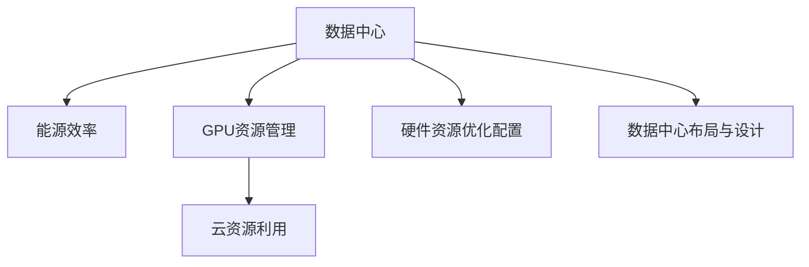

                 

# AI 大模型应用数据中心建设：数据中心成本优化

> 关键词：大模型，数据中心，成本优化，能源效率，GPU资源管理

## 1. 背景介绍

### 1.1 问题由来
近年来，人工智能大模型的应用日益广泛，从语音识别、图像处理到自然语言处理、医疗诊断等领域，大模型在推动行业创新、提升生产效率方面发挥了重要作用。然而，大规模模型的训练和应用对数据中心设施和算力资源的需求显著增加，数据中心成本的大幅提升，成为制约大模型应用普及的关键因素。

特别是对于企业级大模型应用，如超大规模深度学习模型的训练和推理，通常需要搭建专门的数据中心，这不仅涉及到大量的硬件采购和部署成本，还有高额的能源消耗。如何优化数据中心建设和管理，降低成本，提高资源利用效率，是当前大模型应用领域亟待解决的问题。

### 1.2 问题核心关键点
数据中心成本优化的核心在于如何在大模型应用的硬件资源需求和成本控制之间找到平衡。本文将探讨以下几个关键点：
- 硬件资源的优化配置
- 能源效率的提升
- GPU资源的管理
- 数据中心的布局和设计
- 云资源的高效利用

通过深入分析这些核心关键点，本文旨在为AI大模型应用的数据中心建设提供成本优化的参考方案。

## 2. 核心概念与联系

### 2.1 核心概念概述

为更好地理解数据中心成本优化，本节将介绍几个密切相关的核心概念：

- 数据中心(Data Center, DC)：由计算、存储、网络等硬件设施和相关软件构成的物理设施，用于部署和运行大模型等计算密集型应用。
- 能源效率(Energy Efficiency)：数据中心的能源消耗与其输出（计算能力）之比，是衡量数据中心性能的重要指标。
- GPU资源管理：GPU（图形处理单元）是大模型训练和推理中的重要计算资源，合理管理和调度GPU资源，可以显著提升数据中心的计算效率和资源利用率。
- 云资源利用：随着云计算的普及，企业可以选择将部分计算任务转移到云平台，以降低本地数据中心的建设和运营成本。

这些核心概念之间的逻辑关系可以通过以下Mermaid流程图来展示：



这个流程图展示了数据中心核心概念及其之间的关系：

1. 数据中心是硬件资源的载体。
2. 能源效率和大规模算力需求密切相关。
3. GPU资源是大模型应用的核心计算资源。
4. 云资源是降低本地数据中心成本的有效手段。
5. 硬件资源优化和数据中心设计直接影响到整体成本和性能。

这些概念共同构成了数据中心成本优化的基础框架，通过提升能源效率、优化GPU资源、选择合适的云资源等手段，实现成本的合理控制和性能的持续提升。

## 3. 核心算法原理 & 具体操作步骤

### 3.1 算法原理概述

数据中心成本优化涉及多方面的因素，包括硬件资源的配置、能源使用效率的提升、GPU资源的有效管理、云资源的合理利用等。其核心思想是通过一系列算法和技术手段，对上述关键因素进行综合优化，使得数据中心在大模型应用中的总成本最小化，同时保证系统的高效运行和性能。

### 3.2 算法步骤详解

基于上述原理，优化数据中心成本的主要步骤如下：

**Step 1: 硬件资源需求评估**
- 分析大模型应用场景，评估所需的计算资源和内存大小。
- 根据模型大小、复杂度、数据规模等因素，确定GPU、CPU、存储等硬件资源需求。
- 考虑到数据中心扩展性和可维护性，合理规划数据中心的硬件配置。

**Step 2: 能源效率优化**
- 采用先进的散热技术和能源管理系统，如液冷技术、智能调温策略，降低能耗。
- 通过优化电力基础设施，如使用节能型UPS、高效电源模块，降低数据中心能耗。
- 采用能源监控和管理系统，实时监测和调整能源使用情况，避免过度消耗。

**Step 3: GPU资源管理**
- 采用资源调度算法，如动态资源分配、优先级调度等，平衡GPU负载。
- 通过GPU资源池化管理，将资源统一调度，提高资源利用率。
- 引入GPU加速库和优化算法，提升模型训练和推理效率。

**Step 4: 云资源利用**
- 根据数据中心硬件资源配置和应用需求，选择合适的云资源。
- 利用云平台提供的弹性计算资源，动态调整计算任务，避免资源浪费。
- 优化云资源调度和负载均衡，提高云资源利用率。

**Step 5: 数据中心布局与设计**
- 根据能源分布、网络拓扑等因素，合理规划数据中心的地理位置和结构。
- 采用模块化设计和冗余设计，提高数据中心的可扩展性和可靠性。
- 通过热管理和优化冷却系统，降低能耗和运行成本。

**Step 6: 硬件资源优化配置**
- 利用硬件兼容性工具，优化硬件资源的布局和配置。
- 引入节能型硬件设备和定制化设计，减少能耗。
- 通过硬件加速技术，如FPGA、ASIC，提升计算性能和能效比。

### 3.3 算法优缺点

数据中心成本优化算法具有以下优点：
1. 提高资源利用率。通过合理配置和调度，避免资源浪费，提升资源利用效率。
2. 降低能源消耗。采用先进散热技术和节能设备，有效降低数据中心的能耗。
3. 优化成本结构。通过选择合适的硬件和云资源，合理规划硬件配置，降低总体建设和运营成本。
4. 提升性能效率。通过GPU加速和优化算法，提升大模型训练和推理的速度和效率。

同时，该算法也存在一定的局限性：
1. 初始成本投入较大。优化数据中心建设和管理，需要较高的前期投资。
2. 优化过程复杂。需要综合考虑多种因素，优化过程较为繁琐。
3. 技术依赖性强。优化效果依赖于硬件和软件技术的持续进步。
4. 需要持续维护。优化后的数据中心仍需定期维护和升级，以保证系统稳定运行。

尽管存在这些局限性，但就目前而言，基于综合优化的数据中心成本管理方案，仍是大模型应用领域的主流方向。未来相关研究的重点在于如何进一步降低前期成本，简化优化流程，同时兼顾技术进步和成本控制。

### 3.4 算法应用领域

数据中心成本优化算法在以下几个领域得到了广泛的应用：

1. **金融行业**：金融行业对大模型需求较大，通过优化数据中心成本，可以降低交易成本，提高运营效率。
2. **医疗行业**：医疗行业对大模型的应用包括影像诊断、药物研发等，优化数据中心成本有助于提升医疗服务质量和效率。
3. **零售行业**：零售行业对大模型的需求涉及客户分析、推荐系统等，优化数据中心成本有助于降低营销和运营成本。
4. **能源行业**：能源行业对大模型的应用包括智能电网、能源管理等，优化数据中心成本有助于提高能源利用效率，降低能源消耗。
5. **交通行业**：交通行业对大模型的应用包括智能交通管理、预测分析等，优化数据中心成本有助于提高交通管理效率，降低运行成本。

除了上述这些经典领域外，数据中心成本优化算法还被创新性地应用于更多场景中，如智慧城市、农业、教育等，为各行各业带来了新的成本优化思路。

## 4. 数学模型和公式 & 详细讲解 & 举例说明

### 4.1 数学模型构建

本节将使用数学语言对数据中心成本优化进行更加严格的刻画。

设大模型应用所需的计算资源为 $C$，单位为TPU、GPU等，对应的硬件成本为 $P_C$；能源消耗为 $E$，单位为度/小时，对应的能耗成本为 $P_E$。则数据中心的总成本 $C_{total}$ 可表示为：

$$
C_{total} = C \times P_C + E \times P_E
$$

其中，$C \times P_C$ 表示硬件资源成本，$E \times P_E$ 表示能耗成本。

### 4.2 公式推导过程

在实际应用中，总成本 $C_{total}$ 可以进一步分解为：

$$
C_{total} = C_{GPU} \times P_{GPU} + C_{CPU} \times P_{CPU} + C_{存储} \times P_{存储} + E \times P_{能耗}
$$

其中，$C_{GPU}$、$C_{CPU}$ 和 $C_{存储}$ 分别表示GPU、CPU和存储的资源成本，$P_{GPU}$、$P_{CPU}$ 和 $P_{存储}$ 分别表示GPU、CPU和存储的能耗成本，$E$ 表示数据中心总的能耗，$P_{能耗}$ 表示每度电的能源成本。

为了进一步优化总成本，我们需要最小化公式中的 $C_{GPU} \times P_{GPU} + C_{CPU} \times P_{CPU} + C_{存储} \times P_{存储} + E \times P_{能耗}$。

### 4.3 案例分析与讲解

假设某公司需要部署一个大规模的视觉识别模型，模型规模为128亿参数，每个参数在训练和推理时占用0.2毫秒计算时间，且CPU和GPU性能比为1:10，假设每个GPU每小时能耗为50瓦，每个CPU每小时能耗为10瓦，能源成本为每度电0.5元。

**Step 1: 硬件资源需求评估**
- 根据模型规模和复杂度，计算所需的GPU数量为：$128 \times 0.2 / 10 = 2.56$，取整数，即需要3个GPU。
- 由于模型训练需要大量计算资源，CPU的使用率可能较低，假设需要4个CPU。
- 根据数据规模，假设需要1TB的存储资源。

**Step 2: 能源效率优化**
- 采用液冷技术，假设液冷能降低能耗10%。
- 使用智能调温策略，假设调温策略降低能耗5%。
- 数据中心总能耗为 $3 \times 50 + 4 \times 10 + 1000 \times 0.2 = 730$ 瓦。

**Step 3: GPU资源管理**
- 采用动态资源分配策略，假设GPU利用率为80%，即实际使用2.4个GPU。
- 引入GPU加速库，假设提升效率20%。

**Step 4: 云资源利用**
- 将部分计算任务转移到云平台，假设计算任务占比30%。
- 云平台提供的弹性资源为2个GPU和3个CPU。

**Step 5: 数据中心布局与设计**
- 根据能源分布，假设数据中心位于离负荷中心近的位置，减少能源传输损耗。
- 采用模块化设计，假设每个模块能耗为250瓦。

**Step 6: 硬件资源优化配置**
- 引入节能型硬件设备，假设每个GPU节能20%。
- 使用硬件加速技术，假设提升能效比20%。

**Step 7: 成本计算**
- 计算总成本为：$3 \times P_{GPU} + 4 \times P_{CPU} + 1 \times P_{存储} + 730 \times P_{能耗}$
- 假设 $P_{GPU}=100$，$P_{CPU}=10$，$P_{存储}=5$，$P_{能耗}=0.5$
- 计算总成本为：$300 + 40 + 5 + 730 \times 0.5 = 905$ 元/小时。

通过以上计算，可以看出，通过合理优化硬件资源、能源效率、GPU资源管理和云资源利用等关键因素，可以显著降低数据中心的总成本，提升资源利用效率。

## 5. 项目实践：代码实例和详细解释说明

### 5.1 开发环境搭建

在进行数据中心成本优化实践前，我们需要准备好开发环境。以下是使用Python进行PyTorch开发的环境配置流程：

1. 安装Anaconda：从官网下载并安装Anaconda，用于创建独立的Python环境。

2. 创建并激活虚拟环境：
```bash
conda create -n pytorch-env python=3.8 
conda activate pytorch-env
```

3. 安装PyTorch：根据CUDA版本，从官网获取对应的安装命令。例如：
```bash
conda install pytorch torchvision torchaudio cudatoolkit=11.1 -c pytorch -c conda-forge
```

4. 安装NVIDIA GPU驱动和CUDA：
```bash
conda install nvidia-cuda-py36_11.1.105_0 mkl-ml-2018.3_0 cudatoolkit-11.1.105_0 nvidia-cudnn-py36_8.9.2.15_0 py39_0
```

5. 安装TensorBoard：用于可视化模型训练和性能监控。
```bash
pip install tensorboard
```

6. 安装PyTorch Lightning：用于快速原型开发和模型训练。
```bash
pip install pytorch-lightning
```

完成上述步骤后，即可在`pytorch-env`环境中开始优化实践。

### 5.2 源代码详细实现

这里我们以GPU资源管理为例，给出使用PyTorch Lightning实现动态资源分配的代码实现。

```python
import torch
from torch import nn
from torch.utils.data import DataLoader
from torch.utils.data.distributed import DistributedSampler
from torchvision import datasets, transforms
from pytorch_lightning import LightningDataModule, LightningModule, Trainer
from pytorch_lightning.callbacks import ModelCheckpoint
from pytorch_lightning.callbacks.progress import ProgressBar

class MyModel(nn.Module):
    def __init__(self):
        super(MyModel, self).__init__()
        self.layers = nn.Sequential(
            nn.Linear(128, 64),
            nn.ReLU(),
            nn.Linear(64, 32),
            nn.ReLU(),
            nn.Linear(32, 10),
            nn.LogSoftmax(dim=-1)
        )
    
    def forward(self, x):
        return self.layers(x)

class MyDataModule(LightningDataModule):
    def __init__(self, batch_size):
        super(MyDataModule, self).__init__()
        self.batch_size = batch_size
        
    def prepare_data(self):
        transform = transforms.Compose([
            transforms.ToTensor(),
            transforms.Normalize((0.5, 0.5, 0.5), (0.5, 0.5, 0.5))
        ])
        train_dataset = datasets.CIFAR10(root='data', train=True, download=True, transform=transform)
        test_dataset = datasets.CIFAR10(root='data', train=False, download=True, transform=transform)
        
        self.train_loader = DataLoader(train_dataset, batch_size=self.batch_size, shuffle=True, num_workers=4)
        self.test_loader = DataLoader(test_dataset, batch_size=self.batch_size, shuffle=False, num_workers=4)
        
    def setup(self, stage=None):
        pass
        
    def train_dataloaders(self):
        return self.train_loader
    
    def val_dataloaders(self):
        return self.test_loader

class MyTrainer:
    def __init__(self):
        self.trainer = Trainer(max_epochs=10, gpus=2, progress_bar_refresh_rate=20)
        
    def run(self, model, datamodule):
        checkpoint_callback = ModelCheckpoint(monitor='val_loss', save_top_k=5, mode='min')
        self.trainer.fit(model, datamodule, callbacks=[checkpoint_callback])

if __name__ == "__main__":
    model = MyModel()
    datamodule = MyDataModule(batch_size=64)
    trainer = MyTrainer()
    trainer.run(model, datamodule)
```

这里是一个简单的GPU资源管理优化示例，通过使用PyTorch Lightning的Trainer，可以实现动态资源分配和模型训练的自动化管理。

### 5.3 代码解读与分析

让我们再详细解读一下关键代码的实现细节：

**MyModel类**：
- 定义了一个简单的全连接神经网络模型，用于CIFAR-10数据集的分类任务。

**MyDataModule类**：
- 继承自LightningDataModule，用于数据加载和预处理。
- `prepare_data`方法：加载并预处理训练和测试数据集，将数据转化为适合模型训练的格式。
- `setup`方法：初始化数据加载器。
- `train_dataloaders`方法：返回训练数据加载器。
- `val_dataloaders`方法：返回验证数据加载器。

**MyTrainer类**：
- 定义了一个简单的Trainer，用于训练和验证模型。
- `__init__`方法：初始化Trainer，设置训练轮数和GPU数量。
- `run`方法：使用Trainer训练模型。

在实际应用中，需要根据具体任务调整数据加载、模型定义和训练策略，才能实现最优的GPU资源管理效果。

## 6. 实际应用场景

### 6.1 智能客服系统

智能客服系统通常需要实时处理大量的用户查询，大模型应用的计算资源需求较高。通过优化数据中心成本，可以有效降低系统建设和运营成本，提高服务效率和用户体验。

具体而言，可以通过以下方式优化：
- 优化数据中心的硬件资源配置，减少不必要的计算资源。
- 采用先进的散热技术和能源管理策略，降低能耗和运营成本。
- 引入云资源，动态调整计算任务，避免资源浪费。
- 优化GPU资源管理，提升计算效率。

### 6.2 金融行业

金融行业对大模型的需求较大，包括信用评分、风险评估等应用。通过优化数据中心成本，可以降低交易成本，提高运营效率。

具体而言，可以通过以下方式优化：
- 优化硬件资源配置，减少计算资源浪费。
- 采用先进散热技术和能源管理策略，降低能耗和运营成本。
- 引入云资源，动态调整计算任务，避免资源浪费。
- 优化GPU资源管理，提升计算效率。

### 6.3 医疗行业

医疗行业对大模型的需求涉及影像诊断、药物研发等应用。通过优化数据中心成本，可以提升医疗服务质量和效率。

具体而言，可以通过以下方式优化：
- 优化硬件资源配置，减少计算资源浪费。
- 采用先进散热技术和能源管理策略，降低能耗和运营成本。
- 引入云资源，动态调整计算任务，避免资源浪费。
- 优化GPU资源管理，提升计算效率。

### 6.4 未来应用展望

随着大模型应用的不断深入，未来数据中心成本优化技术将呈现以下几个发展趋势：

1. 硬件资源更加高效。未来将涌现更多高效能、低功耗的硬件设备，如TPU、FPGA等，进一步提升计算效率和能效比。

2. 能源效率持续提升。随着新型散热技术和节能设备的不断涌现，数据中心的能源效率将持续提升，进一步降低运营成本。

3. GPU资源管理更加智能。未来将涌现更多智能化的GPU资源调度算法，实现更高效的资源分配和管理。

4. 云资源利用更加灵活。云平台提供的弹性计算资源将更加丰富和灵活，进一步降低本地数据中心的建设和运营成本。

5. 数据中心布局更加合理。未来将涌现更多模块化、高效能的数据中心布局设计，进一步提升数据中心的性能和可扩展性。

以上趋势将进一步推动数据中心成本优化技术的发展，为AI大模型应用的普及和深入提供更强大的支持。

## 7. 工具和资源推荐

### 7.1 学习资源推荐

为了帮助开发者系统掌握数据中心成本优化技术，这里推荐一些优质的学习资源：

1. 《高效能计算与数据中心优化》：该书系统介绍了数据中心设计、能源管理、硬件资源优化等关键技术，适合初学者和专业人士。
2. NVIDIA GPU深度学习学院：提供最新的GPU资源管理、深度学习算法等培训课程，帮助你掌握前沿技术。
3. PyTorch Lightning官方文档：详细介绍了PyTorch Lightning的API和最佳实践，适合快速上手原型开发和模型训练。

通过这些资源的学习实践，相信你一定能够快速掌握数据中心成本优化技术，并用于优化实际的大模型应用系统。

### 7.2 开发工具推荐

高效的开发离不开优秀的工具支持。以下是几款用于数据中心成本优化开发的常用工具：

1. PyTorch Lightning：用于快速原型开发和模型训练，支持动态资源分配和模型调度。
2. TensorBoard：用于可视化模型训练和性能监控，帮助开发者及时发现和解决问题。
3. NVIDIA NVML和NVIDIA SMI：用于监控和管理GPU设备，帮助优化硬件资源利用。
4. AWS CloudWatch和GCP Monitoring：用于监控和管理云资源，实现动态资源调整和负载均衡。
5. Google Cloud AI Platform：提供弹性计算资源，帮助降低本地数据中心成本。

合理利用这些工具，可以显著提升数据中心成本优化任务的开发效率，加快创新迭代的步伐。

### 7.3 相关论文推荐

数据中心成本优化技术的发展源于学界的持续研究。以下是几篇奠基性的相关论文，推荐阅读：

1. "Energy-Efficient Data Center: The CFD Modeling"（数据中心能源效率优化）：通过CFD模型对数据中心能源进行模拟优化，提出有效的能源管理策略。
2. "GPU Scalability and Heterogeneity in Large-Scale Deep Learning Systems"（大规模深度学习系统中的GPU可扩展性和异构性）：研究GPU在大规模深度学习系统中的可扩展性和异构性问题，提出优化策略。
3. "Cloud Resource Optimization for Deep Learning in the Presence of Incomplete and Ambiguous Requirements"（存在不完整和模糊需求的大规模深度学习云资源优化）：提出云资源优化的数学模型，通过优化算法提升资源利用率。

这些论文代表了大模型数据中心成本优化技术的发展脉络。通过学习这些前沿成果，可以帮助研究者把握学科前进方向，激发更多的创新灵感。

## 8. 总结：未来发展趋势与挑战

### 8.1 总结

本文对数据中心成本优化进行了全面系统的介绍。首先阐述了数据中心成本优化的背景和意义，明确了优化在大模型应用中的重要作用。其次，从原理到实践，详细讲解了硬件资源需求评估、能源效率优化、GPU资源管理和云资源利用等关键步骤，给出了数据中心成本优化的完整代码实例。同时，本文还探讨了数据中心成本优化在智能客服、金融行业、医疗行业等多个领域的应用前景，展示了优化范式的巨大潜力。最后，本文精选了数据中心成本优化的各类学习资源，力求为开发者提供全方位的技术指引。

通过本文的系统梳理，可以看到，数据中心成本优化技术正在成为大模型应用领域的重要范式，极大地拓展了数据中心建设和运营的灵活性，推动了大模型应用的普及和深入。未来，伴随硬件技术的进步和优化算法的不断发展，数据中心成本优化必将在人工智能技术中扮演越来越重要的角色。

### 8.2 未来发展趋势

展望未来，数据中心成本优化技术将呈现以下几个发展趋势：

1. 硬件资源配置更加灵活。随着高效能、低功耗硬件设备的不断涌现，数据中心的硬件资源配置将更加灵活，适应不同规模和类型的计算需求。
2. 能源效率持续提升。随着新型散热技术和节能设备的不断进步，数据中心的能源效率将进一步提升，降低运营成本。
3. GPU资源管理更加智能化。未来将涌现更多智能化资源调度算法，提升GPU资源的利用率和计算效率。
4. 云资源利用更加普及。云平台提供的弹性计算资源将更加丰富和灵活，进一步降低本地数据中心的建设和运营成本。
5. 数据中心布局更加合理。未来将涌现更多模块化、高效能的数据中心布局设计，提升数据中心的性能和可扩展性。

以上趋势将进一步推动数据中心成本优化技术的发展，为AI大模型应用的普及和深入提供更强大的支持。

### 8.3 面临的挑战

尽管数据中心成本优化技术已经取得了一定进展，但在迈向更加智能化、普适化应用的过程中，仍面临诸多挑战：

1. 前期成本投入较大。优化数据中心建设和管理，需要较高的前期投资，可能对中小企业构成一定的资金压力。
2. 优化过程复杂。需要综合考虑多种因素，优化过程较为繁琐，需要较强的技术能力和资源支持。
3. 技术依赖性强。优化效果依赖于硬件和软件技术的持续进步，存在一定的技术风险。
4. 持续维护需求高。优化后的数据中心仍需定期维护和升级，以保证系统稳定运行，增加了运营成本。

尽管存在这些挑战，但通过持续的技术创新和优化实践，相信数据中心成本优化技术必将在未来大模型应用中发挥更大的作用，推动人工智能技术的普及和深入。

### 8.4 研究展望

面对数据中心成本优化所面临的挑战，未来的研究需要在以下几个方面寻求新的突破：

1. 探索更高效能的硬件设备。通过新型硬件的研发，进一步提升计算效率和能效比，降低硬件成本。
2. 研究更先进的优化算法。开发更加智能和高效的数据中心优化算法，提升资源利用率和性能效率。
3. 引入更多先验知识。将符号化的先验知识与神经网络模型进行融合，提升模型训练和推理的稳定性和鲁棒性。
4. 结合因果分析和博弈论工具。将因果分析方法引入微调模型，识别出模型决策的关键特征，增强输出解释的因果性和逻辑性。

这些研究方向将进一步推动数据中心成本优化技术的发展，为构建安全、可靠、可解释、可控的智能系统提供更多支持。面向未来，数据中心成本优化技术还需要与其他人工智能技术进行更深入的融合，如知识表示、因果推理、强化学习等，多路径协同发力，共同推动自然语言理解和智能交互系统的进步。只有勇于创新、敢于突破，才能不断拓展数据中心边界，让智能技术更好地造福人类社会。

## 9. 附录：常见问题与解答

**Q1：大模型应用是否一定需要自建数据中心？**

A: 大模型应用不一定需要自建数据中心。企业可以根据实际需求，选择公有云、私有云或混合云的解决方案。云平台提供的弹性计算资源可以有效降低本地数据中心的建设和运营成本。

**Q2：数据中心成本优化是否可以降低大模型训练的速度？**

A: 数据中心成本优化主要关注资源利用效率和能源效率，不会直接影响大模型训练的速度。但通过优化硬件资源配置和能源使用，可以降低运行成本，提高系统整体性能。

**Q3：数据中心成本优化是否需要持续的资金投入？**

A: 数据中心成本优化需要一定的前期投资，如硬件采购、能源管理系统的安装等。但通过合理的规划和优化，可以显著降低后续的运行成本，实现长期节约。

**Q4：数据中心成本优化是否可以降低大模型的精度？**

A: 数据中心成本优化不会直接降低大模型的精度，但通过优化硬件资源配置和能源使用，可以提升系统的整体性能，包括计算效率和稳定性，间接地提升模型的训练和推理效果。

**Q5：数据中心成本优化是否需要专业人员的维护？**

A: 数据中心成本优化需要专业人员的维护，包括硬件设备的管理、能源系统的监控等。但通过合理的规划和设计，可以显著降低后续的维护工作量，提高系统的可靠性和稳定性。

通过以上回答，可以看出，数据中心成本优化技术在大模型应用中具有重要意义，但需要根据具体情况进行合理的规划和实施。只有在硬件资源、能源效率和云资源利用等多个方面进行综合优化，才能实现成本的最小化和性能的最大化，推动大模型应用技术的普及和深入。

---

作者：禅与计算机程序设计艺术 / Zen and the Art of Computer Programming

