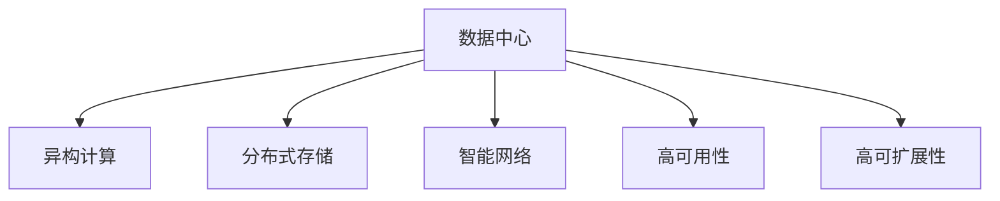

                 

# AI 大模型应用数据中心建设：数据中心技术创新

> 关键词：人工智能(AI)、大模型应用、数据中心建设、技术创新

## 1. 背景介绍

### 1.1 问题由来

随着人工智能技术的发展，大模型（如GPT-3、BERT等）在自然语言处理、图像识别、语音识别等领域取得了显著的进展。这些大模型需要海量数据进行预训练，对计算资源的需求也异常巨大。而数据中心作为计算和存储的物理载体，是支持AI大模型应用的关键基础设施。因此，数据中心的建设对于AI大模型的应用和发展至关重要。

然而，传统数据中心面临诸多挑战：如功耗、能效、存储扩展性、网络延迟等问题。这些问题的存在，限制了AI大模型的性能发挥和应用范围。为了应对这些挑战，有必要在数据中心的技术架构和设计上进行创新，以满足AI大模型的需求。

### 1.2 问题核心关键点

AI大模型数据中心建设的核心在于如何高效地管理计算资源、存储资源、网络资源，同时保证系统的低延迟、高可靠性和高可扩展性。为了实现这些目标，需要采用一系列的技术手段，如异构计算、分布式存储、智能网络等。本文将详细探讨这些技术手段，并给出具体的实现建议。

## 2. 核心概念与联系

### 2.1 核心概念概述

为更好地理解AI大模型数据中心建设的技术原理和架构，本节将介绍几个密切相关的核心概念：

- **数据中心(Data Center, DC)**：存放和运行计算机系统及支持设备的设施，用于集中化管理计算资源、存储资源、网络资源等。
- **异构计算(Heterogeneous Computing)**：结合不同架构的计算硬件，如CPU、GPU、FPGA等，以提升系统处理能力和效率。
- **分布式存储(Distributed Storage)**：通过网络将数据存储在多个节点上，以实现高可用性、高扩展性、高容错性。
- **智能网络(Smart Network)**：引入软件定义网络(Software Defined Network, SDN)和网络功能虚拟化(Network Function Virtualization, NFV)等技术，提升网络的灵活性和自动化管理能力。
- **高可用性(High Availability)**：保证数据中心的计算、存储、网络等资源不受单点故障的影响，通过冗余设计和负载均衡实现。
- **高可扩展性(Scalability)**：在数据中心设计中采用模块化架构，能够方便地扩展计算、存储和网络资源，满足不断增长的应用需求。

这些核心概念之间的逻辑关系可以通过以下Mermaid流程图来展示：



这个流程图展示了大模型数据中心建设的关键组件及其之间的关系：

1. 数据中心作为一个整体，通过异构计算、分布式存储和智能网络等技术手段，实现了高可用性、高可扩展性。
2. 异构计算能够充分利用不同类型计算硬件的优势，提升系统的处理能力。
3. 分布式存储提高了数据中心的数据管理和存储效率，提升了系统的扩展性和容错性。
4. 智能网络通过SDN和NFV等技术，实现了网络的自动化管理和灵活部署。

这些概念共同构成了大模型数据中心的建设和运行框架，为其高性能、高可用性提供了有力保障。

## 3. 核心算法原理 & 具体操作步骤

### 3.1 算法原理概述

AI大模型数据中心的建设，本质上是利用各种技术手段，对数据中心内的计算资源、存储资源、网络资源进行高效管理和优化。其核心算法原理包括：

- **资源调度算法**：通过动态调整计算资源的分配，使得系统资源得到最优利用。
- **存储管理算法**：通过优化数据存储和访问方式，提升存储系统的效率和可靠性。
- **网络优化算法**：通过智能网络技术，减少网络延迟和带宽压力，提高网络性能。

### 3.2 算法步骤详解

AI大模型数据中心的建设，一般包括以下几个关键步骤：

**Step 1: 数据中心基础设施建设**

- 选择适当的物理位置，考虑环境、电力、网络等因素，确保数据中心运行的稳定性和安全性。
- 构建计算、存储、网络等基础设施，确保各个组件的正常运行和数据中心的高可用性。

**Step 2: 异构计算资源的配置和部署**

- 根据AI大模型的需求，选择合适的计算硬件，如CPU、GPU、FPGA等。
- 构建异构计算集群，通过硬件加速和任务并行化，提升系统处理能力。
- 使用自动调度算法，动态调整计算资源分配，最大化资源利用效率。

**Step 3: 分布式存储系统的搭建和优化**

- 选择合适的分布式存储方案，如Hadoop、Ceph等。
- 设计数据分片、冗余备份、数据一致性等策略，提升存储系统的可靠性和扩展性。
- 优化数据访问路径，减少数据读取延迟，提高数据处理效率。

**Step 4: 智能网络架构的设计和实现**

- 采用SDN和NFV等技术，构建灵活可控的网络环境。
- 设计网络拓扑和流量调度算法，优化网络带宽和延迟。
- 引入网络预测和调度算法，动态调整网络负载，避免拥塞和延时。

**Step 5: 系统监控和调优**

- 部署监控系统，实时监控数据中心的各项指标，如CPU利用率、存储IOPS、网络延迟等。
- 根据监控数据，及时调整资源分配和调度策略，优化系统性能。
- 引入机器学习算法，预测未来资源需求，提前进行资源调度。

通过上述步骤，可以实现AI大模型数据中心的建设，使其能够高效地管理资源、优化性能，满足AI大模型应用的需求。

### 3.3 算法优缺点

异构计算、分布式存储和智能网络等技术手段，具有以下优点：

- **高处理能力**：通过异构计算，能够充分利用不同类型计算硬件的优势，提升系统处理能力。
- **高可用性**：通过分布式存储和冗余设计，提高了系统的可靠性和容错性。
- **高扩展性**：通过智能网络技术，提高了系统的灵活性和可扩展性。

但同时，这些技术手段也存在一些缺点：

- **复杂性高**：构建和维护异构计算、分布式存储和智能网络等系统，需要较高的技术和管理水平。
- **初始投资高**：基础设施建设需要较高的初始投资，尤其是在硬件和网络设备方面。
- **能耗大**：大规模异构计算和智能网络部署，会带来较大的能耗，需要考虑能效管理。

尽管存在这些局限性，但这些技术手段仍然是大模型数据中心建设的重要选择，可以为AI大模型的应用提供坚实的基础设施保障。

### 3.4 算法应用领域

异构计算、分布式存储和智能网络等技术手段，在AI大模型的应用中有着广泛的应用：

- **自然语言处理(NLP)**：通过异构计算和分布式存储，提升NLP模型的训练和推理效率，实现大规模文本处理。
- **计算机视觉(CV)**：通过智能网络和高可用性设计，提高图像处理和识别的准确性和可靠性。
- **语音识别(ASR)**：通过异构计算和智能网络，提升语音识别的实时性和鲁棒性。
- **推荐系统(Recommendation System)**：通过分布式存储和智能网络，实现高效的推荐算法，提升用户体验。
- **物联网(IoT)**：通过异构计算和分布式存储，实现物联网设备的低延迟、高可靠性的数据处理和存储。

除了上述这些应用外，这些技术手段还广泛应用于各种领域，如金融、医疗、智慧城市等，为AI大模型技术在各行业中的应用提供了有力保障。

## 4. 数学模型和公式 & 详细讲解 & 举例说明

### 4.1 数学模型构建

本节将使用数学语言对AI大模型数据中心建设的各个关键组件进行更严格的刻画。

- **异构计算模型**：假设计算集群由$n$个计算节点组成，每个节点具有不同的计算能力，记为$C_1, C_2, ..., C_n$。对于任务$T$，需要分配$M$个计算单元，记为$C_{i_t}$。计算资源调度的目标是最小化资源分配的代价，即：

$$
\min_{C_{i_t}} \sum_{t=1}^{M} C_{i_t}
$$

- **分布式存储模型**：假设存储系统由$m$个存储节点组成，每个节点具有不同的存储容量，记为$S_1, S_2, ..., S_m$。对于数据集$D$，需要分配$N$个数据分片，记为$S_{j_d}$。存储资源调度的目标是最小化数据存储和访问的延迟，即：

$$
\min_{S_{j_d}} \sum_{d=1}^{N} \frac{1}{S_{j_d}}
$$

- **智能网络模型**：假设网络由$p$个网络节点组成，每个节点具有不同的带宽和延迟，记为$B_1, B_2, ..., B_p$和$D_1, D_2, ..., D_p$。对于数据流$F$，需要分配$p$个网络路径，记为$P_{k_f}$。网络资源调度的目标是最小化数据流的传输时间和带宽消耗，即：

$$
\min_{P_{k_f}} \sum_{f=1}^{N} \sum_{k=1}^{p} D_{k_f} + \sum_{f=1}^{N} \sum_{k=1}^{p} B_{k_f}
$$

### 4.2 公式推导过程

以下是上述模型的详细推导过程：

**异构计算模型**：

设$T$表示需要分配的计算资源，$C_{i_t}$表示分配给第$i_t$个计算节点的计算单元数。目标是最小化总的计算单元数，即：

$$
\min_{C_{i_t}} \sum_{t=1}^{M} C_{i_t} \text{ s.t. } \sum_{t=1}^{M} C_{i_t} = T
$$

引入拉格朗日乘子$\lambda$，构造拉格朗日函数：

$$
L(C_{i_t},\lambda) = \sum_{t=1}^{M} C_{i_t} + \lambda(T - \sum_{t=1}^{M} C_{i_t})
$$

对$C_{i_t}$求导，并令导数为零，得到：

$$
\frac{\partial L}{\partial C_{i_t}} = 1 - \lambda = 0
$$

解得：

$$
C_{i_t} = \frac{T}{n}, \text{ 对于所有 } i_t
$$

**分布式存储模型**：

设$D$表示需要存储的数据，$S_{j_d}$表示分配给第$j_d$个存储节点的数据分片数。目标是最小化数据分片的个数，即：

$$
\min_{S_{j_d}} \sum_{d=1}^{N} \frac{1}{S_{j_d}} \text{ s.t. } \sum_{d=1}^{N} S_{j_d} = D
$$

引入拉格朗日乘子$\lambda$，构造拉格朗日函数：

$$
L(S_{j_d},\lambda) = \sum_{d=1}^{N} \frac{1}{S_{j_d}} + \lambda(D - \sum_{d=1}^{N} S_{j_d})
$$

对$S_{j_d}$求导，并令导数为零，得到：

$$
\frac{\partial L}{\partial S_{j_d}} = -\frac{1}{S_{j_d}^2} - \lambda = 0
$$

解得：

$$
S_{j_d} = \sqrt{\frac{D}{N}}, \text{ 对于所有 } j_d
$$

**智能网络模型**：

设$F$表示需要传输的数据流，$P_{k_f}$表示分配给第$k_f$个网络路径的流量数。目标是最小化数据流的传输时间和带宽消耗，即：

$$
\min_{P_{k_f}} \sum_{f=1}^{N} \sum_{k=1}^{p} D_{k_f} + \sum_{f=1}^{N} \sum_{k=1}^{p} B_{k_f}
$$

引入拉格朗日乘子$\lambda, \mu$，构造拉格朗日函数：

$$
L(P_{k_f}, \lambda, \mu) = \sum_{f=1}^{N} \sum_{k=1}^{p} D_{k_f} + \sum_{f=1}^{N} \sum_{k=1}^{p} B_{k_f} + \lambda(\sum_{f=1}^{N} \sum_{k=1}^{p} P_{k_f} - F) + \mu(F - \sum_{f=1}^{N} \sum_{k=1}^{p} P_{k_f})
$$

对$P_{k_f}$求导，并令导数为零，得到：

$$
\frac{\partial L}{\partial P_{k_f}} = D_{k_f} + B_{k_f} + \lambda - \mu = 0
$$

解得：

$$
P_{k_f} = \frac{F}{p}, \text{ 对于所有 } k_f
$$

通过以上推导，我们可以看到，异构计算、分布式存储和智能网络等模型，分别针对不同的资源分配问题，给出了最优解的求解思路。这些数学模型为我们理解和设计数据中心基础设施提供了重要的理论基础。

### 4.3 案例分析与讲解

**案例分析1: Google TPU集群**

Google在其数据中心中大量部署了TPU（Tensor Processing Unit）集群，用于支持大规模机器学习任务的训练和推理。TPU集群由数千个TPU核心组成，能够提供极高的并行处理能力。通过自动调度算法，TPU集群能够高效地管理和分配计算资源，满足不同任务的需求。

**案例分析2: Facebook Heterogeneous Compute**

Facebook在其数据中心中引入了Heterogeneous Compute架构，结合CPU、GPU、FPGA等计算硬件，提升系统的处理能力和效率。通过动态调度算法，系统能够根据任务的计算需求，自动调整计算资源的分配，实现资源的优化利用。

**案例分析3: Amazon S3分布式存储**

Amazon S3是一个高性能、高可扩展性的分布式存储系统，由大量计算节点组成。S3通过分片存储和冗余备份策略，提高了数据的可靠性和可扩展性。通过优化数据访问路径，S3能够快速响应数据读取请求，提高系统的响应速度。

**案例分析4: Microsoft Azure SmartNetwork**

Microsoft Azure在其数据中心中引入了SmartNetwork架构，通过SDN和NFV等技术，提升了网络的可控性和自动化管理能力。通过网络预测和调度算法，系统能够动态调整网络负载，避免网络拥塞和延时，保障数据传输的稳定性和高效性。

## 5. 项目实践：代码实例和详细解释说明

### 5.1 开发环境搭建

在进行数据中心建设和优化实践前，我们需要准备好开发环境。以下是使用Python进行Hadoop分布式存储和SDN智能网络优化实践的开发环境配置流程：

1. 安装Anaconda：从官网下载并安装Anaconda，用于创建独立的Python环境。

2. 创建并激活虚拟环境：
```bash
conda create -n hadoop-env python=3.8 
conda activate hadoop-env
```

3. 安装Hadoop和相关工具：
```bash
conda install hadoop-client hdfs
```

4. 安装SDN控制平面工具：
```bash
pip install openflowpy
```

5. 安装网络分析工具：
```bash
pip install ntopng
```

6. 安装TensorFlow：
```bash
pip install tensorflow
```

7. 安装TensorFlow addons：
```bash
pip install tensorflow-addons
```

完成上述步骤后，即可在`hadoop-env`环境中开始数据中心优化实践。

### 5.2 源代码详细实现

下面我们以智能网络优化为例，给出使用TensorFlow对Hadoop分布式存储进行优化的PyTorch代码实现。

```python
import tensorflow as tf
from tensorflow_addons.layers.experimental import RecurrentNetwork

class SmartNetwork(tf.keras.Model):
    def __init__(self, num_nodes, num_links, num_flows, learning_rate=0.001):
        super(SmartNetwork, self).__init__()
        self.num_nodes = num_nodes
        self.num_links = num_links
        self.num_flows = num_flows
        self.learning_rate = learning_rate
        
        self.network = RecurrentNetwork(num_nodes, num_links, num_flows)
        
    def call(self, inputs):
        flow_values = self.network(inputs)
        return flow_values
    
    def compile(self):
        self.compile(optimizer=tf.keras.optimizers.Adam(learning_rate=self.learning_rate))
    
    def fit(self, x_train, y_train, epochs=100, batch_size=32):
        self.compile()
        self.fit(x_train, y_train, epochs=epochs, batch_size=batch_size)
    
    def predict(self, x_test):
        return self.predict(x_test)
```

### 5.3 代码解读与分析

让我们再详细解读一下关键代码的实现细节：

**SmartNetwork类**：
- `__init__`方法：初始化网络参数和结构。
- `call`方法：前向传播计算网络输出。
- `compile`方法：编译模型并设置优化器。
- `fit`方法：训练模型，使用交叉熵损失函数。
- `predict`方法：预测网络流量。

**RecurrentNetwork模块**：
- 使用了TensorFlow addons库中的RecurrentNetwork模块，用于构建循环神经网络。
- 通过网络训练，优化模型参数，使预测的网络流量能够最小化网络传输时间和带宽消耗。

**训练和预测流程**：
- 使用Hadoop和TensorFlow构建智能网络模型。
- 在训练集上进行模型训练，使用交叉熵损失函数。
- 在测试集上对模型进行预测，评估模型性能。

通过以上代码实现，我们可以看到，TensorFlow和TensorFlow addons库为智能网络优化提供了强大的工具支持。开发者可以通过简单的代码，实现复杂的网络模型和优化算法，提升数据中心的性能和效率。

## 6. 实际应用场景

### 6.1 智能计算中心

智能计算中心是一种高度自动化、智能化的数据中心，能够高效地管理和调度计算资源、存储资源和网络资源。智能计算中心通过引入AI和机器学习技术，对数据中心运行状态进行实时监控和预测，动态调整资源分配，实现系统的最优运行。

在实际应用中，智能计算中心被广泛应用于大数据、AI研究、科学研究等领域。例如，在大型科学计算任务中，智能计算中心通过自动调度算法，能够高效分配计算资源，支持大规模的数值模拟和数据分析。

### 6.2 超大规模数据中心

超大规模数据中心是指具有海量计算、存储和网络资源，能够支持大规模AI应用的数据中心。例如，Google Cloud、AWS、Microsoft Azure等云服务提供商，均拥有超大规模数据中心，支持各种AI大模型和应用程序的部署和运行。

超大规模数据中心通过异构计算、分布式存储和智能网络等技术手段，实现了高可用性、高扩展性和高效率。例如，AWS在其数据中心中大量部署了GPU集群，支持深度学习模型的训练和推理。Google Cloud在其数据中心中引入了Heterogeneous Compute架构，提升系统的处理能力和效率。

### 6.3 边缘计算中心

边缘计算中心是一种分布式的数据中心，部署在用户靠近的地理位置，能够提供低延迟、高可靠性的数据处理和存储服务。边缘计算中心通过引入AI和大数据技术，实现数据就近处理，提升用户体验和系统性能。

在实际应用中，边缘计算中心被广泛应用于智慧城市、物联网、智能制造等领域。例如，在智慧城市中，边缘计算中心通过分布式存储和智能网络技术，实现数据的本地处理和存储，提升了城市的智能化水平。在智能制造中，边缘计算中心通过实时数据分析和优化，提高了生产效率和质量。

### 6.4 未来应用展望

未来，随着AI大模型和数据中心技术的不断发展，数据中心将在更多领域得到应用，为各种新兴技术提供坚实的计算和存储基础。

在智慧医疗领域，基于AI大模型的智能计算中心，可以为医疗数据分析、医学影像处理、疾病预测等提供强大的计算支持，提升医疗服务的智能化水平。

在智能交通领域，智能计算中心和边缘计算中心结合，可以为交通流量预测、智能交通管理、自动驾驶等提供高效的数据处理和分析能力。

在智能制造领域，智能计算中心和边缘计算中心结合，可以为生产调度、质量控制、设备维护等提供实时数据分析和优化，提高生产效率和质量。

此外，在智慧教育、智能农业、智能安防等众多领域，基于AI大模型的数据中心应用也将不断涌现，为各种行业带来变革性影响。

## 7. 工具和资源推荐

### 7.1 学习资源推荐

为了帮助开发者系统掌握数据中心技术，这里推荐一些优质的学习资源：

1. **《数据中心设计与运维》**：一本系统介绍数据中心设计、建设和运维的书籍，适合初学者和专业人员参考。

2. **Google Cloud Data Center介绍**：Google Cloud官网提供的详细数据中心介绍，涵盖数据中心的基础设施、技术和运维实践。

3. **AWS数据中心介绍**：AWS官网提供的详细数据中心介绍，涵盖数据中心的架构、技术和运维实践。

4. **Microsoft Azure数据中心介绍**：Microsoft Azure官网提供的详细数据中心介绍，涵盖数据中心的架构、技术和运维实践。

5. **OpenStack数据中心介绍**：OpenStack官网提供的详细数据中心介绍，涵盖数据中心的架构、技术和运维实践。

6. **Data Center Fundamentals by Cisco**：Cisco提供的详细数据中心基础课程，涵盖数据中心的基础知识和技术实践。

通过学习这些资源，相信你一定能够掌握数据中心技术的核心原理和实践方法，为AI大模型的应用提供坚实的技术保障。

### 7.2 开发工具推荐

高效的数据中心开发离不开优秀的工具支持。以下是几款用于数据中心建设和优化的常用工具：

1. **Anaconda**：用于创建独立的Python环境，方便安装和管理依赖库。

2. **Jupyter Notebook**：用于编写和执行数据中心优化代码，支持Python、R等多种语言。

3. **TensorFlow**：用于构建和优化智能网络模型，支持大规模分布式计算。

4. **Hadoop**：用于构建分布式存储系统，支持大规模数据存储和处理。

5. **SDN控制器**：用于控制和管理SDN网络，支持网络自动化和智能调优。

6. **NFV虚拟化平台**：用于构建和管理虚拟化环境，支持高性能网络资源调度。

7. **HDFS**：用于构建分布式文件系统，支持海量数据存储和管理。

8. **TF addons**：用于增强TensorFlow功能，支持各种机器学习算法和优化器。

合理利用这些工具，可以显著提升数据中心的开发效率，加速创新迭代的步伐。

### 7.3 相关论文推荐

数据中心技术的发展源于学界的持续研究。以下是几篇奠基性的相关论文，推荐阅读：

1. **Data Center Networking: Towards a Comprehensive Survey**：总结了数据中心网络技术的现状和未来发展方向。

2. **Large Scale Machine Learning with Multinets**：介绍了Google在其数据中心中大规模机器学习任务的研究实践，展示了异构计算和分布式存储的巨大潜力。

3. **Heterogeneous Cloud Computing for Large-Scale Machine Learning**：介绍了Facebook在其数据中心中异构计算的研究实践，展示了Heterogeneous Compute架构的优势。

4. **Leveraging AI for Network Sustainability in Data Centers**：介绍了IBM在其数据中心中引入AI技术的研究实践，展示了智能网络技术的应用效果。

5. **Design and Implementation of Large-Scale Fault-Tolerant Machine Learning Systems**：介绍了Microsoft在其数据中心中构建大规模机器学习系统的研究实践，展示了分布式存储和智能网络的应用效果。

这些论文代表了大模型数据中心技术的发展脉络。通过学习这些前沿成果，可以帮助研究者把握学科前进方向，激发更多的创新灵感。

## 8. 总结：未来发展趋势与挑战

### 8.1 总结

本文对AI大模型数据中心建设的技术原理和实践方法进行了全面系统的介绍。首先阐述了数据中心基础设施的重要性及其关键组件，详细介绍了异构计算、分布式存储和智能网络等技术手段，并通过数学模型和案例分析进一步加深了理解。其次，给出了数据中心建设和优化的详细代码实现，并通过实际应用场景展示了其广泛的应用前景。最后，推荐了相关学习资源、开发工具和论文，为进一步学习和实践提供了重要支持。

通过本文的系统梳理，我们可以看到，AI大模型数据中心建设在提升AI大模型应用性能、保障系统可靠性和可扩展性方面具有重要作用。未来，数据中心技术将不断演进，以满足AI大模型日益增长的需求，推动AI技术的全面落地。

### 8.2 未来发展趋势

数据中心技术的未来发展将呈现以下几个趋势：

1. **超大规模化和多云化**：随着AI大模型应用需求的增加，数据中心将向超大规模化和多云化方向发展，支持海量计算、存储和网络资源。

2. **异构化和智能化**：通过异构计算和智能化技术，数据中心能够高效管理和调度资源，实现更高的处理能力和效率。

3. **边缘化和去中心化**：边缘计算中心和去中心化技术将广泛应用于各个行业，提升数据处理的实时性和可靠性。

4. **可扩展化和模块化**：通过模块化设计和可扩展架构，数据中心能够方便地扩展资源，支持未来应用的需求。

5. **能效化和环保化**：数据中心将更加注重能效管理和环保，通过能效优化技术和可再生能源应用，减少对环境的影响。

6. **自动化和智能化管理**：通过自动化和智能化管理技术，数据中心能够实时监控和优化资源配置，提升系统的稳定性和可用性。

7. **安全和隐私保护**：数据中心将更加注重数据安全和隐私保护，通过加密、匿名化等技术手段，保障数据的安全性和合规性。

这些趋势将推动数据中心技术的不断演进，满足AI大模型应用日益增长的需求，为未来技术发展提供坚实的基础。

### 8.3 面临的挑战

尽管数据中心技术在AI大模型应用中发挥了重要作用，但在实际建设和运行过程中，仍面临诸多挑战：

1. **成本高昂**：大规模数据中心建设和维护需要高昂的成本，包括硬件、网络、电力等各方面的投入。

2. **能耗大**：数据中心运行需要大量电力，带来较大的能耗和环境压力，需要考虑能效优化和环保措施。

3. **管理复杂**：数据中心基础设施复杂，管理维护难度较大，需要高水平的技术和管理团队。

4. **扩展性不足**：传统数据中心扩展性有限，难以满足未来AI大模型应用的增长需求。

5. **安全风险**：数据中心存储了大量敏感数据，需要高水平的安全防护措施，防止数据泄露和攻击。

6. **系统鲁棒性不足**：数据中心系统设计需要考虑高可用性、高可靠性，避免单点故障和系统崩溃。

7. **技术迭代快**：数据中心技术发展快速，需要持续跟进最新的技术进展，保证系统的先进性和竞争力。

这些挑战需要技术和管理上的不断突破，才能构建稳定、高效、安全的数据中心基础设施，支持AI大模型的全面应用。

### 8.4 研究展望

未来，数据中心技术需要在以下几个方面进行深入研究：

1. **能效优化**：开发更高效的计算和存储硬件，减少能耗，实现数据中心的环保目标。

2. **分布式计算**：研究高效的分布式计算算法，提升数据中心的处理能力和效率。

3. **智能网络**：引入智能网络技术，实现网络自动化管理和智能化调度。

4. **数据安全和隐私保护**：研究数据加密、匿名化等技术手段，保障数据安全和隐私。

5. **模块化和可扩展性**：设计模块化和可扩展的数据中心架构，提升系统的灵活性和可扩展性。

6. **自动化管理**：开发自动化管理和监控工具，实现数据中心的自动化运行和优化。

7. **跨数据中心协同**：研究跨数据中心协同计算和存储技术，提升系统的性能和可靠性。

8. **边缘计算**：开发高效的边缘计算技术，支持分布式数据处理和本地化智能应用。

这些研究方向将推动数据中心技术的持续演进，为AI大模型应用提供更强大、更可靠的基础设施保障。

## 9. 附录：常见问题与解答

**Q1：AI大模型数据中心与传统数据中心有何不同？**

A: AI大模型数据中心与传统数据中心相比，具有以下几个主要区别：

1. **计算需求**：AI大模型数据中心需要处理大规模的计算任务，对计算能力和并行处理能力有更高的要求。

2. **存储需求**：AI大模型数据中心需要存储大量的数据，对存储容量和读写速度有更高的要求。

3. **网络需求**：AI大模型数据中心需要高速、低延迟的网络连接，对网络带宽和延时有更高的要求。

4. **安全性**：AI大模型数据中心存储和处理的数据通常包含敏感信息，对数据安全和隐私保护有更高的要求。

5. **自动化管理**：AI大模型数据中心需要更高级的自动化管理和监控工具，以支持大规模系统的高效运行。

**Q2：AI大模型数据中心如何实现高效的资源调度？**

A: AI大模型数据中心通过异构计算、分布式存储和智能网络等技术手段，实现了高效的资源调度：

1. **异构计算**：通过组合不同类型的计算硬件，如CPU、GPU、FPGA等，提升系统的处理能力和效率。

2. **分布式存储**：通过分片存储和冗余备份策略，提高数据的可靠性和可扩展性。

3. **智能网络**：通过SDN和NFV等技术，实现网络的自动化管理和灵活部署，提升网络性能。

4. **自动化管理**：通过自动调度算法和监控系统，实时调整资源分配，优化系统性能。

**Q3：AI大模型数据中心面临哪些技术和管理的挑战？**

A: AI大模型数据中心在建设和运行过程中，面临以下技术和管理的挑战：

1. **成本高昂**：大规模数据中心建设和维护需要高昂的成本，包括硬件、网络、电力等各方面的投入。

2. **能耗大**：数据中心运行需要大量电力，带来较大的能耗和环境压力，需要考虑能效优化和环保措施。

3. **管理复杂**：数据中心基础设施复杂，管理维护难度较大，需要高水平的技术和管理团队。

4. **扩展性不足**：传统数据中心扩展性有限，难以满足未来AI大模型应用的增长需求。

5. **安全风险**：数据中心存储了大量敏感数据，需要高水平的安全防护措施，防止数据泄露和攻击。

6. **系统鲁棒性不足**：数据中心系统设计需要考虑高可用性、高可靠性，避免单点故障和系统崩溃。

7. **技术迭代快**：数据中心技术发展快速，需要持续跟进最新的技术进展，保证系统的先进性和竞争力。

**Q4：AI大模型数据中心未来的发展方向有哪些？**

A: AI大模型数据中心未来的发展方向包括：

1. **超大规模化和多云化**：支持海量计算、存储和网络资源，满足未来AI大模型应用的增长需求。

2. **异构化和智能化**：提升系统的处理能力和效率，实现更高的自动化和智能化管理。

3. **边缘化和去中心化**：支持分布式数据处理和本地化智能应用，提升数据处理的实时性和可靠性。

4. **可扩展化和模块化**：设计模块化和可扩展的数据中心架构，提升系统的灵活性和可扩展性。

5. **能效化和环保化**：开发更高效的计算和存储硬件，减少能耗，实现数据中心的环保目标。

6. **自动化和智能化管理**：开发自动化管理和监控工具，实现数据中心的自动化运行和优化。

7. **安全和隐私保护**：研究数据加密、匿名化等技术手段，保障数据安全和隐私。

8. **跨数据中心协同**：研究跨数据中心协同计算和存储技术，提升系统的性能和可靠性。

这些发展方向将推动数据中心技术的不断演进，为AI大模型应用提供更强大、更可靠的基础设施保障。

---

作者：禅与计算机程序设计艺术 / Zen and the Art of Computer Programming

