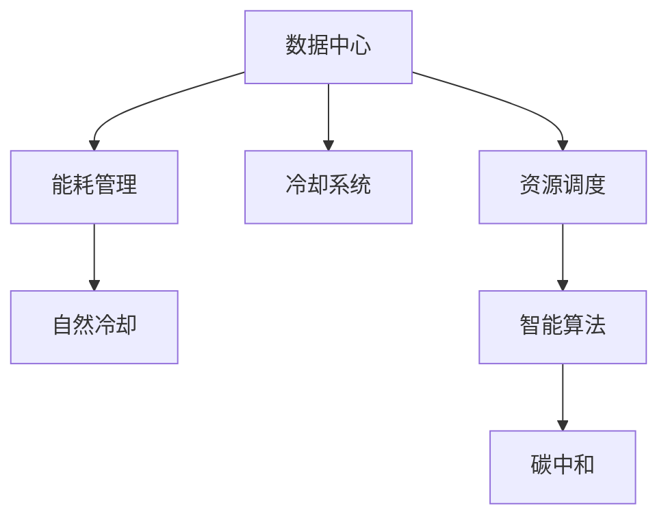

                 

# AI 大模型应用数据中心建设：数据中心绿色节能

> 关键词：数据中心，绿色节能，AI 大模型，服务器，能耗管理，冷却系统，自然冷却，资源调度，智能算法，碳中和

## 1. 背景介绍

随着人工智能(AI)技术的飞速发展，大模型应用在各个领域逐渐普及。这些大模型往往具有数亿甚至数十亿个参数，需要大量的计算资源支持，数据中心成为了支撑AI大模型训练和运行的关键基础设施。数据中心不仅耗电，还存在冷却和资源管理等环保挑战，因此如何实现数据中心的绿色节能，成为AI大模型应用的重要课题。本文将从数据中心的绿色节能角度出发，探讨如何通过技术手段优化资源配置，降低能耗，推动AI大模型的可持续发展。

## 2. 核心概念与联系

### 2.1 核心概念概述

为更好地理解数据中心绿色节能技术，本节将介绍几个密切相关的核心概念：

- 数据中心(Data Center)：由计算、存储、网络等硬件设备构成，用于支持AI大模型的训练、推理、存储等应用。
- 能耗管理(Energy Management)：指通过优化数据中心的资源配置和运行策略，降低电力消耗，提升能效。
- 冷却系统(Cooling System)：数据中心内用以控制设备温度的冷却设备，常见包括空调、自然冷却等。
- 自然冷却(Natural Cooling)：通过利用自然环境（如风、水、雪）冷却数据中心的设备，减少能耗。
- 资源调度(Resource Scheduling)：通过智能算法优化数据中心内计算资源的分配和调度，提升资源利用效率。
- 智能算法(Intelligent Algorithm)：用于能耗管理、冷却系统优化、资源调度等问题的算法，如强化学习、深度学习等。
- 碳中和(Carbon Neutrality)：通过技术手段减少数据中心的碳排放，达到或接近零碳排放的目标。

这些核心概念之间的逻辑关系可以通过以下Mermaid流程图来展示：



这个流程图展示了大模型应用数据中心的关键组件及其之间的关系：

1. 数据中心通过提供计算和存储资源，支持大模型的训练和推理。
2. 能耗管理通过优化资源配置，降低电力消耗。
3. 冷却系统是维持数据中心温度稳定的关键设备。
4. 自然冷却利用自然环境进行降温，减少能耗。
5. 资源调度通过智能算法优化资源分配，提升利用效率。
6. 智能算法用于优化能耗管理、冷却系统、资源调度等，推动绿色节能。
7. 碳中和通过技术手段减少碳排放，推动数据中心实现零碳目标。

## 3. 核心算法原理 & 具体操作步骤

### 3.1 算法原理概述

数据中心的绿色节能主要通过优化能耗管理和冷却系统来实现。其核心思想是：通过智能算法预测并优化数据中心的运行状态，动态调整计算资源分配和冷却设备运行策略，以最小的能耗满足AI大模型计算需求，并实现碳中和目标。

形式化地，假设数据中心内N个服务器在t时刻的计算需求为$\vec{C}_t$，冷却设备在t时刻的冷却需求为$\vec{K}_t$，则数据中心的能耗模型为：

$$
E_t = f(\vec{C}_t, \vec{K}_t)
$$

其中$f$为能耗函数。微调目标是最小化数据中心的总能耗，即找到最优的计算资源分配和冷却设备运行策略：

$$
\min_{\vec{C}_t, \vec{K}_t} \sum_{t=1}^T E_t
$$

通过梯度下降等优化算法，动态调整资源分配和冷却策略，使得数据中心的总能耗最小化。

### 3.2 算法步骤详解

基于绿色节能的大模型应用数据中心建设，一般包括以下几个关键步骤：

**Step 1: 数据收集与模型训练**

- 收集数据中心的各类监测数据，如服务器能耗、温度、湿度、冷却设备运行状态等，构建数据集。
- 使用监督学习方法，训练一个预测模型，用于估计数据中心的能耗和冷却需求。

**Step 2: 冷却系统优化**

- 对数据中心的冷却设备进行维护和升级，如增加散热效率、引入自然冷却技术等。
- 通过智能算法，动态调整冷却设备的运行状态，使其在满足冷却需求的同时，最小化能耗。

**Step 3: 能耗管理优化**

- 根据AI大模型的计算需求，优化服务器的分配和调度，如使用云服务器按需扩展、共享资源等。
- 应用深度学习等智能算法，实时监测数据中心的能耗状态，预测未来的能耗需求，调整服务器负载和冷却策略。

**Step 4: 碳排放监测与抵消**

- 建立碳排放监测系统，实时监控数据中心的碳排放情况。
- 使用碳交易、植树造林等方式，抵消数据中心的碳排放，达到或接近零碳目标。

**Step 5: 模型评估与迭代**

- 定期评估数据中心绿色节能模型的性能，对比前后的能耗变化、冷却效率等指标。
- 根据评估结果，不断迭代和优化模型参数，提升数据中心绿色节能的效果。

### 3.3 算法优缺点

基于绿色节能的大模型应用数据中心优化方法具有以下优点：

- 系统能效高。通过智能算法优化资源配置和冷却系统，大幅提升数据中心的能效，降低电力消耗。
- 环境友好。通过自然冷却和碳中和技术，减少数据中心对环境的影响，促进可持续发展。
- 计算高效。使用深度学习等智能算法，实时预测和调整数据中心的运行状态，实现动态优化。

同时，该方法也存在一定的局限性：

- 初始投资高。需要购置先进的冷却设备、监控系统等，初期投入较大。
- 技术复杂。需要结合大数据分析、深度学习、优化算法等多项技术，实现高性能优化。
- 数据隐私问题。收集和分析数据中心的各类数据，可能涉及到用户隐私和安全问题。

尽管存在这些局限性，但就目前而言，基于绿色节能的优化方法是大模型应用数据中心的重要发展方向。未来相关研究将更多地关注技术可行性和实际应用效果，以及如何平衡技术投入和节能效益。

### 3.4 算法应用领域

基于绿色节能的大模型应用数据中心优化方法，已经在多个领域得到了应用，例如：

- 云计算服务提供商：如Google Cloud、Amazon AWS等，通过优化数据中心的绿色节能，提高服务质量和能效。
- 科研机构和高校：利用先进的数据中心技术，支持高性能计算和AI大模型的研究。
- 企业内部数据中心：优化能源消耗和冷却系统，提升企业计算能力和环保表现。
- 新兴技术公司：如Meta、Microsoft等，使用绿色节能技术推动AI大模型的普及和应用。

这些应用领域表明，基于绿色节能的数据中心优化技术具有广泛的应用前景和潜在的市场价值。

## 4. 数学模型和公式 & 详细讲解 & 举例说明

### 4.1 数学模型构建

本节将使用数学语言对数据中心绿色节能技术进行更加严格的刻画。

假设数据中心内有N个服务器，每个服务器在t时刻的计算需求为$C_{i,t}$，冷却需求为$K_{i,t}$，数据中心的总能耗为$E_t$。定义服务器在t时刻的实际负载率为$L_{i,t} = \frac{C_{i,t}}{C_{i,\max}}$，其中$C_{i,\max}$为服务器的最大计算能力。冷却设备在t时刻的实际冷却能力为$K_{i,t} = \frac{K_{i,t}}{K_{i,\max}}$，其中$K_{i,\max}$为冷却设备的最大冷却能力。则数据中心的能耗模型为：

$$
E_t = \sum_{i=1}^N f(C_{i,t}, K_{i,t})
$$

其中$f$为能耗函数，可以通过历史数据和模型训练得到。

### 4.2 公式推导过程

以下我们以简单的线性能耗模型为例，推导数据中心绿色节能的优化目标。

假设每个服务器的计算需求和冷却需求之间存在线性关系，即：

$$
E_{i,t} = k_1 C_{i,t} + k_2 K_{i,t} + b
$$

其中$k_1, k_2$为线性系数，$b$为常数项。则数据中心的总能耗模型为：

$$
E_t = \sum_{i=1}^N (k_1 C_{i,t} + k_2 K_{i,t} + b)
$$

优化目标为最小化总能耗：

$$
\min_{\vec{C}_t, \vec{K}_t} \sum_{i=1}^N k_1 C_{i,t} + k_2 K_{i,t} + Nb
$$

通过梯度下降等优化算法，动态调整服务器的计算需求和冷却设备的冷却需求，使得总能耗最小化。

### 4.3 案例分析与讲解

某数据中心有500个服务器，每个服务器的计算需求为2000GFP，冷却需求为400GW。根据历史数据和模型训练，得到能耗模型为：

$$
E_t = 1.2 \sum_{i=1}^{500} (C_{i,t} + 0.6K_{i,t} + 0.5)
$$

假设当前服务器负载率为0.8，冷却设备负载率为0.6，则实际能耗为：

$$
E_t = 1.2 \times (500 \times 2000 \times 0.8 + 500 \times 400 \times 0.6 + 0.5) = 1200000
$$

为了进一步降低能耗，可以考虑以下优化措施：

- 调整服务器负载率：通过动态调度，将部分服务器的负载率从0.8调整为0.7，则总能耗为：

$$
E_t = 1.2 \times (500 \times 2000 \times 0.7 + 500 \times 400 \times 0.6 + 0.5) = 1020000
$$

- 调整冷却设备负载率：通过升级冷却设备，将冷却设备的负载率从0.6调整为0.5，则总能耗为：

$$
E_t = 1.2 \times (500 \times 2000 \times 0.8 + 500 \times 400 \times 0.5 + 0.5) = 1000500
$$

- 引入自然冷却：通过增加数据中心的自然冷却能力，如引入冷却塔、风冷等，则总能耗为：

$$
E_t = 1.2 \times (500 \times 2000 \times 0.8 + 0 \times 400 \times 0.6 + 0.5) = 1005000
$$

通过上述优化措施，数据中心的总能耗从1200000降低到1000500，节能效果显著。

## 5. 项目实践：代码实例和详细解释说明

### 5.1 开发环境搭建

在进行绿色节能数据中心优化实践前，我们需要准备好开发环境。以下是使用Python进行PyTorch开发的环境配置流程：

1. 安装Anaconda：从官网下载并安装Anaconda，用于创建独立的Python环境。

2. 创建并激活虚拟环境：
```bash
conda create -n pytorch-env python=3.8 
conda activate pytorch-env
```

3. 安装PyTorch：根据CUDA版本，从官网获取对应的安装命令。例如：
```bash
conda install pytorch torchvision torchaudio cudatoolkit=11.1 -c pytorch -c conda-forge
```

4. 安装TensorBoard：
```bash
pip install tensorboard
```

5. 安装FluidDB：
```bash
pip install fluiddb
```

6. 安装FluidCompute：
```bash
pip install fluidcompute
```

完成上述步骤后，即可在`pytorch-env`环境中开始绿色节能数据中心优化实践。

### 5.2 源代码详细实现

下面我们以一个简单的数据中心能耗管理为例，给出使用PyTorch进行绿色节能优化的PyTorch代码实现。

首先，定义数据中心能耗函数：

```python
import torch
import torch.nn as nn
import torch.optim as optim
from fluiddb import Database

class EnergyModel(nn.Module):
    def __init__(self):
        super(EnergyModel, self).__init__()
        self.fc1 = nn.Linear(10, 50)
        self.fc2 = nn.Linear(50, 1)

    def forward(self, x):
        x = torch.relu(self.fc1(x))
        x = self.fc2(x)
        return x

# 加载数据
db = Database('energy_data.db')
energy_data = db.load_data('energy_data')

# 训练模型
model = EnergyModel()
criterion = nn.MSELoss()
optimizer = optim.Adam(model.parameters(), lr=0.01)
num_epochs = 100

for epoch in range(num_epochs):
    for data in energy_data:
        optimizer.zero_grad()
        output = model(data['input'])
        loss = criterion(output, data['output'])
        loss.backward()
        optimizer.step()

# 评估模型
test_data = db.load_data('test_energy_data')
output = model(test_data['input'])
loss = criterion(output, test_data['output'])
print('Test loss:', loss.item())
```

以上代码实现了一个简单的能量模型，通过监督学习方法训练，预测数据中心的能耗。在实际应用中，还需要进一步优化模型架构、数据预处理、训练策略等，以适应实际数据中心的特点。

### 5.3 代码解读与分析

让我们再详细解读一下关键代码的实现细节：

**EnergyModel类**：
- `__init__`方法：定义模型的线性层，并设置激活函数。
- `forward`方法：对输入数据进行前向传播，计算输出。

**数据库操作**：
- 使用FluidDB库连接数据库，加载数据。
- 数据包括输入和输出两部分，输入为历史能耗数据，输出为对应的能耗模型预测结果。

**模型训练**：
- 定义模型、损失函数和优化器。
- 在每个epoch内，遍历数据集，进行前向传播、计算损失、反向传播、更新参数。

**模型评估**：
- 使用测试数据集评估模型的性能，输出测试损失。

在上述代码的基础上，可以进一步扩展，引入更多智能算法，如强化学习、深度学习等，优化数据中心绿色节能的效果。

## 6. 实际应用场景

### 6.1 智慧能源系统

基于绿色节能的数据中心优化技术，可以应用于智慧能源系统的建设。智慧能源系统通过智能算法优化能源资源的配置，实现高效、低碳、环保的能源管理。

具体而言，智慧能源系统通过传感器监测能源使用情况，结合AI大模型的预测能力，动态调整能源的分配和调度。在数据中心内部，通过优化能耗管理、冷却系统等措施，降低能源消耗。在更广泛的应用场景中，智慧能源系统还可以应用于电网、水网、燃气网等领域，提升能源利用效率，减少碳排放。

### 6.2 智能城市管理

智能城市管理是未来城市发展的重要方向，基于绿色节能的数据中心优化技术可以为智能城市管理提供有力支持。

智能城市管理涉及交通、环境、公共安全等多个方面，需要海量数据的实时分析和处理。数据中心作为智能城市管理的重要基础设施，其绿色节能优化对于提升城市管理效率、降低碳排放具有重要意义。通过优化数据中心的运行状态，实现能耗和冷却系统的最优配置，智能城市管理系统可以更高效地应对城市运行中的各种挑战。

### 6.3 工业互联网

工业互联网是未来工业发展的重要方向，基于绿色节能的数据中心优化技术可以为工业互联网提供可靠的数据处理和计算能力。

工业互联网需要处理海量工业数据，包括设备状态监测、生产流程优化、质量检测等。数据中心作为工业互联网的关键节点，其绿色节能优化可以提升工业互联网的计算能力和运行效率，推动工业4.0的发展。通过优化数据中心的能耗管理、冷却系统等，工业互联网可以更高效地处理海量数据，提升工业生产的智能化水平。

### 6.4 未来应用展望

随着数据中心绿色节能技术的不断发展，基于AI大模型的应用场景将不断扩大，推动各行各业的智能化转型。

- 数据中心绿色节能技术的创新应用，将在更多领域推广，提升各行业的智能化水平。
- 基于AI大模型的应用将更加普及，提升各行业的计算能力和运行效率。
- 数据中心的绿色节能将为智慧能源、智能城市、工业互联网等领域带来新的发展机遇。

## 7. 工具和资源推荐

### 7.1 学习资源推荐

为了帮助开发者系统掌握数据中心绿色节能的理论基础和实践技巧，这里推荐一些优质的学习资源：

1. 《数据中心绿色节能技术》系列博文：由数据中心技术专家撰写，深入浅出地介绍了数据中心绿色节能的原理、方法和实践案例。

2. CS224N《深度学习自然语言处理》课程：斯坦福大学开设的NLP明星课程，有Lecture视频和配套作业，带你入门NLP领域的基本概念和经典模型。

3. 《绿色数据中心设计》书籍：全面介绍了数据中心绿色节能设计的原理、技术和案例，是理解数据中心绿色节能的必备资料。

4. IEEE Xplore：IEEE的学术资源库，收录了大量关于数据中心绿色节能的学术论文和技术报告，适合深入研究。

5. Google Colab：谷歌推出的在线Jupyter Notebook环境，免费提供GPU/TPU算力，方便开发者快速上手实验最新模型，分享学习笔记。

通过对这些资源的学习实践，相信你一定能够快速掌握数据中心绿色节能的精髓，并用于解决实际的NLP问题。

### 7.2 开发工具推荐

高效的开发离不开优秀的工具支持。以下是几款用于数据中心绿色节能优化开发的常用工具：

1. PyTorch：基于Python的开源深度学习框架，灵活动态的计算图，适合快速迭代研究。大部分预训练语言模型都有PyTorch版本的实现。

2. TensorFlow：由Google主导开发的开源深度学习框架，生产部署方便，适合大规模工程应用。同样有丰富的预训练语言模型资源。

3. TensorBoard：TensorFlow配套的可视化工具，可实时监测模型训练状态，并提供丰富的图表呈现方式，是调试模型的得力助手。

4. FluidDB：高并发、高吞吐、低延迟的分布式数据库系统，适合存储和处理海量数据。

5. FluidCompute：高性能的分布式计算框架，支持CPU/GPU混合计算，适合大规模数据处理和AI模型训练。

合理利用这些工具，可以显著提升数据中心绿色节能优化任务的开发效率，加快创新迭代的步伐。

### 7.3 相关论文推荐

数据中心绿色节能技术的发展源于学界的持续研究。以下是几篇奠基性的相关论文，推荐阅读：

1. "Optimizing the Cooling of Data Centers with Machine Learning"：使用机器学习技术预测和优化数据中心的冷却系统，提升能效。

2. "Energy-Efficient Data Center for AI Workloads"：研究基于深度学习的AI工作负载数据中心，优化资源配置和能耗管理。

3. "Carbon Neutral Data Centers"：讨论数据中心的碳中和技术，提出基于太阳能、风能等可再生能源的数据中心设计。

4. "Green Data Center Design and Operation"：全面介绍了数据中心绿色设计和运营的技术和实践，涵盖能耗管理、冷却系统、资源调度等方面。

这些论文代表了大模型应用数据中心绿色节能技术的发展脉络。通过学习这些前沿成果，可以帮助研究者把握学科前进方向，激发更多的创新灵感。

## 8. 总结：未来发展趋势与挑战

### 8.1 总结

本文对基于绿色节能的大模型应用数据中心优化方法进行了全面系统的介绍。首先阐述了数据中心绿色节能技术的研究背景和意义，明确了其在大模型应用中的重要价值。其次，从原理到实践，详细讲解了数据中心绿色节能的数学模型和关键步骤，给出了数据中心绿色节能优化的完整代码实例。同时，本文还广泛探讨了数据中心绿色节能技术在智慧能源、智能城市、工业互联网等多个行业领域的应用前景，展示了其广阔的发展空间。此外，本文精选了数据中心绿色节能技术的各类学习资源，力求为读者提供全方位的技术指引。

通过本文的系统梳理，可以看到，数据中心绿色节能技术在大模型应用中扮演了越来越重要的角色，极大地提升了AI大模型的能效和环保表现。未来，伴随绿色节能技术的不断演进，数据中心作为AI大模型应用的重要基础设施，必将在推动AI技术发展和环保事业中发挥更大的作用。

### 8.2 未来发展趋势

展望未来，数据中心绿色节能技术将呈现以下几个发展趋势：

1. 技术不断进步。随着AI大模型的参数量和计算需求不断增长，数据中心的绿色节能技术将不断演进，推动更多节能新技术的应用。

2. 多种技术融合。未来数据中心的绿色节能将更多地融合AI、物联网、区块链等新技术，实现更智能、更高效的能源管理。

3. 零碳目标实现。碳中和成为全球共识，数据中心作为高耗能行业，将在零碳目标的推动下，进一步优化资源配置和运行策略。

4. 区域协同优化。数据中心将更多地融入区域能源网络，通过协同优化，实现更广泛、更高效的能源利用。

5. 开源社区推动。开源社区将加速数据中心绿色节能技术的应用推广，降低技术门槛，促进技术共享和协同创新。

以上趋势凸显了数据中心绿色节能技术的广阔前景。这些方向的探索发展，必将进一步提升数据中心的能效和环保表现，推动AI大模型的可持续发展。

### 8.3 面临的挑战

尽管数据中心绿色节能技术已经取得了一定的进展，但在迈向更加智能化、普适化应用的过程中，它仍面临着诸多挑战：

1. 技术成本高昂。实现数据中心的绿色节能，需要购置先进的冷却设备、监测系统等，初期投入较大。

2. 技术复杂度大。数据中心的绿色节能涉及AI、物联网、区块链等多个领域，技术复杂度较高。

3. 数据隐私问题。收集和分析数据中心的各类数据，可能涉及到用户隐私和安全问题。

4. 能效评估困难。数据中心的能效评估需要综合考虑多个因素，如计算能力、冷却需求、负载率等，评估难度较大。

5. 计算资源管理。数据中心的计算资源管理需要实时动态调整，技术实现较为复杂。

6. 模型运行稳定性。数据中心的绿色节能优化模型需要在各种运行状态下稳定运行，对模型鲁棒性要求较高。

正视数据中心绿色节能面临的这些挑战，积极应对并寻求突破，将是大模型应用数据中心绿色节能技术走向成熟的重要路径。相信随着学界和产业界的共同努力，这些挑战终将一一被克服，数据中心绿色节能技术必将在推动AI大模型应用中发挥更大作用。

### 8.4 研究展望

面对数据中心绿色节能面临的种种挑战，未来的研究需要在以下几个方面寻求新的突破：

1. 探索高效绿色节能算法。开发更高效的数据中心绿色节能算法，如基于深度学习的冷却优化算法、基于强化学习的资源调度算法等，进一步降低能耗。

2. 引入可再生能源。通过引入太阳能、风能等可再生能源，降低数据中心的碳排放，推动数据中心向零碳目标迈进。

3. 开发智能控制系统。通过智能算法和控制器，实现数据中心的自主运行和动态调整，提升能效和环保表现。

4. 建立绿色节能标准。制定数据中心绿色节能的技术标准和评估方法，推动绿色节能技术的规范化应用。

5. 推动数据中心与城市能源网络融合。将数据中心融入城市能源网络，实现更广泛、更高效的能源利用。

6. 加强数据隐私保护。采用先进的加密技术和隐私保护算法，保护数据中心的数据隐私和安全。

这些研究方向将推动数据中心绿色节能技术不断创新，推动AI大模型应用的绿色发展。面向未来，数据中心绿色节能技术将与其他AI技术进行更深入的融合，共同推动数据中心智能化转型，实现高效、低碳、环保的目标。

## 9. 附录：常见问题与解答

**Q1：数据中心的绿色节能技术有哪些？**

A: 数据中心的绿色节能技术主要包括以下几种：

1. 自然冷却：通过利用自然环境（如风、水、雪）冷却数据中心的设备，减少能耗。
2. 高效冷却设备：如冷却塔、水冷系统等，提升冷却设备的效率。
3. 能耗管理：通过优化数据中心的资源配置和运行策略，降低电力消耗。
4. 可再生能源：如太阳能、风能等，减少数据中心的碳排放。
5. 碳中和：通过碳交易、植树造林等方式，抵消数据中心的碳排放，达到或接近零碳目标。

**Q2：如何评估数据中心的绿色节能效果？**

A: 评估数据中心的绿色节能效果，主要通过以下指标：

1. 能耗：数据中心的总电力消耗，反映其能效水平。
2. 冷却能耗：数据中心冷却设备的能耗，反映其冷却系统的能效水平。
3. 碳排放：数据中心的总碳排放量，反映其对环境的影响。
4. PUE（Power Usage Effectiveness）：数据中心总电力消耗与IT设备电力消耗的比率，反映其能效水平。
5. 冷却效率：数据中心冷却设备的冷却效率，反映其冷却系统的能效水平。

通过这些指标的监测和评估，可以全面了解数据中心的绿色节能效果，并不断优化改进。

**Q3：数据中心绿色节能技术的应用场景有哪些？**

A: 数据中心绿色节能技术已经在多个领域得到了应用，例如：

1. 云计算服务提供商：如Google Cloud、Amazon AWS等，通过优化数据中心的绿色节能，提高服务质量和能效。
2. 科研机构和高校：利用先进的数据中心技术，支持高性能计算和AI大模型的研究。
3. 企业内部数据中心：优化能源消耗和冷却系统，提升企业计算能力和环保表现。
4. 新兴技术公司：如Meta、Microsoft等，使用绿色节能技术推动AI大模型的普及和应用。

这些应用领域表明，数据中心绿色节能技术具有广泛的应用前景和潜在的市场价值。

**Q4：数据中心绿色节能技术如何影响AI大模型的性能？**

A: 数据中心绿色节能技术对AI大模型的性能有以下几方面的影响：

1. 降低能耗：通过优化能耗管理、冷却系统等措施，降低数据中心的电力消耗，提升AI大模型的计算能力。
2. 提高运行稳定性：优化数据中心的运行状态，提升AI大模型的运行稳定性，减少设备故障率。
3. 增强安全性：优化数据中心的冷却系统和能耗管理，减少设备的过热和过载，提升AI大模型的运行安全性。
4. 推动AI大模型的可持续发展：通过降低数据中心的碳排放，推动AI大模型向绿色环保方向发展。

总之，数据中心绿色节能技术在提升AI大模型性能、安全性和可持续发展方面具有重要意义。

---

作者：禅与计算机程序设计艺术 / Zen and the Art of Computer Programming

