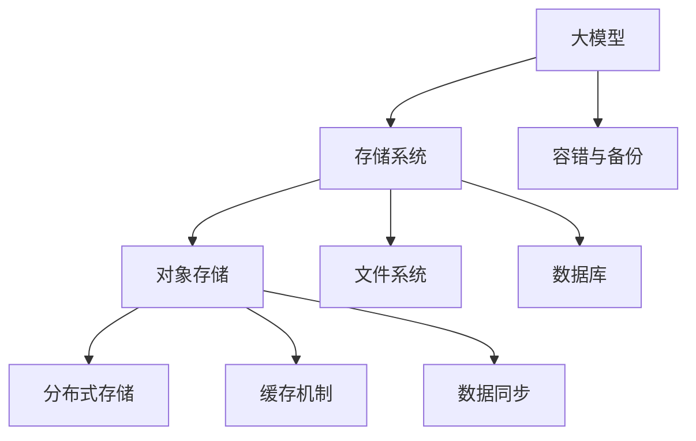

                 

# AI 大模型应用数据中心的存储解决方案

## 1. 背景介绍

### 1.1 问题由来

随着人工智能（AI）技术的快速发展，特别是在深度学习和自然语言处理（NLP）领域，大模型（Large Models）如BERT、GPT等凭借其卓越的性能和广泛的适用性，逐渐成为AI应用的核心。这些大模型通常具有数十亿甚至上百亿个参数，其训练和应用需要巨大的计算资源和存储空间。因此，如何高效地存储和检索这些大模型的参数和中间数据，成为AI应用数据中心的一大挑战。

### 1.2 问题核心关键点

大模型存储的主要挑战在于：

1. **大规模参数管理**：大模型的参数数量庞大，如何管理和维护这些参数变得复杂。
2. **存储效率**：大模型在训练和推理过程中会产生大量的中间数据，如何高效存储这些数据以提升系统性能。
3. **访问速度**：在模型的训练和推理过程中，参数的访问速度对系统性能有重要影响，如何提高参数的读取和写入效率。
4. **可靠性与一致性**：存储系统需要保证参数的可靠性和一致性，防止数据丢失或损坏。

## 2. 核心概念与联系

### 2.1 核心概念概述

为了深入理解大模型应用数据中心的存储解决方案，本节将介绍几个关键概念及其相互联系：

1. **大模型**：如BERT、GPT等，具有亿级参数的深度学习模型，用于解决各种复杂的AI问题。
2. **存储系统**：包括对象存储、文件系统、数据库等，用于存储和管理大模型的参数和中间数据。
3. **分布式存储**：通过多台服务器并行存储和管理数据，提升系统的可扩展性和可靠性。
4. **缓存机制**：使用缓存技术，加速对频繁访问的数据的读取，提升系统性能。
5. **数据同步**：在大模型分布式训练和推理过程中，如何同步和更新不同节点上的参数和数据。
6. **容错与备份**：如何设计容错机制，保证存储系统的稳定性和可靠性。

这些概念之间的逻辑关系可以通过以下Mermaid流程图来展示：



这个流程图展示了大模型与存储系统之间的紧密联系：

1. 大模型训练和推理生成的数据通过多种存储系统进行存储。
2. 对象存储、文件系统和数据库各自适用于不同的数据存储需求。
3. 分布式存储和大规模数据管理能力，是存储系统能够处理大模型的关键。
4. 缓存机制和数据同步技术，保证了数据访问的高效性和一致性。
5. 容错与备份机制，保障了存储系统的稳定性和可靠性。

## 3. 核心算法原理 & 具体操作步骤

### 3.1 算法原理概述

大模型应用数据中心的存储解决方案，主要基于分布式存储、缓存机制、数据同步和容错与备份等技术。这些技术的核心在于：

1. **分布式存储**：将大模型的参数和中间数据分布在多个存储节点上，提升系统的可扩展性和可靠性。
2. **缓存机制**：使用缓存技术，加速对频繁访问的数据的读取，提升系统性能。
3. **数据同步**：在分布式训练和推理过程中，保持不同节点上的数据一致性。
4. **容错与备份**：设计容错机制，保证存储系统的稳定性和可靠性。

### 3.2 算法步骤详解

#### 3.2.1 分布式存储系统

1. **选择合适的存储系统**：如Amazon S3、Google Cloud Storage、阿里云OSS等，这些系统都具备高可用性和大规模数据管理能力。
2. **设计数据分区策略**：将大模型的参数和中间数据分区存储在多个节点上，每分区大小一般控制在数TB到数十TB。
3. **选择合适的分布式存储协议**：如Hadoop HDFS、Apache Cassandra等，这些协议可以支持大规模数据分布和存储。

#### 3.2.2 缓存机制

1. **选择合适的缓存系统**：如Redis、Memcached等，这些系统能够快速读取和写入频繁访问的数据。
2. **设计缓存策略**：根据数据访问频率和系统性能要求，将部分数据缓存到内存中，以减少访问延迟。
3. **管理缓存一致性**：确保缓存和主存储的数据一致性，防止数据冲突和丢失。

#### 3.2.3 数据同步

1. **选择合适的同步协议**：如Zookeeper、etcd等，这些协议可以保证数据同步的可靠性和一致性。
2. **设计数据同步策略**：定期同步不同节点上的数据，或者在参数更新时实时同步。
3. **处理数据同步冲突**：当多个节点同时更新相同数据时，使用同步协议处理冲突，确保数据一致性。

#### 3.2.4 容错与备份

1. **设计容错机制**：使用冗余存储、数据副本等技术，确保数据的可靠性。
2. **实现数据备份**：定期备份存储在系统中的数据，防止数据丢失。
3. **管理备份数据**：确保备份数据的安全性和可用性，方便恢复数据。

### 3.3 算法优缺点

**优点**：

1. **高可用性**：分布式存储和容错机制确保了数据系统的稳定性。
2. **高扩展性**：分布式存储系统可以支持大规模数据的存储和管理。
3. **高性能**：缓存机制和数据同步提升了系统的访问速度和效率。

**缺点**：

1. **复杂性**：分布式存储和容错机制设计复杂，需要专业知识和技能。
2. **成本高**：大规模存储和备份需要较高的硬件和软件投入。
3. **数据一致性挑战**：数据同步和缓存一致性管理较为复杂，容易出错。

### 3.4 算法应用领域

大模型应用数据中心的存储解决方案，主要应用于以下几个领域：

1. **大规模分布式训练**：如深度学习框架如TensorFlow、PyTorch的分布式训练场景，需要高效的数据管理和访问机制。
2. **在线预测服务**：如推荐系统、搜索系统等，需要快速访问大模型的参数和中间数据。
3. **大数据分析**：如大数据平台如Hadoop、Spark，需要高效存储和处理海量数据。
4. **高可靠性的数据备份和恢复**：如金融、医疗等行业，需要高可靠性的数据备份和恢复机制。

## 4. 数学模型和公式 & 详细讲解 & 举例说明

### 4.1 数学模型构建

为了更好地理解大模型应用数据中心的存储解决方案，本节将使用数学语言对相关概念进行更加严格的刻画。

假设大模型参数为 $\theta$，其中 $n$ 为参数总数。分布式存储系统将 $\theta$ 存储在 $k$ 个节点上，每个节点的参数大小为 $m$。缓存系统使用 Redis 缓存部分参数，缓存容量为 $c$。数据同步协议使用 Zookeeper 进行同步，周期为 $t$。容错机制使用 RAID 技术，冗余度为 $r$。

### 4.2 公式推导过程

1. **分布式存储的存储容量**：
$$
C_{\text{store}} = k \times m
$$

2. **缓存系统的缓存容量**：
$$
C_{\text{cache}} = c
$$

3. **数据同步周期**：
$$
T_{\text{sync}} = t
$$

4. **容错机制的冗余度**：
$$
R_{\text{rep}} = r
$$

### 4.3 案例分析与讲解

以BERT大模型的训练为例，BERT的参数数量为110亿，假设将其分布在100个节点上，每个节点的参数大小为1TB，则存储容量为100TB。使用Redis缓存部分参数，缓存容量为100GB。使用Zookeeper进行数据同步，周期为5分钟。使用RAID 5进行容错，冗余度为3。

## 5. 项目实践：代码实例和详细解释说明

### 5.1 开发环境搭建

在进行存储解决方案的实践前，我们需要准备好开发环境。以下是使用Python进行分布式存储的开发环境配置流程：

1. 安装Anaconda：从官网下载并安装Anaconda，用于创建独立的Python环境。

2. 创建并激活虚拟环境：
```bash
conda create -n distributed-env python=3.8 
conda activate distributed-env
```

3. 安装必要的工具包：
```bash
pip install paramiko boto3 redis
```

完成上述步骤后，即可在`distributed-env`环境中开始存储解决方案的开发和测试。

### 5.2 源代码详细实现

我们以使用S3进行分布式存储的示例代码为例，展示如何使用Python实现分布式存储和缓存机制。

首先，定义存储和缓存系统的基本配置：

```python
import os
from boto3 import client
from redis import Redis

# 定义存储系统配置
AWS_ACCESS_KEY = 'your-access-key'
AWS_SECRET_KEY = 'your-secret-key'
S3_BUCKET = 'your-bucket-name'

# 定义缓存系统配置
REDIS_HOST = 'your-redis-host'
REDIS_PORT = 6379
REDIS_PASSWORD = 'your-redis-password'
REDIS_DATABASE = 0
```

接着，实现分布式存储的API接口：

```python
# 定义S3存储接口
class S3Storage:
    def __init__(self, access_key, secret_key, bucket_name):
        self.client = client('s3', aws_access_key_id=access_key, aws_secret_access_key=secret_key)
        self.bucket_name = bucket_name

    def put_file(self, key, data):
        self.client.put_object(Bucket=self.bucket_name, Key=key, Body=data)

    def get_file(self, key):
        obj = self.client.get_object(Bucket=self.bucket_name, Key=key)
        return obj['Body'].read()
```

然后，实现缓存机制的API接口：

```python
# 定义Redis缓存接口
class RedisCache:
    def __init__(self, host, port, password, db):
        self.db = db
        self.r = Redis(host=host, port=port, password=password)

    def set(self, key, value):
        self.r.set(key, value)

    def get(self, key):
        return self.r.get(key)

    def delete(self, key):
        self.r.delete(key)
```

最后，测试存储和缓存系统：

```python
# 测试存储系统
storage = S3Storage(AWS_ACCESS_KEY, AWS_SECRET_KEY, S3_BUCKET)
storage.put_file('example.txt', 'Hello, World!')
print(storage.get_file('example.txt'))

# 测试缓存系统
cache = RedisCache(REDIS_HOST, REDIS_PORT, REDIS_PASSWORD, REDIS_DATABASE)
cache.set('key', 'value')
print(cache.get('key'))
cache.delete('key')
print(cache.get('key'))
```

以上就是使用Python进行分布式存储和缓存的代码实现。可以看到，通过简单的接口封装，即可实现对S3和Redis等存储系统的基本操作。

### 5.3 代码解读与分析

让我们再详细解读一下关键代码的实现细节：

**S3Storage类**：
- `__init__`方法：初始化存储系统的配置信息。
- `put_file`方法：将数据写入S3存储系统。
- `get_file`方法：从S3存储系统中读取数据。

**RedisCache类**：
- `__init__`方法：初始化缓存系统的配置信息。
- `set`方法：将数据写入Redis缓存系统。
- `get`方法：从Redis缓存系统中读取数据。
- `delete`方法：删除Redis缓存系统中的数据。

这些代码实现了对S3和Redis等存储系统的基本操作，可以用于实际的项目开发中。在实际应用中，还需要对存储系统的安全性、可靠性、性能等进行全面评估和优化。

## 6. 实际应用场景

### 6.1 智能客服系统

智能客服系统需要快速响应大量的用户咨询请求，存储系统需要支持分布式存储和大规模数据管理能力。使用大模型应用数据中心的存储解决方案，可以提升系统的响应速度和数据管理效率，满足客户咨询的实时性需求。

### 6.2 金融舆情监测

金融舆情监测系统需要实时监测和分析海量网络信息，存储系统需要支持高可用性和数据一致性。使用大模型应用数据中心的存储解决方案，可以保证数据的安全性和可靠性，防止数据丢失和损坏。

### 6.3 个性化推荐系统

个性化推荐系统需要快速获取用户的推荐结果，存储系统需要支持高效的缓存机制。使用大模型应用数据中心的存储解决方案，可以加速模型的训练和推理过程，提升推荐系统的响应速度和用户体验。

### 6.4 未来应用展望

随着大模型和存储技术的不断发展，基于分布式存储和缓存机制的解决方案将具备更强的可扩展性和可靠性。未来，存储系统将支持更多的分布式协议和容错机制，实现更高的性能和稳定性。同时，存储系统将支持更多的数据类型和格式，实现更加灵活的数据管理。

## 7. 工具和资源推荐

### 7.1 学习资源推荐

为了帮助开发者系统掌握大模型应用数据中心的存储解决方案，这里推荐一些优质的学习资源：

1. 《分布式系统原理与设计》：系统介绍了分布式系统的基本原理和设计方法，适合入门学习。
2. 《深入理解Redis》：深入讲解Redis的原理、应用和性能优化，适合深入学习Redis缓存系统。
3. 《大数据技术与应用》：全面介绍了大数据平台和存储技术，适合学习分布式存储系统。
4. 《深度学习中的分布式存储》：介绍了深度学习训练中常用的分布式存储系统，如HDFS、Ceph等，适合学习大规模数据存储。
5. 《AI大模型存储架构设计》：由大模型技术专家撰写，详细介绍了大模型应用中的存储架构设计，适合实践学习。

通过对这些资源的学习实践，相信你一定能够快速掌握大模型应用数据中心的存储解决方案，并用于解决实际的存储问题。

### 7.2 开发工具推荐

高效的开发离不开优秀的工具支持。以下是几款用于大模型应用数据中心开发的常用工具：

1. Paramiko：SSH协议的Python库，用于远程管理存储节点。
2. Boto3：AWS SDK for Python，用于访问S3存储系统。
3. Redis：内存数据结构存储系统，用于实现高效缓存机制。
4. Celery：分布式任务队列系统，用于实现分布式数据同步。
5. etcd：高可用、分布式键值数据库，用于实现分布式数据同步和容错机制。

合理利用这些工具，可以显著提升大模型应用数据中心的存储解决方案的开发效率，加快创新迭代的步伐。

### 7.3 相关论文推荐

大模型应用数据中心的存储解决方案的发展源于学界的持续研究。以下是几篇奠基性的相关论文，推荐阅读：

1. Revisiting Object Storage for Deep Learning: A Survey（revisiting object storage for deep learning）：全面回顾了深度学习中常用的对象存储系统，适合学习大模型存储需求。
2. Scaling Distributed Data Storage Systems（scaling distributed data storage systems）：介绍了分布式存储系统的基本原理和设计方法，适合学习分布式存储系统。
3. High-Performance Storage for Deep Learning（high-performance storage for deep learning）：介绍了深度学习训练中常用的高性能存储系统，适合学习大规模数据存储。
4. Multi-Objective Optimization of Deep Learning Storages（multi-objective optimization of deep learning storages）：介绍了一种基于多目标优化的大模型存储系统设计方法，适合学习大模型存储的优化方法。
5. Towards Reliable and Efficient Storages for Deep Learning（towards reliable and efficient storages for deep learning）：介绍了一种可靠和高效的深度学习存储解决方案，适合学习大模型存储的可靠性和效率。

这些论文代表了大模型应用数据中心存储技术的发展脉络。通过学习这些前沿成果，可以帮助研究者把握学科前进方向，激发更多的创新灵感。

## 8. 总结：未来发展趋势与挑战

### 8.1 总结

本文对大模型应用数据中心的存储解决方案进行了全面系统的介绍。首先阐述了大模型存储的核心挑战和重要概念，明确了存储系统对大模型应用的重要性。其次，从原理到实践，详细讲解了大模型应用数据中心的存储解决方案的构建过程，给出了具体的代码实现。同时，本文还广泛探讨了存储解决方案在智能客服、金融舆情、个性化推荐等多个行业领域的应用前景，展示了存储技术的巨大潜力。此外，本文精选了存储技术的各类学习资源，力求为读者提供全方位的技术指引。

通过本文的系统梳理，可以看到，大模型应用数据中心的存储解决方案正在成为AI应用的重要组成部分，极大地提升了系统的性能和可靠性。未来，伴随大模型和存储技术的持续演进，基于分布式存储和缓存机制的解决方案必将在更多领域大放异彩。

### 8.2 未来发展趋势

展望未来，大模型应用数据中心的存储解决方案将呈现以下几个发展趋势：

1. **更高效的数据管理**：未来的存储系统将支持更多的数据格式和类型，实现更加灵活的数据管理。
2. **更可靠的数据同步**：未来的存储系统将支持更多的分布式协议和容错机制，实现更高的数据一致性和可靠性。
3. **更智能的数据处理**：未来的存储系统将引入AI技术，实现数据自动分类、自动清洗等智能处理能力。
4. **更灵活的扩展性**：未来的存储系统将支持更多的分布式扩展技术，实现更高的可扩展性和资源利用率。
5. **更广泛的应用场景**：未来的存储系统将支持更多的行业应用，提升各行各业的智能化水平。

以上趋势凸显了大模型应用数据中心的存储解决方案的未来发展方向。这些方向的探索发展，必将进一步提升AI系统的性能和应用范围，为各行各业带来更高效的解决方案。

### 8.3 面临的挑战

尽管大模型应用数据中心的存储解决方案已经取得了显著进展，但在迈向更加智能化、普适化应用的过程中，仍面临诸多挑战：

1. **数据一致性**：分布式存储系统中的数据一致性管理复杂，容易出错，需要更高效的数据同步机制。
2. **数据访问速度**：大规模数据的访问速度较慢，需要更高效的缓存机制和数据预加载策略。
3. **数据安全和隐私**：存储系统中的数据安全和隐私保护至关重要，需要更严格的数据访问控制和加密技术。
4. **存储成本**：大规模数据的存储和备份需要较高的硬件和软件投入，需要更优化的存储方案。
5. **系统复杂性**：存储系统设计复杂，需要专业知识和技能，如何简化系统设计和管理，降低开发难度。

这些挑战需要在未来的研究中持续关注和突破，才能推动大模型应用数据中心的存储解决方案不断进步。

### 8.4 研究展望

面对大模型应用数据中心的存储解决方案所面临的挑战，未来的研究需要在以下几个方面寻求新的突破：

1. **分布式存储系统的优化**：研究更加高效的数据同步和容错机制，提升系统的可靠性和一致性。
2. **缓存机制的改进**：研究更加智能的数据缓存和预加载策略，提升数据的访问速度和系统性能。
3. **数据安全和隐私保护**：研究更严格的数据访问控制和加密技术，保障数据安全和隐私。
4. **存储成本的优化**：研究更高效的存储和备份方案，降低存储成本。
5. **系统复杂性的简化**：研究更简洁易用的存储系统设计，降低开发难度。

这些研究方向的探索，必将引领大模型应用数据中心的存储解决方案迈向更高的台阶，为AI技术在更多领域的落地应用提供可靠保障。

## 9. 附录：常见问题与解答

**Q1：大模型应用数据中心的存储系统如何设计？**

A: 大模型应用数据中心的存储系统设计需要考虑以下几个关键点：
1. 选择合适的存储系统，如S3、HDFS等。
2. 设计数据分区策略，将大模型参数和中间数据分区存储。
3. 引入缓存机制，加速频繁访问数据的读取。
4. 设计数据同步协议，确保数据一致性。
5. 设计容错机制，保证数据的可靠性。

**Q2：大模型在分布式训练和推理过程中，如何保证数据一致性？**

A: 大模型在分布式训练和推理过程中，可以采用以下方法保证数据一致性：
1. 使用分布式同步协议，如Zookeeper、etcd，定期同步不同节点上的数据。
2. 使用分布式事务机制，确保数据操作的原子性和一致性。
3. 引入缓存机制，减少数据的频繁读写，提升数据一致性。

**Q3：大模型应用数据中心的存储系统如何保证数据的可靠性？**

A: 大模型应用数据中心的存储系统可以采用以下方法保证数据的可靠性：
1. 使用冗余存储技术，如RAID、HDFS等，保证数据的冗余和恢复能力。
2. 设计容错机制，如数据备份、快照机制，确保数据的可靠性和一致性。
3. 引入故障检测和修复机制，及时发现和恢复数据故障。

**Q4：大模型应用数据中心的存储系统如何支持大规模数据的访问？**

A: 大模型应用数据中心的存储系统可以采用以下方法支持大规模数据的访问：
1. 引入缓存机制，如Redis、Memcached等，加速频繁访问数据的读取。
2. 使用分布式存储系统，如Hadoop HDFS、Apache Cassandra等，支持大规模数据的存储和管理。
3. 设计数据预加载和缓存策略，优化数据的访问速度和系统性能。

**Q5：大模型应用数据中心的存储系统如何优化存储成本？**

A: 大模型应用数据中心的存储系统可以采用以下方法优化存储成本：
1. 引入数据压缩和编码技术，如Gzip、Snappy等，减少数据的存储空间。
2. 使用混合存储技术，如SSD和HDD的混合存储，提升存储效率和成本效益。
3. 设计合理的存储层次结构，将热点数据存储在快速访问的存储介质中，减少访问延迟。

通过这些问题和解答，相信你对大模型应用数据中心的存储解决方案有了更深入的理解和认识。在实际应用中，需要根据具体的场景和需求，设计更加高效、可靠、经济的存储系统，以满足大模型应用的需求。

---

作者：禅与计算机程序设计艺术 / Zen and the Art of Computer Programming

