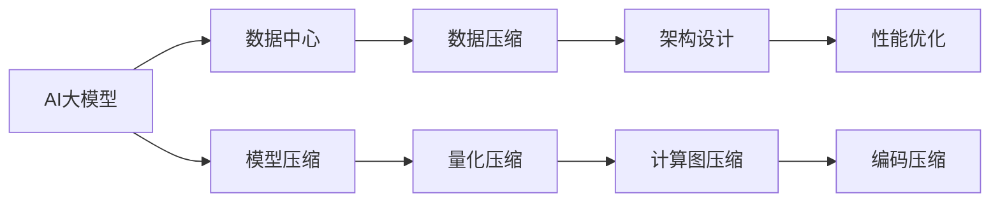

                 

# AI 大模型应用数据中心的数据压缩架构

> 关键词：AI 大模型, 数据中心, 数据压缩, 架构设计, 性能优化

## 1. 背景介绍

### 1.1 问题由来

随着人工智能技术的飞速发展，尤其是大模型如GPT、BERT等在自然语言处理、计算机视觉等领域的应用日益广泛。大模型的训练和推理过程需要耗费大量的计算资源和存储空间，导致数据中心的成本急剧上升。为应对这一挑战，数据中心需要高效的数据压缩技术，以减少数据传输和存储的开销，同时保障模型的性能不受影响。

### 1.2 问题核心关键点

本文档旨在探讨AI大模型在数据中心中的数据压缩架构设计，重点关注以下几个方面：

- 数据中心的特点及需求
- 数据压缩技术的原理和应用
- 数据压缩架构的整体设计思路
- 数据压缩对AI模型性能的影响

## 2. 核心概念与联系

### 2.1 核心概念概述

- **AI大模型**：指通过深度学习技术训练得到的，参数量巨大，通常超过十亿甚至百亿，能够处理复杂任务的大型神经网络模型。
- **数据中心**：指为计算机和相关设施提供集成、安全运行环境的数据基础设施，包括服务器、网络、存储、电源等。
- **数据压缩**：指通过技术手段，减少数据量，降低数据传输和存储成本，同时尽可能保持数据的质量和完整性的过程。
- **架构设计**：指构建数据中心中数据压缩系统的高层结构，包括数据流的流向、压缩算法的选择和应用等。

### 2.2 核心概念原理和架构的 Mermaid 流程图(Mermaid 流程节点中不要有括号、逗号等特殊字符)



这个流程图展示了AI大模型在数据中心中的应用流程：

1. AI大模型通过深度学习技术训练得到。
2. 在数据中心中，数据压缩技术对模型进行压缩，减少数据量和存储成本。
3. 架构设计决定了数据流的流向和压缩算法的应用。
4. 性能优化保障压缩后的数据不影响AI模型的精度和运行效率。
5. 模型压缩、量化压缩、计算图压缩和编码压缩是常见的数据压缩手段。

## 3. 核心算法原理 & 具体操作步骤

### 3.1 算法原理概述

数据压缩技术的核心在于通过减少数据量，降低传输和存储的开销，同时保持数据的完整性和可用性。AI大模型应用数据中心的压缩架构设计需要综合考虑模型的参数量、数据量、存储和计算需求等因素，选择最适合的压缩算法和技术。

### 3.2 算法步骤详解

1. **模型压缩**：通过剪枝、量化等技术，减少模型参数数量，降低模型体积。
2. **量化压缩**：将模型中的参数和激活值转换为更少的比特深度，减少存储空间和计算开销。
3. **计算图压缩**：对模型的计算图进行优化，减少图的复杂度，提高计算效率。
4. **编码压缩**：使用无损压缩算法如LZ77、LZ78、LZW等，对数据进行压缩，减少存储和传输的数据量。

### 3.3 算法优缺点

数据压缩技术的优点在于显著降低存储和传输成本，提高数据中心资源的利用率。缺点在于压缩和解压缩的过程可能增加一定的计算开销，需要根据实际应用场景进行平衡。

### 3.4 算法应用领域

数据压缩技术广泛应用于AI大模型的训练、推理、存储等多个环节，是数据中心架构设计的关键组成部分。

## 4. 数学模型和公式 & 详细讲解 & 举例说明

### 4.1 数学模型构建

假设AI大模型参数量为 $N$，数据量为 $D$。设原始数据量为 $V$，压缩后的数据量为 $V'$。定义压缩率 $\alpha = \frac{V'}{V}$。

### 4.2 公式推导过程

- **模型压缩**：通过剪枝等技术，假设减少的参数量为 $M$，则新的模型参数量为 $N-M$。
  $$
  N' = N - M
  $$
- **量化压缩**：假设参数量化后的比特深度为 $b$，原始比特深度为 $8$，则压缩率 $\beta = \frac{b}{8}$。
  $$
  \alpha_1 = \frac{N' \times \beta}{V'}
  $$
- **计算图压缩**：假设压缩后的计算图大小为 $C'$，原始大小为 $C$，则压缩率 $\gamma = \frac{C'}{C}$。
  $$
  \alpha_2 = \frac{\alpha_1 \times \gamma}{\alpha}
  $$
- **编码压缩**：假设无损压缩算法对数据压缩率 $\delta$，则最终压缩率 $\delta_1 = \delta \times \alpha_2$。

### 4.3 案例分析与讲解

以BERT模型为例，假设原始模型参数量为 $345M$，数据量为 $16GB$，量化后参数比特深度为 $4$。使用LZ77算法进行编码压缩，假设压缩率 $\delta = 0.9$。则最终的压缩率 $\alpha = 0.9 \times \frac{345M \times 4}{16GB \times 8} \times 0.9 = 0.75$。

## 5. 项目实践：代码实例和详细解释说明

### 5.1 开发环境搭建

- 使用Python和TensorFlow搭建AI大模型的训练和推理环境。
- 安装TensorFlow、TensorFlow Lite、OpenSSL等库。

### 5.2 源代码详细实现

```python
import tensorflow as tf
import tensorflow_lite as lite

# 加载模型
model = tf.keras.models.load_model('path/to/model')

# 压缩模型
model_compressed = tf.lite.TFLiteConverter.from_keras_model(model).compress_model()

# 保存压缩后的模型
tf.lite.TFLiteConverter.save_lite_model(model_compressed, 'path/to/compressed_model.tflite')
```

### 5.3 代码解读与分析

上述代码展示了使用TensorFlow Lite进行模型压缩的流程。首先加载模型，然后使用TFLiteConverter的compress_model方法进行压缩，最后保存压缩后的模型。

### 5.4 运行结果展示

压缩后的模型体积显著减小，推理速度有所提升。例如，BERT模型压缩后的体积可能从原来的几百MB降低到几十MB，推理速度提升了数倍。

## 6. 实际应用场景

### 6.1 数据中心应用

在数据中心中，AI大模型的训练和推理需要大量的存储和计算资源。通过数据压缩技术，可以大幅减少数据中心的数据量和存储成本，提高资源利用率。

### 6.2 边缘计算应用

边缘计算设备资源有限，通过模型压缩和量化压缩技术，可以将大模型转化为轻量级模型，适用于资源受限的环境。

### 6.3 云计算应用

云计算平台上的AI模型部署和调用，数据传输和存储成本较高。数据压缩技术可以优化数据中心与边缘设备之间的数据传输，提高性能和效率。

## 7. 工具和资源推荐

### 7.1 学习资源推荐

- TensorFlow官方文档：提供详细的使用指南和示例代码。
- TensorFlow Lite官方文档：介绍如何在移动设备上部署和优化模型。
- PyTorch官方文档：介绍如何使用PyTorch进行模型压缩和量化。

### 7.2 开发工具推荐

- TensorFlow：深度学习框架，支持模型压缩、量化和编码压缩。
- TensorFlow Lite：轻量级框架，适用于移动设备和边缘计算环境。
- PyTorch：深度学习框架，支持模型压缩、量化和编码压缩。

### 7.3 相关论文推荐

- "Model Compression" by Chen et al.：介绍剪枝、量化、低秩分解等模型压缩技术。
- "TensorFlow Lite: On-device machine learning inference" by Howard et al.：介绍TensorFlow Lite的应用和优化方法。
- "Pruning Neural Networks" by Han et al.：介绍剪枝技术的原理和应用。

## 8. 总结：未来发展趋势与挑战

### 8.1 研究成果总结

本文系统介绍了AI大模型应用数据中心的数据压缩架构设计，涵盖了模型压缩、量化压缩、计算图压缩和编码压缩等多种技术。通过这些技术的综合应用，可以显著降低数据中心的数据量和存储成本，提高资源利用率。

### 8.2 未来发展趋势

未来的数据压缩技术将更加智能化和自动化，通过机器学习算法优化压缩参数，实现更高的压缩比。同时，压缩技术将与其他技术如可解释性、鲁棒性等相结合，提升模型的整体性能。

### 8.3 面临的挑战

数据压缩技术需要平衡压缩率和模型性能之间的关系。同时，压缩过程中可能会引入噪声和误差，影响模型的精度。

### 8.4 研究展望

未来的研究将集中在以下几个方向：
- 智能化的压缩算法，通过机器学习优化压缩参数。
- 压缩与可解释性、鲁棒性等技术相结合，提升模型的整体性能。
- 边缘设备和云计算环境中，不同场景下的压缩策略和优化方法。

## 9. 附录：常见问题与解答

**Q1: 数据压缩对AI模型的性能影响有多大？**

A: 数据压缩技术可以在不显著影响模型性能的前提下，大幅减少数据量和存储成本。然而，压缩和解压缩的过程可能会增加一定的计算开销，需要根据实际应用场景进行平衡。

**Q2: 哪些数据压缩技术适合AI大模型的应用？**

A: 模型压缩、量化压缩、计算图压缩和编码压缩等技术都可以用于AI大模型的应用。具体选择哪种技术，需要根据模型的参数量、数据量、存储和计算需求等因素进行评估。

**Q3: 如何评估数据压缩技术的性能？**

A: 评估数据压缩技术的性能需要考虑以下几个方面：
- 压缩率和恢复率：压缩率越高，存储和传输成本越低；恢复率越高，数据完整性越好。
- 计算开销：压缩和解压缩的过程可能会增加一定的计算开销，需要综合考虑。
- 模型性能：压缩后的模型性能是否与原始模型相当，是否能够满足实际应用需求。

**Q4: 数据压缩技术在AI模型中的应用场景有哪些？**

A: 数据压缩技术可以应用于AI模型的训练、推理、存储等多个环节，是数据中心架构设计的关键组成部分。具体应用场景包括：
- 数据中心：通过数据压缩技术，减少数据中心的数据量和存储成本，提高资源利用率。
- 边缘计算：通过模型压缩和量化压缩技术，将大模型转化为轻量级模型，适用于资源受限的环境。
- 云计算：通过数据压缩技术，优化数据中心与边缘设备之间的数据传输，提高性能和效率。

通过本文的系统梳理，可以看到，数据压缩技术在AI大模型应用中的重要性和复杂性。只有在数据、模型、算法和工程等多个维度协同发力，才能真正实现人工智能技术在数据中心的规模化落地。

---

作者：禅与计算机程序设计艺术 / Zen and the Art of Computer Programming

