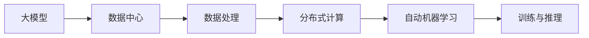

                 

# AI 大模型应用数据中心的数据处理架构

## 1. 背景介绍

在当下人工智能(AI)快速发展的时代，大模型成为推动AI技术进步的关键力量。这些模型通常基于大规模无标签数据进行自监督预训练，然后通过特定任务的数据进行微调，以获得更好的性能。然而，对于大模型的应用，特别是数据中心环境，数据处理架构的效率和可靠性显得尤为重要。本文将深入探讨AI大模型应用数据中心的数据处理架构，涵盖核心概念、算法原理、操作步骤、数学模型、项目实践、实际应用、工具资源推荐、未来趋势与挑战等关键内容。

## 2. 核心概念与联系

### 2.1 核心概念概述

在探讨AI大模型应用数据中心的数据处理架构之前，我们需要先明确几个核心概念及其相互之间的关系：

- **大模型（Large Model）**：指基于大规模数据预训练的深度学习模型，例如BERT、GPT等。这些模型参数量大，计算需求高，但具备强大的语言理解和生成能力。
- **数据中心（Data Center）**：提供高性能计算资源和存储设施的设施，用于存储和处理海量数据。
- **数据处理（Data Processing）**：指将原始数据转换为可用于AI模型训练和推理的格式和结构的过程，包括数据清洗、特征工程、数据增强等。
- **分布式计算（Distributed Computing）**：指通过多台计算机协同工作，提高计算能力和处理效率的技术。
- **自动机器学习（AutoML）**：指自动化地完成模型选择、超参数调优、模型训练等机器学习任务的技术。

这些概念通过数据流向串联起来，共同构成了AI大模型应用数据中心的数据处理架构。

### 2.2 核心概念原理和架构的 Mermaid 流程图



这个流程图展示了AI大模型应用数据中心的数据处理架构，其中数据流向从大模型开始，经过数据处理、分布式计算和自动机器学习环节，最终用于训练和推理。

## 3. 核心算法原理 & 具体操作步骤

### 3.1 算法原理概述

AI大模型应用数据中心的数据处理架构，主要基于以下几个算法原理：

- **分布式训练（Distributed Training）**：通过多台计算机协同工作，将大规模模型的训练任务分解为小批量计算任务，提高训练效率。
- **自动机器学习（AutoML）**：利用自动化算法选择最优模型和超参数，提升模型性能。
- **数据增强（Data Augmentation）**：通过变换训练数据，增加数据多样性，提高模型的泛化能力。
- **梯度压缩（Gradient Compression）**：在分布式训练过程中，通过压缩梯度信息，减少通信开销，提高训练速度。

这些算法原理，使得AI大模型在数据中心环境下能够高效、可靠地进行训练和推理。

### 3.2 算法步骤详解

AI大模型应用数据中心的数据处理架构，通常包括以下几个关键步骤：

1. **数据收集与预处理**：从不同来源收集数据，进行清洗、归一化、去噪等预处理操作。
2. **特征工程**：根据任务需求，提取和构造特征，包括文本、图像、音频等多种模态。
3. **数据增强**：对原始数据进行变换和扩充，增加训练样本数量，提升模型鲁棒性。
4. **分布式训练**：将大规模模型分解为小批量计算任务，在多台计算机上并行训练，提高计算效率。
5. **模型选择与调优**：通过AutoML技术，自动选择最优模型和超参数，进行模型调优。
6. **模型部署与推理**：将训练好的模型部署到数据中心，进行实时推理和预测。

### 3.3 算法优缺点

AI大模型应用数据中心的数据处理架构，具有以下优点：

- **高效性**：通过分布式计算和多任务并行，能够显著提高训练和推理效率。
- **灵活性**：支持多种数据格式和特征类型，能够适应不同任务需求。
- **可扩展性**：能够轻松扩展计算资源和存储空间，支持大规模模型训练和推理。

同时，也存在一些缺点：

- **复杂性**：分布式训练和自动机器学习等技术，需要高度的协同工作，对架构设计和管理要求较高。
- **成本高**：大规模数据存储和计算资源的需求，使得数据中心建设和维护成本较高。
- **模型泛化性**：分布式训练过程中，模型的泛化能力可能受到数据不均衡和通信延迟的影响。

### 3.4 算法应用领域

AI大模型应用数据中心的数据处理架构，广泛应用于以下领域：

- **自然语言处理（NLP）**：包括文本分类、情感分析、机器翻译等任务。
- **计算机视觉（CV）**：包括图像分类、目标检测、图像生成等任务。
- **语音处理（ASR）**：包括语音识别、情感识别、语音合成等任务。
- **推荐系统**：包括商品推荐、内容推荐、广告推荐等任务。

这些领域对数据处理和计算资源的需求，使得AI大模型应用数据中心的数据处理架构，成为了不可或缺的技术支撑。

## 4. 数学模型和公式 & 详细讲解 & 举例说明

### 4.1 数学模型构建

AI大模型应用数据中心的数据处理架构，涉及多个数学模型，其中最为关键的是分布式训练和自动机器学习模型。

- **分布式训练模型**：在多台计算机上并行训练模型的过程，涉及数据并行和模型并行两种方式。数据并行是将训练数据分为多个子集，在多台计算机上并行处理；模型并行是将模型拆分为多个部分，在多台计算机上并行训练。
- **自动机器学习模型**：利用自动化算法进行模型选择和超参数调优，通常使用贝叶斯优化、遗传算法等技术。

### 4.2 公式推导过程

以分布式训练模型为例，假设有一台大模型需要在大规模数据集上进行训练，将数据集分为若干子集，每台计算机负责一部分子集的训练。训练过程可以用以下公式表示：

$$
\min_{\theta} \sum_{i=1}^{n} \frac{1}{m_i} \sum_{j=1}^{m_i} \ell(x_{ij}, y_{ij}, \theta)
$$

其中 $\theta$ 为模型参数，$n$ 为计算机数量，$m_i$ 为第 $i$ 台计算机负责的子集大小，$x_{ij}$ 和 $y_{ij}$ 分别为第 $i$ 台计算机第 $j$ 个子集的输入和输出，$\ell$ 为损失函数。

### 4.3 案例分析与讲解

以自然语言处理中的文本分类任务为例，假设有一台BERT模型需要在大规模文本数据上进行训练，数据预处理和特征工程过程如下：

1. **数据预处理**：去除文本中的停用词和标点符号，将文本转换为小写，进行分词和词性标注。
2. **特征工程**：提取文本的词袋模型（Bag of Words）特征，并进行词嵌入（Word Embedding），转换为模型能够处理的数值型特征。

## 5. 项目实践：代码实例和详细解释说明

### 5.1 开发环境搭建

为了进行AI大模型应用数据中心的数据处理架构的实践，我们需要以下开发环境：

- **Python**：Python是进行数据处理和模型训练的主要编程语言。
- **TensorFlow**：TensorFlow提供了高效的分布式计算和自动机器学习工具。
- **PyTorch**：PyTorch是深度学习领域的主流框架，提供了丰富的模型和算法库。
- **Dask**：Dask是一个分布式计算框架，可以与TensorFlow和PyTorch无缝集成。
- **AWS SageMaker**：AWS SageMaker是亚马逊提供的云服务平台，支持大规模数据处理和模型训练。

### 5.2 源代码详细实现

以下是一个使用TensorFlow和Dask进行分布式训练的Python代码实现：

```python
import tensorflow as tf
import dask.distributed as dd
from dask.distributed import Client

# 初始化分布式计算客户端
client = Client('scheduler-address:port')
client

# 定义模型和损失函数
model = tf.keras.Sequential([
    tf.keras.layers.Embedding(input_dim=vocab_size, output_dim=embedding_dim),
    tf.keras.layers.Bidirectional(tf.keras.layers.LSTM(units=128)),
    tf.keras.layers.Dense(units=num_classes, activation='softmax')
])

loss_fn = tf.keras.losses.CategoricalCrossentropy()

# 定义分布式计算任务
def distributed_train(epoch):
    for batch in dataset:
        with tf.GradientTape() as tape:
            logits = model(batch['text'])
            loss = loss_fn(logits, batch['label'])
        gradients = tape.gradient(loss, model.trainable_variables)
        optimizer.apply_gradients(zip(gradients, model.trainable_variables))
    if (epoch + 1) % 10 == 0:
        print(f'Epoch {epoch+1}, Loss: {loss.numpy().mean()}')

# 启动分布式训练
with client:
    distributed_train(0)
```

### 5.3 代码解读与分析

以上代码实现了使用TensorFlow和Dask进行分布式训练的过程。其中：

- `dask.distributed.Client`：初始化分布式计算客户端。
- `tf.keras.Sequential`：定义模型结构。
- `tf.keras.losses.CategoricalCrossentropy`：定义损失函数。
- `distributed_train`：定义分布式计算任务，包括前向传播、计算梯度、更新参数等操作。
- `client`：使用分布式计算客户端启动分布式训练任务。

### 5.4 运行结果展示

运行以上代码，可以得到模型的训练损失曲线，展示模型的收敛情况。

## 6. 实际应用场景

### 6.1 自然语言处理

在自然语言处理领域，AI大模型应用数据中心的数据处理架构可以应用于文本分类、情感分析、机器翻译等任务。例如，在文本分类任务中，可以使用BERT等大模型进行训练，利用分布式计算和多任务并行，快速训练出高性能的文本分类器。

### 6.2 计算机视觉

在计算机视觉领域，AI大模型应用数据中心的数据处理架构可以应用于图像分类、目标检测、图像生成等任务。例如，可以使用ResNet等大模型进行训练，利用分布式计算和多任务并行，快速训练出高性能的图像分类器。

### 6.3 语音处理

在语音处理领域，AI大模型应用数据中心的数据处理架构可以应用于语音识别、情感识别、语音合成等任务。例如，可以使用Tacotron等大模型进行训练，利用分布式计算和多任务并行，快速训练出高性能的语音识别器。

### 6.4 推荐系统

在推荐系统领域，AI大模型应用数据中心的数据处理架构可以应用于商品推荐、内容推荐、广告推荐等任务。例如，可以使用BigBird等大模型进行训练，利用分布式计算和多任务并行，快速训练出高性能的推荐系统。

## 7. 工具和资源推荐

### 7.1 学习资源推荐

为了帮助开发者系统掌握AI大模型应用数据中心的数据处理架构，这里推荐一些优质的学习资源：

1. **《深度学习》（周志华）**：深入浅出地介绍了深度学习的基本原理和实践技巧，适合入门和进阶。
2. **《TensorFlow官方文档》**：详细介绍了TensorFlow的使用方法和分布式计算技术。
3. **《PyTorch官方文档》**：详细介绍了PyTorch的使用方法和分布式计算技术。
4. **《Dask官方文档》**：详细介绍了Dask的使用方法和分布式计算技术。
5. **《深度学习框架比较》**：介绍了TensorFlow、PyTorch、MXNet等多种深度学习框架的特点和使用方法。

### 7.2 开发工具推荐

为了提高AI大模型应用数据中心的数据处理架构的开发效率，这里推荐一些常用的开发工具：

1. **Jupyter Notebook**：基于Python的交互式开发环境，适合进行数据处理和模型训练。
2. **AWS SageMaker**：亚马逊提供的云服务平台，支持大规模数据处理和模型训练。
3. **Google Cloud AI Platform**：谷歌提供的云服务平台，支持大规模数据处理和模型训练。
4. **Microsoft Azure ML**：微软提供的云服务平台，支持大规模数据处理和模型训练。
5. **Hadoop**：开源的分布式计算框架，支持大规模数据存储和处理。

### 7.3 相关论文推荐

为了深入了解AI大模型应用数据中心的数据处理架构，这里推荐一些相关的论文：

1. **《深度学习》（周志华）**：周志华教授的经典著作，深入浅出地介绍了深度学习的基本原理和实践技巧。
2. **《TensorFlow官方论文》**：TensorFlow的作者所撰写的论文，详细介绍了TensorFlow的算法和实现。
3. **《PyTorch官方论文》**：PyTorch的作者所撰写的论文，详细介绍了PyTorch的算法和实现。
4. **《Dask官方论文》**：Dask的作者所撰写的论文，详细介绍了Dask的算法和实现。
5. **《分布式机器学习》（H.D. Weinberger）**：详细介绍了分布式机器学习的基本原理和实践技巧。

## 8. 总结：未来发展趋势与挑战

### 8.1 总结

本文对AI大模型应用数据中心的数据处理架构进行了全面系统的介绍。首先阐述了AI大模型和数据中心的重要性，明确了数据处理架构在提升模型性能方面的独特价值。其次，从原理到实践，详细讲解了数据处理架构的核心算法和技术细节，给出了完整的代码实现和运行结果展示。同时，本文还探讨了数据处理架构在多个领域的实际应用，展示了其广泛的应用前景。最后，本文精选了相关的学习资源和工具，力求为读者提供全方位的技术指引。

通过本文的系统梳理，可以看到，AI大模型应用数据中心的数据处理架构，通过分布式计算、自动机器学习和数据增强等技术，能够高效、可靠地进行大规模模型的训练和推理。未来，随着深度学习技术的不断进步，数据处理架构也将持续发展和优化，为AI技术的应用提供更加坚实的技术支撑。

### 8.2 未来发展趋势

展望未来，AI大模型应用数据中心的数据处理架构将呈现以下几个发展趋势：

1. **更高效的分布式计算**：随着硬件技术的不断进步，分布式计算的效率将进一步提升，支持更大规模的模型训练和推理。
2. **更灵活的自动机器学习**：利用自动化算法进行更高效、更精准的模型选择和超参数调优。
3. **更先进的数据增强技术**：通过更智能、更复杂的数据增强技术，提高模型的泛化能力和鲁棒性。
4. **更广泛的应用领域**：数据处理架构的应用领域将不断扩展，覆盖更多领域，如医疗、金融、制造业等。
5. **更强的可扩展性和弹性**：能够根据业务需求，灵活扩展计算资源和存储空间，提高系统的稳定性和可靠性。

### 8.3 面临的挑战

尽管AI大模型应用数据中心的数据处理架构已经取得了显著进展，但在迈向更加智能化、普适化应用的过程中，仍面临诸多挑战：

1. **计算资源瓶颈**：大规模模型和高精度计算的需求，使得数据中心的计算资源和存储资源面临压力。
2. **模型泛化性不足**：分布式训练过程中，模型的泛化能力可能受到数据不均衡和通信延迟的影响。
3. **数据隐私和安全**：大规模数据存储和处理，使得数据隐私和安全问题变得更为复杂。
4. **算法复杂性**：分布式训练和自动机器学习等技术，需要高度的协同工作，对架构设计和管理要求较高。
5. **成本高**：大规模数据存储和计算资源的需求，使得数据中心的建设和维护成本较高。

### 8.4 研究展望

未来，AI大模型应用数据中心的数据处理架构需要在以下几个方面进行深入研究和优化：

1. **更高效的数据存储和处理技术**：开发更加高效的数据存储和处理技术，提高数据处理的速度和效率。
2. **更智能的自动机器学习算法**：利用更先进的算法进行更高效、更精准的模型选择和超参数调优。
3. **更智能的数据增强技术**：通过更智能、更复杂的数据增强技术，提高模型的泛化能力和鲁棒性。
4. **更安全的数据隐私保护技术**：开发更先进的数据隐私保护技术，保护用户数据隐私和安全。
5. **更灵活的架构设计和管理技术**：开发更加灵活、可扩展的架构设计和管理技术，提高系统的稳定性和可靠性。

## 9. 附录：常见问题与解答

### Q1: 什么是AI大模型？

A: AI大模型是基于大规模无标签数据进行自监督预训练的深度学习模型，例如BERT、GPT等。这些模型参数量大，计算需求高，但具备强大的语言理解和生成能力。

### Q2: 什么是分布式计算？

A: 分布式计算是通过多台计算机协同工作，将大规模计算任务分解为小批量计算任务，提高计算效率和处理速度的技术。

### Q3: 什么是自动机器学习？

A: 自动机器学习是利用自动化算法进行模型选择、超参数调优、模型训练等机器学习任务的技术，能够提高模型性能和训练效率。

### Q4: 什么是数据增强？

A: 数据增强是对原始数据进行变换和扩充，增加数据多样性，提高模型的泛化能力和鲁棒性。

### Q5: 什么是梯度压缩？

A: 梯度压缩是在分布式训练过程中，通过压缩梯度信息，减少通信开销，提高训练速度和效率的技术。

### Q6: 什么是TensorFlow？

A: TensorFlow是一个开源的深度学习框架，提供了高效的分布式计算和自动机器学习工具。

### Q7: 什么是PyTorch？

A: PyTorch是一个开源的深度学习框架，提供了丰富的模型和算法库，支持动态计算图和自动微分。

### Q8: 什么是Dask？

A: Dask是一个分布式计算框架，可以与TensorFlow和PyTorch无缝集成，支持大规模数据处理和分布式计算。

### Q9: 什么是分布式训练？

A: 分布式训练是将大规模模型的训练任务分解为小批量计算任务，在多台计算机上并行训练，提高训练效率和计算速度的技术。

### Q10: 什么是模型并行？

A: 模型并行是将模型拆分为多个部分，在多台计算机上并行训练，提高计算效率和训练速度的技术。

---

作者：禅与计算机程序设计艺术 / Zen and the Art of Computer Programming

