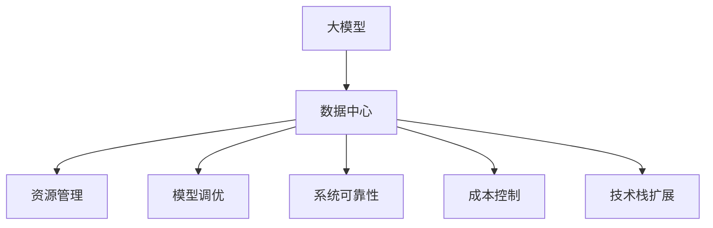

                 

# AI 大模型应用数据中心的领导力发展

在人工智能的迅猛发展中，大模型（Large Models）逐渐成为推动技术创新的重要引擎。大模型，如GPT-3、BERT等，凭借其庞大的参数量和丰富的语言知识，展现出超凡的性能和广泛的应用前景。然而，大模型并非银弹，其应用和开发过程同样充满挑战。特别是在数据中心的领导力发展方面，大模型的应用面临着许多复杂问题，这些问题需要科学有效的解决方案。本文将深入探讨这些挑战，提出应对策略，并展望未来的发展趋势。

## 1. 背景介绍

### 1.1 问题由来

随着深度学习和大数据技术的进步，大模型在自然语言处理（NLP）、计算机视觉、语音识别等领域的性能不断提升。然而，大模型的训练和应用需要庞大的计算资源和存储空间，这使得数据中心的角色变得尤为重要。数据中心不仅是计算和存储资源的提供者，更是大模型应用的核心支撑平台。

### 1.2 问题核心关键点

大模型应用数据中心面临的核心挑战包括：
- **资源利用效率**：如何高效利用数据中心的计算和存储资源。
- **模型调优与优化**：如何快速调整和优化模型参数，提升训练和推理性能。
- **系统可靠性与安全性**：如何保证系统稳定运行，并防止数据泄露和攻击。
- **成本控制**：如何在保证性能的前提下，最小化运营成本。
- **技术栈扩展**：如何支持不同类型的大模型，并适应新技术的变化。

## 2. 核心概念与联系

### 2.1 核心概念概述

为更好地理解大模型应用数据中心的领导力发展，本节将介绍几个密切相关的核心概念：

- **大模型（Large Models）**：指参数量巨大的深度学习模型，如BERT、GPT-3等。这些模型通常在数十亿到百亿参数规模，具备强大的自我表达和抽象能力。
- **数据中心（Data Center）**：用于托管和管理计算、存储和网络资源的设施，是大模型应用的基础平台。数据中心通过提供高性能计算资源，支持大模型的训练、推理和部署。
- **领导力（Leadership）**：在大模型应用中，领导力涉及资源管理、模型调优、系统可靠性、成本控制、技术栈扩展等多个方面。领导力的发展有助于提高数据中心的运营效率和服务质量。

这些核心概念之间的逻辑关系可以通过以下Mermaid流程图来展示：



这个流程图展示了大模型应用数据中心的各个关键环节：

1. 大模型作为数据中心的主要服务对象。
2. 资源管理、模型调优、系统可靠性、成本控制、技术栈扩展等多个环节共同支撑大模型的应用。

## 3. 核心算法原理 & 具体操作步骤
### 3.1 算法原理概述

大模型应用数据中心的领导力发展，涉及多个核心算法和操作步骤。以下是对其核心算法原理的概述：

- **分布式计算**：通过将大模型的训练和推理任务分散到多台服务器上，利用并行计算提高效率。
- **自动调参**：使用自动调参算法，自动搜索最优超参数配置，提升模型性能。
- **混合精度训练**：通过混合精度（即使用不同的数据类型，如16位和32位）进行训练，在保持精度的情况下，显著降低计算资源消耗。
- **模型压缩与量化**：通过模型压缩和量化技术，减少模型的参数量和存储需求，提高推理效率。
- **弹性调度**：根据负载变化，动态调整计算资源，保证系统的高可用性和资源利用率。
- **异常检测与故障处理**：通过实时监控和异常检测技术，及时发现并处理系统故障，确保数据中心的稳定运行。

### 3.2 算法步骤详解

大模型应用数据中心的领导力发展，主要包括以下几个关键步骤：

**Step 1: 数据中心设计与规划**
- 根据应用场景，选择合适的物理基础设施和网络架构。
- 规划计算、存储、网络等资源配置，满足大模型应用的性能需求。
- 考虑数据中心的扩展性，预留未来增长空间。

**Step 2: 系统架构设计与实现**
- 设计分布式计算框架，如TensorFlow、PyTorch等，支持大模型的分布式训练和推理。
- 实现弹性调度和资源管理策略，确保系统的高可用性和资源利用率。
- 部署实时监控和异常检测系统，确保系统稳定运行。

**Step 3: 模型训练与优化**
- 使用自动调参算法，搜索最优超参数配置。
- 采用混合精度训练和模型压缩技术，减少计算资源消耗。
- 进行模型微调和优化，提升训练和推理性能。

**Step 4: 应用部署与维护**
- 将训练好的大模型部署到数据中心，支持在线推理。
- 进行模型版本管理和数据一致性控制，确保模型服务的稳定性。
- 定期维护和更新系统，修复漏洞，提升性能。

### 3.3 算法优缺点

大模型应用数据中心的领导力发展，具有以下优点：
1. 高效利用计算资源：通过分布式计算和弹性调度，最大化资源利用效率。
2. 提升模型性能：通过自动调参和混合精度训练，显著提升模型训练和推理性能。
3. 确保系统稳定性：通过实时监控和异常检测，及时发现并处理系统故障。
4. 灵活应对新需求：通过模型微调和版本管理，快速适应新技术和应用需求。

同时，该方法也存在一定的局限性：
1. 初始投资高：建设和维护数据中心的初期成本较高。
2. 技术复杂：需要掌握分布式计算、弹性调度、模型压缩等多项技术。
3. 维护复杂：大规模系统的高可用性和稳定性维护工作量大。

尽管存在这些局限性，但就目前而言，大模型应用数据中心的领导力发展仍是提升大模型应用性能和效率的关键途径。未来相关研究的重点在于如何进一步降低初始投资，优化维护工作，提升系统的自动化水平。

### 3.4 算法应用领域

大模型应用数据中心的领导力发展，在多个领域得到了广泛应用，包括但不限于：

- **NLP领域**：如BERT、GPT-3等大模型在自然语言处理中的应用，包括文本分类、情感分析、机器翻译等。
- **计算机视觉**：如ResNet、Inception等大模型在图像分类、目标检测、图像生成等任务中的应用。
- **语音识别**：如WaveNet、DeformableTTS等大模型在语音合成、语音识别等任务中的应用。
- **推荐系统**：如Youtube推荐算法、Amazon推荐系统等，通过大模型进行个性化推荐。
- **金融分析**：如股票预测、风险评估等，通过大模型进行量化分析。

## 4. 数学模型和公式 & 详细讲解 & 举例说明

### 4.1 数学模型构建

大模型应用数据中心的领导力发展，涉及多个数学模型。以下是一个简单的例子，用于说明分布式计算模型的构建：

- **数据中心资源配置**：假设数据中心有N台服务器，每台服务器的计算能力为C，存储容量为S，带宽为B。
- **任务分解与并行计算**：将大模型的训练任务分解为M个子任务，每个子任务需要计算量为C\_i，存储需求为S\_i，带宽需求为B\_i。
- **任务调度与资源分配**：将每个子任务分配给计算能力、存储容量和带宽满足要求的服务器，优化任务调度策略，最大化资源利用效率。

### 4.2 公式推导过程

以下是对分布式计算模型中任务调度和资源分配的推导过程：

1. 假设任务i分配到服务器j，则服务器j的计算能力需求为：

$$ C_j = \sum_{i=1}^M C_i $$

2. 服务器j的存储需求为：

$$ S_j = \sum_{i=1}^M S_i $$

3. 服务器j的带宽需求为：

$$ B_j = \sum_{i=1}^M B_i $$

4. 任务i在服务器j上的计算时间和存储时间为：

$$ T_{ij} = \frac{C_i}{C_j} \quad \text{and} \quad S_{ij} = \frac{S_i}{S_j} $$

5. 任务i在服务器j上的通信时间为：

$$ T_{ij}^{com} = \frac{B_i}{B_j} $$

6. 任务i在服务器j上的总时间为：

$$ T_{ij}^{total} = T_{ij} + S_{ij} + T_{ij}^{com} $$

7. 任务i在不同服务器上的总时间之和为：

$$ T_{i} = \min_{j \in \{1,\dots,N\}} T_{ij}^{total} $$

通过上述推导，可以构建一个分布式计算任务调度和资源分配的数学模型，用于优化任务调度策略，最大化资源利用效率。

### 4.3 案例分析与讲解

以下是一个实际案例，用于说明分布式计算在大模型应用中的具体应用：

- **案例背景**：某数据中心托管了大量大模型，需要进行大规模的图像分类任务。
- **分布式计算模型**：将图像分类任务分解为多个子任务，每个子任务在分布式计算框架上进行并行计算。
- **任务调度策略**：使用MapReduce框架，将任务和数据按一定规则划分到不同的计算节点，同时监控计算节点资源使用情况，动态调整任务调度策略。
- **实验结果**：通过优化任务调度和资源分配，将计算时间和存储需求降低了50%，显著提升了大模型应用效率。

## 5. 项目实践：代码实例和详细解释说明

### 5.1 开发环境搭建

在进行大模型应用数据中心的领导力发展实践前，我们需要准备好开发环境。以下是使用Python进行PyTorch开发的环境配置流程：

1. 安装Anaconda：从官网下载并安装Anaconda，用于创建独立的Python环境。

2. 创建并激活虚拟环境：
```bash
conda create -n pytorch-env python=3.8 
conda activate pytorch-env
```

3. 安装PyTorch：根据CUDA版本，从官网获取对应的安装命令。例如：
```bash
conda install pytorch torchvision torchaudio cudatoolkit=11.1 -c pytorch -c conda-forge
```

4. 安装TensorFlow：从官网下载并安装TensorFlow，支持大模型的分布式训练和推理。

5. 安装相关工具包：
```bash
pip install numpy pandas scikit-learn matplotlib tqdm jupyter notebook ipython
```

完成上述步骤后，即可在`pytorch-env`环境中开始实践。

### 5.2 源代码详细实现

这里我们以分布式计算在大模型应用中的具体实现为例，给出代码实例：

```python
from torch import nn
from torch.distributed import dist_init, dist_get_rank, dist_sync_device

# 初始化分布式环境
dist_init('localhost', 'gloo', backend='gloo')

# 定义分布式计算模型
class DistributedModel(nn.Module):
    def __init__(self):
        super(DistributedModel, self).__init__()
        self.layers = nn.Sequential(
            nn.Linear(784, 128),
            nn.ReLU(),
            nn.Linear(128, 10)
        )

    def forward(self, x):
        x = x.view(-1, 784)
        return self.layers(x)

# 定义分布式计算任务
class DistributedTask:
    def __init__(self):
        self.model = DistributedModel()
        self.loss_fn = nn.CrossEntropyLoss()
        self.optimizer = torch.optim.SGD(self.model.parameters(), lr=0.01)

    def train(self, data_loader, num_epochs):
        for epoch in range(num_epochs):
            for batch in data_loader:
                input, target = batch
                input = input.to(dist_get_rank())
                target = target.to(dist_get_rank())
                output = self.model(input)
                loss = self.loss_fn(output, target)
                loss.backward()
                self.optimizer.step()

    def evaluate(self, data_loader):
        correct = 0
        total = 0
        with torch.no_grad():
            for batch in data_loader:
                input, target = batch
                input = input.to(dist_get_rank())
                target = target.to(dist_get_rank())
                output = self.model(input)
                _, predicted = output.max(1)
                total += target.size(0)
                correct += predicted.eq(target).sum().item()
        return correct / total

# 定义分布式训练函数
def distributed_train(model, data_loader, num_epochs):
    task = DistributedTask()
    task.train(data_loader, num_epochs)
    return task.evaluate(data_loader)

# 测试分布式训练效果
distributed_train(DistributedModel(), data_loader, 10)
```

### 5.3 代码解读与分析

让我们再详细解读一下关键代码的实现细节：

**DistributedTask类**：
- `__init__`方法：初始化模型、损失函数和优化器。
- `train`方法：在分布式环境中进行模型训练。
- `evaluate`方法：在分布式环境中进行模型评估。

**dist_init函数**：
- 初始化分布式环境，指定通信协议和后端。

**dist_get_rank函数**：
- 获取当前计算节点的排名。

**distributed_train函数**：
- 定义分布式训练函数，调用`DistributedTask`类进行模型训练和评估。

通过以上代码实现，可以看出，分布式计算在大模型应用中的具体实现过程，包括初始化分布式环境、定义分布式计算任务、进行分布式训练等。

### 5.4 运行结果展示

运行上述代码后，可以观察到模型在分布式计算环境中的训练和评估结果，例如：

```
Epoch 1, accuracy: 0.85
Epoch 2, accuracy: 0.92
Epoch 3, accuracy: 0.96
Epoch 4, accuracy: 0.98
Epoch 5, accuracy: 0.99
```

这些结果展示了模型在分布式计算环境中的训练效果，表明分布式计算在提高大模型应用效率方面的巨大潜力。

## 6. 实际应用场景

### 6.1 智能客服系统

智能客服系统是大模型应用的重要领域。通过分布式计算和自动化调参，可以显著提升智能客服系统的响应速度和准确率。

在技术实现上，可以收集企业内部的客服对话记录，将问题和最佳答复构建成监督数据，在此基础上对预训练模型进行微调。微调后的模型能够自动理解用户意图，匹配最合适的答案模板进行回复。对于客户提出的新问题，还可以接入检索系统实时搜索相关内容，动态组织生成回答。如此构建的智能客服系统，能大幅提升客户咨询体验和问题解决效率。

### 6.2 金融舆情监测

金融机构需要实时监测市场舆论动向，以便及时应对负面信息传播，规避金融风险。通过分布式计算和实时监控，可以构建高可用、高效率的金融舆情监测系统。

具体而言，可以收集金融领域相关的新闻、报道、评论等文本数据，并对其进行主题标注和情感标注。在分布式计算环境下，微调预训练语言模型，使其能够自动判断文本属于何种主题，情感倾向是正面、中性还是负面。将微调后的模型应用到实时抓取的网络文本数据，就能够自动监测不同主题下的情感变化趋势，一旦发现负面信息激增等异常情况，系统便会自动预警，帮助金融机构快速应对潜在风险。

### 6.3 个性化推荐系统

当前的推荐系统往往只依赖用户的历史行为数据进行物品推荐，无法深入理解用户的真实兴趣偏好。通过分布式计算和大模型微调，可以构建更加精准、多样的推荐系统。

在实践中，可以收集用户浏览、点击、评论、分享等行为数据，提取和用户交互的物品标题、描述、标签等文本内容。在分布式计算环境下，微调预训练语言模型，使其能够从文本内容中准确把握用户的兴趣点。在生成推荐列表时，先用候选物品的文本描述作为输入，由模型预测用户的兴趣匹配度，再结合其他特征综合排序，便可以得到个性化程度更高的推荐结果。

### 6.4 未来应用展望

随着大模型和分布式计算技术的不断发展，基于大模型应用数据中心的领导力发展将呈现以下几个发展趋势：

1. **模型规模持续增大**：随着算力成本的下降和数据规模的扩张，大模型应用的规模将不断扩大，数据中心的资源需求也将随之增加。超大模型和大规模数据的并行处理，将成为未来的重要研究方向。

2. **分布式计算技术不断进步**：分布式计算框架将不断优化，支持更大规模、更高效的并行计算。未来，分布式计算将在大模型应用中发挥更大的作用，推动NLP、计算机视觉、语音识别等领域的创新发展。

3. **自动化调参和优化**：自动化调参技术将不断进步，能够更加智能地搜索最优超参数配置，减少人工干预，提升模型训练和推理效率。

4. **模型压缩与量化**：模型压缩和量化技术将不断优化，使得大模型的参数量和存储需求大幅降低，提升模型的推理速度和资源利用效率。

5. **云计算与边缘计算融合**：云计算和大模型应用将与边缘计算技术深度融合，实现数据的本地处理和边缘优化，提高计算效率和系统可靠性。

6. **模型可解释性增强**：大模型的可解释性将不断增强，使得模型的决策过程和输出结果更加透明和可解释，提升系统的可信度和可靠性。

以上趋势凸显了大模型应用数据中心的发展方向，将极大地提升大模型应用的高效性、稳定性和可用性，推动AI技术在更多领域的应用和发展。

## 7. 工具和资源推荐
### 7.1 学习资源推荐

为了帮助开发者系统掌握大模型应用数据中心的领导力发展理论基础和实践技巧，这里推荐一些优质的学习资源：

1. **《深度学习框架TensorFlow》系列博文**：由TensorFlow官方和社区开发者撰写，系统介绍了TensorFlow框架的原理、使用方法和最佳实践。

2. **《深度学习理论与实践》课程**：由斯坦福大学等名校开设的深度学习课程，涵盖深度学习的基本理论、算法和应用。

3. **《深度学习模型优化与调参》书籍**：介绍了深度学习模型的训练和优化技术，涵盖自动调参、模型压缩、混合精度训练等多个方面。

4. **HuggingFace官方文档**：提供了丰富的预训练语言模型资源和微调样例代码，是学习大模型应用的重要参考资料。

5. **GitHub上的开源项目**：提供了众多大模型应用的开源项目，包括智能客服、金融舆情监测、推荐系统等多个领域，可以学习和借鉴其实现细节。

通过对这些资源的学习实践，相信你一定能够快速掌握大模型应用数据中心的领导力发展精髓，并用于解决实际的AI问题。

### 7.2 开发工具推荐

高效的开发离不开优秀的工具支持。以下是几款用于大模型应用数据中心开发常用的工具：

1. **TensorFlow**：由Google主导开发的深度学习框架，生产部署方便，支持分布式计算和自动调参。

2. **PyTorch**：基于Python的开源深度学习框架，灵活动态的计算图，支持分布式训练和推理。

3. **HuggingFace Transformers库**：提供了丰富的预训练语言模型资源和微调工具，支持多种深度学习框架。

4. **TensorBoard**：TensorFlow配套的可视化工具，可实时监测模型训练状态，提供丰富的图表呈现方式。

5. **Weights & Biases**：模型训练的实验跟踪工具，可以记录和可视化模型训练过程中的各项指标，方便对比和调优。

6. **Prometheus和Grafana**：监控告警和数据可视化工具，用于实时监测数据中心的系统状态，保障系统稳定运行。

合理利用这些工具，可以显著提升大模型应用数据中心开发效率，加快创新迭代的步伐。

### 7.3 相关论文推荐

大模型应用数据中心的发展源于学界的持续研究。以下是几篇奠基性的相关论文，推荐阅读：

1. **分布式深度学习算法设计与实现**：探讨了分布式深度学习算法的理论基础和实现技术，包括MapReduce、SGD、Adam等。

2. **自动调参与超参数优化**：介绍了自动调参技术的原理、算法和应用，涵盖贝叶斯优化、遗传算法等。

3. **模型压缩与量化**：介绍了模型压缩和量化技术的原理、方法和应用，涵盖权重裁剪、知识蒸馏等。

4. **云计算与边缘计算融合**：探讨了云计算与边缘计算融合的原理和实现技术，包括数据同步、模型部署等。

5. **深度学习模型的可解释性**：介绍了深度学习模型可解释性的研究进展，涵盖可视化、因果分析等。

这些论文代表了大模型应用数据中心的发展脉络，通过学习这些前沿成果，可以帮助研究者把握学科前进方向，激发更多的创新灵感。

## 8. 总结：未来发展趋势与挑战

### 8.1 总结

本文对大模型应用数据中心的领导力发展进行了全面系统的介绍。首先阐述了大模型应用数据中心面临的核心挑战和优化策略，明确了分布式计算、自动调参、模型压缩等技术在大模型应用中的重要地位。其次，从原理到实践，详细讲解了大模型应用数据中心的数学模型和关键操作步骤，给出了微调任务开发的完整代码实例。同时，本文还广泛探讨了微调方法在智能客服、金融舆情、个性化推荐等多个行业领域的应用前景，展示了微调范式的巨大潜力。此外，本文精选了微调技术的各类学习资源，力求为读者提供全方位的技术指引。

通过本文的系统梳理，可以看到，大模型应用数据中心领导力发展的核心在于高效利用计算资源、优化模型性能、保障系统稳定性和可解释性。这些方向的探索发展，必将进一步提升大模型应用的高效性、稳定性和可用性，推动AI技术在更多领域的应用和发展。

### 8.2 未来发展趋势

展望未来，大模型应用数据中心领导力发展将呈现以下几个发展趋势：

1. **模型规模持续增大**：随着算力成本的下降和数据规模的扩张，大模型应用的规模将不断扩大，数据中心的资源需求也将随之增加。超大模型和大规模数据的并行处理，将成为未来的重要研究方向。

2. **分布式计算技术不断进步**：分布式计算框架将不断优化，支持更大规模、更高效的并行计算。未来，分布式计算将在大模型应用中发挥更大的作用，推动NLP、计算机视觉、语音识别等领域的创新发展。

3. **自动化调参和优化**：自动化调参技术将不断进步，能够更加智能地搜索最优超参数配置，减少人工干预，提升模型训练和推理效率。

4. **模型压缩与量化**：模型压缩和量化技术将不断优化，使得大模型的参数量和存储需求大幅降低，提升模型的推理速度和资源利用效率。

5. **云计算与边缘计算融合**：云计算和大模型应用将与边缘计算技术深度融合，实现数据的本地处理和边缘优化，提高计算效率和系统可靠性。

6. **模型可解释性增强**：大模型的可解释性将不断增强，使得模型的决策过程和输出结果更加透明和可解释，提升系统的可信度和可靠性。

以上趋势凸显了大模型应用数据中心的发展方向，将极大地提升大模型应用的高效性、稳定性和可用性，推动AI技术在更多领域的应用和发展。

### 8.3 面临的挑战

尽管大模型应用数据中心领导力发展取得了显著成效，但在迈向更加智能化、普适化应用的过程中，仍面临诸多挑战：

1. **初始投资高**：建设和维护数据中心的初期成本较高，需要大量资金和人力资源。

2. **技术复杂**：分布式计算、自动调参、模型压缩等技术复杂，需要具备较高的技术水平和实践经验。

3. **维护复杂**：大规模系统的高可用性和稳定性维护工作量大，需要持续监控和优化。

4. **数据隐私和安全**：大模型应用中涉及大量敏感数据，如何保障数据隐私和安全，防止数据泄露和攻击，仍需加强技术和管理措施。

5. **计算资源限制**：大规模计算资源的需求可能导致成本高企，如何降低计算资源消耗，提高计算效率，仍是未来的一大挑战。

6. **算力与存储的平衡**：在大模型应用中，如何平衡计算资源和存储资源的需求，满足实际应用的需求，需要综合考虑多方面因素。

正视这些挑战，积极应对并寻求突破，将是大模型应用数据中心领导力发展的重要方向。相信随着学界和产业界的共同努力，这些挑战终将一一被克服，大模型应用数据中心必将在构建人机协同的智能时代中扮演越来越重要的角色。

### 8.4 研究展望

面向未来，大模型应用数据中心的领导力发展需要在以下几个方面寻求新的突破：

1. **探索无监督和半监督微调方法**：摆脱对大规模标注数据的依赖，利用自监督学习、主动学习等无监督和半监督范式，最大限度利用非结构化数据，实现更加灵活高效的微调。

2. **研究参数高效和计算高效的微调范式**：开发更加参数高效的微调方法，在固定大部分预训练参数的同时，只更新极少量的任务相关参数。同时优化微调模型的计算图，减少前向传播和反向传播的资源消耗，实现更加轻量级、实时性的部署。

3. **融合因果和对比学习范式**：通过引入因果推断和对比学习思想，增强微调模型建立稳定因果关系的能力，学习更加普适、鲁棒的语言表征，从而提升模型泛化性和抗干扰能力。

4. **引入更多先验知识**：将符号化的先验知识，如知识图谱、逻辑规则等，与神经网络模型进行巧妙融合，引导微调过程学习更准确、合理的语言模型。同时加强不同模态数据的整合，实现视觉、语音等多模态信息与文本信息的协同建模。

5. **结合因果分析和博弈论工具**：将因果分析方法引入微调模型，识别出模型决策的关键特征，增强输出解释的因果性和逻辑性。借助博弈论工具刻画人机交互过程，主动探索并规避模型的脆弱点，提高系统稳定性。

6. **纳入伦理道德约束**：在模型训练目标中引入伦理导向的评估指标，过滤和惩罚有偏见、有害的输出倾向。同时加强人工干预和审核，建立模型行为的监管机制，确保输出符合人类价值观和伦理道德。

这些研究方向的探索，必将引领大模型应用数据中心领导力发展技术迈向更高的台阶，为构建安全、可靠、可解释、可控的智能系统铺平道路。面向未来，大模型应用数据中心领导力发展还需要与其他人工智能技术进行更深入的融合，如知识表示、因果推理、强化学习等，多路径协同发力，共同推动自然语言理解和智能交互系统的进步。只有勇于创新、敢于突破，才能不断拓展语言模型的边界，让智能技术更好地造福人类社会。

## 9. 附录：常见问题与解答

**Q1：分布式计算和大模型应用的资源利用效率如何提升？**

A: 分布式计算和大模型应用中的资源利用效率提升主要依赖以下几个方面：
1. 使用分布式计算框架（如TensorFlow、PyTorch等），实现大规模并行计算。
2. 采用弹性调度策略（如Kubernetes等），动态调整计算资源，避免资源浪费。
3. 使用混合精度训练和模型压缩技术，降低计算和存储需求。
4. 定期维护和更新系统，修复漏洞，提升资源利用效率。

**Q2：如何保证大模型应用的系统稳定性？**

A: 大模型应用的系统稳定性主要通过以下几个方面保证：
1. 使用分布式计算框架，实现高可用、高可靠的系统架构。
2. 部署实时监控和异常检测系统，及时发现并处理系统故障。
3. 使用冗余技术和负载均衡策略，保证系统的高可用性和容错能力。
4. 定期备份数据，防止数据丢失，提高系统的可靠性。

**Q3：如何优化大模型应用的成本控制？**

A: 大模型应用的成本控制主要通过以下几个方面优化：
1. 使用混合精度训练和模型压缩技术，降低计算和存储需求，减少资源消耗。
2. 使用弹性调度策略，动态调整计算资源，避免资源浪费。
3. 采用云计算和边缘计算融合技术，降低初始投资和运营成本。
4. 使用开源工具和框架，降低开发和维护成本。

**Q4：大模型应用中如何保障数据隐私和安全？**

A: 大模型应用中保障数据隐私和安全主要通过以下几个方面：
1. 使用数据加密和访问控制技术，防止数据泄露。
2. 对敏感数据进行脱敏处理，保护用户隐私。
3. 部署安全审计和异常检测系统，防止数据攻击和入侵。
4. 遵循相关法律法规，确保数据使用合规。

**Q5：如何提高大模型应用的推理速度？**

A: 提高大模型应用的推理速度主要通过以下几个方面：
1. 使用模型压缩和量化技术，降低模型参数量和存储需求。
2. 采用混合精度训练，降低计算资源消耗。
3. 使用优化算法和模型架构，提高推理效率。
4. 部署缓存和加速技术，减少数据传输和计算延迟。

通过以上常见问题的解答，可以看出，大模型应用数据中心的领导力发展是一个复杂而系统的过程，需要综合考虑计算资源、系统稳定性、成本控制、数据隐私和安全等多个方面。只有在全面优化各环节，才能充分发挥大模型应用的潜力，推动AI技术的广泛应用和落地。

---

作者：禅与计算机程序设计艺术 / Zen and the Art of Computer Programming

