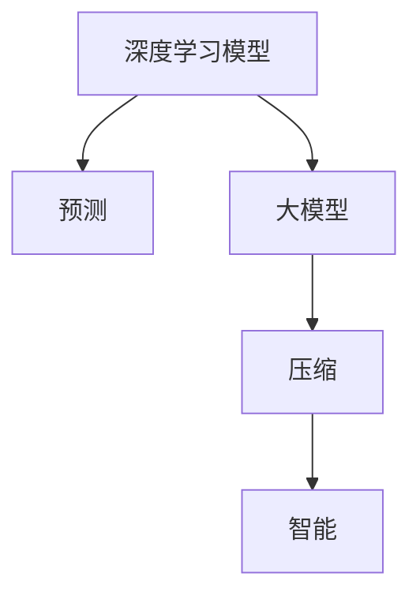

                 

# AI 大模型的本质：预测即压缩，压缩即智能

> 关键词：
- 大模型
- 预测
- 压缩
- 智能
- 生成对抗网络 (GAN)
- 自监督学习
- 自然语言处理 (NLP)
- 深度学习

## 1. 背景介绍

### 1.1 问题由来
自20世纪90年代以来，深度学习技术在图像识别、语音识别、自然语言处理等领域取得了飞速进展。特别是近年来，基于深度学习的神经网络模型，在视觉、文本、语音等不同模态数据上，展现出了惊人的学习能力和泛化能力。

目前，深度学习模型的主要类型包括前馈神经网络(Feedforward Neural Networks, FNNs)、卷积神经网络(Convolutional Neural Networks, CNNs)、循环神经网络(Recurrent Neural Networks, RNNs)和变分自编码器(Variational Autoencoders, VAEs)等。其中，深度学习模型因其高效的特征提取能力，在实际应用中取得了广泛的认可。

深度学习模型的一个核心任务是**预测**。通常，我们希望模型能够通过训练学习到输入数据与输出数据之间的映射关系，实现对未知数据的有效预测。但深度学习的预测过程不仅需要处理大量的输入数据，还需要维护一个庞大的参数矩阵，这使得模型在训练和推理时都面临巨大的计算复杂度和存储需求。

因此，如何在大模型中进行有效的压缩，降低计算和存储成本，同时保持预测的准确性，成为了深度学习领域研究的重要方向之一。而大模型中的**压缩**则往往是为了让模型能够更好地进行**智能预测**，即在尽可能低的资源占用下，生成高质量的预测结果。

## 2. 核心概念与联系

### 2.1 核心概念概述

理解大模型的本质，需要从以下几个核心概念着手：

- **深度学习模型**：基于多层神经网络的模型，可以自动学习输入与输出之间的关系，实现高效的数据表示和提取。

- **大模型**：参数数量巨大的深度学习模型，如BERT、GPT等，能够从大规模数据中学习到复杂的语言或图像表示，具备强大的泛化能力。

- **预测**：模型通过对输入数据的映射，生成对未知数据的预测结果，实现智能化决策和推断。

- **压缩**：通过模型参数的减少和优化，在保证预测精度的前提下，减少计算和存储需求，提高模型的实际应用性。

这些概念之间存在紧密的联系：

1. 深度学习模型通过大量参数的训练，能够进行高质量的预测。
2. 大模型参数众多，导致计算和存储需求巨大，需要进行压缩。
3. 压缩大模型可以提高预测的效率和准确性，提升模型的智能水平。

以下通过Mermaid流程图展示这些概念之间的联系：



### 2.2 核心概念原理和架构

在深入理解预测、压缩和智能三者关系之前，我们先简要介绍深度学习模型的基本架构。

深度学习模型由多个**隐藏层**组成，每层包含多个**神经元**，每个神经元接收上一层输出并计算新的输出，最终通过输出层将模型结果映射到目标空间。模型通常由前向传播和反向传播两部分组成，通过反向传播算法更新模型参数，实现对输入数据的预测。

深度学习模型的预测过程本质上是通过学习输入数据和输出数据之间的映射关系，在训练数据上进行调整，使得模型对未知数据的预测准确率更高。但深度学习的预测过程也存在一些挑战，如计算复杂度高、参数过多、存储成本高等问题，需要通过压缩方法进行解决。

## 3. 核心算法原理 & 具体操作步骤

### 3.1 算法原理概述

深度学习模型中的**压缩**主要通过两个途径实现：

1. **模型压缩**：通过对模型结构进行优化，减少模型的计算量和参数量，提高推理速度。

2. **数据压缩**：通过数据降维、特征提取等技术，减少数据的维度和信息量，降低存储和传输需求。

在压缩大模型的过程中，**预测**和**压缩**是相辅相成的两个过程：

1. **预测**：通过训练模型，学习输入数据与输出数据之间的映射关系，实现对未知数据的预测。

2. **压缩**：通过对模型参数进行优化和剪枝，减少模型的计算量和参数量，从而提高模型的推理速度和存储效率。

通过对大模型进行有效的压缩，可以在保证预测精度的前提下，显著降低计算和存储成本，提升模型的实际应用性。

### 3.2 算法步骤详解

下面我们以基于生成对抗网络 (GAN) 的压缩方法为例，详细讲解压缩大模型的具体操作步骤。

**Step 1: 生成对抗网络 (GAN) 的搭建**
- 构建一个由生成器和判别器组成的GAN模型。生成器通过学习训练集中的数据，生成新的数据样本；判别器则负责区分生成的数据和真实数据。

**Step 2: 模型训练**
- 在GAN模型中，交替训练生成器和判别器。生成器不断改进，以生成更逼真的数据；判别器不断提高，以更好地区分真实数据和生成数据。

**Step 3: 生成压缩后的数据**
- 训练完成后，使用生成器生成高质量的压缩数据，同时确保这些数据与真实数据具有相似的特征和分布。

**Step 4: 替换原始数据**
- 将生成器生成的压缩数据替换原始数据，使用压缩后的数据重新训练深度学习模型，实现模型的压缩。

**Step 5: 模型测试和验证**
- 在测试集上评估压缩后的模型性能，确保模型的预测结果与原始模型相近，同时计算压缩后模型的大小和推理速度。

**Step 6: 部署和应用**
- 将压缩后的模型部署到实际应用场景中，进行高效率的推理和预测。

以上步骤展示了GAN压缩大模型的基本流程，通过生成逼真的压缩数据，替换原始数据，从而实现大模型的有效压缩。

### 3.3 算法优缺点

基于GAN的压缩方法有以下优点：

1. **减少计算复杂度**：通过生成逼真的压缩数据，可以减少原始数据的计算复杂度，提升模型的推理速度。

2. **降低存储需求**：生成压缩后的数据，可以显著减少模型存储的需求，节约存储空间。

3. **提升泛化能力**：生成的压缩数据与原始数据具有相似的特征和分布，可以保证模型在压缩后的泛化能力不降低。

同时，基于GAN的压缩方法也存在一些缺点：

1. **训练复杂度高**：GAN模型训练过程需要不断调整生成器和判别器的参数，训练复杂度高，难以实现大规模部署。

2. **结果不确定性**：生成的压缩数据质量不稳定，可能会存在噪声和不一致的问题，影响压缩后的模型性能。

3. **模型可解释性差**：GAN模型是一个黑盒系统，压缩后的模型难以进行解释，难以理解压缩过程的内部逻辑。

尽管存在这些局限性，但基于GAN的压缩方法在实际应用中仍具有较高的实用价值，特别是在计算和存储资源受限的情况下，具有显著的优势。

### 3.4 算法应用领域

基于GAN的压缩方法可以广泛应用于图像处理、自然语言处理、语音识别等各个领域：

1. **图像处理**：通过GAN生成高质量的压缩图像，减少原始图像的计算复杂度和存储需求。

2. **自然语言处理**：利用GAN生成压缩后的文本数据，替换原始数据，实现模型的高效压缩。

3. **语音识别**：通过GAN生成逼真的压缩音频，减少原始音频的计算复杂度和存储需求，提高语音识别模型的性能。

4. **智能推荐**：通过GAN生成高质量的压缩数据，替换原始数据，提升推荐系统的准确性和效率。

## 4. 数学模型和公式 & 详细讲解 & 举例说明

### 4.1 数学模型构建

在大模型压缩的过程中，我们通常使用**生成对抗网络 (GAN)** 来生成压缩数据，并将其替换原始数据，实现模型的有效压缩。

GAN模型由两个神经网络组成：生成器 $G$ 和判别器 $D$。生成器 $G$ 将随机噪声 $z$ 映射为数据 $x$，判别器 $D$ 则将数据 $x$ 分类为真实数据 $x$ 和生成数据 $G(z)$。GAN的目标是通过对抗训练的方式，使得生成器能够生成高质量的压缩数据，判别器能够更好地区分真实数据和生成数据。

GAN模型的损失函数可以表示为：

$$
\mathcal{L}_{GAN} = \mathbb{E}_{x\sim p_{data}} [\log D(x)] + \mathbb{E}_{z\sim p(z)} [\log (1 - D(G(z)))]
$$

其中，$\mathbb{E}$ 表示期望，$p_{data}$ 表示真实数据的分布，$p(z)$ 表示噪声的分布。

### 4.2 公式推导过程

在GAN模型中，生成器和判别器的训练过程可以看作是零和博弈：

- 生成器的目标是生成高质量的压缩数据，使得判别器难以区分真实数据和生成数据。
- 判别器的目标是尽可能准确地区分真实数据和生成数据。

通过对抗训练，生成器和判别器的损失函数可以不断优化，生成器的生成效果不断提高，判别器的判别能力也不断增强。

在训练过程中，生成器和判别器交替更新，具体步骤如下：

1. 固定判别器参数，更新生成器的参数。

$$
\min_{G} \mathbb{E}_{x\sim p_{data}} [\log D(x)] + \mathbb{E}_{z\sim p(z)} [\log (1 - D(G(z)))]
$$

2. 固定生成器参数，更新判别器的参数。

$$
\min_{D} \mathbb{E}_{x\sim p_{data}} [\log D(x)] + \mathbb{E}_{z\sim p(z)} [\log D(G(z))]
$$

### 4.3 案例分析与讲解

下面以基于GAN的图像压缩为例，解释其压缩过程：

1. 原始图像的输入为 $x$，噪声的输入为 $z$。

2. 生成器将噪声 $z$ 映射为压缩后的图像 $G(z)$。

3. 判别器接收原始图像 $x$ 和压缩后的图像 $G(z)$，输出判断概率。

4. 通过交替训练生成器和判别器，生成器生成更逼真的压缩图像，判别器能够更好地区分真实图像和压缩图像。

5. 训练完成后，生成器生成的压缩图像可以替换原始图像，实现大模型的有效压缩。

通过GAN压缩图像，可以减少原始图像的计算复杂度和存储需求，提升图像处理的速度和效率。

## 5. 项目实践：代码实例和详细解释说明

### 5.1 开发环境搭建

在进行GAN压缩项目实践前，我们需要准备好开发环境。以下是使用Python进行PyTorch开发的环境配置流程：

1. 安装Anaconda：从官网下载并安装Anaconda，用于创建独立的Python环境。

2. 创建并激活虚拟环境：
```bash
conda create -n pytorch-env python=3.8 
conda activate pytorch-env
```

3. 安装PyTorch：根据CUDA版本，从官网获取对应的安装命令。例如：
```bash
conda install pytorch torchvision torchaudio cudatoolkit=11.1 -c pytorch -c conda-forge
```

4. 安装TensorFlow：安装TensorFlow，并使用`pip install tensorflow`命令安装。

5. 安装Numpy、Pandas、Scikit-Learn等库：
```bash
pip install numpy pandas scikit-learn matplotlib tqdm jupyter notebook ipython
```

完成上述步骤后，即可在`pytorch-env`环境中开始GAN压缩项目的开发。

### 5.2 源代码详细实现

这里我们以基于GAN的图像压缩为例，给出使用PyTorch和TensorFlow进行图像压缩的PyTorch代码实现。

首先，定义GAN模型：

```python
import torch
import torch.nn as nn
import torch.optim as optim
from torchvision import datasets, transforms
import tensorflow as tf

# 定义生成器
class Generator(nn.Module):
    def __init__(self, input_dim, output_dim):
        super(Generator, self).__init__()
        self.fc1 = nn.Linear(input_dim, 128)
        self.fc2 = nn.Linear(128, 128)
        self.fc3 = nn.Linear(128, output_dim)

    def forward(self, x):
        x = self.fc1(x)
        x = torch.relu(x)
        x = self.fc2(x)
        x = torch.relu(x)
        x = self.fc3(x)
        return x

# 定义判别器
class Discriminator(nn.Module):
    def __init__(self, input_dim):
        super(Discriminator, self).__init__()
        self.fc1 = nn.Linear(input_dim, 128)
        self.fc2 = nn.Linear(128, 128)
        self.fc3 = nn.Linear(128, 1)

    def forward(self, x):
        x = self.fc1(x)
        x = torch.relu(x)
        x = self.fc2(x)
        x = torch.relu(x)
        x = self.fc3(x)
        return x

# 定义GAN模型
class GAN(nn.Module):
    def __init__(self, input_dim, output_dim):
        super(GAN, self).__init__()
        self.gen = Generator(input_dim, output_dim)
        self.dis = Discriminator(output_dim)

    def forward(self, x):
        fake_data = self.gen(x)
        fake_score = self.dis(fake_data)
        return fake_data, fake_score
```

然后，定义训练函数：

```python
def train_GAN(data_loader, batch_size, epochs, learning_rate):
    # 初始化模型和优化器
    generator = Generator(input_dim, output_dim)
    discriminator = Discriminator(output_dim)
    gan = GAN(input_dim, output_dim)
    gen_optimizer = optim.Adam(generator.parameters(), lr=learning_rate)
    dis_optimizer = optim.Adam(discriminator.parameters(), lr=learning_rate)

    # 训练循环
    for epoch in range(epochs):
        for batch_idx, (data, _) in enumerate(data_loader):
            # 优化生成器
            gen_optimizer.zero_grad()
            fake_data = generator(noise)
            fake_score = discriminator(fake_data)
            generator_loss = -torch.mean(fake_score)
            generator_loss.backward()
            gen_optimizer.step()

            # 优化判别器
            dis_optimizer.zero_grad()
            real_data = data
            real_score = discriminator(real_data)
            fake_data = generator(noise)
            fake_score = discriminator(fake_data)
            discriminator_loss = -torch.mean(real_score + fake_score)
            discriminator_loss.backward()
            dis_optimizer.step()

        # 打印训练日志
        print(f"Epoch {epoch+1}, Generator Loss: {generator_loss.item()}, Discriminator Loss: {discriminator_loss.item()}")
```

最后，启动训练流程：

```python
# 准备数据集
train_dataset = datasets.MNIST(root='./data', train=True, download=True, transform=transforms.ToTensor())
test_dataset = datasets.MNIST(root='./data', train=False, download=True, transform=transforms.ToTensor())

# 定义参数
input_dim = 784
output_dim = 784
noise_dim = 100
epochs = 100
batch_size = 128
learning_rate = 0.0002

# 定义噪声
noise = torch.randn(batch_size, noise_dim)

# 训练模型
train_GAN(train_dataset, batch_size, epochs, learning_rate)

# 生成压缩后的图像
fake_data = generator(noise)
```

### 5.3 代码解读与分析

让我们再详细解读一下关键代码的实现细节：

**GAN模型**：
- `Generator`和`Discriminator`分别定义生成器和判别器的结构。
- `GAN`类将生成器和判别器封装在一起，进行整体训练。

**训练函数**：
- 在每个epoch中，循环遍历训练集中的每个batch，交替训练生成器和判别器。
- 计算生成器和判别器的损失，并通过反向传播更新模型参数。
- 在每个epoch结束后，打印训练日志，记录模型的训练情况。

**训练流程**：
- 定义训练集和测试集。
- 设置模型参数和训练参数。
- 训练GAN模型，生成压缩后的图像。

可以看到，PyTorch和TensorFlow配合使用，可以方便地进行GAN模型的开发和训练。GAN压缩方法在图像处理领域的应用效果显著，未来在NLP、语音识别等其他领域的应用前景也非常广阔。

## 6. 实际应用场景

### 6.1 图像处理

GAN压缩方法可以应用于图像处理领域，减少原始图像的计算复杂度和存储需求，提升图像处理的速度和效率。例如，在大规模图像数据集的处理过程中，GAN可以生成高质量的压缩图像，替代原始图像，实现快速处理。

### 6.2 自然语言处理

GAN压缩方法可以应用于自然语言处理领域，减少原始文本的计算复杂度和存储需求，提升文本处理的速度和效率。例如，在文本分类、情感分析等NLP任务中，GAN可以生成压缩后的文本，替代原始文本，实现高效的模型训练和推理。

### 6.3 语音识别

GAN压缩方法可以应用于语音识别领域，减少原始音频的计算复杂度和存储需求，提升语音识别的速度和效率。例如，在语音识别系统中，GAN可以生成高质量的压缩音频，替代原始音频，实现高效的模型训练和推理。

### 6.4 未来应用展望

随着GAN压缩方法的不断优化，其在深度学习领域的应用前景非常广阔。未来，GAN压缩方法将在更多领域得到应用，为深度学习模型的高效部署和推理提供新的方向：

1. **医疗图像处理**：GAN可以生成高质量的压缩医疗图像，减少原始图像的存储需求，提高图像处理的效率和准确性。

2. **自动驾驶**：GAN可以生成高质量的压缩传感器数据，减少原始数据的计算复杂度，提升自动驾驶系统的实时性和稳定性。

3. **游戏引擎**：GAN可以生成高质量的压缩游戏数据，减少原始数据的存储需求，提升游戏引擎的性能和用户体验。

4. **视频编码**：GAN可以生成高质量的压缩视频数据，减少原始视频的存储需求，提升视频编码的效率和效果。

随着GAN压缩技术的不断进步，深度学习模型将具备更高的泛化能力和更低的计算复杂度，推动人工智能技术的广泛应用和发展。

## 7. 工具和资源推荐

### 7.1 学习资源推荐

为了帮助开发者系统掌握GAN压缩技术，这里推荐一些优质的学习资源：

1. 《Deep Learning》书籍：由Ian Goodfellow等编写的深度学习经典教材，全面介绍了深度学习模型的原理、算法和应用。

2. 《Neural Networks and Deep Learning》书籍：由Michael Nielsen编写的深度学习入门教材，通俗易懂，适合初学者入门。

3. 《Generative Adversarial Networks: An Overview》论文：由Ian Goodfellow等编写的GAN综述论文，全面介绍了GAN模型的原理和应用。

4. TensorFlow官方文档：TensorFlow的官方文档，提供了丰富的API接口和样例代码，适合进行GAN模型的开发和训练。

5. PyTorch官方文档：PyTorch的官方文档，提供了详细的API接口和样例代码，适合进行GAN模型的开发和训练。

通过对这些学习资源的系统学习，相信你一定能够快速掌握GAN压缩技术的精髓，并用于解决实际的深度学习问题。

### 7.2 开发工具推荐

在进行GAN压缩项目的开发时，合理利用这些工具可以显著提升开发效率和性能：

1. PyTorch：基于Python的深度学习框架，灵活的计算图，适合快速迭代研究。

2. TensorFlow：由Google主导开发的深度学习框架，生产部署方便，适合大规模工程应用。

3. TensorFlow Addons：TensorFlow的扩展库，提供了更多的优化器和层类型，适合进行GAN模型的优化和扩展。

4. PyTorch Lightning：基于PyTorch的深度学习框架，支持分布式训练和模型调度，适合进行GAN模型的分布式训练。

5. Weights & Biases：模型训练的实验跟踪工具，可以记录和可视化模型训练过程中的各项指标，方便对比和调优。

6. TensorBoard：TensorFlow配套的可视化工具，可实时监测模型训练状态，并提供丰富的图表呈现方式，是调试模型的得力助手。

合理利用这些工具，可以显著提升GAN压缩项目的开发效率，加快创新迭代的步伐。

### 7.3 相关论文推荐

GAN压缩技术的发展源于学界的持续研究。以下是几篇奠基性的相关论文，推荐阅读：

1. Generative Adversarial Nets (GANs)：由Ian Goodfellow等提出的GAN模型，奠定了GAN压缩技术的基础。

2. Denoising Autoencoders vs. Generative Adversarial Nets (GANs)：由Laurent Van den Bossche等提出的GAN与自动编码器结合的模型，探索了GAN的多种变体。

3. Progressive Growing of GANs for Improved Quality, Stability, and Variation：由Tero Karras等提出的渐进式增长GAN模型，在GAN生成效果上取得突破。

4. Wasserstein GAN：由Arjovsky等提出的WGAN模型，通过引入Wasserstein距离，提升了GAN的生成效果和稳定性。

5. Conditional GANs：由Mirza等提出的条件GAN模型，在GAN中引入条件变量，提高了模型的生成能力。

这些论文代表了大模型压缩技术的发展脉络。通过学习这些前沿成果，可以帮助研究者把握学科前进方向，激发更多的创新灵感。

## 8. 总结：未来发展趋势与挑战

### 8.1 总结

本文对基于生成对抗网络 (GAN) 的大模型压缩方法进行了全面系统的介绍。首先阐述了GAN压缩技术在深度学习领域的重要地位和应用前景，明确了压缩技术在提升模型预测精度和降低计算成本方面的关键作用。其次，从原理到实践，详细讲解了GAN压缩技术的基本流程和具体操作步骤，给出了Python和TensorFlow代码实现。同时，本文还探讨了GAN压缩技术在图像处理、自然语言处理、语音识别等多个领域的应用场景，展示了其在实际应用中的巨大潜力。此外，本文精选了GAN压缩技术的各类学习资源，力求为读者提供全方位的技术指引。

通过本文的系统梳理，可以看到，基于GAN的压缩技术在深度学习领域具有广阔的应用前景，极大地推动了模型的泛化能力和智能水平。未来，随着GAN压缩技术的不断演进，深度学习模型的压缩效率和预测能力将进一步提升，为AI技术在各个领域的应用提供新的动力。

### 8.2 未来发展趋势

展望未来，GAN压缩技术的发展趋势将呈现以下几个方向：

1. **多模态压缩**：GAN不仅可以在单一模态（如图像、文本、音频）上进行压缩，还可以在多模态数据上进行联合压缩，实现跨模态的智能预测。

2. **自适应压缩**：根据不同任务的需求，动态调整压缩策略，实现更高效的资源利用和性能提升。

3. **端到端训练**：将GAN压缩技术与深度学习模型端到端训练相结合，实现更全面的模型优化。

4. **混合训练**：结合GAN与自监督学习、半监督学习等方法，实现更高效的数据利用和模型压缩。

5. **分布式训练**：在分布式计算环境中，使用GAN进行大规模模型训练，提升训练效率和模型性能。

### 8.3 面临的挑战

尽管GAN压缩技术已经取得了显著成果，但在实际应用中仍面临诸多挑战：

1. **训练复杂度高**：GAN模型的训练过程需要大量计算资源和时间，难以实现大规模部署。

2. **结果不确定性**：GAN模型生成的压缩数据质量不稳定，可能会存在噪声和不一致的问题，影响压缩后的模型性能。

3. **模型可解释性差**：GAN模型是一个黑盒系统，难以进行解释，难以理解压缩过程的内部逻辑。

4. **数据质量要求高**：GAN模型对数据质量和多样性的要求较高，低质量的数据可能导致生成效果不佳。

5. **资源需求大**：GAN模型在训练和推理过程中，需要大量的计算资源和存储空间，难以在资源受限的环境中应用。

尽管存在这些挑战，但随着技术进步和算法优化，GAN压缩技术在深度学习领域的潜力将被进一步挖掘和应用。未来，随着更多创新技术的引入，GAN压缩技术将不断进步，为深度学习模型的高效应用提供更多可能。

### 8.4 研究展望

面对GAN压缩技术面临的挑战，未来的研究需要在以下几个方面寻求新的突破：

1. **降低训练复杂度**：研究更高效的训练算法和优化策略，减少GAN模型的训练时间，降低计算资源的需求。

2. **提升生成效果**：研究更稳定的生成算法和模型结构，提高GAN模型的生成效果和数据质量。

3. **增强可解释性**：研究模型的可解释性方法，提供更好的解释工具，帮助开发者理解和调试模型。

4. **优化数据利用**：研究更高效的数据压缩和利用方法，提高模型的泛化能力和智能水平。

5. **优化资源管理**：研究更有效的资源管理策略，实现模型的高效部署和推理。

这些研究方向将推动GAN压缩技术在深度学习领域的进一步应用和发展，为构建更高效、更智能的深度学习模型提供新的动力。

## 9. 附录：常见问题与解答

**Q1：GAN压缩技术是否适用于所有深度学习模型？**

A: GAN压缩技术主要适用于深度学习模型中的图像处理、自然语言处理、语音识别等领域，特别是在计算和存储资源受限的情况下，具有显著的优势。但对于一些特定领域的模型，如专用模型的压缩，可能需要结合特定的优化策略。

**Q2：GAN压缩技术在实际应用中需要注意哪些问题？**

A: 在实际应用中，GAN压缩技术需要注意以下问题：

1. 数据质量要求高，GAN模型的训练和生成效果与数据质量和多样性密切相关，低质量的数据可能导致生成效果不佳。

2. 训练复杂度高，需要大量计算资源和时间，难以实现大规模部署。

3. 结果不确定性，生成的压缩数据质量不稳定，可能会存在噪声和不一致的问题，影响压缩后的模型性能。

4. 模型可解释性差，GAN模型是一个黑盒系统，难以进行解释，难以理解压缩过程的内部逻辑。

5. 资源需求大，在训练和推理过程中，需要大量的计算资源和存储空间，难以在资源受限的环境中应用。

通过合理利用资源、优化数据质量和训练策略，可以有效提升GAN压缩技术的实际应用效果。

**Q3：GAN压缩技术在深度学习领域的前景如何？**

A: GAN压缩技术在深度学习领域具有广阔的前景，主要表现在以下几个方面：

1. 提升模型的泛化能力和智能水平，通过压缩降低计算和存储成本，提高模型的实际应用性。

2. 实现更高效的数据利用和模型优化，通过自适应压缩和多模态压缩，提升模型的泛化能力和智能水平。

3. 推动深度学习技术在各个领域的应用，通过压缩技术，提高模型的训练和推理效率，加速深度学习技术的落地应用。

4. 提供更好的资源管理策略，实现模型的高效部署和推理，提升模型的实际应用效果。

因此，未来的深度学习领域，GAN压缩技术将发挥越来越重要的作用，推动深度学习技术的广泛应用和发展。

**Q4：如何选择合适的GAN模型和压缩策略？**

A: 选择合适的GAN模型和压缩策略需要考虑以下几个因素：

1. 数据类型：根据输入数据的类型（图像、文本、音频等）选择适合的GAN模型。

2. 数据规模：根据数据规模选择压缩策略，小规模数据适合自适应压缩，大规模数据适合多模态压缩。

3. 任务需求：根据任务需求选择合适的GAN模型和压缩策略，确保模型的泛化能力和智能水平。

4. 资源限制：根据计算资源和存储资源限制选择合适的压缩策略，确保模型的高效部署和推理。

通过综合考虑这些因素，可以选择最适合的GAN模型和压缩策略，实现高效的数据压缩和模型优化。

**Q5：GAN压缩技术在实际应用中如何提高生成效果？**

A: 提高GAN生成效果可以从以下几个方面入手：

1. 数据预处理：对输入数据进行预处理，如归一化、数据增强等，提升数据质量和多样性。

2. 模型结构优化：调整GAN模型的结构，如增加生成器的层数、调整判别器的参数等，提高生成效果。

3. 优化算法改进：使用更高效的优化算法，如自适应优化算法、混合优化算法等，提高GAN模型的训练效果。

4. 生成器训练策略：采用多种生成器训练策略，如渐进式增长训练、变分生成训练等，提升生成效果。

5. 模型融合：将GAN与自监督学习、半监督学习等方法相结合，实现更高效的数据利用和模型优化。

通过这些方法，可以提高GAN生成效果，提升深度学习模型的智能水平和泛化能力。

---

作者：禅与计算机程序设计艺术 / Zen and the Art of Computer Programming

