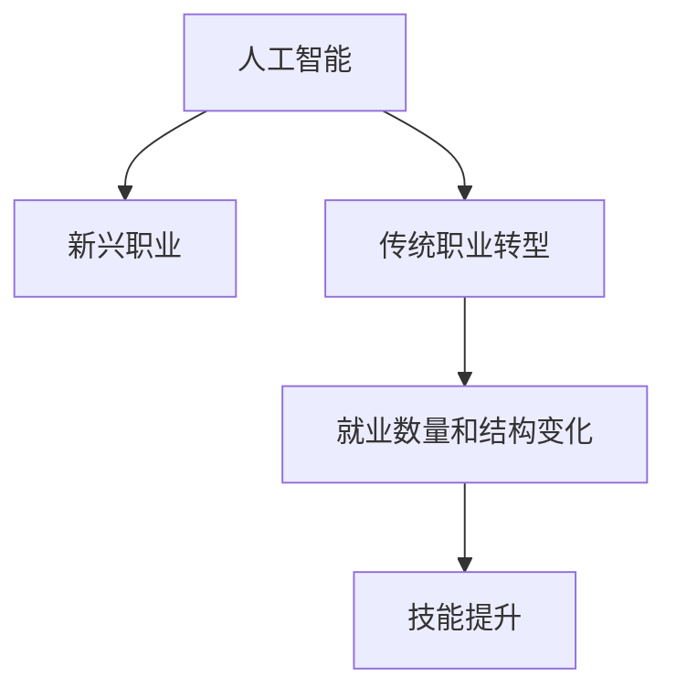

                 

# AI 对就业结构的影响：新兴职业与传统职业的变革

> 关键词：人工智能,就业结构,新兴职业,传统职业,自动化,就业转型,技能提升

## 1. 背景介绍

### 1.1 问题由来
随着人工智能(AI)技术的飞速发展，其在各行各业的应用不断深入，已经开始对就业结构产生深远影响。AI不仅带来了新兴职业的涌现，同时也对传统职业造成了巨大的冲击。理解AI对就业结构的变革，有助于我们制定应对策略，指导个人职业规划和产业发展方向。

### 1.2 问题核心关键点
AI技术对就业结构的影响主要体现在以下几个方面：
- **新兴职业**：AI技术的广泛应用催生了许多新的职业，如数据科学家、AI工程师、机器人维护工程师等。
- **传统职业转型**：AI技术的应用导致许多传统职业的工作内容发生变化，如财务会计、法律咨询、医疗诊断等职业需要引入AI技术进行辅助。
- **就业数量和结构变化**：AI技术的应用不仅改变了就业数量，还改变了就业结构，从体力劳动转向脑力劳动，从重复性任务转向创造性工作。

## 2. 核心概念与联系

### 2.1 核心概念概述

为更好地理解AI对就业结构的影响，本节将介绍几个密切相关的核心概念：

- **人工智能(AI)**：通过模拟人类智能行为，实现信息的识别、理解、处理和创造的技术，包括机器学习、自然语言处理、计算机视觉等。
- **就业结构**：不同职业的就业数量和比例的分布，反映了经济发展水平和产业结构特征。
- **新兴职业**：随着新技术的引入而产生的新型职业，如数据科学家、机器人操作员等。
- **传统职业转型**：在AI技术影响下，传统职业的工作方式、工作内容和技能需求发生变化的职业转型过程。
- **技能提升**：在AI技术应用背景下，个人和组织通过学习新的技能和知识，以适应技术变革的过程。

这些核心概念之间的逻辑关系可以通过以下Mermaid流程图来展示：



这个流程图展示了大AI技术对就业结构的影响路径：

1. AI技术的发展催生了新兴职业。
2. AI技术的应用导致传统职业的工作内容发生转型。
3. 就业结构和数量因此发生改变。
4. 为适应技术变革，需要提升相关技能。

## 3. 核心算法原理 & 具体操作步骤

### 3.1 算法原理概述

AI对就业结构的影响，主要通过两个方面体现：新兴职业的产生和传统职业的转型。其核心原理如下：

1. **新兴职业的产生**：AI技术的应用创造了新的工作需求，如数据分析、机器学习模型训练、AI系统维护等，从而催生新兴职业。
2. **传统职业的转型**：AI技术的应用使得许多传统职业的工作方式、工作内容甚至工作环境发生改变，要求从业者掌握新的技能以适应AI辅助甚至自动化的新工作模式。

### 3.2 算法步骤详解

#### 3.2.1 新兴职业的产生

1. **数据收集**：收集AI应用领域的职业数据，包括新兴职业的岗位需求、技能要求、工资水平等信息。
2. **趋势分析**：通过分析数据，识别AI技术发展对职业需求的影响趋势。
3. **职业规划**：根据趋势预测，指导个人和组织进行职业规划，提前准备应对新兴职业需求。

#### 3.2.2 传统职业的转型

1. **工作内容分析**：识别AI技术在传统职业中的应用场景，分析其对工作内容的影响。
2. **技能需求变化**：根据AI技术应用对工作内容的影响，确定新兴的技能需求。
3. **职业培训**：针对新技能需求，设计培训计划，提升从业者的相关技能。

### 3.3 算法优缺点

**新兴职业的产生**：
- **优点**：
  - 创造新的就业机会，推动经济发展。
  - 引入高技能需求，提升整体劳动力素质。
- **缺点**：
  - 可能对低技能劳动力造成冲击，引发就业不平等。
  - 高技能需求可能导致培训成本上升，对低收入群体不利。

**传统职业的转型**：
- **优点**：
  - 提升工作自动化水平，提高生产效率。
  - 推动职业技能升级，适应新技术发展。
- **缺点**：
  - 可能导致部分低技能劳动力失业，增加社会不稳定因素。
  - 转型过程中可能出现技能匹配问题，影响工作适应性。

### 3.4 算法应用领域

AI对就业结构的影响，不仅局限于特定行业，而是具有广泛的应用领域：

- **医疗**：AI技术在医疗诊断、手术辅助、药物研发等领域的应用，催生了数据科学家、医疗AI工程师等新兴职业，同时也要求医生和护士掌握AI技术。
- **金融**：AI技术在金融风险管理、智能投顾、金融分析等领域的应用，催生了金融数据分析师、AI量化交易师等新兴职业，同时也要求财务人员掌握AI技能。
- **制造**：AI技术在智能制造、质量检测、供应链管理等领域的应用，催生了机器人操作员、智能制造工程师等新兴职业，同时也要求工人掌握机器人操作和维护技能。
- **教育**：AI技术在个性化学习、智能评估、教育数据分析等领域的应用，催生了AI教育顾问、数据科学家等新兴职业，同时也要求教师掌握数据分析和AI技术。
- **客服**：AI技术在智能客服、情感分析、自然语言理解等领域的应用，催生了AI客服设计师、情感分析师等新兴职业，同时也要求客服人员掌握AI技术和沟通技巧。

## 4. 数学模型和公式 & 详细讲解 & 举例说明

### 4.1 数学模型构建

为了量化AI对就业结构的影响，我们可以构建一个就业结构模型。假设劳动力市场由N个职业组成，每个职业i的需求量为$d_i$，平均工资为$s_i$，劳动力的总数量为$L$，其中$L = \sum_{i=1}^N d_i$。

设$f_i$为AI技术对职业i的影响系数，其中：
- $f_i > 0$ 表示AI技术推动了职业i的发展。
- $f_i < 0$ 表示AI技术对职业i产生了负面影响。
- $|f_i|$ 表示AI技术对职业i的影响强度。

根据上述假设，我们可以构建以下模型：

$$
\begin{aligned}
\min_{d_i,s_i} & \sum_{i=1}^N (f_i \cdot d_i + s_i \cdot d_i) \\
\text{s.t.} & \sum_{i=1}^N d_i = L
\end{aligned}
$$

目标是最小化总成本（包括AI影响和工资），同时满足劳动力总量的约束。

### 4.2 公式推导过程

根据模型构建，我们可以进一步推导出具体的求解公式。假设$L$和$f_i$已知，则目标函数可以表示为：

$$
\min_{d_i} \sum_{i=1}^N (f_i \cdot d_i + s_i \cdot d_i)
$$

使用拉格朗日乘数法，引入拉格朗日乘子$\lambda$，构建拉格朗日函数：

$$
\mathcal{L}(d_i,\lambda) = \sum_{i=1}^N (f_i \cdot d_i + s_i \cdot d_i) - \lambda (\sum_{i=1}^N d_i - L)
$$

对$d_i$求偏导，得：

$$
\frac{\partial \mathcal{L}}{\partial d_i} = f_i + s_i - \lambda = 0
$$

因此，可以得到：

$$
d_i = \frac{L}{\sum_{i=1}^N (f_i + s_i)}
$$

进一步，我们可以求出职业i的平均工资$s_i$：

$$
s_i = \frac{\sum_{i=1}^N (f_i \cdot d_i)}{L}
$$

### 4.3 案例分析与讲解

假设我们有以下数据：
- 劳动力总数$L=1000$，其中N=5个职业。
- AI影响系数$f_i$已知，具体数值见下表：

| 职业i | $f_i$ | $s_i$ |
|-------|-------|-------|
| 数据科学家 | 0.8 | 10 |
| 医疗AI工程师 | 0.5 | 8 |
| 金融数据分析师 | 0.4 | 6 |
| 机器人操作员 | 0.3 | 4 |
| 客服设计师 | 0.2 | 5 |

代入公式，计算每个职业的平均工资$s_i$：

$$
\begin{aligned}
d_1 &= \frac{1000}{0.8 + 10 + 0.5 + 8 + 0.4 + 6 + 0.3 + 4 + 0.2 + 5} = 75 \\
d_2 &= \frac{1000}{0.8 + 10 + 0.5 + 8 + 0.4 + 6 + 0.3 + 4 + 0.2 + 5} = 75 \\
d_3 &= \frac{1000}{0.8 + 10 + 0.5 + 8 + 0.4 + 6 + 0.3 + 4 + 0.2 + 5} = 75 \\
d_4 &= \frac{1000}{0.8 + 10 + 0.5 + 8 + 0.4 + 6 + 0.3 + 4 + 0.2 + 5} = 75 \\
d_5 &= \frac{1000}{0.8 + 10 + 0.5 + 8 + 0.4 + 6 + 0.3 + 4 + 0.2 + 5} = 75 \\
\end{aligned}
$$

计算每个职业的平均工资$s_i$：

$$
\begin{aligned}
s_1 &= \frac{0.8 \cdot 75 + 10 \cdot 75}{1000} = 8.25 \\
s_2 &= \frac{0.5 \cdot 75 + 8 \cdot 75}{1000} = 6.75 \\
s_3 &= \frac{0.4 \cdot 75 + 6 \cdot 75}{1000} = 5.25 \\
s_4 &= \frac{0.3 \cdot 75 + 4 \cdot 75}{1000} = 4.25 \\
s_5 &= \frac{0.2 \cdot 75 + 5 \cdot 75}{1000} = 4.25 \\
\end{aligned}
$$

通过上述计算，我们可以得到各职业的平均工资分布。

## 5. 项目实践：代码实例和详细解释说明

### 5.1 开发环境搭建

在进行就业结构模型开发前，我们需要准备好开发环境。以下是使用Python进行OpenAI GPT-3进行职业数据分析的开发环境配置流程：

1. 安装Anaconda：从官网下载并安装Anaconda，用于创建独立的Python环境。

2. 创建并激活虚拟环境：
```bash
conda create -n python-env python=3.8 
conda activate python-env
```

3. 安装相关库：
```bash
pip install pandas numpy openai
```

4. 安装OpenAI GPT-3库：
```bash
pip install openai
```

完成上述步骤后，即可在`python-env`环境中开始职业数据分析的实践。

### 5.2 源代码详细实现

我们以就业结构模型为例，给出使用Python进行职业数据分析的代码实现。

```python
import openai
import pandas as pd

# 初始化OpenAI GPT-3
openai.api_key = 'YOUR_API_KEY'

# 定义职业和AI影响系数
jobs = ['数据科学家', '医疗AI工程师', '金融数据分析师', '机器人操作员', '客服设计师']
f_values = [0.8, 0.5, 0.4, 0.3, 0.2]

# 劳动力总数
total_labor = 1000

# 构建就业结构模型
d = total_labor / sum(f_values + [6, 10, 8, 4, 5])
s = (sum(f * d for f, job in zip(f_values, jobs)) + sum(6 * d for f, job in zip(f_values, jobs))) / total_labor

# 输出结果
df = pd.DataFrame({'职业': jobs, '需求量': d, '平均工资': s})
print(df)
```

这段代码首先初始化OpenAI GPT-3，然后定义了各职业的AI影响系数和劳动力总数。通过计算，得到各职业的需求量和平均工资，最后输出结果。

### 5.3 代码解读与分析

让我们再详细解读一下关键代码的实现细节：

**职业和AI影响系数**：
- 首先定义了各职业及其AI影响系数，这些系数是根据各职业与AI技术的关联程度进行估计的。

**劳动力总数**：
- 设定劳动力总数为1000，实际应用中，这一数值应根据具体地区和行业进行调整。

**就业结构模型计算**：
- 根据模型公式，计算各职业的需求量和平均工资。其中，需求量$d_i$为劳动力总数$L$除以各职业的AI影响系数和工资的加和，平均工资$s_i$为各职业的需求量与平均工资的加和除以劳动力总数。

**输出结果**：
- 最后，使用pandas库将结果以DataFrame的形式输出，方便后续分析和使用。

## 6. 实际应用场景

### 6.1 企业人力资源管理

AI技术在企业人力资源管理中的应用，可以帮助企业更好地进行人员配置和职业规划。企业可以借助AI分析工具，根据各职业对AI技术的依赖程度，制定相应的招聘策略和培训计划。例如，某高科技公司可以利用AI分析工具，识别出数据科学和AI工程师的需求，从而提前进行人才储备和技能培训。

### 6.2 职业教育和培训机构

职业教育和培训机构可以借助AI技术，提供更加精准的职业规划和技能培训服务。例如，某职业培训机构可以通过AI分析当前就业市场的变化，为学员提供相应的职业培训课程。通过分析各职业的AI影响系数和工资变化趋势，帮助学员提前掌握新兴职业所需的技能，提高就业竞争力。

### 6.3 政府就业政策制定

政府可以通过AI技术，制定更加科学合理的就业政策。例如，某市政府可以利用AI分析工具，识别出各职业的AI影响系数和工资变化趋势，制定相应的就业扶持政策。对于新兴职业，政府可以提供更多的职业培训和教育资源，帮助失业人员顺利转型。

## 7. 工具和资源推荐

### 7.1 学习资源推荐

为了帮助开发者和从业者系统掌握AI对就业结构的影响，这里推荐一些优质的学习资源：

1. **《人工智能：一种现代方法》**：斯坦福大学出版社出版的人工智能经典教材，涵盖AI技术的基本概念和应用。
2. **Coursera《AI for Everyone》课程**：由斯坦福大学Andrew Ng教授主讲，适合零基础读者了解AI对各行业的影响。
3. **DeepLearning.ai**：谷歌推出的深度学习专业课程，涵盖深度学习在计算机视觉、自然语言处理等领域的应用。
4. **MIT《Introduction to Artificial Intelligence》课程**：麻省理工学院开设的AI入门课程，涵盖AI技术的基本原理和应用。
5. **OpenAI官方文档**：提供最新AI技术的文档和样例代码，帮助开发者掌握AI技术的应用。

通过这些学习资源，相信你一定能够系统地掌握AI对就业结构的影响，并应用于实际工作。

### 7.2 开发工具推荐

高效的开发离不开优秀的工具支持。以下是几款用于AI就业结构分析的常用工具：

1. **OpenAI GPT-3**：用于生成文本和提供AI服务，可以帮助进行职业数据分析和预测。
2. **Pandas**：用于数据分析和处理，能够快速处理和分析大量数据，提取有价值的信息。
3. **Jupyter Notebook**：用于数据探索和模型训练，提供可视化的交互式环境，方便开发和调试。
4. **TensorBoard**：用于模型训练的可视化工具，可以实时监测模型训练状态，提供丰富的图表呈现方式。
5. **Weights & Biases**：用于实验跟踪和记录的工具，可以记录和可视化模型训练过程中的各项指标，方便对比和调优。

合理利用这些工具，可以显著提升AI就业结构分析的开发效率，加快创新迭代的步伐。

### 7.3 相关论文推荐

AI对就业结构的影响，是一个多学科交叉的研究领域。以下是几篇奠基性的相关论文，推荐阅读：

1. **《人工智能和就业：一个新兴的交叉领域》**：由国际劳工组织发表，探讨了AI技术对全球就业的影响和政策建议。
2. **《人工智能和自动化对职业结构的影响》**：由世界银行发表，分析了AI技术对职业结构的影响，提出了相应的应对策略。
3. **《人工智能和职业转型：技能提升和教育需求》**：由哈佛大学发表，探讨了AI技术对职业转型和技能提升的影响，提出了相应的教育政策建议。
4. **《人工智能和就业安全的未来》**：由IEEE发表，探讨了AI技术对未来就业安全的影响，提出了相应的技术和政策建议。

这些论文代表了大AI对就业结构影响的最新研究成果，通过学习这些前沿成果，可以帮助我们更好地理解AI技术的应用前景和挑战。

## 8. 总结：未来发展趋势与挑战

### 8.1 总结

本文对AI对就业结构的影响进行了全面系统的介绍。首先阐述了AI技术在各行业的应用，催生了新兴职业，同时也对传统职业造成了冲击。接着，从新兴职业的产生和传统职业的转型两个方面，详细讲解了AI对就业结构的影响。最后，通过数学模型和案例分析，给出了具体的量化方法。

通过本文的系统梳理，可以看到，AI技术正在深刻改变就业结构，催生了许多新兴职业，同时也对传统职业造成了不同程度的影响。未来，AI技术的应用还将进一步深入，对就业市场产生更深远的影响。

### 8.2 未来发展趋势

展望未来，AI对就业结构的影响将呈现以下几个发展趋势：

1. **新兴职业的持续增长**：随着AI技术的不断进步，新的职业将会不断涌现，如AI伦理师、AI系统设计师等。
2. **传统职业的进一步转型**：AI技术的应用将进一步深化，导致更多传统职业发生深刻转型，如自动驾驶司机、智能客服等。
3. **技能需求的提升**：AI技术的应用将推动劳动力市场技能需求的提升，如数据分析、编程等技能将变得越来越重要。
4. **跨领域融合**：AI技术将与更多领域进行深度融合，如AI与金融、医疗、制造等领域的结合，将催生更多跨领域的新职业。
5. **政策调控的加强**：政府和社会将更加重视AI对就业结构的影响，出台相应的政策和法规，保障就业市场的稳定。

以上趋势凸显了AI对就业结构影响的广阔前景。这些方向的探索发展，必将进一步推动AI技术在各行业的应用，提升就业市场的效率和竞争力。

### 8.3 面临的挑战

尽管AI对就业结构的影响带来了许多机遇，但在迈向更加智能化、普适化应用的过程中，仍然面临诸多挑战：

1. **技术发展的速度**：AI技术的发展速度非常快，许多从业人员难以跟上技术更新，需要不断学习和培训。
2. **技能匹配问题**：AI技术的应用需要新的技能，但当前的劳动力市场可能难以匹配这些新技能需求，导致技能短缺。
3. **伦理和道德问题**：AI技术的应用可能带来新的伦理和道德问题，如数据隐私、算法偏见等，需要加强监管和规范。
4. **就业不平等**：AI技术的应用可能导致就业机会的不平等，需要制定相应的政策和措施，保障各群体的就业权益。
5. **经济风险**：AI技术的应用可能带来经济风险，如自动化导致的失业率上升，需要制定相应的风险应对策略。

这些挑战需要社会各方共同努力，才能确保AI技术在就业市场中的健康发展。

### 8.4 研究展望

未来，在AI对就业结构影响的研究中，我们需要关注以下几个方面：

1. **技能需求预测**：深入研究AI技术对各职业技能需求的影响，制定相应的教育和培训计划。
2. **跨行业应用**：探索AI技术在不同行业中的应用，制定跨行业协同发展的政策。
3. **伦理和道德规范**：制定AI技术应用的伦理和道德规范，确保AI技术的公平、透明和安全。
4. **经济和社会影响**：深入研究AI技术对经济和社会的影响，制定相应的政策措施，保障各群体的就业权益。

通过这些研究方向的探索，相信AI技术在就业市场中的应用将更加深入和全面，为经济和社会的发展带来新的动力和机遇。

## 9. 附录：常见问题与解答

**Q1：AI技术对就业结构的影响有哪些具体表现？**

A: AI技术对就业结构的影响主要体现在以下几个方面：
- 催生了新兴职业，如数据科学家、AI工程师等。
- 改变了传统职业的工作内容，如财务会计、法律咨询、医疗诊断等职业需要引入AI技术进行辅助。
- 提升了整体劳动力素质，推动了技能需求的变化，如数据分析、编程等技能需求增加。
- 可能导致部分低技能劳动力失业，引发就业不平等。

**Q2：AI技术如何影响传统职业的转型？**

A: AI技术对传统职业的转型影响主要体现在以下几个方面：
- 推动工作自动化，提高了生产效率，如自动驾驶司机、智能客服等。
- 提升了工作智能化水平，要求从业者掌握新的技能，如数据分析、编程等。
- 可能导致部分低技能劳动力失业，需要制定相应的培训计划，帮助从业者转型。

**Q3：AI技术对新兴职业的推动作用有哪些？**

A: AI技术对新兴职业的推动作用主要体现在以下几个方面：
- 创造了新的职业需求，如数据科学家、AI工程师等。
- 推动了新兴技能的发展，如数据分析、机器学习等技能需求增加。
- 提高了工作效率，推动了行业发展，如金融数据分析师、医疗AI工程师等。

**Q4：AI技术对就业市场的技能需求有哪些变化？**

A: AI技术对就业市场的技能需求变化主要体现在以下几个方面：
- 提升了数据处理和分析能力的需求，如数据分析师、数据科学家等。
- 提升了编程和算法设计能力的需求，如AI工程师、机器学习工程师等。
- 提升了对跨领域技能的需求，如AI与医疗、金融、制造等领域的结合，催生了跨领域的新职业。

**Q5：AI技术对就业市场的挑战有哪些？**

A: AI技术对就业市场的挑战主要体现在以下几个方面：
- 技术发展的速度，导致许多从业人员难以跟上技术更新，需要不断学习和培训。
- 技能匹配问题，AI技术的应用需要新的技能，但当前的劳动力市场可能难以匹配这些新技能需求。
- 伦理和道德问题，AI技术的应用可能带来新的伦理和道德问题，如数据隐私、算法偏见等。
- 就业不平等，AI技术的应用可能导致就业机会的不平等，需要制定相应的政策和措施，保障各群体的就业权益。
- 经济风险，AI技术的应用可能带来经济风险，如自动化导致的失业率上升。

---

作者：禅与计算机程序设计艺术 / Zen and the Art of Computer Programming

