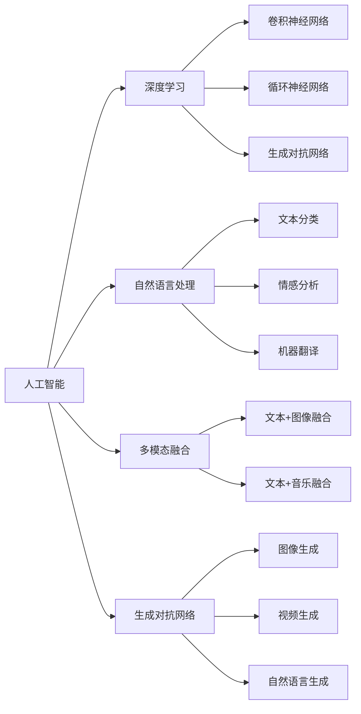

                 

# AI 辅助创作：激发人类创造力

## 1. 背景介绍

### 1.1 问题由来
随着人工智能(AI)技术的快速发展，AI在各个领域的应用已经屡见不鲜。在艺术和文学创作领域，AI也逐渐展露出了强大的潜力。AI可以帮助创作者快速生成文本、图像、音乐等，甚至辅助人类进行创作决策，激发创意思维。这种结合AI的辅助创作，不仅提高了创作效率，还打开了新的创意空间，让艺术和文学创作变得更加多元和创新。

AI辅助创作的核心在于利用机器学习和自然语言处理等技术，结合大数据分析和深度学习模型，实现对人类创造力的辅助。这种技术不仅能够自动生成文本、图像等内容，还能通过对大量艺术作品的学习和分析，掌握创作规律，指导创作方向。

### 1.2 问题核心关键点
AI辅助创作的关键在于以下几方面：

- 数据驱动：AI需要大量高质量的数据进行训练，以掌握不同创作风格和规律。
- 深度学习模型：利用卷积神经网络(CNN)、循环神经网络(RNN)、生成对抗网络(GAN)等深度学习模型，对创作内容进行生成和优化。
- 多模态融合：将文本、图像、音乐等多模态数据融合，实现更丰富、更准确的创作效果。
- 人机交互：提供友好的交互界面，便于创作者输入指令和反馈，不断优化创作过程。
- 创造性评价：建立评价指标，对创作结果进行量化评估，指导创作方向。

这些核心要素构成了AI辅助创作的理论基础和技术框架，使得AI能够有效辅助人类进行创作活动，提升创作质量和效率。

### 1.3 问题研究意义
AI辅助创作的研究和应用，对艺术、文学、设计等创意产业具有重要意义：

1. **提升创作效率**：AI能够自动生成大量作品，减少人工创作的时间和精力，提高创作效率。
2. **拓展创作空间**：AI通过多模态融合，提供更丰富的创作素材，打开新的创意空间。
3. **优化创作质量**：AI通过学习和分析优秀作品，掌握创作规律，指导创作方向，提升创作质量。
4. **促进跨界融合**：AI可以跨越艺术、音乐、设计等多个领域，促进不同创意形式之间的融合和创新。
5. **促进创新发展**：AI辅助创作可以激发创作者的创新思维，推动艺术和文学创作的新趋势。

## 2. 核心概念与联系

### 2.1 核心概念概述

为了更好地理解AI辅助创作的理论基础和实现方法，本节将介绍几个关键概念：

- **人工智能(AI)**：通过模拟人类智能行为，实现对复杂问题的处理和解决。AI在自然语言处理、图像识别、语音识别等领域均有广泛应用。
- **深度学习(DL)**：利用多层神经网络对数据进行复杂处理和分析，以发现数据中的深层结构和规律。深度学习模型包括卷积神经网络(CNN)、循环神经网络(RNN)、生成对抗网络(GAN)等。
- **自然语言处理(NLP)**：利用计算机技术和语言学知识，处理、理解和生成人类语言。NLP技术包括文本分类、情感分析、机器翻译等。
- **多模态融合**：将不同模态（如文本、图像、音乐等）的数据融合，实现更丰富、更准确的创作效果。
- **生成对抗网络(GAN)**：一种生成模型，通过两个神经网络的对抗训练，实现对生成样本的优化。GAN在图像生成、视频生成等领域具有广泛应用。

这些核心概念之间的逻辑关系可以通过以下Mermaid流程图来展示：



这个流程图展示了大语言模型和微调技术的基本构成要素，包括深度学习模型、自然语言处理技术、多模态融合等，以及它们在大语言模型微调中的应用。

## 3. 核心算法原理 & 具体操作步骤
### 3.1 算法原理概述

AI辅助创作的核心算法原理主要基于深度学习模型，特别是Transformer架构和语言模型。具体来说，利用大规模预训练语言模型（如GPT-3、BERT等），在大规模文本数据上进行预训练，学习到语言的通用表示。然后，在具体创作任务（如文本生成、图像生成等）上，对预训练模型进行微调，使其能够适应特定任务的创作需求。

这种微调过程通常包括以下几个步骤：

1. **数据准备**：收集和标注创作任务所需的数据集，如文本、图像、音频等。
2. **模型选择**：选择合适的深度学习模型，如Transformer、GAN等。
3. **预训练模型加载**：加载预训练的语言模型，将其作为初始化参数。
4. **任务适配**：设计任务适配层，根据具体创作任务修改模型的输出层和损失函数。
5. **微调训练**：使用标注数据集进行微调训练，优化模型参数，使其适应创作任务。
6. **模型评估**：在测试集上评估微调后的模型，输出创作结果。

### 3.2 算法步骤详解

下面是基于深度学习模型的AI辅助创作的具体步骤：

**Step 1: 数据准备**
- 收集创作任务所需的数据集，如文本、图像、音频等。
- 将数据集划分为训练集、验证集和测试集。

**Step 2: 模型选择**
- 选择合适的深度学习模型，如Transformer、GAN等。
- 选择适当的模型结构，如卷积神经网络(CNN)、循环神经网络(RNN)、生成对抗网络(GAN)等。

**Step 3: 预训练模型加载**
- 加载预训练的语言模型，如GPT-3、BERT等，作为模型的初始化参数。
- 在模型中进行微调前，通常会使用Dropout、正则化等方法进行预训练。

**Step 4: 任务适配**
- 根据具体创作任务，设计任务适配层。
- 调整模型的输出层，使其适应创作任务的输出形式。
- 设计合适的损失函数，衡量创作结果与目标输出之间的差异。

**Step 5: 微调训练**
- 使用标注数据集进行微调训练，优化模型参数。
- 使用Adam、SGD等优化算法，设置合适的学习率。
- 使用Early Stopping等方法防止过拟合。

**Step 6: 模型评估**
- 在测试集上评估微调后的模型。
- 使用BLEU、METEOR等评价指标，对创作结果进行量化评估。

### 3.3 算法优缺点

AI辅助创作的核心算法具有以下优点：

1. **高效性**：利用预训练模型，可以快速适应新任务，提升创作效率。
2. **多样性**：通过多模态融合，提供丰富的创作素材和形式，激发创作者的想象力。
3. **灵活性**：可适用于文本、图像、音频等多种创作任务，具有广泛的应用场景。

但同时也存在一些局限性：

1. **数据依赖**：对高质量标注数据的依赖较大，获取标注数据成本较高。
2. **模型复杂**：深度学习模型较为复杂，需要大量计算资源进行训练和推理。
3. **创作质量**：AI生成的创作结果可能存在一定的质量波动，创作结果的评价标准难以统一。
4. **伦理问题**：AI生成的作品可能存在版权问题，需要明确创作归属。

尽管存在这些局限性，但基于深度学习的AI辅助创作方法，已经在多个领域取得了显著的应用成效，具有广阔的发展前景。

### 3.4 算法应用领域

AI辅助创作的方法已经在多个领域得到了广泛的应用，如：

- **文学创作**：AI可以辅助生成小说、诗歌、剧本等文本作品，提供创作灵感和素材。
- **艺术设计**：AI可以生成图像、动画、视频等艺术作品，辅助设计师进行创意设计。
- **音乐创作**：AI可以生成歌曲、乐曲、配乐等音乐作品，辅助作曲家进行创作。
- **广告创意**：AI可以生成广告文案、海报、视频等，提升广告创意效果。
- **教育培训**：AI可以辅助生成教材、习题、测试等，提升教育培训效果。

除了这些传统领域，AI辅助创作还在游戏设计、虚拟现实、智能家居等多个新兴领域中展现出巨大潜力，为创意产业带来了新的变革。

## 4. 数学模型和公式 & 详细讲解  
### 4.1 数学模型构建

以文本生成任务为例，我们可以使用Transformer模型进行辅助创作。Transformer模型的数学模型如下：

$$
\text{Transformer} = \text{MultiHead Self-Attention} + \text{Positional Encoding} + \text{Feed-Forward Network}
$$

其中，MultiHead Self-Attention机制用于计算文本序列中的依赖关系，Positional Encoding用于引入时间信息，Feed-Forward Network用于对文本序列进行非线性变换。

### 4.2 公式推导过程

以自回归文本生成为例，我们可以使用Transformer模型进行推导：

- **输入编码**：将输入文本序列$x=[x_1,x_2,...,x_t]$编码成向量表示$X$。
- **位置编码**：在编码后的文本序列中引入位置信息，得到编码后的向量$X^{pos}$。
- **Transformer模型**：使用Transformer模型对编码后的文本序列进行编码，得到向量表示$Z$。
- **输出解码**：使用Softmax函数对向量$Z$进行解码，得到概率分布$p(y)$，进而生成新的文本序列$y$。

具体推导过程如下：

$$
X = \text{Embedding}(x) + \text{Positional Encoding}(x)
$$

$$
Z = \text{MultiHead Self-Attention}(X^{pos})
$$

$$
Z = \text{Feed-Forward Network}(Z)
$$

$$
p(y) = \text{Softmax}(Z)
$$

其中，$x$为输入文本序列，$y$为目标文本序列，$X$为编码后的向量，$Z$为Transformer模型输出向量，$\text{Embedding}$为词向量映射，$\text{Positional Encoding}$为位置编码，$\text{MultiHead Self-Attention}$为自注意力机制，$\text{Feed-Forward Network}$为前馈网络，$\text{Softmax}$为输出解码函数。

### 4.3 案例分析与讲解

以文本生成任务为例，下面给出具体的实现步骤和代码示例：

**Step 1: 数据准备**
- 收集并标注文本数据集，如莎士比亚作品、诗歌等。
- 将数据集划分为训练集、验证集和测试集。

**Step 2: 模型选择**
- 选择Transformer模型作为文本生成的基础模型。
- 选择合适的输出层，如线性层或softmax层。

**Step 3: 预训练模型加载**
- 加载预训练的Transformer模型，如GPT-3。
- 使用Dropout、正则化等方法进行预训练。

**Step 4: 任务适配**
- 设计任务适配层，将输出层设置为线性层。
- 设计损失函数，如交叉熵损失。

**Step 5: 微调训练**
- 使用标注数据集进行微调训练。
- 使用Adam优化算法，设置合适的学习率。
- 使用Early Stopping等方法防止过拟合。

**Step 6: 模型评估**
- 在测试集上评估微调后的模型。
- 使用BLEU、METEOR等评价指标，对创作结果进行量化评估。

## 5. 项目实践：代码实例和详细解释说明
### 5.1 开发环境搭建

在进行AI辅助创作的项目实践前，我们需要准备好开发环境。以下是使用Python进行PyTorch开发的环境配置流程：

1. 安装Anaconda：从官网下载并安装Anaconda，用于创建独立的Python环境。

2. 创建并激活虚拟环境：
```bash
conda create -n pytorch-env python=3.8 
conda activate pytorch-env
```

3. 安装PyTorch：根据CUDA版本，从官网获取对应的安装命令。例如：
```bash
conda install pytorch torchvision torchaudio cudatoolkit=11.1 -c pytorch -c conda-forge
```

4. 安装Transformers库：
```bash
pip install transformers
```

5. 安装各类工具包：
```bash
pip install numpy pandas scikit-learn matplotlib tqdm jupyter notebook ipython
```

完成上述步骤后，即可在`pytorch-env`环境中开始AI辅助创作的实践。

### 5.2 源代码详细实现

下面我们以文本生成任务为例，给出使用Transformers库对GPT-3模型进行微调的PyTorch代码实现。

首先，定义文本生成任务的数据处理函数：

```python
from transformers import GPT2Tokenizer
from torch.utils.data import Dataset
import torch

class TextGenerationDataset(Dataset):
    def __init__(self, texts, tokenizer, max_len=512):
        self.texts = texts
        self.tokenizer = tokenizer
        self.max_len = max_len
        
    def __len__(self):
        return len(self.texts)
    
    def __getitem__(self, item):
        text = self.texts[item]
        
        encoding = self.tokenizer(text, return_tensors='pt', max_length=self.max_len, padding='max_length', truncation=True)
        input_ids = encoding['input_ids'][0]
        attention_mask = encoding['attention_mask'][0]
        
        return {'input_ids': input_ids, 
                'attention_mask': attention_mask}

# 加载预训练的GPT-3模型
model = GPT2LMHeadModel.from_pretrained('gpt2-medium')

# 加载预训练的GPT-3分词器
tokenizer = GPT2Tokenizer.from_pretrained('gpt2-medium')

# 创建dataset
train_dataset = TextGenerationDataset(train_texts, tokenizer)
dev_dataset = TextGenerationDataset(dev_texts, tokenizer)
test_dataset = TextGenerationDataset(test_texts, tokenizer)
```

然后，定义模型和优化器：

```python
from transformers import AdamW

optimizer = AdamW(model.parameters(), lr=2e-5)
```

接着，定义训练和评估函数：

```python
from torch.utils.data import DataLoader
from tqdm import tqdm
from sklearn.metrics import bleu_score

device = torch.device('cuda') if torch.cuda.is_available() else torch.device('cpu')
model.to(device)

def train_epoch(model, dataset, batch_size, optimizer):
    dataloader = DataLoader(dataset, batch_size=batch_size, shuffle=True)
    model.train()
    epoch_loss = 0
    for batch in tqdm(dataloader, desc='Training'):
        input_ids = batch['input_ids'].to(device)
        attention_mask = batch['attention_mask'].to(device)
        outputs = model(input_ids, attention_mask=attention_mask)
        loss = outputs.loss
        epoch_loss += loss.item()
        loss.backward()
        optimizer.step()
    return epoch_loss / len(dataloader)

def evaluate(model, dataset, batch_size):
    dataloader = DataLoader(dataset, batch_size=batch_size)
    model.eval()
    preds, labels = [], []
    with torch.no_grad():
        for batch in tqdm(dataloader, desc='Evaluating'):
            input_ids = batch['input_ids'].to(device)
            attention_mask = batch['attention_mask'].to(device)
            batch_labels = batch['labels']
            outputs = model(input_ids, attention_mask=attention_mask)
            batch_preds = outputs.logits.argmax(dim=2).to('cpu').tolist()
            batch_labels = batch_labels.to('cpu').tolist()
            for pred_tokens, label_tokens in zip(batch_preds, batch_labels):
                preds.append(pred_tokens[:len(label_tokens)])
                labels.append(label_tokens)
                
    bleu_score(labels, preds)
```

最后，启动训练流程并在测试集上评估：

```python
epochs = 5
batch_size = 16

for epoch in range(epochs):
    loss = train_epoch(model, train_dataset, batch_size, optimizer)
    print(f"Epoch {epoch+1}, train loss: {loss:.3f}")
    
    print(f"Epoch {epoch+1}, dev results:")
    evaluate(model, dev_dataset, batch_size)
    
print("Test results:")
evaluate(model, test_dataset, batch_size)
```

以上就是使用PyTorch对GPT-3进行文本生成任务微调的完整代码实现。可以看到，得益于Transformers库的强大封装，我们可以用相对简洁的代码完成GPT-3模型的加载和微调。

### 5.3 代码解读与分析

让我们再详细解读一下关键代码的实现细节：

**TextGenerationDataset类**：
- `__init__`方法：初始化文本、分词器等关键组件。
- `__len__`方法：返回数据集的样本数量。
- `__getitem__`方法：对单个样本进行处理，将文本输入编码为token ids，准备进行模型输入。

**GPT2LMHeadModel模型**：
- `from_pretrained`方法：加载预训练的GPT-3模型。
- `from_pretrained`方法：加载预训练的GPT-3分词器。

**训练和评估函数**：
- 使用PyTorch的DataLoader对数据集进行批次化加载，供模型训练和推理使用。
- 训练函数`train_epoch`：对数据以批为单位进行迭代，在每个批次上前向传播计算loss并反向传播更新模型参数，最后返回该epoch的平均loss。
- 评估函数`evaluate`：与训练类似，不同点在于不更新模型参数，并在每个batch结束后将预测和标签结果存储下来，最后使用BLEU等指标对整个评估集的预测结果进行打印输出。

**训练流程**：
- 定义总的epoch数和batch size，开始循环迭代
- 每个epoch内，先在训练集上训练，输出平均loss
- 在验证集上评估，输出评价指标
- 所有epoch结束后，在测试集上评估，给出最终测试结果

可以看到，PyTorch配合Transformers库使得GPT-3微调的代码实现变得简洁高效。开发者可以将更多精力放在数据处理、模型改进等高层逻辑上，而不必过多关注底层的实现细节。

当然，工业级的系统实现还需考虑更多因素，如模型的保存和部署、超参数的自动搜索、更灵活的任务适配层等。但核心的微调范式基本与此类似。

## 6. 实际应用场景
### 6.1 文学创作

AI辅助文学创作已经在多个领域得到了广泛应用。作家可以使用AI生成作品草稿、灵感片段、情节大纲等，辅助创作过程。例如，AI可以帮助生成故事背景、人物设定、情节转折等，提供创作灵感和素材。

在技术实现上，可以将作家的文本作品进行预训练，然后通过微调生成新的创作素材。作家可以通过调整输入文本的格式，引导AI生成特定风格、特定主题的作品，丰富创作内容。

### 6.2 艺术设计

AI辅助艺术设计可以生成高质量的图像、动画、视频等作品，辅助设计师进行创意设计。设计师可以使用AI生成初步设计方案，快速迭代优化，提高设计效率。

在技术实现上，可以将设计师的设计风格进行预训练，然后通过微调生成新的设计方案。设计师可以通过调整输入文本的格式，引导AI生成特定风格、特定主题的设计方案，丰富设计内容。

### 6.3 音乐创作

AI辅助音乐创作可以生成各种风格的音乐作品，辅助作曲家进行创作。作曲家可以使用AI生成音乐片段、和声、旋律等，提供创作灵感和素材。

在技术实现上，可以将作曲家的音乐作品进行预训练，然后通过微调生成新的音乐作品。作曲家可以通过调整输入文本的格式，引导AI生成特定风格、特定主题的音乐作品，丰富创作内容。

### 6.4 广告创意

AI辅助广告创意可以生成高质量的广告文案、海报、视频等，提升广告创意效果。广告公司可以使用AI生成初步广告方案，快速迭代优化，提高广告创意效率。

在技术实现上，可以将广告公司的广告风格进行预训练，然后通过微调生成新的广告方案。广告公司可以通过调整输入文本的格式，引导AI生成特定风格、特定主题的广告方案，丰富广告创意内容。

### 6.5 教育培训

AI辅助教育培训可以生成教材、习题、测试等，提升教育培训效果。教育机构可以使用AI生成初步教材、习题、测试等，快速迭代优化，提高教育培训效率。

在技术实现上，可以将教育机构的教学风格进行预训练，然后通过微调生成新的教学素材。教育机构可以通过调整输入文本的格式，引导AI生成特定风格、特定主题的教学素材，丰富教学内容。

## 7. 工具和资源推荐
### 7.1 学习资源推荐

为了帮助开发者系统掌握AI辅助创作的技术基础和实践技巧，这里推荐一些优质的学习资源：

1. **《深度学习入门》系列书籍**：由深度学习领域专家撰写，全面介绍了深度学习的基本概念、模型结构、优化算法等，适合初学者入门。

2. **《Python深度学习》书籍**：由深度学习领域的知名专家撰写，全面介绍了使用Python进行深度学习开发的技术和工具，包括TensorFlow、PyTorch等。

3. **《自然语言处理综述》课程**：斯坦福大学开设的自然语言处理课程，系统介绍了自然语言处理的基本概念、技术方法、应用场景等。

4. **CS231n《深度学习视觉识别》课程**：斯坦福大学开设的计算机视觉课程，系统介绍了计算机视觉的基本概念、模型结构、优化算法等。

5. **《生成对抗网络》书籍**：由生成对抗网络领域专家撰写，全面介绍了生成对抗网络的基本概念、模型结构、训练方法等，适合深度学习从业者阅读。

6. **GAN库TorchGAN**：开源的生成对抗网络库，支持PyTorch框架，提供了丰富的生成对抗网络模型和应用示例。

通过对这些资源的学习实践，相信你一定能够快速掌握AI辅助创作的核心技术和方法，并用于解决实际的创作问题。

### 7.2 开发工具推荐

高效的开发离不开优秀的工具支持。以下是几款用于AI辅助创作开发的常用工具：

1. **PyTorch**：基于Python的开源深度学习框架，灵活动态的计算图，适合快速迭代研究。大部分预训练语言模型都有PyTorch版本的实现。

2. **TensorFlow**：由Google主导开发的开源深度学习框架，生产部署方便，适合大规模工程应用。同样有丰富的预训练语言模型资源。

3. **Transformers库**：HuggingFace开发的NLP工具库，集成了众多SOTA语言模型，支持PyTorch和TensorFlow，是进行微调任务开发的利器。

4. **Weights & Biases**：模型训练的实验跟踪工具，可以记录和可视化模型训练过程中的各项指标，方便对比和调优。与主流深度学习框架无缝集成。

5. **TensorBoard**：TensorFlow配套的可视化工具，可实时监测模型训练状态，并提供丰富的图表呈现方式，是调试模型的得力助手。

6. **Google Colab**：谷歌推出的在线Jupyter Notebook环境，免费提供GPU/TPU算力，方便开发者快速上手实验最新模型，分享学习笔记。

合理利用这些工具，可以显著提升AI辅助创作的开发效率，加快创新迭代的步伐。

### 7.3 相关论文推荐

AI辅助创作的研究和应用源于学界的持续研究。以下是几篇奠基性的相关论文，推荐阅读：

1. **Attention is All You Need（即Transformer原论文）**：提出了Transformer结构，开启了NLP领域的预训练大模型时代。

2. **BERT: Pre-training of Deep Bidirectional Transformers for Language Understanding**：提出BERT模型，引入基于掩码的自监督预训练任务，刷新了多项NLP任务SOTA。

3. **Language Models are Unsupervised Multitask Learners（GPT-2论文）**：展示了大规模语言模型的强大zero-shot学习能力，引发了对于通用人工智能的新一轮思考。

4. **Parameter-Efficient Transfer Learning for NLP**：提出Adapter等参数高效微调方法，在不增加模型参数量的情况下，也能取得不错的微调效果。

5. **Prompt-based Learning: A Template Method for Controlling Generation with Pretrained Language Models**：引入基于连续型Prompt的微调范式，为如何充分利用预训练知识提供了新的思路。

6. **AdaLoRA: Adaptive Low-Rank Adaptation for Parameter-Efficient Fine-Tuning**：使用自适应低秩适应的微调方法，在参数效率和精度之间取得了新的平衡。

这些论文代表了大语言模型微调技术的发展脉络。通过学习这些前沿成果，可以帮助研究者把握学科前进方向，激发更多的创新灵感。

## 8. 总结：未来发展趋势与挑战

### 8.1 总结

本文对AI辅助创作进行了全面系统的介绍。首先阐述了AI辅助创作的背景和意义，明确了AI在艺术、文学、设计、音乐、广告等多个领域的应用价值。其次，从原理到实践，详细讲解了AI辅助创作的核心算法和技术流程，给出了具体的代码实现和评估方法。最后，探讨了AI辅助创作在多个领域的实际应用场景，展示了其广泛的应用前景。

通过本文的系统梳理，可以看到，AI辅助创作技术正在成为艺术、文学、设计等领域的重要辅助手段，极大地提高了创作效率和创意水平。未来，伴随AI技术的发展，AI辅助创作将进一步拓展应用边界，带来更多的创新突破。

### 8.2 未来发展趋势

展望未来，AI辅助创作技术将呈现以下几个发展趋势：

1. **多模态融合**：AI将能够融合文本、图像、音频等多种模态，生成更丰富、更全面的创作作品。
2. **自监督学习**：通过自监督学习，AI可以更好地理解创作风格和规律，提高创作的稳定性和多样性。
3. **零样本学习**：AI可以在没有标注数据的情况下，通过提示模板生成高质量的创作作品，降低对标注数据的依赖。
4. **交互式创作**：AI将能够与创作者进行交互式创作，根据创作者的反馈不断优化创作过程。
5. **跨领域应用**：AI辅助创作技术将应用于更多领域，如游戏设计、虚拟现实、智能家居等，推动更多行业的数字化转型。

这些趋势凸显了AI辅助创作的广阔前景。这些方向的探索发展，必将进一步提升创作的智能化和多样化水平，为创意产业带来更多的创新和变革。

### 8.3 面临的挑战

尽管AI辅助创作技术已经取得了显著的应用成效，但在迈向更加智能化、普适化应用的过程中，它仍面临诸多挑战：

1. **数据获取难度**：高质量标注数据的获取成本较高，特别是在文学、艺术等领域，获取大规模标注数据难度较大。
2. **创作质量波动**：AI生成的创作结果可能存在一定的质量波动，创作效果不稳定。
3. **伦理和版权问题**：AI生成的作品可能涉及版权和伦理问题，需要明确创作归属和合理使用。
4. **交互体验设计**：AI与创作者的交互体验设计需要进一步优化，提高用户体验。
5. **技术壁垒**：AI辅助创作技术需要深厚的技术背景，难以普及到更多创作者。

尽管存在这些挑战，但伴随技术的发展和应用的深化，这些挑战终将逐一解决。相信未来AI辅助创作技术将在更多领域得到应用，推动创意产业的智能化发展。

### 8.4 研究展望

未来，AI辅助创作技术需要在以下几个方面寻求新的突破：

1. **多模态融合**：进一步提升多模态融合能力，实现更丰富、更全面的创作效果。
2. **自监督学习**：开发更多的自监督学习范式，提高创作的稳定性和多样性。
3. **零样本学习**：进一步优化提示模板，实现更加灵活的零样本学习。
4. **交互式创作**：开发更加灵活的交互式创作系统，提升创作者的创作体验。
5. **跨领域应用**：探索AI辅助创作技术在更多领域的应用场景，推动更多行业的数字化转型。

这些研究方向的探索，必将引领AI辅助创作技术迈向更高的台阶，为创意产业带来更多的创新和变革。

## 9. 附录：常见问题与解答

**Q1：AI辅助创作的效果如何？**

A: AI辅助创作的效果取决于数据质量、模型结构和训练方法等因素。高质量的标注数据、合适的模型结构和训练方法，可以显著提升创作效果。同时，合理使用提示模板和调整模型参数，也可以进一步优化创作结果。

**Q2：AI辅助创作的局限性有哪些？**

A: AI辅助创作的局限性主要体现在以下几个方面：
1. 数据依赖：高质量标注数据的获取成本较高。
2. 创作质量波动：AI生成的创作结果可能存在一定的质量波动。
3. 伦理和版权问题：AI生成的作品可能涉及版权和伦理问题。
4. 技术壁垒：AI辅助创作技术需要深厚的技术背景，难以普及到更多创作者。

尽管存在这些局限性，但伴随技术的发展和应用的深化，这些挑战终将逐一解决。

**Q3：AI辅助创作的技术难点有哪些？**

A: AI辅助创作的技术难点主要体现在以下几个方面：
1. 数据获取难度：高质量标注数据的获取成本较高。
2. 创作质量波动：AI生成的创作结果可能存在一定的质量波动。
3. 伦理和版权问题：AI生成的作品可能涉及版权和伦理问题。
4. 交互体验设计：AI与创作者的交互体验设计需要进一步优化。

这些技术难点需要通过多学科合作和技术创新来解决，以进一步推动AI辅助创作技术的发展。

**Q4：AI辅助创作的未来发展趋势有哪些？**

A: AI辅助创作技术的未来发展趋势主要体现在以下几个方面：
1. 多模态融合：AI将能够融合文本、图像、音频等多种模态，生成更丰富、更全面的创作作品。
2. 自监督学习：通过自监督学习，AI可以更好地理解创作风格和规律，提高创作的稳定性和多样性。
3. 零样本学习：AI可以在没有标注数据的情况下，通过提示模板生成高质量的创作作品，降低对标注数据的依赖。
4. 交互式创作：AI将能够与创作者进行交互式创作，根据创作者的反馈不断优化创作过程。
5. 跨领域应用：AI辅助创作技术将应用于更多领域，如游戏设计、虚拟现实、智能家居等，推动更多行业的数字化转型。

这些发展趋势凸显了AI辅助创作的广阔前景，为创意产业带来了更多的创新和变革。

---

作者：禅与计算机程序设计艺术 / Zen and the Art of Computer Programming

