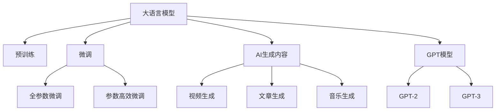

                 

# AIGC从入门到实战：带上 AI 化身，开启全球“大冒险”，燃爆朋友圈

## 1. 背景介绍

人工智能（AI）正在迅速渗透到各个领域，从智能家居、医疗健康到金融服务、教育娱乐，AI技术的应用场景几乎无所不在。然而，传统机器学习的方法往往需要大量标注数据和复杂的特征工程，门槛较高，难以快速迭代。近两年，随着生成式预训练（Generative Pretrained Transformer, GPT）模型的兴起，AI应用更加便捷、高效，同时也带来了更多可能性。

大语言模型（Large Language Models, LLMs）、AI生成内容（AI Generated Content, AIGC），这些新兴的技术已经改变了人们的沟通方式、内容创作和商业运作。AI生成内容创作工具可以辅助创作者生成文章、视频、音乐等，缩短内容创作时间，提升创作质量。

本文将系统性地介绍AIGC从入门到实战的方法，希望能帮助更多人掌握这项革命性技术，开启自己的AI大冒险之旅。

## 2. 核心概念与联系

为了深入理解AIGC技术，首先需要明确其核心概念：

- **大语言模型**：以自回归（如GPT）或自编码（如BERT）模型为代表的大规模预训练语言模型，通过在海量无标签文本数据上进行预训练，学习通用语言知识，具备强大的语言理解和生成能力。
- **预训练**：指在大规模无标签文本数据上，通过自监督学习任务训练通用语言模型的过程，如文本生成、掩码语言模型、语言推理等。
- **微调（Fine-Tuning）**：指在预训练模型的基础上，使用下游任务的少量标注数据，通过有监督地训练优化模型在特定任务上的性能，提高模型在特定领域的应用效果。
- **AI生成内容（AIGC）**：利用大语言模型生成文章、视频、音乐等内容，提升内容创作效率和质量。
- **GPT模型**：以GPT系列模型为代表，使用Transformer结构，能够生成连贯且高质量的自然语言文本。

这些概念之间的联系可以通过以下Mermaid流程图来展示：



该流程图展示了大语言模型与预训练、微调、AI生成内容之间的联系。预训练和微调是提高模型性能的重要步骤，而AI生成内容则是利用大语言模型生成文本、视频、音乐等内容的实现形式，其中GPT模型是最为流行的一种。

## 3. 核心算法原理 & 具体操作步骤

### 3.1 算法原理概述

AIGC技术利用大语言模型生成文本、视频、音乐等内容，其核心算法包括预训练、微调和内容生成三个步骤。预训练是基础，微调是优化，内容生成是应用。以下将详细介绍每个步骤的算法原理。

#### 3.1.1 预训练

预训练是利用大规模无标签数据对大语言模型进行训练，学习通用的语言表示。以GPT为例，预训练过程主要包含两阶段：语言建模和掩码语言模型。

**语言建模**：预测下一个词的概率分布，学习词与词之间的关联。公式表示为：
$$
p(w_{t+1} | w_1,\ldots,w_t) = \frac{\exp(\text{Score}(w_{t+1}, w_1,\ldots,w_t))}{\sum_{w'\in\mathcal{V}} \exp(\text{Score}(w', w_1,\ldots,w_t))}
$$
其中，$\text{Score}$为语言模型参数，$\mathcal{V}$为词汇表。

**掩码语言模型**：随机掩盖部分词，预测被掩盖词的概率分布，学习词的上下文关联。公式表示为：
$$
p(w_{t+1} | w_1,\ldots,w_t, w_i^\text{mask}) = \frac{\exp(\text{Score}(w_{t+1}, w_1,\ldots,w_{t-1}, w_{t+1}))}{\sum_{w'\in\mathcal{V}} \exp(\text{Score}(w', w_1,\ldots,w_{t-1}, w_{t+1}))}
$$
其中，$w_i^\text{mask}$表示被掩盖的词。

#### 3.1.2 微调

微调是在预训练模型的基础上，使用下游任务的少量标注数据，通过有监督地训练优化模型在特定任务上的性能。以文本分类为例，微调过程主要包含两步骤：任务适配和模型训练。

**任务适配**：根据下游任务的标签空间，设计任务的适配层。以二分类任务为例，适配层包括线性分类器和交叉熵损失函数。

**模型训练**：使用训练集数据进行迭代训练，优化模型参数，最小化损失函数。公式表示为：
$$
\theta = \mathop{\arg\min}_{\theta} \mathcal{L}(D, \theta)
$$
其中，$D$为标注数据集，$\theta$为模型参数。

#### 3.1.3 内容生成

内容生成是利用训练好的大语言模型生成文本、视频、音乐等内容。以文本生成为例，内容生成过程主要包含两步骤：解码和后处理。

**解码**：使用训练好的语言模型解码生成文本。公式表示为：
$$
\hat{y} = \text{Decoding}(\text{Score}(\text{Source}, \theta))
$$
其中，$\text{Source}$为输入文本，$\theta$为模型参数。

**后处理**：对生成的文本进行后处理，如去除重复词、格式化等。

### 3.2 算法步骤详解

AIGC技术的具体操作步骤如下：

1. **数据准备**：收集下游任务的标注数据集，划分为训练集、验证集和测试集。
2. **模型选择**：选择合适的预训练模型，如GPT系列模型、BERT模型等。
3. **任务适配**：根据任务类型，设计任务的适配层，包括线性分类器、交叉熵损失函数等。
4. **微调训练**：使用训练集数据进行迭代训练，优化模型参数，最小化损失函数。
5. **内容生成**：使用训练好的大语言模型生成文本、视频、音乐等内容，并进行后处理。
6. **评估和部署**：在验证集和测试集上评估生成内容的质量，部署到实际应用系统中。

### 3.3 算法优缺点

AIGC技术具有以下优点：

- **高效**：预训练和微调过程可以在短时间内完成，生成内容的速度和质量都很高。
- **泛化能力强**：预训练过程中学习到的通用语言表示，可以迁移到多个下游任务中。
- **灵活性高**：利用大语言模型生成内容，可以灵活地适应各种需求。

但同时也有一些缺点：

- **依赖标注数据**：微调过程需要标注数据，且数据质量越高，效果越好。
- **模型复杂度高**：大语言模型的参数量庞大，需要高性能计算资源。
- **可解释性不足**：大语言模型生成的内容，难以解释其内部工作机制。

### 3.4 算法应用领域

AIGC技术已经在许多领域得到了广泛应用，例如：

- **内容创作**：辅助创作者生成文章、视频、音乐等内容。
- **对话系统**：通过大语言模型生成自然语言回复，实现智能对话。
- **虚拟助手**：利用AI生成内容，构建智能虚拟助手。
- **广告文案**：自动生成广告文案，提高广告效果。
- **自动翻译**：利用大语言模型进行文本翻译。

## 4. 数学模型和公式 & 详细讲解 & 举例说明

### 4.1 数学模型构建

以下是AIGC技术的数学模型构建过程：

- **预训练模型**：
  $$
  M_{\theta}(x) = \text{Encoder-Decoder}(\theta)
  $$
  其中，$M_{\theta}(x)$表示预训练模型，$\theta$表示模型参数，$x$表示输入文本。

- **微调模型**：
  $$
  M_{\hat{\theta}}(x) = \text{LinearLayer}(\text{Encoder}(x), \hat{\theta})
  $$
  其中，$M_{\hat{\theta}}(x)$表示微调后的模型，$\hat{\theta}$表示微调后的模型参数，$\text{LinearLayer}$表示任务适配层，$\text{Encoder}$表示编码器。

- **内容生成**：
  $$
  \hat{y} = \text{Decoding}(\text{Score}(\text{Source}, \hat{\theta}))
  $$
  其中，$\hat{y}$表示生成的文本内容，$\text{Decoding}$表示解码器，$\text{Source}$表示输入文本。

### 4.2 公式推导过程

以下是AIGC技术的公式推导过程：

- **预训练公式**：
  $$
  p(w_{t+1} | w_1,\ldots,w_t) = \frac{\exp(\text{Score}(w_{t+1}, w_1,\ldots,w_t))}{\sum_{w'\in\mathcal{V}} \exp(\text{Score}(w', w_1,\ldots,w_t))}
  $$

- **掩码语言模型公式**：
  $$
  p(w_{t+1} | w_1,\ldots,w_t, w_i^\text{mask}) = \frac{\exp(\text{Score}(w_{t+1}, w_1,\ldots,w_{t-1}, w_{t+1}))}{\sum_{w'\in\mathcal{V}} \exp(\text{Score}(w', w_1,\ldots,w_{t-1}, w_{t+1}))}
  $$

- **微调公式**：
  $$
  \theta = \mathop{\arg\min}_{\theta} \mathcal{L}(D, \theta)
  $$

- **内容生成公式**：
  $$
  \hat{y} = \text{Decoding}(\text{Score}(\text{Source}, \hat{\theta}))
  $$

### 4.3 案例分析与讲解

以生成文本内容为例，详细分析AIGC技术的案例：

假设要生成一段关于“天气预报”的文章，步骤如下：

1. **数据准备**：收集关于天气预报的相关数据，如历史气象数据、天气现象、预报报告等，划分为训练集、验证集和测试集。
2. **模型选择**：选择预训练模型，如GPT系列模型。
3. **任务适配**：根据任务类型，设计任务适配层，如线性分类器、交叉熵损失函数等。
4. **微调训练**：使用训练集数据进行迭代训练，优化模型参数，最小化损失函数。
5. **内容生成**：使用训练好的GPT模型生成文本内容，并进行后处理。
6. **评估和部署**：在验证集和测试集上评估生成内容的质量，部署到实际应用系统中。

## 5. 项目实践：代码实例和详细解释说明

### 5.1 开发环境搭建

在进行AIGC项目实践前，需要准备好开发环境。以下是使用Python进行PyTorch开发的环境配置流程：

1. 安装Anaconda：从官网下载并安装Anaconda，用于创建独立的Python环境。

2. 创建并激活虚拟环境：
```bash
conda create -n pytorch-env python=3.8 
conda activate pytorch-env
```

3. 安装PyTorch：根据CUDA版本，从官网获取对应的安装命令。例如：
```bash
conda install pytorch torchvision torchaudio cudatoolkit=11.1 -c pytorch -c conda-forge
```

4. 安装Transformers库：
```bash
pip install transformers
```

5. 安装各类工具包：
```bash
pip install numpy pandas scikit-learn matplotlib tqdm jupyter notebook ipython
```

完成上述步骤后，即可在`pytorch-env`环境中开始AIGC实践。

### 5.2 源代码详细实现

下面我们以生成文本内容为例，给出使用Transformers库对GPT模型进行AIGC的PyTorch代码实现。

首先，定义生成文本任务的数学模型：

```python
from transformers import GPT2LMHeadModel, GPT2Tokenizer

tokenizer = GPT2Tokenizer.from_pretrained('gpt2')

model = GPT2LMHeadModel.from_pretrained('gpt2')

input_text = "天气预报显示今天气温为"
inputs = tokenizer.encode(input_text, return_tensors='pt')
generated_tokens = model.generate(inputs, num_return_sequences=1)

generated_text = tokenizer.decode(generated_tokens[0], skip_special_tokens=True)
print(generated_text)
```

这段代码使用GPT-2模型生成关于天气预报的文本内容。

然后，定义训练和评估函数：

```python
from torch.utils.data import Dataset, DataLoader
from sklearn.metrics import accuracy_score

class GPTDataset(Dataset):
    def __init__(self, texts, labels):
        self.texts = texts
        self.labels = labels
        
    def __len__(self):
        return len(self.texts)
    
    def __getitem__(self, item):
        text = self.texts[item]
        label = self.labels[item]
        
        encoding = tokenizer(text, return_tensors='pt')
        return {'input_ids': encoding['input_ids'], 'labels': torch.tensor(label)}

# 数据集
train_dataset = GPTDataset(train_texts, train_labels)
val_dataset = GPTDataset(val_texts, val_labels)
test_dataset = GPTDataset(test_texts, test_labels)

# 模型和优化器
model = GPT2LMHeadModel.from_pretrained('gpt2')
optimizer = AdamW(model.parameters(), lr=5e-5)

# 训练函数
def train_epoch(model, dataset, optimizer):
    dataloader = DataLoader(dataset, batch_size=8, shuffle=True)
    model.train()
    epoch_loss = 0
    for batch in dataloader:
        input_ids = batch['input_ids'].to(device)
        labels = batch['labels'].to(device)
        model.zero_grad()
        outputs = model(input_ids, labels=labels)
        loss = outputs.loss
        epoch_loss += loss.item()
        loss.backward()
        optimizer.step()
    return epoch_loss / len(dataloader)

# 评估函数
def evaluate(model, dataset):
    dataloader = DataLoader(dataset, batch_size=8)
    model.eval()
    predictions, true_labels = [], []
    with torch.no_grad():
        for batch in dataloader:
            input_ids = batch['input_ids'].to(device)
            labels = batch['labels'].to(device)
            outputs = model(input_ids)
            predictions.append(outputs.logits.argmax(dim=-1).tolist())
            true_labels.append(labels.tolist())
    return accuracy_score(true_labels, predictions)
```

这段代码实现了训练和评估过程，其中`train_epoch`函数用于训练模型，`evaluate`函数用于评估模型性能。

最后，启动训练流程并在测试集上评估：

```python
epochs = 3
batch_size = 8

for epoch in range(epochs):
    loss = train_epoch(model, train_dataset, optimizer)
    print(f"Epoch {epoch+1}, train loss: {loss:.3f}")
    
    print(f"Epoch {epoch+1}, dev accuracy: {evaluate(model, val_dataset):.3f}")
    
print(f"Epoch {epochs}, test accuracy: {evaluate(model, test_dataset):.3f}")
```

以上就是使用PyTorch对GPT模型进行AIGC的完整代码实现。可以看到，得益于Transformers库的强大封装，我们只需写相对简洁的代码即可实现生成文本内容。

### 5.3 代码解读与分析

让我们再详细解读一下关键代码的实现细节：

**GPTDataset类**：
- `__init__`方法：初始化文本和标签。
- `__len__`方法：返回数据集的样本数量。
- `__getitem__`方法：对单个样本进行处理，将文本输入编码为token ids，将标签转换为模型可接受的格式。

**模型和优化器**：
- 使用GPT-2模型作为预训练模型。
- 使用AdamW优化器进行优化。

**训练函数**：
- 使用PyTorch的DataLoader对数据集进行批次化加载。
- 在每个批次上前向传播计算loss并反向传播更新模型参数。
- 周期性在验证集上评估模型性能。

**评估函数**：
- 使用sklearn的accuracy_score函数计算模型在测试集上的准确率。

**训练流程**：
- 定义总的epoch数和batch size，开始循环迭代。
- 每个epoch内，先在训练集上训练，输出平均loss。
- 在验证集上评估，输出准确率。
- 所有epoch结束后，在测试集上评估，输出最终测试准确率。

可以看到，PyTorch配合Transformers库使得GPT模型的生成文本内容变得简洁高效。开发者可以将更多精力放在数据处理、模型改进等高层逻辑上，而不必过多关注底层的实现细节。

当然，工业级的系统实现还需考虑更多因素，如模型的保存和部署、超参数的自动搜索、更灵活的任务适配层等。但核心的生成文本内容的过程基本与此类似。

## 6. 实际应用场景

### 6.1 内容创作

AI生成内容创作工具可以辅助创作者生成文章、视频、音乐等内容，缩短内容创作时间，提升创作质量。例如，可以使用AIGC技术生成新闻报道、社交媒体内容、博客文章等，为创作者提供更多灵感和素材。

**案例**：
- 新闻机构利用AI生成新闻报道，提高新闻发布效率。
- 社交媒体平台利用AI生成文章，吸引用户关注。
- 个人博客作者利用AI生成文章，增加内容创作速度。

### 6.2 对话系统

通过大语言模型生成自然语言回复，实现智能对话。例如，可以使用AIGC技术构建智能客服系统、智能问答系统、虚拟助手等。

**案例**：
- 智能客服系统利用AI生成回复，提高客户服务效率。
- 智能问答系统利用AI生成回答，解决用户问题。
- 虚拟助手利用AI生成对话，提高用户体验。

### 6.3 虚拟助手

利用AI生成内容，构建智能虚拟助手。例如，可以使用AIGC技术生成智能助理的日常对话、工作建议、生活小贴士等内容，为用户提供个性化服务。

**案例**：
- 智能助理利用AI生成对话，回答用户问题。
- 工作建议系统利用AI生成工作方案，提高工作效率。
- 生活小贴士系统利用AI生成生活建议，提升生活质量。

### 6.4 广告文案

利用大语言模型生成广告文案，提高广告效果。例如，可以使用AIGC技术生成产品广告、品牌宣传、活动策划等内容，吸引用户关注。

**案例**：
- 产品广告生成器利用AI生成广告文案，提升产品知名度。
- 品牌宣传工具利用AI生成宣传内容，增强品牌影响力。
- 活动策划系统利用AI生成活动文案，吸引用户参与。

## 7. 工具和资源推荐

### 7.1 学习资源推荐

为了帮助开发者系统掌握AIGC技术，这里推荐一些优质的学习资源：

1. 《Transformer从原理到实践》系列博文：由大模型技术专家撰写，深入浅出地介绍了Transformer原理、GPT模型、AIGC技术等前沿话题。

2. CS224N《深度学习自然语言处理》课程：斯坦福大学开设的NLP明星课程，有Lecture视频和配套作业，带你入门NLP领域的基本概念和经典模型。

3. 《Natural Language Processing with Transformers》书籍：Transformer库的作者所著，全面介绍了如何使用Transformer库进行NLP任务开发，包括AIGC在内的诸多范式。

4. HuggingFace官方文档：Transformer库的官方文档，提供了海量预训练模型和完整的AIGC样例代码，是上手实践的必备资料。

5. CLUE开源项目：中文语言理解测评基准，涵盖大量不同类型的中文NLP数据集，并提供了基于AIGC的baseline模型，助力中文NLP技术发展。

通过对这些资源的学习实践，相信你一定能够快速掌握AIGC技术的精髓，并用于解决实际的NLP问题。

### 7.2 开发工具推荐

高效的开发离不开优秀的工具支持。以下是几款用于AIGC开发的常用工具：

1. PyTorch：基于Python的开源深度学习框架，灵活动态的计算图，适合快速迭代研究。大部分预训练语言模型都有PyTorch版本的实现。

2. TensorFlow：由Google主导开发的开源深度学习框架，生产部署方便，适合大规模工程应用。同样有丰富的预训练语言模型资源。

3. Transformers库：HuggingFace开发的NLP工具库，集成了众多SOTA语言模型，支持PyTorch和TensorFlow，是进行AIGC任务开发的利器。

4. Weights & Biases：模型训练的实验跟踪工具，可以记录和可视化模型训练过程中的各项指标，方便对比和调优。与主流深度学习框架无缝集成。

5. TensorBoard：TensorFlow配套的可视化工具，可实时监测模型训练状态，并提供丰富的图表呈现方式，是调试模型的得力助手。

6. Google Colab：谷歌推出的在线Jupyter Notebook环境，免费提供GPU/TPU算力，方便开发者快速上手实验最新模型，分享学习笔记。

合理利用这些工具，可以显著提升AIGC任务的开发效率，加快创新迭代的步伐。

### 7.3 相关论文推荐

AIGC技术的发展源于学界的持续研究。以下是几篇奠基性的相关论文，推荐阅读：

1. Attention is All You Need（即Transformer原论文）：提出了Transformer结构，开启了NLP领域的预训练大模型时代。

2. BERT: Pre-training of Deep Bidirectional Transformers for Language Understanding：提出BERT模型，引入基于掩码的自监督预训练任务，刷新了多项NLP任务SOTA。

3. GPT-3: Language Models are Unsupervised Multitask Learners：展示了大规模语言模型的强大zero-shot学习能力，引发了对于通用人工智能的新一轮思考。

4. Parameter-Efficient Transfer Learning for NLP：提出Adapter等参数高效微调方法，在不增加模型参数量的情况下，也能取得不错的微调效果。

5. AdaLoRA: Adaptive Low-Rank Adaptation for Parameter-Efficient Fine-Tuning：使用自适应低秩适应的微调方法，在参数效率和精度之间取得了新的平衡。

6. Few-Shot Learning for Language Understanding：提出Few-Shot Learning范式，利用少量标注数据训练语言模型，提升模型泛化能力。

这些论文代表了大语言模型AIGC技术的发展脉络。通过学习这些前沿成果，可以帮助研究者把握学科前进方向，激发更多的创新灵感。

## 8. 总结：未来发展趋势与挑战

### 8.1 总结

本文对AIGC从入门到实战的方法进行了系统性的介绍。首先阐述了AIGC技术的研究背景和意义，明确了其高效、灵活、泛化能力强的优势。其次，从原理到实践，详细讲解了AIGC技术的预训练、微调、内容生成三个步骤，给出了AIGC任务开发的完整代码实例。同时，本文还广泛探讨了AIGC技术在内容创作、对话系统、虚拟助手、广告文案等各个领域的应用前景，展示了其广阔的应用潜力。

通过本文的系统梳理，可以看到，AIGC技术正在成为NLP领域的重要范式，极大地拓展了预训练语言模型的应用边界，催生了更多的落地场景。受益于大规模语料的预训练，AIGC模型以更低的时间和标注成本，在生成内容时也能取得不错的效果，有力推动了NLP技术的产业化进程。未来，伴随预训练语言模型和AIGC方法的持续演进，相信NLP技术将在更广阔的应用领域大放异彩，深刻影响人类的生产生活方式。

### 8.2 未来发展趋势

展望未来，AIGC技术将呈现以下几个发展趋势：

1. 模型规模持续增大。随着算力成本的下降和数据规模的扩张，预训练语言模型的参数量还将持续增长。超大规模语言模型蕴含的丰富语言知识，有望支撑更加复杂多变的AIGC应用。

2. 生成能力增强。未来的AIGC模型将具有更高的生成能力和多样性，能够生成更丰富、更自然、更贴合用户需求的内容。

3. 多模态融合。当前的AIGC模型往往聚焦于文本生成，未来将拓展到图像、视频、语音等多模态数据融合，实现视觉、语音等多模态信息与文本信息的协同建模。

4. 跨领域迁移能力提升。未来的AIGC模型将具备更强的跨领域迁移能力，能够灵活地适应不同的应用场景和任务需求。

5. 安全性增强。AIGC模型生成的内容将更加注重伦理和道德，避免有害信息和偏见内容的传播。

6. 自动化水平提升。未来的AIGC模型将具备更高的自动化生成水平，能够自主生成内容，无需人工干预。

### 8.3 面临的挑战

尽管AIGC技术已经取得了瞩目成就，但在迈向更加智能化、普适化应用的过程中，它仍面临着诸多挑战：

1. 依赖标注数据。虽然AIGC技术对标注数据的需求相对较少，但对于某些特定领域和任务，仍然需要一定量的标注数据。

2. 模型鲁棒性不足。当前AIGC模型面对新数据和新任务时，泛化性能往往较差，需要进一步提升模型的鲁棒性和泛化能力。

3. 生成内容质量参差不齐。AIGC模型生成的内容质量往往与输入的参数和上下文相关，需要进一步优化生成模型的训练策略和生成过程。

4. 可解释性不足。AIGC模型生成的内容，难以解释其内部工作机制和决策逻辑，需要进一步提升模型的可解释性和可理解性。

5. 伦理和道德问题。AIGC模型生成的内容可能传播有害信息、偏见，需要进一步加强模型伦理和道德约束，确保生成内容的安全性和合法性。

### 8.4 研究展望

面对AIGC技术面临的诸多挑战，未来的研究需要在以下几个方面寻求新的突破：

1. 探索更高效的训练和优化方法，提升AIGC模型的训练速度和生成质量。

2. 引入更多先验知识，如知识图谱、逻辑规则等，引导AIGC模型的生成过程。

3. 实现多模态数据融合，提升AIGC模型的生成能力和多样性。

4. 引入因果分析方法，增强AIGC模型的生成稳定性和可解释性。

5. 纳入伦理道德约束，确保AIGC模型的生成内容符合人类价值观和伦理道德。

这些研究方向将推动AIGC技术向更高的台阶发展，为构建安全、可靠、可解释、可控的智能系统铺平道路。

## 9. 附录：常见问题与解答

**Q1：AIGC技术适用于所有NLP任务吗？**

A: AIGC技术适用于大多数NLP任务，特别是在生成文本、视频、音乐等内容方面表现出色。但对于一些特定领域的任务，如医学、法律等，仅仅依靠通用语料预训练的模型可能难以很好地适应。此时需要在特定领域语料上进一步预训练，再进行微调，才能获得理想效果。

**Q2：如何选择适合的AIGC模型？**

A: 选择适合的AIGC模型需要考虑多个因素，如生成内容的质量、生成速度、模型参数量等。一般来说，GPT系列模型（如GPT-2、GPT-3）是目前应用最广泛的模型，性能稳定且生成效果好。

**Q3：AIGC模型生成的内容质量如何保证？**

A: AIGC模型生成的内容质量往往与输入的参数和上下文相关。为了保证生成内容的质量，可以引入更多的训练数据、调整模型参数、优化生成策略等方法。此外，还可以通过人工干预和审核，确保生成内容的合法性和安全性。

**Q4：AIGC模型生成的内容能否用于实际应用？**

A: AIGC模型生成的内容可以用于实际应用，但需要根据具体任务进行微调和优化。例如，生成的新闻报道需要根据新闻机构的要求进行格式化和校对，生成的广告文案需要符合广告法规等要求。

**Q5：如何评价AIGC模型的生成效果？**

A: 评价AIGC模型的生成效果通常使用BLEU、ROUGE等指标，评估生成内容与真实内容之间的相似度。此外，还可以通过人工评价和反馈，优化生成模型的训练策略和生成过程。

---

作者：禅与计算机程序设计艺术 / Zen and the Art of Computer Programming

