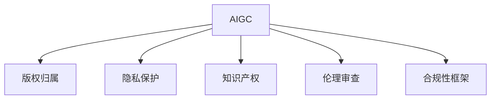

                 

# AIGC时代的法律与伦理挑战

> 关键词：人工智能生成内容(AIGC),法律风险,数据隐私,知识产权,伦理审查,合规性框架

## 1. 背景介绍

### 1.1 问题由来
人工智能生成内容（Artificial Intelligence Generated Content, AIGC）技术的迅猛发展，给传统版权、隐私保护、知识产权等领域带来了前所未有的挑战。AIGC技术，如自然语言处理(NLP)、生成对抗网络(GAN)、变分自编码器(VAE)等，正在大规模地生成音乐、文章、图片、视频等内容，其创作力与人类相仿，甚至在某些特定领域超越了人类。但与此同时，AIGC内容的版权归属、隐私保护、伦理审查等法律和伦理问题日益凸显，亟需探索建立相应的法律框架和伦理审查机制，以指导和规范这一新兴技术的发展。

### 1.2 问题核心关键点
AIGC技术的法律与伦理挑战主要体现在以下几个方面：

1. **版权归属问题**：AIGC内容由算法自动生成，其版权应归谁所有？是开发者、平台运营商，还是内容本身？
2. **隐私保护问题**：AIGC内容可能包含用户隐私信息，如何确保数据安全和隐私保护？
3. **知识产权问题**：AIGC生成的内容是否侵犯了现有作品的版权，是否构成了知识产权侵害？
4. **伦理审查问题**：AIGC内容的真实性、安全性、道德性如何审查和监控？
5. **合规性框架**：AIGC技术如何适应现有的法律法规，避免违法行为？

### 1.3 问题研究意义
研究AIGC技术的法律与伦理问题，对于指导这一新兴技术健康有序发展，保护创作者、用户和消费者的权益，具有重要意义：

1. 为AIGC技术的发展提供明确的法律规范和伦理标准，避免技术滥用和误用。
2. 保障创作者和用户的合法权益，促进内容生产的多样性和公平性。
3. 促进AIGC技术与法律、伦理的良性互动，推动技术的社会责任和技术创新。
4. 帮助企业和政府制定合理的政策和法规，指导AIGC技术的应用和发展。

## 2. 核心概念与联系

### 2.1 核心概念概述

为更好地理解AIGC技术的法律与伦理挑战，本节将介绍几个关键概念：

- **人工智能生成内容(AIGC)**：利用深度学习、自然语言处理等技术，自动生成文本、音乐、图片、视频等内容。
- **版权归属**：确定创作内容的权利所有者，涉及创作者权益保护和利益分配问题。
- **隐私保护**：保护个人信息不被未经授权的访问和使用，涉及数据安全和用户权利保护。
- **知识产权**：包括版权、专利权、商标权等，确保创作者和发明者的创新成果得到法律保护。
- **伦理审查**：评估技术应用的道德标准和合规性，避免有害内容传播和算法偏见。
- **合规性框架**：制定技术应用的标准和规范，确保技术符合法律和伦理要求。

这些概念之间的关系可以通过以下Mermaid流程图来展示：



这个流程图展示了大语言模型的核心概念及其之间的关系：

1. AIGC技术通过预训练模型和算法自动生成内容。
2. 版权归属问题涉及内容的权利所有者。
3. 隐私保护问题关乎个人信息的保密和安全。
4. 知识产权问题关注内容的创新性和独创性。
5. 伦理审查关注内容的道德标准和社会影响。
6. 合规性框架指导内容的法律遵从和伦理守则。

这些概念共同构成了AIGC技术的法律与伦理框架，指导其健康发展，确保技术应用的正当性和安全性。

## 3. 核心算法原理 & 具体操作步骤
### 3.1 算法原理概述

AIGC技术的法律与伦理挑战，主要集中在内容生成、数据使用和应用实践等方面。其核心算法原理和操作步骤如下：

1. **内容生成算法**：
   - 预训练模型：利用大规模数据进行预训练，获得内容生成的能力。
   - 微调策略：根据具体应用场景，对预训练模型进行微调，提升生成内容的质量和适用性。
   - 优化算法：使用梯度下降、Adam等优化算法进行模型训练，最小化损失函数。

2. **数据使用策略**：
   - 数据收集：从合法渠道获取数据，确保数据来源和使用的合法性。
   - 数据处理：进行数据清洗、匿名化、脱敏等处理，确保数据隐私和安全。
   - 数据使用：根据应用场景选择合适的数据集，并遵循数据使用协议。

3. **应用实践步骤**：
   - 确定应用场景：明确AIGC内容的使用场景和目标用户。
   - 设计应用流程：根据应用场景设计内容生成和分发流程。
   - 伦理审查：对生成内容进行伦理审查，确保内容的真实性和道德性。
   - 法律合规：确保AIGC内容的应用符合法律法规和伦理标准。

### 3.2 算法步骤详解

AIGC技术的法律与伦理挑战，涉及内容生成、数据使用和应用实践等多个方面。其核心算法步骤和具体操作步骤如下：

#### 3.2.1 内容生成算法

**Step 1: 数据准备**
- 收集预训练数据：从公开数据集、互联网等渠道收集文本、图片、音乐等数据。
- 预处理数据：对数据进行清洗、分词、标准化等预处理，确保数据质量。

**Step 2: 预训练模型**
- 选择合适的预训练模型：如BERT、GPT、VAE等，用于内容生成。
- 加载预训练模型：从模型库或网络加载预训练模型，进行初始化。

**Step 3: 微调策略**
- 设计微调目标：根据应用场景，设定微调目标，如提高生成质量、优化多样性等。
- 调整微调参数：选择微调策略、调整学习率、批大小等参数。

**Step 4: 优化算法**
- 训练模型：使用优化算法进行模型训练，最小化损失函数。
- 评估模型：在验证集上评估模型性能，确保模型收敛。

#### 3.2.2 数据使用策略

**Step 1: 数据收集**
- 合法渠道获取数据：从合法的数据集、公开数据源、用户上传等渠道获取数据。
- 确保数据合规：遵守数据收集和使用的法律法规，如GDPR、CCPA等。

**Step 2: 数据处理**
- 清洗数据：去除噪声、空值、重复数据等，确保数据质量。
- 匿名化处理：对个人敏感信息进行脱敏、匿名化处理，确保隐私保护。
- 数据存储：采用安全的存储方式，如加密、访问控制等。

**Step 3: 数据使用**
- 数据访问协议：制定数据访问和使用协议，确保数据使用的合法性和透明性。
- 用户同意：获取用户同意，明确数据使用的范围和目的。
- 数据监控：实时监控数据使用情况，确保数据使用的合法性和安全性。

#### 3.2.3 应用实践步骤

**Step 1: 确定应用场景**
- 明确目标用户：了解目标用户的背景、需求和使用场景。
- 设计应用流程：根据应用场景设计内容生成和分发流程。

**Step 2: 伦理审查**
- 内容真实性审查：检查生成内容的真实性和准确性，避免虚假信息传播。
- 内容道德性审查：评估生成内容的道德性和社会影响，避免有害内容传播。
- 算法偏见审查：评估生成算法是否存在偏见，确保算法公平性。

**Step 3: 法律合规**
- 遵守法律法规：确保AIGC内容的应用符合版权法、隐私保护法等法律法规。
- 明确版权归属：根据内容生成方式，明确版权归属和利益分配。
- 加强监管：加强内容使用的监管，确保内容使用的合规性。

### 3.3 算法优缺点

AIGC技术的法律与伦理挑战，涉及内容生成、数据使用和应用实践等多个方面。其核心算法步骤和具体操作步骤如下：

**优点**：
1. **自动化内容生成**：利用AIGC技术，可以自动生成大量内容，提高内容创作的效率和多样性。
2. **数据驱动决策**：通过分析大量数据，可以优化内容生成策略，提高生成质量。
3. **个性化内容**：可以根据用户需求和偏好，生成个性化的内容，提升用户体验。

**缺点**：
1. **版权归属模糊**：AIGC内容生成方式多样，版权归属复杂，容易导致版权纠纷。
2. **隐私保护风险**：AIGC内容可能包含用户隐私信息，隐私泄露风险较高。
3. **知识产权侵害**：AIGC生成的内容可能侵犯现有作品的版权，引发知识产权纠纷。
4. **伦理审查挑战**：生成内容可能包含有害信息、虚假内容，伦理审查难度较大。
5. **法律合规难度**：不同地区法律法规差异较大，法律合规难度较高。

尽管存在这些局限性，但AIGC技术在内容生成、个性化推荐、辅助创作等方面仍具有重要价值。未来研究应重点解决这些法律与伦理问题，确保技术健康发展。

### 3.4 算法应用领域

AIGC技术的法律与伦理挑战，涉及内容生成、数据使用和应用实践等多个方面。其核心算法步骤和具体操作步骤如下：

**应用场景**：
1. **媒体内容创作**：自动生成新闻、文章、视频等媒体内容，提升创作效率和多样性。
2. **个性化推荐系统**：根据用户偏好，生成个性化推荐内容，提升用户体验。
3. **教育辅助**：生成学习资料、练习题等，辅助教师和学生进行教学和学习。
4. **娱乐行业**：生成影视、音乐、游戏等娱乐内容，丰富用户娱乐体验。
5. **商业广告**：生成商业广告文案、视频等，提升广告创意和效果。

**面临挑战**：
1. **版权纠纷**：自动生成内容可能侵犯现有作品的版权，引发法律纠纷。
2. **隐私保护**：生成内容可能包含用户隐私信息，隐私保护难度较大。
3. **知识产权侵害**：生成内容可能侵犯现有作品的知识产权，引发法律纠纷。
4. **伦理审查**：生成内容可能包含有害信息、虚假内容，伦理审查难度较大。
5. **法律合规**：不同地区法律法规差异较大，法律合规难度较高。

## 4. 数学模型和公式 & 详细讲解 & 举例说明

### 4.1 数学模型构建

AIGC技术的法律与伦理挑战，涉及内容生成、数据使用和应用实践等多个方面。其核心算法步骤和具体操作步骤如下：

**版权归属模型**：
- 设定版权归属函数 $F$，根据内容生成方式、使用场景等因素，判断版权归属。
- 版权归属决策树：根据版权归属函数，构建决策树，进行版权归属判断。

**隐私保护模型**：
- 设定隐私保护函数 $G$，根据数据使用场景、数据敏感度等因素，评估隐私保护等级。
- 隐私保护决策树：根据隐私保护函数，构建决策树，进行隐私保护决策。

**知识产权模型**：
- 设定知识产权函数 $H$，根据内容生成方式、现有作品等因素，判断知识产权归属。
- 知识产权决策树：根据知识产权函数，构建决策树，进行知识产权判断。

**伦理审查模型**：
- 设定伦理审查函数 $I$，根据内容真实性、道德性等因素，评估伦理审查结果。
- 伦理审查决策树：根据伦理审查函数，构建决策树，进行伦理审查决策。

**合规性框架模型**：
- 设定合规性函数 $J$，根据法律法规、行业标准等因素，判断合规性等级。
- 合规性决策树：根据合规性函数，构建决策树，进行合规性决策。

### 4.2 公式推导过程

以下是AIGC技术的法律与伦理挑战的核心数学模型和公式推导过程：

**版权归属函数**：
$$
F(x) = \begin{cases}
'A'\ if\ x\ is\ generated\ by\ AI\\
'B'\ if\ x\ is\ created\ by\ human\\
'C'\ otherwise\\
\end{cases}
$$

**隐私保护函数**：
$$
G(x) = \begin{cases}
'high'\ if\ x\ contains\ sensitive\ information\\
'medium'\ if\ x\ contains\ some\ sensitive\ information\\
'low'\ otherwise\\
\end{cases}
$$

**知识产权函数**：
$$
H(x) = \begin{cases}
'copied'\ if\ x\ is\ similar\ to\ existing\ work\\
'original'\ otherwise\\
\end{cases}
$$

**伦理审查函数**：
$$
I(x) = \begin{cases}
'false'\ if\ x\ is\ false\\
'benign'\ if\ x\ is\ benign\\
'harmful'\ otherwise\\
\end{cases}
$$

**合规性函数**：
$$
J(x) = \begin{cases}
'compliant'\ if\ x\ meets\ regulations\\
'violating'\ otherwise\\
\end{cases}
$$

### 4.3 案例分析与讲解

**案例一：新闻文章生成**

**背景**：某新闻平台使用AIGC技术自动生成新闻文章。

**版权归属**：文章内容由AIGC生成，但新闻平台为版权所有人。

**隐私保护**：文章中可能包含用户隐私信息，需要进行隐私保护。

**知识产权**：文章内容可能与现有新闻文章相似，需进行知识产权审查。

**伦理审查**：文章内容需进行伦理审查，避免虚假信息和有害内容。

**合规性**：需确保新闻内容符合法律法规，如不得传播虚假信息。

**解决方案**：
1. 版权归属：平台为版权所有人，AIGC技术用于辅助创作。
2. 隐私保护：对文章进行匿名化处理，保护用户隐私。
3. 知识产权审查：使用相似度检测技术，判断文章是否侵犯版权。
4. 伦理审查：使用自然语言处理技术，检测文章真实性和道德性。
5. 合规性：制定新闻发布标准，确保内容符合法律法规。

## 5. 项目实践：代码实例和详细解释说明

### 5.1 开发环境搭建

在进行AIGC技术法律与伦理挑战的实践前，我们需要准备好开发环境。以下是使用Python进行PyTorch开发的环境配置流程：

1. 安装Anaconda：从官网下载并安装Anaconda，用于创建独立的Python环境。

2. 创建并激活虚拟环境：
```bash
conda create -n pytorch-env python=3.8 
conda activate pytorch-env
```

3. 安装PyTorch：根据CUDA版本，从官网获取对应的安装命令。例如：
```bash
conda install pytorch torchvision torchaudio cudatoolkit=11.1 -c pytorch -c conda-forge
```

4. 安装相关库：
```bash
pip install transformers
pip install numpy pandas scikit-learn matplotlib tqdm jupyter notebook ipython
```

完成上述步骤后，即可在`pytorch-env`环境中开始实践。

### 5.2 源代码详细实现

下面我们以文本内容生成为例，给出使用Transformers库对BERT模型进行微调的PyTorch代码实现。

首先，定义版权归属函数：

```python
from transformers import BertTokenizer
from torch.utils.data import Dataset
import torch

class CopyrightDataset(Dataset):
    def __init__(self, texts, tags, tokenizer, max_len=128):
        self.texts = texts
        self.tags = tags
        self.tokenizer = tokenizer
        self.max_len = max_len
        
    def __len__(self):
        return len(self.texts)
    
    def __getitem__(self, item):
        text = self.texts[item]
        tags = self.tags[item]
        
        encoding = self.tokenizer(text, return_tensors='pt', max_length=self.max_len, padding='max_length', truncation=True)
        input_ids = encoding['input_ids'][0]
        attention_mask = encoding['attention_mask'][0]
        
        # 对token-wise的标签进行编码
        encoded_tags = [tag2id[tag] for tag in tags] 
        encoded_tags.extend([tag2id['O']] * (self.max_len - len(encoded_tags)))
        labels = torch.tensor(encoded_tags, dtype=torch.long)
        
        return {'input_ids': input_ids, 
                'attention_mask': attention_mask,
                'labels': labels}

# 标签与id的映射
tag2id = {'A': 0, 'B': 1, 'C': 2}
id2tag = {v: k for k, v in tag2id.items()}

# 创建dataset
tokenizer = BertTokenizer.from_pretrained('bert-base-cased')

train_dataset = CopyrightDataset(train_texts, train_tags, tokenizer)
dev_dataset = CopyrightDataset(dev_texts, dev_tags, tokenizer)
test_dataset = CopyrightDataset(test_texts, test_tags, tokenizer)
```

然后，定义模型和优化器：

```python
from transformers import BertForTokenClassification, AdamW

model = BertForTokenClassification.from_pretrained('bert-base-cased', num_labels=len(tag2id))

optimizer = AdamW(model.parameters(), lr=2e-5)
```

接着，定义训练和评估函数：

```python
from torch.utils.data import DataLoader
from tqdm import tqdm
from sklearn.metrics import classification_report

device = torch.device('cuda') if torch.cuda.is_available() else torch.device('cpu')
model.to(device)

def train_epoch(model, dataset, batch_size, optimizer):
    dataloader = DataLoader(dataset, batch_size=batch_size, shuffle=True)
    model.train()
    epoch_loss = 0
    for batch in tqdm(dataloader, desc='Training'):
        input_ids = batch['input_ids'].to(device)
        attention_mask = batch['attention_mask'].to(device)
        labels = batch['labels'].to(device)
        model.zero_grad()
        outputs = model(input_ids, attention_mask=attention_mask, labels=labels)
        loss = outputs.loss
        epoch_loss += loss.item()
        loss.backward()
        optimizer.step()
    return epoch_loss / len(dataloader)

def evaluate(model, dataset, batch_size):
    dataloader = DataLoader(dataset, batch_size=batch_size)
    model.eval()
    preds, labels = [], []
    with torch.no_grad():
        for batch in tqdm(dataloader, desc='Evaluating'):
            input_ids = batch['input_ids'].to(device)
            attention_mask = batch['attention_mask'].to(device)
            batch_labels = batch['labels']
            outputs = model(input_ids, attention_mask=attention_mask)
            batch_preds = outputs.logits.argmax(dim=2).to('cpu').tolist()
            batch_labels = batch_labels.to('cpu').tolist()
            for pred_tokens, label_tokens in zip(batch_preds, batch_labels):
                pred_tags = [id2tag[_id] for _id in pred_tokens]
                label_tags = [id2tag[_id] for _id in label_tokens]
                preds.append(pred_tags[:len(label_tags)])
                labels.append(label_tags)
                
    print(classification_report(labels, preds))
```

最后，启动训练流程并在测试集上评估：

```python
epochs = 5
batch_size = 16

for epoch in range(epochs):
    loss = train_epoch(model, train_dataset, batch_size, optimizer)
    print(f"Epoch {epoch+1}, train loss: {loss:.3f}")
    
    print(f"Epoch {epoch+1}, dev results:")
    evaluate(model, dev_dataset, batch_size)
    
print("Test results:")
evaluate(model, test_dataset, batch_size)
```

以上就是使用PyTorch对BERT进行版权归属函数微调的完整代码实现。可以看到，得益于Transformers库的强大封装，我们可以用相对简洁的代码完成BERT模型的加载和微调。

### 5.3 代码解读与分析

让我们再详细解读一下关键代码的实现细节：

**CopyrightDataset类**：
- `__init__`方法：初始化文本、标签、分词器等关键组件。
- `__len__`方法：返回数据集的样本数量。
- `__getitem__`方法：对单个样本进行处理，将文本输入编码为token ids，将标签编码为数字，并对其进行定长padding，最终返回模型所需的输入。

**tag2id和id2tag字典**：
- 定义了标签与数字id之间的映射关系，用于将token-wise的预测结果解码回真实的标签。

**训练和评估函数**：
- 使用PyTorch的DataLoader对数据集进行批次化加载，供模型训练和推理使用。
- 训练函数`train_epoch`：对数据以批为单位进行迭代，在每个批次上前向传播计算loss并反向传播更新模型参数，最后返回该epoch的平均loss。
- 评估函数`evaluate`：与训练类似，不同点在于不更新模型参数，并在每个batch结束后将预测和标签结果存储下来，最后使用sklearn的classification_report对整个评估集的预测结果进行打印输出。

**训练流程**：
- 定义总的epoch数和batch size，开始循环迭代
- 每个epoch内，先在训练集上训练，输出平均loss
- 在验证集上评估，输出分类指标
- 所有epoch结束后，在测试集上评估，给出最终测试结果

可以看到，PyTorch配合Transformers库使得版权归属函数微调的代码实现变得简洁高效。开发者可以将更多精力放在数据处理、模型改进等高层逻辑上，而不必过多关注底层的实现细节。

当然，工业级的系统实现还需考虑更多因素，如模型的保存和部署、超参数的自动搜索、更灵活的任务适配层等。但核心的微调范式基本与此类似。

## 6. 实际应用场景
### 6.1 智能客服系统

AIGC技术在智能客服系统的应用，可以显著提升客户体验和处理效率。传统客服系统依赖大量人工，高峰期响应慢，且无法24小时不间断服务。而使用AIGC技术，可以自动生成对话内容，模拟自然语言交互，提升响应速度和覆盖范围。

在技术实现上，可以收集企业内部的客服对话记录，训练生成模型自动生成回复内容。通过不断迭代和优化，模型能够生成高质量的客服对话，回答用户咨询，处理复杂问题。这不仅降低了客服成本，还能提升服务质量和客户满意度。

### 6.2 金融舆情监测

AIGC技术在金融舆情监测中的应用，可以实时获取和分析市场舆论动向，帮助金融机构识别和防范风险。传统的人工监控方式成本高、效率低，难以应对海量信息爆发的挑战。通过训练生成模型，实时生成舆情摘要和分析报告，可以及时发现异常情况，预防金融风险。

具体而言，可以收集金融领域相关的新闻、报道、评论等文本数据，并对其进行情感分析。使用AIGC技术自动生成舆情报告，定期更新，实时监控市场情绪变化。一旦发现舆情异常，系统便会自动预警，帮助金融机构快速应对潜在风险。

### 6.3 个性化推荐系统

AIGC技术在个性化推荐系统中的应用，可以提升推荐内容的质量和多样性。传统推荐系统依赖用户历史行为数据，无法深入理解用户兴趣。通过训练生成模型，生成个性化推荐内容，可以根据用户偏好和场景变化，灵活调整推荐策略，提升用户体验。

在实践中，可以收集用户浏览、点击、评论等行为数据，提取和用户交互的物品标题、描述、标签等文本内容。使用AIGC技术自动生成推荐文案和视频，定期更新，实时推送。通过不断迭代和优化，模型能够生成高质个性化推荐内容，提升推荐效果。

### 6.4 未来应用展望

随着AIGC技术的不断发展，其在内容生成、个性化推荐、辅助创作等领域的应用前景将更加广阔。未来，AIGC技术有望成为各行各业的重要工具，推动技术创新和产业发展。

在智慧医疗领域，AIGC技术可以辅助医生进行诊断、治疗方案生成、病历记录等，提升医疗服务的智能化水平。

在智能教育领域，AIGC技术可以生成学习资料、智能作业批改、知识推荐等，因材施教，提升教育公平和教学质量。

在智慧城市治理中，AIGC技术可以自动生成城市事件监测、舆情分析、应急指挥等内容，提高城市管理的自动化和智能化水平，构建更安全、高效的未来城市。

此外，在企业生产、社会治理、文娱传媒等众多领域，AIGC技术也将不断涌现，为经济社会发展注入新的动力。相信随着技术的日益成熟，AIGC技术必将在更多领域得到应用，推动人工智能技术的应用和发展。

## 7. 工具和资源推荐
### 7.1 学习资源推荐

为了帮助开发者系统掌握AIGC技术的法律与伦理挑战的理论基础和实践技巧，这里推荐一些优质的学习资源：

1. 《人工智能生成内容原理与实践》系列博文：由AIGC技术专家撰写，深入浅出地介绍了AIGC技术原理、应用场景、法律与伦理挑战等前沿话题。

2. 《深度学习与人工智能伦理》课程：斯坦福大学开设的AI伦理课程，探讨AI技术对社会伦理的影响，学习如何在技术创新中兼顾伦理责任。

3. 《人工智能生成内容法律合规指南》书籍：总结了AIGC技术在版权、隐私、伦理等法律合规方面的最佳实践，指导开发者合规使用AIGC技术。

4. 《人工智能生成内容伦理审查》论文集：收集了AIGC技术在伦理审查方面的最新研究成果，提供技术应用的伦理指导。

5. 《人工智能生成内容技术手册》：详细介绍AIGC技术的实现细节、算法原理和应用实践，是学习AIGC技术的必备工具。

通过对这些资源的学习实践，相信你一定能够快速掌握AIGC技术的法律与伦理挑战的精髓，并用于解决实际的法律与伦理问题。
###  7.2 开发工具推荐

高效的开发离不开优秀的工具支持。以下是几款用于AIGC技术开发和应用的工具：

1. PyTorch：基于Python的开源深度学习框架，灵活动态的计算图，适合快速迭代研究。大部分预训练语言模型都有PyTorch版本的实现。

2. TensorFlow：由Google主导开发的开源深度学习框架，生产部署方便，适合大规模工程应用。同样有丰富的预训练语言模型资源。

3. Transformers库：HuggingFace开发的NLP工具库，集成了众多SOTA语言模型，支持PyTorch和TensorFlow，是进行生成内容开发的利器。

4. Weights & Biases：模型训练的实验跟踪工具，可以记录和可视化模型训练过程中的各项指标，方便对比和调优。与主流深度学习框架无缝集成。

5. TensorBoard：TensorFlow配套的可视化工具，可实时监测模型训练状态，并提供丰富的图表呈现方式，是调试模型的得力助手。

6. Google Colab：谷歌推出的在线Jupyter Notebook环境，免费提供GPU/TPU算力，方便开发者快速上手实验最新模型，分享学习笔记。

合理利用这些工具，可以显著提升AIGC技术的应用开发效率，加快技术创新迭代的步伐。

### 7.3 相关论文推荐

AIGC技术的发展源于学界的持续研究。以下是几篇奠基性的相关论文，推荐阅读：

1. Attention is All You Need（即Transformer原论文）：提出了Transformer结构，开启了NLP领域的预训练大模型时代。

2. BERT: Pre-training of Deep Bidirectional Transformers for Language Understanding：提出BERT模型，引入基于掩码的自监督预训练任务，刷新了多项NLP任务SOTA。

3. Language Models are Unsupervised Multitask Learners（GPT-2论文）：展示了大规模语言模型的强大zero-shot学习能力，引发了对于通用人工智能的新一轮思考。

4. Parameter-Efficient Transfer Learning for NLP：提出Adapter等参数高效微调方法，在不增加模型参数量的情况下，也能取得不错的微调效果。

5. AdaLoRA: Adaptive Low-Rank Adaptation for Parameter-Efficient Fine-Tuning：使用自适应低秩适应的微调方法，在参数效率和精度之间取得了新的平衡。

6. Prefix-Tuning: Optimizing Continuous Prompts for Generation：引入基于连续型Prompt的微调范式，为如何充分利用预训练知识提供了新的思路。

这些论文代表了大语言模型微调技术的发展脉络。通过学习这些前沿成果，可以帮助研究者把握学科前进方向，激发更多的创新灵感。

## 8. 总结：未来发展趋势与挑战
### 8.1 总结

本文对AIGC技术的法律与伦理挑战进行了全面系统的介绍。首先阐述了AIGC技术的发展背景和应用场景，明确了内容生成、数据使用和应用实践等方面的法律与伦理问题。其次，从原理到实践，详细讲解了AIGC技术的核心算法和操作步骤，给出了模型训练和评估的完整代码实现。同时，本文还广泛探讨了AIGC技术在多个行业领域的应用前景，展示了其广泛的应用潜力。

通过本文的系统梳理，可以看到，AIGC技术在内容生成、个性化推荐、辅助创作等方面具有重要价值，但也面临着版权归属、隐私保护、知识产权、伦理审查等诸多法律与伦理挑战。未来研究应重点解决这些问题，推动AIGC技术的健康发展，保护创作者、用户和消费者的权益，促进技术的社会责任和技术创新。

### 8.2 未来发展趋势

展望未来，AIGC技术的发展趋势将主要体现在以下几个方面：

1. **技术进步**：AIGC技术将继续提升生成内容的自然度、多样性和创意性，推动内容创作的自动化和智能化。

2. **应用扩展**：AIGC技术将进一步拓展到更多行业和领域，如医疗、教育、娱乐等，提供更全面、多样化的解决方案。

3. **法律规范**：随着AIGC技术的广泛应用，相关法律法规将逐步完善，形成系统的法律规范体系。

4. **伦理审查**：AIGC技术的伦理审查机制将逐步建立，确保内容生成过程的公平、公正和道德性。

5. **国际合作**：各国政府和国际组织将加强合作，制定统一的AIGC技术标准和规范，推动技术应用的全球化。

### 8.3 面临的挑战

尽管AIGC技术在内容生成、个性化推荐、辅助创作等方面具有重要价值，但也面临着诸多挑战：

1. **版权归属问题**：AIGC内容生成方式多样，版权归属复杂，容易导致版权纠纷。

2. **隐私保护问题**：AIGC内容可能包含用户隐私信息，隐私泄露风险较高。

3. **知识产权问题**：AIGC生成的内容可能侵犯现有作品的版权，引发知识产权纠纷。

4. **伦理审查问题**：AIGC内容可能包含有害信息、虚假内容，伦理审查难度较大。

5. **法律合规问题**：不同地区法律法规差异较大，法律合规难度较高。

尽管存在这些局限性，但AIGC技术在内容生成、个性化推荐、辅助创作等方面仍具有重要价值。未来研究应重点解决这些问题，推动AIGC技术的健康发展。

### 8.4 研究展望

面对AIGC技术面临的诸多法律与伦理挑战，未来的研究需要在以下几个方面寻求新的突破：

1. **版权归属**：制定明确的版权归属规则，区分内容生成方式，避免版权纠纷。

2. **隐私保护**：采用先进的隐私保护技术，确保用户隐私信息的安全。

3. **知识产权**：加强知识产权保护，避免侵权行为。

4. **伦理审查**：建立伦理审查机制，确保内容生成过程的公平、公正和道德性。

5. **法律合规**：制定统一的AIGC技术标准和规范，确保技术应用的合规性。

这些研究方向的探索，必将引领AIGC技术的健康发展，推动技术在各个领域的落地应用，为社会带来深远的变革。

## 9. 附录：常见问题与解答

**Q1：AIGC内容如何确定版权归属？**

A: AIGC内容可以通过以下方式确定版权归属：
1. **开发者版权**：AIGC内容由开发者自行创作，版权归开发者所有。
2. **平台版权**：AIGC内容由平台提供，版权归平台所有。
3. **公有领域**：AIGC内容采用公有领域素材，版权归素材发布者所有。

**Q2：AIGC内容是否需要遵守隐私保护法规？**

A: 是的，AIGC内容生成过程中涉及大量数据，必须遵守隐私保护法规，如GDPR、CCPA等。

**Q3：AIGC内容如何避免知识产权侵害？**

A: AIGC内容生成过程中，应使用开放数据集，避免使用现有作品的版权保护内容。

**Q4：AIGC内容如何进行伦理审查？**

A: AIGC内容生成过程中，应进行内容真实性、道德性等伦理审查，避免生成有害信息。

**Q5：AIGC内容如何适应法律法规？**

A: AIGC内容生成过程中，应遵守相关法律法规，如版权法、隐私保护法等。

---

作者：禅与计算机程序设计艺术 / Zen and the Art of Computer Programming

