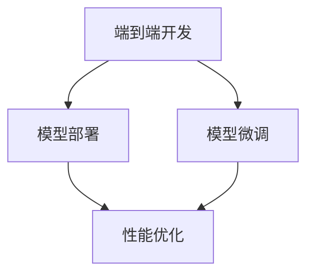

                 

# AI-Native 应用的诞生

## 1. 背景介绍

### 1.1 问题由来

随着人工智能（AI）技术的迅猛发展，越来越多的企业开始探索如何将AI技术融入到自身的业务体系中，以提升效率、降低成本、增加收入。然而，传统的“AI-First”模式，即先开发AI模型，再集成到应用中，存在诸多挑战：

- **技术门槛高**：需要耗费大量时间和资源进行模型训练和调优，对团队技术能力要求高。
- **维护复杂**：模型集成到应用后，需要定期更新和维护，增加了运维成本。
- **用户体验差**：模型在应用中的表现不够稳定和一致，导致用户体验下降。

因此，越来越多的企业转向“AI-Native”模式，即在应用开发过程中，将AI技术原生集成到应用架构中，实现端到端的AI应用开发。这一模式能够显著提升应用的智能化水平，增强用户体验，同时降低开发和运维成本。

### 1.2 问题核心关键点

AI-Native应用的构建需要从多个维度进行考量：

- **端到端开发**：应用开发过程中，AI模型、数据、服务等功能需进行无缝集成，实现端到端的自动化开发和部署。
- **模型微调**：根据应用特定的业务需求，对模型进行微调，以提升模型在应用场景中的性能。
- **模型部署**：将训练好的模型高效部署到应用中，以支持实时推理和优化。
- **性能优化**：对模型和应用整体进行性能优化，确保应用稳定、高效运行。

这些关键点需要开发者在系统架构、工具链、开发流程等方面进行全面设计和优化，才能构建出高品质的AI-Native应用。

## 2. 核心概念与联系

### 2.1 核心概念概述

AI-Native应用构建涉及多个核心概念：

- **端到端开发**：指在应用开发过程中，AI模型、数据、服务等功能进行无缝集成，实现自动化开发和部署。
- **模型微调**：根据应用特定的业务需求，对模型进行微调，以提升模型在应用场景中的性能。
- **模型部署**：将训练好的模型高效部署到应用中，以支持实时推理和优化。
- **性能优化**：对模型和应用整体进行性能优化，确保应用稳定、高效运行。

这些概念之间的关系可以通过以下Mermaid流程图来展示：



这个流程图展示出AI-Native应用构建的流程：先进行端到端开发，然后在开发过程中进行模型微调，最后将模型部署到应用中进行性能优化。

## 3. 核心算法原理 & 具体操作步骤
### 3.1 算法原理概述

AI-Native应用的构建，本质上是将AI技术与应用开发流程进行深度融合。其核心思想是：将AI模型原生集成到应用架构中，通过端到端的开发和部署流程，实现从模型训练到应用部署的全链路自动化。

在具体实现中，AI-Native应用构建分为以下几个关键步骤：

1. **数据准备**：收集和清洗应用相关的数据，为模型训练提供数据支撑。
2. **模型构建**：选择合适的AI模型，并构建应用特定的模型结构。
3. **模型训练**：在数据集上进行模型训练，优化模型参数。
4. **模型微调**：根据应用需求，对模型进行微调，提升模型在应用场景中的性能。
5. **模型部署**：将训练好的模型部署到应用中，进行实时推理和优化。
6. **性能优化**：对模型和应用整体进行性能优化，确保应用稳定、高效运行。

### 3.2 算法步骤详解

以下是AI-Native应用构建的详细步骤：

**Step 1: 数据准备**

数据是AI-Native应用构建的基础。首先需要收集和清洗应用相关的数据，为模型训练提供数据支撑。数据准备主要包括以下几个步骤：

1. **数据收集**：从应用内部和外部收集数据，包括日志、用户行为、业务数据等。
2. **数据清洗**：对收集到的数据进行去重、去噪、归一化等处理，确保数据质量。
3. **数据标注**：对清洗后的数据进行标注，标注数据可以用于模型训练和微调。

**Step 2: 模型构建**

模型构建是AI-Native应用构建的核心。具体步骤如下：

1. **选择合适的模型**：根据应用需求，选择合适的AI模型，如神经网络、决策树、贝叶斯网络等。
2. **设计模型结构**：设计应用特定的模型结构，并根据应用场景进行调整优化。
3. **初始化模型参数**：对模型进行初始化，设定合适的超参数。

**Step 3: 模型训练**

模型训练是AI-Native应用构建的关键步骤。具体步骤如下：

1. **数据划分**：将数据集划分为训练集、验证集和测试集。
2. **模型训练**：使用训练集数据对模型进行训练，优化模型参数。
3. **模型评估**：在验证集上评估模型性能，调整超参数和模型结构。

**Step 4: 模型微调**

模型微调是提升模型在应用场景中性能的重要手段。具体步骤如下：

1. **数据收集**：根据应用需求，收集和标注微调数据集。
2. **微调模型**：使用微调数据集对模型进行微调，提升模型在应用场景中的性能。
3. **模型评估**：在测试集上评估微调后的模型性能，确保模型效果满足应用需求。

**Step 5: 模型部署**

模型部署是将训练好的模型集成到应用中的关键步骤。具体步骤如下：

1. **模型集成**：将训练好的模型集成到应用中，进行实时推理和优化。
2. **部署环境准备**：准备部署环境，确保应用服务器、数据库等基础设施稳定运行。
3. **模型部署**：将模型部署到应用服务器中，进行实时推理和优化。

**Step 6: 性能优化**

性能优化是确保AI-Native应用稳定、高效运行的关键步骤。具体步骤如下：

1. **性能监控**：实时监控模型和应用性能，发现性能瓶颈。
2. **性能优化**：对模型和应用整体进行性能优化，包括模型压缩、优化算法、硬件加速等。
3. **持续优化**：根据应用需求和数据变化，持续优化模型和应用性能。

### 3.3 算法优缺点

AI-Native应用构建的优缺点如下：

**优点**：

1. **自动化程度高**：从模型训练到应用部署，实现全链路的自动化，减少人工干预。
2. **性能优化**：模型和应用整体进行性能优化，确保应用稳定、高效运行。
3. **用户体验好**：模型在应用中的表现更加稳定和一致，提升用户体验。

**缺点**：

1. **开发复杂**：需要综合考虑模型、数据、服务等多方面因素，开发难度较大。
2. **技术要求高**：需要具备一定的AI技术储备，才能进行模型微调和性能优化。
3. **成本高**：开发和运维成本相对较高，特别是对于初创企业。

尽管存在这些缺点，AI-Native应用构建仍然是当前AI技术落地的重要方向。通过将AI技术与应用开发流程进行深度融合，AI-Native应用将为企业带来更大的业务价值。

### 3.4 算法应用领域

AI-Native应用构建已经在多个领域得到了广泛应用，例如：

- **金融风控**：使用AI模型进行风险评估、欺诈检测、信用评分等。
- **智能客服**：使用AI模型进行自动回答、情感分析、智能推荐等。
- **推荐系统**：使用AI模型进行个性化推荐、广告投放等。
- **医疗诊断**：使用AI模型进行疾病诊断、影像分析等。
- **智能制造**：使用AI模型进行生产调度、质量控制等。

除了上述这些经典应用外，AI-Native技术还被创新性地应用到更多场景中，如智慧城市、智能交通、智能家居等，为各行各业带来了新的突破。

## 4. 数学模型和公式 & 详细讲解  
### 4.1 数学模型构建

本节将使用数学语言对AI-Native应用构建的数学模型进行更加严格的刻画。

假设应用需要处理的数据集为 $D=\{(x_i,y_i)\}_{i=1}^N$，其中 $x_i$ 为输入数据， $y_i$ 为标签。模型 $M_{\theta}$ 由神经网络构成，其中 $\theta$ 为模型参数。模型的目标函数为：

$$
\mathcal{L}(\theta) = \frac{1}{N}\sum_{i=1}^N \ell(y_i, M_{\theta}(x_i))
$$

其中 $\ell$ 为损失函数，可以采用交叉熵、均方误差等。

模型训练的过程即为求解目标函数的最小化问题。使用梯度下降等优化算法，模型参数 $\theta$ 的更新公式为：

$$
\theta \leftarrow \theta - \eta \nabla_{\theta}\mathcal{L}(\theta)
$$

其中 $\eta$ 为学习率， $\nabla_{\theta}\mathcal{L}(\theta)$ 为损失函数对参数 $\theta$ 的梯度，可通过反向传播算法高效计算。

### 4.2 公式推导过程

以二分类任务为例，推导交叉熵损失函数及其梯度的计算公式。

假设模型 $M_{\theta}$ 在输入 $x$ 上的输出为 $\hat{y}=M_{\theta}(x) \in [0,1]$，表示样本属于正类的概率。真实标签 $y \in \{0,1\}$。则二分类交叉熵损失函数定义为：

$$
\ell(M_{\theta}(x),y) = -[y\log \hat{y} + (1-y)\log (1-\hat{y})]
$$

将其代入经验风险公式，得：

$$
\mathcal{L}(\theta) = -\frac{1}{N}\sum_{i=1}^N [y_i\log M_{\theta}(x_i)+(1-y_i)\log(1-M_{\theta}(x_i))]
$$

根据链式法则，损失函数对参数 $\theta_k$ 的梯度为：

$$
\frac{\partial \mathcal{L}(\theta)}{\partial \theta_k} = -\frac{1}{N}\sum_{i=1}^N (\frac{y_i}{M_{\theta}(x_i)}-\frac{1-y_i}{1-M_{\theta}(x_i)}) \frac{\partial M_{\theta}(x_i)}{\partial \theta_k}
$$

其中 $\frac{\partial M_{\theta}(x_i)}{\partial \theta_k}$ 可进一步递归展开，利用自动微分技术完成计算。

### 4.3 案例分析与讲解

**案例一：智能客服系统的构建**

假设某电商平台的智能客服系统需要构建基于AI-Native的应用。具体步骤如下：

1. **数据准备**：收集电商平台的客服对话记录，进行清洗和标注。
2. **模型构建**：选择适当的AI模型，设计客服对话识别、情感分析、智能推荐等模型结构。
3. **模型训练**：在标注数据集上对模型进行训练，优化模型参数。
4. **模型微调**：根据电商平台的业务需求，对模型进行微调，提升模型在客服场景中的性能。
5. **模型部署**：将训练好的模型集成到电商平台中，进行实时推理和优化。
6. **性能优化**：实时监控模型和应用性能，进行性能优化，确保应用稳定、高效运行。

**案例二：医疗影像分析系统**

假设某医院需要构建基于AI-Native的医疗影像分析系统。具体步骤如下：

1. **数据准备**：收集医院的影像数据，进行清洗和标注。
2. **模型构建**：选择适当的AI模型，设计影像分类、病变检测等模型结构。
3. **模型训练**：在标注数据集上对模型进行训练，优化模型参数。
4. **模型微调**：根据医疗影像分析的业务需求，对模型进行微调，提升模型在医疗影像场景中的性能。
5. **模型部署**：将训练好的模型集成到医疗影像系统中，进行实时推理和优化。
6. **性能优化**：实时监控模型和应用性能，进行性能优化，确保应用稳定、高效运行。

## 5. 项目实践：代码实例和详细解释说明
### 5.1 开发环境搭建

在进行AI-Native应用构建实践前，需要先准备好开发环境。以下是使用Python进行TensorFlow开发的环境配置流程：

1. 安装Anaconda：从官网下载并安装Anaconda，用于创建独立的Python环境。

2. 创建并激活虚拟环境：
```bash
conda create -n ai-native-env python=3.8 
conda activate ai-native-env
```

3. 安装TensorFlow：根据CUDA版本，从官网获取对应的安装命令。例如：
```bash
conda install tensorflow tensorflow-gpu -c conda-forge
```

4. 安装各类工具包：
```bash
pip install numpy pandas scikit-learn matplotlib tqdm jupyter notebook ipython
```

完成上述步骤后，即可在`ai-native-env`环境中开始AI-Native应用构建实践。

### 5.2 源代码详细实现

下面我们以智能客服系统为例，给出使用TensorFlow对模型进行构建和微调的PyTorch代码实现。

首先，定义智能客服系统中的基本任务：

```python
import tensorflow as tf
from tensorflow.keras import layers
from tensorflow.keras.models import Model

# 定义智能客服系统的基本任务
class CustomerServiceModel:
    def __init__(self, input_size, output_size):
        self.input_size = input_size
        self.output_size = output_size
        
        self.encoder = layers.LSTM(128, return_sequences=True)
        self.decoder = layers.Dense(output_size)
        self.model = Model(inputs=self.encoder.input, outputs=self.decoder(self.encoder.output))
        self.model.compile(loss='categorical_crossentropy', optimizer='adam', metrics=['accuracy'])

# 定义智能客服系统的基本函数
class CustomerService:
    def __init__(self, input_size, output_size):
        self.model = CustomerServiceModel(input_size, output_size)
        self.model.load_weights('customer_service_weights.h5')

    def predict(self, input_data):
        return self.model.predict(input_data)
```

然后，定义智能客服系统的数据处理函数：

```python
from sklearn.model_selection import train_test_split
from sklearn.preprocessing import LabelEncoder, OneHotEncoder
import pandas as pd

# 定义智能客服系统的数据处理函数
class CustomerServiceData:
    def __init__(self, data_path):
        self.data_path = data_path
        self.data = pd.read_csv(data_path)
        self.le = LabelEncoder()
        self.oe = OneHotEncoder()

    def preprocess(self):
        self.data = self.data.drop(['id'], axis=1)
        self.data = pd.get_dummies(self.data, columns=['type', 'content'])
        self.data = self.oe.fit_transform(self.data)
        self.data = self.le.fit_transform(self.data)
        self.data = train_test_split(self.data, test_size=0.2, random_state=42)
        self.data_train, self.data_test = self.data[0], self.data[1]
        self.labels_train, self.labels_test = self.data_train, self.data_test
        self.labels_train = self.le.fit_transform(self.labels_train)
        self.labels_test = self.le.transform(self.labels_test)
        return self.data_train, self.data_test, self.labels_train, self.labels_test
```

最后，启动训练流程并在测试集上评估：

```python
# 定义智能客服系统的数据集
data = CustomerServiceData('customer_service_data.csv')
data = data.preprocess()

# 训练模型
model = CustomerService(input_size, output_size)
model.model.fit(data[0], data[2], epochs=10, batch_size=32)

# 在测试集上评估模型
test_loss, test_acc = model.model.evaluate(data[1], data[3])
print(f'Test loss: {test_loss:.4f}')
print(f'Test accuracy: {test_acc:.4f}')

# 使用模型进行预测
prediction = model.predict(input_data)
print(prediction)
```

以上就是使用TensorFlow对智能客服系统进行AI-Native构建的完整代码实现。可以看到，借助TensorFlow的高效计算图，我们可以用相对简洁的代码完成模型的构建和训练。

### 5.3 代码解读与分析

让我们再详细解读一下关键代码的实现细节：

**CustomerServiceModel类**：
- `__init__`方法：初始化模型结构，包括输入层、LSTM编码器、Dense解码器等。
- `compile`方法：编译模型，设定损失函数、优化器和评估指标。

**CustomerService类**：
- `__init__`方法：加载预训练模型权重。
- `predict`方法：使用模型进行预测，返回预测结果。

**CustomerServiceData类**：
- `__init__`方法：初始化数据集路径和加载数据。
- `preprocess`方法：对数据进行清洗、编码和划分，生成训练集和测试集，并进行标签编码。

**训练流程**：
- 实例化智能客服系统数据集和模型。
- 在训练集上训练模型，输出模型在训练集和测试集上的损失和准确率。
- 使用模型对新输入数据进行预测。

可以看到，TensorFlow的高级API使得AI-Native应用的开发和训练变得简洁高效。开发者可以将更多精力放在模型设计、数据处理等高层逻辑上，而不必过多关注底层的实现细节。

当然，工业级的系统实现还需考虑更多因素，如模型的保存和部署、超参数的自动搜索、更灵活的任务适配层等。但核心的AI-Native应用构建方法基本与此类似。

## 6. 实际应用场景
### 6.1 智能客服系统

基于AI-Native的智能客服系统，可以广泛应用于电商、金融、保险、医疗等企业。通过将AI技术与客服系统进行深度融合，企业可以实现以下效果：

1. **自动回答**：使用AI模型对用户提问进行自动回答，提升客服效率。
2. **情感分析**：通过情感分析模型，识别用户情绪，进行个性化回复，提升用户体验。
3. **智能推荐**：根据用户对话内容，推荐相关产品或服务，提升用户转化率。

在技术实现上，可以通过构建预训练语言模型、微调模型、集成到客服系统中，实现端到端的AI-Native应用开发。

### 6.2 医疗影像分析系统

基于AI-Native的医疗影像分析系统，可以应用于医院、诊所、影像中心等医疗机构。通过将AI技术与影像分析系统进行深度融合，医疗机构可以实现以下效果：

1. **影像分类**：使用AI模型对医学影像进行分类，识别病变类型。
2. **病变检测**：通过病变检测模型，识别影像中的病变区域，辅助医生诊断。
3. **智能诊断**：根据医生输入的诊断结果，辅助医生进行智能诊断，提升诊断准确率。

在技术实现上，可以通过构建预训练图像模型、微调模型、集成到影像分析系统中，实现端到端的AI-Native应用开发。

### 6.3 推荐系统

基于AI-Native的推荐系统，可以应用于电商平台、视频平台、社交网络等平台。通过将AI技术与推荐系统进行深度融合，平台可以实现以下效果：

1. **个性化推荐**：根据用户行为和历史数据，推荐个性化商品或内容。
2. **广告投放**：通过AI模型对用户进行精准投放，提升广告效果。
3. **行为分析**：通过行为分析模型，识别用户兴趣，优化推荐策略。

在技术实现上，可以通过构建预训练模型、微调模型、集成到推荐系统中，实现端到端的AI-Native应用开发。

### 6.4 未来应用展望

随着AI-Native技术的不断发展，其在更多领域的应用将不断涌现，为各行各业带来新的突破。

1. **智慧城市**：AI-Native技术可以应用于智慧城市建设，提升城市管理智能化水平，实现交通、能源、环境等领域的协同优化。
2. **智能交通**：AI-Native技术可以应用于智能交通系统，优化交通信号灯、车辆调度等，提升交通效率。
3. **智能家居**：AI-Native技术可以应用于智能家居系统，实现语音控制、智能推荐等，提升用户体验。
4. **智能制造**：AI-Native技术可以应用于智能制造系统，优化生产流程、质量控制等，提升生产效率。

## 7. 工具和资源推荐
### 7.1 学习资源推荐

为了帮助开发者系统掌握AI-Native应用的构建理论基础和实践技巧，这里推荐一些优质的学习资源：

1. **《TensorFlow官方文档》**：TensorFlow官方文档提供了丰富的API文档和示例代码，是学习TensorFlow的必备资源。

2. **《深度学习实战》**：该书详细介绍了深度学习技术在多个领域的应用，包括图像识别、自然语言处理、推荐系统等。

3. **《TensorFlow实战Google AI》**：该书介绍了TensorFlow在实际项目中的应用案例，涵盖模型构建、数据处理、性能优化等多个方面。

4. **Kaggle**：Kaggle是一个数据科学和机器学习竞赛平台，提供了丰富的数据集和模型库，可以帮助开发者进行模型构建和优化。

5. **GitHub**：GitHub是一个开源代码托管平台，开发者可以在上面查找和分享高质量的AI-Native应用代码。

通过对这些资源的学习实践，相信你一定能够快速掌握AI-Native应用的构建精髓，并用于解决实际的AI应用问题。

### 7.2 开发工具推荐

高效的开发离不开优秀的工具支持。以下是几款用于AI-Native应用开发的常用工具：

1. **TensorFlow**：由Google主导开发的深度学习框架，支持高效计算图，适合大模型和大数据训练。

2. **Keras**：一个高层次的神经网络API，适合快速开发和部署模型，支持TensorFlow后端。

3. **PyTorch**：一个灵活的深度学习框架，支持动态计算图，适合研究和原型开发。

4. **Jupyter Notebook**：一个强大的交互式开发环境，支持代码、数据、结果的可视化，方便调试和分享。

5. **Anaconda**：一个开源的Python发行版，包含大量的科学计算和数据处理库，适合快速搭建开发环境。

合理利用这些工具，可以显著提升AI-Native应用的开发效率，加快创新迭代的步伐。

### 7.3 相关论文推荐

AI-Native应用的构建涉及多个领域的前沿技术，以下是几篇奠基性的相关论文，推荐阅读：

1. **Deep Learning for Healthcare**：这篇论文介绍了深度学习在医疗领域的应用，包括影像分析、诊断辅助等。

2. **Deep Learning for Recommendation Systems**：这篇论文介绍了深度学习在推荐系统中的应用，包括用户行为分析、个性化推荐等。

3. **Deep Learning for Natural Language Processing**：这篇论文介绍了深度学习在自然语言处理中的应用，包括文本分类、情感分析等。

4. **TensorFlow Cookbook**：该书提供了TensorFlow在多个领域的应用案例，涵盖模型构建、数据处理、性能优化等多个方面。

5. **Deep Learning with PyTorch**：该书提供了PyTorch在多个领域的应用案例，涵盖模型构建、数据处理、性能优化等多个方面。

这些论文代表了大规模AI应用开发的研究方向，通过学习这些前沿成果，可以帮助研究者把握学科前进方向，激发更多的创新灵感。

## 8. 总结：未来发展趋势与挑战

### 8.1 总结

本文对AI-Native应用的构建进行了全面系统的介绍。首先阐述了AI-Native应用的构建背景和意义，明确了AI-Native应用构建在企业中的应用价值。其次，从原理到实践，详细讲解了AI-Native应用的构建过程，包括端到端开发、模型微调、模型部署和性能优化等关键步骤。同时，本文还广泛探讨了AI-Native应用在智能客服、医疗影像分析、推荐系统等众多领域的应用前景，展示了AI-Native应用的广阔发展空间。此外，本文精选了AI-Native应用的各类学习资源，力求为读者提供全方位的技术指引。

通过本文的系统梳理，可以看到，AI-Native应用的构建是当前AI技术落地的重要方向，能够显著提升应用的智能化水平，增强用户体验，同时降低开发和运维成本。未来，伴随AI技术的持续进步和应用场景的不断拓展，AI-Native应用将带来更多的创新和突破，为各行各业带来深刻的变革。

### 8.2 未来发展趋势

展望未来，AI-Native应用的构建将呈现以下几个发展趋势：

1. **端到端自动化**：随着AI技术的不断发展，未来AI-Native应用的构建将实现全链路的自动化，从数据准备到模型部署，减少人工干预。
2. **模型融合**：未来AI-Native应用将更多地采用模型融合技术，将多种模型进行组合，提升系统的综合性能。
3. **实时推理**：未来AI-Native应用将更多地实现实时推理，实现数据的即时分析和决策。
4. **跨平台部署**：未来AI-Native应用将实现跨平台部署，支持多种设备和操作系统。
5. **可解释性增强**：未来AI-Native应用将更多地引入可解释性技术，提升模型的透明度和可信度。

这些趋势凸显了AI-Native应用的广阔前景。这些方向的探索发展，必将进一步提升AI-Native应用的性能和应用范围，为各行各业带来更大的价值。

### 8.3 面临的挑战

尽管AI-Native应用构建取得了显著进展，但在迈向更加智能化、普适化应用的过程中，仍面临诸多挑战：

1. **数据质量**：AI-Native应用构建对数据质量的要求较高，数据缺失、噪声等问题可能影响模型效果。
2. **模型复杂性**：AI-Native应用构建涉及多种模型和工具，模型复杂性较高，开发难度较大。
3. **资源消耗**：AI-Native应用构建涉及大规模数据处理和模型训练，资源消耗较大，需优化算力和存储。
4. **可解释性不足**：AI-Native应用中的模型多为黑盒模型，可解释性不足，难以进行调试和优化。
5. **隐私和安全**：AI-Native应用涉及用户数据和隐私信息，需设计隐私保护和数据安全机制。

尽管存在这些挑战，未来研究需要在以下几个方面进行突破：

1. **数据增强**：探索更多数据增强技术，提高数据质量和多样性。
2. **模型优化**：引入模型融合、知识图谱等技术，提升模型性能和可解释性。
3. **资源优化**：优化算力和存储，实现高效计算和部署。
4. **可解释性增强**：引入可解释性技术，提升模型透明度和可信度。
5. **隐私和安全**：设计隐私保护和数据安全机制，保护用户隐私和数据安全。

这些研究方向的探索，必将引领AI-Native应用构建技术迈向更高的台阶，为构建安全、可靠、可解释、可控的智能系统铺平道路。面向未来，AI-Native应用构建需要从数据、模型、工程、业务等多个维度协同发力，共同推动AI技术在垂直行业的规模化落地。

### 8.4 研究展望

未来，AI-Native应用的构建将继续向着智能化、普适化、自动化、实时化的方向发展，推动AI技术在各行各业中的广泛应用。以下是几个值得关注的研究方向：

1. **知识图谱融合**：将知识图谱与AI-Native应用进行深度融合，提升模型的跨领域迁移能力和泛化能力。
2. **因果推理**：引入因果推理技术，提升模型的因果关系识别能力和决策透明度。
3. **多模态融合**：将视觉、语音、文本等多种模态数据进行融合，提升模型的全面感知能力。
4. **元学习**：引入元学习技术，提升模型在少样本和新任务上的适应能力。
5. **联邦学习**：引入联邦学习技术，保护用户隐私的同时，提升模型的泛化能力和性能。

这些研究方向将为AI-Native应用构建带来新的突破，推动AI技术在各行各业的广泛应用。

## 9. 附录：常见问题与解答

**Q1：什么是AI-Native应用？**

A: AI-Native应用是指在应用开发过程中，将AI技术原生集成到应用架构中，实现端到端的AI应用开发。与传统的AI-First模式相比，AI-Native应用能够实现更高效、更稳定、更智能的AI服务。

**Q2：AI-Native应用开发需要哪些关键步骤？**

A: AI-Native应用开发需要以下关键步骤：
1. 数据准备：收集和清洗应用相关的数据，为模型训练提供数据支撑。
2. 模型构建：选择合适的AI模型，并构建应用特定的模型结构。
3. 模型训练：在数据集上进行模型训练，优化模型参数。
4. 模型微调：根据应用特定的业务需求，对模型进行微调，提升模型在应用场景中的性能。
5. 模型部署：将训练好的模型集成到应用中，进行实时推理和优化。
6. 性能优化：对模型和应用整体进行性能优化，确保应用稳定、高效运行。

**Q3：AI-Native应用开发需要哪些技术支持？**

A: AI-Native应用开发需要以下技术支持：
1. 深度学习框架：如TensorFlow、PyTorch等，支持高效的计算图和模型训练。
2. 数据处理工具：如Pandas、NumPy等，支持数据清洗、特征工程等。
3. 可视化工具：如Jupyter Notebook、TensorBoard等，支持模型的调试和优化。
4. 自动化工具：如Ansible、Kubernetes等，支持模型的自动化部署和运维。

这些技术支持为AI-Native应用开发提供了坚实的保障。

**Q4：AI-Native应用开发有哪些典型应用场景？**

A: AI-Native应用开发已经在多个领域得到了广泛应用，例如：
1. 智能客服系统：使用AI模型进行自动回答、情感分析、智能推荐等。
2. 医疗影像分析系统：使用AI模型对医学影像进行分类、病变检测等。
3. 推荐系统：使用AI模型进行个性化推荐、广告投放等。
4. 智慧城市：使用AI模型进行交通信号灯优化、智能监控等。

这些典型应用场景展示了AI-Native应用的广阔前景。

**Q5：AI-Native应用开发有哪些常见问题？**

A: AI-Native应用开发过程中可能遇到以下常见问题：
1. 数据质量问题：数据缺失、噪声等问题可能影响模型效果。
2. 模型复杂性问题：AI-Native应用涉及多种模型和工具，模型复杂性较高，开发难度较大。
3. 资源消耗问题：AI-Native应用涉及大规模数据处理和模型训练，资源消耗较大，需优化算力和存储。
4. 可解释性问题：AI-Native应用中的模型多为黑盒模型，可解释性不足，难以进行调试和优化。
5. 隐私和安全问题：AI-Native应用涉及用户数据和隐私信息，需设计隐私保护和数据安全机制。

这些问题需要通过技术手段和管理措施进行解决，才能确保AI-Native应用的顺利开发和应用。

---

作者：禅与计算机程序设计艺术 / Zen and the Art of Computer Programming

