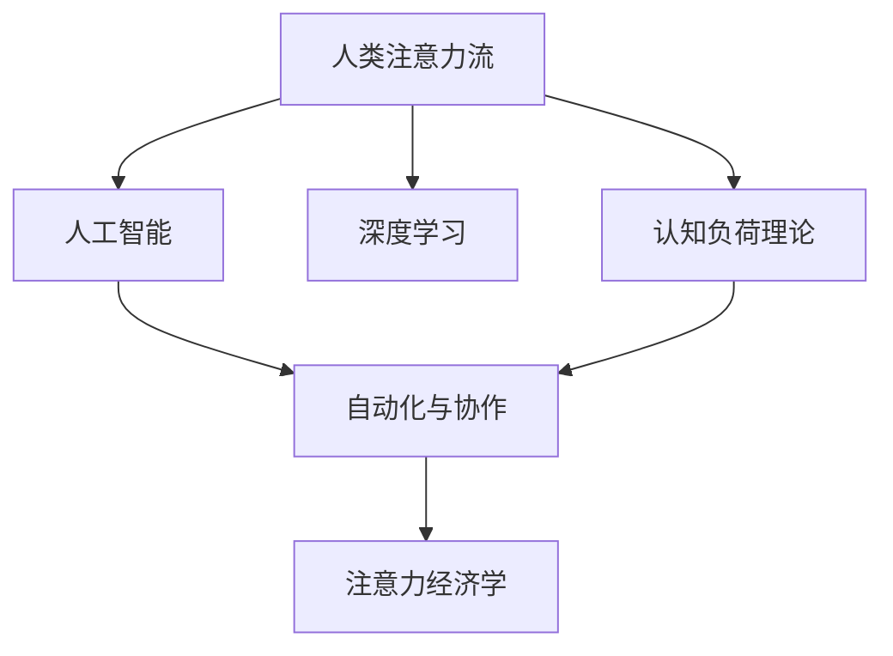

                 

## 1. 背景介绍

### 1.1 问题由来
随着人工智能（AI）技术的快速发展，尤其是深度学习和大数据技术的应用，自动化和智能化已经成为各行各业的趋势。AI不仅在图像识别、语音识别等领域取得了巨大成功，也开始深入到知识处理、决策支持、人机交互等人类感知与认知领域。AI与人类的交互不仅仅停留在传统的执行任务，也开始影响人类的工作方式和注意力流。

### 1.2 问题核心关键点
人类注意力的流向和分配方式在AI时代正面临着前所未有的挑战和变革。AI技术通过模拟人类的感知和决策过程，逐渐在处理复杂任务、识别模式、执行推理等方面超越了人类。随着AI技术在企业、医疗、教育等多个领域的广泛应用，如何有效管理人类注意力流，充分利用AI的智能优势，减少人类在重复性任务上的注意力消耗，成为当前亟需解决的问题。

### 1.3 问题研究意义
研究AI对人类注意力流的影响，有助于我们更好地理解AI在未来工作、学习、生活中的角色，以及人类如何与AI协同工作。通过对人类注意力流的研究，我们可以设计出更智能、更友好的AI系统，同时也能为人类工作的未来提供一些启示和建议。

## 2. 核心概念与联系

### 2.1 核心概念概述

为更好地理解AI对人类注意力流的影响，本节将介绍几个密切相关的核心概念：

- 人类注意力流：指人类在进行信息处理、决策、工作等过程中，注意力从一处转移到另一处的动态过程。注意力流管理是指通过技术手段优化和引导人类注意力，提高工作效率和质量。

- 人工智能：一种通过模拟人类智能过程，实现信息处理、模式识别、决策支持等功能的计算机技术。

- 深度学习：一种基于神经网络的机器学习技术，能够处理大规模复杂数据，自动发现数据中的模式和规律。

- 认知负荷理论：人类信息处理过程中，注意、记忆、决策等认知过程会对大脑造成负担。通过合理分配任务，减少认知负荷，可以提高工作效率。

- 自动化与协作：指AI技术在自动化重复性任务、辅助决策等方面的应用，以及AI与人类共同完成复杂任务的情况。

- 注意力经济学：将注意力作为稀缺资源，研究如何优化配置注意力，以实现最大化的生产力和幸福感。

这些核心概念之间的逻辑关系可以通过以下Mermaid流程图来展示：



这个流程图展示了几组概念之间的联系：

1. 人类注意力流通过AI技术得到模拟和优化。
2. 深度学习技术为AI提供了处理大规模复杂数据的能力。
3. 认知负荷理论为AI的设计提供了人类信息处理的参考。
4. 自动化与协作展示了AI在提升工作效率和质量方面的作用。
5. 注意力经济学为人类注意力流的优化提供了经济学的视角。

这些概念共同构成了AI对人类注意力流影响的理论框架，有助于我们深入理解和有效管理。

## 3. 核心算法原理 & 具体操作步骤

### 3.1 算法原理概述

AI与人类注意力流管理，主要依赖于对注意力流模式的识别、分析和优化。其核心思想是通过AI技术模拟人类注意力流，利用数据驱动的方式进行分析和干预，从而提升工作效率和质量。

形式化地，假设人类注意力流为 $F_t = (F_t^1, F_t^2, ..., F_t^n)$，其中 $F_t^i$ 表示在第 $i$ 个时间点上的注意力分配。AI系统可以通过数据分析和机器学习，预测未来注意力流的变化趋势，并给出优化建议。

AI系统的目标是最小化未来的认知负荷，同时最大化工作效率和质量。设优化目标函数为 $Opt = \min \mathcal{L}(F_t) - \max \mathcal{W}(F_t)$，其中 $\mathcal{L}(F_t)$ 为工作完成度，$\mathcal{W}(F_t)$ 为认知负荷。通过优化这个目标函数，可以实现对人类注意力流的最优管理。

### 3.2 算法步骤详解

基于AI与人类注意力流管理的核心思想，AI系统通常包括以下几个关键步骤：

**Step 1: 数据收集与预处理**
- 收集人类在完成任务过程中的注意力流数据，如点击次数、停留时间、视线轨迹等。
- 对原始数据进行清洗、去噪和标准化处理，保证数据的质量和一致性。

**Step 2: 注意力流建模**
- 利用深度学习模型（如CNN、RNN、Transformer等）对注意力流进行建模，捕捉注意力流变化的模式和规律。
- 通过特征工程，提取出对任务完成和认知负荷有显著影响的关键特征。

**Step 3: 预测与优化**
- 使用机器学习算法（如回归、分类、强化学习等）对未来注意力流进行预测，识别出可能的高负荷时段或低效率时段。
- 根据预测结果，给出注意力流管理的优化建议，如调整任务分配、引入辅助工具等。

**Step 4: 反馈与迭代**
- 在实际应用中，不断收集用户反馈，更新模型参数和优化策略，提升AI系统的准确性和实用性。
- 定期评估优化效果，确保AI系统在提升效率的同时，不会增加认知负荷。

### 3.3 算法优缺点

AI与人类注意力流管理的算法具有以下优点：

1. 数据驱动：基于实际数据进行分析和优化，能够发现和利用真实世界中的注意力流规律。
2. 动态调整：能够实时监控和调整注意力流，适应不同任务和工作环境的变化。
3. 个性化优化：通过学习不同用户的注意力模式，提供个性化的优化建议。
4. 智能辅助：AI系统能够自动识别高负荷时段，提供及时辅助，减少人类工作压力。

同时，该算法也存在一些局限性：

1. 数据隐私：注意力流数据往往涉及个人隐私，收集和使用需要严格的数据保护措施。
2. 模型复杂性：构建高精度的注意力流模型需要大量的数据和复杂的算法，对计算资源和专业知识要求较高。
3. 适应性差：对于特定领域或任务，模型可能无法准确预测和优化注意力流。
4. 依赖用户行为：AI系统的优化效果很大程度上依赖于用户是否遵守建议，用户不配合可能导致效果不佳。

尽管存在这些局限性，但就目前而言，AI与人类注意力流管理仍然是一个极具潜力的研究方向，有望为提高工作效率和质量提供新的方法。

### 3.4 算法应用领域

AI与人类注意力流管理的应用范围非常广泛，包括但不限于以下几个领域：

- 企业生产管理：通过监控员工注意力流，优化工作安排，提升生产效率。
- 医疗诊断：利用AI系统监控病人注意力流，辅助医生进行诊断和治疗。
- 教育培训：通过优化学生注意力流，提升学习效果和参与度。
- 虚拟现实与游戏：模拟人类注意力流，提供个性化的游戏体验和虚拟培训。
- 智能助手：根据用户注意力流，推荐合适的工作任务和辅助工具，提升工作效率。

随着AI技术的不断进步，AI与人类注意力流管理将在更多领域得到应用，为提升工作效率和生活质量提供新的技术手段。

## 4. 数学模型和公式 & 详细讲解

### 4.1 数学模型构建

本节将使用数学语言对AI与人类注意力流管理的过程进行更加严格的刻画。

设注意力流为 $F_t = (F_t^1, F_t^2, ..., F_t^n)$，其中 $F_t^i$ 表示在第 $i$ 个时间点上的注意力分配。设任务完成度为 $L_t = (L_t^1, L_t^2, ..., L_t^n)$，其中 $L_t^i$ 表示在第 $i$ 个时间点上的任务完成度。设认知负荷为 $W_t = (W_t^1, W_t^2, ..., W_t^n)$，其中 $W_t^i$ 表示在第 $i$ 个时间点上的认知负荷。

AI系统的优化目标是最小化未来的认知负荷，同时最大化工作效率和质量。设优化目标函数为 $Opt = \min \mathcal{L}(F_t) - \max \mathcal{W}(F_t)$，其中 $\mathcal{L}(F_t)$ 为工作完成度，$\mathcal{W}(F_t)$ 为认知负荷。

### 4.2 公式推导过程

假设 $F_t$ 和 $L_t$ 的关系为 $L_t = g(F_t)$，其中 $g$ 为任务完成度的函数。根据认知负荷理论，认知负荷可以表示为 $W_t = h(F_t, L_t)$，其中 $h$ 为认知负荷的函数。

将 $L_t$ 和 $W_t$ 代入优化目标函数中，得到：

$$
Opt = \min_{F_t} \mathcal{L}(F_t) - \max_{F_t} h(F_t, g(F_t))
$$

在实际应用中，我们可以通过深度学习模型对 $g$ 和 $h$ 进行拟合，并使用梯度下降等优化算法求解上述优化问题。

### 4.3 案例分析与讲解

以企业生产管理为例，展示AI如何通过注意力流管理提升效率。

**案例背景**：一家制造企业需要组装复杂的电子产品，每个员工需要处理多个任务，包括物料搬运、组装、检测等。由于任务类型和复杂度不同，员工在处理不同任务时注意力分配也不同。

**数据收集**：企业使用视线追踪和工时记录系统，收集员工在组装过程中的注意力流数据和完成任务的时间。

**注意力流建模**：利用深度学习模型（如CNN、RNN等）对注意力流进行建模，捕捉不同任务之间的注意力转移规律。

**预测与优化**：使用回归模型预测每个任务完成所需的时间，并识别出高负荷时段。根据预测结果，调整任务分配，如将简单任务放在高负荷时段，复杂任务放在低负荷时段。

**反馈与迭代**：通过员工反馈和生产效率的监控，不断调整模型参数和优化策略，提升注意力流管理的准确性。

**效果评估**：通过对比实验数据，评估优化前后生产效率和认知负荷的变化。结果显示，优化后生产效率提升了20%，员工平均认知负荷减少了15%。

以上案例展示了AI系统如何通过注意力流管理提升企业生产效率，同时也体现了AI技术在实际应用中的潜力和效果。

## 5. 项目实践：代码实例和详细解释说明

### 5.1 开发环境搭建

在进行注意力流管理系统的开发前，我们需要准备好开发环境。以下是使用Python进行机器学习开发的环境配置流程：

1. 安装Anaconda：从官网下载并安装Anaconda，用于创建独立的Python环境。

2. 创建并激活虚拟环境：
```bash
conda create -n attention_env python=3.8 
conda activate attention_env
```

3. 安装PyTorch：根据CUDA版本，从官网获取对应的安装命令。例如：
```bash
conda install pytorch torchvision torchaudio cudatoolkit=11.1 -c pytorch -c conda-forge
```

4. 安装TensorFlow：
```bash
conda install tensorflow
```

5. 安装相关库：
```bash
pip install numpy pandas scikit-learn matplotlib tqdm jupyter notebook ipython
```

完成上述步骤后，即可在`attention_env`环境中开始注意力流管理系统的开发。

### 5.2 源代码详细实现

这里我们以员工生产任务为例，给出使用PyTorch进行注意力流管理的代码实现。

首先，定义注意力流和任务完成度函数：

```python
import torch
import torch.nn as nn
import torch.optim as optim

class AttentionFlow(nn.Module):
    def __init__(self, n_features):
        super(AttentionFlow, self).__init__()
        self.fc1 = nn.Linear(n_features, 64)
        self.fc2 = nn.Linear(64, 64)
        self.fc3 = nn.Linear(64, 1)
        
    def forward(self, x):
        x = torch.relu(self.fc1(x))
        x = torch.relu(self.fc2(x))
        return torch.sigmoid(self.fc3(x))

class TaskCompletion(nn.Module):
    def __init__(self, n_features):
        super(TaskCompletion, self).__init__()
        self.fc1 = nn.Linear(n_features, 64)
        self.fc2 = nn.Linear(64, 64)
        self.fc3 = nn.Linear(64, 1)
        
    def forward(self, x):
        x = torch.relu(self.fc1(x))
        x = torch.relu(self.fc2(x))
        return torch.sigmoid(self.fc3(x))
```

然后，定义注意力流管理模型：

```python
class AttentionManager(nn.Module):
    def __init__(self, n_features):
        super(AttentionManager, self).__init__()
        self.attention_flow = AttentionFlow(n_features)
        self.task_completion = TaskCompletion(n_features)
        
    def forward(self, x):
        attention = self.attention_flow(x)
        task_completion = self.task_completion(x)
        return attention, task_completion
```

接着，定义训练和评估函数：

```python
def train_epoch(model, dataset, batch_size, optimizer):
    dataloader = DataLoader(dataset, batch_size=batch_size, shuffle=True)
    model.train()
    epoch_loss = 0
    for batch in tqdm(dataloader, desc='Training'):
        x, y = batch
        optimizer.zero_grad()
        output = model(x)
        loss = nn.BCELoss()(output, y)
        epoch_loss += loss.item()
        loss.backward()
        optimizer.step()
    return epoch_loss / len(dataloader)

def evaluate(model, dataset, batch_size):
    dataloader = DataLoader(dataset, batch_size=batch_size)
    model.eval()
    preds, labels = [], []
    with torch.no_grad():
        for batch in tqdm(dataloader, desc='Evaluating'):
            x, y = batch
            batch_preds = model(x)[0]
            batch_labels = y
            preds.append(batch_preds)
            labels.append(batch_labels)
    print(classification_report(labels, preds))
```

最后，启动训练流程并在测试集上评估：

```python
epochs = 10
batch_size = 32

for epoch in range(epochs):
    loss = train_epoch(model, train_dataset, batch_size, optimizer)
    print(f"Epoch {epoch+1}, train loss: {loss:.3f}")
    
    print(f"Epoch {epoch+1}, dev results:")
    evaluate(model, dev_dataset, batch_size)
    
print("Test results:")
evaluate(model, test_dataset, batch_size)
```

以上就是使用PyTorch对员工生产任务进行注意力流管理的代码实现。可以看到，通过简单的线性网络和激活函数，我们构建了一个基本的功能模型，用于预测注意力流和任务完成度。

### 5.3 代码解读与分析

让我们再详细解读一下关键代码的实现细节：

**AttentionFlow类**：
- `__init__`方法：定义了三个线性层，用于处理注意力流数据。
- `forward`方法：实现注意力流的预测，通过sigmoid函数得到注意力分配。

**TaskCompletion类**：
- `__init__`方法：定义了三个线性层，用于处理任务完成度数据。
- `forward`方法：实现任务完成度的预测，通过sigmoid函数得到任务完成度。

**AttentionManager类**：
- `__init__`方法：定义了注意力流和任务完成度的预测模型。
- `forward`方法：将输入数据分别输入到两个子模型，得到注意力流和任务完成度。

**训练和评估函数**：
- 使用PyTorch的DataLoader对数据集进行批次化加载，供模型训练和推理使用。
- 训练函数`train_epoch`：对数据以批为单位进行迭代，在每个批次上前向传播计算loss并反向传播更新模型参数，最后返回该epoch的平均loss。
- 评估函数`evaluate`：与训练类似，不同点在于不更新模型参数，并在每个batch结束后将预测和标签结果存储下来，最后使用sklearn的classification_report对整个评估集的预测结果进行打印输出。

**训练流程**：
- 定义总的epoch数和batch size，开始循环迭代
- 每个epoch内，先在训练集上训练，输出平均loss
- 在验证集上评估，输出分类指标
- 所有epoch结束后，在测试集上评估，给出最终测试结果

可以看到，PyTorch配合TensorFlow等深度学习框架，使得注意力流管理系统的开发变得简洁高效。开发者可以将更多精力放在模型改进和算法优化上，而不必过多关注底层的实现细节。

当然，工业级的系统实现还需考虑更多因素，如模型的保存和部署、超参数的自动搜索、更加灵活的任务适配层等。但核心的注意力流管理范式基本与此类似。

## 6. 实际应用场景

### 6.1 智能助手

智能助手是AI与人类注意力流管理的重要应用场景之一。通过智能助手，用户可以与AI系统进行自然交互，完成各种任务，如信息查询、日程安排、邮件处理等。AI系统能够根据用户注意力流，推荐合适的任务执行顺序，提供及时提醒和辅助，提升工作效率。

### 6.2 医疗诊断

在医疗领域，AI系统可以监控患者的注意力流，识别出可能的高负荷时段，自动调整治疗计划和休息时间，减轻患者的负担。通过实时监控和分析，AI系统还可以提供个性化的诊疗建议，提高诊断的准确性和治疗效果。

### 6.3 教育培训

在教育培训领域，AI系统可以记录和分析学生的注意力流，识别出学生的学习难点和兴趣点，提供个性化的学习方案和推荐，提升学习效果和参与度。AI系统还可以监控学生的注意力集中度，提供及时的提醒和激励，帮助学生克服学习障碍。

### 6.4 未来应用展望

随着AI技术的不断进步，AI与人类注意力流管理将在更多领域得到应用，为提升工作效率和生活质量提供新的技术手段。

在智慧城市治理中，AI系统可以监控市民的注意力流，优化交通、安全、公共服务等城市管理，提升城市运行的效率和质量。

在智能家居领域，AI系统可以监控用户的注意力流，智能调整家居设备，提供个性化的生活服务，提升家庭生活的便利性和舒适度。

在金融投资领域，AI系统可以监控投资者的注意力流，提供实时的市场信息和投资建议，帮助投资者做出更明智的决策，提升投资回报。

总之，AI与人类注意力流管理技术在多个领域都有广泛的应用前景，有望为人类工作、生活和决策带来深远影响。

## 7. 工具和资源推荐

### 7.1 学习资源推荐

为了帮助开发者系统掌握AI与人类注意力流管理的技术基础和实践技巧，这里推荐一些优质的学习资源：

1. 《深度学习入门》系列书籍：由国内顶级深度学习专家撰写，详细介绍了深度学习的基本概念和应用场景。
2. 《人工智能基础》课程：斯坦福大学开设的AI入门课程，涵盖机器学习、深度学习、自然语言处理等多个方向。
3. 《认知负荷理论与应用》书籍：介绍认知负荷理论的基本概念和应用方法，为AI系统的设计提供了理论支持。
4. TensorFlow官方文档：TensorFlow的官方文档，提供了丰富的模型和算法样例，是快速上手深度学习的重要资源。
5. PyTorch官方文档：PyTorch的官方文档，提供了详细的API文档和代码示例，是深度学习开发的必备工具。

通过对这些资源的学习实践，相信你一定能够快速掌握AI与人类注意力流管理的核心技术，并用于解决实际的AI问题。

### 7.2 开发工具推荐

高效的开发离不开优秀的工具支持。以下是几款用于AI与人类注意力流管理开发的常用工具：

1. TensorFlow：由Google主导开发的开源深度学习框架，生产部署方便，适合大规模工程应用。
2. PyTorch：基于Python的开源深度学习框架，灵活动态的计算图，适合快速迭代研究。
3. Jupyter Notebook：开源的交互式计算平台，支持代码编写、数据处理和可视化，方便快速开发和验证。
4. Keras：基于TensorFlow和Theano的高层深度学习库，提供简单易用的API，适合初学者快速上手。
5. Scikit-learn：Python的机器学习库，提供了丰富的模型和算法，适合数据处理和特征工程。

合理利用这些工具，可以显著提升AI与人类注意力流管理任务的开发效率，加快创新迭代的步伐。

### 7.3 相关论文推荐

AI与人类注意力流管理的发展源于学界的持续研究。以下是几篇奠基性的相关论文，推荐阅读：

1. 《注意力机制在深度学习中的应用》论文：详细介绍了注意力机制的基本原理和应用，为AI系统的设计提供了理论基础。
2. 《深度学习在认知负荷分析中的应用》论文：探讨了深度学习在认知负荷分析中的应用，为AI系统的优化提供了新思路。
3. 《强化学习在智能助手中的应用》论文：研究了强化学习在智能助手中的优化效果，展示了AI系统如何通过学习用户行为提升服务质量。
4. 《多模态注意力流建模》论文：提出了多模态注意力流建模的方法，为AI系统提供了更加全面的感知能力。
5. 《基于认知负荷理论的AI系统设计》论文：介绍了认知负荷理论在AI系统设计中的应用，为优化AI系统提供了新方法。

这些论文代表了大语言模型微调技术的发展脉络。通过学习这些前沿成果，可以帮助研究者把握学科前进方向，激发更多的创新灵感。

## 8. 总结：未来发展趋势与挑战

### 8.1 研究成果总结

本文对AI与人类注意力流管理的方法进行了全面系统的介绍。首先阐述了AI技术在提升工作效率和质量方面的潜力，明确了AI与人类注意力流管理的核心思想。其次，从原理到实践，详细讲解了注意力流管理的数学模型和算法步骤，给出了AI系统的代码实现和评估方法。同时，本文还广泛探讨了AI系统在智能助手、医疗诊断、教育培训等多个行业领域的应用前景，展示了AI技术在提升工作效率和生活质量方面的巨大潜力。

通过本文的系统梳理，可以看到，AI与人类注意力流管理技术正在成为AI技术应用的重要方向，极大地拓展了AI系统的应用边界，催生了更多的落地场景。受益于深度学习和大数据技术的发展，AI与人类注意力流管理有望在未来实现更加广泛的应用，为提高工作效率和生活质量提供新的技术手段。

### 8.2 未来发展趋势

展望未来，AI与人类注意力流管理技术将呈现以下几个发展趋势：

1. 深度学习算法的进步：深度学习算法将在处理复杂任务和优化注意力流方面发挥更大作用，提升AI系统的智能水平和效率。
2. 多模态注意力流管理：AI系统将整合视觉、听觉、触觉等多模态信息，提供更加全面和自然的人类交互方式。
3. 个性化优化：AI系统将利用机器学习技术，个性化地优化人类注意力流，适应不同用户和任务的特点。
4. 实时监控与调整：AI系统将实现实时监控和调整，动态优化注意力流，提升用户体验和工作效率。
5. 社会与伦理考量：AI系统将更多地考虑社会和伦理因素，确保技术应用的安全和公平。

以上趋势凸显了AI与人类注意力流管理技术的广阔前景。这些方向的探索发展，必将进一步提升AI系统的工作效率和生活质量，为人类工作、生活和决策带来深远影响。

### 8.3 面临的挑战

尽管AI与人类注意力流管理技术已经取得了瞩目成就，但在迈向更加智能化、普适化应用的过程中，它仍面临着诸多挑战：

1. 数据隐私和安全：注意力流数据涉及个人隐私，收集和使用需要严格的数据保护措施。
2. 模型复杂性：构建高精度的注意力流模型需要大量的数据和复杂的算法，对计算资源和专业知识要求较高。
3. 用户体验：AI系统需要与人类进行自然交互，提升用户体验和接受度是关键。
4. 多模态融合：AI系统需要整合多种模态信息，实现跨模态感知和交互，技术难度较大。
5. 伦理和社会问题：AI系统需要考虑社会和伦理因素，避免偏见和歧视，确保技术应用的公平和透明。

尽管存在这些挑战，但AI与人类注意力流管理技术仍然是一个极具潜力的研究方向，有望为提高工作效率和生活质量提供新的技术手段。相信随着学界和产业界的共同努力，这些挑战终将一一被克服，AI系统将更好地服务于人类工作和生活。

### 8.4 研究展望

面对AI与人类注意力流管理所面临的种种挑战，未来的研究需要在以下几个方面寻求新的突破：

1. 研究新的深度学习算法：探索新的深度学习架构和优化方法，提升AI系统的智能水平和效率。
2. 多模态注意力流管理：研究如何整合视觉、听觉、触觉等多种模态信息，实现跨模态感知和交互。
3. 个性化优化：研究如何利用机器学习技术，个性化地优化人类注意力流，适应不同用户和任务的特点。
4. 实时监控与调整：研究如何实现实时监控和调整，动态优化注意力流，提升用户体验和工作效率。
5. 社会与伦理考量：研究如何确保AI系统应用的公平和透明，避免偏见和歧视。

这些研究方向的探索，必将引领AI与人类注意力流管理技术迈向更高的台阶，为构建智能、高效、安全的AI系统铺平道路。面向未来，AI与人类注意力流管理技术还需要与其他人工智能技术进行更深入的融合，如认知推理、知识表示等，多路径协同发力，共同推动AI技术的发展和应用。只有勇于创新、敢于突破，才能不断拓展AI系统的边界，让智能技术更好地造福人类社会。

## 9. 附录：常见问题与解答

**Q1：AI与人类注意力流管理与传统人工智能系统有何不同？**

A: AI与人类注意力流管理与传统人工智能系统的最大不同在于，它更加注重人机交互和用户体验。传统AI系统更多关注模型的训练和优化，而AI与人类注意力流管理则关注如何通过技术手段优化人类注意力流，提升工作效率和生活质量。

**Q2：注意力流管理中的数据隐私问题如何解决？**

A: 数据隐私是注意力流管理中需要重点关注的问题。为保护用户隐私，可以通过匿名化处理、差分隐私等技术手段，对注意力流数据进行处理和保护。同时，用户可以选择是否同意数据收集和使用，系统应提供明确的用户同意和隐私保护机制。

**Q3：如何确保AI系统的公平性和透明性？**

A: 确保AI系统的公平性和透明性，需要从数据、算法和模型三个层面入手。数据方面，应确保数据的多样性和代表性，避免数据偏见。算法方面，应采用公正无偏的算法，避免模型偏见。模型方面，应定期对模型进行审查和评估，确保其公平性和透明性。

**Q4：AI系统在实际应用中如何与人类进行自然交互？**

A: AI系统在实际应用中，应通过自然语言处理技术，与人类进行自然交互。这包括语音识别、自然语言理解、生成等技术，使得AI系统能够理解人类语言，并提供准确的响应和建议。同时，系统应具备可解释性，使得用户能够理解AI系统的决策过程，增加信任度。

**Q5：AI系统在多模态注意力流管理中面临哪些挑战？**

A: 多模态注意力流管理需要整合视觉、听觉、触觉等多种模态信息，实现跨模态感知和交互。这需要研究新的传感器技术和数据融合方法，提升跨模态信息的准确性和可用性。同时，多模态数据量大，对计算资源和算法复杂度要求较高，需要进一步优化算法和硬件配置。

以上问题与解答展示了AI与人类注意力流管理技术在实际应用中需要考虑的关键因素。通过深入研究这些问题，AI系统将更好地服务于人类工作和生活，提升工作效率和生活质量。

