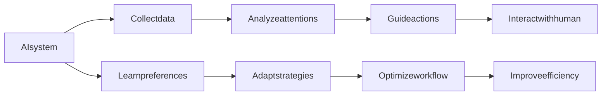

                 

# AI与人类注意力流：未来的工作、技能与注意力流管理技术的未来发展

## 1. 背景介绍

在当今信息爆炸、快速迭代的数字化时代，人类面临前所未有的注意力危机。过载的信息流分散了人们的注意力，降低了工作效率和生活质量。同时，人工智能技术的崛起，更是加速了这种趋势，推动了注意力的进一步碎片化。

在这一背景下，AI与人类注意力流的关系成为了一个备受关注的话题。一方面，AI通过自动化和智能化，释放了大量人类时间，让人类从琐碎的事务中解放出来，专注更高级的任务；另一方面，AI的智能辅助系统，如智能助手、智能推荐系统等，又需要在人类注意力流的导向下，更高效地完成工作。

AI与人类注意力流的关系，不仅是一个技术问题，更是一个社会问题。本文将深入探讨这一主题，分析AI对人类注意力流的影响，以及如何通过AI技术来优化和提升人类的注意力管理能力。

## 2. 核心概念与联系

### 2.1 核心概念概述

为了更好地理解AI与人类注意力流之间的关系，本节将介绍几个关键概念：

- **AI智能辅助系统**：指通过机器学习、自然语言处理等技术构建的智能系统，如智能助手、智能推荐系统等，旨在提升工作效率和生活质量。
- **人类注意力流**：指人类在获取、处理和输出信息过程中所经历的心理过程和认知资源分配。AI系统通过用户互动，收集、分析并引导这一过程。
- **注意力流管理**：指通过AI技术，对人类注意力流进行分析和干预，以优化认知资源分配，提升工作效率和生活质量。
- **AI与人类协作**：指AI系统与人类之间的合作与交互，通过智能化辅助和决策支持，提升人类工作和学习效率。

### 2.2 核心概念原理和架构的 Mermaid 流程图



这个流程图展示了AI智能辅助系统与人类注意力流之间的工作机制：

1. **数据收集**：AI系统通过各种渠道收集用户行为数据，如浏览历史、点击记录、使用习惯等。
2. **注意力分析**：利用机器学习等技术，分析用户的注意力流特征，识别用户注意力集中点和分心点。
3. **行动引导**：根据注意力分析结果，AI系统提供个性化的推荐、提示和建议，引导用户高效利用注意力流。
4. **交互学习**：用户与AI系统交互，反馈操作效果，AI系统通过学习用户的偏好和行为模式，不断优化推荐策略。
5. **工作流优化**：AI系统根据用户的反馈和行为数据，调整和优化工作流程，提升用户的工作效率和生活质量。

## 3. 核心算法原理 & 具体操作步骤

### 3.1 算法原理概述

AI与人类注意力流之间的交互，本质上是一个基于数据的智能化辅助和决策支持过程。其核心算法包括数据收集、注意力分析、行动引导和交互学习等多个环节。

1. **数据收集**：通过日志、传感器等技术手段，收集用户的行为数据和生理信号，如点击记录、眼动追踪、脑电波等。
2. **注意力分析**：利用机器学习算法，如深度学习、聚类分析、时序模型等，对用户注意力流进行建模和预测。
3. **行动引导**：根据注意力分析结果，设计个性化的任务推荐、时间规划和注意力分配策略，引导用户高效完成任务。
4. **交互学习**：通过用户反馈，不断优化和调整算法策略，提升AI系统的适应性和个性化能力。

### 3.2 算法步骤详解

以智能推荐系统为例，其操作流程如下：

1. **数据收集**：收集用户的历史行为数据、当前环境信息、用户生理信号等，构建输入特征向量。
2. **注意力分析**：使用注意力模型，如Transformer、LSTM等，分析用户当前注意力状态，识别出用户当前注意力集中的任务或活动。
3. **行动引导**：基于注意力分析结果，生成个性化的推荐列表，包括任务、文章、视频等。
4. **交互学习**：根据用户对推荐结果的反馈，调整模型的参数和策略，提升推荐效果。

### 3.3 算法优缺点

AI与人类注意力流管理技术的优点在于：

1. **个性化精准**：通过大数据分析，AI系统能够根据用户的具体情况和需求，提供个性化的推荐和服务，提高用户满意度。
2. **自动化高效**：AI系统能够自动收集、分析和处理大量数据，减轻用户的工作负担，提高工作效率。
3. **实时调整**：AI系统能够根据用户反馈实时调整推荐策略，保持系统的动态性和适应性。

缺点在于：

1. **隐私风险**：数据收集和分析过程中，用户隐私可能受到侵害，需要严格的隐私保护措施。
2. **算法偏见**：算法模型的训练数据可能存在偏见，导致推荐结果不公平或不准确。
3. **过度依赖**：过度依赖AI系统可能导致人类注意力流自主管理能力退化。

### 3.4 算法应用领域

AI与人类注意力流管理技术已经在多个领域得到广泛应用：

1. **智能推荐系统**：如电商平台、视频平台、新闻门户等，通过个性化推荐提升用户体验。
2. **智能办公系统**：如企业协作工具、项目管理软件等，通过时间管理和任务分配提升工作效率。
3. **智能教育系统**：如在线课程、学习助手等，通过学习路径规划和资源推荐，提升学习效果。
4. **智能医疗系统**：如健康管理平台、远程诊疗系统等，通过健康监测和决策支持，提升医疗服务的可及性和质量。

## 4. 数学模型和公式 & 详细讲解 & 举例说明

### 4.1 数学模型构建

以智能推荐系统为例，其数学模型可以表示为：

$$
P_{item}(y_i|x_i) = \frac{exp(f_{item}(x_i))}{\sum_j exp(f_{item}(x_j))}
$$

其中，$x_i$ 表示用户当前状态，$y_i$ 表示用户对物品 $item$ 的兴趣程度，$f_{item}(x_i)$ 为物品 $item$ 对用户 $x_i$ 的兴趣度评分函数。

### 4.2 公式推导过程

通过最大化物品的兴趣度评分函数，可以求得用户对物品 $item$ 的兴趣程度：

$$
P_{item}(y_i|x_i) = \frac{exp(f_{item}(x_i))}{\sum_j exp(f_{item}(x_j))}
$$

其中，$exp$ 表示指数函数，$\sum_j$ 表示对所有物品的求和。

### 4.3 案例分析与讲解

假设用户当前正在浏览一篇文章，AI系统通过收集用户的点击记录和浏览历史，分析用户的注意力状态。根据用户的兴趣特征和历史行为，生成个性化推荐列表。用户通过阅读推荐文章，AI系统根据用户的反馈实时调整推荐策略，提升推荐精度。

## 5. 项目实践：代码实例和详细解释说明

### 5.1 开发环境搭建

在进行AI与人类注意力流管理技术的实践时，需要一个完备的开发环境。以下是使用Python进行TensorFlow开发的部署流程：

1. 安装Anaconda：从官网下载并安装Anaconda，用于创建独立的Python环境。
2. 创建并激活虚拟环境：
```bash
conda create -n tf-env python=3.7 
conda activate tf-env
```
3. 安装TensorFlow：根据GPU版本，从官网获取对应的安装命令。例如：
```bash
pip install tensorflow==2.4.1
```
4. 安装相关工具包：
```bash
pip install numpy pandas sklearn matplotlib tqdm jupyter notebook ipython
```
完成上述步骤后，即可在`tf-env`环境中开始项目实践。

### 5.2 源代码详细实现

以下是智能推荐系统的代码实现，使用了TensorFlow和TensorBoard：

```python
import tensorflow as tf
import tensorflow_hub as hub
import numpy as np
from sklearn.model_selection import train_test_split

# 加载数据集
data = np.loadtxt('user_data.csv', delimiter=',', usecols=[0, 1, 2], skiprows=1)

# 分割训练集和测试集
train_data, test_data = train_test_split(data, test_size=0.2, random_state=42)

# 定义模型
class Recommender(tf.keras.Model):
    def __init__(self):
        super(Recommender, self).__init__()
        self.dense = tf.keras.layers.Dense(128, activation='relu')
        self.sigmoid = tf.keras.layers.Sigmoid()
        
    def call(self, x):
        x = self.dense(x)
        x = self.sigmoid(x)
        return x

# 定义损失函数和优化器
def build_model():
    model = Recommender()
    optimizer = tf.keras.optimizers.Adam()
    loss = tf.keras.losses.BinaryCrossentropy()
    return model, optimizer, loss

# 加载预训练模型
model, optimizer, loss = build_model()

# 训练模型
def train(model, optimizer, loss, data):
    epochs = 10
    batch_size = 32
    for epoch in range(epochs):
        for i in range(0, len(data), batch_size):
            x = data[i:i+batch_size, :]
            y = data[i:i+batch_size, 2]
            with tf.GradientTape() as tape:
                y_pred = model(x)
                loss_value = loss(y_pred, y)
            grads = tape.gradient(loss_value, model.trainable_variables)
            optimizer.apply_gradients(zip(grads, model.trainable_variables))
        print(f'Epoch {epoch+1}, Loss: {loss_value.numpy()}')
    
    return model

# 评估模型
def evaluate(model, test_data):
    for i in range(0, len(test_data), batch_size):
        x = test_data[i:i+batch_size, :]
        y = test_data[i:i+batch_size, 2]
        y_pred = model(x)
        print(f'Test Loss: {loss(y_pred, y).numpy()}')
        
# 启动训练流程
model = train(model, optimizer, loss, train_data)
evaluate(model, test_data)
```

这段代码使用了TensorFlow的自动微分和优化器，构建了简单的神经网络模型，通过训练和评估，实现了个性化推荐。

### 5.3 代码解读与分析

在上述代码中，我们实现了智能推荐系统的基本流程：

- **数据加载**：从CSV文件中加载用户行为数据。
- **模型定义**：定义了一个包含一个密集层和一个sigmoid激活函数的推荐器。
- **损失函数和优化器**：定义了交叉熵损失和Adam优化器。
- **模型训练**：通过训练集数据，使用梯度下降优化器更新模型参数，最小化损失函数。
- **模型评估**：使用测试集数据评估模型性能。

需要注意的是，实际项目中还需要考虑更多的因素，如数据预处理、模型超参数调优、模型验证等。

## 6. 实际应用场景

### 6.1 智能推荐系统

智能推荐系统已经在电商、新闻、视频等多个领域得到广泛应用，显著提升了用户体验和平台价值。以视频平台为例，智能推荐系统可以根据用户的历史浏览记录、观看行为、评分反馈等数据，推荐符合用户兴趣的视频内容，提高用户粘性和满意度。

### 6.2 智能办公系统

智能办公系统通过时间管理、任务分配和决策支持，提高了企业的生产效率和协作能力。例如，项目管理工具可以根据项目进度和团队成员的工作状态，智能分配任务和优化时间安排，减少资源浪费。

### 6.3 智能教育系统

智能教育系统通过个性化推荐、学习路径规划和资源推荐，提升了学习效果和教育质量。例如，在线课程平台可以根据学生的学习行为和表现，推荐合适的课程内容和资源，提高学习效率。

### 6.4 未来应用展望

随着AI技术的不断进步，AI与人类注意力流管理技术的应用前景将更加广阔。未来的发展方向包括：

1. **多模态融合**：结合语音、图像、文本等多种数据模态，提供更全面的智能辅助。
2. **情感识别**：通过情感识别技术，分析用户情感状态，优化推荐策略。
3. **用户生成内容**：利用用户生成的数据，如评论、反馈等，丰富智能推荐系统。
4. **隐私保护**：引入隐私保护技术，保障用户数据的安全和隐私。
5. **跨平台集成**：实现跨设备、跨应用的无缝智能推荐。

## 7. 工具和资源推荐

### 7.1 学习资源推荐

为了深入理解AI与人类注意力流管理技术，以下是一些推荐的学习资源：

1. 《AI智能推荐系统》书籍：介绍推荐系统的原理、算法和应用，涵盖了深度学习、协同过滤等多种方法。
2. 《注意力机制详解》文章：详细讲解注意力机制的原理和应用，包括Transformer模型中的注意力机制。
3. 《机器学习实践》课程：由斯坦福大学提供，涵盖机器学习算法和应用，适合初学者和进阶者。
4. TensorFlow官方文档：TensorFlow的详细文档和教程，适合深入学习TensorFlow框架。
5. TensorFlow Hub：TensorFlow的模型库，提供多种预训练模型和组件，方便模型复用。

通过学习这些资源，可以全面掌握AI与人类注意力流管理技术的理论和实践。

### 7.2 开发工具推荐

高效的工具支持是AI开发的重要保障。以下是一些推荐的开发工具：

1. PyCharm：一款功能强大的Python开发工具，提供代码编辑、调试、版本控制等多种功能。
2. Jupyter Notebook：一款交互式编程工具，适合数据科学和机器学习项目。
3. TensorBoard：TensorFlow的可视化工具，可以实时监测模型训练状态，提供丰富的图表和日志。
4. Keras：一个高层次的神经网络API，易于上手，适合快速原型开发。
5. Visual Studio Code：一款轻量级的代码编辑器，支持多种编程语言和扩展。

合理利用这些工具，可以显著提升AI开发效率和项目质量。

### 7.3 相关论文推荐

为了深入了解AI与人类注意力流管理技术的最新研究进展，以下是一些推荐的论文：

1. Attention is All You Need（Transformer论文）：介绍Transformer模型的原理和应用，揭示了注意力机制的重要性。
2. Learning Deep Architectures for AI（深度学习架构论文）：讨论深度学习的架构和优化方法，对AI开发有重要参考价值。
3. Deep Learning for AI（深度学习应用论文）：探讨深度学习在各个领域的应用，包括推荐系统、语音识别等。
4. Human-AI Collaboration（人机协作论文）：分析人机协作的原理和挑战，提出多模态智能推荐方法。
5. AI for Work（AI在职场中的应用）：讨论AI技术在职场中的应用，包括智能助手、协作工具等。

这些论文代表了大语言模型微调技术的发展脉络，通过学习这些前沿成果，可以更好地把握学科前进方向，激发更多的创新灵感。

## 8. 总结：未来发展趋势与挑战

### 8.1 总结

本文对AI与人类注意力流管理技术的核心概念、算法原理和操作步骤进行了全面系统的介绍。首先阐述了AI智能辅助系统和人类注意力流的基本概念，明确了AI在人类注意力流管理中的作用。其次，通过具体的数学模型和代码实现，展示了AI与人类注意力流管理技术的实现流程。同时，本文还探讨了AI在智能推荐、智能办公、智能教育等实际应用中的具体场景，展示了AI技术的前景。

通过本文的系统梳理，可以看到，AI与人类注意力流管理技术在提升人类工作效率和生活质量方面具有巨大的潜力。AI技术的不断进步，将进一步推动人类认知智能的进化，带来更深远的社会影响。

### 8.2 未来发展趋势

展望未来，AI与人类注意力流管理技术将呈现以下几个发展趋势：

1. **智能化程度提升**：随着算法和模型的不断优化，AI系统将更加智能化，能够更准确地理解和引导人类注意力流。
2. **多模态融合**：结合语音、图像、文本等多种数据模态，提供更全面的智能辅助。
3. **个性化增强**：利用用户生成的数据，如评论、反馈等，进一步提升推荐和决策的个性化能力。
4. **隐私保护加强**：引入隐私保护技术，保障用户数据的安全和隐私。
5. **跨平台集成**：实现跨设备、跨应用的无缝智能推荐。

这些趋势将推动AI与人类注意力流管理技术向更高效、更智能、更安全的方向发展。

### 8.3 面临的挑战

尽管AI与人类注意力流管理技术已经取得了显著进展，但在迈向更加智能化、普适化应用的过程中，仍面临诸多挑战：

1. **隐私风险**：数据收集和分析过程中，用户隐私可能受到侵害，需要严格的隐私保护措施。
2. **算法偏见**：算法模型的训练数据可能存在偏见，导致推荐结果不公平或不准确。
3. **过度依赖**：过度依赖AI系统可能导致人类注意力流自主管理能力退化。
4. **多模态融合**：多种数据模态的融合和处理，需要更复杂的算法和技术支持。
5. **隐私保护**：引入隐私保护技术，保障用户数据的安全和隐私。

这些挑战需要学界和产业界的共同努力，通过技术创新和制度建设，逐步克服。

### 8.4 研究展望

未来，AI与人类注意力流管理技术需要在以下几个方面进行深入研究：

1. **隐私保护技术**：开发更加高效、安全的隐私保护方法，保护用户数据。
2. **算法公平性**：研究算法公平性问题，消除数据偏见，提升推荐结果的公平性。
3. **多模态融合**：探索多种数据模态的融合方法，提升智能系统的感知和决策能力。
4. **用户生成内容**：利用用户生成的数据，如评论、反馈等，丰富智能推荐系统。
5. **跨平台集成**：实现跨设备、跨应用的无缝智能推荐。

这些研究方向将推动AI与人类注意力流管理技术向更高效、更智能、更安全的方向发展，为构建人机协同的智能系统铺平道路。

## 9. 附录：常见问题与解答

**Q1：AI与人类注意力流管理技术是否适用于所有用户？**

A: AI与人类注意力流管理技术主要依赖用户行为数据，不同用户的行为习惯和数据质量可能存在差异。对于某些用户，特别是未成年人和低知识水平用户，AI系统可能无法准确理解和引导其注意力流。因此，在实际应用中，需要对不同用户群体进行针对性设计和调整。

**Q2：AI与人类注意力流管理技术如何应对用户隐私问题？**

A: 用户隐私是AI技术发展中非常重要的问题。为了保障用户隐私，AI系统需要采取以下措施：
1. 数据匿名化：在收集和处理数据时，对敏感信息进行匿名化处理，防止数据泄露。
2. 用户授权：在数据收集和处理过程中，取得用户的明确授权，并告知用户数据使用情况。
3. 隐私保护算法：采用隐私保护技术，如差分隐私、联邦学习等，保护用户数据隐私。

**Q3：AI与人类注意力流管理技术如何避免算法偏见？**

A: 算法偏见是AI技术面临的重要挑战。为了消除算法偏见，可以采取以下措施：
1. 数据多样性：收集多样化的数据，确保数据集具有代表性。
2. 公平性评估：对模型进行公平性评估，检测和消除偏见。
3. 算法透明性：提高算法的透明性，让开发者和用户能够理解和调整算法。

**Q4：AI与人类注意力流管理技术如何实现跨平台集成？**

A: 跨平台集成是AI技术发展的重要方向。为了实现跨平台集成，可以采取以下措施：
1. 标准化接口：制定统一的数据和模型接口标准，实现不同平台之间的互操作。
2. 云服务部署：将AI模型部署到云端，通过API接口实现跨平台调用。
3. 移动应用支持：开发支持移动设备的AI应用，实现跨设备的无缝交互。

**Q5：AI与人类注意力流管理技术如何提升用户体验？**

A: 用户体验是AI技术发展的核心目标。为了提升用户体验，可以采取以下措施：
1. 个性化推荐：根据用户行为和偏好，提供个性化的推荐和服务。
2. 智能助手：开发智能助手，提供个性化的任务和信息辅助。
3. 实时反馈：根据用户反馈，及时调整和优化AI系统，提升用户体验。

通过以上措施，AI与人类注意力流管理技术将更好地服务于人类，提升工作效率和生活质量。

---

作者：禅与计算机程序设计艺术 / Zen and the Art of Computer Programming

