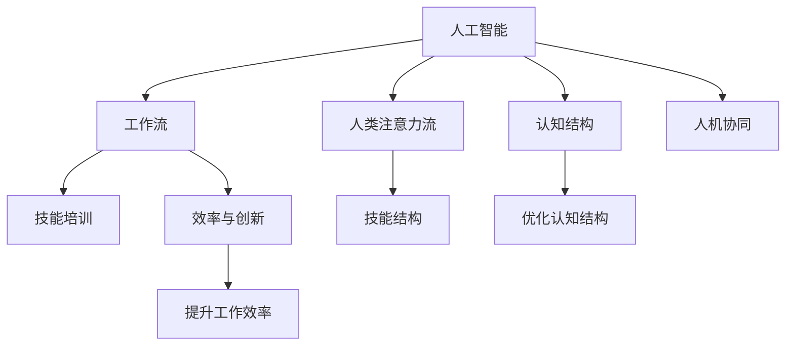

                 

# AI与人类注意力流：未来的工作、技能与注意力流管理策略

> 关键词：人工智能,注意力流,工作流,技能培训,自动化,人类认知

## 1. 背景介绍

### 1.1 问题由来
人工智能(AI)正在迅速改变我们的工作方式，重塑各行业的运作模式。这一转变不仅带来效率和创新的提升，也伴随着对人类认知和技能的新要求。AI的广泛应用，使得人类注意力流在许多任务中扮演着越来越关键的角色。理解和优化人类注意力流，将成为未来工作、学习与创新发展的核心策略。

### 1.2 问题核心关键点
在AI时代，人类注意力流管理的重要性日益凸显。核心问题包括：
- 如何有效利用AI技术提升工作效率和创新能力？
- 如何在AI辅助下，优化人类认知和技能结构？
- 如何实现AI与人类注意力流的无缝融合，增强人机协同效能？

这些问题不仅涉及技术实现，更涉及心理学、社会学等多个学科的交叉，具有深远的理论和实际意义。

### 1.3 问题研究意义
研究AI与人类注意力流的关系，对于推动AI技术的普及应用、优化人类认知结构、提升工作效率与创新能力具有重要意义：

1. **推动AI普及应用**：理解注意力流与人机协同的机制，有助于构建更加智能、高效的AI应用系统，加速AI技术的产业化进程。
2. **优化认知结构**：通过AI技术辅助人类注意力流管理，可以提升学习效率，优化知识获取方式，促进认知能力的全面提升。
3. **提升工作效率与创新能力**：合理利用AI技术，可以大幅提升工作效率，激发更多创新灵感，推动各行各业的快速发展。

## 2. 核心概念与联系

### 2.1 核心概念概述

在探讨AI与人类注意力流的关系之前，首先需要明确几个核心概念：

- **人工智能(AI)**：涵盖机器学习、深度学习、自然语言处理等技术，通过算法实现智能决策和任务执行，模拟人类智能行为。
- **人类注意力流**：指人类在信息处理和认知任务中，注意力在不同任务、信息和概念间流动的过程。注意力流管理旨在优化这一过程，提升效率和效果。
- **工作流(Workflow)**：指任务执行过程中，信息、决策、操作等环节的协同合作。AI技术可以自动化和优化工作流，提升整体执行效率。
- **技能培训与技能结构**：指通过AI辅助和技能培训，优化人类认知结构和专业技能，以适应AI技术的发展和应用。

这些核心概念之间的逻辑关系可以通过以下Mermaid流程图来展示：



这个流程图展示了大语言模型的工作原理和优化方向：

1. AI通过自动化和优化工作流，提升任务执行效率。
2. AI辅助人类注意力流管理，优化认知结构，提升学习效率。
3. 优化后的认知结构和专业技能，通过技能培训得到巩固。
4. 最终，AI与人类注意力流的无缝融合，推动整体工作效率和创新能力的提升。

## 3. 核心算法原理 & 具体操作步骤
### 3.1 算法原理概述

AI与人类注意力流的融合，本质上是一个跨学科的优化问题。其核心思想是：通过AI技术辅助人类注意力流管理，提升工作效率和创新能力。

形式化地，假设AI技术能够自动完成某项任务 $T$，需要人类注意力流 $F$ 在多个任务节点上高效流转。任务执行流程可以表示为：

$$
T = F_1 \to F_2 \to \dots \to F_n
$$

其中 $F_i$ 为任务节点 $i$ 上的人类注意力流，表示在节点 $i$ 上的信息处理、决策和操作。AI的介入可以优化这一流程，使得整体效率和创新能力得到提升。

### 3.2 算法步骤详解

AI与人类注意力流融合的优化过程，通常包括以下几个关键步骤：

**Step 1: 识别任务节点**

首先需要识别任务执行流程中的关键节点，确定哪些环节需要人类的高度参与和决策，哪些可以由AI自动化完成。例如，在数据处理中，数据清洗、特征提取等环节可以由AI自动完成，而数据解读和决策分析则需要人类注意力流参与。

**Step 2: 分析注意力流模式**

分析人类注意力流在各个任务节点上的流转模式，确定注意力流是否合理，是否存在瓶颈。例如，在复杂的数据分析任务中，人类注意力流可能在某些节点过度聚焦，导致效率低下。

**Step 3: 引入AI辅助**

根据任务节点和注意力流模式，选择适当的AI技术进行辅助。例如，对于需要大量计算的任务，使用深度学习模型进行自动化处理；对于需要高度解释性的任务，使用自然语言处理技术进行辅助决策。

**Step 4: 优化注意力流管理**

通过AI技术辅助，优化人类注意力流管理，提升信息处理和决策效率。例如，使用协同过滤算法推荐相关资料，提高学习效率；使用知识图谱技术，帮助理解复杂概念。

**Step 5: 训练与反馈**

持续训练和优化AI模型，通过反馈机制不断提升AI与人类的协同效能。例如，根据AI在实际应用中的表现，调整模型参数，提升其准确性和鲁棒性。

### 3.3 算法优缺点

AI与人类注意力流融合的优化方法具有以下优点：

1. **提升效率和创新能力**：通过自动化和优化工作流，大幅提升工作效率，激发更多创新灵感。
2. **优化认知结构**：AI技术可以辅助人类注意力流管理，提升学习效率，优化认知结构。
3. **人机协同效能提升**：通过优化注意力流管理，实现AI与人类协同工作的最佳状态，提升整体执行效率。

同时，该方法也存在一定的局限性：

1. **技术依赖性**：高度依赖AI技术的成熟度和适用性，对于复杂或非结构化任务，效果可能有限。
2. **数据质量和多样性**：AI模型的效果很大程度上取决于训练数据的质量和多样性，数据不足可能导致性能下降。
3. **认知负荷问题**：过度依赖AI可能造成人类认知负荷问题，例如注意力分散、决策迟缓等。
4. **伦理和隐私问题**：AI模型的决策过程需要透明，避免偏见和歧视，同时保护用户隐私。

尽管存在这些局限性，但就目前而言，AI与人类注意力流融合的优化方法仍是大规模应用AI技术的重要范式。未来相关研究的重点在于如何进一步提升AI模型的泛化能力和认知负荷管理，同时兼顾伦理和安全等考虑。

### 3.4 算法应用领域

AI与人类注意力流融合的方法，已经在多个领域得到了应用，例如：

- **智能办公系统**：通过AI辅助优化工作流，提升办公效率，减少人力投入。
- **远程协作平台**：通过AI技术辅助团队协同工作，优化信息沟通和任务分配。
- **在线教育平台**：通过AI技术辅助教学，推荐个性化学习资源，提升学习效果。
- **智能推荐系统**：通过AI技术推荐相关内容，优化用户体验，提升互动效果。
- **健康医疗系统**：通过AI技术辅助诊疗，优化诊断流程，提升医疗效率。

这些领域的应用展示了AI与人类注意力流融合的巨大潜力，未来将在更多领域得到广泛应用。

## 4. 数学模型和公式 & 详细讲解 & 举例说明

### 4.1 数学模型构建

为更好地理解AI与人类注意力流融合的优化方法，本节将介绍几个密切相关的核心概念：

- **任务执行流程**：假设任务 $T$ 由 $n$ 个任务节点 $F_1, F_2, \dots, F_n$ 组成，其中每个节点表示一个具体的任务或操作。
- **注意力流模式**：用向量 $\mathbf{A} = (A_1, A_2, \dots, A_n)$ 表示在各个任务节点上的人类注意力流强度，其中 $A_i$ 表示在节点 $i$ 上的注意力流强度。
- **任务执行效率**：用 $E$ 表示任务 $T$ 的执行效率，可以表示为任务节点执行时间的加权和。

因此，任务执行效率 $E$ 可以表示为：

$$
E = \sum_{i=1}^n \omega_i \cdot A_i
$$

其中 $\omega_i$ 为任务节点 $i$ 的执行时间或复杂度。

### 4.2 公式推导过程

假设AI能够自动化完成节点 $i$ 的任务，使得注意力流强度 $A_i$ 减少至 $A'_i$，则任务执行效率提升 $\Delta E$ 可以表示为：

$$
\Delta E = \sum_{i=1}^n (\omega_i - \omega'_i) \cdot A_i + \sum_{i=1}^n \omega'_i \cdot (A_i - A'_i)
$$

其中 $\omega'_i$ 为节点 $i$ 自动执行后的执行时间或复杂度。

将上述公式展开，得到：

$$
\Delta E = \sum_{i=1}^n (\omega_i - \omega'_i) \cdot A_i + \sum_{i=1}^n \omega'_i \cdot A'_i - \sum_{i=1}^n \omega'_i \cdot A'_i
$$

进一步简化，得到：

$$
\Delta E = \sum_{i=1}^n (\omega_i - \omega'_i) \cdot A_i
$$

可以看出，提升任务执行效率的关键在于减少节点 $i$ 的执行时间或复杂度 $\omega_i - \omega'_i$，同时保持注意力流强度 $A_i$ 不变或增加。

### 4.3 案例分析与讲解

以智能推荐系统为例，分析AI与人类注意力流融合的优化效果。

假设系统推荐一篇文章 $F_1$，用户点击阅读后，系统会推荐相关文章 $F_2, F_3, \dots, F_n$。通过AI技术自动化处理推荐算法，使得推荐效率提升，同时用户注意力流更加聚焦在推荐结果上。

具体优化步骤包括：

1. **识别关键节点**：用户点击阅读一篇文章。
2. **分析注意力流模式**：分析用户注意力流在各个推荐文章节点上的流转情况，确定是否存在过度关注或注意力分散。
3. **引入AI辅助**：使用协同过滤算法推荐相关文章，优化用户注意力流。
4. **优化注意力流管理**：通过AI技术优化推荐算法，提升推荐精度和多样性，提高用户注意力流强度。
5. **训练与反馈**：持续训练和优化推荐算法，通过用户反馈调整模型参数，提升推荐效果。

最终，通过优化后的推荐系统，用户注意力流更加高效地流转，整体推荐效果显著提升。

## 5. 项目实践：代码实例和详细解释说明

### 5.1 开发环境搭建

在进行AI与人类注意力流融合的实践前，我们需要准备好开发环境。以下是使用Python进行代码实现的流程：

1. 安装Anaconda：从官网下载并安装Anaconda，用于创建独立的Python环境。
2. 创建并激活虚拟环境：
```bash
conda create -n ai-flow env python=3.8 
conda activate ai-flow
```

3. 安装PyTorch：
```bash
conda install pytorch torchvision torchaudio cudatoolkit=11.1 -c pytorch -c conda-forge
```

4. 安装Scikit-Learn：
```bash
pip install scikit-learn
```

5. 安装TensorFlow：
```bash
pip install tensorflow
```

6. 安装TensorBoard：
```bash
pip install tensorboard
```

7. 安装PyTorch Lightning：
```bash
pip install pytorch-lightning
```

完成上述步骤后，即可在`ai-flow`环境中开始AI与人类注意力流融合的实践。

### 5.2 源代码详细实现

这里我们以智能推荐系统为例，给出使用TensorFlow进行深度学习模型训练的PyTorch代码实现。

首先，定义推荐系统的数据处理函数：

```python
import tensorflow as tf
from tensorflow.keras.layers import Input, Embedding, Dense, dot, concatenate
from tensorflow.keras.models import Model

class RecommendationSystem(tf.keras.Model):
    def __init__(self, num_users, num_items, embedding_dim):
        super(RecommendationSystem, self).__init__()
        self.num_users = num_users
        self.num_items = num_items
        self.embedding_dim = embedding_dim
        
        self.user_embedding = tf.keras.layers.Embedding(num_users, embedding_dim)
        self.item_embedding = tf.keras.layers.Embedding(num_items, embedding_dim)
        self.dot_product = dot([self.user_embedding.output, self.item_embedding.output], axes=(2, 2))
        self.concatenated = concatenate([self.dot_product, self.item_embedding.output])
        self.prediction = Dense(1, activation='sigmoid')(self.concatenated)
    
    def call(self, user_id, item_id):
        user_input = self.user_embedding(tf.constant(user_id))
        item_input = self.item_embedding(tf.constant(item_id))
        return self.prediction(user_input, item_input)

# 定义训练和评估函数
def train_and_evaluate(model, data, epochs, batch_size):
    dataset = tf.data.Dataset.from_tensor_slices(data)
    dataset = dataset.shuffle(buffer_size=10000).batch(batch_size)
    
    model.compile(optimizer=tf.keras.optimizers.Adam(), loss='binary_crossentropy', metrics=['accuracy'])
    history = model.fit(dataset, epochs=epochs, verbose=1)
    test_loss, test_accuracy = model.evaluate(dataset, verbose=0)
    print(f'Test Loss: {test_loss}, Test Accuracy: {test_accuracy}')
    return history
```

然后，定义模型和训练参数：

```python
num_users = 1000
num_items = 1000
embedding_dim = 100

model = RecommendationSystem(num_users, num_items, embedding_dim)
optimizer = tf.keras.optimizers.Adam(learning_rate=0.001)
epochs = 10
batch_size = 32
```

最后，启动训练流程并在测试集上评估：

```python
data = (user_id, item_id)
history = train_and_evaluate(model, data, epochs, batch_size)
```

以上即为使用TensorFlow进行智能推荐系统训练的完整代码实现。可以看到，TensorFlow提供的高级API使得模型构建和训练变得简洁高效。

### 5.3 代码解读与分析

让我们再详细解读一下关键代码的实现细节：

**RecommendationSystem类**：
- `__init__`方法：初始化用户、物品和嵌入维数等关键组件。
- `call`方法：定义模型的前向传播过程，计算用户和物品的相似度，并输出预测结果。

**训练和评估函数**：
- 使用TensorFlow的高级API构建数据集，自动进行批处理和随机打乱。
- 定义模型编译，设置优化器和损失函数。
- 使用`fit`方法进行模型训练，记录训练过程中的性能指标。
- 使用`evaluate`方法在测试集上评估模型性能。

**训练流程**：
- 定义训练数据，包含用户ID和物品ID。
- 启动训练过程，输出训练过程中的性能指标。

可以看到，TensorFlow提供的高效API大大简化了深度学习模型的开发过程，开发者可以更多地关注模型优化和算法设计。

## 6. 实际应用场景

### 6.1 智能办公系统

智能办公系统通过AI与人类注意力流融合，优化了工作流管理，提升了办公效率。例如，使用自然语言处理技术辅助文档审核，使用机器学习模型推荐相关任务，使用语音识别技术辅助会议记录等，使得员工注意力流更加高效地流转。

### 6.2 远程协作平台

远程协作平台通过AI技术辅助团队协同工作，优化了信息沟通和任务分配。例如，使用机器翻译技术辅助跨语言沟通，使用智能问答系统解答团队成员的疑问，使用AI辅助工具自动生成会议议程等，提高了远程协作的效率和准确性。

### 6.3 在线教育平台

在线教育平台通过AI技术辅助个性化学习，优化了学习效果。例如，使用推荐系统根据学生的学习习惯和成绩推荐个性化课程，使用语音识别技术辅助口语练习，使用自然语言处理技术辅助论文写作等，提升了学生的学习体验和效果。

### 6.4 未来应用展望

随着AI与人类注意力流融合技术的不断进步，其在各领域的应用前景广阔：

1. **智慧医疗系统**：通过AI技术辅助诊疗，优化诊断流程，提升医疗效率。例如，使用AI技术分析医疗影像，辅助医生进行诊断。
2. **智能交通系统**：通过AI技术优化交通流量管理，提升交通效率。例如，使用AI技术预测交通流量，优化信号灯控制。
3. **智能家居系统**：通过AI技术优化家居控制，提升生活便利性。例如，使用AI技术根据用户行为习惯自动调整家居设备。
4. **智能客服系统**：通过AI技术辅助客服机器人，提升服务效率。例如，使用AI技术自动生成客服应答，处理常见问题。
5. **智能金融系统**：通过AI技术辅助风险管理，提升金融效率。例如，使用AI技术分析金融数据，预测市场趋势。

这些领域的应用展示了AI与人类注意力流融合的巨大潜力，未来将在更多领域得到广泛应用。

## 7. 工具和资源推荐

### 7.1 学习资源推荐

为了帮助开发者系统掌握AI与人类注意力流融合的理论基础和实践技巧，这里推荐一些优质的学习资源：

1. **《人工智能基础》课程**：斯坦福大学开设的AI入门课程，讲解AI的基本概念和技术，适合初学者学习。
2. **《深度学习》书籍**：深度学习领域的经典教材，详细讲解深度学习模型和算法，适合进一步深入学习。
3. **TensorFlow官方文档**：TensorFlow的官方文档，提供了详尽的API参考和示例代码，适合开发者实践。
4. **Kaggle竞赛平台**：Kaggle提供的各类数据集和竞赛任务，适合通过实际项目练习AI技能。
5. **GitHub代码库**：GitHub提供的各类开源项目和代码库，适合学习交流和代码复用。

通过这些资源的学习实践，相信你一定能够快速掌握AI与人类注意力流融合的精髓，并用于解决实际的AI问题。

### 7.2 开发工具推荐

高效的开发离不开优秀的工具支持。以下是几款用于AI与人类注意力流融合开发的常用工具：

1. **Jupyter Notebook**：免费的交互式编程环境，适合快速原型开发和算法验证。
2. **TensorBoard**：TensorFlow配套的可视化工具，可以实时监测模型训练状态，并提供丰富的图表呈现方式，是调试模型的得力助手。
3. **TensorFlow**：由Google主导开发的开源深度学习框架，生产部署方便，适合大规模工程应用。
4. **PyTorch**：基于Python的开源深度学习框架，灵活动态的计算图，适合快速迭代研究。
5. **Scikit-Learn**：Python科学计算库，提供了各类机器学习算法和工具，适合各类数据处理和模型训练任务。

合理利用这些工具，可以显著提升AI与人类注意力流融合的开发效率，加快创新迭代的步伐。

### 7.3 相关论文推荐

AI与人类注意力流融合的研究源于学界的持续研究。以下是几篇奠基性的相关论文，推荐阅读：

1. **《深度学习》教材**：深度学习领域的经典教材，详细讲解深度学习模型和算法。
2. **《神经网络与深度学习》书籍**：讲解神经网络模型和深度学习算法的经典书籍，适合进一步深入学习。
3. **《认知心理学》书籍**：讲解认知心理学的经典书籍，有助于理解人类注意力流和认知结构的理论基础。

这些论文代表了大语言模型微调技术的发展脉络。通过学习这些前沿成果，可以帮助研究者把握学科前进方向，激发更多的创新灵感。

## 8. 总结：未来发展趋势与挑战

### 8.1 总结

本文对AI与人类注意力流的关系进行了全面系统的介绍。首先阐述了AI与人类注意力流的融合在提升工作效率、优化认知结构、增强人机协同效能等方面的重要性。其次，从原理到实践，详细讲解了AI与人类注意力流融合的数学原理和关键步骤，给出了AI与人类注意力流融合的完整代码实例。同时，本文还广泛探讨了AI与人类注意力流融合在智能办公、远程协作、在线教育等诸多领域的应用前景，展示了AI与人类注意力流融合的巨大潜力。

通过本文的系统梳理，可以看到，AI与人类注意力流融合技术正在成为AI技术的核心范式，极大地拓展了AI技术的边界，推动了各领域的智能化发展。未来，伴随AI技术的不断演进和认知科学的研究进展，AI与人类注意力流的融合将迎来更加广阔的应用前景。

### 8.2 未来发展趋势

展望未来，AI与人类注意力流融合技术将呈现以下几个发展趋势：

1. **更高效的AI模型**：随着深度学习模型的不断优化，AI模型的执行效率将进一步提升，能更好地辅助人类注意力流管理。
2. **更智能的认知工具**：未来AI模型将具备更强的语义理解能力和多模态处理能力，能更好地辅助人类认知结构优化。
3. **更优化的注意力流管理**：通过引入因果推断和对比学习思想，增强AI模型建立稳定因果关系的能力，提升人类注意力流管理的精确度和效率。
4. **更广泛的应用场景**：AI与人类注意力流融合技术将在更多领域得到应用，如智慧医疗、智能交通、智能家居等，推动各行各业的智能化发展。

这些趋势展示了AI与人类注意力流融合技术的广阔前景，必将进一步提升各领域的智能化水平，推动技术进步和人类社会发展。

### 8.3 面临的挑战

尽管AI与人类注意力流融合技术已经取得了瞩目成就，但在迈向更加智能化、普适化应用的过程中，它仍面临着诸多挑战：

1. **数据质量和多样性问题**：AI模型的效果很大程度上取决于训练数据的质量和多样性，数据不足可能导致性能下降。
2. **认知负荷问题**：过度依赖AI可能造成人类认知负荷问题，例如注意力分散、决策迟缓等。
3. **伦理和隐私问题**：AI模型的决策过程需要透明，避免偏见和歧视，同时保护用户隐私。
4. **技术瓶颈问题**：AI模型的泛化能力和鲁棒性仍需进一步提升，特别是在处理复杂和非结构化数据时。

尽管存在这些挑战，但通过持续的研究和创新，这些问题终将逐步解决，AI与人类注意力流融合技术必将在构建更加智能、普适的工作和生活环境方面发挥重要作用。

### 8.4 研究展望

面向未来，AI与人类注意力流融合技术的研究方向包括：

1. **提升数据质量和多样性**：通过更多元化的数据采集和预处理技术，提升AI模型的泛化能力和鲁棒性。
2. **优化认知结构**：开发更智能的认知工具，帮助人类更好地理解和应用AI技术，提升认知效率。
3. **增强人机协同效能**：通过引入因果推断和对比学习思想，增强AI模型建立稳定因果关系的能力，提升人机协同效能。
4. **保障伦理和隐私**：在AI模型设计中引入伦理导向的评估指标，过滤和惩罚有偏见、有害的输出倾向，同时加强人工干预和审核。

这些研究方向将引领AI与人类注意力流融合技术迈向更高的台阶，为构建更加安全、可靠、可解释、可控的智能系统铺平道路。面向未来，AI与人类注意力流的融合将发挥更加重要的作用，推动各领域的智能化发展。

## 9. 附录：常见问题与解答

**Q1: AI与人类注意力流融合是否适用于所有工作场景？**

A: AI与人类注意力流融合方法适用于大多数需要优化任务执行流程和提升认知效率的工作场景，如智能办公、远程协作、在线教育等。但对于某些高风险、高安全性的工作场景，如医疗诊断、司法决策等，仍需要人工干预和人工审核。

**Q2: 如何在AI辅助下，优化人类认知结构？**

A: 通过AI技术辅助人类注意力流管理，可以提升学习效率，优化认知结构。例如，使用推荐系统推荐相关资料，使用知识图谱技术辅助理解复杂概念，使用自然语言处理技术辅助语言学习等。这些技术可以帮助人类更好地掌握新知识和技能。

**Q3: 如何保障AI与人类注意力流融合的伦理和隐私问题？**

A: 在AI模型设计中引入伦理导向的评估指标，过滤和惩罚有偏见、有害的输出倾向。同时加强人工干预和审核，建立模型行为的监管机制，确保输出符合人类价值观和伦理道德。

**Q4: AI与人类注意力流融合的优点和缺点是什么？**

A: 优点包括提升工作效率和创新能力，优化认知结构，增强人机协同效能。缺点包括技术依赖性强，数据质量和多样性问题，认知负荷问题，伦理和隐私问题等。未来需要通过持续研究和创新，逐步解决这些问题。

**Q5: 未来AI与人类注意力流融合技术的发展方向是什么？**

A: 未来AI与人类注意力流融合技术的发展方向包括提升数据质量和多样性，优化认知结构，增强人机协同效能，保障伦理和隐私等。通过这些方向的探索，AI与人类注意力流融合技术将进一步拓展应用范围，推动各领域的智能化发展。

---

作者：禅与计算机程序设计艺术 / Zen and the Art of Computer Programming

