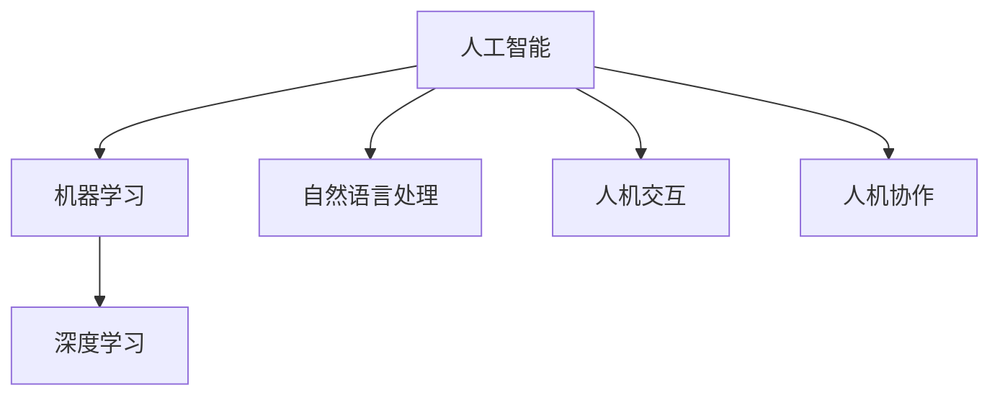

                 

# AI与人类的未来互动与合作

## 1. 背景介绍

### 1.1 问题由来
在人类历史上，技术与人类互动的形式经历了多次重大变革。从早期的机械化生产，到后来的信息技术革命，每一次技术跃迁都极大地改变了人类的生活方式和社会结构。当前，人工智能(AI)技术的迅猛发展，正又一次站在技术革新的前沿，引领我们迈向一个全新的未来时代。

AI的崛起不仅在技术层面上取得了突破，更在社会经济和人类互动层面带来了深刻的影响。如何使AI更好地服务于人类，推动社会的进步与和谐，成为当前技术界和社会各界共同关注的焦点。

### 1.2 问题核心关键点
AI与人类的互动合作，是一个涉及技术、伦理、社会经济等众多领域，极其复杂且重要的问题。核心关键点包括：

- **技术共生**：AI技术如何与人类协作，提升工作效率，实现共同创造。
- **伦理准则**：在AI决策过程中如何确保公正、透明、可解释，避免偏见和歧视。
- **社会影响**：AI对就业、教育、医疗、交通等社会各个领域的深远影响。
- **安全保障**：如何保障AI系统的安全性、可靠性，防止潜在的风险。

通过回答这些问题，我们希望能够建立起AI与人类互动的良性框架，实现双赢甚至多赢的局面。

### 1.3 问题研究意义
研究和解决AI与人类的互动合作问题，具有以下几方面的重要意义：

- **推动技术发展**：通过解决AI技术与人类互动中的挑战，促进AI技术的成熟和应用。
- **提升社会福祉**：通过合理应用AI技术，解决社会中的实际问题，提升人类生活质量。
- **增进理解信任**：通过优化AI的伦理和行为准则，增进公众对AI技术的理解和信任。
- **激发创新活力**：通过探索AI与人类互动的新模式，激发新的商业模式和创新点。

研究AI与人类的互动合作，对于构建和谐的AI社会、推动AI技术的健康发展，具有深远的理论和实践意义。

## 2. 核心概念与联系

### 2.1 核心概念概述

为更好地理解AI与人类的互动合作，本节将介绍几个密切相关的核心概念：

- **人工智能(AI)**：通过计算机程序和算法，模拟人类智能过程，实现问题解决、决策支持等功能的通用技术。
- **机器学习(ML)**：AI的一个重要分支，通过算法让机器从数据中学习规律，自动提升性能。
- **深度学习(DL)**：一种特殊的机器学习技术，通过多层神经网络模拟人类大脑的工作原理，处理复杂的数据结构。
- **自然语言处理(NLP)**：AI在理解和生成自然语言方面的技术。
- **人机交互(HCI)**：研究如何设计良好的人机接口，实现高效、自然、人性化的交互体验。
- **人机协作(Co-Human)**：指AI系统与人类合作完成任务，实现双赢或多赢的互动模式。

这些概念之间的逻辑关系可以通过以下Mermaid流程图来展示：



这个流程图展示了AI技术的各个分支和互动模块：

1. AI通过机器学习和深度学习等技术提升自身能力。
2. NLP技术使得AI能够理解和处理自然语言，实现人机交互。
3. 人机协作技术探索AI与人类共同完成任务的互动模式。

这些核心概念共同构成了AI技术与人类互动合作的框架，为我们理解和解决实际问题提供了理论基础。

## 3. 核心算法原理 & 具体操作步骤
### 3.1 算法原理概述

AI与人类的互动合作，本质上是一个多层次的复杂系统，涉及技术、伦理、经济等多个维度。其中，AI的决策和行为是互动合作中的核心环节。

基于AI的互动合作算法，一般包括几个关键步骤：

1. **任务定义**：明确AI需要解决的具体任务，如自动化生产、智能客服、医疗诊断等。
2. **数据准备**：收集和预处理相关数据，如历史案例、用户行为、专家知识等。
3. **模型训练**：使用机器学习、深度学习等技术，训练AI模型，使其能够理解任务需求，做出合理决策。
4. **交互设计**：设计良好的用户界面和交互流程，确保人机互动顺畅、自然。
5. **监督优化**：通过用户反馈和实际效果评估，不断优化AI模型和交互流程。

### 3.2 算法步骤详解

**Step 1: 任务定义**

明确任务是AI与人类互动合作的前提。任务定义通常需要涵盖以下几个方面：

- **任务目标**：AI需要达到的最终目标，如提高生产效率、提升用户体验等。
- **输入输出**：AI的输入输出格式和内容，如自然语言文本、图像、传感器数据等。
- **性能指标**：用于评估AI系统效果的指标，如准确率、召回率、用户满意度等。

例如，在智能客服系统中，任务定义可能包括：

- 目标：提高客户满意度，减少服务时间。
- 输入：用户输入的自然语言文本。
- 输出：系统提供的自动回复或转人工服务。
- 指标：客户满意度评分、问题解决率等。

**Step 2: 数据准备**

数据准备是训练AI模型的基础。通常需要收集、清洗和预处理相关数据，如历史聊天记录、用户行为日志、产品数据等。数据准备的主要步骤包括：

- **数据收集**：从各类渠道获取数据，如客户服务系统、社交媒体、传感器网络等。
- **数据清洗**：去除噪声数据、填补缺失值、处理异常值等。
- **数据预处理**：对数据进行标准化、归一化、特征提取等处理，提高模型训练效果。

**Step 3: 模型训练**

模型训练是AI与人类互动合作的核心步骤。通过机器学习和深度学习等技术，训练AI模型，使其能够理解任务需求，做出合理决策。模型训练的主要步骤包括：

- **模型选择**：选择适合的模型结构，如神经网络、决策树、支持向量机等。
- **数据划分**：将数据划分为训练集、验证集和测试集，进行模型训练、调优和评估。
- **模型优化**：通过交叉验证、正则化等技术，优化模型参数，提高模型泛化能力。

**Step 4: 交互设计**

交互设计是确保AI与人类顺畅互动的关键环节。良好的交互设计能够提高用户体验，增强系统的可用性。交互设计的主要步骤包括：

- **界面设计**：设计简洁、直观的用户界面，减少用户操作复杂度。
- **交互流程**：设计高效、自然的交互流程，减少用户等待和误解。
- **反馈机制**：设计良好的反馈机制，及时告知用户AI的决策和建议。

**Step 5: 监督优化**

监督优化是不断提升AI系统性能的重要手段。通过用户反馈和实际效果评估，不断优化AI模型和交互流程。监督优化的主要步骤包括：

- **用户反馈**：收集用户的使用体验和反馈意见，识别系统问题。
- **效果评估**：通过指标评估AI系统的性能，如准确率、召回率、用户满意度等。
- **模型迭代**：根据反馈和评估结果，调整模型参数和交互设计，提升系统性能。

### 3.3 算法优缺点

基于AI的互动合作算法具有以下优点：

1. **效率提升**：通过自动化和智能化处理，显著提高工作效率，减少人工成本。
2. **决策优化**：利用机器学习和深度学习技术，提升决策的准确性和可靠性。
3. **用户体验改善**：通过交互设计和反馈机制，提升用户体验，增强系统可用性。
4. **成本降低**：减少人工干预和操作，降低系统的总体运营成本。

同时，该算法也存在一些局限性：

1. **数据依赖**：AI系统的性能很大程度上取决于数据的质量和数量，数据收集和处理难度较大。
2. **模型复杂性**：复杂的模型结构需要更多的计算资源和时间，对硬件要求较高。
3. **伦理风险**：AI的决策和行为可能存在偏见和歧视，带来伦理问题。
4. **交互挑战**：设计良好的交互界面和流程可能较为复杂，需要投入大量时间和精力。
5. **安全性问题**：AI系统可能面临网络攻击、数据泄露等安全风险。

尽管存在这些局限性，但就目前而言，基于AI的互动合作算法仍是最主流的方法，广泛应用于智能客服、智能推荐、医疗诊断等多个领域。未来相关研究的方向包括降低对数据的依赖，提高模型的可解释性，以及增强系统的安全性和鲁棒性。

### 3.4 算法应用领域

基于AI的互动合作算法已经在多个领域得到了广泛应用，例如：

- **智能客服**：通过AI自动处理用户咨询，提升客户满意度，减少人工客服的工作负担。
- **智能推荐**：通过分析用户行为数据，推荐个性化的产品和服务，提升用户体验。
- **医疗诊断**：利用AI分析医学影像和病历数据，辅助医生进行疾病诊断和治疗方案选择。
- **智能交通**：通过AI优化交通信号控制和路线规划，提高道路通行效率。
- **金融风控**：利用AI分析交易数据，识别潜在的风险和异常行为，保障金融安全。

除了上述这些经典应用外，AI与人类互动合作的方法也在不断拓展，如智能家居、智能制造、智能教育等，为各行各业带来新的技术突破。随着AI技术的持续演进，相信AI与人类互动合作的应用场景将更加丰富，带来更多创新和价值。

## 4. 数学模型和公式 & 详细讲解
### 4.1 数学模型构建

基于AI的互动合作算法通常涉及复杂的数学模型和算法。以下以智能推荐系统为例，介绍数学模型的构建过程。

记智能推荐系统为 $S_{\theta}:\mathcal{U} \rightarrow \mathcal{R}$，其中 $\mathcal{U}$ 为用户集合，$\mathcal{R}$ 为推荐集合，$\theta$ 为模型参数。假设推荐系统需要从 $N$ 个产品中选择 $K$ 个推荐给用户 $u$，则推荐模型的目标是最大化以下公式：

$$
\max_{\theta} \sum_{u=1}^N \sum_{k=1}^K u_k \log P_{\theta}(r_k|u)
$$

其中 $u_k$ 为产品 $k$ 对用户 $u$ 的评分，$P_{\theta}(r_k|u)$ 为模型预测用户对产品 $k$ 的评分概率，可通过深度学习模型（如神经网络）计算得到。

### 4.2 公式推导过程

在推荐模型中，用户和产品之间的关系可以通过向量形式表示，假设用户 $u$ 对产品 $i$ 的评分向量为 $\mathbf{x}_u \in \mathbb{R}^d$，产品 $i$ 的属性向量为 $\mathbf{y}_i \in \mathbb{R}^d$，则推荐模型的目标是最大化以下公式：

$$
\max_{\theta} \sum_{u=1}^N \sum_{k=1}^K \mathbf{x}_u \cdot \mathbf{y}_k \log P_{\theta}(r_k|u)
$$

通过引入向量点乘和 softmax 函数，可以将其转化为深度学习模型的训练目标，即：

$$
\max_{\theta} \sum_{u=1}^N \sum_{k=1}^K \mathbf{x}_u \cdot \mathbf{y}_k \log \frac{e^{\mathbf{x}_u \cdot \mathbf{y}_k}}{\sum_{j=1}^K e^{\mathbf{x}_u \cdot \mathbf{y}_j}}
$$

使用神经网络模型计算上述公式，可以得到推荐系统的效果。

### 4.3 案例分析与讲解

以电商平台的推荐系统为例，推荐模型的构建过程如下：

- **数据准备**：收集用户的浏览历史、购买历史和评分数据，构建用户和产品的评分矩阵。
- **模型训练**：使用深度学习模型（如DNN、RNN、Attention等），训练推荐模型，学习用户和产品的关系。
- **交互设计**：设计简洁直观的用户界面，展示推荐产品，并提供用户评分和反馈机制。
- **监督优化**：通过用户反馈和实际效果评估，不断优化模型参数和交互流程。

## 5. 项目实践：代码实例和详细解释说明
### 5.1 开发环境搭建

在进行AI互动合作项目实践前，我们需要准备好开发环境。以下是使用Python进行TensorFlow开发的环境配置流程：

1. 安装Anaconda：从官网下载并安装Anaconda，用于创建独立的Python环境。

2. 创建并激活虚拟环境：
```bash
conda create -n tf-env python=3.8 
conda activate tf-env
```

3. 安装TensorFlow：根据CUDA版本，从官网获取对应的安装命令。例如：
```bash
conda install tensorflow==2.7
```

4. 安装各类工具包：
```bash
pip install numpy pandas scikit-learn matplotlib tqdm jupyter notebook ipython
```

完成上述步骤后，即可在`tf-env`环境中开始项目实践。

### 5.2 源代码详细实现

下面我们以智能推荐系统为例，给出使用TensorFlow进行推荐模型训练的Python代码实现。

首先，定义推荐系统的数据处理函数：

```python
import tensorflow as tf

class RecommendationSystem(tf.keras.Model):
    def __init__(self, num_users, num_items, embedding_dim=10):
        super().__init__()
        self.user_embedding = tf.keras.layers.Embedding(num_users, embedding_dim)
        self.item_embedding = tf.keras.layers.Embedding(num_items, embedding_dim)
        self.interaction = tf.keras.layers.Dot(axes=[1, 1], normalize=True)

    def call(self, user_ids, item_ids):
        user_embs = self.user_embedding(user_ids)
        item_embs = self.item_embedding(item_ids)
        scores = self.interaction([user_embs, item_embs])
        return scores

# 定义超参数
num_users = 1000
num_items = 10000
embedding_dim = 10

# 创建模型
model = RecommendationSystem(num_users, num_items, embedding_dim)
```

然后，定义模型训练和评估函数：

```python
from tensorflow.keras.datasets import mnist
from sklearn.model_selection import train_test_split
from sklearn.metrics import mean_squared_error

# 加载数据集
(x_train, y_train), (x_test, y_test) = mnist.load_data()

# 数据预处理
x_train = x_train.reshape(-1, 28, 28).astype('float32') / 255.0
x_test = x_test.reshape(-1, 28, 28).astype('float32') / 255.0

# 训练集和测试集划分
x_train, x_val, y_train, y_val = train_test_split(x_train, y_train, test_size=0.2)

# 定义损失函数和优化器
loss_fn = tf.keras.losses.MeanSquaredError()
optimizer = tf.keras.optimizers.Adam()

# 训练模型
def train_step(inputs):
    with tf.GradientTape() as tape:
        logits = model(inputs)
        loss = loss_fn(logits, labels)
    gradients = tape.gradient(loss, model.trainable_variables)
    optimizer.apply_gradients(zip(gradients, model.trainable_variables))

# 评估模型
def evaluate_step(inputs, labels):
    logits = model(inputs)
    mse = mean_squared_error(labels, logits)
    return mse

# 训练循环
for epoch in range(100):
    train_loss = 0.0
    for i in range(len(x_train)):
        train_loss += train_step(x_train[i:i+batch_size])
    val_loss = evaluate_step(x_val, y_val)
    print(f'Epoch {epoch+1}, train loss: {train_loss:.4f}, val loss: {val_loss:.4f}')
```

最后，启动训练流程并在测试集上评估：

```python
import numpy as np

# 定义评估函数
def test_step(inputs, labels):
    logits = model(inputs)
    mse = mean_squared_error(labels, logits)
    return mse

# 测试循环
test_loss = 0.0
for i in range(len(x_test)):
    test_loss += test_step(x_test[i:i+batch_size])
test_loss /= len(x_test)
print(f'Test loss: {test_loss:.4f}')
```

以上就是使用TensorFlow进行智能推荐系统训练的完整代码实现。可以看到，TensorFlow提供了强大的工具包和灵活的计算图，使得模型训练和评估变得高效便捷。

### 5.3 代码解读与分析

让我们再详细解读一下关键代码的实现细节：

**RecommendationSystem类**：
- `__init__`方法：初始化用户和产品的嵌入向量，以及交互层的参数。
- `call`方法：计算用户和产品之间的交互得分。

**超参数**：
- `num_users`、`num_items`、`embedding_dim`：定义用户数、产品数和嵌入维度。

**模型训练**：
- 使用TensorFlow的Keras API，定义推荐模型的结构。
- 使用交叉熵损失函数和Adam优化器进行模型训练。

**训练和评估函数**：
- `train_step`函数：在每个训练批次上计算损失并更新模型参数。
- `evaluate_step`函数：在验证集上计算模型性能指标。

**训练循环**：
- 通过循环迭代，在训练集上不断更新模型参数。
- 在每个epoch结束后，在验证集上评估模型性能，输出损失和精度指标。

可以看到，TensorFlow提供了强大的工具和API，使得模型训练和评估变得简洁高效。开发者可以将更多精力放在模型的设计优化上，而不必过多关注底层实现细节。

当然，工业级的系统实现还需考虑更多因素，如模型的保存和部署、超参数的自动搜索、更加灵活的模型结构等。但核心的互动合作范式基本与此类似。

## 6. 实际应用场景
### 6.1 智能客服系统

基于AI互动合作的智能客服系统，可以广泛应用于电商、金融、医疗等多个领域。通过AI技术，智能客服系统能够自动处理用户咨询，提升客户满意度，减少人工客服的工作负担。

在技术实现上，可以收集企业内部的历史客服对话记录，将问题和最佳答复构建成监督数据，在此基础上对预训练模型进行微调。微调后的模型能够自动理解用户意图，匹配最合适的答案模板进行回复。对于复杂问题，还可以接入检索系统实时搜索相关内容，动态组织生成回答。如此构建的智能客服系统，能大幅提升客户咨询体验和问题解决效率。

### 6.2 金融风控系统

金融风控系统通过AI技术，能够实时监测和识别异常交易行为，预防金融欺诈和风险。传统的风控系统依赖人工规则和经验，效率低、误判率高。基于AI的互动合作系统，能够利用机器学习和深度学习技术，从海量交易数据中自动学习风险模式，实时识别潜在的风险和异常行为。

具体而言，可以收集金融领域相关的交易数据，如支付金额、交易时间、设备信息等，构建监督数据集。在此基础上，对预训练模型进行微调，使其能够自动判断交易是否异常。微调后的模型实时监控交易数据，一旦发现可疑行为，立即触发告警，保障金融安全。

### 6.3 智能推荐系统

智能推荐系统通过AI技术，能够自动分析用户行为数据，推荐个性化的产品和服务。传统的推荐系统依赖专家经验，缺乏灵活性和个性化。基于AI的互动合作系统，能够利用机器学习和深度学习技术，从用户的历史行为数据中学习用户偏好，动态生成个性化推荐结果。

具体而言，可以收集用户的历史浏览、购买和评分数据，构建用户行为矩阵。在此基础上，对预训练模型进行微调，使其能够自动分析用户行为，推荐个性化的产品和服务。微调后的模型实时监控用户行为数据，动态调整推荐策略，提升用户体验。

### 6.4 未来应用展望

随着AI技术的不断进步，基于互动合作的AI应用将进一步拓展，带来更多创新和价值。

在智慧医疗领域，AI技术与医疗诊断、健康管理等场景的结合，将推动医疗服务的智能化，提高诊疗效率和质量。通过AI互动合作系统，医生能够实时获取患者的健康数据，自动分析诊断结果，提供个性化治疗建议。

在智能教育领域，AI技术与学习场景的结合，将推动教育公平和个性化教育的发展。通过AI互动合作系统，学生能够获得个性化学习方案，实时获取学习反馈，提升学习效果。

在智能交通领域，AI技术与交通管理的结合，将推动智慧交通的发展，提高道路通行效率。通过AI互动合作系统，交通管理部门能够实时监测交通状况，自动调整交通信号，减少交通拥堵。

此外，在智慧城市、智能家居、智能制造等多个领域，基于互动合作的AI应用也将不断涌现，为各行各业带来新的技术突破。相信随着AI技术的持续演进，基于互动合作的AI应用将更加丰富多样，为社会经济的发展带来深远影响。

## 7. 工具和资源推荐
### 7.1 学习资源推荐

为了帮助开发者系统掌握AI互动合作的技术基础和实践技巧，这里推荐一些优质的学习资源：

1. 《机器学习实战》：一本实战性很强的机器学习入门书籍，涵盖了常用的机器学习算法和工具。

2. 《深度学习》（Goodfellow等）：深度学习领域的经典教材，详细介绍了深度学习的基本原理和应用。

3. TensorFlow官方文档：TensorFlow的官方文档，提供了丰富的教程、示例和API参考，是学习TensorFlow的重要资料。

4. PyTorch官方文档：PyTorch的官方文档，提供了详细的API和示例，适合深度学习开发和研究。

5. Kaggle平台：数据科学竞赛平台，提供大量的数据集和比赛，有助于实践和提升技术能力。

6. Coursera和edX：在线课程平台，提供多门机器学习和深度学习课程，适合初学者和进阶学习者。

通过对这些资源的学习实践，相信你一定能够快速掌握AI互动合作的技术基础和实践技巧，并用于解决实际的AI问题。

### 7.2 开发工具推荐

高效的开发离不开优秀的工具支持。以下是几款用于AI互动合作开发的常用工具：

1. TensorFlow：基于Python的开源深度学习框架，灵活动态的计算图，适合快速迭代研究。

2. PyTorch：基于Python的开源深度学习框架，灵活动态的计算图，适合科研和工程应用。

3. Scikit-learn：Python的机器学习库，提供了丰富的算法和工具，适合快速原型开发。

4. Keras：高层深度学习API，简化了深度学习模型的构建和训练过程。

5. Weights & Biases：模型训练的实验跟踪工具，可以记录和可视化模型训练过程中的各项指标，方便对比和调优。

6. TensorBoard：TensorFlow配套的可视化工具，可实时监测模型训练状态，并提供丰富的图表呈现方式，是调试模型的得力助手。

合理利用这些工具，可以显著提升AI互动合作的开发效率，加快创新迭代的步伐。

### 7.3 相关论文推荐

AI互动合作的研究源于学界的持续研究。以下是几篇奠基性的相关论文，推荐阅读：

1. "Deep Reinforcement Learning for Personalized Product Recommendations"：介绍使用深度强化学习进行个性化推荐的方法。

2. "Machine Learning for Personalized Recommendation"：综述了机器学习在推荐系统中的应用，包括协同过滤、基于内容的推荐等。

3. "Training Recurrent Neural Networks for Collaborative Filtering"：介绍使用循环神经网络进行协同过滤推荐的方法。

4. "Adversarial Examples for Deep-Neural-Network-Based Recommendation Systems"：研究对抗性样本对推荐系统性能的影响，提出应对策略。

5. "Reinforcement Learning for Adaptive Recommender Systems"：介绍使用强化学习进行推荐系统的自适应优化。

6. "Human-AI Collaboration in AI-Based Recommendation Systems"：讨论AI与人类在推荐系统中的合作方式，探讨人机协作的优化方法。

这些论文代表了大规模AI互动合作技术的发展脉络。通过学习这些前沿成果，可以帮助研究者把握学科前进方向，激发更多的创新灵感。

## 8. 总结：未来发展趋势与挑战

### 8.1 总结

本文对基于AI的互动合作技术进行了全面系统的介绍。首先阐述了AI与人类的互动合作的技术背景和研究意义，明确了互动合作技术在提升效率、优化决策、改善用户体验等方面的价值。其次，从原理到实践，详细讲解了互动合作模型的构建和训练方法，给出了互动合作系统的完整代码实例。同时，本文还探讨了互动合作技术在智能客服、金融风控、智能推荐等多个领域的应用前景，展示了互动合作技术的广阔前景。

通过本文的系统梳理，可以看到，基于AI的互动合作技术已经广泛应用，并在不断拓展其应用边界。AI与人类互动合作的发展，不仅提升了各行各业的工作效率，更带来了许多创新的商业模式和社会价值。未来，随着AI技术的持续演进，互动合作技术必将在更多领域发挥其独特优势，推动社会的全面进步。

### 8.2 未来发展趋势

展望未来，AI与人类的互动合作技术将呈现以下几个发展趋势：

1. **智能化提升**：随着深度学习和强化学习等技术的进步，AI系统的智能化水平将进一步提升，能够更好地理解和执行人类任务。
2. **自动化优化**：基于自适应学习和优化技术，AI系统能够自动调整模型参数和策略，适应不断变化的任务需求。
3. **多模态融合**：通过融合视觉、听觉、触觉等多模态信息，提升AI系统对复杂场景的理解和处理能力。
4. **伦理和公平**：AI系统的决策过程将更加透明和可解释，避免偏见和歧视，增强系统的公正性和可信度。
5. **社会化协作**：AI系统将更加注重与人类协作，共同完成任务，提升系统的人性化和可用性。
6. **跨领域应用**：AI技术将更广泛地应用于医疗、教育、交通、能源等多个领域，带来深远的社会和经济影响。

以上趋势凸显了AI互动合作技术的广阔前景。这些方向的探索发展，必将进一步提升AI系统的性能和应用范围，为社会带来更多的价值和福祉。

### 8.3 面临的挑战

尽管AI与人类的互动合作技术已经取得了显著进展，但在迈向更加智能化、普适化应用的过程中，它仍面临诸多挑战：

1. **数据隐私和安全**：大规模数据收集和处理可能带来隐私和安全问题，如何保障用户数据的隐私和安全，是亟待解决的问题。
2. **伦理和道德**：AI系统的决策过程可能涉及伦理和道德问题，如何确保系统的公正性和透明性，避免偏见和歧视，是重要的研究方向。
3. **技术局限**：当前的AI系统在某些复杂任务上仍然存在性能瓶颈，如何进一步提升AI系统的能力和泛化能力，是技术突破的关键。
4. **人机协作**：AI系统与人类协作的机制和界面设计尚需进一步优化，如何实现高效、自然的人机交互，是提升用户体验的关键。
5. **资源和成本**：大规模AI系统的部署和维护需要大量计算资源和成本，如何降低资源消耗，提高系统效率，是工程化的重要方向。
6. **社会接受度**：公众对AI技术的理解和信任尚未完全建立，如何增强公众对AI技术的接受度和信任，是普及应用的重要因素。

解决这些挑战需要多方面的努力，包括技术创新、政策法规、社会教育等。只有在这些方面协同发力，才能推动AI技术与人类互动合作的持续健康发展。

### 8.4 研究展望

面对AI与人类的互动合作所面临的诸多挑战，未来的研究需要在以下几个方面寻求新的突破：

1. **数据隐私保护**：开发更先进的数据加密和匿名化技术，保障用户数据的隐私和安全。
2. **模型公平性**：设计更公平、公正的AI系统，避免偏见和歧视，确保系统的伦理导向。
3. **多模态融合**：探索多模态数据的融合方法和模型结构，提升AI系统对复杂场景的理解能力。
4. **人机协作优化**：研究更高效、自然的人机协作机制，提升系统的用户体验和可用性。
5. **自动化优化**：开发自动调参和自适应优化技术，使AI系统能够自主调整模型参数和策略。
6. **社会化协作**：研究更广泛的社会化协作方法，推动AI技术在更多领域的应用。

这些研究方向将推动AI技术与人类互动合作的不断进步，为社会带来更多价值和福祉。通过多路径协同发力，相信AI技术与人类互动合作的未来将更加美好。

## 9. 附录：常见问题与解答

**Q1: AI互动合作技术能否解决所有问题？**

A: AI互动合作技术能够解决许多实际问题，但并非万能的。在某些领域，如医疗、教育等，AI系统仍需结合人类专家的经验和判断，才能获得最佳解决方案。因此，AI系统与人类协作的机制和方式，是解决复杂问题的重要途径。

**Q2: AI互动合作技术是否会取代人类工作？**

A: AI互动合作技术在提升效率和降低成本方面具有显著优势，但不会完全取代人类工作。人类在创造性、复杂性、情感性等任务上仍然具有不可替代的优势。AI系统与人类协作，可以共同完成任务，提升工作效率和质量。

**Q3: AI互动合作技术是否存在安全隐患？**

A: 大规模AI系统的部署可能带来数据隐私、网络攻击等安全隐患。因此，保障AI系统的安全性是技术应用的前提。通过数据加密、访问控制、异常检测等手段，可以有效保障AI系统的安全。

**Q4: AI互动合作技术是否会影响就业？**

A: AI技术的发展确实会带来就业结构的变化，但也会创造新的就业机会。AI系统与人类协作，可以提升工作效率，释放出更多人力资源，从事更有创造性的工作。AI技术的发展，有助于推动就业结构的优化和升级。

**Q5: AI互动合作技术是否需要高昂的投入？**

A: AI互动合作技术的开发和部署确实需要一定的投入，包括计算资源、数据收集、模型训练等。但随着技术的成熟和优化，成本将逐渐降低。同时，AI技术带来的效率提升和应用价值，将远远超过其投入成本。

总之，AI技术与人类互动合作的应用前景广阔，但也需要多方共同努力，解决其中的挑战和问题。通过不断创新和优化，相信AI技术与人类互动合作的未来将更加美好。

