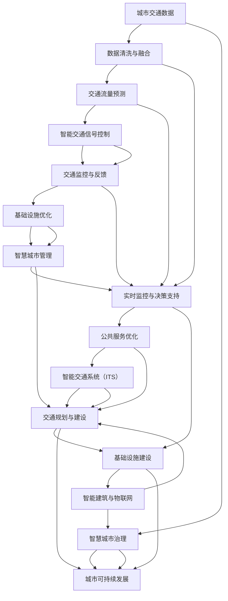

                 

## 1. 背景介绍

### 1.1 问题由来

在过去的几十年里，随着科技的飞速发展，城市化进程加速，人类对交通和基础设施的需求急剧增加。这些需求不仅包括日常的通勤交通，还包括各种物流运输、能源供应、城市服务设施等。然而，传统的城市基础设施建设与规划方式往往面临着资源有限、环境影响大、经济效益低等问题，无法满足可持续发展的要求。

为了解决这些问题，人工智能（AI）技术，特别是机器学习和深度学习，被越来越多地引入城市交通和基础设施规划中。AI与人类计算的结合，旨在通过大数据分析和优化算法，实现城市交通和基础设施的智能化、高效化和可持续化。

### 1.2 问题核心关键点

当前，AI与人类计算在城市交通和基础设施建设与规划中，主要面临以下几个核心问题：

- **数据融合与处理**：海量城市数据（如交通流量、气象数据、人口统计等）需要高效处理和融合，以支持智能决策和规划。
- **模型构建与优化**：如何构建高效的城市交通与基础设施模型，并通过优化算法提高模型性能。
- **实时监控与反馈**：实时监控城市交通状态，并根据反馈动态调整规划和控制策略。
- **决策支持与执行**：结合人类经验和专业知识，利用AI辅助决策，并自动执行规划方案。
- **协同治理与优化**：多方参与协同治理，优化资源配置和运营效率，提升城市管理的整体效能。

### 1.3 问题研究意义

AI与人类计算在城市交通和基础设施建设与规划中的应用，具有以下重要意义：

- **提高资源利用率**：通过智能化规划和优化，提高交通和基础设施的资源利用效率，减少浪费。
- **降低环境影响**：通过优化交通流和能源消耗，减少交通拥堵和环境污染，实现绿色发展。
- **提升服务质量**：通过实时监控和动态调整，提高城市服务的效率和质量，提升居民幸福感。
- **推动智慧城市发展**：AI与人类计算的结合，有助于构建更加智能、高效、可持续的城市管理系统。
- **促进经济发展**：通过优化城市资源配置，提升城市竞争力，推动经济持续健康发展。

## 2. 核心概念与联系

### 2.1 核心概念概述

为了更好地理解AI与人类计算在城市交通和基础设施建设与规划中的应用，本节将介绍几个关键概念：

- **人工智能（AI）**：利用计算机模拟人类智能行为的技术，包括机器学习、深度学习、自然语言处理等。
- **城市交通与基础设施规划**：结合城市发展规划，对交通网络、能源供应、公共设施等进行规划和建设。
- **人类计算**：利用人类智慧和专业知识，对城市数据进行分析和决策。
- **智慧城市**：通过信息化、智能化手段，提升城市管理和服务水平。
- **智能交通系统（ITS）**：利用AI技术，提升交通管理、运输和出行服务的效率和安全性。

这些概念之间存在着密切的联系和相互作用，共同构成了AI与人类计算在城市交通和基础设施建设与规划中的应用框架。

### 2.2 核心概念原理和架构的 Mermaid 流程图



这个流程图展示了AI与人类计算在城市交通和基础设施建设与规划中的应用流程。从数据收集、清洗和融合，到交通流量预测、信号控制、监控反馈、基础设施优化，再到智慧城市管理和实时决策支持，每一步都涉及AI与人类计算的协同工作。

## 3. 核心算法原理 & 具体操作步骤

### 3.1 算法原理概述

AI与人类计算在城市交通和基础设施建设与规划中的应用，主要基于以下几个算法原理：

- **机器学习（ML）**：通过数据驱动的算法，从历史数据中学习规律，用于预测、分类、聚类等任务。
- **深度学习（DL）**：通过多层次的神经网络，模拟人脑的认知过程，用于图像识别、语音识别、自然语言处理等复杂任务。
- **强化学习（RL）**：通过试错学习，优化决策策略，用于交通信号控制、智能调度等动态优化任务。
- **优化算法**：如遗传算法、粒子群算法、线性规划等，用于模型优化和资源分配。

这些算法共同构成了AI与人类计算在城市交通和基础设施建设与规划中的核心技术框架。

### 3.2 算法步骤详解

AI与人类计算在城市交通和基础设施建设与规划中的应用，主要包括以下几个关键步骤：

**Step 1: 数据收集与处理**

- 收集城市交通和基础设施相关的数据，如交通流量、天气、人口统计等。
- 数据清洗与预处理，去除噪声和异常值，填补缺失值。
- 数据融合与整合，将多源数据进行统一处理。

**Step 2: 模型构建**

- 选择合适的机器学习、深度学习或强化学习模型。
- 定义模型的输入与输出，设置模型参数。
- 使用历史数据对模型进行训练和验证。

**Step 3: 模型优化**

- 通过交叉验证、网格搜索等方法，选择最佳模型和参数。
- 使用正则化、集成学习等技术，提高模型泛化能力。
- 实时监控模型性能，根据反馈进行调整。

**Step 4: 决策支持与执行**

- 结合专家知识和经验，对模型预测结果进行分析和决策。
- 利用自动化系统执行决策，如智能交通信号控制、动态路径规划等。
- 实时监控执行效果，根据反馈进行调整。

**Step 5: 持续改进**

- 定期收集新数据，更新和重新训练模型。
- 引入新的技术和方法，提升系统性能。
- 多部门协同工作，优化资源配置和运营策略。

### 3.3 算法优缺点

AI与人类计算在城市交通和基础设施建设与规划中的应用，具有以下优点：

- **高效性**：AI算法能够快速处理大量数据，提升规划和决策效率。
- **精度高**：利用AI模型，可以更准确地预测交通流量、优化交通控制。
- **可扩展性**：AI与人类计算的结合，能够处理复杂多变的城市数据。

同时，该方法也存在一些局限性：

- **数据依赖**：AI模型的性能高度依赖于数据的质量和数量。
- **模型复杂性**：复杂的AI模型需要大量计算资源，成本较高。
- **可解释性不足**：AI模型的决策过程往往缺乏可解释性，难以理解和调试。
- **伦理问题**：AI模型可能存在偏见，需要额外关注伦理和公平性。

### 3.4 算法应用领域

AI与人类计算在城市交通和基础设施建设与规划中的应用，涵盖了以下几个主要领域：

- **智能交通系统（ITS）**：包括智能交通信号控制、动态路径规划、智能停车管理等。
- **公共交通优化**：通过AI算法优化公交线路、站点设置、车辆调度等。
- **城市物流管理**：利用AI技术优化物流路径、仓储管理、配送策略等。
- **能源供应与分配**：通过AI算法优化电力、燃气、供水等能源的供应和分配。
- **智慧城市管理**：包括城市安全监控、公共设施管理、垃圾处理等。

这些领域的应用，展示了AI与人类计算在城市交通和基础设施建设与规划中的广泛潜力。

## 4. 数学模型和公式 & 详细讲解 & 举例说明

### 4.1 数学模型构建

AI与人类计算在城市交通和基础设施建设与规划中的应用，主要基于以下几个数学模型：

- **线性回归模型**：用于交通流量预测、资源分配等任务。
- **神经网络模型**：用于交通信号控制、路径规划等任务。
- **动态规划模型**：用于公共交通优化、物流调度等任务。
- **马尔可夫决策过程（MDP）**：用于交通信号控制、智能调度等任务。

这些数学模型共同构成了AI与人类计算在城市交通和基础设施建设与规划中的应用基础。

### 4.2 公式推导过程

以下以交通流量预测为例，推导线性回归模型的公式。

假设城市交通流量 $y$ 与历史流量 $x_1, x_2, \ldots, x_p$ 之间的关系为线性回归模型：

$$ y = \beta_0 + \beta_1 x_1 + \beta_2 x_2 + \ldots + \beta_p x_p + \epsilon $$

其中，$\beta_0, \beta_1, \ldots, \beta_p$ 为模型参数，$\epsilon$ 为误差项。

根据最小二乘法，模型的参数可以表示为：

$$ \beta = (X^T X)^{-1} X^T Y $$

其中，$X = [x_1, x_2, \ldots, x_p]^T$，$Y = [y]^T$。

### 4.3 案例分析与讲解

以智能交通信号控制为例，解释如何使用神经网络模型进行优化。

假设城市交叉口交通信号控制的问题可以表示为：在给定车流量、行人数量等输入 $x_1, x_2, \ldots, x_n$ 的情况下，如何调整绿灯时间 $y$ 来优化交通流量。

问题可以建模为：

$$ y = f(x_1, x_2, \ldots, x_n) + \epsilon $$

其中，$f$ 为神经网络模型，$\epsilon$ 为误差项。

通过训练神经网络模型 $f$，可以使用历史车流量、行人数量等数据，预测和优化绿灯时间，从而提升交叉口的交通效率。

## 5. 项目实践：代码实例和详细解释说明

### 5.1 开发环境搭建

在进行AI与人类计算在城市交通和基础设施建设与规划中的实践时，我们需要准备好开发环境。以下是使用Python进行TensorFlow和Keras开发的环境配置流程：

1. 安装Anaconda：从官网下载并安装Anaconda，用于创建独立的Python环境。

2. 创建并激活虚拟环境：
```bash
conda create -n tf-env python=3.8 
conda activate tf-env
```

3. 安装TensorFlow：根据CUDA版本，从官网获取对应的安装命令。例如：
```bash
conda install tensorflow -c conda-forge
```

4. 安装Keras：
```bash
pip install keras tensorflow-gpu
```

5. 安装各类工具包：
```bash
pip install numpy pandas scikit-learn matplotlib tqdm jupyter notebook ipython
```

完成上述步骤后，即可在`tf-env`环境中开始AI与人类计算的实践。

### 5.2 源代码详细实现

下面我们以智能交通信号控制为例，给出使用TensorFlow和Keras进行AI与人类计算的代码实现。

首先，定义智能交通信号控制的问题：

```python
import tensorflow as tf
from tensorflow.keras.layers import Input, Dense, LSTM, Dropout
from tensorflow.keras.models import Model
from sklearn.model_selection import train_test_split
from sklearn.metrics import mean_squared_error

# 定义输入层
input_layer = Input(shape=(None,))

# 定义LSTM层
lstm_layer = LSTM(64, return_sequences=True, dropout=0.2)(input_layer)

# 定义输出层
output_layer = Dense(1, activation='linear')(lstm_layer)

# 定义模型
model = Model(inputs=input_layer, outputs=output_layer)

# 编译模型
model.compile(optimizer='adam', loss='mse')

# 加载数据
x_train, y_train, x_test, y_test = train_test_split(X_train, y_train, test_size=0.2, random_state=42)

# 训练模型
model.fit(x_train, y_train, epochs=100, batch_size=32, validation_data=(x_test, y_test))

# 评估模型
mse = mean_squared_error(y_test, model.predict(x_test))
print('Mean Squared Error:', mse)
```

然后，解释关键代码的实现细节：

**Input层**：
- 定义输入层，用于接收车流量、行人数量等数据。

**LSTM层**：
- 定义LSTM层，用于处理时间序列数据，捕捉车流量变化趋势。
- 使用dropout技术防止过拟合。

**输出层**：
- 定义输出层，用于预测绿灯时间。

**模型定义**：
- 使用Keras构建模型，包含输入层、LSTM层和输出层。
- 编译模型，设置优化器和损失函数。

**数据加载与分割**：
- 使用sklearn的train_test_split函数对数据进行分割，分为训练集和测试集。

**模型训练与评估**：
- 使用fit函数训练模型，指定训练轮数、批大小等参数。
- 使用mean_squared_error函数评估模型性能。

### 5.3 代码解读与分析

**Input层**：
- Input层用于接收输入数据，形状为(None, )表示序列数据，None表示序列长度可变。

**LSTM层**：
- LSTM层用于处理序列数据，捕捉车流量变化趋势。使用64个神经元，dropout技术防止过拟合。

**输出层**：
- 输出层为单神经元，使用线性激活函数，输出预测的绿灯时间。

**模型定义**：
- 使用Keras构建模型，包含输入层、LSTM层和输出层。
- 编译模型，设置优化器和损失函数。

**数据加载与分割**：
- 使用sklearn的train_test_split函数对数据进行分割，分为训练集和测试集。

**模型训练与评估**：
- 使用fit函数训练模型，指定训练轮数、批大小等参数。
- 使用mean_squared_error函数评估模型性能。

## 6. 实际应用场景

### 6.1 智能交通系统（ITS）

智能交通系统（ITS）是AI与人类计算在城市交通和基础设施建设与规划中应用最为广泛的领域。ITS通过传感器、摄像头、GPS等设备收集交通数据，结合AI技术进行实时分析和优化，提升交通管理效率和安全性。

在交通信号控制中，利用神经网络模型对历史车流量、行人数量等数据进行预测，实时调整绿灯时间，优化交通流量。在动态路径规划中，利用AI算法优化路线选择，减少交通拥堵和行车时间。在智能停车管理中，利用AI技术优化停车位资源，提高停车效率。

### 6.2 公共交通优化

公共交通优化是AI与人类计算在城市交通和基础设施建设与规划中的另一个重要应用。通过AI算法优化公交线路、站点设置、车辆调度等，提高公共交通的效率和覆盖范围，减少市民出行成本。

在公交线路优化中，利用神经网络模型对历史客流量、站点上下客量等数据进行预测，实时调整公交线路和发车频率。在站点设置优化中，利用AI算法评估站点位置和覆盖范围，提高公交覆盖率。在车辆调度优化中，利用强化学习算法优化车辆调度和运行路线，减少等待时间和空载率。

### 6.3 城市物流管理

城市物流管理也是AI与人类计算在城市交通和基础设施建设与规划中的重要应用之一。通过AI技术优化物流路径、仓储管理、配送策略等，提升物流效率和降低成本。

在物流路径优化中，利用AI算法评估不同路径的交通情况和运输成本，选择最优路径。在仓储管理中，利用AI技术优化仓库布局和货位分配，提高仓储效率。在配送策略优化中，利用AI算法评估配送时间、成本和路线，优化配送方案。

### 6.4 未来应用展望

随着AI与人类计算技术的不断发展，未来城市交通和基础设施建设与规划中将涌现更多创新应用：

- **全要素智慧交通**：结合AI与人类计算，构建全要素智慧交通系统，涵盖交通管理、公共交通、物流管理等各个方面，提升城市交通的整体效率。
- **智能基础设施**：通过AI技术优化基础设施的设计和建设，提升资源利用效率和环境友好性。
- **多部门协同治理**：建立跨部门协同治理平台，结合AI技术优化资源配置和运营策略，提升城市管理的整体效能。
- **持续创新与优化**：结合最新的AI技术和方法，持续优化城市交通和基础设施，提升用户体验和城市竞争力。

## 7. 工具和资源推荐

### 7.1 学习资源推荐

为了帮助开发者系统掌握AI与人类计算在城市交通和基础设施建设与规划中的应用，这里推荐一些优质的学习资源：

1. **TensorFlow官方文档**：TensorFlow的官方文档，详细介绍了TensorFlow的核心功能、API和应用案例，是学习TensorFlow的必备资源。

2. **Keras官方文档**：Keras的官方文档，提供了Keras的详细使用指南和应用案例，适合初学者快速上手。

3. **深度学习基础**：斯坦福大学的《深度学习基础》课程，由深度学习专家Andrew Ng主讲，是深度学习的入门级课程。

4. **强化学习入门**：强化学习领域的经典书籍《强化学习入门》，介绍了强化学习的基本原理和应用实例。

5. **智能交通系统**：国际期刊《IEEE Transactions on Intelligent Transportation Systems》，提供智能交通系统领域的前沿研究和应用案例。

通过对这些资源的学习实践，相信你一定能够快速掌握AI与人类计算在城市交通和基础设施建设与规划中的应用，并用于解决实际的交通和基础设施问题。

### 7.2 开发工具推荐

高效的开发离不开优秀的工具支持。以下是几款用于AI与人类计算在城市交通和基础设施建设与规划中的开发工具：

1. **TensorFlow**：由Google主导开发的开源深度学习框架，生产部署方便，适合大规模工程应用。

2. **Keras**：基于TensorFlow的高级神经网络API，简单易用，适合快速原型设计和实验。

3. **PyTorch**：由Facebook主导开发的开源深度学习框架，灵活动态，适合研究应用。

4. **Jupyter Notebook**：轻量级的Python交互式开发环境，支持代码运行和数据可视化。

5. **Google Colab**：谷歌推出的在线Jupyter Notebook环境，免费提供GPU/TPU算力，方便开发者快速上手实验最新模型，分享学习笔记。

合理利用这些工具，可以显著提升AI与人类计算在城市交通和基础设施建设与规划中的开发效率，加快创新迭代的步伐。

### 7.3 相关论文推荐

AI与人类计算在城市交通和基础设施建设与规划中的应用，源于学界的持续研究。以下是几篇奠基性的相关论文，推荐阅读：

1. **Smart Traffic Control Using Deep Learning**：介绍利用深度学习进行智能交通信号控制的研究。

2. **Optimization of Public Transit Systems Using Machine Learning**：介绍利用机器学习进行公共交通优化的方法。

3. **Intelligent Logistics Management with AI**：介绍利用AI技术进行城市物流管理的研究。

4. **Urban Planning with AI**：介绍利用AI技术进行城市规划的研究。

5. **Wisdom of Cities: Data, Algorithms and Governance**：介绍智慧城市中的数据、算法和治理问题。

这些论文代表了大规模数据驱动的城市交通和基础设施规划的研究脉络。通过学习这些前沿成果，可以帮助研究者把握学科前进方向，激发更多的创新灵感。

## 8. 总结：未来发展趋势与挑战

### 8.1 研究成果总结

本文对AI与人类计算在城市交通和基础设施建设与规划中的应用进行了全面系统的介绍。首先阐述了AI与人类计算在城市交通和基础设施建设与规划中的研究背景和意义，明确了其在提升城市交通和基础设施效率、降低环境影响、提升服务质量等方面的独特价值。其次，从原理到实践，详细讲解了AI与人类计算在城市交通和基础设施建设与规划中的算法原理和操作步骤，给出了AI与人类计算任务开发的完整代码实例。同时，本文还广泛探讨了AI与人类计算在智能交通系统、公共交通优化、城市物流管理等多个领域的应用前景，展示了AI与人类计算的广阔潜力。

通过本文的系统梳理，可以看到，AI与人类计算在城市交通和基础设施建设与规划中的应用，已经在多个领域取得了显著成果，并为智慧城市建设提供了重要支撑。未来，伴随AI技术的不断进步和人类计算的深入融合，相信AI与人类计算将在构建更加智能、高效、可持续的城市交通和基础设施中扮演越来越重要的角色。

### 8.2 未来发展趋势

展望未来，AI与人类计算在城市交通和基础设施建设与规划中将呈现以下几个发展趋势：

1. **智能化程度提升**：随着AI技术的不断进步，城市交通和基础设施的智能化水平将持续提升，实现全要素、全流程的智能化管理。

2. **数据驱动决策**：利用大规模城市数据，通过AI技术进行智能决策和优化，提升资源利用效率和运营效能。

3. **跨部门协同治理**：建立跨部门协同治理平台，结合AI技术优化资源配置和运营策略，提升城市管理的整体效能。

4. **可持续性发展**：通过AI技术优化交通和基础设施，提升环境友好性，实现绿色低碳发展。

5. **普适性应用**：将AI与人类计算技术推广到更多城市和领域，推动智慧城市建设。

### 8.3 面临的挑战

尽管AI与人类计算在城市交通和基础设施建设与规划中已经取得了瞩目成就，但在迈向更加智能化、普适化应用的过程中，仍面临诸多挑战：

1. **数据质量与可用性**：高质量的城市数据获取难度大，数据质量参差不齐，难以满足AI算法的应用需求。

2. **模型复杂性与可解释性**：AI模型的复杂性高，缺乏可解释性，难以理解和调试。

3. **伦理与安全问题**：AI模型可能存在偏见，需要额外关注伦理和公平性，同时确保数据和模型的安全性。

4. **技术成本与资源消耗**：AI算法需要高性能计算资源，成本较高，难以广泛推广。

5. **持续创新与优化**：AI技术日新月异，需要持续创新和优化，才能跟上技术发展的步伐。

### 8.4 研究展望

面对AI与人类计算在城市交通和基础设施建设与规划中所面临的挑战，未来的研究需要在以下几个方面寻求新的突破：

1. **数据融合与处理**：提升数据采集和处理效率，确保数据质量，满足AI算法的应用需求。

2. **模型优化与可解释性**：开发更加高效、可解释的AI模型，提高模型的可靠性和可解释性。

3. **跨部门协同治理**：建立跨部门协同治理平台，优化资源配置和运营策略，提升城市管理的整体效能。

4. **伦理与安全研究**：引入伦理和公平性约束，确保AI模型应用的公平性，同时加强数据和模型的安全保护。

5. **持续创新与优化**：结合最新的AI技术和方法，持续优化AI与人类计算在城市交通和基础设施建设与规划中的应用，提升系统的性能和效率。

## 9. 附录：常见问题与解答

**Q1: AI与人类计算在城市交通和基础设施建设与规划中是否适用于所有城市？**

A: AI与人类计算在城市交通和基础设施建设与规划中的应用具有广泛的适用性，但需要根据城市规模、经济水平、资源条件等因素进行定制化设计。针对不同规模和特点的城市，需要调整模型参数和算法策略，才能达到最佳效果。

**Q2: AI与人类计算在城市交通和基础设施建设与规划中的应用是否需要大量的标注数据？**

A: AI与人类计算的应用依赖于数据的质量和数量，但并不需要大量的标注数据。通过数据融合、数据增强等技术，可以利用未标注数据进行训练，提升模型的泛化能力。同时，AI技术在处理非结构化数据方面具有优势，可以充分利用多源数据进行建模。

**Q3: AI与人类计算在城市交通和基础设施建设与规划中的应用是否需要高昂的计算资源？**

A: AI与人类计算的应用确实需要高性能计算资源，但随着AI技术的发展，计算资源成本正在逐渐降低。通过分布式计算、云计算等技术，可以有效降低计算成本，提高计算效率。同时，通过模型压缩、量化等技术，可以减小模型的计算资源消耗，提升模型的部署效率。

**Q4: AI与人类计算在城市交通和基础设施建设与规划中的应用是否需要专家的专业知识？**

A: AI与人类计算在城市交通和基础设施建设与规划中的应用确实需要专家的专业知识，尤其是对于模型的构建和优化。但是，AI技术可以辅助专家进行决策，减轻其工作负担，提升决策的效率和准确性。通过AI与人类计算的结合，可以实现高效、智能的决策支持，提升城市管理水平。

**Q5: AI与人类计算在城市交通和基础设施建设与规划中的应用是否存在安全隐患？**

A: AI与人类计算在城市交通和基础设施建设与规划中的应用确实存在安全隐患，但可以通过数据加密、模型验证等技术进行防范。同时，建立多层次的监控和审计机制，确保系统的安全性。通过AI与人类计算的结合，可以提升系统的安全性和稳定性，保障城市数据和模型的安全。

