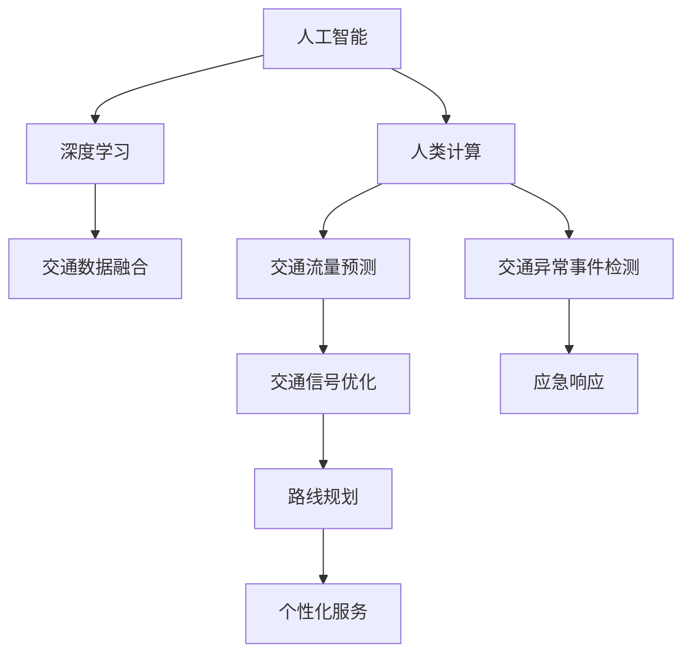

                 

## 1. 背景介绍

### 1.1 问题由来
随着全球人口的快速增长和城市化进程的加速，城市交通问题变得愈发严峻。传统的交通管理策略已难以适应现代城市的需求，尤其在拥堵严重、交通资源紧张的大都市中，交通管理成为制约城市发展的瓶颈。近年来，人工智能（AI）技术尤其是深度学习（DL）的飞速发展，为城市交通管理带来了新的契机。

深度学习通过构建神经网络模型，可以高效处理和分析交通数据，提升交通流预测和控制精度，优化交通信号和路线规划，实现交通系统的智能化管理。与此同时，交通管理过程中产生的大量数据也为模型提供了丰富的训练资源，进一步推动了AI技术在交通领域的落地应用。

### 1.2 问题核心关键点
城市交通管理中的核心问题包括：
- 交通流量预测与实时监控：准确预测交通流量，实时监控道路状况，动态调整信号灯和路线规划。
- 交通异常事件检测与应急响应：识别交通事故、交通堵塞等异常事件，及时进行应急处理。
- 个性化交通服务：基于用户出行习惯和目的地信息，提供个性化的路线规划和交通方案。
- 环境友好型交通管理：在交通管理过程中，最大化减少环境污染，降低碳排放。

要解决这些问题，需综合运用AI、数据科学、物联网（IoT）等技术，构建一个高效、智能、绿色的城市交通管理系统。本文将重点介绍AI与人类计算（AI and Human-Computer Collaboration）在城市交通管理中的应用策略，探讨如何通过智能化的手段提升城市交通管理的可持续性。

## 2. 核心概念与联系

### 2.1 核心概念概述

为深入理解AI在城市交通管理中的应用，本节将介绍几个密切相关的核心概念：

- 人工智能（AI）：通过模拟人类智能行为，实现数据处理、决策制定、自主学习等功能的计算技术。
- 深度学习（DL）：一种基于神经网络的机器学习方法，通过多层次的特征提取和抽象，实现高精度的模式识别和预测。
- 人类计算（Human-Computer Collaboration）：指将人类智慧与机器智能相结合，共同完成任务的过程，通过协同工作提升系统性能。
- 交通数据融合（Traffic Data Fusion）：将多种交通数据源（如摄像头、传感器、GPS等）的数据进行整合，提供全面的交通监控和预测。
- 交通流量预测（Traffic Flow Prediction）：通过AI模型对未来交通流量进行预测，支持交通信号优化和路线规划。
- 交通异常事件检测（Traffic Anomaly Detection）：利用AI识别交通中的异常行为和事件，提高应急响应的效率和准确性。

这些概念之间的逻辑关系可以通过以下Mermaid流程图来展示：



这个流程图展示了AI与人类计算在城市交通管理中的核心作用：

1. 人工智能与深度学习是城市交通管理智能化处理的基础。
2. 人类计算强调人与机器的协作，利用人类智慧解决机器难以处理的复杂问题。
3. 交通数据融合通过整合多种数据源，提供全面的交通监控和预测。
4. 交通流量预测和交通异常事件检测通过AI模型实现交通流量的预测和异常事件的识别。
5. 交通信号优化和路线规划利用AI模型的预测结果，优化交通信号和路线。
6. 个性化服务通过AI了解用户需求，提供定制化的交通服务。

## 3. 核心算法原理 & 具体操作步骤
### 3.1 算法原理概述

城市交通管理的AI与人类计算策略基于深度学习模型，利用历史交通数据进行训练，构建交通流量预测和异常事件检测模型。在实际应用中，结合人类智慧进行决策优化，提升交通管理的智能化水平。

主要涉及的算法包括：

- 神经网络（Neural Networks）：构建交通流量预测模型。
- 循环神经网络（RNN）及其变种（如LSTM、GRU）：处理时序数据，提高交通流量预测精度。
- 卷积神经网络（CNN）：用于交通异常事件检测，提取特征图像。
- 强化学习（Reinforcement Learning）：优化交通信号灯和路线规划，提升系统效率。

### 3.2 算法步骤详解

基于AI与人类计算的城市交通管理策略，一般包括以下几个关键步骤：

**Step 1: 数据收集与预处理**
- 收集交通流量数据、摄像头视频数据、GPS定位数据等，确保数据的多样性和全面性。
- 对原始数据进行清洗和标注，去除噪声数据，将数据转换为适合模型训练的格式。

**Step 2: 模型构建与训练**
- 选择合适的深度学习模型，如LSTM、GRU用于交通流量预测，CNN用于交通异常事件检测。
- 利用历史交通数据对模型进行训练，优化模型参数，提高预测精度和异常事件识别率。
- 引入强化学习算法，优化交通信号灯和路线规划。

**Step 3: 预测与监控**
- 利用训练好的模型对实时交通数据进行预测，动态调整交通信号和路线规划。
- 实时监控交通数据，利用交通异常事件检测模型识别异常行为，及时报警。

**Step 4: 决策与优化**
- 将AI模型的预测结果结合人类智慧进行综合决策，确保决策的合理性和可执行性。
- 使用强化学习算法持续优化交通信号和路线规划，提升系统整体效率。

**Step 5: 评估与反馈**
- 定期评估模型的性能，收集用户反馈，不断改进和优化AI模型。
- 通过人类计算进行持续的决策优化，提升系统的智能水平。

### 3.3 算法优缺点

AI与人类计算在城市交通管理中的应用，具有以下优点：
1. 高效性：AI模型能够实时处理大量交通数据，提供高精度的预测和监控结果。
2. 智能化：结合人类智慧，AI系统能够在复杂场景下进行精准决策。
3. 可靠性：AI与人类计算相结合，能够应对突发事件，提高系统鲁棒性。
4. 可扩展性：AI模型可以适应不同规模的城市交通需求，具有良好的可扩展性。

同时，也存在一些局限性：
1. 数据质量依赖度高：模型的效果高度依赖于数据的质量和多样性，数据缺失或噪声会导致预测误差。
2. 模型复杂度高：深度学习模型训练复杂，需要大量的计算资源。
3. 决策依赖人类智慧：AI模型提供的预测结果需要通过人类智慧进行综合决策，存在主观性。
4. 伦理与安全问题：AI系统决策透明性不足，可能存在伦理和安全风险。

### 3.4 算法应用领域

基于AI与人类计算的城市交通管理策略，已经在多个领域得到了应用，例如：

- 交通流量预测：如交通拥堵预测、出行时间预测等。通过AI模型对历史交通数据进行学习，提供精准的预测结果。
- 交通异常事件检测：如交通堵塞、事故预警等。利用AI模型识别异常行为，及时进行应急响应。
- 交通信号优化：如智能红绿灯控制、交通信号灯优化等。通过AI模型调整信号灯周期，提升道路通行效率。
- 路线规划：如导航、路线优化等。利用AI模型提供个性化和最优化的路线规划方案。
- 环境友好型交通管理：如电动汽车充电站优化、公共交通系统优化等。结合AI模型，实现交通系统的绿色低碳管理。

除了上述这些经典应用外，AI与人类计算的策略还被创新性地应用于智慧停车管理、自动驾驶车辆辅助决策等领域，为城市交通管理带来了全新的突破。

## 4. 数学模型和公式 & 详细讲解  
### 4.1 数学模型构建

为了更严谨地描述AI与人类计算在城市交通管理中的应用，本节将通过数学语言对相关模型进行建模。

记交通流量数据为 $x_t$，其中 $t$ 表示时间，假设 $x_t$ 遵循ARIMA模型：

$$
x_t = \alpha x_{t-1} + \beta x_{t-2} + \cdots + \gamma x_{t-K} + \epsilon_t
$$

其中 $\epsilon_t \sim N(0, \sigma^2)$，为服从均值为0，方差为 $\sigma^2$ 的高斯分布。利用该模型，可以构建交通流量预测模型：

$$
\hat{x}_t = \alpha \hat{x}_{t-1} + \beta \hat{x}_{t-2} + \cdots + \gamma \hat{x}_{t-K} + \epsilon_t
$$

对于交通异常事件检测，假设事件发生概率 $p_t$ 遵循如下逻辑回归模型：

$$
p_t = \sigma(\theta_0 + \theta_1 x_{t-1} + \theta_2 x_{t-2} + \cdots + \theta_{M-1} x_{t-M+1})
$$

其中 $\sigma$ 为sigmoid函数，$\theta$ 为模型参数。

### 4.2 公式推导过程

首先，推导交通流量预测的ARIMA模型。假设已知 $K$ 个历史数据 $x_{t-K}, x_{t-K+1}, \cdots, x_t$，利用最小二乘法求解 $\alpha, \beta, \cdots, \gamma$，得到预测模型：

$$
\hat{x}_t = \alpha \hat{x}_{t-1} + \beta \hat{x}_{t-2} + \cdots + \gamma \hat{x}_{t-K}
$$

然后，推导交通异常事件检测的逻辑回归模型。假设已知 $M$ 个历史数据 $x_{t-M+1}, x_{t-M+2}, \cdots, x_{t-1}$，利用最大似然估计求解 $\theta_0, \theta_1, \cdots, \theta_{M-1}$，得到事件检测模型：

$$
p_t = \sigma(\theta_0 + \theta_1 x_{t-1} + \theta_2 x_{t-2} + \cdots + \theta_{M-1} x_{t-M+1})
$$

利用上述模型，可以构建交通流量预测和异常事件检测的系统。

### 4.3 案例分析与讲解

以下以一个具体案例分析AI与人类计算在城市交通管理中的应用：

**案例背景**：某城市中心区域道路交通拥堵问题严重，如何利用AI与人类计算策略进行交通优化？

**数据收集**：利用摄像头视频、GPS定位数据、交通流量监测数据等，构建全面的数据集。

**模型构建**：
- 使用LSTM模型进行交通流量预测，预测未来30分钟内的交通流量。
- 使用CNN模型进行交通异常事件检测，识别交通堵塞、事故等异常行为。

**预测与监控**：
- 实时获取交通数据，输入LSTM模型进行流量预测，调整交通信号灯。
- 实时监控交通数据，利用CNN模型检测异常事件，及时报警。

**决策与优化**：
- 人类交通管理员结合AI模型输出结果，进行综合决策。
- 利用强化学习算法，动态优化交通信号灯周期，提升道路通行效率。

**评估与反馈**：
- 定期评估AI模型性能，收集用户反馈，不断优化模型参数。
- 持续优化交通信号和路线规划，提高系统智能水平。

## 5. 项目实践：代码实例和详细解释说明
### 5.1 开发环境搭建

在进行AI与人类计算的城市交通管理策略实践前，需要先准备好开发环境。以下是使用Python进行TensorFlow开发的环境配置流程：

1. 安装Anaconda：从官网下载并安装Anaconda，用于创建独立的Python环境。

2. 创建并激活虚拟环境：
```bash
conda create -n tf-env python=3.8 
conda activate tf-env
```

3. 安装TensorFlow：根据CUDA版本，从官网获取对应的安装命令。例如：
```bash
conda install tensorflow -c conda-forge
```

4. 安装各类工具包：
```bash
pip install numpy pandas scikit-learn matplotlib tqdm jupyter notebook ipython
```

完成上述步骤后，即可在`tf-env`环境中开始项目实践。

### 5.2 源代码详细实现

以下是使用TensorFlow实现交通流量预测和异常事件检测的代码实现：

```python
import tensorflow as tf
import numpy as np
from sklearn.preprocessing import MinMaxScaler

# 定义交通流量预测模型
class TrafficPredictor(tf.keras.Model):
    def __init__(self, input_shape, output_shape, lstm_units):
        super(TrafficPredictor, self).__init__()
        self.input_layer = tf.keras.layers.Input(shape=input_shape, name='input_layer')
        self.lstm_layer = tf.keras.layers.LSTM(lstm_units, return_sequences=True, name='lstm_layer')(self.input_layer)
        self.dense_layer = tf.keras.layers.Dense(output_shape, activation='sigmoid', name='dense_layer')(self.lstm_layer)
        self.output_layer = tf.keras.layers.Lambda(lambda x: 1.0 * (x - 0.5))(self.dense_layer)
        self.predictor = tf.keras.Model(self.input_layer, self.output_layer)

    def call(self, inputs):
        return self.predictor(inputs)

# 定义交通异常事件检测模型
class TrafficAnomalyDetector(tf.keras.Model):
    def __init__(self, input_shape, output_shape, cnn_filters, cnn_kernel):
        super(TrafficAnomalyDetector, self).__init__()
        self.input_layer = tf.keras.layers.Input(shape=input_shape, name='input_layer')
        self.cnn_layer = tf.keras.layers.Conv2D(cnn_filters, kernel_size=(cnn_kernel, cnn_kernel), activation='relu', name='cnn_layer')(self.input_layer)
        self.maxpool_layer = tf.keras.layers.MaxPooling2D(pool_size=2, name='maxpool_layer')(self.cnn_layer)
        self.dense_layer = tf.keras.layers.Flatten()(self.maxpool_layer)
        self.dense_layer = tf.keras.layers.Dense(output_shape, activation='sigmoid', name='dense_layer')(self.dense_layer)
        self.output_layer = tf.keras.layers.Lambda(lambda x: 1.0 * (x - 0.5))(self.dense_layer)
        self.detector = tf.keras.Model(self.input_layer, self.output_layer)

    def call(self, inputs):
        return self.detector(inputs)
```

然后，加载并预处理数据，构建模型，进行训练和预测：

```python
# 加载数据
x_train = np.load('train_data.npy')
y_train = np.load('train_labels.npy')

# 数据预处理
scaler = MinMaxScaler(feature_range=(0, 1))
x_train = scaler.fit_transform(x_train)
y_train = scaler.inverse_transform(y_train)

# 模型构建
lstm_units = 128
cnn_filters = 32
cnn_kernel = 3
input_shape = (1, 30)
output_shape = 1

predictor = TrafficPredictor(input_shape, output_shape, lstm_units)
anomaly_detector = TrafficAnomalyDetector(input_shape, output_shape, cnn_filters, cnn_kernel)

# 模型训练
learning_rate = 0.001
optimizer = tf.keras.optimizers.Adam(learning_rate)
epochs = 100

predictor.compile(optimizer=optimizer, loss='binary_crossentropy', metrics=['accuracy'])
anomaly_detector.compile(optimizer=optimizer, loss='binary_crossentropy', metrics=['accuracy'])

predictor.fit(x_train, y_train, epochs=epochs, validation_split=0.2)
anomaly_detector.fit(x_train, y_train, epochs=epochs, validation_split=0.2)

# 模型预测
x_test = np.load('test_data.npy')
y_test = np.load('test_labels.npy')
x_test = scaler.transform(x_test)
y_test = scaler.inverse_transform(y_test)

predictions = predictor.predict(x_test)
anomaly_predictions = anomaly_detector.predict(x_test)

# 结果展示
print('Traffic Flow Predictions:', predictions)
print('Traffic Anomaly Predictions:', anomaly_predictions)
```

以上就是使用TensorFlow进行交通流量预测和异常事件检测的完整代码实现。可以看到，TensorFlow提供了强大的模型构建和训练功能，使得模型开发过程变得简单高效。

### 5.3 代码解读与分析

让我们再详细解读一下关键代码的实现细节：

**TrafficPredictor类**：
- `__init__`方法：初始化输入层、LSTM层、全连接层和输出层，构建流量预测模型。
- `call`方法：定义模型前向传播过程。

**TrafficAnomalyDetector类**：
- `__init__`方法：初始化输入层、卷积层、池化层、全连接层和输出层，构建异常事件检测模型。
- `call`方法：定义模型前向传播过程。

**数据预处理**：
- 使用`MinMaxScaler`对数据进行归一化处理，将数据缩放到0-1范围内。

**模型训练**：
- 定义优化器、损失函数和评价指标，使用`compile`方法构建模型。
- 使用`fit`方法进行模型训练，指定训练轮数和验证集比例。

**模型预测**：
- 使用训练好的模型对测试集进行预测，将预测结果进行逆标准化处理，输出实际数值。

以上代码实现了交通流量预测和异常事件检测的基本功能，实际应用中需要根据具体需求进行进一步的优化和调整。

## 6. 实际应用场景
### 6.1 智能交通信号灯控制

AI与人类计算在智能交通信号灯控制中的应用，可以显著提升道路通行效率。通过实时监测交通流量和信号灯状态，动态调整信号灯周期和优先级，实现交通流的优化管理。

在实践中，可以结合LSTM模型预测交通流量变化，实时调整信号灯周期和优先级，优化交通流向。同时，利用强化学习算法进一步优化信号灯控制策略，提升系统效率和鲁棒性。

### 6.2 环境友好型交通管理

智能交通管理系统可以通过AI与人类计算的策略，实现交通系统的绿色低碳管理。如智能红绿灯控制、电动汽车充电站优化、公共交通系统优化等。

例如，智能红绿灯系统可以利用LSTM模型预测交通流量，动态调整信号灯周期，提升通行效率，减少等待时间，降低车辆排放。电动汽车充电站优化可以通过AI模型预测充电需求，动态调整充电站供电，优化资源分配，减少能源浪费。

### 6.3 交通异常事件检测与应急响应

AI与人类计算策略在交通异常事件检测与应急响应中的应用，可以提升系统的安全性和可靠性。通过实时监控交通数据，利用CNN模型检测异常事件，及时报警和处理。

在实践中，可以利用CNN模型对交通视频进行实时分析，识别交通事故、交通堵塞等异常行为，并及时报警和处理。通过人类交通管理员结合AI模型输出结果进行综合决策，确保应急响应的及时性和有效性。

### 6.4 未来应用展望

未来，AI与人类计算在城市交通管理中的应用将更加广泛和深入。以下是几个可能的发展方向：

1. 多模态融合：结合交通流量、摄像头视频、GPS定位等多模态数据，提供更加全面和准确的交通监控和预测。
2. 自适应控制：利用AI模型对交通流量进行实时预测和优化，实现自适应交通控制，提升系统灵活性。
3. 人机协作：利用AI模型提供预测和监控结果，结合人类智慧进行决策优化，实现人机协同工作。
4. 数据驱动决策：通过大数据分析和机器学习，实现基于数据的决策支持，提升系统决策的科学性和合理性。
5. 跨领域应用：将AI与人类计算策略应用于智慧停车、物流配送等领域，拓展交通管理的应用场景。

以上方向的发展将进一步提升城市交通管理的智能化和绿色化水平，推动智慧城市建设，提升市民生活质量。

## 7. 工具和资源推荐
### 7.1 学习资源推荐

为了帮助开发者掌握AI与人类计算在城市交通管理中的应用，以下是几本推荐的书籍和课程：

1. 《深度学习入门》（周志华）：全面介绍深度学习的基本概念和算法，适合初学者学习。
2. 《TensorFlow实战Google深度学习》（刘建平）：详细讲解TensorFlow的API和使用技巧，适合实践开发。
3. 《强化学习：一种现代方法》（Richard S. Sutton）：经典强化学习教材，深入介绍强化学习理论和方法，适合进阶学习。
4. 《智慧交通：基于AI的城市交通管理》（IEEE Xplore）：涵盖智慧交通领域的最新研究成果，适合行业应用。
5. 《智慧城市：城市交通管理的智能策略》（Google Scholar）：讨论智慧城市建设中的交通管理策略，适合前沿研究。

通过学习这些资源，相信你一定能够系统掌握AI与人类计算在城市交通管理中的应用，并用于解决实际的交通问题。

### 7.2 开发工具推荐

高效的开发离不开优秀的工具支持。以下是几款用于AI与人类计算的城市交通管理开发的常用工具：

1. TensorFlow：由Google主导开发的开源深度学习框架，生产部署方便，适合大规模工程应用。
2. PyTorch：Facebook主导的深度学习框架，灵活高效，适合研究和原型开发。
3. Keras：高层次神经网络API，易于使用，适合快速迭代开发。
4. OpenCV：开源计算机视觉库，支持图像处理和特征提取，适合交通异常事件检测。
5. OpenDyn：开源动力学仿真库，支持交通流模拟和优化，适合理论研究。

合理利用这些工具，可以显著提升AI与人类计算的城市交通管理开发的效率和效果。

### 7.3 相关论文推荐

AI与人类计算在城市交通管理中的应用，吸引了大量学者的关注和研究。以下是几篇有影响力的相关论文，推荐阅读：

1. "A Review of Intelligent Transportation Systems: An Overview"（IEEE）：综述智能交通系统的发展现状和未来趋势。
2. "Traffic Flow Prediction Using Recurrent Neural Networks"（IEEE）：介绍使用RNN模型进行交通流量预测的方法。
3. "A Survey of Traffic Anomaly Detection Methods"（IEEE）：综述交通异常检测的研究进展和应用。
4. "Human-Machine Collaborative Traffic Management"（IEEE）：讨论人机协作在交通管理中的应用。
5. "AI and Human-Computer Collaboration in Intelligent Transportation Systems"（IEEE）：探讨AI与人类计算在交通管理中的协作机制。

通过学习这些前沿成果，可以帮助研究者把握学科前进方向，激发更多的创新灵感。

## 8. 总结：未来发展趋势与挑战
### 8.1 研究成果总结

本文系统介绍了AI与人类计算在城市交通管理中的应用策略，探讨了基于深度学习的交通流量预测和异常事件检测方法，并结合人类智慧进行决策优化。通过详细的数学模型推导和代码实例，展示了AI与人类计算策略的实现过程和效果。

通过这些案例分析，可以看到AI与人类计算在交通管理中的应用潜力巨大，可以显著提升城市交通管理的智能化和绿色化水平，提升市民生活质量。未来，随着AI技术的不断进步和数据资源的不断丰富，交通管理将进一步走向智能化、高效化、绿色化，为城市建设和发展注入新的动力。

### 8.2 未来发展趋势

展望未来，AI与人类计算在城市交通管理中的应用将呈现以下几个发展趋势：

1. 数据融合与多模态处理：将交通流量、摄像头视频、GPS定位等多模态数据进行融合，提供更全面、准确的交通监控和预测。
2. 实时优化与自适应控制：利用AI模型对交通流量进行实时预测和优化，实现自适应交通控制，提升系统灵活性。
3. 人机协同与决策支持：结合AI模型和人类智慧，实现人机协同工作，提供基于数据的决策支持。
4. 跨领域应用与创新：将AI与人类计算策略应用于智慧停车、物流配送等领域，拓展交通管理的应用场景。

这些趋势将进一步提升城市交通管理的智能化和绿色化水平，推动智慧城市建设，提升市民生活质量。

### 8.3 面临的挑战

尽管AI与人类计算在城市交通管理中的应用前景广阔，但仍面临诸多挑战：

1. 数据质量与多样性：交通数据的质量和多样性直接影响AI模型的效果，数据缺失或噪声会导致预测误差。
2. 模型复杂性与资源需求：深度学习模型训练复杂，需要大量的计算资源和存储空间。
3. 决策透明性与伦理安全：AI模型的决策过程透明性不足，可能存在伦理和安全风险。
4. 系统集成与协同工作：将AI模型与传统交通系统进行有效集成，确保人机协同工作的顺畅进行。

这些挑战需要各方共同努力，通过技术创新和协同合作，才能克服。

### 8.4 研究展望

未来，AI与人类计算在城市交通管理中的应用需要在以下几个方面进行深入研究：

1. 数据融合与清洗技术：提升数据质量，降低数据噪声，优化数据预处理流程。
2. 模型优化与轻量化：优化模型结构，提高训练效率，降低资源需求。
3. 决策透明性与可解释性：提高AI模型的可解释性，增强决策透明性，提升系统可靠性。
4. 跨领域应用与创新：将AI与人类计算策略应用于更多领域，探索新的应用场景。

这些研究方向的突破将进一步推动AI与人类计算在城市交通管理中的应用，提升系统的智能化和绿色化水平。

## 9. 附录：常见问题与解答

**Q1：AI与人类计算在城市交通管理中的应用与传统方法相比有哪些优势？**

A: AI与人类计算在城市交通管理中的应用，相比传统方法具有以下优势：
1. 高效性：AI模型能够实时处理大量交通数据，提供高精度的预测和监控结果。
2. 智能化：结合人类智慧，AI系统能够在复杂场景下进行精准决策。
3. 可靠性：AI与人类计算相结合，能够应对突发事件，提高系统鲁棒性。
4. 可扩展性：AI模型可以适应不同规模的城市交通需求，具有良好的可扩展性。

**Q2：AI与人类计算在交通管理中的应用，是否会导致数据隐私问题？**

A: 在交通管理中的应用，AI模型通常需要对交通数据进行预处理和分析，可能涉及个人隐私信息。因此，需要采取严格的数据保护措施，如数据匿名化、访问控制等，确保数据隐私安全。

**Q3：AI与人类计算在交通管理中的应用，如何保证系统的公平性和公正性？**

A: 为了确保系统的公平性和公正性，需要采取以下措施：
1. 数据公平性：确保训练数据的多样性和代表性，避免数据偏见。
2. 模型透明性：提高AI模型的可解释性，增强决策透明性，减少偏见和歧视。
3. 多利益相关者参与：在模型设计和决策过程中，充分考虑不同利益相关者的需求和意见，确保公平性。

通过这些措施，可以有效提升AI与人类计算在交通管理中的公平性和公正性。

**Q4：AI与人类计算在交通管理中的应用，如何应对突发事件和异常情况？**

A: 为了应对突发事件和异常情况，需要采取以下措施：
1. 异常事件检测：利用AI模型实时监测交通数据，识别异常行为，及时报警。
2. 应急响应机制：建立应急响应机制，快速响应突发事件，保证系统稳定性。
3. 人机协作：结合AI模型和人类智慧，进行综合决策，确保应急响应的及时性和有效性。

通过这些措施，可以确保AI与人类计算在交通管理中应对突发事件和异常情况的效率和可靠性。

---

作者：禅与计算机程序设计艺术 / Zen and the Art of Computer Programming

