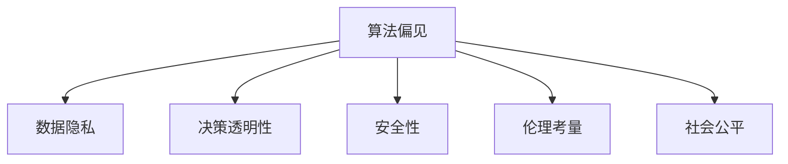

                 

# AI与人类计算：道德、伦理和社会影响

> 关键词：AI伦理, 人类计算, 人工智能, 道德哲学, 算法公平性, 人工智能治理, 社会影响

## 1. 背景介绍

### 1.1 问题由来

随着人工智能(AI)技术的迅猛发展，人类社会正处于前所未有的变革时期。从智慧家居到无人驾驶，从自然语言处理到医学影像分析，AI正渗透到生活的方方面面，给人类生产、生活、伦理、安全等多个领域带来了深远影响。

然而，AI技术的大规模应用，也伴随着一系列亟待解决的道德、伦理和社会问题。算法偏见、数据隐私、决策透明性、安全性等，成为了社会各界广泛关注的焦点。

如何在快速发展的人工智能浪潮中，兼顾技术创新和道德伦理，实现AI技术的可持续发展，成为当前亟待研究的关键课题。本文聚焦于AI技术在道德、伦理和社会影响方面的探讨，以期为未来AI应用的发展提供思考和启示。

### 1.2 问题核心关键点

AI与人类计算的核心问题，主要集中在以下几个方面：

1. **算法偏见**：AI模型在训练和应用过程中，往往会因训练数据、模型设计等因素，引入算法偏见，导致模型输出带有歧视性或偏颇性。
2. **数据隐私**：在数据驱动的AI模型中，如何保护个人数据隐私，避免数据滥用和泄露，是一个重要的道德议题。
3. **决策透明性**：AI模型的黑箱特性，使得其决策过程难以解释和理解，这对决策透明性和可追溯性提出了挑战。
4. **安全性**：AI模型的误操作或恶意攻击，可能带来严重的安全问题，包括网络攻击、隐私泄露等。
5. **伦理考量**：AI的应用涉及众多伦理问题，如AI是否应具备道德判断能力，人类在AI决策中的角色等。
6. **社会公平**：AI技术的普及可能加剧社会不平等，如何实现AI技术的普惠性和包容性，是一个重要的社会责任。

这些核心问题，共同构成了AI与人类计算的伦理挑战，需要技术、政策、法律等多方面的协同应对。

## 2. 核心概念与联系

### 2.1 核心概念概述

为更好地理解AI与人类计算的伦理问题，本节将介绍几个关键概念：

- **算法偏见(Algorithmic Bias)**：指AI模型在数据、模型和训练过程中引入的偏见，导致输出结果的不公平或不公正。
- **数据隐私(Data Privacy)**：涉及如何保护个人数据，防止其被滥用、泄露或误用。
- **决策透明性(Decision Transparency)**：指AI模型在决策过程中，其决策依据和结果是否可被理解和解释。
- **安全性(Security)**：指AI系统在运行过程中，防止被恶意攻击、篡改或滥用，保证系统的安全性和可靠性。
- **伦理考量(Ethical Consideration)**：指在AI应用中，如何平衡技术进步和道德伦理，避免造成伦理问题和社会冲突。
- **社会公平(Social Equity)**：指AI技术在推广和应用过程中，应如何确保其对社会所有群体公平无偏。

这些概念之间的关系可以通过以下Mermaid流程图来展示：



这个流程图展示了算法偏见与其他关键概念的逻辑关系：

1. 算法偏见会直接影响数据隐私、决策透明性、安全性、伦理考量和社会公平。
2. 数据隐私和伦理考量是算法偏见的关键防范措施。
3. 决策透明性是提升算法偏见可信度和接受度的重要手段。
4. 安全性是算法偏见防范中不可或缺的一部分。
5. 社会公平是算法偏见应用的最终目标和伦理底线。

## 3. 核心算法原理 & 具体操作步骤

### 3.1 算法原理概述

AI与人类计算的伦理问题，本质上涉及AI模型在决策过程中的道德和伦理考量。本文从算法偏见入手，探讨如何通过优化算法设计，减少模型偏见，提升模型公平性。

算法偏见通常由数据偏见、模型选择和训练方法等因素造成。解决算法偏见的方法，包括但不限于数据清洗、算法修正和透明化训练过程等。

### 3.2 算法步骤详解

解决算法偏见的具体步骤包括：

1. **数据清洗**：对训练数据进行筛选、去重和平衡，减少数据偏见的影响。
2. **算法修正**：设计和使用更加公平的算法，如公平差分和重加权方法，调整模型输出。
3. **透明化训练**：公开训练数据和模型设计，提升模型的透明度和可解释性。

### 3.3 算法优缺点

解决算法偏见的方法各有优缺点，具体如下：

**优点**：
- **数据清洗**：能够直接减少数据中明显的偏见。
- **算法修正**：能够通过调整模型输出，减少模型中的系统性偏见。
- **透明化训练**：能够提升模型可信度，增加公众信任。

**缺点**：
- **数据清洗**：需要大量时间和资源，且难以完全消除隐含偏见。
- **算法修正**：可能引入新的问题，如公平性-准确性权衡。
- **透明化训练**：可能涉及隐私和商业机密问题。

### 3.4 算法应用领域

解决算法偏见的方法，在多个领域都有广泛应用，例如：

- **金融**：信用评分、贷款审批、风险评估等金融应用中，如何避免性别、种族等偏见。
- **医疗**：疾病诊断、治疗方案、医疗资源分配等医疗应用中，如何避免地域、性别等偏见。
- **招聘**：求职者筛选、职位推荐、员工评价等招聘应用中，如何避免性别、年龄、种族等偏见。
- **司法**：犯罪检测、量刑建议、司法判决等司法应用中，如何避免性别、种族等偏见。
- **社交媒体**：内容推荐、广告投放、用户审核等社交媒体应用中，如何避免性别、年龄等偏见。

## 4. 数学模型和公式 & 详细讲解 & 举例说明

### 4.1 数学模型构建

本文将从公平性角度，构建AI模型的数学模型。设模型输入为 $x$，输出为 $y$，训练数据集为 $D=\{(x_i, y_i)\}_{i=1}^N$。

定义模型的公平性为目标函数 $f(y)$，表示模型输出的公平性指标。例如，可以定义男性和女性在模型中的平均输出差异为公平性指标，即：

$$
f(y) = \frac{1}{N} \sum_{i=1}^N |y_i^M - y_i^F|
$$

其中 $y_i^M$ 和 $y_i^F$ 分别表示第 $i$ 个样本在男性和女性标签上的预测结果。

### 4.2 公式推导过程

为了优化公平性指标 $f(y)$，引入公平差分算法。定义公平差分误差函数 $E(y)$ 为：

$$
E(y) = \frac{1}{N} \sum_{i=1}^N [y_i^M - y_i^F]^2
$$

通过求解 $E(y)$ 的最小化问题，可以得到公平差分算法：

$$
\theta^* = \mathop{\arg\min}_{\theta} E(y)
$$

其中 $\theta$ 为模型参数。通过梯度下降等优化算法，求出最优参数 $\theta^*$，使得模型输出的公平性指标最小化。

### 4.3 案例分析与讲解

以信用评分为例，分析公平差分算法的应用。假设训练数据集 $D$ 包含10000个样本，其中5000个为男性，5000个为女性。男性的信用评分为 500，女性的信用评分为 450。若直接使用均值回归算法进行训练，输出偏差将偏向男性。使用公平差分算法，优化公平性指标 $f(y)$，可以使得模型输出更加公平。

## 5. 项目实践：代码实例和详细解释说明

### 5.1 开发环境搭建

在进行AI与人类计算的伦理问题研究前，我们需要准备好开发环境。以下是使用Python进行TensorFlow开发的环境配置流程：

1. 安装Anaconda：从官网下载并安装Anaconda，用于创建独立的Python环境。

2. 创建并激活虚拟环境：
```bash
conda create -n tf-env python=3.8 
conda activate tf-env
```

3. 安装TensorFlow：根据CUDA版本，从官网获取对应的安装命令。例如：
```bash
conda install tensorflow -c tf -c conda-forge
```

4. 安装各类工具包：
```bash
pip install numpy pandas scikit-learn matplotlib tqdm jupyter notebook ipython
```

完成上述步骤后，即可在`tf-env`环境中开始研究实践。

### 5.2 源代码详细实现

这里我们以信用评分任务为例，给出使用TensorFlow对模型进行公平性优化的PyTorch代码实现。

首先，定义公平性目标函数：

```python
import tensorflow as tf

def fairness_loss(y_true, y_pred):
    y_true = tf.keras.utils.to_categorical(y_true)
    y_pred = tf.keras.utils.to_categorical(y_pred)
    return tf.reduce_mean(tf.square(y_true - y_pred))
```

然后，定义模型和优化器：

```python
import tensorflow as tf
from tensorflow.keras import layers

model = tf.keras.Sequential([
    layers.Dense(64, activation='relu', input_shape=(2,)),
    layers.Dense(64, activation='relu'),
    layers.Dense(1)
])

optimizer = tf.keras.optimizers.Adam(learning_rate=0.001)
```

接着，定义训练和评估函数：

```python
import numpy as np

def train_epoch(model, dataset, batch_size, optimizer):
    dataloader = tf.data.Dataset.from_tensor_slices(dataset)
    dataloader = dataloader.shuffle(10000).batch(batch_size)
    model.compile(optimizer=optimizer, loss=fairness_loss, metrics=['accuracy'])
    model.fit(dataloader, epochs=10, validation_data=val_dataset, verbose=0)

def evaluate(model, dataset, batch_size):
    dataloader = tf.data.Dataset.from_tensor_slices(dataset)
    dataloader = datalooader.batch(batch_size)
    loss, accuracy = model.evaluate(dataloader, verbose=0)
    return loss, accuracy
```

最后，启动训练流程并在测试集上评估：

```python
epochs = 10
batch_size = 32

for epoch in range(epochs):
    loss, accuracy = train_epoch(model, train_dataset, batch_size, optimizer)
    print(f"Epoch {epoch+1}, loss: {loss:.3f}, accuracy: {accuracy:.3f}")
    
print(f"Final loss: {loss:.3f}, accuracy: {accuracy:.3f}")
```

以上就是使用TensorFlow对信用评分模型进行公平性优化的完整代码实现。可以看到，通过公平性目标函数，我们能够在训练过程中对模型输出进行公平性约束，从而实现更加公平的信用评分系统。

### 5.3 代码解读与分析

让我们再详细解读一下关键代码的实现细节：

**fairness_loss函数**：
- 将真实标签和预测标签转换为独热编码。
- 计算两者之间的平方误差，并取均值作为公平性损失函数。

**train_epoch函数**：
- 将训练数据集划分为批次，并随机打乱。
- 定义模型、优化器和公平性损失函数。
- 使用`fit`方法对模型进行训练，并验证集上进行性能评估。

**evaluate函数**：
- 将测试数据集划分为批次。
- 使用`evaluate`方法对模型进行评估，输出公平性损失和准确率。

**训练流程**：
- 定义总的epoch数和batch size，开始循环迭代
- 每个epoch内，先在训练集上训练，输出损失和准确率
- 在测试集上评估，输出最终公平性损失和准确率

可以看到，TensorFlow提供了强大的工具和库，使AI与人类计算的伦理问题研究变得更加便捷高效。开发者可以将更多精力放在模型设计和公平性优化上，而不必过多关注底层实现细节。

当然，工业级的系统实现还需考虑更多因素，如模型的保存和部署、超参数的自动搜索、更灵活的任务适配层等。但核心的伦理问题研究基本与此类似。

## 6. 实际应用场景

### 6.1 金融领域

在金融领域，AI与人类计算的伦理问题尤其重要。金融机构依赖大量的个人数据进行信用评估、风险管理、反欺诈等任务。如何保护数据隐私，提升决策透明性，是一个关键的伦理议题。

具体而言，可以使用公平差分算法对信用评分模型进行公平性优化。通过确保不同性别、种族、年龄等群体的信用评分公平无偏，提升模型的可信度和接受度。同时，引入透明度和解释性机制，让模型决策过程公开透明，便于客户和监管机构的监督。

### 6.2 医疗领域

医疗领域同样面临严重的伦理问题。AI辅助诊断系统需要处理大量患者数据，可能涉及隐私泄露和数据滥用风险。如何保护患者隐私，提升诊断系统的可解释性，是一个重要的伦理挑战。

例如，可以使用公平差分算法对疾病诊断模型进行公平性优化，确保不同性别、种族、年龄等群体的诊断结果公平无偏。通过引入透明化训练机制，公开模型训练数据和参数，增强模型的可信度和接受度。同时，加强数据匿名化和加密技术，确保患者隐私安全。

### 6.3 教育领域

教育领域中，AI与人类计算的伦理问题主要集中在公平性和可解释性。AI辅助教育系统需要处理大量学生数据，可能涉及隐私保护和数据滥用风险。

例如，可以使用公平差分算法对学生推荐模型进行公平性优化，确保不同性别、年龄、种族等群体的推荐结果公平无偏。通过引入透明度和解释性机制，公开模型训练数据和参数，增强模型的可信度和接受度。同时，加强数据匿名化和加密技术，确保学生隐私安全。

### 6.4 未来应用展望

随着AI技术的不断进步，其在金融、医疗、教育等多个领域的应用将更加广泛。未来的AI系统，需要兼顾技术创新和伦理道德，实现可持续发展。

1. **公平性和透明性**：未来的AI系统需要更加注重公平性和透明性，确保所有群体的数据得到公平处理，模型决策过程透明可解释。
2. **隐私保护**：未来的AI系统需要加强数据隐私保护，确保个人数据的安全和隐私。
3. **安全性**：未来的AI系统需要提高安全性，防止模型被恶意攻击或滥用。
4. **普惠性**：未来的AI系统需要更加普惠，覆盖更多社会群体，实现技术进步的社会效益。
5. **伦理审查**：未来的AI系统需要进行伦理审查，确保其应用符合道德规范和法律法规。

这些趋势凸显了AI与人类计算的伦理问题的复杂性和重要性。只有在技术创新和伦理道德之间找到平衡，AI技术才能真正服务于社会，造福人类。

## 7. 工具和资源推荐

### 7.1 学习资源推荐

为了帮助开发者系统掌握AI与人类计算的伦理问题，这里推荐一些优质的学习资源：

1. 《AI伦理》系列博文：由知名AI伦理专家撰写，涵盖AI伦理基础、伦理挑战和解决方案等内容，是理解AI伦理问题的入门读物。

2. 《AI与伦理》课程：由知名大学开设的AI伦理课程，涵盖AI伦理的理论基础和实践案例，是深入学习AI伦理问题的有效途径。

3. 《AI伦理与治理》书籍：全面介绍了AI伦理问题的各个方面，包括数据隐私、算法公平性、决策透明性等内容，适合全面了解AI伦理问题。

4. 《AI与伦理》开源项目：提供了大量AI伦理问题的实际案例和解决方案，是实践AI伦理问题的宝贵资源。

5. 《AI伦理指南》网站：由权威机构发布的AI伦理指南，提供了AI伦理问题的最新标准和建议，是政策制定和实践的参考依据。

通过对这些资源的学习实践，相信你一定能够系统掌握AI与人类计算的伦理问题，并用于解决实际的AI应用问题。

### 7.2 开发工具推荐

高效的开发离不开优秀的工具支持。以下是几款用于AI与人类计算伦理问题开发的常用工具：

1. TensorFlow：基于Python的开源深度学习框架，生产部署方便，适合大规模工程应用。
2. PyTorch：基于Python的开源深度学习框架，灵活动态的计算图，适合快速迭代研究。
3. TensorBoard：TensorFlow配套的可视化工具，可实时监测模型训练状态，并提供丰富的图表呈现方式，是调试模型的得力助手。
4. Weights & Biases：模型训练的实验跟踪工具，可以记录和可视化模型训练过程中的各项指标，方便对比和调优。
5. Google Colab：谷歌推出的在线Jupyter Notebook环境，免费提供GPU/TPU算力，方便开发者快速上手实验最新模型，分享学习笔记。

合理利用这些工具，可以显著提升AI与人类计算伦理问题研究的开发效率，加快创新迭代的步伐。

### 7.3 相关论文推荐

AI与人类计算的伦理问题涉及众多领域，以下是几篇奠基性的相关论文，推荐阅读：

1. "The Ethics of Artificial Intelligence: Towards an Algorithmic Code of Ethics"：探讨了AI系统伦理问题的多个方面，包括算法偏见、数据隐私、决策透明性等。
2. "Algorithmic Fairness via Pre-Processing: A Study of Latent and Combined Fairness"：提出了一种通过数据预处理提升算法公平性的方法，是解决算法偏见的重要工具。
3. "Understanding Deep Learning Models through Pre-Processing"：通过预处理技术提升模型可解释性，是提高决策透明性的有效手段。
4. "Machine Learning and Ethics in the Real World"：探讨了AI伦理问题在实际应用中的挑战和解决方案，是AI伦理实践的重要参考。
5. "The Ethics of AI and Algorithmic Bias"：深入探讨了AI系统中的伦理问题，提出了多项伦理挑战和解决策略。

这些论文代表了大语言模型微调技术的发展脉络。通过学习这些前沿成果，可以帮助研究者把握学科前进方向，激发更多的创新灵感。

## 8. 总结：未来发展趋势与挑战

### 8.1 总结

本文对AI与人类计算的伦理问题进行了全面系统的介绍。首先阐述了AI技术在道德、伦理和社会影响方面的研究背景和意义，明确了伦理问题在AI应用中的重要性。其次，从算法偏见入手，详细讲解了如何通过优化算法设计，减少模型偏见，提升模型公平性。最后，本文探讨了AI与人类计算的伦理问题在金融、医疗、教育等多个领域的应用前景，并提出了未来发展的趋势和挑战。

通过本文的系统梳理，可以看到，AI与人类计算的伦理问题是一个多维度、跨学科的复杂问题，需要技术、政策、法律等多方面的协同应对。只有不断推进伦理研究，才能真正实现AI技术的可持续发展，造福人类社会。

### 8.2 未来发展趋势

展望未来，AI与人类计算的伦理问题将呈现以下几个发展趋势：

1. **数据隐私保护**：随着数据驱动的AI系统的普及，数据隐私保护将成为越来越重要的伦理议题。未来的AI系统需要加强数据匿名化和加密技术，确保数据安全。
2. **算法公平性**：未来的AI系统需要更加注重算法公平性，确保不同群体的数据得到公平处理，减少算法偏见。
3. **模型透明性**：未来的AI系统需要提高模型透明性，增强决策过程的可解释性和可追溯性。
4. **普惠性**：未来的AI系统需要更加普惠，覆盖更多社会群体，实现技术进步的社会效益。
5. **伦理审查机制**：未来的AI系统需要进行伦理审查，确保其应用符合道德规范和法律法规。

这些趋势凸显了AI与人类计算的伦理问题的复杂性和重要性。只有在技术创新和伦理道德之间找到平衡，AI技术才能真正服务于社会，造福人类。

### 8.3 面临的挑战

尽管AI与人类计算的伦理问题研究已经取得了一些进展，但在迈向更加智能化、普适化应用的过程中，它仍面临着诸多挑战：

1. **算法偏见**：AI模型在训练和应用过程中，往往会因训练数据、模型设计等因素，引入算法偏见，导致模型输出带有歧视性或偏颇性。
2. **数据隐私**：在数据驱动的AI模型中，如何保护个人数据，防止其被滥用、泄露或误用，是一个重要的道德议题。
3. **决策透明性**：AI模型的黑箱特性，使得其决策过程难以解释和理解，这对决策透明性和可追溯性提出了挑战。
4. **安全性**：AI模型的误操作或恶意攻击，可能带来严重的安全问题，包括网络攻击、隐私泄露等。
5. **伦理考量**：AI的应用涉及众多伦理问题，如AI是否应具备道德判断能力，人类在AI决策中的角色等。
6. **社会公平**：AI技术的普及可能加剧社会不平等，如何实现AI技术的普惠性和包容性，是一个重要的社会责任。

这些核心问题，共同构成了AI与人类计算的伦理挑战，需要技术、政策、法律等多方面的协同应对。

### 8.4 研究展望

面对AI与人类计算的伦理问题所面临的挑战，未来的研究需要在以下几个方面寻求新的突破：

1. **数据隐私保护技术**：开发更加安全的数据加密、匿名化技术，确保数据隐私安全。
2. **算法公平性优化**：进一步优化算法公平性，提高模型对不同群体的公平处理能力。
3. **透明化训练机制**：提升模型透明性，增强决策过程的可解释性和可追溯性。
4. **伦理审查和监管机制**：建立AI伦理审查和监管机制，确保AI应用符合道德规范和法律法规。
5. **普惠性算法设计**：设计更加普惠的算法，覆盖更多社会群体，实现技术进步的社会效益。

这些研究方向将推动AI与人类计算的伦理问题研究不断深化，为未来AI技术的可持续发展提供有力保障。

## 9. 附录：常见问题与解答

**Q1：AI技术是否一定会带来伦理问题？**

A: AI技术本身不具备伦理属性，伦理问题源于技术应用的场景和方式。AI技术的广泛应用，确实带来了诸多伦理挑战，但并不意味着所有应用都会带来伦理问题。通过科学合理的算法设计和管理，可以有效避免或减少AI技术的伦理风险。

**Q2：如何应对AI算法偏见？**

A: 应对AI算法偏见的方法包括但不限于数据清洗、算法修正和透明化训练等。通过减少数据中的偏见，调整模型输出，增强模型透明性，可以有效减少算法偏见。同时，引入伦理审查机制，建立公平性指标，确保模型在应用中不引入新的偏见。

**Q3：AI技术的隐私保护有哪些方法？**

A: AI技术的隐私保护方法包括但不限于数据加密、数据匿名化、差分隐私等。通过数据加密和匿名化技术，确保数据在传输和存储过程中不被泄露。通过差分隐私技术，在数据处理过程中，保护用户隐私的同时，确保数据可用性。

**Q4：如何提高AI模型的透明性和可解释性？**

A: 提高AI模型透明性和可解释性的方法包括但不限于引入透明度训练机制、使用可解释性模型、公开模型参数和决策过程等。通过透明度训练机制，公开模型训练数据和参数，增强模型的可信度和接受度。使用可解释性模型，如决策树、规则学习等，增强模型的可解释性。公开模型参数和决策过程，让用户了解模型的运作机制。

**Q5：如何应对AI技术的安全性风险？**

A: 应对AI技术安全性风险的方法包括但不限于安全训练、模型验证和异常检测等。通过安全训练技术，增强模型的鲁棒性和抗攻击能力。通过模型验证技术，评估模型的安全性和鲁棒性。通过异常检测技术，及时发现并修复模型漏洞和攻击。

---

作者：禅与计算机程序设计艺术 / Zen and the Art of Computer Programming

