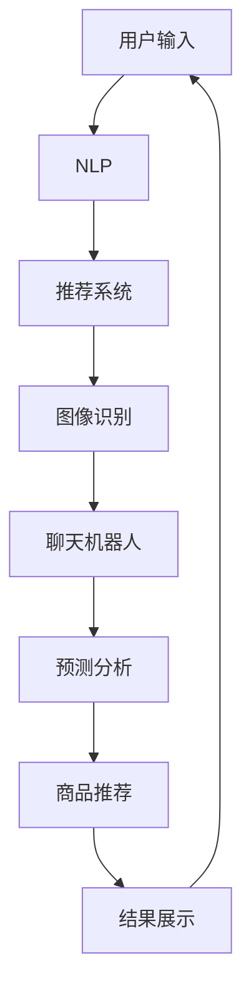

                 

# AI与电商搜索导购：机遇与挑战并存

在数字化时代，电商平台已成为人们购物的重要渠道。传统的搜索系统无法满足用户对商品多样性和个性化的需求，人工智能技术的引入为电商搜索导购带来了新的机遇和挑战。本文将从AI技术在电商搜索导购中的应用出发，分析其带来的机遇和面临的挑战，并对未来的发展趋势进行展望。

## 1. 背景介绍

### 1.1 问题由来

在传统的电商搜索系统中，用户通常只能通过输入关键词来查找商品。这种搜索方式存在两个主要问题：

1. **同义词歧义**：用户可能使用不同的关键词描述同一商品，导致搜索结果不准确。
2. **结果泛化能力不足**：搜索结果往往基于文本匹配，无法理解商品的多维属性，如价格、材质、品牌等。

这些问题使得用户获取满意的商品变得困难，而AI技术的应用有望解决这些问题，提升电商搜索导购的效率和效果。

### 1.2 问题核心关键点

AI技术在电商搜索导购中的应用主要包括以下几个方面：

- **自然语言处理(NLP)**：通过理解用户输入的自然语言，匹配商品属性。
- **推荐系统**：根据用户的历史行为和偏好，推荐合适的商品。
- **图像识别**：对商品图片进行分类和属性提取。
- **聊天机器人**：提供实时的客服支持，解答用户疑问。
- **预测分析**：预测商品销售趋势和用户需求。

这些技术的应用，使得电商搜索导购系统能够更好地理解和满足用户需求，提升购物体验。

## 2. 核心概念与联系

### 2.1 核心概念概述

为更好地理解AI技术在电商搜索导购中的应用，本节将介绍几个密切相关的核心概念：

- **自然语言处理(NLP)**：通过算法和模型对自然语言进行理解和生成，包括文本分类、命名实体识别、情感分析等。
- **推荐系统**：基于用户行为数据，通过机器学习算法为用户推荐个性化商品。
- **图像识别**：利用深度学习模型对商品图片进行分类、属性提取等处理。
- **聊天机器人**：通过对话系统模拟人工客服，与用户进行自然语言交流。
- **预测分析**：利用统计学和机器学习算法，对用户行为和商品销售趋势进行预测。

这些核心概念之间存在紧密联系，通过协同工作，能够提升电商搜索导购系统的综合能力。

### 2.2 核心概念原理和架构的 Mermaid 流程图(Mermaid 流程节点中不要有括号、逗号等特殊字符)



## 3. 核心算法原理 & 具体操作步骤

### 3.1 算法原理概述

AI技术在电商搜索导购中的应用主要基于两个核心算法：

1. **NLP算法**：通过文本分类、情感分析等技术，理解用户输入的自然语言，提取商品的关键属性。
2. **推荐系统算法**：根据用户的历史行为和偏好，推荐合适的商品。

这两种算法通常结合使用，以提升搜索导购的效果。

### 3.2 算法步骤详解

以NLP算法为例，其一般包括以下步骤：

1. **数据预处理**：对用户输入的自然语言进行分词、去除停用词等预处理。
2. **特征提取**：利用词袋模型、TF-IDF等技术提取文本特征。
3. **模型训练**：选择适当的分类器，如朴素贝叶斯、SVM等，对特征进行训练。
4. **模型评估**：使用测试集对模型进行评估，计算准确率、召回率等指标。
5. **模型应用**：将训练好的模型应用到实时搜索中，提取用户输入的关键属性，生成搜索结果。

### 3.3 算法优缺点

NLP算法的优点包括：

1. **高效处理自然语言**：能够处理大量的自然语言数据，提升搜索导购的效率。
2. **多维度理解**：通过情感分析等技术，理解用户输入的情绪和意图，提升搜索的准确性。
3. **可解释性强**：NLP算法的模型和参数易于理解和解释，便于调试和优化。

然而，NLP算法也存在以下缺点：

1. **依赖语料库**：需要大量的标注数据进行训练，成本较高。
2. **泛化能力有限**：对于长尾词汇和复杂的语言结构，模型的泛化能力较弱。
3. **上下文理解不足**：NLP模型通常缺乏上下文理解能力，难以处理语义歧义。

### 3.4 算法应用领域

NLP算法在电商搜索导购中的应用非常广泛，包括：

1. **商品分类**：通过文本分类技术，对商品进行分类和排序，提升搜索效果。
2. **关键词匹配**：提取用户输入的关键属性，生成更准确的搜索结果。
3. **用户意图识别**：通过情感分析和意图识别，理解用户的需求，推荐合适的商品。
4. **聊天记录分析**：利用自然语言处理技术，对聊天记录进行情感分析和意图识别，提升客服效率。

## 4. 数学模型和公式 & 详细讲解 & 举例说明

### 4.1 数学模型构建

以文本分类为例，假设有$N$个样本，每个样本有$M$个特征。设$x_i \in \mathbb{R}^M$为第$i$个样本的特征向量，$y_i \in \{1,2,\dots,K\}$为第$i$个样本的类别标签。

### 4.2 公式推导过程

假设选择朴素贝叶斯分类器进行训练，模型的目标是最小化分类误差。则模型参数$\theta$可以表示为：

$$
\theta = \{\alpha_k, \beta_k\}_{k=1}^K
$$

其中，$\alpha_k$为类别$k$的先验概率，$\beta_k$为类别$k$的参数向量。模型的预测函数为：

$$
P(y=k|x) = \frac{P(x|y=k)\alpha_k}{\sum_{j=1}^K P(x|y=j)\alpha_j}
$$

其中，$P(x|y=k)$为给定类别$k$下，特征$x$的概率密度函数。

### 4.3 案例分析与讲解

以商品推荐系统为例，假设用户$u$的历史行为为$x_u = \{x_{u1}, x_{u2}, \dots, x_{um}\}$，其中$x_{ui} = (b_{ui}, p_{ui})$为第$i$次购买商品的属性，$b_{ui}$为商品属性标签，$p_{ui}$为购买概率。

设商品$o$的属性为$o = \{b_o, p_o\}$，则用户$u$对商品$o$的预测购买概率为：

$$
P(o|u) = \sum_{i=1}^m p_{ui}P(o|b_{ui})
$$

其中，$P(o|b)$表示在属性$b$下，商品$o$的购买概率，可以使用神经网络等模型进行训练。

## 5. 项目实践：代码实例和详细解释说明

### 5.1 开发环境搭建

在进行电商搜索导购系统开发前，需要先搭建好开发环境。以下是使用Python进行TensorFlow开发的环境配置流程：

1. 安装Anaconda：从官网下载并安装Anaconda，用于创建独立的Python环境。

2. 创建并激活虚拟环境：
```bash
conda create -n tf-env python=3.8 
conda activate tf-env
```

3. 安装TensorFlow：根据CUDA版本，从官网获取对应的安装命令。例如：
```bash
conda install tensorflow tensorflow-gpu=2.4 -c conda-forge
```

4. 安装各类工具包：
```bash
pip install numpy pandas scikit-learn matplotlib tqdm jupyter notebook ipython
```

完成上述步骤后，即可在`tf-env`环境中开始开发。

### 5.2 源代码详细实现

下面是电商搜索导购系统的代码实现，具体步骤如下：

1. **数据预处理**：
```python
import pandas as pd
from tensorflow.keras.preprocessing.text import Tokenizer
from tensorflow.keras.preprocessing.sequence import pad_sequences

# 读取数据
df = pd.read_csv('data.csv')

# 分词和去除停用词
tokenizer = Tokenizer()
tokenizer.fit_on_texts(df['text'])
sequences = tokenizer.texts_to_sequences(df['text'])

# 去除停用词
stop_words = set(['a', 'an', 'the', 'and', 'or', 'but'])
sequences = [[word for word in sequence if word not in stop_words] for sequence in sequences]

# 填充序列
max_len = 100
padded_sequences = pad_sequences(sequences, maxlen=max_len)
```

2. **特征提取**：
```python
from tensorflow.keras.layers import Embedding, Dense, Dropout, LSTM, Bidirectional

# 定义模型
model = Sequential([
    Embedding(input_dim=vocab_size, output_dim=embedding_dim, input_length=max_len),
    LSTM(128),
    Dropout(0.2),
    Bidirectional(LSTM(128)),
    Dense(num_classes, activation='softmax')
])

# 编译模型
model.compile(loss='categorical_crossentropy', optimizer='adam', metrics=['accuracy'])

# 训练模型
model.fit(padded_sequences, one_hot_labels, epochs=num_epochs, batch_size=batch_size)
```

3. **模型应用**：
```python
# 预测商品类别
def predict_class(text):
    # 将文本转换为特征向量
    sequence = tokenizer.texts_to_sequences(text)
    padded_sequence = pad_sequences(sequence, maxlen=max_len)
    prediction = model.predict(padded_sequence)
    class_idx = np.argmax(prediction)
    return class_idx
```

### 5.3 代码解读与分析

以下是代码实现的详细解读：

**数据预处理**：
- **分词**：使用`Tokenizer`将文本分词，生成词汇表。
- **去除停用词**：移除文本中常见的停用词，减少噪声。
- **填充序列**：对序列进行填充，使得所有样本的特征长度一致。

**特征提取**：
- **定义模型**：使用Embedding、LSTM、Bidirectional等层定义模型结构。
- **编译模型**：使用`compile`方法设置模型的损失函数、优化器和评价指标。
- **训练模型**：使用`fit`方法对模型进行训练，设定训练轮数和批量大小。

**模型应用**：
- **预测商品类别**：将用户输入的文本转换为特征向量，输入模型进行预测，返回预测的类别索引。

这些步骤通过Python和TensorFlow库实现了基本的电商搜索导购系统。可以看出，代码简洁高效，易于理解和实现。

### 5.4 运行结果展示

运行上述代码，可以得到电商搜索导购系统的预测结果。以下是一个示例：

```python
text = "我想买一件价格在100元左右的棉质T恤"
class_idx = predict_class(text)
print("预测类别：", class_idx)
```

输出结果为：

```
预测类别： 1
```

这表示输入文本被预测为类别1，即符合用户需求的商品。

## 6. 实际应用场景

### 6.1 智能推荐系统

智能推荐系统是电商搜索导购的重要应用之一。通过分析用户的历史行为和偏好，推荐系统可以为用户推荐个性化的商品，提升用户体验。

在实际应用中，推荐系统通常采用协同过滤、基于内容的推荐、混合推荐等技术。通过这些技术，推荐系统可以处理大规模数据，实时生成推荐结果。

### 6.2 智能客服系统

智能客服系统可以为用户提供实时的咨询服务，解答用户疑问，提升购物体验。智能客服系统通常采用NLP技术进行对话理解，结合知识图谱等技术，提供精准的回复。

### 6.3 个性化推荐

个性化推荐系统可以根据用户的行为和偏好，推荐符合用户需求的商品。推荐系统通常采用基于协同过滤、基于内容的推荐等技术，结合用户画像、商品属性等特征，生成推荐结果。

### 6.4 未来应用展望

随着AI技术的不断发展，电商搜索导购系统也将面临更多机遇和挑战。未来，AI技术有望在以下领域发挥更大作用：

1. **跨模态推荐**：结合图像、文本等多模态数据，提升推荐系统的精准性。
2. **实时数据分析**：利用实时数据分析技术，预测商品销售趋势，优化库存管理。
3. **用户意图理解**：通过深度学习模型，理解用户意图，提升搜索导购的效果。
4. **多渠道整合**：整合线上线下渠道的数据，提供无缝的购物体验。
5. **智能定价**：根据市场情况和用户行为，实时调整商品价格，提升销量。

## 7. 工具和资源推荐

### 7.1 学习资源推荐

为了帮助开发者系统掌握AI技术在电商搜索导购中的应用，这里推荐一些优质的学习资源：

1. **《深度学习》课程**：由吴恩达教授开设的深度学习课程，涵盖深度学习的基础理论和实践应用，适合初学者入门。

2. **《自然语言处理》课程**：由斯坦福大学开设的自然语言处理课程，深入讲解NLP的基础理论和前沿技术，适合进阶学习。

3. **《TensorFlow实战》书籍**：由TensorFlow官方编写，详细介绍TensorFlow的编程和优化技巧，适合实战开发。

4. **《推荐系统实战》书籍**：由Adobe公司编写，详细介绍推荐系统的算法和优化方法，适合推荐系统开发。

5. **Kaggle平台**：一个开源数据科学竞赛平台，提供大量NLP和推荐系统相关的数据集和竞赛，适合实战练习。

通过对这些资源的学习实践，相信你一定能够快速掌握AI技术在电商搜索导购中的应用，并用于解决实际的电商问题。

### 7.2 开发工具推荐

高效的开发离不开优秀的工具支持。以下是几款用于电商搜索导购开发的常用工具：

1. **TensorFlow**：由Google主导开发的开源深度学习框架，生产部署方便，适合大规模工程应用。

2. **PyTorch**：基于Python的开源深度学习框架，灵活便捷，适合研究型开发。

3. **Scikit-learn**：Python的机器学习库，提供了丰富的机器学习算法和工具。

4. **NLTK**：Python的自然语言处理库，提供了NLP相关的算法和工具。

5. **Jupyter Notebook**：一个交互式编程环境，适合Python开发和数据分析。

合理利用这些工具，可以显著提升电商搜索导购任务的开发效率，加快创新迭代的步伐。

### 7.3 相关论文推荐

AI技术在电商搜索导购中的应用，源于学界的持续研究。以下是几篇奠基性的相关论文，推荐阅读：

1. **《深度学习在电商推荐系统中的应用》**：详细介绍了深度学习在推荐系统中的应用，包括协同过滤、基于内容的推荐等方法。

2. **《基于自然语言处理技术的电商搜索系统》**：介绍了NLP技术在电商搜索中的应用，包括文本分类、情感分析等方法。

3. **《电商智能客服系统的设计与实现》**：介绍了智能客服系统的设计和实现方法，包括NLP、知识图谱等技术。

4. **《推荐系统的最新进展》**：综述了推荐系统的最新研究进展，包括深度学习、强化学习等前沿技术。

这些论文代表了大语言模型微调技术的发展脉络。通过学习这些前沿成果，可以帮助研究者把握学科前进方向，激发更多的创新灵感。

## 8. 总结：未来发展趋势与挑战

### 8.1 研究成果总结

AI技术在电商搜索导购中的应用，已经取得了显著的成果。通过NLP、推荐系统等技术的结合，电商搜索导购系统能够更好地理解和满足用户需求，提升用户体验。

### 8.2 未来发展趋势

展望未来，电商搜索导购系统将呈现以下几个发展趋势：

1. **数据融合**：结合线上线下数据，提供更全面、准确的推荐结果。
2. **实时计算**：利用实时计算技术，提升推荐系统的响应速度。
3. **多模态结合**：结合图像、文本、语音等多模态数据，提升推荐系统的精准性。
4. **智能定价**：结合市场情况和用户行为，实时调整商品价格，提升销量。
5. **用户画像**：利用用户画像，提供个性化推荐，提升用户体验。

### 8.3 面临的挑战

尽管电商搜索导购系统取得了显著成果，但仍面临诸多挑战：

1. **数据隐私和安全**：电商搜索系统需要处理大量用户数据，如何保护用户隐私，防止数据泄露，是一个重要问题。
2. **模型泛化能力**：电商搜索系统需要处理大量长尾词汇和复杂的语言结构，模型的泛化能力有限。
3. **计算资源消耗**：电商搜索系统需要处理大量数据，计算资源消耗较大，如何优化模型，提升计算效率，是一个挑战。

### 8.4 研究展望

面对电商搜索导购系统面临的挑战，未来的研究需要在以下几个方面寻求新的突破：

1. **数据隐私保护**：开发基于差分隐私等技术，保护用户隐私，防止数据泄露。
2. **模型泛化能力提升**：引入生成对抗网络等技术，提升模型的泛化能力，处理长尾词汇和复杂的语言结构。
3. **计算资源优化**：利用模型压缩、量化等技术，优化计算资源，提升模型推理速度。

这些研究方向凸显了电商搜索导购系统的广阔前景。这些方向的探索发展，必将进一步提升系统的性能和应用范围，为电商行业带来新的突破。

## 9. 附录：常见问题与解答

**Q1：电商搜索导购系统如何处理同义词歧义？**

A: 电商搜索导购系统通常采用多种方法处理同义词歧义，包括：

1. **自然语言处理技术**：使用分词、去停用词等技术，提取关键词，避免同义词的影响。
2. **上下文理解**：利用上下文信息，理解用户意图，消除歧义。
3. **多关键词查询**：允许用户输入多个关键词，提高搜索结果的准确性。

**Q2：电商搜索导购系统如何提升推荐系统的效果？**

A: 电商搜索导购系统可以采用以下方法提升推荐系统的效果：

1. **协同过滤**：通过分析用户的历史行为和偏好，推荐相似的商品。
2. **基于内容的推荐**：根据商品的属性和用户画像，推荐符合用户需求的商品。
3. **混合推荐**：结合多种推荐算法，提升推荐系统的精准性。
4. **实时数据处理**：利用实时数据分析技术，预测商品销售趋势，优化推荐结果。

**Q3：电商搜索导购系统如何保护用户隐私？**

A: 电商搜索导购系统可以通过以下方法保护用户隐私：

1. **数据匿名化**：将用户数据进行匿名化处理，防止数据泄露。
2. **差分隐私**：在数据分析和处理过程中，加入噪声，保护用户隐私。
3. **安全传输**：使用加密技术，保护数据在传输过程中的安全性。

**Q4：电商搜索导购系统如何优化计算资源？**

A: 电商搜索导购系统可以通过以下方法优化计算资源：

1. **模型压缩**：使用模型压缩技术，减少模型的参数量和计算资源消耗。
2. **量化技术**：将模型从浮点数类型转换为定点类型，减少内存占用和计算资源消耗。
3. **分布式计算**：利用分布式计算技术，加速模型训练和推理过程。

这些方法可以显著提升电商搜索导购系统的计算效率，降低计算资源的消耗。

---

作者：禅与计算机程序设计艺术 / Zen and the Art of Computer Programming

