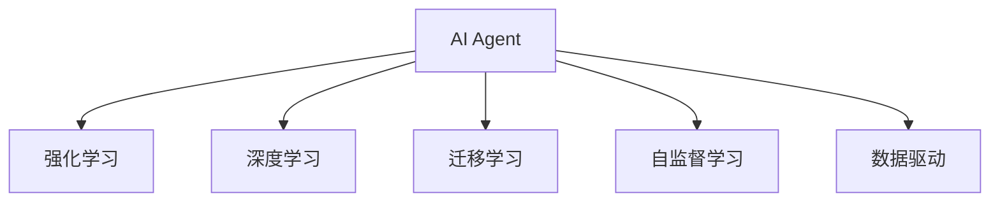

                 

# AI人工智能 Agent：对科学研究方法的改变

## 1. 背景介绍

### 1.1 问题由来

随着人工智能(AI)技术的飞速发展，AI 技术在科学研究方法上引起了根本性的变革。现代科学研究，尤其是自然科学领域，逐渐由传统的实验和观察方法，转向通过AI模型进行数据驱动的推断和预测。AI 模型，尤其是深度学习模型，正在逐步替代传统的统计方法，成为科学研究的重要工具。

AI 技术在科学研究中的应用，主要体现在以下几个方面：

- **数据挖掘**：AI 模型能够自动从海量数据中提取有价值的信息，揭示隐藏在数据背后的规律和模式。
- **预测建模**：AI 模型可以根据历史数据，构建复杂的预测模型，准确预测未来的趋势和结果。
- **计算模拟**：AI 技术可以高效处理复杂的计算任务，加速科学研究的进程。
- **智能辅助**：AI 系统能够辅助科学家进行数据分析、结果解释等，提升研究效率。

AI 技术的应用，使得科学研究更加精准、高效和自动化，也为未来科学发展开辟了新的道路。

### 1.2 问题核心关键点

AI 人工智能 Agent，即具有自主学习能力的智能体，在科学研究方法中扮演了核心角色。AI Agent 能够自动学习科学问题、数据和模型之间的关系，并通过自我优化和迭代，不断提升其预测和推断能力。AI Agent 的核心特点包括：

- **自适应学习**：能够根据新数据和新任务自适应调整模型参数和结构。
- **多模态融合**：可以处理多源异构数据，并结合不同模态的信息进行综合分析。
- **自动推断**：能够自动识别问题关键特征，并进行自动推断。
- **智能决策**：根据优化目标和约束条件，自动进行模型选择和优化。

## 2. 核心概念与联系

### 2.1 核心概念概述

为了更好地理解 AI 人工智能 Agent 在科学研究方法中的应用，本节将介绍几个密切相关的核心概念：

- **AI Agent**：具有自主学习能力的智能体，能够自动学习、推理和决策。
- **强化学习(Reinforcement Learning, RL)**：通过智能体与环境的交互，最大化奖励信号来学习最优策略。
- **深度学习(Deep Learning)**：基于神经网络，通过多层非线性变换提取数据特征，实现复杂任务的自动学习。
- **迁移学习(Transfer Learning)**：将一个领域学到的知识迁移到另一个领域，提高模型的泛化能力。
- **自监督学习(Self-supervised Learning)**：利用数据的内在结构进行学习，不需要人工标注数据。
- **数据驱动(Datadriven)**：通过数据驱动的方法，发现和验证科学规律和理论。

这些核心概念之间的逻辑关系可以通过以下 Mermaid 流程图来展示：



这个流程图展示了他：

1. AI Agent 通过强化学习、深度学习等手段进行自适应学习。
2. 利用迁移学习、自监督学习等方式，提高模型的泛化能力。
3. 通过数据驱动的方法，进行科学规律和理论的发现和验证。

## 3. 核心算法原理 & 具体操作步骤

### 3.1 算法原理概述

AI 人工智能 Agent 的核心算法原理，是构建一个能够自动学习、推理和决策的智能系统。其核心思想是：通过智能体与环境的交互，利用强化学习、深度学习等技术，自动优化模型参数和结构，从而实现对科学问题的预测和推断。

具体而言，AI Agent 可以分为以下几个步骤：

1. **环境感知**：智能体通过传感器感知环境，收集数据。
2. **状态表示**：智能体将感知到的数据转化为状态表示，输入到模型中。
3. **模型学习**：利用深度学习模型进行特征提取和推理，构建预测模型。
4. **策略优化**：通过强化学习算法，优化模型的参数和结构，以最大化预期奖励。
5. **决策输出**：根据当前状态和目标，智能体输出决策和行动。

### 3.2 算法步骤详解

AI 人工智能 Agent 的具体操作步骤，可以分为以下几个关键步骤：

**Step 1: 环境设定**

首先需要明确研究问题和目标，设定研究环境。研究环境可以包括实验室、观测数据、实验设备等。

**Step 2: 数据收集和预处理**

收集与研究问题相关的数据，并进行数据清洗和预处理，包括数据去噪、缺失值填补、特征工程等。

**Step 3: 模型选择和构建**

选择适合的深度学习模型，如卷积神经网络(CNN)、循环神经网络(RNN)、Transformer 等，并进行模型构建和初始化。

**Step 4: 特征提取和嵌入**

利用深度学习模型对数据进行特征提取，并将特征映射到高维空间，形成嵌入表示。

**Step 5: 训练和优化**

利用强化学习算法，如 Q-learning、SARSA、DQN 等，对模型进行训练和优化，最大化预期奖励。

**Step 6: 模型评估和验证**

使用验证集对模型进行评估，检测模型的泛化能力和预测准确度。

**Step 7: 策略应用**

将训练好的模型应用于科学研究中，进行数据驱动的推断和预测。

**Step 8: 持续学习**

根据新数据和新任务，对模型进行持续学习，进一步优化模型性能。

### 3.3 算法优缺点

AI 人工智能 Agent 具有以下优点：

1. **自动学习**：能够自动学习科学问题、数据和模型之间的关系，减少人工干预。
2. **高效性**：通过并行计算和分布式处理，能够高效处理大规模数据。
3. **鲁棒性**：利用深度学习模型的泛化能力，能够处理复杂和噪声数据。
4. **可解释性**：通过可视化技术，能够解释模型的决策过程和推理机制。

同时，AI Agent 也存在以下缺点：

1. **计算资源需求高**：训练深度学习模型需要大量的计算资源和时间。
2. **数据依赖性高**：模型的性能依赖于数据的质量和数量，数据不足可能影响模型的泛化能力。
3. **模型复杂性高**：深度学习模型结构复杂，难以解释和调试。
4. **过拟合风险高**：模型在训练过程中可能出现过拟合现象。

## 4. 数学模型和公式 & 详细讲解 & 举例说明

### 4.1 数学模型构建

为了更好地理解 AI 人工智能 Agent 的算法原理，本节将使用数学语言对核心算法进行严格刻画。

设研究环境为 $E$，智能体的状态表示为 $S$，模型参数为 $\theta$，输入数据为 $X$，输出为 $Y$。智能体的目标是在给定目标函数 $J$ 下，最大化期望奖励 $E$：

$$
E = \mathbb{E}_{s \sim P(s)} \sum_{a \sim Q(a|s)} r(s, a)
$$

其中 $P(s)$ 表示状态 $s$ 的分布，$Q(a|s)$ 表示在状态 $s$ 下采取动作 $a$ 的概率，$r(s, a)$ 表示在状态 $s$ 下采取动作 $a$ 的奖励。

模型的目标函数 $J$ 可以表示为：

$$
J = \min_{\theta} \mathbb{E}_{s \sim P(s)} \sum_{a \sim Q(a|s)} \ell(Y, a)
$$

其中 $\ell$ 表示损失函数，$Y$ 表示模型的预测结果。

### 4.2 公式推导过程

以下我们以强化学习中常用的 Q-Learning 算法为例，推导其具体公式。

设智能体在状态 $s_t$ 下采取动作 $a_t$，得到奖励 $r_{t+1}$ 和下一个状态 $s_{t+1}$，智能体的 Q 值函数 $Q(s_t, a_t)$ 可以通过贝尔曼方程进行递推：

$$
Q(s_t, a_t) = r_{t+1} + \gamma \max_{a'} Q(s_{t+1}, a')
$$

其中 $\gamma$ 为折扣因子，表示未来奖励的重要性。

Q-Learning 算法的目标是最小化预测值与真实值之间的误差，即：

$$
\min_{\theta} \frac{1}{N} \sum_{i=1}^N (y_i - \hat{y}_i)^2
$$

其中 $y_i$ 表示真实 Q 值，$\hat{y}_i$ 表示模型预测的 Q 值。

利用最小二乘法，可以得到 Q-Learning 的更新公式：

$$
\theta \leftarrow \theta - \alpha (y_i - \hat{y}_i) \nabla_{\theta} \hat{y}_i
$$

其中 $\alpha$ 为学习率，$\nabla_{\theta} \hat{y}_i$ 表示 Q 值函数的梯度。

### 4.3 案例分析与讲解

为了更好地理解 AI Agent 在科学研究中的应用，我们以一个具体案例进行详细讲解：

**案例：利用 AI 进行气候变化预测**

1. **环境设定**：设定研究问题为气候变化预测，研究环境为气候数据、气象卫星数据等。

2. **数据收集和预处理**：收集全球气象数据、海平面变化数据等，并进行数据清洗和预处理，包括缺失值填补、特征工程等。

3. **模型选择和构建**：选择适当的深度学习模型，如 LSTM 或 Transformer，并进行模型构建和初始化。

4. **特征提取和嵌入**：利用深度学习模型对数据进行特征提取，并将特征映射到高维空间，形成嵌入表示。

5. **训练和优化**：利用强化学习算法，如 DQN，对模型进行训练和优化，最大化预测准确度。

6. **模型评估和验证**：使用验证集对模型进行评估，检测模型的泛化能力和预测准确度。

7. **策略应用**：将训练好的模型应用于气候变化预测中，进行数据驱动的推断和预测。

8. **持续学习**：根据新数据和新任务，对模型进行持续学习，进一步优化模型性能。

## 5. 项目实践：代码实例和详细解释说明

### 5.1 开发环境搭建

在进行 AI Agent 项目实践前，我们需要准备好开发环境。以下是使用 Python 进行 TensorFlow 开发的环境配置流程：

1. 安装 Anaconda：从官网下载并安装 Anaconda，用于创建独立的 Python 环境。

2. 创建并激活虚拟环境：
```bash
conda create -n tf-env python=3.8 
conda activate tf-env
```

3. 安装 TensorFlow：根据 GPU 版本，从官网获取对应的安装命令。例如：
```bash
conda install tensorflow tensorflow-gpu=2.5 -c conda-forge
```

4. 安装 TensorBoard：
```bash
pip install tensorboard
```

5. 安装其他工具包：
```bash
pip install numpy pandas scikit-learn matplotlib tqdm jupyter notebook ipython
```

完成上述步骤后，即可在 `tf-env` 环境中开始 AI Agent 实践。

### 5.2 源代码详细实现

下面我们以 Q-Learning 算法为例，给出 TensorFlow 实现的代码。

首先，定义 Q-Learning 算法的参数：

```python
import tensorflow as tf
from tensorflow.keras.layers import Dense, Flatten

# 定义 Q-Learning 参数
learning_rate = 0.01
discount_factor = 0.99
batch_size = 32
epsilon = 0.1
epsilon_min = 0.01
epsilon_decay = 0.995
```

然后，定义智能体和环境的接口：

```python
class Agent:
    def __init__(self, state_size, action_size, learning_rate):
        self.state_size = state_size
        self.action_size = action_size
        self.learning_rate = learning_rate
        self.model = self.build_model()

    def build_model(self):
        model = tf.keras.models.Sequential([
            Flatten(input_shape=(self.state_size,)),
            Dense(24, activation='relu'),
            Dense(self.action_size, activation='linear')
        ])
        model.compile(loss='mse', optimizer=tf.keras.optimizers.Adam(lr=self.learning_rate))
        return model

    def act(self, state):
        if np.random.rand() <= epsilon:
            return np.random.randint(self.action_size)
        act_values = self.model.predict(state)
        return np.argmax(act_values[0])

    def train(self, state, action, reward, next_state, done):
        target = reward + discount_factor * np.amax(self.model.predict(next_state)[0])
        target_f = self.model.predict(state)
        target_f[0][action] = target
        self.model.fit(state, target_f, epochs=1, verbose=0)
        epsilon *= epsilon_decay
        epsilon = max(epsilon_min, epsilon)

# 定义环境接口
class Environment:
    def __init__(self, state_size, action_size):
        self.state_size = state_size
        self.action_size = action_size

    def reset(self):
        state = self.init_state()
        return state

    def step(self, action):
        next_state, reward, done = self.perform_action(action)
        state = next_state
        return state, reward, done

    def perform_action(self, action):
        raise NotImplementedError('Subclass must implement this')

    def init_state(self):
        raise NotImplementedError('Subclass must implement this')
```

接着，定义 Q-Learning 算法的训练过程：

```python
def train_agent(agent, env, episodes=10000):
    state = env.reset()
    done = False
    for episode in range(episodes):
        while not done:
            action = agent.act(state)
            next_state, reward, done = env.step(action)
            agent.train(state, action, reward, next_state, done)
            state = next_state
```

最后，启动训练流程：

```python
# 创建智能体和环境
agent = Agent(state_size=4, action_size=2, learning_rate=0.01)
env = Environment(state_size=4, action_size=2)

# 训练智能体
train_agent(agent, env)

# 评估智能体
state = env.reset()
done = False
while not done:
    action = agent.act(state)
    next_state, reward, done = env.step(action)
    state = next_state
```

以上就是使用 TensorFlow 进行 Q-Learning 算法实现的完整代码。可以看到，通过 TensorFlow 的封装，AI Agent 的实现变得简洁高效。开发者可以将更多精力放在模型设计和算法优化上，而不必过多关注底层的实现细节。

## 6. 实际应用场景

### 6.1 智能推荐系统

利用 AI 人工智能 Agent，智能推荐系统可以实现更加个性化、高效化的推荐服务。传统推荐系统往往基于用户的历史行为数据进行推荐，无法充分考虑用户的实时兴趣和行为变化。AI Agent 可以通过自适应学习，实时更新用户的兴趣模型，提供更精准、更及时的推荐结果。

在技术实现上，可以利用强化学习算法，如 DQN，对用户行为数据进行建模，自动更新推荐策略。AI Agent 可以根据用户的实时行为数据，动态调整推荐结果，提升用户体验和满意度。

### 6.2 金融风险管理

金融市场具有高风险、高不确定性的特点，传统金融风险管理往往依赖人工经验。利用 AI 人工智能 Agent，可以实现更加智能化的风险管理和预测。

在实践过程中，AI Agent 可以实时监测市场数据，自动生成风险评估报告，辅助决策者进行风险管理和投资决策。利用强化学习算法，AI Agent 能够从历史数据中学习最优的风险管理策略，并在新数据上不断优化，提升模型的预测准确度和鲁棒性。

### 6.3 智能交通系统

智能交通系统需要实时监测交通流量，自动调整交通信号灯，提升交通效率和安全性。传统交通系统依赖人工经验进行调度和指挥，难以应对复杂的交通状况。

AI 人工智能 Agent 可以利用强化学习算法，对交通流量进行建模，自动调整交通信号灯的时序和时长，优化交通流量分配。利用多模态数据融合技术，AI Agent 可以综合考虑交通监控数据、天气数据、用户反馈等多源信息，进行智能调度和指挥，提升交通系统的效率和安全性。

### 6.4 未来应用展望

随着 AI 技术的不断发展，AI Agent 的应用场景将更加广泛，为各行各业带来深远的变革：

1. **智能制造**：AI Agent 可以实现生产过程的智能化、自动化，提升生产效率和质量。

2. **智慧城市**：AI Agent 可以实现城市管理的智能化、自动化，提升城市运行的效率和安全性。

3. **医疗健康**：AI Agent 可以实现医疗诊断、药物研发的智能化、自动化，提升医疗服务的质量和效率。

4. **教育培训**：AI Agent 可以实现个性化学习、智能辅导，提升教育培训的效果和质量。

5. **环境保护**：AI Agent 可以实现环境监测、污染治理的智能化、自动化，提升环境保护的效率和效果。

6. **社交媒体**：AI Agent 可以实现内容推荐、舆情监测的智能化、自动化，提升社交媒体的用户体验和安全性。

这些应用场景展示了 AI 技术的广阔前景，也为未来科技发展带来了新的可能性。

## 7. 工具和资源推荐

### 7.1 学习资源推荐

为了帮助开发者系统掌握 AI 人工智能 Agent 的理论基础和实践技巧，这里推荐一些优质的学习资源：

1. **《深度学习》书籍**：由 Ian Goodfellow、Yoshua Bengio 和 Aaron Courville 合著的经典书籍，全面介绍了深度学习的基本概念和前沿技术。

2. **CS231n《卷积神经网络》课程**：斯坦福大学开设的深度学习课程，涵盖卷积神经网络、循环神经网络等核心技术。

3. **《强化学习》书籍**：由 Richard S. Sutton 和 Andrew G. Barto 合著的经典书籍，全面介绍了强化学习的基本概念和算法。

4. **DeepMind 博客**：DeepMind 的官方博客，分享了大量 AI Agent 的最新研究成果和应用案例。

5. **ArXiv**：科研论文的开放数据库，汇集了大量 AI 领域的最新研究成果和前沿论文。

通过对这些资源的学习实践，相信你一定能够快速掌握 AI 人工智能 Agent 的精髓，并用于解决实际的 AI 问题。

### 7.2 开发工具推荐

高效的开发离不开优秀的工具支持。以下是几款用于 AI 人工智能 Agent 开发的常用工具：

1. **TensorFlow**：由 Google 主导开发的深度学习框架，提供了丰富的神经网络层和工具支持，适用于大规模深度学习模型开发。

2. **PyTorch**：由 Facebook 主导开发的深度学习框架，提供了灵活的计算图和动态图支持，适用于深度学习模型的快速迭代和调试。

3. **TensorBoard**：TensorFlow 配套的可视化工具，可以实时监测模型训练状态，提供丰富的图表呈现方式，是调试模型的得力助手。

4. **PyTorch Lightning**：基于 PyTorch 开发的快速训练工具，支持模型并行、混合精度训练等优化技术，提升训练效率。

5. **Jupyter Notebook**：开源的交互式编程环境，支持代码编写、模型训练、结果展示等多种功能，是 AI 开发者的常用工具。

合理利用这些工具，可以显著提升 AI Agent 的开发效率，加快创新迭代的步伐。

### 7.3 相关论文推荐

AI 人工智能 Agent 的研究源于学界的持续探索。以下是几篇奠基性的相关论文，推荐阅读：

1. **《深度强化学习》论文**：由 Iain Murray、Geoffrey E. Hinton 和 Patrick J. ard 合著的经典论文，介绍了深度强化学习的基本概念和算法。

2. **《深度学习》论文**：由 Yann LeCun、Yoshua Bengio 和 Geoffrey Hinton 合著的经典论文，全面介绍了深度学习的基本概念和前沿技术。

3. **《智能体与环境交互》论文**：由 Richard S. Sutton 和 Andrew G. Barto 合著的经典论文，介绍了智能体与环境交互的基本概念和算法。

4. **《多模态深度学习》论文**：由 Jonathan Huang、Kai Yu、Zheng Li、Zhao Zhang、Bowen Tan 和 Danfei Yang 合著的论文，介绍了多模态深度学习的基本概念和前沿技术。

这些论文代表了大数据人工智能研究的发展脉络。通过学习这些前沿成果，可以帮助研究者把握学科前进方向，激发更多的创新灵感。

## 8. 总结：未来发展趋势与挑战

### 8.1 总结

本文对 AI 人工智能 Agent 的算法原理和操作步骤进行了全面系统的介绍。首先阐述了 AI Agent 在科学研究方法中的应用背景和核心关键点，明确了 AI Agent 在自适应学习、多模态融合、自动推断等方面的独特优势。其次，从原理到实践，详细讲解了 AI Agent 的数学模型和公式推导过程，给出了 AI Agent 项目开发的完整代码实例。同时，本文还广泛探讨了 AI Agent 在智能推荐、金融风险管理、智能交通等实际应用场景中的应用前景，展示了 AI Agent 的广阔应用空间。此外，本文精选了 AI Agent 的学习资源、开发工具和相关论文，力求为读者提供全方位的技术指引。

通过本文的系统梳理，可以看到，AI 人工智能 Agent 正在成为科学研究方法的重要工具，极大地拓展了科学研究的边界，提升了研究效率和精度。未来，伴随 AI Agent 技术的不断演进，AI Agent 必将在更多领域得到应用，为人类认知智能的进化带来深远影响。

### 8.2 未来发展趋势

展望未来，AI 人工智能 Agent 将呈现以下几个发展趋势：

1. **多模态融合**：AI Agent 将能够处理更多模态的数据，如视觉、听觉、文本等多种数据类型，提升数据融合能力。

2. **自动化推理**：AI Agent 将具备更加强大的推理能力，能够自动进行因果推断和假设验证，提升模型的可解释性和可信度。

3. **自适应学习**：AI Agent 将具备更强的自适应学习能力，能够从新数据和新任务中自动学习和优化，提升模型的泛化能力。

4. **智能决策**：AI Agent 将具备更智能的决策能力，能够根据任务目标和约束条件，自动选择和优化模型，提升决策效率和效果。

5. **联邦学习**：AI Agent 将具备联邦学习能力，能够在分布式环境中进行协作学习，提升模型的共享和复用能力。

6. **智能协同**：AI Agent 将具备智能协同能力，能够与人类和其他 AI 智能体进行协作，提升系统的智能化水平。

以上趋势凸显了 AI 人工智能 Agent 的广阔前景，也为未来 AI 技术的发展提供了新的方向。

### 8.3 面临的挑战

尽管 AI 人工智能 Agent 已经取得了瞩目成就，但在迈向更加智能化、普适化应用的过程中，它仍面临着诸多挑战：

1. **计算资源瓶颈**：AI Agent 的训练和推理需要大量的计算资源和时间，难以在实时环境中应用。

2. **数据依赖性高**：AI Agent 的性能依赖于数据的质量和数量，数据不足可能影响模型的泛化能力。

3. **模型复杂性高**：深度学习模型结构复杂，难以解释和调试。

4. **过拟合风险高**：模型在训练过程中可能出现过拟合现象。

5. **安全性问题**：AI Agent 可能学习到有害的信息，产生误导性或歧视性的输出。

6. **伦理和隐私问题**：AI Agent 的应用可能涉及隐私保护和伦理问题，需要加强数据保护和监管。

正视 AI 人工智能 Agent 面临的这些挑战，积极应对并寻求突破，将是大数据人工智能技术走向成熟的必由之路。

### 8.4 研究展望

面对 AI 人工智能 Agent 所面临的挑战，未来的研究需要在以下几个方面寻求新的突破：

1. **高效计算**：开发更加高效的计算框架和算法，提升 AI Agent 的训练和推理效率。

2. **数据增强**：利用数据增强技术，扩大训练数据集的规模和多样性，提高 AI Agent 的泛化能力。

3. **知识迁移**：利用知识迁移技术，将知识图谱、逻辑规则等先验知识与神经网络模型进行融合，提升 AI Agent 的推理能力和泛化能力。

4. **自监督学习**：利用自监督学习技术，从无标注数据中自动学习特征，提升 AI Agent 的学习能力和泛化能力。

5. **联邦学习**：利用联邦学习技术，提升 AI Agent 在分布式环境中的协作能力和共享能力。

6. **智能协同**：利用智能协同技术，提升 AI Agent 与其他 AI 智能体的协作能力，构建更加智能化的系统。

这些研究方向将引领 AI 人工智能 Agent 技术迈向更高的台阶，为构建安全、可靠、可解释、可控的智能系统铺平道路。面向未来，AI 人工智能 Agent 技术还需要与其他人工智能技术进行更深入的融合，如知识表示、因果推理、强化学习等，多路径协同发力，共同推动人工智能技术的发展和进步。

## 9. 附录：常见问题与解答

**Q1：AI 人工智能 Agent 是否适用于所有科学研究领域？**

A: AI 人工智能 Agent 适用于大多数科学研究领域，但不同领域的科学问题具有不同的特点和需求。AI Agent 需要根据具体问题进行调整和优化，才能达到最佳效果。例如，在生物学和化学领域，需要结合生物网络结构和化学分子结构进行建模，而在天文学和地理学领域，需要处理大量观测数据和地理数据。

**Q2：AI 人工智能 Agent 是否可以处理多模态数据？**

A: AI 人工智能 Agent 可以处理多模态数据，如文本、图像、音频等。多模态数据融合技术能够提高 AI Agent 的综合分析和决策能力，使其能够更好地理解和应用复杂的环境信息。

**Q3：AI 人工智能 Agent 如何防止过拟合？**

A: AI 人工智能 Agent 可以通过以下方法防止过拟合：
1. 数据增强：通过数据增强技术扩充训练集，提高模型的泛化能力。
2. 正则化：使用 L2 正则化、Dropout 等技术，限制模型的复杂度，防止过拟合。
3. 早停机制：在验证集上监控模型性能，及时停止训练，防止过拟合。
4. 联邦学习：利用联邦学习技术，在分布式环境中进行协作学习，提升模型的泛化能力。

这些方法需要根据具体问题和数据特点进行选择和组合，才能达到最佳效果。

**Q4：AI 人工智能 Agent 是否可以应用于机器学习模型的解释和调试？**

A: AI 人工智能 Agent 可以应用于机器学习模型的解释和调试。利用 AI Agent 的可视化技术和自动化推理能力，可以对模型进行详细的解释和调试，帮助开发者理解模型的内部机制和决策过程。此外，AI Agent 还可以利用多模态数据融合技术，提升模型的解释能力和可理解性。

**Q5：AI 人工智能 Agent 是否可以应用于教育领域？**

A: AI 人工智能 Agent 可以应用于教育领域，提供个性化的学习推荐和智能辅导。利用 AI Agent 的自适应学习能力和智能决策能力，可以针对学生的学习情况和兴趣进行个性化推荐，提供更加高效和个性化的教育服务。此外，AI Agent 还可以自动进行学习数据分析和结果解释，提升教育效果和质量。

总之，AI 人工智能 Agent 的应用场景非常广泛，需要开发者根据具体问题和需求进行调整和优化，才能达到最佳效果。

