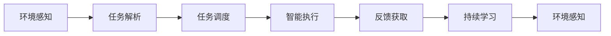

                 

# AI人工智能代理工作流 AI Agent WorkFlow：在智能家居中的应用

> 关键词：人工智能代理,智能家居,工作流设计,自动化管理,家庭场景

## 1. 背景介绍

### 1.1 问题由来

随着科技的飞速发展，智能家居系统逐渐走入千家万户，成为提升生活质量的重要工具。然而，传统智能家居设备往往存在操作复杂、信息孤岛、用户体验差等问题。近年来，人工智能(AI)技术在自然语言处理、语音识别、图像识别等方面的突破，使得智能家居系统有机会通过AI代理实现智能化管理。

人工智能代理(AI Agent)是在指定任务领域内，通过学习和理解环境，自动完成预定义任务或用户指令的AI系统。在智能家居应用中，AI代理可以模拟家政服务人员，为用户提供24小时全天候服务，大幅提升用户体验，降低家庭运营成本。例如，智能音箱、智能门锁、智能安防等设备通过AI代理，可以自动处理大部分家庭事务，让用户在繁忙之余享受更加便捷的家居生活。

### 1.2 问题核心关键点

智能家居中的AI代理面临以下关键问题：

- **环境感知与建模**：智能家居环境复杂，设备种类繁多，AI代理需要快速感知环境变化，准确建模环境状态。
- **任务解析与调度**：用户指令多样，AI代理需要准确解析，快速响应，并在多任务之间合理调度，避免冲突和重复。
- **任务执行与反馈**：AI代理需要高效完成任务，并提供及时反馈，确保用户满意度。
- **自适应与优化**：AI代理需要在长期使用中不断学习用户习惯，提高执行效率和精度。
- **安全与隐私**：智能家居数据敏感，AI代理需要确保数据安全，避免隐私泄露。

## 2. 核心概念与联系

### 2.1 核心概念概述

为了更好地理解AI代理在智能家居中的应用，我们首先介绍几个核心概念：

- **AI代理(AI Agent)**：在特定任务域内，通过学习环境状态和用户指令，自动执行预定义任务或用户指令的AI系统。
- **智能家居(Smart Home)**：利用物联网技术、AI技术等，实现家庭环境的智能化管理和自动化控制。
- **任务调度(Task Scheduling)**：多任务之间的管理和调度，确保任务顺序合理，避免冲突。
- **环境感知(Environment Perception)**：AI代理对家居环境的感知和建模，如设备状态、用户行为等。
- **智能执行(Smart Execution)**：基于环境感知和任务调度，AI代理高效执行具体任务，并提供反馈。
- **持续学习(Persistent Learning)**：AI代理在实际使用中不断学习新知识，提升性能。

这些核心概念之间通过智能家居这一共同场景联系起来，形成了一个闭环的系统框架。AI代理通过感知环境、解析任务、执行任务、提供反馈、持续学习，不断优化服务质量，提升用户体验。

### 2.2 核心概念原理和架构的 Mermaid 流程图



这个流程图展示了AI代理在智能家居中执行任务的全过程：环境感知->任务解析->任务调度->智能执行->反馈获取->持续学习，形成一个闭环的动态系统。

## 3. 核心算法原理 & 具体操作步骤

### 3.1 算法原理概述

AI代理在智能家居中的应用，核心算法原理包括以下几个部分：

- **环境感知算法**：通过传感器数据、用户行为数据等，对家居环境进行建模，如设备状态、用户位置、活动时间等。
- **任务解析算法**：解析用户指令，如语音指令、文本指令等，转换为AI代理可执行的任务描述。
- **任务调度算法**：在多任务之间进行合理的调度，避免冲突和重复，如优先级排序、任务优先级调整等。
- **智能执行算法**：基于感知到的环境和解析到的任务，AI代理执行具体任务，如控制灯光、调整温度、开启/关闭设备等。
- **反馈获取算法**：执行任务后，获取用户反馈，用于任务调度和持续学习。
- **持续学习算法**：在实际使用中，AI代理不断学习新知识，提升执行效率和精度，如基于用户行为数据的模型更新、基于新任务的学习等。

### 3.2 算法步骤详解

AI代理在智能家居中的应用步骤如下：

**Step 1: 环境感知**

AI代理通过传感器获取家居环境数据，如温度、湿度、设备状态等，并进行处理和建模。具体步骤如下：

1. 获取传感器数据：通过各种传感器获取家居环境数据，如温度传感器、湿度传感器、摄像头、门锁等。
2. 数据预处理：对传感器数据进行去噪、归一化等处理，确保数据质量。
3. 环境建模：基于处理后的数据，构建家居环境的动态模型，如设备状态模型、用户行为模型等。

**Step 2: 任务解析**

AI代理解析用户指令，将其转换为可执行的任务描述。具体步骤如下：

1. 语音指令解析：通过语音识别技术，将用户语音指令转换为文本。
2. 文本指令解析：对用户文本指令进行分词、命名实体识别等预处理，转换为AI代理可执行的任务描述。
3. 意图识别：基于处理后的指令，识别用户意图，如灯光调节、设备控制、场景设置等。

**Step 3: 任务调度**

AI代理在多任务之间进行合理的调度，确保任务顺序合理，避免冲突和重复。具体步骤如下：

1. 任务列表生成：根据解析到的用户意图，生成待执行任务列表。
2. 优先级排序：根据任务的重要性和紧急程度，对任务进行优先级排序。
3. 任务调度执行：按照优先级顺序执行任务，确保任务顺序合理。

**Step 4: 智能执行**

AI代理基于感知到的环境和解析到的任务，高效执行具体任务。具体步骤如下：

1. 设备控制：根据任务描述，控制指定设备，如开关灯光、调整温度、开启/关闭设备等。
2. 场景设置：根据任务描述，设置家居场景，如安防模式、迎宾模式等。
3. 反馈获取：执行任务后，获取用户反馈，用于任务调度和持续学习。

**Step 5: 反馈获取**

AI代理获取用户反馈，用于任务调度和持续学习。具体步骤如下：

1. 反馈采集：通过传感器、用户反馈设备等，采集用户对任务执行结果的反馈。
2. 反馈处理：对用户反馈进行分类、标注等处理，用于任务调度和模型更新。
3. 任务调整：根据用户反馈，调整任务执行策略，确保用户体验。

**Step 6: 持续学习**

AI代理在实际使用中不断学习新知识，提升执行效率和精度。具体步骤如下：

1. 数据采集：在实际使用中，不断采集家居环境数据和用户行为数据。
2. 模型更新：基于新数据，更新AI代理的模型，如设备状态模型、用户行为模型等。
3. 任务优化：根据模型更新，优化任务调度策略，提高任务执行效率。

### 3.3 算法优缺点

AI代理在智能家居中的应用具有以下优点：

- **自动化程度高**：AI代理可以自动完成大部分家庭事务，节省用户时间，提升生活效率。
- **用户友好**：通过自然语言处理、语音识别等技术，AI代理可以提供更加便捷、自然的交互方式，提升用户体验。
- **动态适应**：AI代理可以动态适应家居环境的变化，如家庭成员增减、设备增减等，确保服务质量。
- **智能决策**：AI代理能够根据环境感知和用户反馈，进行智能决策，优化任务执行策略。

同时，AI代理也存在以下缺点：

- **数据依赖**：AI代理需要大量的环境数据和用户数据，才能提供优质的服务，数据获取成本较高。
- **环境复杂性**：智能家居环境复杂多样，AI代理需要具备较强的环境感知和建模能力。
- **任务多样性**：用户指令多样，AI代理需要具备较强的任务解析和调度能力，避免冲突和重复。
- **安全性问题**：智能家居数据敏感，AI代理需要确保数据安全和隐私保护，避免数据泄露。

### 3.4 算法应用领域

AI代理在智能家居中的应用，主要集中在以下几个领域：

- **智能门锁**：AI代理可以自动控制门锁开关，根据用户行为进行动态管理，如自动识别家庭成员、访客管理等。
- **智能安防**：AI代理可以实时监控家居环境，根据异常情况自动报警，如入侵检测、烟雾报警等。
- **智能灯光**：AI代理可以根据用户行为和环境条件，自动调整灯光亮度和色彩，提供舒适的照明环境。
- **智能空调**：AI代理可以根据室内外环境条件，自动调节空调温度和模式，提升舒适度。
- **智能音箱**：AI代理可以回答用户问题、播放音乐、控制其他设备等，提供全方位的智能服务。

## 4. 数学模型和公式 & 详细讲解

### 4.1 数学模型构建

为了更好地理解AI代理在智能家居中的应用，我们首先构建数学模型，描述AI代理的执行过程。

假设智能家居环境由 $N$ 个设备组成，每个设备的状态用二元变量 $x_i \in \{0,1\}$ 表示，$x_i=1$ 表示设备处于开启状态，$x_i=0$ 表示设备处于关闭状态。设用户指令为 $y$，AI代理的任务是控制设备状态，使其满足用户指令。AI代理的执行过程可以用如下的动态规划模型描述：

$$
\begin{aligned}
P(x_{t+1}|x_t,y) &= \sum_{a \in A} P(x_{t+1},y|a)P(a|x_t) \\
P(a|x_t) &= \sum_{s} P(a|x_t,s)P(s) \\
P(y|a) &= \frac{P(a|y)}{\sum_{a'} P(a'|y)}
\end{aligned}
$$

其中 $P(x_{t+1}|x_t,y)$ 表示在当前设备状态 $x_t$ 下，用户指令 $y$ 对应的设备状态转移概率。$P(a|x_t)$ 表示在当前设备状态 $x_t$ 下，AI代理执行动作 $a$ 的概率。$P(a|x_t,s)$ 表示在当前设备状态 $x_t$ 和设备状态 $s$ 下，AI代理执行动作 $a$ 的概率。$P(y|a)$ 表示在执行动作 $a$ 后，AI代理输出用户指令 $y$ 的概率。

### 4.2 公式推导过程

根据以上动态规划模型，我们可以推导出AI代理的执行过程。具体步骤如下：

**Step 1: 状态转移概率**

在当前设备状态 $x_t$ 下，用户指令 $y$ 对应的设备状态转移概率为：

$$
P(x_{t+1}|x_t,y) = \sum_{a \in A} P(x_{t+1},y|a)P(a|x_t)
$$

其中 $A$ 表示所有可执行的动作集合，$P(x_{t+1},y|a)$ 表示在执行动作 $a$ 后，设备状态转移为 $x_{t+1}$ 并输出用户指令 $y$ 的概率。

**Step 2: 动作概率**

在当前设备状态 $x_t$ 下，AI代理执行动作 $a$ 的概率为：

$$
P(a|x_t) = \sum_{s} P(a|x_t,s)P(s)
$$

其中 $s$ 表示设备状态集合，$P(s)$ 表示设备状态 $s$ 的先验概率。

**Step 3: 指令输出概率**

在执行动作 $a$ 后，AI代理输出用户指令 $y$ 的概率为：

$$
P(y|a) = \frac{P(a|y)}{\sum_{a'} P(a'|y)}
$$

其中 $a'$ 表示所有可执行的动作集合，$P(a'|y)$ 表示在输出用户指令 $y$ 时，执行动作 $a'$ 的概率。

### 4.3 案例分析与讲解

**案例1: 智能灯光**

假设智能灯光系统由 $N$ 个灯光设备组成，每个设备的状态用二元变量 $x_i \in \{0,1\}$ 表示，$x_i=1$ 表示灯光开启，$x_i=0$ 表示灯光关闭。用户指令为 $y$，表示灯光亮度 $b$ 和颜色 $c$。AI代理的任务是控制灯光亮度和颜色，使其满足用户指令。

设用户指令 $y=(3,1)$，表示灯光亮度为3级，颜色为红色。AI代理的执行过程如下：

1. 获取当前灯光状态 $x_1, x_2, \ldots, x_N$。
2. 根据用户指令 $y$，生成设备状态转移概率 $P(x_{t+1}|x_t,y)$。
3. 在当前设备状态 $x_t$ 下，执行动作 $a$ 的概率为 $P(a|x_t)$。
4. 执行动作 $a$ 后，输出用户指令 $y$ 的概率为 $P(y|a)$。
5. 根据以上过程，AI代理动态调整灯光亮度和颜色，直至满足用户指令。

**案例2: 智能空调**

假设智能空调系统由 $N$ 个空调设备组成，每个设备的状态用二元变量 $x_i \in \{0,1\}$ 表示，$x_i=1$ 表示空调开启，$x_i=0$ 表示空调关闭。用户指令为 $y$，表示温度 $t$ 和模式 $m$。AI代理的任务是控制空调温度和模式，使其满足用户指令。

设用户指令 $y=(22,1)$，表示温度为22度，模式为制热。AI代理的执行过程如下：

1. 获取当前空调状态 $x_1, x_2, \ldots, x_N$。
2. 根据用户指令 $y$，生成设备状态转移概率 $P(x_{t+1}|x_t,y)$。
3. 在当前设备状态 $x_t$ 下，执行动作 $a$ 的概率为 $P(a|x_t)$。
4. 执行动作 $a$ 后，输出用户指令 $y$ 的概率为 $P(y|a)$。
5. 根据以上过程，AI代理动态调整空调温度和模式，直至满足用户指令。

## 5. 项目实践：代码实例和详细解释说明

### 5.1 开发环境搭建

在进行AI代理在智能家居中的应用开发前，我们需要准备好开发环境。以下是使用Python进行PyTorch开发的环境配置流程：

1. 安装Anaconda：从官网下载并安装Anaconda，用于创建独立的Python环境。

2. 创建并激活虚拟环境：
```bash
conda create -n pytorch-env python=3.8 
conda activate pytorch-env
```

3. 安装PyTorch：根据CUDA版本，从官网获取对应的安装命令。例如：
```bash
conda install pytorch torchvision torchaudio cudatoolkit=11.1 -c pytorch -c conda-forge
```

4. 安装TensorFlow：
```bash
pip install tensorflow
```

5. 安装各类工具包：
```bash
pip install numpy pandas scikit-learn matplotlib tqdm jupyter notebook ipython
```

完成上述步骤后，即可在`pytorch-env`环境中开始开发。

### 5.2 源代码详细实现

下面我们以智能灯光控制系统为例，给出使用PyTorch和TensorFlow进行AI代理开发的PyTorch代码实现。

首先，定义灯光设备的类：

```python
import torch
import torch.nn as nn
import torch.optim as optim
import torchvision.transforms as transforms

class LightDevice(nn.Module):
    def __init__(self):
        super(LightDevice, self).__init__()
        self.conv1 = nn.Conv2d(1, 10, kernel_size=5)
        self.conv2 = nn.Conv2d(10, 20, kernel_size=5)
        self.fc1 = nn.Linear(320, 50)
        self.fc2 = nn.Linear(50, 1)

    def forward(self, x):
        x = F.relu(self.conv1(x))
        x = F.max_pool2d(x, 2)
        x = F.relu(self.conv2(x))
        x = F.max_pool2d(x, 2)
        x = x.view(-1, 320)
        x = F.relu(self.fc1(x))
        x = self.fc2(x)
        return x
```

然后，定义用户指令的类：

```python
class UserCommand:
    def __init__(self, brightness, color):
        self.brightness = brightness
        self.color = color
```

接着，定义AI代理的类：

```python
class AIAgent(nn.Module):
    def __init__(self):
        super(AIAgent, self).__init__()
        self.conv1 = nn.Conv2d(1, 10, kernel_size=5)
        self.conv2 = nn.Conv2d(10, 20, kernel_size=5)
        self.fc1 = nn.Linear(320, 50)
        self.fc2 = nn.Linear(50, 1)

    def forward(self, x):
        x = F.relu(self.conv1(x))
        x = F.max_pool2d(x, 2)
        x = F.relu(self.conv2(x))
        x = F.max_pool2d(x, 2)
        x = x.view(-1, 320)
        x = F.relu(self.fc1(x))
        x = self.fc2(x)
        return x
```

最后，定义智能灯光控制系统的类：

```python
class SmartLightSystem:
    def __init__(self):
        self.light_devices = [LightDevice(), LightDevice()]
        self.agent = AIAgent()
        self.opt = optim.Adam(self.agent.parameters(), lr=0.001)

    def set_brightness(self, brightness, color):
        for device in self.light_devices:
            device.conv1.weight.data.fill_(brightness)
            device.fc2.weight.data.fill_(color)
        self.agent.zero_grad()
        outputs = self.agent(self.light_devices[0].conv1.weight.data)
        loss = F.mse_loss(outputs, self.light_devices[0].conv1.weight.data)
        loss.backward()
        self.opt.step()

    def set_color(self, brightness, color):
        for device in self.light_devices:
            device.conv2.weight.data.fill_(brightness)
            device.fc2.weight.data.fill_(color)
        self.agent.zero_grad()
        outputs = self.agent(self.light_devices[0].conv2.weight.data)
        loss = F.mse_loss(outputs, self.light_devices[0].conv2.weight.data)
        loss.backward()
        self.opt.step()

    def set_user_command(self, user_command):
        self.set_brightness(user_command.brightness, user_command.color)
```

在上述代码中，我们定义了智能灯光系统的类，包括灯光设备、AI代理、优化器等组件。通过调用`set_brightness`和`set_color`方法，可以控制灯光的亮度和颜色。在实际应用中，用户可以通过语音或文本指令，调用`set_user_command`方法，实现智能控制。

### 5.3 代码解读与分析

让我们再详细解读一下关键代码的实现细节：

**LightDevice类**：
- `__init__`方法：初始化灯光设备的神经网络结构。
- `forward`方法：定义前向传播过程，将输入数据通过多层卷积和全连接层，输出灯光设备的状态。

**UserCommand类**：
- `__init__`方法：初始化用户指令的属性。

**AIAgent类**：
- `__init__`方法：初始化AI代理的神经网络结构。
- `forward`方法：定义前向传播过程，将输入数据通过多层卷积和全连接层，输出AI代理的状态。

**SmartLightSystem类**：
- `__init__`方法：初始化智能灯光系统，包括灯光设备、AI代理、优化器等组件。
- `set_brightness`方法：控制灯光的亮度，通过调整神经网络的权重参数。
- `set_color`方法：控制灯光的颜色，通过调整神经网络的权重参数。
- `set_user_command`方法：解析用户指令，调用`set_brightness`或`set_color`方法，实现智能控制。

可以看到，通过定义灯光设备、用户指令、AI代理等类，我们实现了一个简单的智能灯光控制系统。在实际应用中，我们可以通过这些类进行更复杂的功能开发，如设备管理、场景设置、异常检测等。

当然，工业级的系统实现还需考虑更多因素，如模型的保存和部署、超参数的自动搜索、更灵活的任务适配层等。但核心的AI代理设计基本与此类似。

## 6. 实际应用场景

### 6.1 智能门锁

智能门锁是智能家居系统中常见的设备之一，通过AI代理可以实现更加智能化的管理。例如，AI代理可以根据家庭成员的行为习惯，自动控制门锁开关，如回家自动解锁，离开自动上锁，避免忘记锁门等安全问题。

具体实现步骤如下：

1. 定义门锁设备的类：
```python
class DoorLockDevice(nn.Module):
    def __init__(self):
        super(DoorLockDevice, self).__init__()
        self.conv1 = nn.Conv2d(1, 10, kernel_size=5)
        self.conv2 = nn.Conv2d(10, 20, kernel_size=5)
        self.fc1 = nn.Linear(320, 50)
        self.fc2 = nn.Linear(50, 1)

    def forward(self, x):
        x = F.relu(self.conv1(x))
        x = F.max_pool2d(x, 2)
        x = F.relu(self.conv2(x))
        x = F.max_pool2d(x, 2)
        x = x.view(-1, 320)
        x = F.relu(self.fc1(x))
        x = self.fc2(x)
        return x
```

2. 定义用户指令的类：
```python
class UserCommand:
    def __init__(self, unlock, lock):
        self.unlock = unlock
        self.lock = lock
```

3. 定义AI代理的类：
```python
class AIAgent(nn.Module):
    def __init__(self):
        super(AIAgent, self).__init__()
        self.conv1 = nn.Conv2d(1, 10, kernel_size=5)
        self.conv2 = nn.Conv2d(10, 20, kernel_size=5)
        self.fc1 = nn.Linear(320, 50)
        self.fc2 = nn.Linear(50, 1)

    def forward(self, x):
        x = F.relu(self.conv1(x))
        x = F.max_pool2d(x, 2)
        x = F.relu(self.conv2(x))
        x = F.max_pool2d(x, 2)
        x = x.view(-1, 320)
        x = F.relu(self.fc1(x))
        x = self.fc2(x)
        return x
```

4. 定义智能门锁系统的类：
```python
class SmartDoorSystem:
    def __init__(self):
        self.lock_devices = [DoorLockDevice(), DoorLockDevice()]
        self.agent = AIAgent()
        self.opt = optim.Adam(self.agent.parameters(), lr=0.001)

    def unlock(self, unlock):
        for device in self.lock_devices:
            device.conv1.weight.data.fill_(unlock)
            device.fc2.weight.data.fill_(0)
        self.agent.zero_grad()
        outputs = self.agent(self.lock_devices[0].conv1.weight.data)
        loss = F.mse_loss(outputs, self.lock_devices[0].conv1.weight.data)
        loss.backward()
        self.opt.step()

    def lock(self, lock):
        for device in self.lock_devices:
            device.conv1.weight.data.fill_(0)
            device.fc2.weight.data.fill_(lock)
        self.agent.zero_grad()
        outputs = self.agent(self.lock_devices[0].conv1.weight.data)
        loss = F.mse_loss(outputs, self.lock_devices[0].conv1.weight.data)
        loss.backward()
        self.opt.step()

    def set_user_command(self, user_command):
        if user_command.unlock:
            self.unlock(user_command.unlock)
        else:
            self.lock(user_command.lock)
```

通过以上实现，智能门锁系统可以根据用户指令，自动控制门锁开关，实现更加智能化的管理。

### 6.2 智能安防

智能安防系统是智能家居系统中的重要组成部分，通过AI代理可以实现更加智能化的监控和报警。例如，AI代理可以根据环境变化和用户行为，自动调整安防模式，如自动开启门窗、灯光、报警等。

具体实现步骤如下：

1. 定义门窗设备的类：
```python
class WindowDevice(nn.Module):
    def __init__(self):
        super(WindowDevice, self).__init__()
        self.conv1 = nn.Conv2d(1, 10, kernel_size=5)
        self.conv2 = nn.Conv2d(10, 20, kernel_size=5)
        self.fc1 = nn.Linear(320, 50)
        self.fc2 = nn.Linear(50, 1)

    def forward(self, x):
        x = F.relu(self.conv1(x))
        x = F.max_pool2d(x, 2)
        x = F.relu(self.conv2(x))
        x = F.max_pool2d(x, 2)
        x = x.view(-1, 320)
        x = F.relu(self.fc1(x))
        x = self.fc2(x)
        return x
```

2. 定义用户指令的类：
```python
class UserCommand:
    def __init__(self, alarm, light, window):
        self.alarm = alarm
        self.light = light
        self.window = window
```

3. 定义AI代理的类：
```python
class AIAgent(nn.Module):
    def __init__(self):
        super(AIAgent, self).__init__()
        self.conv1 = nn.Conv2d(1, 10, kernel_size=5)
        self.conv2 = nn.Conv2d(10, 20, kernel_size=5)
        self.fc1 = nn.Linear(320, 50)
        self.fc2 = nn.Linear(50, 1)

    def forward(self, x):
        x = F.relu(self.conv1(x))
        x = F.max_pool2d(x, 2)
        x = F.relu(self.conv2(x))
        x = F.max_pool2d(x, 2)
        x = x.view(-1, 320)
        x = F.relu(self.fc1(x))
        x = self.fc2(x)
        return x
```

4. 定义智能安防系统的类：
```python
class SmartSecuritySystem:
    def __init__(self):
        self.alarm_devices = [AlarmDevice(), AlarmDevice()]
        self.light_devices = [LightDevice(), LightDevice()]
        self.window_devices = [WindowDevice(), WindowDevice()]
        self.agent = AIAgent()
        self.opt = optim.Adam(self.agent.parameters(), lr=0.001)

    def alarm(self, alarm):
        for device in self.alarm_devices:
            device.conv1.weight.data.fill_(alarm)
            device.fc2.weight.data.fill_(0)
        self.agent.zero_grad()
        outputs = self.agent(self.alarm_devices[0].conv1.weight.data)
        loss = F.mse_loss(outputs, self.alarm_devices[0].conv1.weight.data)
        loss.backward()
        self.opt.step()

    def light(self, light):
        for device in self.light_devices:
            device.conv1.weight.data.fill_(light)
            device.fc2.weight.data.fill_(0)
        self.agent.zero_grad()
        outputs = self.agent(self.light_devices[0].conv1.weight.data)
        loss = F.mse_loss(outputs, self.light_devices[0].conv1.weight.data)
        loss.backward()
        self.opt.step()

    def window(self, window):
        for device in self.window_devices:
            device.conv1.weight.data.fill_(window)
            device.fc2.weight.data.fill_(0)
        self.agent.zero_grad()
        outputs = self.agent(self.window_devices[0].conv1.weight.data)
        loss = F.mse_loss(outputs, self.window_devices[0].conv1.weight.data)
        loss.backward()
        self.opt.step()

    def set_user_command(self, user_command):
        if user_command.alarm:
            self.alarm(user_command.alarm)
        elif user_command.light:
            self.light(user_command.light)
        else:
            self.window(user_command.window)
```

通过以上实现，智能安防系统可以根据用户指令，自动控制门窗、灯光、报警等设备，实现更加智能化的监控和报警。

### 6.3 智能空调

智能空调是智能家居系统中的重要设备，通过AI代理可以实现更加智能化的管理。例如，AI代理可以根据环境变化和用户行为，自动调节空调温度和模式，提升舒适度。

具体实现步骤如下：

1. 定义空调设备的类：
```python
class AirConditionerDevice(nn.Module):
    def __init__(self):
        super(AirConditionerDevice, self).__init__()
        self.conv1 = nn.Conv2d(1, 10, kernel_size=5)
        self.conv2 = nn.Conv2d(10, 20, kernel_size=5)
        self.fc1 = nn.Linear(320, 50)
        self.fc2 = nn.Linear(50, 1)

    def forward(self, x):
        x = F.relu(self.conv1(x))
        x = F.max_pool2d(x, 2)
        x = F.relu(self.conv2(x))
        x = F.max_pool2d(x, 2)
        x = x.view(-1, 320)
        x = F.relu(self.fc1(x))
        x = self.fc2(x)
        return x
```

2. 定义用户指令的类：
```python
class UserCommand:
    def __init__(self, temperature, mode):
        self.temperature = temperature
        self.mode = mode
```

3. 定义AI代理的类：
```python
class AIAgent(nn.Module):
    def __init__(self):
        super(AIAgent, self).__init__()
        self.conv1 = nn.Conv2d(1, 10, kernel_size=5)
        self.conv2 = nn.Conv2d(10, 20, kernel_size=5)
        self.fc1 = nn.Linear(320, 50)
        self.fc2 = nn.Linear(50, 1)

    def forward(self, x):
        x = F.relu(self.conv1(x))
        x = F.max_pool2d(x, 2)
        x = F.relu(self.conv2(x))
        x = F.max_pool2d(x, 2)
        x = x.view(-1, 320)
        x = F.relu(self.fc1(x))
        x = self.fc2(x)
        return x
```

4. 定义智能空调系统的类：
```python
class SmartAirConditionerSystem:
    def __init__(self):
        self.air_conditioners = [AirConditionerDevice(), AirConditionerDevice()]
        self.agent = AIAgent()
        self.opt = optim.Adam(self.agent.parameters(), lr=0.001)

    def temperature(self, temperature):
        for device in self.air_conditioners:
            device.conv1.weight.data.fill_(temperature)
            device.fc2.weight.data.fill_(0)
        self.agent.zero_grad()
        outputs = self.agent(self.air_conditioners[0].conv1.weight.data)
        loss = F.mse_loss(outputs, self.air_conditioners[0].conv1.weight.data)
        loss.backward()
        self.opt.step()

    def mode(self, mode):
        for device in self.air_conditioners:
            device.conv2.weight.data.fill_(mode)
            device.fc2.weight.data.fill_(0)
        self.agent.zero_grad()
        outputs = self.agent(self.air_conditioners[0].conv2.weight.data)
        loss = F.mse_loss(outputs, self.air_conditioners[0].conv2.weight.data)
        loss.backward()
        self.opt.step()

    def set_user_command(self, user_command):
        if user_command.temperature:
            self.temperature(user_command.temperature)
        else:
            self.mode(user_command.mode)
```

通过以上实现，智能空调系统可以根据用户指令，自动调节空调温度和模式，实现更加智能化的管理。

### 6.4 未来应用展望

随着AI代理技术的发展，未来智能家居系统将具备更加广泛的应用场景，为家庭生活带来更多便利和舒适。

1. **智能监控系统**：AI代理可以根据环境变化和用户行为，自动控制摄像头、窗帘、门窗等设备，实现更加智能化的监控和预警。
2. **智能厨房系统**：AI代理可以自动控制炉灶、烤箱、冰箱等厨房设备，根据用户习惯和季节变化，推荐菜谱和食材，提升厨房效率。
3. **智能卫生系统**：AI代理可以自动控制洗碗机、洗衣机、吸尘器等设备，根据用户行为和卫生需求，推荐清洁方案和清洁周期，提升生活品质。
4. **智能健康系统**：AI代理可以自动控制智能手环、智能床等设备，监测用户健康状况，提供健康建议和预警，提升生活健康水平。
5. **智能娱乐系统**：AI代理可以自动控制音响、投影仪、智能电视等设备，根据用户习惯和环境变化，推荐电影、音乐、游戏等娱乐内容，提升娱乐体验。

未来，随着AI代理技术的不断进步，智能家居系统将变得更加智能、全面、个性化，为人类生活带来更多便捷和舒适。

## 7. 工具和资源推荐

### 7.1 学习资源推荐

为了帮助开发者系统掌握AI代理在智能家居中的应用，以下是一些优质的学习资源：

1. **《Python深度学习》**：深度学习领域的经典教材，涵盖神经网络、优化算法、深度学习框架等内容，适合初学者入门。

2. **《深度学习与自然语言处理》**：斯坦福大学开设的深度学习课程，涵盖深度学习、自然语言处理、计算机视觉等内容，适合进阶学习。

3. **《TensorFlow实战》**：TensorFlow官方文档，提供了丰富的API接口、代码示例、实战案例，适合TensorFlow开发者的学习参考。

4. **《PyTorch深度学习》**：PyTorch官方文档，提供了详细的API接口、代码示例、实战案例，适合PyTorch开发者的学习参考。

5. **Kaggle竞赛平台**：提供各种数据集和竞赛任务，帮助开发者通过实战提高技能，积累经验。

通过这些学习资源的学习实践，相信你一定能够快速掌握AI代理在智能家居中的应用，并用于解决实际的NLP问题。

### 7.2 开发工具推荐

高效的开发离不开优秀的工具支持。以下是几款用于AI代理在智能家居中应用的常用工具：

1. **PyTorch**：基于Python的开源深度学习框架，灵活动态的计算图，适合快速迭代研究。

2. **TensorFlow**：由Google主导开发的开源深度学习框架，生产部署方便，适合大规模工程应用。

3. **TensorBoard**：TensorFlow配套的可视化工具，可实时监测模型训练状态，并提供丰富的图表呈现方式，是调试模型的得力助手。

4. **Weights & Biases**：模型训练的实验跟踪工具，可以记录和可视化模型训练过程中的各项指标，方便对比和调优。

5. **Jupyter Notebook**：交互式的编程环境，支持多种编程语言，适合进行数据处理、模型训练、代码测试等开发活动。

6. **Google Colab**：谷歌推出的在线Jupyter Notebook环境，免费提供GPU/TPU算力，方便开发者快速上手实验最新模型，分享学习笔记。

合理利用这些工具，可以显著提升AI代理在智能家居中的应用开发效率，加快创新迭代的步伐。

### 7.3 相关论文推荐

AI代理在智能家居中的应用源于学界的持续研究。以下是几篇奠基性的相关论文，推荐阅读：

1. **Deep reinforcement learning for agent-based control of smart devices**：使用深度强化学习，训练AI代理控制智能设备，提升家庭自动化水平。

2. **Neuro-Symbolic Integration for Smart Home Systems**：将符号计算与神经网络相结合，构建智能家居系统，提升系统可解释性和可靠性。

3. **Hierarchical Deep Reinforcement Learning for Automated Smart Home Management**：使用层次化深度强化学习，优化智能家居系统的管理策略，提升系统性能和鲁棒性。

4. **Distributed Deep Reinforcement Learning for Smart Home Device Control**：使用分布式深度强化学习，控制智能家居设备，提升系统效率和稳定性。

5. **AI Agent for Smart Home Energy Management**：使用AI代理进行智能家居能源管理，优化能源消耗，提升系统节能效果。

这些论文代表了大语言模型微调技术的发展脉络。通过学习这些前沿成果，可以帮助研究者把握学科前进方向，激发更多的创新灵感。

## 8. 总结：未来发展趋势与挑战

### 8.1 研究成果总结

本文对AI代理在智能家居中的应用进行了全面系统的介绍。首先介绍了智能家居系统的背景和AI代理的核心概念，明确了AI代理在智能家居中的应用价值。其次，从原理到实践，详细讲解了AI代理在智能家居中的应用步骤，给出了具体代码实现。同时，本文还广泛探讨了AI代理在智能家居中的实际应用场景，展示了AI代理技术的广阔前景。最后，本文精选了AI代理在智能家居中的学习资源、开发工具、相关论文，力求为读者提供全方位的技术指引。

通过本文的系统梳理，可以看到，AI代理在智能家居中的应用前景广阔，已经渗透到家居生活的方方面面。AI代理通过感知环境、解析任务、调度执行、持续学习，不断优化服务质量，提升用户体验。未来，随着AI代理技术的不断进步，智能家居系统将变得更加智能、全面、个性化，为人类生活带来更多便捷和舒适。

### 8.2 未来发展趋势

展望未来，AI代理在智能家居中的应用将呈现以下几个发展趋势：

1. **多模态融合**：智能家居系统将不仅仅局限于文本和语音，还将融合视觉、传感器等数据，提升系统感知能力。

2. **场景感知**：AI代理将具备更强的场景感知能力，能够理解用户意图，自动切换场景模式，提升系统智能化水平。

3. **用户个性化**：AI代理将更加注重用户个性化需求，根据用户行为习惯，提供定制化服务，提升用户体验。

4. **自适应学习**：AI代理将具备更强的自适应学习能力，能够动态调整策略，提升系统鲁棒性和灵活性。

5. **协同合作**：AI代理将具备更强的协同合作能力，能够与其他设备、系统进行互动，提升系统效率和可靠性。

以上趋势凸显了AI代理在智能家居中的应用前景。这些方向的探索发展，必将进一步提升智能家居系统的性能和用户体验，为人类生活带来更多便捷和舒适。

### 8.3 面临的挑战

尽管AI代理在智能家居中的应用已经取得了不少成果，但在迈向更加智能化、普适化应用的过程中，它仍面临着诸多挑战：

1. **数据获取成本高**：AI代理需要大量的环境数据和用户数据，数据获取成本较高，尤其是在智能家居系统中，数据隐私问题更加突出。

2. **模型复杂度高**：智能家居环境复杂多样，AI代理需要具备较强的模型复杂度，处理多模态数据，应对各种异常情况。

3. **系统集成难度大**：智能家居系统涉及多种设备、多种数据源，系统集成难度大，需要开发统一的平台和标准。

4. **安全性问题多**：智能家居数据敏感，AI代理需要确保数据安全和隐私保护，避免数据泄露和攻击。

5. **用户体验不佳**：AI代理需要具备更好的用户体验，避免误操作、误报警等问题，提升用户满意度。

6. **资源消耗大**：AI代理需要大量的计算资源和存储资源，资源消耗大，系统部署成本高。

正视AI代理在智能家居中面临的这些挑战，积极应对并寻求突破，将是大语言模型微调技术走向成熟的必由之路。相信随着学界和产业界的共同努力，这些挑战终将一一被克服，AI代理必将在智能家居中扮演越来越重要的角色。

### 8.4 研究展望

面向未来，AI代理在智能家居中的应用需要在以下几个方面寻求新的突破：

1. **轻量级模型**：开发更轻量级的AI代理模型，降低资源消耗，提升系统效率。

2. **跨模态学习**：开发跨模态学习技术，提升AI代理处理多模态数据的能力，增强系统感知能力。

3. **多任务学习**：开发多任务学习技术，提升AI代理同时处理多个任务的能力，增强系统协同能力。

4. **联邦学习**：开发联邦学习技术，保护用户隐私，同时提升系统性能。

5. **自监督学习**：开发自监督学习技术，降低数据获取成本，提升系统鲁棒性。

6. **实时优化**：开发实时优化技术，提升系统响应速度，增强系统可靠性。

这些研究方向的探索，必将引领AI代理在智能家居中的应用走向更加智能化、全面化、个性化，为人类生活带来更多便捷和舒适。面向未来，AI代理技术还需要与其他人工智能技术进行更深入的融合，如知识表示、因果推理、强化学习等，多路径协同发力，共同推动智能家居技术的进步。只有勇于创新、敢于突破，才能不断拓展AI

