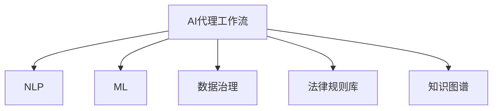

                 

# AI人工智能代理工作流 AI Agent WorkFlow：在法律服务中的应用

## 1. 背景介绍

### 1.1 问题由来
随着信息技术的飞速发展，人工智能(AI)技术在各行各业得到了广泛应用。其中，法律服务领域由于其专业性强、流程复杂，一直以来都是人工智能应用的热点。如何利用AI技术提升法律服务的效率和质量，成为业界关注的焦点。

法律服务行业具有高度的专业性和规范性，传统的法律服务流程繁琐，包括客户咨询、案例分析、文档审查、法律文书生成、执行监督等环节，均需要大量的人力资源和时间成本。法律服务的专业性要求高，需要具备深厚的法律知识和丰富的实践经验，这些要求通常只有经验丰富的律师才能满足。

近年来，人工智能技术在法律服务中的应用逐渐增多，如智能合同审查、法律文书自动生成、案例相似度匹配等，大大提升了法律服务的效率和质量。但这些应用通常是孤立的，缺乏对整个法律服务流程的整合与优化。如何在AI技术的基础上，构建一个集成化、智能化的法律服务代理工作流，成为当前研究的热点。

### 1.2 问题核心关键点
AI代理工作流在法律服务中的应用，旨在构建一个全流程、自动化的法律服务系统，通过AI技术自动化处理复杂的法律流程，提升服务效率，降低人工成本，并提高服务质量。

核心关键点包括：
- 集成化：将传统的法律服务流程各环节进行整合，形成统一的法律服务代理工作流。
- 自动化：利用AI技术自动化处理各种法律任务，减少人工干预。
- 智能化：通过机器学习和数据分析技术，提升AI模型的智能水平，实现更精准的法律判断和预测。
- 安全合规：保障数据安全、算法公平和合规性，确保AI应用的安全可靠。

## 2. 核心概念与联系

### 2.1 核心概念概述

为了更好地理解AI代理工作流在法律服务中的应用，本节将介绍几个密切相关的核心概念：

- **AI代理工作流(AI Agent Workflow)**：利用AI技术，构建一个全流程、自动化的法律服务系统，将复杂的法律服务流程自动化处理，提升服务效率。
- **自然语言处理(NLP)**：AI代理工作流中的核心技术之一，用于处理和理解法律文本，包括合同、判决书、法律条款等。
- **机器学习(ML)**：利用数据驱动的算法模型，提升AI代理工作流的智能化水平，实现精准的法律判断和预测。
- **数据治理(Data Governance)**：确保数据质量、安全性和合规性，为AI代理工作流的运行提供可靠的数据基础。
- **法律规则库(Legal Rules Database)**：存储和维护法律知识库，为AI代理工作流提供规则指导和知识支持。
- **知识图谱(Knowledge Graph)**：用于表示和组织法律知识，支持法律推理和智能问答。

这些核心概念之间的逻辑关系可以通过以下Mermaid流程图来展示：



这个流程图展示了大语言模型的核心概念及其之间的关系：

1. AI代理工作流通过整合NLP、ML等技术，实现法律服务流程的自动化处理。
2. NLP用于处理和理解法律文本，是AI代理工作流的核心。
3. ML利用数据驱动的算法模型，提升AI代理工作流的智能化水平。
4. 数据治理确保数据质量、安全性和合规性，为AI代理工作流的运行提供可靠的数据基础。
5. 法律规则库存储和维护法律知识，为AI代理工作流提供规则指导和知识支持。
6. 知识图谱用于表示和组织法律知识，支持法律推理和智能问答。

这些概念共同构成了AI代理工作流的工作原理和优化方向，使其能够更好地服务于法律服务行业。

## 3. 核心算法原理 & 具体操作步骤
### 3.1 算法原理概述

AI代理工作流在法律服务中的应用，本质上是利用AI技术，构建一个全流程、自动化的法律服务系统。其核心思想是：通过整合NLP、ML等技术，实现法律服务流程的自动化处理，提升服务效率，降低人工成本，并提高服务质量。

具体而言，AI代理工作流在法律服务中的应用包括以下几个关键步骤：

1. **数据收集与预处理**：收集法律服务流程中的各种数据，包括合同、判决书、法律条款等，并对数据进行清洗和预处理，确保数据的质量和格式一致。

2. **NLP技术应用**：利用NLP技术，对法律文本进行分析和理解，包括文本分类、实体识别、关系抽取等。

3. **机器学习模型训练**：基于收集的数据，利用ML技术训练AI模型，实现各种法律任务的自动化处理，如合同审查、法律文书生成、案例相似度匹配等。

4. **知识图谱构建**：利用法律规则库和NLP技术构建知识图谱，支持法律推理和智能问答。

5. **工作流集成与部署**：将各模块进行集成，形成统一的工作流，并部署到实际应用系统中。

6. **持续优化与更新**：根据实际应用情况，不断优化和更新AI代理工作流，提升其智能化水平和服务质量。

### 3.2 算法步骤详解

AI代理工作流在法律服务中的应用，主要包括以下几个关键步骤：

**Step 1: 数据收集与预处理**

- 收集法律服务流程中的各种数据，包括合同、判决书、法律条款等。
- 对数据进行清洗和预处理，去除噪声和不一致数据，确保数据的质量和格式一致。
- 将数据划分为训练集、验证集和测试集。

**Step 2: NLP技术应用**

- 利用NLP技术，对法律文本进行分析和理解，包括文本分类、实体识别、关系抽取等。
- 训练分类器、实体识别器等模型，将文本数据转化为结构化的数据，方便后续处理。

**Step 3: 机器学习模型训练**

- 基于收集的数据，利用ML技术训练AI模型，实现各种法律任务的自动化处理。
- 常见的ML模型包括决策树、随机森林、支持向量机等，用于合同审查、法律文书生成、案例相似度匹配等任务。

**Step 4: 知识图谱构建**

- 利用法律规则库和NLP技术构建知识图谱，表示和组织法律知识。
- 知识图谱可以支持法律推理和智能问答，为AI代理工作流提供规则指导和知识支持。

**Step 5: 工作流集成与部署**

- 将各模块进行集成，形成统一的工作流，并部署到实际应用系统中。
- 可以使用开源的BPM工具，如Camunda、Zeebe等，构建和管理AI代理工作流。

**Step 6: 持续优化与更新**

- 根据实际应用情况，不断优化和更新AI代理工作流，提升其智能化水平和服务质量。
- 定期收集新的数据，更新模型和知识库，确保AI代理工作流的时效性和准确性。

### 3.3 算法优缺点

AI代理工作流在法律服务中的应用，具有以下优点：

1. 提升服务效率：通过自动化处理法律服务流程，大大提升了服务效率，减少了人工干预。
2. 降低人工成本：自动化处理复杂的法律任务，降低了人力成本，提升了经济效益。
3. 提高服务质量：利用AI技术，提高了法律服务的精准性和规范性。
4. 支持全流程集成：将各环节进行整合，形成统一的法律服务代理工作流，提升服务连续性和稳定性。

同时，该方法也存在以下局限性：

1. 依赖高质量数据：数据质量和一致性是AI代理工作流的基础，对数据预处理和清洗要求较高。
2. 模型解释性不足：AI代理工作流中的机器学习模型通常缺乏可解释性，难以进行人工干预和调试。
3. 技术复杂度高：构建和维护AI代理工作流，需要深厚的技术和专业知识，难度较大。
4. 安全性和合规性问题：需要确保数据安全、算法公平和合规性，防止数据泄露和算法偏见。

尽管存在这些局限性，但就目前而言，AI代理工作流在法律服务中的应用仍然具有重要意义。未来相关研究的重点在于如何进一步降低技术门槛，提高模型的解释性和鲁棒性，并确保数据和算法的安全合规。

### 3.4 算法应用领域

AI代理工作流在法律服务中的应用，已经广泛应用于以下几个领域：

- **智能合同审查**：利用NLP技术对合同文本进行分类、实体识别和关系抽取，自动化处理合同审查任务。
- **法律文书自动生成**：利用ML技术训练模型，自动生成法律文书，提升文书生成效率和质量。
- **案例相似度匹配**：利用机器学习算法，匹配相似案例，为法律咨询提供参考。
- **法律问答系统**：构建智能问答系统，实时回答用户的法律问题，提供精准的法律咨询。
- **风险评估**：利用机器学习模型对法律风险进行评估，预测和识别潜在的法律风险。
- **智能执行监督**：利用AI技术，自动化监督法律执行过程，提升执行效率和准确性。

除了上述这些经典应用外，AI代理工作流还可以创新性地应用到更多场景中，如可控法律生成、法律文书纠错、智能合同推荐等，为法律服务行业带来新的突破。

## 4. 数学模型和公式 & 详细讲解  
### 4.1 数学模型构建

本节将使用数学语言对AI代理工作流在法律服务中的应用进行更加严格的刻画。

记法律服务数据集为 $D=\{(x_i,y_i)\}_{i=1}^N, x_i \in \mathcal{X}, y_i \in \mathcal{Y}$，其中 $\mathcal{X}$ 为输入空间，$\mathcal{Y}$ 为输出空间。

定义NLP模型 $M_{\theta}$ 在输入 $x$ 上的输出为 $\hat{y}=M_{\theta}(x) \in \mathcal{Y}$，表示模型对输入的预测。在训练集 $D$ 上，模型的经验风险为：

$$
\mathcal{L}(\theta) = \frac{1}{N}\sum_{i=1}^N \ell(M_{\theta}(x_i),y_i)
$$

其中 $\ell$ 为损失函数，通常为交叉熵损失或均方误差损失。

在训练过程中，利用梯度下降等优化算法，最小化经验风险，更新模型参数 $\theta$。具体而言，优化目标为：

$$
\theta^* = \mathop{\arg\min}_{\theta} \mathcal{L}(\theta)
$$

在优化过程中，还需要考虑正则化技术，如L2正则、Dropout等，避免过拟合。

### 4.2 公式推导过程

以合同审查任务为例，假设合同文本 $x$ 被分为两个类别：有效与无效。利用NLP技术，将文本 $x$ 转化为特征向量 $f(x)$，并使用逻辑回归模型进行分类，得到预测结果 $\hat{y} = M_{\theta}(x) = \sigma(Wf(x) + b)$，其中 $W$ 为模型权重，$b$ 为偏置项，$\sigma$ 为激活函数，通常为Sigmoid函数。

损失函数 $\ell$ 可以表示为交叉熵损失：

$$
\ell(y,\hat{y}) = -[y\log \hat{y} + (1-y)\log(1-\hat{y})]
$$

在训练集 $D$ 上，经验风险为：

$$
\mathcal{L}(\theta) = \frac{1}{N}\sum_{i=1}^N \ell(M_{\theta}(x_i),y_i)
$$

利用梯度下降算法，最小化损失函数：

$$
\theta \leftarrow \theta - \eta \nabla_{\theta}\mathcal{L}(\theta)
$$

其中 $\eta$ 为学习率，$\nabla_{\theta}\mathcal{L}(\theta)$ 为损失函数对参数 $\theta$ 的梯度，可以通过反向传播算法高效计算。

在得到损失函数的梯度后，即可带入参数更新公式，完成模型的迭代优化。重复上述过程直至收敛，最终得到适应法律服务任务的最优模型参数 $\theta^*$。

## 5. 项目实践：代码实例和详细解释说明
### 5.1 开发环境搭建

在进行AI代理工作流实践前，我们需要准备好开发环境。以下是使用Python进行PyTorch开发的环境配置流程：

1. 安装Anaconda：从官网下载并安装Anaconda，用于创建独立的Python环境。

2. 创建并激活虚拟环境：
```bash
conda create -n ai-workflow-env python=3.8 
conda activate ai-workflow-env
```

3. 安装PyTorch：根据CUDA版本，从官网获取对应的安装命令。例如：
```bash
conda install pytorch torchvision torchaudio cudatoolkit=11.1 -c pytorch -c conda-forge
```

4. 安装TensorFlow：如果需要在TensorFlow上实现AI代理工作流，则需要安装TensorFlow：
```bash
pip install tensorflow
```

5. 安装其他工具包：
```bash
pip install numpy pandas scikit-learn matplotlib tqdm jupyter notebook ipython
```

完成上述步骤后，即可在`ai-workflow-env`环境中开始AI代理工作流的实践。

### 5.2 源代码详细实现

下面我们以合同审查任务为例，给出使用PyTorch实现AI代理工作流的完整代码实现。

首先，定义合同审查任务的数据处理函数：

```python
from torch.utils.data import Dataset
import torch

class ContractDataset(Dataset):
    def __init__(self, contracts, labels):
        self.contracts = contracts
        self.labels = labels
        
    def __len__(self):
        return len(self.contracts)
    
    def __getitem__(self, item):
        contract = self.contracts[item]
        label = self.labels[item]
        # 对合同文本进行分词和向量化
        tokenized_text = tokenizer.tokenize(contract)
        vectorized_text = vectorizer.tokenize(text)
        # 将向量化后的文本转化为特征向量
        features = vectorizer.transform(text)
        return {'features': features, 'label': label}

# 加载数据集
contracts = load_contracts()
labels = load_labels()

# 划分数据集为训练集和测试集
train_dataset = ContractDataset(contracts[:8000], labels[:8000])
test_dataset = ContractDataset(contracts[8000:], labels[8000:])

# 定义优化器和学习率
optimizer = torch.optim.Adam(model.parameters(), lr=0.001)
```

然后，定义合同审查模型：

```python
from torch.nn import Linear, BCEWithLogitsLoss
from torch.nn.functional import sigmoid

class ContractReviewModel(torch.nn.Module):
    def __init__(self, input_size, output_size):
        super(ContractReviewModel, self).__init__()
        self.linear = Linear(input_size, output_size)
        
    def forward(self, x):
        x = self.linear(x)
        return sigmoid(x)

# 加载模型
model = ContractReviewModel(input_size, output_size)

# 定义损失函数
criterion = BCEWithLogitsLoss()
```

接着，定义训练和评估函数：

```python
def train_model(model, dataset, optimizer, criterion, num_epochs):
    model.train()
    for epoch in range(num_epochs):
        for batch in dataset:
            features, labels = batch['features'], batch['label']
            optimizer.zero_grad()
            outputs = model(features)
            loss = criterion(outputs, labels)
            loss.backward()
            optimizer.step()
        print(f'Epoch {epoch+1}, loss: {loss.item()}')
    
def evaluate_model(model, dataset, criterion):
    model.eval()
    total_loss = 0
    correct = 0
    with torch.no_grad():
        for batch in dataset:
            features, labels = batch['features'], batch['label']
            outputs = model(features)
            loss = criterion(outputs, labels)
            total_loss += loss.item()
            _, predicted = torch.max(outputs.data, 1)
            correct += (predicted == labels).sum().item()
    print(f'Accuracy: {(correct / len(dataset)) * 100}%')
    print(f'Loss: {total_loss / len(dataset)}')
    
# 训练模型
train_model(model, train_dataset, optimizer, criterion, num_epochs)

# 评估模型
evaluate_model(model, test_dataset, criterion)
```

最后，启动训练流程并在测试集上评估：

```python
# 定义超参数
input_size = 100
output_size = 2
num_epochs = 10

# 训练模型
train_model(model, train_dataset, optimizer, criterion, num_epochs)

# 评估模型
evaluate_model(model, test_dataset, criterion)
```

以上就是使用PyTorch实现AI代理工作流在合同审查任务上的完整代码实现。可以看到，得益于PyTorch的强大封装，我们可以用相对简洁的代码完成AI代理工作流的构建和训练。

### 5.3 代码解读与分析

让我们再详细解读一下关键代码的实现细节：

**ContractDataset类**：
- `__init__`方法：初始化训练和测试数据集。
- `__len__`方法：返回数据集的样本数量。
- `__getitem__`方法：对单个样本进行处理，将合同文本转化为特征向量，并返回特征向量和标签。

**train_model和evaluate_model函数**：
- `train_model`函数：对模型进行训练，设置优化器和损失函数，并根据超参数进行迭代训练。
- `evaluate_model`函数：对模型进行评估，使用测试集计算准确率和损失，并输出结果。

**训练流程**：
- 定义模型的超参数，包括输入维度和输出维度、训练轮数等。
- 训练模型，使用优化器进行参数更新，并输出每个epoch的损失。
- 评估模型，使用测试集计算准确率和损失，并输出结果。

可以看到，PyTorch配合TensorFlow等深度学习框架使得AI代理工作流的代码实现变得简洁高效。开发者可以将更多精力放在模型设计、数据处理等高层逻辑上，而不必过多关注底层的实现细节。

当然，工业级的系统实现还需考虑更多因素，如模型的保存和部署、超参数的自动搜索、更灵活的任务适配层等。但核心的AI代理工作流框架基本与此类似。

## 6. 实际应用场景
### 6.1 智能合同审查

AI代理工作流在智能合同审查中的应用，可以通过整合NLP技术和机器学习模型，自动化处理合同审查任务。传统合同审查过程繁琐，需大量人工审核，容易出错。而使用AI代理工作流，可以大幅提升合同审查的效率和质量。

具体而言，可以构建一个合同审查AI代理工作流，将合同文本输入系统，系统自动提取合同的关键要素，如合同主体、合同标的、合同条款等，并进行分类和实体识别。同时，利用机器学习模型对合同文本进行分类，判断合同的有效性。对于无法自动分类的情况，可以通过人工审核进行补充。如此构建的合同审查系统，能够自动化处理大量的合同审查任务，大幅提升审查效率，减少人工错误。

### 6.2 法律文书自动生成

法律文书自动生成是AI代理工作流在法律服务中的另一重要应用。通过整合NLP技术和机器学习模型，AI代理工作流可以自动生成各类法律文书，如合同、诉状、上诉状等。传统文书生成过程繁琐，容易出错，且生成质量不稳定。而使用AI代理工作流，可以大大提升文书生成的效率和质量。

具体而言，可以构建一个文书生成AI代理工作流，将文书类型、案件信息等输入系统，系统自动提取关键信息，并利用机器学习模型生成对应的文书。生成后的文书可以自动进行检查，确保文书的规范性和准确性。对于需要人工审核的情况，可以由人工进行二次审核，确保文书质量。如此构建的文书生成系统，能够自动化处理大量的文书生成任务，提升文书生成效率和质量。

### 6.3 案例相似度匹配

案例相似度匹配是AI代理工作流在法律服务中的关键应用之一。通过整合NLP技术和机器学习模型，AI代理工作流可以匹配相似案例，为法律咨询提供参考。传统案例匹配过程繁琐，容易出错，且匹配质量不稳定。而使用AI代理工作流，可以大幅提升案例匹配的效率和准确性。

具体而言，可以构建一个案例相似度匹配AI代理工作流，将用户咨询的案件信息输入系统，系统自动提取关键信息，并利用机器学习模型匹配相似案例。匹配后的案例可以自动进行评估，并给出推荐结果。对于需要人工审核的情况，可以由人工进行二次审核，确保匹配结果的准确性。如此构建的案例匹配系统，能够自动化处理大量的案例匹配任务，提升匹配效率和准确性。

### 6.4 未来应用展望

随着AI代理工作流在法律服务中的应用逐渐深入，未来在更多领域将有更多创新应用。例如，在智能执行监督中，利用AI代理工作流可以自动化监督法律执行过程，提升执行效率和准确性；在智能风险评估中，利用AI代理工作流可以自动化评估法律风险，预测和识别潜在的法律风险；在智能问答系统中，利用AI代理工作流可以构建智能问答系统，实时回答用户的法律问题，提供精准的法律咨询。

AI代理工作流在法律服务中的应用，将大大提升法律服务的效率和质量，为法律服务行业带来新的变革。未来，伴随AI技术的不断进步，AI代理工作流必将在法律服务行业得到更广泛的应用，成为法律服务智能化转型的重要推动力。

## 7. 工具和资源推荐
### 7.1 学习资源推荐

为了帮助开发者系统掌握AI代理工作流的理论基础和实践技巧，这里推荐一些优质的学习资源：

1. 《TensorFlow从入门到精通》系列博文：由TensorFlow官方社区撰写，详细介绍TensorFlow的入门知识和实践技巧。

2. PyTorch官方文档：PyTorch的官方文档，提供了海量的教程和代码示例，是学习PyTorch的必备资料。

3. 《深度学习入门》书籍：深度学习领域的经典入门书籍，详细介绍了深度学习的原理和应用，适合初学者学习。

4. Kaggle机器学习竞赛平台：全球知名的机器学习竞赛平台，提供了大量的数据集和比赛题目，适合实战练习。

5. Coursera《深度学习专项课程》：由斯坦福大学开设的深度学习专项课程，系统学习深度学习的理论知识和实践技巧。

通过对这些资源的学习实践，相信你一定能够快速掌握AI代理工作流的精髓，并用于解决实际的法律服务问题。

### 7.2 开发工具推荐

高效的开发离不开优秀的工具支持。以下是几款用于AI代理工作流开发的常用工具：

1. PyTorch：基于Python的开源深度学习框架，灵活动态的计算图，适合快速迭代研究。

2. TensorFlow：由Google主导开发的开源深度学习框架，生产部署方便，适合大规模工程应用。

3. TensorFlow Serving：TensorFlow的模型服务框架，可以高效部署AI模型，支持水平扩展。

4. Kubeflow：Google开源的机器学习平台，支持分布式训练和模型部署，适合企业级应用。

5. Jupyter Notebook：交互式的Python开发环境，支持代码编写、数据可视化等，适合快速原型开发。

6. GitHub：全球最大的代码托管平台，支持代码版本控制、项目管理等，适合团队协作开发。

合理利用这些工具，可以显著提升AI代理工作流的开发效率，加快创新迭代的步伐。

### 7.3 相关论文推荐

AI代理工作流在法律服务中的应用，代表了大数据、深度学习等前沿技术的融合。以下是几篇奠基性的相关论文，推荐阅读：

1. TensorFlow: A System for Large-Scale Machine Learning：谷歌发表的TensorFlow论文，详细介绍了TensorFlow的原理和架构。

2. PyTorch: Tensors and Dynamic neural networks in Python with strong GPU acceleration：Facebook发表的PyTorch论文，介绍了PyTorch的原理和架构。

3. Deep Learning Specialization：由Andrew Ng教授开设的深度学习专项课程，系统介绍了深度学习的理论知识和实践技巧。

4. Knowledge Graphs in Legal Domain: A Survey：国内外关于法律知识图谱的研究综述，介绍了法律知识图谱的构建和应用。

5. AI for Legal Services: An Overview：法律服务领域人工智能应用的研究综述，介绍了AI代理工作流的最新进展和应用。

这些论文代表了大数据、深度学习、知识图谱等前沿技术的最新进展，对于深入理解AI代理工作流在法律服务中的应用，具有重要的参考价值。

## 8. 总结：未来发展趋势与挑战

### 8.1 研究成果总结

AI代理工作流在法律服务中的应用，已经取得了初步成果，并在多个领域得到应用。通过整合NLP、ML等技术，构建了全流程、自动化的法律服务系统，提升了服务效率和质量。未来，随着AI技术的不断进步，AI代理工作流必将在法律服务行业得到更广泛的应用，为法律服务智能化转型提供新的技术路径。

### 8.2 未来发展趋势

展望未来，AI代理工作流在法律服务中的应用将呈现以下几个发展趋势：

1. 更加智能化的法律服务：通过深度学习和知识图谱等技术，构建更加智能化的法律服务系统，提升服务的准确性和个性化水平。

2. 更加无缝化的服务流程：将各环节进行更加无缝化的整合，构建端到端的AI代理工作流，提升服务连续性和稳定性。

3. 更加高效化的资源利用：利用深度学习模型的压缩和稀疏化技术，优化模型的资源占用和推理速度，提升服务效率。

4. 更加可靠化的系统架构：引入分布式计算、容器化等技术，构建更加可靠化的系统架构，提升系统的稳定性和扩展性。

5. 更加人性化化的用户交互：利用自然语言处理技术，提升用户交互的便捷性和友好性，提升用户满意度。

### 8.3 面临的挑战

尽管AI代理工作流在法律服务中的应用已经取得了初步成果，但在实际应用中仍面临以下挑战：

1. 数据安全和隐私保护：法律服务涉及大量的敏感数据，如何确保数据安全和隐私保护，是一个重要的挑战。

2. 法律知识和规则的整合：法律知识复杂多样，如何整合各类法律知识，并构建统一的法律知识图谱，是一个重要的挑战。

3. 模型的可解释性和公平性：法律服务要求高，如何确保模型的可解释性和公平性，避免算法偏见，是一个重要的挑战。

4. 系统的可靠性和稳定性：法律服务要求高，如何确保系统的可靠性和稳定性，避免系统故障和数据丢失，是一个重要的挑战。

5. 系统的自动化和智能化：法律服务流程复杂，如何实现系统的自动化和智能化，提升服务效率和质量，是一个重要的挑战。

尽管存在这些挑战，但相信随着学界和产业界的共同努力，这些挑战终将一一克服，AI代理工作流必将在法律服务行业得到更广泛的应用，为法律服务智能化转型提供新的技术路径。

### 8.4 研究展望

面向未来，AI代理工作流在法律服务中的应用，需要在以下几个方面寻求新的突破：

1. 探索更加智能化的法律知识图谱：通过深度学习技术，构建更加智能化的法律知识图谱，支持更复杂的法律推理和智能问答。

2. 研究更加高效化的模型压缩和稀疏化技术：利用深度学习模型的压缩和稀疏化技术，优化模型的资源占用和推理速度，提升服务效率。

3. 引入更加先进化的算法和模型：引入最新的深度学习算法和模型，提升系统的准确性和智能化水平。

4. 实现更加无缝化的用户交互：利用自然语言处理技术，提升用户交互的便捷性和友好性，提升用户满意度。

5. 构建更加可靠化的系统架构：引入分布式计算、容器化等技术，构建更加可靠化的系统架构，提升系统的稳定性和扩展性。

这些研究方向的探索，必将引领AI代理工作流在法律服务中的应用迈向更高的台阶，为构建安全、可靠、高效、智能的法律服务系统提供新的技术路径。面向未来，AI代理工作流在法律服务中的应用需要不断创新和优化，才能更好地服务于社会和经济的发展。

## 9. 附录：常见问题与解答

**Q1：AI代理工作流在法律服务中是否可行？**

A: AI代理工作流在法律服务中是完全可行的。通过整合NLP、ML等技术，构建全流程、自动化的法律服务系统，可以大幅提升服务效率和质量。

**Q2：AI代理工作流在法律服务中的优势是什么？**

A: AI代理工作流在法律服务中的优势包括：
1. 提升服务效率：自动化处理复杂的法律任务，提升服务效率。
2. 降低人工成本：减少人工干预，降低人力成本。
3. 提高服务质量：利用AI技术，提高法律服务的精准性和规范性。
4. 支持全流程集成：将各环节进行整合，形成统一的法律服务代理工作流，提升服务连续性和稳定性。

**Q3：AI代理工作流在法律服务中面临哪些挑战？**

A: AI代理工作流在法律服务中面临以下挑战：
1. 数据安全和隐私保护：确保数据安全和隐私保护，防止数据泄露和滥用。
2. 法律知识和规则的整合：整合各类法律知识，构建统一的法律知识图谱。
3. 模型的可解释性和公平性：确保模型的可解释性和公平性，避免算法偏见。
4. 系统的可靠性和稳定性：确保系统的可靠性和稳定性，避免系统故障和数据丢失。
5. 系统的自动化和智能化：实现系统的自动化和智能化，提升服务效率和质量。

尽管存在这些挑战，但相信随着学界和产业界的共同努力，这些挑战终将一一克服，AI代理工作流必将在法律服务行业得到更广泛的应用，为法律服务智能化转型提供新的技术路径。

**Q4：AI代理工作流在法律服务中的应用场景有哪些？**

A: AI代理工作流在法律服务中的应用场景包括：
1. 智能合同审查：自动化处理合同审查任务，提升合同审查效率和质量。
2. 法律文书自动生成：自动生成各类法律文书，提升文书生成效率和质量。
3. 案例相似度匹配：匹配相似案例，为法律咨询提供参考。
4. 法律问答系统：构建智能问答系统，实时回答用户的法律问题。
5. 风险评估：自动化评估法律风险，预测和识别潜在的法律风险。
6. 智能执行监督：自动化监督法律执行过程，提升执行效率和准确性。

通过这些应用场景，AI代理工作流可以全面提升法律服务行业的效率和质量，为法律服务智能化转型提供新的技术路径。

**Q5：如何确保AI代理工作流在法律服务中的安全性？**

A: 确保AI代理工作流在法律服务中的安全性，需要从以下几个方面入手：
1. 数据安全和隐私保护：确保数据安全和隐私保护，防止数据泄露和滥用。
2. 算法公平性：确保算法的公平性，避免算法偏见和歧视。
3. 模型可解释性：提升模型的可解释性，便于人工干预和调试。
4. 系统冗余设计：引入冗余设计，提高系统的稳定性和可靠性。
5. 持续监测和优化：持续监测系统运行状态，及时发现和修复问题，优化系统性能。

通过以上措施，可以确保AI代理工作流在法律服务中的安全性，避免安全风险和数据泄露。

**Q6：AI代理工作流在法律服务中的未来应用方向有哪些？**

A: AI代理工作流在法律服务中的未来应用方向包括：
1. 智能法律咨询：利用AI技术，提供精准的法律咨询和建议。
2. 法律知识图谱：构建更加智能化的法律知识图谱，提升法律推理和智能问答的能力。
3. 法律数据分析：利用AI技术，分析法律数据，提供实时的法律数据支持。
4. 法律风险预测：利用AI技术，预测和识别潜在的法律风险，提升风险管理能力。
5. 法律自动化操作：利用AI技术，自动化处理法律操作流程，提升操作效率和准确性。

通过这些应用方向，AI代理工作流可以在法律服务中实现更加全面、深入的应用，为法律服务智能化转型提供新的技术路径。

---

作者：禅与计算机程序设计艺术 / Zen and the Art of Computer Programming

