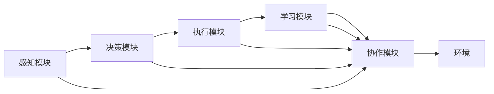

                 

# AI人工智能代理工作流 AI Agent WorkFlow：在物流与供应链中的应用

> 关键词：人工智能(AI)、代理工作流、物流与供应链、智能物流、智慧供应链、自动化

## 1. 背景介绍

### 1.1 问题由来
随着全球化的加速和电子商务的兴起，物流与供应链已成为现代经济的重要组成部分。传统的物流与供应链管理依赖于人工操作和繁杂的流程，效率低下、成本高昂。而在数字化转型的大背景下，引入人工智能(AI)技术，能够显著提升物流与供应链的自动化、智能化水平，实现高效、低成本、高可靠性的运营。

近年来，人工智能在物流与供应链中的应用越来越广泛，涉及库存管理、订单处理、货物配送、质量检测等多个环节。其中，智能代理(AI Agent)作为自动化决策和协同管理的核心技术，能够根据环境变化自适应地做出最优决策，极大提升了物流与供应链的运营效率和灵活性。

### 1.2 问题核心关键点
智能代理在物流与供应链中的应用，需要解决以下核心关键点：

- 智能代理模型如何构建，包括选择代理架构、设计任务模型等。
- 智能代理如何获取环境信息，包括传感器数据、业务规则等。
- 智能代理如何进行决策优化，包括使用优化算法、引入优先级策略等。
- 智能代理如何实现协同与通信，包括选择通信协议、设计协调算法等。
- 智能代理如何评估与优化，包括使用性能指标、进行仿真实验等。

这些关键问题共同构成智能代理在物流与供应链中的系统解决方案，帮助企业实现全面自动化和智能化转型。

### 1.3 问题研究意义
智能代理在物流与供应链中的应用，具有以下重要意义：

1. **提升运营效率**：智能代理能够自动处理复杂流程，优化资源配置，减少人为干预，大幅提升物流与供应链的整体效率。
2. **降低运营成本**：通过自动决策与调度，减少人工操作和相关费用，优化资源使用，有效降低运营成本。
3. **提高供应链透明度**：智能代理可以实时监测和记录供应链各个环节的状态，提供决策支持，提高供应链的透明度和可追溯性。
4. **增强风险管理**：智能代理能够快速响应环境变化，预测和缓解潜在风险，保障供应链的稳定性。
5. **促进企业创新**：智能代理的应用加速了物流与供应链的数字化进程，催生了更多创新应用和业务模式。

因此，研究智能代理在物流与供应链中的应用，对于推动物流与供应链的智能化转型，提升企业竞争力具有重要意义。

## 2. 核心概念与联系

### 2.1 核心概念概述

智能代理(AI Agent)是指在特定环境或任务中，能够自主感知、决策、执行、学习和协作的人工智能系统。它通过感知模块获取环境信息，决策模块生成行动策略，执行模块实施决策，学习模块更新知识，协作模块与其他智能体或人类进行沟通协作。

智能代理在物流与供应链中的应用，涉及到多种智能体（如仓库、车辆、配送员等）的协同工作，需要解决任务分配、路径规划、库存管理等复杂问题。

### 2.2 核心概念原理和架构的 Mermaid 流程图



这个流程图展示了智能代理的基本架构和工作流程。感知模块获取环境信息，决策模块生成决策，执行模块执行决策，学习模块更新知识，协作模块进行沟通，共同完成物流与供应链的任务。

### 2.3 智能代理架构与类型

智能代理的架构可以分为集中式、分布式和混合式三种类型。

- **集中式架构**：所有的智能体通过中央控制器进行统一协调和决策。适用于数据集中、控制集中的场景，如中央仓库管理。
- **分布式架构**：每个智能体独立决策，通过网络进行通信和协作。适用于分布式、自主决策的场景，如智能仓储机器人。
- **混合式架构**：结合集中式和分布式的特点，中央控制器负责高层次决策，智能体负责本地决策和执行。适用于复杂、动态变化的环境，如智能配送网络。

不同架构的智能代理适用于不同的物流与供应链场景，开发者需要根据具体需求进行选择。

## 3. 核心算法原理 & 具体操作步骤

### 3.1 算法原理概述

智能代理在物流与供应链中的应用，主要涉及任务规划、路径优化、库存管理等算法。

- **任务规划**：通过任务调度算法，将物流任务分配给不同的智能体。
- **路径优化**：使用图论或动态规划算法，寻找最优路径。
- **库存管理**：通过需求预测算法，动态调整库存水平。

这些算法通常需要结合具体场景和业务规则进行设计，以达到最优的效果。

### 3.2 算法步骤详解

智能代理在物流与供应链中的应用，一般包括以下几个关键步骤：

**Step 1: 环境建模与数据采集**
- 构建物流与供应链的虚拟环境模型，包括仓库、车辆、配送路线等。
- 设计传感器和数据采集系统，实时获取物流过程中的环境信息，如位置、速度、货物状态等。

**Step 2: 任务模型定义与智能体部署**
- 根据具体业务需求，定义任务模型，如订单处理、货物配送、库存管理等。
- 部署智能体，如仓库机器人、智能车辆、配送员等，并进行初始化配置。

**Step 3: 感知模块与决策模块设计**
- 设计感知模块，获取环境信息和任务状态。
- 设计决策模块，使用优化算法、启发式搜索等方法生成决策策略。

**Step 4: 执行模块与协作模块实现**
- 实现执行模块，将决策转化为具体的动作，如移动、操作、沟通等。
- 实现协作模块，与其他智能体或人类进行通信，协调工作。

**Step 5: 学习模块与优化策略**
- 实现学习模块，通过机器学习算法（如强化学习、深度学习等）更新代理知识。
- 设计优化策略，如动态调整学习率、引入优先级策略等。

**Step 6: 模拟与测试**
- 使用仿真工具对智能代理进行模拟测试，验证其性能和稳定性。
- 在实际环境中进行小规模试点，收集反馈和数据，进一步优化代理模型。

### 3.3 算法优缺点

智能代理在物流与供应链中的应用具有以下优点：

- **自主决策与优化**：智能代理能够根据实时环境信息进行自主决策，优化资源配置和任务分配。
- **高效率与低成本**：通过自动化和智能化的操作，显著提升物流与供应链的效率，减少人工成本。
- **灵活性与适应性**：智能代理能够灵活应对复杂多变的环境和业务需求。

同时，也存在以下缺点：

- **算法复杂性**：智能代理的设计和优化涉及复杂的算法和数学模型，开发难度较高。
- **数据质量要求高**：智能代理的性能依赖于高质量的环境数据，数据采集和处理的复杂度较高。
- **通信延迟和带宽限制**：智能代理之间的通信可能受限于带宽和延迟，影响协同效果。
- **模型可解释性**：复杂的智能代理模型往往缺乏可解释性，难以理解其决策过程。

### 3.4 算法应用领域

智能代理在物流与供应链中的应用，可以广泛拓展到以下几个领域：

- **智能仓储管理**：使用智能代理优化仓库内的货物存储和拣选。
- **智能车辆调度**：使用智能代理优化车辆路径和配送路线。
- **智能订单处理**：使用智能代理处理订单信息，提升订单处理速度和准确性。
- **智能库存管理**：使用智能代理进行需求预测和库存调整。
- **智能质量检测**：使用智能代理对货物进行自动检测和分类。

## 4. 数学模型和公式 & 详细讲解 & 举例说明

### 4.1 数学模型构建

本节将使用数学语言对智能代理在物流与供应链中的应用进行严格的刻画。

假设物流系统中有 $n$ 个智能体，每个智能体 $i$ 在时间 $t$ 的位置为 $x_i(t)$，速度为 $v_i(t)$，任务队列长度为 $q_i(t)$，库存水平为 $s_i(t)$。

定义智能体 $i$ 的任务完成率为 $P_i(t)$，决策时刻为 $T_i(t)$，执行时刻为 $E_i(t)$。

智能代理的任务模型可以表示为：

$$
\max_{\{x_i(t), v_i(t), q_i(t), s_i(t), P_i(t), T_i(t), E_i(t)\}} \sum_{t=0}^{T} R_i(t)
$$

其中 $R_i(t)$ 为时间 $t$ 的任务收益，通常包括订单处理速度、货物交付准确性、库存成本等。

### 4.2 公式推导过程

以智能车辆调度为例，推导车辆路径优化问题的数学模型。

假设物流系统中有 $m$ 个目的地，车辆 $j$ 的当前位置为 $x_j$，速度为 $v_j$，已访问的目的地集合为 $S_j$，剩余未访问的目的地数量为 $U_j$。

定义车辆路径优化问题为：

$$
\min_{x_j, v_j, S_j, U_j} \sum_{j=1}^m C_{ij} d_{ij}
$$

其中 $C_{ij}$ 为车辆 $j$ 到目的地 $i$ 的固定成本，$d_{ij}$ 为车辆 $j$ 到目的地 $i$ 的旅行时间。

利用动态规划算法求解上述问题，可以得到最优路径。具体步骤包括：

1. 定义状态：车辆位置 $x_j$、已访问目的地集合 $S_j$、未访问目的地数量 $U_j$。
2. 定义状态转移方程：从当前状态 $(x_j, S_j, U_j)$ 到下一个状态 $(x_j', S_j', U_j')$，转移概率为 $P(x_j', S_j', U_j' | x_j, S_j, U_j)$。
3. 定义决策变量：选择下一个访问的目的地 $i$。
4. 定义成本函数：从当前状态 $(x_j, S_j, U_j)$ 到下一个状态 $(x_j', S_j', U_j')$ 的成本为 $C_{ij} d_{ij}$。
5. 定义收益函数：从当前状态 $(x_j, S_j, U_j)$ 到下一个状态 $(x_j', S_j', U_j')$ 的收益为 $R_{ij}$。
6. 定义值函数：定义状态 $(x_j, S_j, U_j)$ 的值函数 $V(x_j, S_j, U_j)$。
7. 求解动态规划方程：通过迭代求解，得到最优解。

### 4.3 案例分析与讲解

以智能库存管理为例，展示如何使用智能代理进行需求预测和库存调整。

假设仓库有 $k$ 个库存位置，每个位置 $i$ 的库存水平为 $s_i$，需求率为 $\lambda_i$。

智能代理的任务模型可以表示为：

$$
\max_{s_i} \sum_{i=1}^k (s_i - c_i)^2
$$

其中 $c_i$ 为库存位置的容量。

智能代理可以使用历史需求数据和库存水平，通过机器学习算法（如时间序列预测、回归分析等），预测未来的需求量，动态调整库存水平，以最小化库存成本。

## 5. 项目实践：代码实例和详细解释说明

### 5.1 开发环境搭建

在进行智能代理在物流与供应链中的应用实践前，我们需要准备好开发环境。以下是使用Python进行PyTorch开发的环境配置流程：

1. 安装Anaconda：从官网下载并安装Anaconda，用于创建独立的Python环境。

2. 创建并激活虚拟环境：
```bash
conda create -n agent-env python=3.8 
conda activate agent-env
```

3. 安装PyTorch：根据CUDA版本，从官网获取对应的安装命令。例如：
```bash
conda install pytorch torchvision torchaudio cudatoolkit=11.1 -c pytorch -c conda-forge
```

4. 安装各类工具包：
```bash
pip install numpy pandas scikit-learn matplotlib tqdm jupyter notebook ipython
```

完成上述步骤后，即可在`agent-env`环境中开始智能代理在物流与供应链中的应用实践。

### 5.2 源代码详细实现

下面我们以智能仓储管理为例，给出使用Transformers库对智能代理进行微调的PyTorch代码实现。

首先，定义智能代理的任务模型和环境：

```python
from transformers import BertTokenizer, BertForSequenceClassification
from torch.utils.data import Dataset
import torch

class InventoryDataset(Dataset):
    def __init__(self, inventory_data, tokenizer, max_len=128):
        self.inventory_data = inventory_data
        self.tokenizer = tokenizer
        self.max_len = max_len
        
    def __len__(self):
        return len(self.inventory_data)
    
    def __getitem__(self, item):
        inventory_info = self.inventory_data[item]
        
        encoding = self.tokenizer(inventory_info, return_tensors='pt', max_length=self.max_len, padding='max_length', truncation=True)
        input_ids = encoding['input_ids'][0]
        attention_mask = encoding['attention_mask'][0]
        
        return {'input_ids': input_ids, 
                'attention_mask': attention_mask,
                'labels': [inventory_info['demand']]}
```

然后，定义智能代理模型和优化器：

```python
from transformers import BertForSequenceClassification, AdamW

model = BertForSequenceClassification.from_pretrained('bert-base-cased', num_labels=1)

optimizer = AdamW(model.parameters(), lr=2e-5)
```

接着，定义训练和评估函数：

```python
from torch.utils.data import DataLoader
from tqdm import tqdm
from sklearn.metrics import mean_squared_error

device = torch.device('cuda') if torch.cuda.is_available() else torch.device('cpu')
model.to(device)

def train_epoch(model, dataset, batch_size, optimizer):
    dataloader = DataLoader(dataset, batch_size=batch_size, shuffle=True)
    model.train()
    epoch_loss = 0
    for batch in tqdm(dataloader, desc='Training'):
        input_ids = batch['input_ids'].to(device)
        attention_mask = batch['attention_mask'].to(device)
        labels = batch['labels'].to(device)
        model.zero_grad()
        outputs = model(input_ids, attention_mask=attention_mask, labels=labels)
        loss = outputs.loss
        epoch_loss += loss.item()
        loss.backward()
        optimizer.step()
    return epoch_loss / len(dataloader)

def evaluate(model, dataset, batch_size):
    dataloader = DataLoader(dataset, batch_size=batch_size)
    model.eval()
    mse = 0
    for batch in tqdm(dataloader, desc='Evaluating'):
        input_ids = batch['input_ids'].to(device)
        attention_mask = batch['attention_mask'].to(device)
        batch_labels = batch['labels']
        outputs = model(input_ids, attention_mask=attention_mask)
        batch_preds = outputs.logits.mean().item()
        batch_labels = batch_labels.to('cpu').tolist()
        for label in batch_labels:
            mse += (batch_preds - label)**2
    return mse / len(dataset)

```

最后，启动训练流程并在测试集上评估：

```python
epochs = 5
batch_size = 16

for epoch in range(epochs):
    loss = train_epoch(model, inventory_dataset, batch_size, optimizer)
    print(f"Epoch {epoch+1}, train loss: {loss:.3f}")
    
    print(f"Epoch {epoch+1}, test mse: {evaluate(model, inventory_dataset, batch_size)}
    
print("Training complete.")
```

以上就是使用PyTorch对智能代理在物流与供应链中的应用进行微调的完整代码实现。可以看到，得益于Transformers库的强大封装，我们可以用相对简洁的代码完成智能代理模型的微调。

### 5.3 代码解读与分析

让我们再详细解读一下关键代码的实现细节：

**InventoryDataset类**：
- `__init__`方法：初始化库存数据、分词器等关键组件。
- `__len__`方法：返回数据集的样本数量。
- `__getitem__`方法：对单个样本进行处理，将库存信息输入编码为token ids，将需求量编码为数字，并对其进行定长padding，最终返回模型所需的输入。

**模型与优化器**：
- 使用BertForSequenceClassification模型作为智能代理模型，其设计类似于二分类任务，用于预测库存需求。
- 使用AdamW优化器，设置学习率为2e-5，以避免过拟合。

**训练和评估函数**：
- 使用PyTorch的DataLoader对数据集进行批次化加载，供模型训练和推理使用。
- 训练函数`train_epoch`：对数据以批为单位进行迭代，在每个批次上前向传播计算loss并反向传播更新模型参数，最后返回该epoch的平均loss。
- 评估函数`evaluate`：与训练类似，不同点在于不更新模型参数，并在每个batch结束后将预测和标签结果存储下来，最后使用sklearn的mean_squared_error计算模型在测试集上的均方误差。

**训练流程**：
- 定义总的epoch数和batch size，开始循环迭代
- 每个epoch内，先在训练集上训练，输出平均loss
- 在测试集上评估，输出均方误差
- 所有epoch结束后，输出训练完成信息

可以看到，PyTorch配合Transformers库使得智能代理在物流与供应链中的应用微调代码实现变得简洁高效。开发者可以将更多精力放在数据处理、模型改进等高层逻辑上，而不必过多关注底层的实现细节。

当然，工业级的系统实现还需考虑更多因素，如模型的保存和部署、超参数的自动搜索、更灵活的任务适配层等。但核心的微调范式基本与此类似。

## 6. 实际应用场景

### 6.1 智能仓储管理

智能代理在智能仓储管理中的应用，可以帮助企业优化库存水平、提高拣选效率、减少仓储成本。

通过智能代理，仓库可以实时监测库存水平和需求信息，根据历史数据和实时环境信息，动态调整库存策略。智能代理还可以预测需求峰值，提前调整库存水平，避免库存短缺或过剩。

在实际应用中，智能代理需要与仓储机器人、订单系统、货物信息系统等进行信息交互，协同完成货物的存储、拣选、配送等任务。智能代理可以根据任务优先级和资源约束，进行任务分配和路径规划，提高整个仓储系统的运行效率。

### 6.2 智能车辆调度

智能代理在智能车辆调度中的应用，可以优化车辆的路径规划和配送路线，提升货物运输效率和配送准确性。

通过智能代理，配送中心可以根据实时需求信息，动态规划车辆的路径，减少运输时间和成本。智能代理还可以预测交通状况，选择最优的配送路线，避开拥堵和高峰时段，提高配送效率。

在实际应用中，智能代理需要与车辆管理系统、订单系统、路径规划系统等进行信息交互，协同完成车辆的调度和配送任务。智能代理可以根据任务优先级和资源约束，进行任务分配和路径规划，提高整个物流系统的运行效率。

### 6.3 智能订单处理

智能代理在智能订单处理中的应用，可以优化订单处理流程，提高订单处理速度和准确性。

通过智能代理，订单处理系统可以根据实时需求信息，动态调整订单处理流程和资源分配。智能代理还可以预测订单高峰期，提前进行资源准备，避免订单积压。

在实际应用中，智能代理需要与订单管理系统、库存管理系统、客户管理系统等进行信息交互，协同完成订单的接收、处理、跟踪等任务。智能代理可以根据任务优先级和资源约束，进行任务分配和流程优化，提高整个订单处理系统的运行效率。

### 6.4 未来应用展望

随着智能代理在物流与供应链中的应用不断拓展，未来可以预见以下趋势：

1. **自动化程度提高**：智能代理将进一步提升自动化程度，实现从数据采集到任务执行的全流程自动化，大幅减少人工干预。
2. **智能化水平提升**：智能代理将通过更复杂、更高效的算法和模型，提升决策的智能性和精确度，支持更加复杂多变的业务需求。
3. **多模态协同增强**：智能代理将融合更多传感器和数据源，实现多模态协同工作，提高系统的灵活性和可靠性。
4. **实时化能力增强**：智能代理将通过实时处理和决策，适应更加动态和复杂的环境，提升系统的响应速度和稳定性。
5. **业务集成增强**：智能代理将进一步与业务系统集成，实现更全面的业务管理和决策支持。

以上趋势凸显了智能代理在物流与供应链中的广阔前景。这些方向的探索发展，必将进一步提升物流与供应链的智能化水平，为企业的数字化转型提供更强大的技术支撑。

## 7. 工具和资源推荐

### 7.1 学习资源推荐

为了帮助开发者系统掌握智能代理在物流与供应链中的应用理论基础和实践技巧，这里推荐一些优质的学习资源：

1. 《人工智能基础》系列博文：由人工智能专家撰写，深入浅出地介绍了智能代理的基本概念和应用场景。

2. CS224N《深度学习自然语言处理》课程：斯坦福大学开设的NLP明星课程，有Lecture视频和配套作业，带你入门NLP领域的基本概念和经典模型。

3. 《深度学习与强化学习》书籍：全面介绍了深度学习和强化学习的原理和应用，包括智能代理在物流与供应链中的应用。

4. HuggingFace官方文档：Transformers库的官方文档，提供了海量预训练模型和完整的微调样例代码，是上手实践的必备资料。

5. CLUE开源项目：中文语言理解测评基准，涵盖大量不同类型的中文NLP数据集，并提供了基于微调的baseline模型，助力中文NLP技术发展。

通过对这些资源的学习实践，相信你一定能够快速掌握智能代理在物流与供应链中的应用精髓，并用于解决实际的NLP问题。

### 7.2 开发工具推荐

高效的开发离不开优秀的工具支持。以下是几款用于智能代理在物流与供应链中的应用开发的常用工具：

1. PyTorch：基于Python的开源深度学习框架，灵活动态的计算图，适合快速迭代研究。大部分预训练语言模型都有PyTorch版本的实现。

2. TensorFlow：由Google主导开发的开源深度学习框架，生产部署方便，适合大规模工程应用。同样有丰富的预训练语言模型资源。

3. Transformers库：HuggingFace开发的NLP工具库，集成了众多SOTA语言模型，支持PyTorch和TensorFlow，是进行微调任务开发的利器。

4. Weights & Biases：模型训练的实验跟踪工具，可以记录和可视化模型训练过程中的各项指标，方便对比和调优。与主流深度学习框架无缝集成。

5. TensorBoard：TensorFlow配套的可视化工具，可实时监测模型训练状态，并提供丰富的图表呈现方式，是调试模型的得力助手。

6. Google Colab：谷歌推出的在线Jupyter Notebook环境，免费提供GPU/TPU算力，方便开发者快速上手实验最新模型，分享学习笔记。

合理利用这些工具，可以显著提升智能代理在物流与供应链中的应用开发效率，加快创新迭代的步伐。

### 7.3 相关论文推荐

智能代理在物流与供应链中的应用研究源于学界的持续研究。以下是几篇奠基性的相关论文，推荐阅读：

1. Intelligent Agents in Logistics and Supply Chain Management：提出基于智能代理的物流与供应链管理系统，详细介绍了其架构和应用场景。

2. Machine Learning in Logistics and Supply Chain Management：介绍了机器学习在物流与供应链中的应用，包括预测、优化、调度等任务。

3. Reinforcement Learning for Logistics and Supply Chain Management：使用强化学习算法优化物流与供应链管理，包括路径规划、库存管理等任务。

4. Dynamic Programming in Logistics and Supply Chain Management：使用动态规划算法优化物流与供应链管理，包括路径规划、需求预测等任务。

5. Multi-agent Systems in Logistics and Supply Chain Management：研究多智能体系统在物流与供应链中的应用，包括协作、通信、优化等任务。

这些论文代表了大模型微调技术的发展脉络。通过学习这些前沿成果，可以帮助研究者把握学科前进方向，激发更多的创新灵感。

## 8. 总结：未来发展趋势与挑战

### 8.1 总结

本文对智能代理在物流与供应链中的应用进行了全面系统的介绍。首先阐述了智能代理的基本概念和架构，明确了其在物流与供应链中的系统解决方案。其次，从原理到实践，详细讲解了智能代理的任务模型和算法实现，给出了智能代理在物流与供应链中的应用代码实例。同时，本文还广泛探讨了智能代理在智能仓储管理、智能车辆调度、智能订单处理等具体场景中的应用，展示了智能代理的巨大潜力。此外，本文精选了智能代理技术的各类学习资源，力求为开发者提供全方位的技术指引。

通过本文的系统梳理，可以看到，智能代理在物流与供应链中的应用极大地提升了物流与供应链的自动化和智能化水平，推动了物流与供应链的数字化进程。相信随着智能代理技术的不断发展，其在物流与供应链中的应用将更加广泛和深入，为企业的智能化转型提供更强大的技术支撑。

### 8.2 未来发展趋势

展望未来，智能代理在物流与供应链中的应用将呈现以下几个发展趋势：

1. **自动化程度提高**：智能代理将进一步提升自动化程度，实现从数据采集到任务执行的全流程自动化，大幅减少人工干预。
2. **智能化水平提升**：智能代理将通过更复杂、更高效的算法和模型，提升决策的智能性和精确度，支持更加复杂多变的业务需求。
3. **多模态协同增强**：智能代理将融合更多传感器和数据源，实现多模态协同工作，提高系统的灵活性和可靠性。
4. **实时化能力增强**：智能代理将通过实时处理和决策，适应更加动态和复杂的环境，提升系统的响应速度和稳定性。
5. **业务集成增强**：智能代理将进一步与业务系统集成，实现更全面的业务管理和决策支持。

以上趋势凸显了智能代理在物流与供应链中的广阔前景。这些方向的探索发展，必将进一步提升物流与供应链的智能化水平，为企业的数字化转型提供更强大的技术支撑。

### 8.3 面临的挑战

尽管智能代理在物流与供应链中的应用已经取得了一定成果，但在迈向更加智能化、普适化应用的过程中，它仍面临诸多挑战：

1. **数据质量瓶颈**：智能代理的性能依赖于高质量的环境数据，数据采集和处理的复杂度较高。如何提高数据采集的效率和准确性，是一个重要的研究方向。
2. **模型复杂性**：智能代理的设计和优化涉及复杂的算法和数学模型，开发难度较高。如何在保持高性能的同时，降低模型复杂度，是一个重要的研究课题。
3. **通信延迟和带宽限制**：智能代理之间的通信可能受限于带宽和延迟，影响协同效果。如何优化通信协议，提高数据传输效率，是一个重要的研究方向。
4. **模型可解释性**：复杂的智能代理模型往往缺乏可解释性，难以理解其决策过程。如何增强模型的可解释性，保障系统的透明性和可靠性，是一个重要的研究方向。
5. **安全性与隐私保护**：智能代理的应用涉及大量的物流数据和敏感信息，如何保护数据隐私和安全，是一个重要的研究课题。

这些挑战需要多方协同合作，综合运用多学科知识，才能逐步克服，使智能代理在物流与供应链中的应用更加高效、安全、可靠。

### 8.4 研究展望

面向未来，智能代理在物流与供应链中的应用还需要在以下几个方面进行深入研究：

1. **无监督学习与强化学习结合**：结合无监督学习和强化学习的优点，提高智能代理的自主决策能力和泛化能力。
2. **多智能体系统优化**：研究多智能体系统的协同优化，提高系统的灵活性和鲁棒性。
3. **多模态数据融合**：融合视觉、语音、文本等多模态数据，提升智能代理的环境感知和决策能力。
4. **实时环境模拟**：建立实时环境模拟系统，评估和优化智能代理的性能。
5. **安全与隐私保护**：研究数据隐私和安全保护技术，保障智能代理在物流与供应链中的应用安全可靠。

这些研究方向将推动智能代理在物流与供应链中的应用进入更广泛、更深入的领域，为企业的智能化转型提供更强大的技术支撑。相信随着研究的不断深入，智能代理在物流与供应链中的应用将更加广泛和深入，为企业的智能化转型提供更强大的技术支撑。

## 9. 附录：常见问题与解答

**Q1：智能代理在物流与供应链中的应用主要解决哪些问题？**

A: 智能代理在物流与供应链中的应用主要解决以下几个问题：
1. **任务规划**：通过智能代理进行任务分配和路径规划，提高物流系统的效率和资源利用率。
2. **库存管理**：通过智能代理进行需求预测和库存调整，避免库存短缺或过剩。
3. **配送优化**：通过智能代理进行配送路线优化，提高配送效率和准确性。
4. **订单处理**：通过智能代理进行订单接收、处理和跟踪，提高订单处理速度和准确性。
5. **环境监测**：通过智能代理进行环境监测和预警，保障物流系统的稳定性和安全性。

**Q2：智能代理在物流与供应链中的应用有哪些常见算法？**

A: 智能代理在物流与供应链中的应用主要涉及以下几个算法：
1. **动态规划算法**：用于路径规划和库存管理，通过优化决策序列，找到最优解。
2. **强化学习算法**：用于智能代理的自主决策和优化，通过试错学习，提高决策的智能性和准确性。
3. **遗传算法**：用于路径优化和任务调度，通过模拟自然选择机制，优化决策方案。
4. **深度学习算法**：用于环境感知和决策，通过学习复杂的数据模式，提升智能代理的感知能力和决策能力。
5. **多智能体系统算法**：用于协同优化，通过多智能体协同工作，提升系统的灵活性和鲁棒性。

**Q3：如何评估智能代理在物流与供应链中的性能？**

A: 智能代理在物流与供应链中的性能评估主要包括以下几个指标：
1. **效率指标**：如任务完成时间、路径长度、订单处理速度等，评估智能代理的执行效率。
2. **成本指标**：如物流成本、库存成本、配送成本等，评估智能代理的经济性。
3. **可靠性指标**：如系统可用性、任务成功率、错误率等，评估智能代理的稳定性和可靠性。
4. **安全性指标**：如数据隐私保护、系统安全性、抗攻击能力等，评估智能代理的安全性。
5. **可解释性指标**：如模型可解释性、决策透明性等，评估智能代理的透明性和可信度。

通过多维度的评估指标，可以全面了解智能代理在物流与供应链中的表现，发现和改进存在的问题。

**Q4：智能代理在物流与供应链中的应用面临哪些挑战？**

A: 智能代理在物流与供应链中的应用面临以下挑战：
1. **数据质量瓶颈**：数据采集和处理的复杂度较高，如何提高数据采集的效率和准确性是一个重要问题。
2. **模型复杂性**：智能代理的设计和优化涉及复杂的算法和数学模型，开发难度较高。
3. **通信延迟和带宽限制**：智能代理之间的通信可能受限于带宽和延迟，影响协同效果。
4. **模型可解释性**：复杂的智能代理模型往往缺乏可解释性，难以理解其决策过程。
5. **安全性与隐私保护**：智能代理的应用涉及大量的物流数据和敏感信息，如何保护数据隐私和安全，是一个重要问题。

这些挑战需要多方协同合作，综合运用多学科知识，才能逐步克服，使智能代理在物流与供应链中的应用更加高效、安全、可靠。

**Q5：智能代理在物流与供应链中的应用前景如何？**

A: 智能代理在物流与供应链中的应用前景广阔，主要体现在以下几个方面：
1. **自动化程度提高**：智能代理将进一步提升自动化程度，实现从数据采集到任务执行的全流程自动化。
2. **智能化水平提升**：智能代理将通过更复杂、更高效的算法和模型，提升决策的智能性和精确度，支持更加复杂多变的业务需求。
3. **多模态协同增强**：智能代理将融合更多传感器和数据源，实现多模态协同工作，提高系统的灵活性和可靠性。
4. **实时化能力增强**：智能代理将通过实时处理和决策，适应更加动态和复杂的环境，提升系统的响应速度和稳定性。
5. **业务集成增强**：智能代理将进一步与业务系统集成，实现更全面的业务管理和决策支持。

未来，随着智能代理技术的不断发展，其在物流与供应链中的应用将更加广泛和深入，为企业的智能化转型提供更强大的技术支撑。

