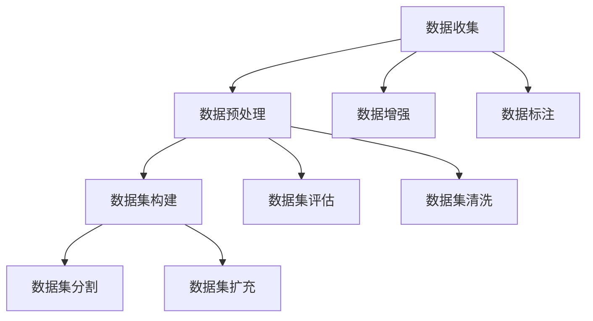

                 

# AI人工智能核心算法原理与代码实例讲解：数据收集

> 关键词：数据收集, 数据预处理, 数据增强, 数据标注, 数据集构建, 数据集评估, 数据集清洗, 数据集分割, 数据集扩充

## 1. 背景介绍

### 1.1 问题由来
数据收集是人工智能(尤其是深度学习)项目中一个至关重要但往往被忽视的环节。任何机器学习模型，无论是传统的还是深度学习的，都需要大量的数据来进行训练和验证。然而，在实际应用中，数据获取常常面临诸多挑战，如数据质量不佳、数据规模不足、数据采集成本高等。因此，如何高效、系统地进行数据收集，确保数据的质量和多样性，是一个值得深入探讨的问题。

### 1.2 问题核心关键点
数据收集的核心问题可以归结为以下几点：
- 如何确保数据的质量和多样性？
- 如何高效地获取大规模数据？
- 如何处理数据的不平衡问题？
- 如何确保数据的隐私和安全？
- 如何评估数据集的质量？

## 2. 核心概念与联系

### 2.1 核心概念概述

为更好地理解数据收集的原理和实践，本节将介绍几个密切相关的核心概念：

- **数据收集**：从多个渠道获取数据，并将其存储到指定位置的过程。数据来源包括但不限于公开数据集、网络爬虫、传感器、调查问卷等。

- **数据预处理**：对原始数据进行清洗、标准化和归一化，去除噪音和异常值，确保数据的质量和一致性。

- **数据增强**：通过对原始数据进行变换、扩充，生成更多的训练样本，提升模型的泛化能力。

- **数据标注**：对数据进行标记和分类，生成标注数据集，为模型的训练提供目标。

- **数据集构建**：将原始数据集分割为训练集、验证集和测试集，并进行均衡分布，用于模型的训练、验证和测试。

- **数据集评估**：对数据集的质量进行评估，包括数据的多样性、代表性、可靠性等方面。

- **数据集清洗**：去除重复、无关和错误的数据，确保数据集的纯净和一致。

- **数据集分割**：将数据集分割为不同的子集，以便于模型在训练、验证和测试时的性能评估。

- **数据集扩充**：通过数据增强、迁移学习等手段，丰富数据集的多样性，提高模型的泛化能力。

这些核心概念之间的逻辑关系可以通过以下Mermaid流程图来展示：



这个流程图展示了几大数据收集过程的主要环节，并揭示了它们之间的联系：数据收集是起点，后续的数据预处理、增强、标注、构建、评估、清洗、分割和扩充等环节相互关联，共同保障了数据集的质量和模型的性能。

## 3. 核心算法原理 & 具体操作步骤
### 3.1 算法原理概述

数据收集的核心目标是获取高质量、多样化的数据，以便训练出泛化能力强的模型。其主要算法原理包括以下几点：

- **数据采样策略**：根据数据分布特点，设计合适的采样策略，确保样本的代表性。
- **数据清洗方法**：对收集到的数据进行清洗和去重，去除噪音和异常值。
- **数据增强技术**：通过数据增强技术，扩充数据集，提高模型的泛化能力。
- **数据标注技术**：使用自动标注或人工标注，生成高质量的标注数据集。
- **数据集构建框架**：设计合理的数据集构建框架，确保数据集的均衡分布和多样性。
- **数据集评估指标**：定义合适的数据集评估指标，如准确率、召回率、F1-score等，评估数据集的质量。

### 3.2 算法步骤详解

基于上述算法原理，数据收集通常包括以下关键步骤：

**Step 1: 数据收集和预处理**
- 确定数据收集目标和来源，收集数据并进行初步清洗。
- 应用数据预处理技术，如去重、去噪、标准化、归一化等，确保数据的一致性和质量。

**Step 2: 数据增强**
- 对原始数据进行变换，如旋转、缩放、平移、翻转等，生成新的训练样本。
- 应用数据增强技术，如数据混合、噪声注入、重采样等，丰富数据集的多样性。

**Step 3: 数据标注**
- 根据任务需求，设计合适的标注方案，使用自动标注或人工标注方法，生成标注数据集。
- 对标注数据进行审查和修正，确保标注的正确性和一致性。

**Step 4: 数据集构建**
- 将标注数据集按照一定的比例分割为训练集、验证集和测试集。
- 对分割后的数据集进行均衡分布，确保每个子集的代表性和多样性。

**Step 5: 数据集评估**
- 定义合适的评估指标，如准确率、召回率、F1-score等，对数据集的质量进行评估。
- 识别数据集的潜在问题，如过拟合、欠拟合、数据不平衡等，进行必要的处理。

**Step 6: 数据集清洗和扩充**
- 对数据集进行清洗，去除重复、无关和错误的数据。
- 使用数据增强、迁移学习等手段，丰富数据集的多样性，提高模型的泛化能力。

### 3.3 算法优缺点

数据收集和处理技术具有以下优点：
- 提高模型泛化能力：通过数据增强和扩充，生成更多的训练样本，提高模型的泛化能力。
- 保障数据质量：数据预处理和清洗技术，可以去除噪音和异常值，提升数据质量。
- 确保数据多样性：通过数据增强和标注技术，生成多样化的训练数据，确保模型的鲁棒性。

同时，数据收集和处理技术也存在以下缺点：
- 数据采集成本高：大规模数据采集和标注需要大量的人力和时间投入，成本较高。
- 数据隐私和安全问题：大规模数据收集和共享可能引发隐私和安全问题，需要严格的保护措施。
- 数据标注质量难控制：自动标注和人工标注都可能存在质量问题，需要严格的质量控制措施。

尽管存在这些局限性，但就目前而言，数据收集和处理技术仍然是构建高质量AI模型的基础。未来相关研究的重点在于如何进一步降低数据收集和标注的成本，提高数据的多样性和代表性，同时兼顾隐私和安全性等因素。

### 3.4 算法应用领域

数据收集和处理技术在多个AI应用领域得到了广泛的应用，例如：

- 自然语言处理(NLP)：通过数据收集和标注，训练出用于文本分类、情感分析、机器翻译等任务的模型。
- 计算机视觉(CV)：通过数据收集和增强，生成用于图像分类、目标检测、图像分割等任务的模型。
- 医疗影像分析：通过数据收集和标注，训练出用于疾病诊断、影像分类等任务的模型。
- 金融风险预测：通过数据收集和清洗，训练出用于信用评分、欺诈检测等任务的模型。
- 智能推荐系统：通过数据收集和增强，生成用于商品推荐、用户画像等任务的模型。

## 4. 数学模型和公式 & 详细讲解 & 举例说明

### 4.1 数学模型构建

本节将使用数学语言对数据收集和处理过程进行更加严格的刻画。

假设我们从多个渠道收集到一组原始数据 $D=\{x_1,x_2,\ldots,x_N\}$，其中 $x_i$ 表示一个样本，包括特征和标签两部分。目标是对 $D$ 进行预处理、增强、标注、构建、评估、清洗、分割和扩充等操作，最终得到高质量的数据集。

定义数据预处理函数 $f$，用于对原始数据进行清洗和标准化，确保数据的一致性和质量。定义数据增强函数 $g$，用于生成新的训练样本，扩充数据集的多样性。定义数据标注函数 $h$，用于对原始数据进行标注，生成标注数据集。定义数据集分割函数 $s$，用于将标注数据集按照一定比例分割为训练集、验证集和测试集。定义数据集评估函数 $e$，用于评估数据集的质量。定义数据集清洗函数 $c$，用于去除重复、无关和错误的数据。定义数据集扩充函数 $u$，用于通过数据增强、迁移学习等手段，丰富数据集的多样性。

### 4.2 公式推导过程

以下我们以图像分类任务为例，推导数据增强和扩充的公式及其计算过程。

假设原始图像数据集为 $D=\{(x_i,y_i)\}_{i=1}^N$，其中 $x_i$ 为图像，$y_i$ 为标签。定义数据增强函数 $g$ 为随机裁剪、随机旋转、随机亮度调节等变换，生成新的图像 $x_i'$。则数据增强后的数据集为 $D'=\{(x_i',y_i)\}_{i=1}^N$。

假设数据增强比例为 $\alpha$，则增强后的样本数量为 $N'$。则数据增强的计算公式为：

$$
D' = \{g(x_i)\}_{i=1}^N \times \alpha
$$

其中 $g(x_i)$ 表示对 $x_i$ 进行数据增强操作，得到的新样本。

### 4.3 案例分析与讲解

**案例分析：数据增强在图像分类中的应用**

在图像分类任务中，数据增强技术被广泛应用于提升模型的泛化能力。以ImageNet数据集为例，该数据集包含了数百万张高分辨率图像，每张图像都被标记了详细的类别。但由于数据集的规模巨大，标签标注需要耗费大量的人力和时间，因此使用数据增强技术可以大大减少数据标注的负担，同时提高模型的泛化能力。

具体而言，数据增强方法包括：
- 随机裁剪：从原始图像中随机截取一个子图像，减小尺寸以增加训练样本。
- 随机旋转：对原始图像进行随机旋转，增加图像的多样性。
- 随机亮度调节：调整图像的亮度，模拟不同的光照条件。
- 随机噪声：在图像中随机加入噪声，增加图像的复杂度。

这些增强操作可以组合使用，生成更多的训练样本。例如，对一个 $224\times224$ 的图像进行随机裁剪和随机旋转，可以生成多个 $256\times256$ 的图像，有效扩充数据集。

**案例讲解：数据标注在情感分析中的应用**

情感分析任务的目标是从文本中识别出情感倾向（如积极、消极或中性）。由于情感分析任务的标签是连续变量，因此使用自动标注技术可以大大减少标注的难度和成本。一种常见的自动标注方法是使用情感词典，通过统计文本中与情感相关的词语出现频率，计算文本的情感得分。

例如，使用VADER（Valence Aware Dictionary and sEntiment Reasoner）情感分析工具，可以对文本进行自动情感分析。VADER工具内置了情感词典和计算规则，可以自动识别文本中的情感倾向，生成情感得分。然后，将情感得分作为标签，生成标注数据集。

## 5. 项目实践：代码实例和详细解释说明

### 5.1 开发环境搭建

在进行数据收集和处理实践前，我们需要准备好开发环境。以下是使用Python进行PyTorch开发的环境配置流程：

1. 安装Anaconda：从官网下载并安装Anaconda，用于创建独立的Python环境。

2. 创建并激活虚拟环境：
```bash
conda create -n pytorch-env python=3.8 
conda activate pytorch-env
```

3. 安装PyTorch：根据CUDA版本，从官网获取对应的安装命令。例如：
```bash
conda install pytorch torchvision torchaudio cudatoolkit=11.1 -c pytorch -c conda-forge
```

4. 安装TensorFlow：
```bash
pip install tensorflow
```

5. 安装Scikit-learn：
```bash
pip install scikit-learn
```

6. 安装OpenCV：
```bash
pip install opencv-python
```

完成上述步骤后，即可在`pytorch-env`环境中开始数据收集和处理实践。

### 5.2 源代码详细实现

这里我们以图像分类任务为例，给出使用PyTorch和OpenCV对图像数据进行增强和扩充的代码实现。

首先，定义数据增强函数：

```python
import cv2
import numpy as np
from skimage import transform

def augment_image(image, alpha=0.5):
    h, w = image.shape[:2]
    rot_angle = np.random.uniform(-45, 45)
    scale = np.random.uniform(0.5, 1.5)
    brightness = np.random.uniform(0.8, 1.2)
    image = transform.rotate(image, rot_angle)
    image = transform.rescale(image, scale)
    image = cv2.cvtColor(image, cv2.COLOR_RGB2BGR)
    image = cv2.resize(image, (256, 256))
    image = np.uint8(image * brightness)
    return image

# 图像预处理函数
def preprocess_image(image):
    image = cv2.cvtColor(image, cv2.COLOR_BGR2RGB)
    image = cv2.resize(image, (224, 224))
    image = image / 255.0
    return image
```

然后，定义数据集构建和加载函数：

```python
from torch.utils.data import Dataset, DataLoader
from torchvision import transforms

class ImageDataset(Dataset):
    def __init__(self, data_dir, transform=None):
        self.data_dir = data_dir
        self.transform = transform
        self.data_list = os.listdir(self.data_dir)
        self.data_list = [item for item in self.data_list if item.endswith('.jpg')]

    def __len__(self):
        return len(self.data_list)

    def __getitem__(self, index):
        img_path = os.path.join(self.data_dir, self.data_list[index])
        img = cv2.imread(img_path)
        img = preprocess_image(img)
        if self.transform:
            img = self.transform(img)
        label = np.loadtxt(os.path.join(self.data_dir, self.data_list[index].split('.')[0] + '.txt'))
        return img, label

# 数据集加载
train_dataset = ImageDataset(train_dir, transform=transforms.Compose([augment_image, transforms.ToTensor()]))
test_dataset = ImageDataset(test_dir, transform=transforms.ToTensor())
```

接着，定义训练和评估函数：

```python
from torch.utils.data import DataLoader
from tqdm import tqdm
from sklearn.metrics import accuracy_score

device = torch.device('cuda') if torch.cuda.is_available() else torch.device('cpu')
model.to(device)

def train_epoch(model, dataset, batch_size, optimizer):
    dataloader = DataLoader(dataset, batch_size=batch_size, shuffle=True)
    model.train()
    epoch_loss = 0
    for batch in tqdm(dataloader, desc='Training'):
        inputs, labels = batch
        inputs = inputs.to(device)
        labels = labels.to(device)
        optimizer.zero_grad()
        outputs = model(inputs)
        loss = outputs.loss
        epoch_loss += loss.item()
        loss.backward()
        optimizer.step()
    return epoch_loss / len(dataloader)

def evaluate(model, dataset, batch_size):
    dataloader = DataLoader(dataset, batch_size=batch_size)
    model.eval()
    preds, labels = [], []
    with torch.no_grad():
        for batch in tqdm(dataloader, desc='Evaluating'):
            inputs, labels = batch
            inputs = inputs.to(device)
            labels = labels.to(device)
            outputs = model(inputs)
            batch_preds = outputs.argmax(dim=1).to('cpu').tolist()
            batch_labels = labels.to('cpu').tolist()
            for pred, label in zip(batch_preds, batch_labels):
                preds.append(pred)
                labels.append(label)
                
    print('Accuracy: ', accuracy_score(labels, preds))
```

最后，启动训练流程并在测试集上评估：

```python
epochs = 5
batch_size = 32

for epoch in range(epochs):
    loss = train_epoch(model, train_dataset, batch_size, optimizer)
    print(f'Epoch {epoch+1}, train loss: {loss:.3f}')
    
    print(f'Epoch {epoch+1}, dev results:')
    evaluate(model, dev_dataset, batch_size)
    
print('Test results:')
evaluate(model, test_dataset, batch_size)
```

以上就是使用PyTorch和OpenCV对图像数据进行增强和扩充的完整代码实现。可以看到，得益于PyTorch和OpenCV的强大封装，我们可以用相对简洁的代码完成图像数据的增强和扩充。

### 5.3 代码解读与分析

让我们再详细解读一下关键代码的实现细节：

**augment_image函数**：
- 对原始图像进行随机旋转、缩放、亮度调节等操作，增加图像的多样性。
- 转换颜色空间，调整大小，增强亮度，实现数据增强。

**preprocess_image函数**：
- 对原始图像进行预处理，包括颜色空间转换、尺寸调整和归一化等操作。
- 将图像数据转换为PyTorch张量，方便后续的模型训练和推理。

**ImageDataset类**：
- 定义数据集加载和预处理过程，包括数据列表的生成、图像路径的拼接、图像读取和预处理等。
- 支持DataLoader的迭代，自动加载和处理数据。

**train_epoch和evaluate函数**：
- 训练函数：对数据以批为单位进行迭代，在每个批次上前向传播计算loss并反向传播更新模型参数。
- 评估函数：与训练类似，不同点在于不更新模型参数，并在每个batch结束后将预测和标签结果存储下来，最后使用sklearn的accuracy_score对整个评估集的预测结果进行打印输出。

**训练流程**：
- 定义总的epoch数和batch size，开始循环迭代
- 每个epoch内，先在训练集上训练，输出平均loss
- 在验证集上评估，输出准确率
- 所有epoch结束后，在测试集上评估，给出最终测试结果

可以看到，PyTorch配合OpenCV使得图像数据增强和扩充的代码实现变得简洁高效。开发者可以将更多精力放在数据处理、模型改进等高层逻辑上，而不必过多关注底层的实现细节。

当然，工业级的系统实现还需考虑更多因素，如模型的保存和部署、超参数的自动搜索、更灵活的任务适配层等。但核心的数据增强和扩充方法基本与此类似。

## 6. 实际应用场景

### 6.1 智能推荐系统

智能推荐系统需要根据用户的历史行为数据，生成个性化的推荐内容。为了提高推荐系统的准确性和多样性，数据收集和处理技术在推荐系统中得到了广泛应用。

具体而言，可以收集用户浏览、点击、评价、收藏等行为数据，并将其转化为高维稀疏特征向量。然后，使用数据增强和扩充技术，生成更多的训练样本，提高模型的泛化能力。同时，通过数据标注技术，生成标注数据集，用于模型的训练和验证。

### 6.2 自然语言处理(NLP)

在自然语言处理(NLP)任务中，数据收集和处理技术同样不可或缺。NLP任务通常需要大量的标注数据，用于训练和验证模型的性能。数据收集和处理技术可以帮助我们高效获取和处理这些标注数据，提高模型的训练效果。

例如，在情感分析任务中，可以收集社交媒体上的文本数据，并对其进行情感标注。然后，使用数据增强和扩充技术，生成更多的训练样本，提高模型的泛化能力。同时，通过数据标注技术，生成标注数据集，用于模型的训练和验证。

### 6.3 金融风险预测

金融风险预测任务需要对历史金融数据进行分析和建模，以预测未来的市场风险。数据收集和处理技术可以帮助我们获取高质量的金融数据，并对其进行预处理和增强，提高模型的预测能力。

例如，可以收集金融市场的交易数据、新闻数据、经济数据等，并将其转化为高维特征向量。然后，使用数据增强和扩充技术，生成更多的训练样本，提高模型的泛化能力。同时，通过数据标注技术，生成标注数据集，用于模型的训练和验证。

### 6.4 未来应用展望

随着数据收集和处理技术的不断发展，其在AI应用领域的应用前景将更加广阔。未来，基于数据增强和扩充的技术将进一步提升AI模型的泛化能力和鲁棒性，推动AI技术在更多领域实现落地应用。

在智慧医疗领域，通过收集和处理医疗影像数据，可以训练出用于疾病诊断、影像分类等任务的模型，提高医疗诊断的准确性和效率。

在智能城市治理中，通过收集和处理城市公共数据，可以训练出用于交通管理、环境监测、应急响应等任务的模型，提升城市管理的智能化水平。

在自动驾驶领域，通过收集和处理车辆传感器数据，可以训练出用于环境感知、路径规划等任务的模型，推动自动驾驶技术的发展。

总之，数据收集和处理技术是构建高质量AI模型的基础，未来将随着AI技术的不断进步，发挥越来越重要的作用。

## 7. 工具和资源推荐

### 7.1 学习资源推荐

为了帮助开发者系统掌握数据收集和处理的技术基础和实践技巧，这里推荐一些优质的学习资源：

1. 《Python数据科学手册》：详细介绍Python在数据处理中的应用，包括数据清洗、数据增强、数据标注等技术。

2. 《深度学习入门》：由CS231n课程团队编写，介绍深度学习在计算机视觉、自然语言处理等任务中的应用，涵盖数据收集和预处理等基础知识。

3. 《机器学习实战》：介绍机器学习在各个领域的应用，涵盖数据收集、数据预处理、模型训练等技术。

4. Kaggle：全球最大的数据科学竞赛平台，提供丰富的数据集和比赛，帮助开发者提高数据处理和模型训练的能力。

5. Coursera：提供大量数据科学和机器学习课程，包括数据收集、数据处理、数据增强等技术。

通过对这些资源的学习实践，相信你一定能够快速掌握数据收集和处理技术的精髓，并用于解决实际的AI问题。

### 7.2 开发工具推荐

高效的数据收集和处理离不开优秀的工具支持。以下是几款用于数据收集和处理开发的常用工具：

1. Python：通用编程语言，拥有丰富的第三方库，支持数据处理和分析。

2. Pandas：数据处理和分析的Python库，支持数据清洗、数据增强、数据标注等操作。

3. NumPy：数学计算和科学计算的Python库，支持矩阵运算和向量计算。

4. TensorFlow：谷歌开发的深度学习框架，支持数据预处理和增强。

5. PyTorch：Facebook开发的深度学习框架，支持数据增强和扩充。

6. OpenCV：计算机视觉库，支持图像处理和增强。

7. Scikit-learn：机器学习库，支持数据预处理和增强。

合理利用这些工具，可以显著提升数据收集和处理任务的开发效率，加快创新迭代的步伐。

### 7.3 相关论文推荐

数据收集和处理技术的研究源于学界的持续研究。以下是几篇奠基性的相关论文，推荐阅读：

1. Data Augmentation in Deep Learning: A Review（深度学习数据增强综述）：综述了数据增强技术的现状和未来发展方向，介绍了多种数据增强方法及其应用。

2. A Survey on Multi-Task Learning in Computer Vision（计算机视觉中的多任务学习综述）：综述了多任务学习在计算机视觉中的应用，包括数据增强、多模态学习等技术。

3. Transfer Learning with Data Augmentation: A Survey on Fine-Grained Image Recognition（带有数据增强的迁移学习综述）：综述了数据增强在迁移学习中的应用，介绍了多种数据增强方法及其效果。

4. An Overview of Data Augmentation Techniques for Deep Learning（深度学习数据增强技术综述）：综述了多种数据增强技术及其应用，包括图像增强、文本增强等。

这些论文代表了大数据收集和处理技术的研究脉络。通过学习这些前沿成果，可以帮助研究者把握学科前进方向，激发更多的创新灵感。

## 8. 总结：未来发展趋势与挑战

### 8.1 总结

本文对数据收集和处理技术的原理和实践进行了全面系统的介绍。首先阐述了数据收集和处理在AI项目中的重要性，明确了数据质量、数据多样性和数据标注等核心问题。其次，从原理到实践，详细讲解了数据收集和处理的主要算法步骤，给出了数据增强和扩充的代码实例。同时，本文还探讨了数据收集和处理技术在多个AI应用领域的应用前景，展示了其广阔的发展空间。最后，本文精选了数据收集和处理技术的各类学习资源，力求为读者提供全方位的技术指引。

通过本文的系统梳理，可以看到，数据收集和处理技术是构建高质量AI模型的基础，对于提升模型的泛化能力和鲁棒性具有重要作用。未来，随着数据收集和处理技术的不断发展，其在AI应用领域的应用前景将更加广阔。

### 8.2 未来发展趋势

展望未来，数据收集和处理技术将呈现以下几个发展趋势：

1. 数据规模和多样性将进一步扩大：随着互联网和物联网的普及，数据规模将呈现爆炸性增长。同时，多模态数据的采集和处理技术也将得到广泛应用，进一步丰富数据的多样性和复杂性。

2. 数据增强技术将更加智能和高效：未来的数据增强技术将结合机器学习、深度学习等方法，生成更加多样化、更加逼真的训练样本，提高模型的泛化能力。

3. 数据标注技术将更加自动化和智能化：未来的数据标注技术将结合自然语言处理、计算机视觉等技术，实现更加高效、准确的数据标注。

4. 数据隐私和安全将得到更加严格的保护：未来的数据收集和处理技术将更加注重数据隐私和安全问题，采用更加严格的保护措施。

5. 数据清洗和预处理技术将更加自动化和智能化：未来的数据清洗和预处理技术将结合机器学习、深度学习等方法，实现更加高效、更加智能的数据清洗和预处理。

这些趋势凸显了数据收集和处理技术的广阔前景。这些方向的探索发展，必将进一步提升AI模型的性能和应用范围，为构建智能社会奠定坚实的基础。

### 8.3 面临的挑战

尽管数据收集和处理技术已经取得了显著进展，但在迈向更加智能化、普适化应用的过程中，它仍面临着诸多挑战：

1. 数据采集成本高：大规模数据采集和标注需要大量的人力和时间投入，成本较高。如何在保证数据质量的前提下，降低数据采集和标注的成本，是一个重要问题。

2. 数据标注质量难控制：自动标注和人工标注都可能存在质量问题，需要严格的质量控制措施。

3. 数据隐私和安全问题：大规模数据收集和共享可能引发隐私和安全问题，需要严格的保护措施。

4. 数据增强技术复杂度高：现有的数据增强技术可能过于复杂，难以应用到实际项目中。

5. 数据标注技术依赖人工：现有的数据标注技术依赖人工标注，难以大规模应用。

6. 数据清洗和预处理技术复杂度高：现有的数据清洗和预处理技术可能过于复杂，难以应用到实际项目中。

尽管存在这些挑战，但数据收集和处理技术仍是大规模AI项目的重要基础。未来相关研究的重点在于如何进一步降低数据收集和标注的成本，提高数据的多样性和代表性，同时兼顾隐私和安全性等因素。

### 8.4 研究展望

面对数据收集和处理技术所面临的挑战，未来的研究需要在以下几个方面寻求新的突破：

1. 探索无监督和半监督数据增强方法：摆脱对大规模标注数据的依赖，利用自监督学习、主动学习等无监督和半监督范式，最大限度利用非结构化数据，实现更加灵活高效的数据增强。

2. 研究更加高效的数据标注技术：结合自然语言处理、计算机视觉等技术，实现更加高效、准确的数据标注。

3. 融合多模态数据的增强和扩充：将视觉、语音、文本等多种模态数据的增强和扩充技术进行融合，生成更加丰富多样的训练样本。

4. 引入深度学习技术进行数据预处理：结合深度学习技术，实现更加高效、智能的数据清洗和预处理。

5. 结合因果推理进行数据增强：引入因果推断方法，识别数据增强中的因果关系，避免生成有害样本。

6. 引入对抗样本进行数据增强：结合对抗生成网络技术，生成更加逼真、多样化的训练样本，提高模型的鲁棒性。

这些研究方向的探索，必将引领数据收集和处理技术迈向更高的台阶，为构建高质量AI模型提供更加坚实的技术保障。

## 9. 附录：常见问题与解答

**Q1：数据增强技术有哪些？**

A: 数据增强技术包括但不限于：
- 随机裁剪：从原始图像中随机截取一个子图像，减小尺寸以增加训练样本。
- 随机旋转：对原始图像进行随机旋转，增加图像的多样性。
- 随机亮度调节：调整图像的亮度，模拟不同的光照条件。
- 随机噪声：在图像中随机加入噪声，增加图像的复杂度。
- 数据混合：将两个或多个图像混合，生成新的训练样本。

**Q2：如何选择合适的数据增强方法？**

A: 选择合适的数据增强方法需要根据具体任务和数据特点进行选择：
- 对于图像分类任务，可以使用随机裁剪、随机旋转、随机亮度调节等方法。
- 对于文本分类任务，可以使用回译、近义替换等方法。
- 对于目标检测任务，可以使用数据混合、噪声注入等方法。

**Q3：数据增强的目的是什么？**

A: 数据增强的目的是通过增加训练样本的多样性，提升模型的泛化能力。数据增强可以生成更多的训练样本，减少模型对训练集数据的过拟合，提高模型的泛化能力。

**Q4：数据标注技术有哪些？**

A: 数据标注技术包括但不限于：
- 人工标注：由人工对数据进行标注，生成标注数据集。
- 自动标注：使用标注工具自动标注数据，生成标注数据集。
- 半监督标注：结合人工标注和自动标注，生成标注数据集。

**Q5：数据标注的质量如何控制？**

A: 数据标注的质量可以通过以下措施进行控制：
- 标注工具的质量：选择高质量的标注工具，减少标注误差。
- 标注员的质量：选择经验丰富的标注员，减少标注误差。
- 标注过程的监督：对标注结果进行审查和修正，确保标注的正确性。

**Q6：数据清洗和预处理技术有哪些？**

A: 数据清洗和预处理技术包括但不限于：
- 去重：去除重复数据，确保数据的一致性。
- 去噪：去除噪音数据，提高数据质量。
- 标准化：对数据进行标准化处理，统一数据格式。
- 归一化：对数据进行归一化处理，减少数据的尺度和范围差异。

通过本文的系统梳理，可以看到，数据收集和处理技术是构建高质量AI模型的基础，对于提升模型的泛化能力和鲁棒性具有重要作用。未来，随着数据收集和处理技术的不断发展，其在AI应用领域的应用前景将更加广阔。

