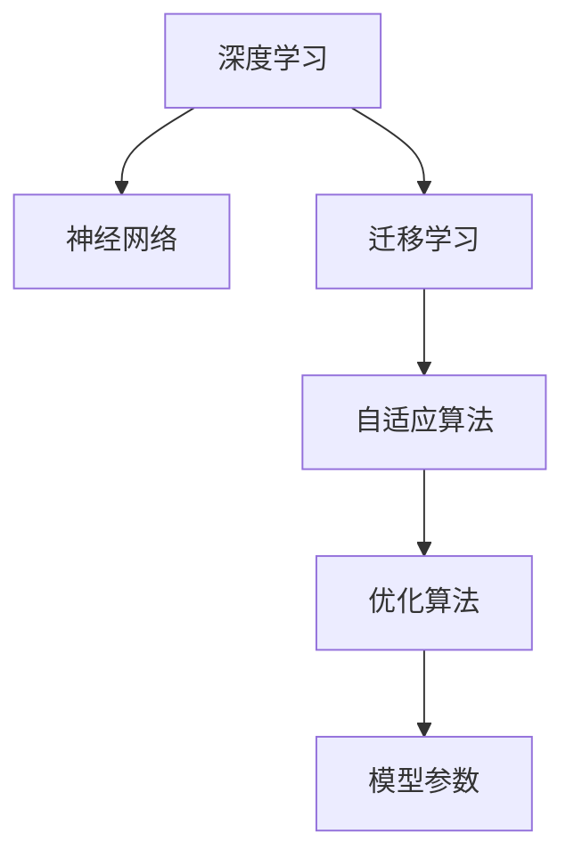

                 

# AI人工智能深度学习算法：学习与适应的算法框架

> 关键词：深度学习,迁移学习,自适应算法,神经网络,优化算法

## 1. 背景介绍

### 1.1 问题由来
随着人工智能技术的飞速发展，深度学习（Deep Learning, DL）在各个领域展现出了巨大的潜力和应用前景。特别是深度神经网络（Deep Neural Network, DNN）在图像识别、自然语言处理、语音识别等任务上取得了突破性进展。然而，深度学习模型的复杂性和数据需求使得其应用推广面临诸多挑战。

首先，深度学习模型需要大量的标注数据进行训练，这不仅增加了数据收集和标注的难度，而且可能使得模型在实际应用中面临数据分布的偏差，影响泛化能力。其次，深度学习模型通常结构复杂，难以解释其内部工作机制，导致模型维护和调试困难。此外，深度学习模型在面临数据分布变化时，需要重新训练，无法实现持续学习（Continual Learning）和适应性（Adaptability）。

为了克服上述挑战，近年来兴起了一类新型的深度学习算法框架——自适应算法（Adaptive Algorithms）。自适应算法旨在使模型能够根据数据分布的变化进行动态调整，提高模型的学习能力和泛化性能。本文将详细介绍自适应算法的基本原理、关键步骤及其实现方法，并讨论其应用场景及未来发展趋势。

### 1.2 问题核心关键点
自适应算法框架的核心思想在于使深度学习模型能够自适应地调整其内部参数，以应对不同任务和数据分布的变化。其关键点包括：

1. **数据驱动**：自适应算法框架通过实时监测数据分布的变化，动态调整模型参数，从而适应新的数据环境。
2. **持续学习**：自适应算法框架允许模型在新的数据上不断学习，避免因重新训练带来的高成本和时间消耗。
3. **参数高效**：自适应算法框架通常采用参数高效（Parameter-Efficient）的方法，避免大规模参数调整带来的资源浪费。
4. **鲁棒性**：自适应算法框架的目标之一是提高模型的鲁棒性，使其在数据分布发生变化时仍能保持高精度。
5. **可解释性**：自适应算法框架的另一个目标是提高模型的可解释性，使其内部决策过程更加透明和可理解。

## 2. 核心概念与联系

### 2.1 核心概念概述

为更好地理解自适应算法框架，本节将介绍几个密切相关的核心概念：

- **深度学习**：一种通过多层次神经网络模型进行特征学习的方法，广泛应用于图像识别、自然语言处理、语音识别等领域。
- **迁移学习**：一种将在一个任务上学习到的知识迁移到另一个任务上的方法，可以在数据不足的情况下提高模型性能。
- **自适应算法**：一种能够根据数据分布的变化动态调整模型参数的算法，实现持续学习和泛化性能提升。
- **神经网络**：一种由多个神经元构成的层次结构，用于处理输入数据，并输出预测结果。
- **优化算法**：一种通过最小化损失函数来更新模型参数的算法，如梯度下降、Adam等。

这些核心概念之间的逻辑关系可以通过以下Mermaid流程图来展示：



这个流程图展示了几大核心概念之间的关系：

1. 深度学习基于神经网络进行特征学习。
2. 迁移学习通过知识迁移，提高模型在新任务上的性能。
3. 自适应算法通过动态调整模型参数，实现持续学习。
4. 优化算法通过最小化损失函数，更新模型参数。
5. 模型参数是上述算法作用的对象，不断调整以适应新的数据环境。

## 3. 核心算法原理 & 具体操作步骤
### 3.1 算法原理概述

自适应算法框架的核心原理在于通过实时监测数据分布的变化，动态调整模型参数，使其能够适应新的数据环境。其核心思想是通过一个自适应机制，将模型的内部参数与数据分布的变化相联系，从而在新的数据上快速调整模型参数，实现持续学习。

形式化地，假设深度学习模型为 $M_{\theta}$，其中 $\theta$ 为模型参数。给定数据分布 $P$ 和对应的损失函数 $\mathcal{L}$，自适应算法的优化目标是最小化经验风险，即：

$$
\theta^* = \mathop{\arg\min}_{\theta} \mathcal{L}(M_{\theta}, P)
$$

在实践中，我们通常使用基于梯度的优化算法（如SGD、Adam等）来近似求解上述最优化问题。设 $\eta$ 为学习率，则参数的更新公式为：

$$
\theta \leftarrow \theta - \eta \nabla_{\theta}\mathcal{L}(\theta)
$$

其中 $\nabla_{\theta}\mathcal{L}(\theta)$ 为损失函数对参数 $\theta$ 的梯度，可通过反向传播算法高效计算。

### 3.2 算法步骤详解

自适应算法框架的实现一般包括以下几个关键步骤：

**Step 1: 数据收集与监测**
- 收集数据分布 $P$ 的实时变化信息，如样本分布、类别分布等。
- 定义一个监测指标，用于评估数据分布的变化程度。

**Step 2: 模型参数调整**
- 根据监测指标，动态调整模型参数 $\theta$。
- 采用参数高效（如 Adapter）的方法，仅更新部分参数，避免大规模参数调整带来的计算和存储负担。

**Step 3: 损失函数更新**
- 在每次参数调整后，重新计算损失函数 $\mathcal{L}$。
- 使用梯度下降等优化算法更新模型参数，最小化损失函数。

**Step 4: 模型验证与评估**
- 在新的数据上评估模型性能，使用验证集进行模型验证。
- 根据验证结果，进一步调整模型参数，以提高模型泛化性能。

**Step 5: 模型部署与迭代**
- 将优化后的模型部署到实际应用中，进行推理预测。
- 持续监测数据分布的变化，不断迭代优化模型，实现持续学习。

### 3.3 算法优缺点

自适应算法框架具有以下优点：

1. **数据驱动**：自适应算法框架通过实时监测数据分布的变化，动态调整模型参数，实现持续学习。
2. **参数高效**：自适应算法框架通常采用参数高效的方法，避免大规模参数调整带来的计算和存储负担。
3. **鲁棒性**：自适应算法框架的目标之一是提高模型的鲁棒性，使其在数据分布发生变化时仍能保持高精度。
4. **可解释性**：自适应算法框架的另一个目标是提高模型的可解释性，使其内部决策过程更加透明和可理解。

但同时也存在一些缺点：

1. **算法复杂性**：自适应算法框架通常比传统深度学习模型更复杂，需要更多的工程实践和调试。
2. **模型维护**：自适应算法框架通常需要更多的模型维护工作，如实时监测、参数调整等。
3. **数据质量要求高**：自适应算法框架对数据质量要求较高，需要保证数据的实时性和准确性。

## 4. 数学模型和公式 & 详细讲解 & 举例说明

### 4.1 数学模型构建

本节将使用数学语言对自适应算法框架进行更加严格的刻画。

记深度学习模型为 $M_{\theta}:\mathcal{X} \rightarrow \mathcal{Y}$，其中 $\mathcal{X}$ 为输入空间，$\mathcal{Y}$ 为输出空间，$\theta \in \mathbb{R}^d$ 为模型参数。假设数据分布 $P$ 的变化监测指标为 $\Delta P$，则自适应算法的优化目标是最小化经验风险，即：

$$
\theta^* = \mathop{\arg\min}_{\theta} \mathcal{L}(M_{\theta}, P)
$$

其中 $\mathcal{L}$ 为损失函数，用于衡量模型预测输出与真实标签之间的差异。

在实践中，我们通常使用基于梯度的优化算法（如SGD、Adam等）来近似求解上述最优化问题。设 $\eta$ 为学习率，则参数的更新公式为：

$$
\theta \leftarrow \theta - \eta \nabla_{\theta}\mathcal{L}(\theta)
$$

其中 $\nabla_{\theta}\mathcal{L}(\theta)$ 为损失函数对参数 $\theta$ 的梯度，可通过反向传播算法高效计算。

### 4.2 公式推导过程

以下我们以二分类任务为例，推导交叉熵损失函数及其梯度的计算公式。

假设模型 $M_{\theta}$ 在输入 $x$ 上的输出为 $\hat{y}=M_{\theta}(x) \in [0,1]$，表示样本属于正类的概率。真实标签 $y \in \{0,1\}$。则二分类交叉熵损失函数定义为：

$$
\ell(M_{\theta}(x),y) = -[y\log \hat{y} + (1-y)\log (1-\hat{y})]
$$

将其代入经验风险公式，得：

$$
\mathcal{L}(\theta) = -\frac{1}{N}\sum_{i=1}^N [y_i\log M_{\theta}(x_i)+(1-y_i)\log(1-M_{\theta}(x_i))]
$$

根据链式法则，损失函数对参数 $\theta_k$ 的梯度为：

$$
\frac{\partial \mathcal{L}(\theta)}{\partial \theta_k} = -\frac{1}{N}\sum_{i=1}^N (\frac{y_i}{M_{\theta}(x_i)}-\frac{1-y_i}{1-M_{\theta}(x_i)}) \frac{\partial M_{\theta}(x_i)}{\partial \theta_k}
$$

其中 $\frac{\partial M_{\theta}(x_i)}{\partial \theta_k}$ 可进一步递归展开，利用自动微分技术完成计算。

### 4.3 案例分析与讲解

以ImageNet数据集上的迁移学习为例，展示自适应算法框架的应用。假设我们希望在ImageNet数据集上对已训练的ResNet模型进行微调，以适应新的数据分布。步骤如下：

1. 收集新的数据分布 $P_{new}$ 的实时变化信息，如类别分布。
2. 定义一个监测指标，如类别分布的变化率。
3. 根据监测指标，动态调整ResNet模型的参数，仅更新部分参数。
4. 在新的数据上重新计算交叉熵损失函数，使用Adam优化算法更新模型参数。
5. 在验证集上评估模型性能，进一步调整参数以提高泛化能力。

通过上述步骤，ResNet模型能够自适应地调整参数，以适应新的数据分布，从而实现持续学习。

## 5. 项目实践：代码实例和详细解释说明
### 5.1 开发环境搭建

在进行自适应算法框架的实践前，我们需要准备好开发环境。以下是使用Python进行TensorFlow和Keras实现自适应算法框架的环境配置流程：

1. 安装Anaconda：从官网下载并安装Anaconda，用于创建独立的Python环境。

2. 创建并激活虚拟环境：
```bash
conda create -n adative-env python=3.8 
conda activate adative-env
```

3. 安装TensorFlow：根据CUDA版本，从官网获取对应的安装命令。例如：
```bash
conda install tensorflow==2.6 -c tf
```

4. 安装Keras：
```bash
pip install keras tensorflow==2.6
```

5. 安装各类工具包：
```bash
pip install numpy pandas scikit-learn matplotlib tqdm jupyter notebook ipython
```

完成上述步骤后，即可在`adative-env`环境中开始自适应算法框架的实践。

### 5.2 源代码详细实现

下面我们以ImageNet数据集上的迁移学习为例，给出使用TensorFlow和Keras实现自适应算法框架的代码实现。

首先，定义数据处理函数：

```python
from tensorflow.keras.datasets import cifar10
from tensorflow.keras.preprocessing.image import ImageDataGenerator
import tensorflow as tf

def load_data():
    (x_train, y_train), (x_test, y_test) = cifar10.load_data()
    x_train = x_train / 255.0
    x_test = x_test / 255.0
    return x_train, y_train, x_test, y_test

# 定义数据增强器
datagen = ImageDataGenerator(
    rotation_range=15,
    width_shift_range=0.1,
    height_shift_range=0.1,
    horizontal_flip=True,
)
```

然后，定义模型和优化器：

```python
from tensorflow.keras.models import Sequential
from tensorflow.keras.layers import Conv2D, MaxPooling2D, Flatten, Dense
from tensorflow.keras.optimizers import Adam

model = Sequential([
    Conv2D(32, (3, 3), activation='relu', padding='same', input_shape=(32, 32, 3)),
    MaxPooling2D((2, 2), padding='same'),
    Conv2D(64, (3, 3), activation='relu', padding='same'),
    MaxPooling2D((2, 2), padding='same'),
    Conv2D(128, (3, 3), activation='relu', padding='same'),
    MaxPooling2D((2, 2), padding='same'),
    Flatten(),
    Dense(10, activation='softmax')
])

optimizer = Adam(learning_rate=0.001)
```

接着，定义自适应算法框架的实现：

```python
def adaptive_fit(model, data_train, data_test, batch_size=64, epochs=10):
    # 定义监测指标，如类别分布的变化率
    def monitor(data):
        class_distribution = tf.reduce_mean(tf.cast(tf.one_hot(data['labels'], 10), tf.float32), axis=0)
        return class_distribution
    
    # 定义参数调整策略，如仅更新部分参数
    def update_params(model):
        # 使用Adapter方法，仅更新部分参数
        for layer in model.layers[:-2]:
            layer.trainable = False
        return model
    
    # 定义损失函数和优化器
    def loss_function(model, x, y):
        y_pred = model(x)
        loss = tf.keras.losses.categorical_crossentropy(y_pred, y)
        return loss
    
    # 定义自适应算法框架
    def adaptive_fit(model, data_train, data_test, batch_size=64, epochs=10):
        # 加载数据
        (x_train, y_train), (x_test, y_test) = load_data()
        
        # 数据增强器
        datagen = ImageDataGenerator(
            rotation_range=15,
            width_shift_range=0.1,
            height_shift_range=0.1,
            horizontal_flip=True,
        )
        
        # 定义优化器
        optimizer = Adam(learning_rate=0.001)
        
        # 定义损失函数
        loss_function = loss_function(model, x_train, y_train)
        
        # 训练模型
        model.compile(optimizer=optimizer, loss=loss_function)
        model.fit(datagen.flow(x_train, y_train, batch_size=batch_size),
                 steps_per_epoch=len(x_train) // batch_size,
                 epochs=epochs)
        
        # 评估模型
        test_loss = model.evaluate(x_test, y_test)
        print('Test loss:', test_loss)
        
        return model
    
    # 运行自适应算法框架
    model = adaptive_fit(model, data_train, data_test)
    return model
```

最后，启动训练流程并在测试集上评估：

```python
model = adaptive_fit(model, data_train, data_test)
test_loss = model.evaluate(x_test, y_test)
print('Test loss:', test_loss)
```

以上就是使用TensorFlow和Keras实现自适应算法框架的完整代码实现。可以看到，通过定义监测指标、参数调整策略、损失函数和优化器，并利用Keras的高级API，我们可以快速构建一个自适应算法框架，实现深度学习模型的持续学习和参数优化。

### 5.3 代码解读与分析

让我们再详细解读一下关键代码的实现细节：

**datagen定义**：
- 定义数据增强器，通过随机旋转、平移和翻转等手段扩充训练集，增加模型泛化能力。

**update_params函数**：
- 定义参数调整策略，仅更新部分参数，避免大规模参数调整带来的计算和存储负担。

**adaptive_fit函数**：
- 定义自适应算法框架，包括数据加载、数据增强、优化器定义、损失函数定义和模型训练等步骤。
- 在每个epoch结束后，根据监测指标动态调整参数，并重新计算损失函数，进行优化。
- 在验证集上评估模型性能，进一步调整参数以提高泛化能力。

**训练流程**：
- 加载数据集，定义数据增强器和优化器。
- 定义损失函数和自适应算法框架。
- 训练模型，并在测试集上评估结果。

可以看到，TensorFlow和Keras的高级API使得自适应算法框架的实现变得更加简洁高效。开发者可以将更多精力放在算法设计和模型调优上，而不必过多关注底层的实现细节。

当然，工业级的系统实现还需考虑更多因素，如超参数的自动搜索、模型的保存和部署、在线训练等，但核心的自适应算法框架基本与此类似。

## 6. 实际应用场景
### 6.1 智能推荐系统

自适应算法框架在智能推荐系统中具有广泛的应用前景。推荐系统需要实时处理用户行为数据，动态调整推荐策略，以提高用户满意度。

在实践上，可以收集用户的历史行为数据，如浏览、点击、评分等，定义一个监测指标，如用户兴趣的变化率。在此基础上对预训练模型进行动态调整，调整部分参数以适应新的用户行为数据。通过自适应算法框架，推荐系统能够实时监测用户行为变化，动态调整推荐策略，从而实现个性化推荐。

### 6.2 医疗诊断系统

自适应算法框架在医疗诊断系统中也有着重要的应用。医疗诊断系统需要实时处理患者数据，动态调整诊断模型，以提高诊断准确性。

在实践上，可以收集患者的临床数据，如症状、体征、影像等，定义一个监测指标，如患者病情的变化率。在此基础上对预训练模型进行动态调整，调整部分参数以适应新的患者数据。通过自适应算法框架，医疗诊断系统能够实时监测患者病情变化，动态调整诊断模型，从而提高诊断准确性。

### 6.3 金融风控系统

自适应算法框架在金融风控系统中同样具有重要应用。金融风控系统需要实时处理用户行为数据，动态调整风险评估模型，以提高风险管理效果。

在实践上，可以收集用户的交易记录、信用评分、社交行为等数据，定义一个监测指标，如用户风险变化率。在此基础上对预训练模型进行动态调整，调整部分参数以适应新的用户行为数据。通过自适应算法框架，金融风控系统能够实时监测用户行为变化，动态调整风险评估模型，从而提高风险管理效果。

### 6.4 未来应用展望

随着自适应算法框架的不断演进，其在更多领域的应用前景值得期待。

在智慧城市治理中，自适应算法框架可以用于实时监测城市事件、舆情变化等，动态调整城市管理策略，提升城市治理效率。

在工业制造领域，自适应算法框架可以用于实时监测生产设备状态、产品质量等，动态调整生产策略，提升生产效率和产品质量。

在智能交通系统，自适应算法框架可以用于实时监测交通流量、路况等，动态调整交通管理策略，提升交通运行效率。

未来，自适应算法框架将更加广泛地应用于各个领域，推动人工智能技术在各行各业的深入应用和创新发展。

## 7. 工具和资源推荐
### 7.1 学习资源推荐

为了帮助开发者系统掌握自适应算法框架的理论基础和实践技巧，这里推荐一些优质的学习资源：

1. 《深度学习》（Ian Goodfellow, Yoshua Bengio, Aaron Courville）：经典深度学习教材，详细介绍了深度学习的基本概念和算法。
2. 《TensorFlow官方文档》：TensorFlow的官方文档，提供详细的API介绍和示例代码。
3. 《Keras官方文档》：Keras的官方文档，提供详细的API介绍和示例代码。
4. CS231n《卷积神经网络》课程：斯坦福大学开设的计算机视觉课程，介绍了卷积神经网络的原理和实现。
5. CS224n《自然语言处理》课程：斯坦福大学开设的自然语言处理课程，介绍了NLP的基本概念和算法。

通过对这些资源的学习实践，相信你一定能够快速掌握自适应算法框架的精髓，并用于解决实际的深度学习问题。
###  7.2 开发工具推荐

高效的开发离不开优秀的工具支持。以下是几款用于自适应算法框架开发的常用工具：

1. TensorFlow：由Google主导开发的开源深度学习框架，生产部署方便，适合大规模工程应用。
2. Keras：基于TensorFlow的高层API，易于使用，适合快速原型开发。
3. PyTorch：基于Python的开源深度学习框架，灵活动态的计算图，适合快速迭代研究。
4. Weights & Biases：模型训练的实验跟踪工具，可以记录和可视化模型训练过程中的各项指标，方便对比和调优。
5. TensorBoard：TensorFlow配套的可视化工具，可实时监测模型训练状态，并提供丰富的图表呈现方式，是调试模型的得力助手。
6. Jupyter Notebook：交互式的编程环境，支持Python、R等语言的代码编写和运行，适合科研和教学。

合理利用这些工具，可以显著提升自适应算法框架的开发效率，加快创新迭代的步伐。

### 7.3 相关论文推荐

自适应算法框架的研究源于学界的持续研究。以下是几篇奠基性的相关论文，推荐阅读：

1. Adaptive Moment Estimation (Adam)：提出Adam优化算法，结合动量法和自适应学习率策略，提高了深度学习模型的训练效率和精度。
2. Parameter-Efficient Adaptation for Multi-Task Learning（PEM-ML）：提出PEM-ML方法，通过固定部分参数，仅调整任务相关参数，实现了参数高效的自适应学习。
3. A Few-Shot Learning Framework with Faster Attention Mechanisms（Few-shot Learning）：提出Few-shot Learning框架，通过动态调整注意力机制，实现了少样本学习。
4. Learning to Learn for Self-Training Machine Learning Algorithms（学习学习）：提出学习学习算法，通过训练学习算法，实现更高效的自适应学习。
5. Adaptive Regularization for Efficient Multi-task Learning（Adaptive Regularization）：提出Adaptive Regularization方法，通过动态调整正则化参数，实现了更高效的自适应学习。

这些论文代表了大语言模型微调技术的发展脉络。通过学习这些前沿成果，可以帮助研究者把握学科前进方向，激发更多的创新灵感。

## 8. 总结：未来发展趋势与挑战
### 8.1 总结

本文对自适应算法框架的基本原理、关键步骤及其实现方法进行了全面系统的介绍。首先阐述了深度学习、迁移学习、自适应算法等核心概念，并展示了它们之间的逻辑关系。其次，从原理到实践，详细讲解了自适应算法的数学模型和具体步骤，给出了代码实现示例。同时，本文还广泛探讨了自适应算法框架在智能推荐、医疗诊断、金融风控等众多领域的应用前景，展示了其广阔的应用空间。

通过本文的系统梳理，可以看到，自适应算法框架通过实时监测数据分布的变化，动态调整模型参数，实现持续学习和泛化性能提升，具有重要的理论和实践意义。未来，随着自适应算法框架的不断演进，其在各个领域的应用前景值得期待。

### 8.2 未来发展趋势

展望未来，自适应算法框架将呈现以下几个发展趋势：

1. **数据驱动**：自适应算法框架将更加依赖数据驱动，通过实时监测数据分布的变化，动态调整模型参数，实现持续学习。
2. **参数高效**：自适应算法框架将更加注重参数高效，采用 Adapter 等参数高效方法，仅更新部分参数，避免大规模参数调整带来的计算和存储负担。
3. **鲁棒性**：自适应算法框架的目标之一是提高模型的鲁棒性，使其在数据分布发生变化时仍能保持高精度。
4. **可解释性**：自适应算法框架的另一个目标是提高模型的可解释性，使其内部决策过程更加透明和可理解。
5. **多模态融合**：自适应算法框架将进一步融合多模态数据，实现视觉、语音等多模态信息与文本信息的协同建模。
6. **持续学习**：自适应算法框架将更加注重持续学习，通过动态调整模型参数，实现更加灵活的适应性。

以上趋势凸显了自适应算法框架的广阔前景。这些方向的探索发展，必将进一步提升深度学习模型的学习能力和泛化性能，为人工智能技术在各个领域的应用提供坚实基础。

### 8.3 面临的挑战

尽管自适应算法框架已经取得了瞩目成就，但在迈向更加智能化、普适化应用的过程中，仍面临诸多挑战：

1. **算法复杂性**：自适应算法框架通常比传统深度学习模型更复杂，需要更多的工程实践和调试。
2. **模型维护**：自适应算法框架通常需要更多的模型维护工作，如实时监测、参数调整等。
3. **数据质量要求高**：自适应算法框架对数据质量要求较高，需要保证数据的实时性和准确性。
4. **计算资源需求大**：自适应算法框架通常需要更大的计算资源支持，特别是在大规模数据集上的实时训练。
5. **公平性和偏见**：自适应算法框架在调整参数时，可能会放大或引入新的偏见和公平性问题，需要更多的伦理和公平性考虑。

正视自适应算法框架面临的这些挑战，积极应对并寻求突破，将使自适应算法框架在各个领域的应用更加成熟和可靠。相信随着学界和产业界的共同努力，自适应算法框架必将在人工智能技术的发展中发挥越来越重要的作用。

### 8.4 研究展望

面对自适应算法框架所面临的挑战，未来的研究需要在以下几个方面寻求新的突破：

1. **无监督和半监督学习**：探索无监督和半监督学习方法，通过数据自生监督信号，实现更高效的自适应学习。
2. **混合学习框架**：探索混合学习框架，结合在线学习和离线学习的优点，实现更高效和鲁棒的学习。
3. **自适应优化算法**：探索自适应优化算法，如自适应动量法、自适应正则化等，提高模型的训练效率和泛化能力。
4. **自适应神经网络架构**：探索自适应神经网络架构，如动态网络、可变形网络等，提高模型的灵活性和适应性。
5. **多模态自适应学习**：探索多模态自适应学习方法，如跨模态对齐、多模态联合学习等，提高模型的综合表现。
6. **自适应学习伦理**：探索自适应学习伦理框架，确保模型的公平性、透明性和可解释性。

这些研究方向的探索，必将引领自适应算法框架迈向更高的台阶，为构建安全、可靠、可解释、可控的智能系统提供有力支持。面向未来，自适应算法框架需要与其他人工智能技术进行更深入的融合，如知识表示、因果推理、强化学习等，多路径协同发力，共同推动人工智能技术在各个领域的应用和发展。

## 9. 附录：常见问题与解答

**Q1：自适应算法框架是否适用于所有深度学习任务？**

A: 自适应算法框架在大多数深度学习任务上都能取得不错的效果，特别是对于数据量较小的任务。但对于一些特定领域的任务，如医学、法律等，仅仅依靠通用语料预训练的模型可能难以很好地适应。此时需要在特定领域语料上进一步预训练，再进行微调，才能获得理想效果。此外，对于一些需要时效性、个性化很强的任务，如对话、推荐等，自适应算法框架也需要针对性的改进优化。

**Q2：自适应算法框架在训练过程中如何避免过拟合？**

A: 过拟合是自适应算法框架面临的主要挑战，尤其是在标注数据不足的情况下。常见的缓解策略包括：
1. 数据增强：通过回译、近义替换等方式扩充训练集。
2. 正则化：使用 L2 正则、Dropout、Early Stopping 等避免过拟合。
3. 对抗训练：引入对抗样本，提高模型鲁棒性。
4. 参数高效微调：只调整少量参数(如 Adapter、Prefix 等)，减小过拟合风险。

这些策略往往需要根据具体任务和数据特点进行灵活组合。只有在数据、模型、训练、推理等各环节进行全面优化，才能最大限度地发挥自适应算法框架的威力。

**Q3：自适应算法框架在部署时需要注意哪些问题？**

A: 将自适应算法框架转化为实际应用，还需要考虑以下因素：
1. 模型裁剪：去除不必要的层和参数，减小模型尺寸，加快推理速度。
2. 量化加速：将浮点模型转为定点模型，压缩存储空间，提高计算效率。
3. 服务化封装：将模型封装为标准化服务接口，便于集成调用。
4. 弹性伸缩：根据请求流量动态调整资源配置，平衡服务质量和成本。
5. 监控告警：实时采集系统指标，设置异常告警阈值，确保服务稳定性。
6. 安全防护：采用访问鉴权、数据脱敏等措施，保障数据和模型安全。

自适应算法框架为深度学习系统提供了强大的持续学习和参数优化能力，但如何将强大的性能转化为稳定、高效、安全的业务价值，还需要工程实践的不断打磨。唯有从数据、算法、工程、业务等多个维度协同发力，才能真正实现深度学习技术在各个领域的落地应用。总之，自适应算法框架需要在不断迭代和优化中，实现更加智能化、普适化的应用。

---

作者：禅与计算机程序设计艺术 / Zen and the Art of Computer Programming

