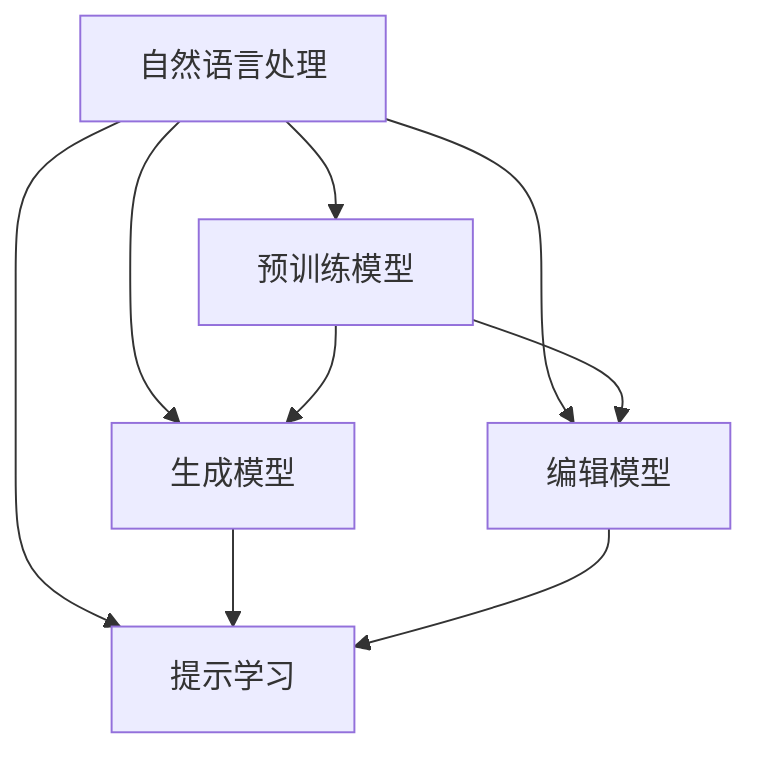

                 

## 1. 背景介绍

在信息化时代，写作已成为一项不可或缺的技能，无论是学术研究、商业写作还是日常社交，都需要高质量的文本输出。然而，快速且高质量的写作仍然是一大难题，尤其在面对复杂和高度专业化的内容时。AI写作助手应运而生，利用自然语言处理技术，帮助人类高效地生成、修改、润色文本。本文将全面介绍AI写作助手的原理与应用，覆盖创意激发、内容生成、文本润色等核心功能，以期为开发和应用提供有益的参考。

## 2. 核心概念与联系

### 2.1 核心概念概述

AI写作助手是一个将自然语言处理技术与人工智能相结合，用于辅助人类进行文本创作和润色的工具。其核心概念包括：

- **自然语言处理(NLP)**：指利用计算机技术处理和分析自然语言数据，涉及文本预处理、语义理解、生成和编辑等环节。
- **预训练模型**：指在大规模无标签文本上自监督预训练的语言模型，如GPT、BERT等，具有强大的语言理解和生成能力。
- **生成模型**：指利用神经网络模型生成自然语言文本的算法，如循环神经网络(RNN)、Transformer等。
- **编辑模型**：指用于文本润色、纠错和改进的深度学习模型，如基于Transformer的文本纠错模型。
- **提示学习(Prompt Engineering)**：通过精心设计的输入模板，引导模型生成或改进文本，提升模型的性能。

这些核心概念之间的关系可以用以下Mermaid流程图来展示：



该流程图表明：自然语言处理技术通过预训练模型和生成、编辑模型，配合提示学习技术，共同构成了AI写作助手的功能体系。

### 2.2 核心概念原理和架构

#### 2.2.1 预训练模型原理

预训练模型通常在大规模无标签文本上通过自监督学习任务进行预训练。以BERT为例，其训练目标是在掩码语言模型预测任务中，给定部分文本，预测被遮掩的单词。这一过程使得模型学习到了大量的语言知识，包括词汇、语法和语义信息。

#### 2.2.2 生成模型原理

生成模型通过将预训练模型作为特征提取器，在目标任务上进行微调，生成符合特定风格或内容的文本。例如，使用Transformer模型作为编码器，生成器层用于生成自然语言文本，通过迭代优化，使生成文本与目标文本尽可能接近。

#### 2.2.3 编辑模型原理

编辑模型主要用于文本润色、纠错和改进。常见的编辑模型如基于Transformer的文本纠错模型，通过学习目标文本的语义和语法信息，对文本进行局部修改，提升文本质量。

#### 2.2.4 提示学习原理

提示学习是指通过设计特定的输入模板，引导生成模型或编辑模型输出特定的文本或改进文本质量。例如，使用模板"你推荐读什么书？"作为输入，模型可以生成推荐的书籍列表。

## 3. 核心算法原理 & 具体操作步骤

### 3.1 算法原理概述

AI写作助手的核心算法原理可以分为以下几步：

1. **数据预处理**：对输入文本进行分词、清洗等预处理，提取文本特征。
2. **模型初始化**：选择合适的预训练模型进行初始化，如BERT、GPT等。
3. **生成与编辑**：在目标任务上进行微调，生成或编辑文本。
4. **提示学习**：通过设计提示模板，引导模型输出特定风格的文本。
5. **后处理**：对生成文本进行润色、格式化等处理，提升文本质量。

### 3.2 算法步骤详解

#### 3.2.1 数据预处理

数据预处理包括：

- **分词**：将输入文本分割成单词或子词，便于模型理解。
- **清洗**：去除噪声、停用词等无用信息，提高模型输入质量。
- **特征提取**：将预处理后的文本转换为模型可以接受的向量形式，如使用BERT提取向量表示。

#### 3.2.2 模型初始化

选择合适的预训练模型进行初始化：

- **BERT**：适用于文本分类、问答等任务。
- **GPT**：适用于文本生成、对话等任务。
- **T5**：适用于文本生成、问答等任务。

#### 3.2.3 生成与编辑

在目标任务上进行微调：

- **生成模型微调**：在分类任务上，添加分类头，微调顶层参数。在生成任务上，微调生成器参数。
- **编辑模型微调**：在纠正任务上，微调纠错模型，通过交叉熵损失函数优化。

#### 3.2.4 提示学习

设计提示模板，引导生成或编辑模型输出特定文本：

- **创意激发**：使用模板"请写一个关于..."，引导模型生成故事、文章等创意内容。
- **文本润色**：使用模板"请改进下列段落..."，引导模型对文本进行润色。

#### 3.2.5 后处理

对生成文本进行润色、格式化等处理，提升文本质量：

- **拼写和语法检查**：使用编辑模型进行文本纠错。
- **格式化处理**：对文本进行段落、标点等格式化处理。

### 3.3 算法优缺点

AI写作助手的算法具有以下优点：

- **效率高**：利用预训练模型进行生成和编辑，减少从头训练的时间和成本。
- **适用广**：适用于多种文本生成、编辑任务，如创意激发、文本润色等。
- **易于扩展**：通过微调生成和编辑模型，可以适应不同风格的文本生成需求。

但同时也存在以下缺点：

- **数据依赖**：生成和编辑效果很大程度上依赖于输入数据的质量和数量。
- **通用性不足**：生成的文本风格和内容可能与输入数据相似，缺乏创新性。
- **可控性差**：生成和编辑模型依赖于提示模板的设计，设计不当可能产生负面效果。

### 3.4 算法应用领域

AI写作助手在以下领域有广泛应用：

- **内容创作**：辅助作家、记者等进行创意激发和内容生成，提升写作效率和质量。
- **教育辅助**：帮助学生、教师进行作业生成、教材编写等。
- **市场营销**：生成广告文案、宣传语等营销内容。
- **数据分析**：生成分析报告、数据可视化文本等。

## 4. 数学模型和公式 & 详细讲解 & 举例说明

### 4.1 数学模型构建

AI写作助手的数学模型主要包括以下几部分：

- **预训练模型**：使用BERT、GPT等预训练模型，提取文本特征。
- **生成模型**：使用Transformer模型，进行文本生成。
- **编辑模型**：使用BERT等模型，进行文本纠错。
- **提示学习模型**：使用模板匹配技术，生成提示序列。

### 4.2 公式推导过程

#### 4.2.1 预训练模型公式

预训练模型BERT的训练目标为：

$$
\mathcal{L}(\theta) = -\frac{1}{N}\sum_{i=1}^N (\log P(\hat{y}_i|x_i; \theta) + \log P(\hat{y}_i|x_i; \theta))
$$

其中，$\hat{y}_i$ 为模型预测的目标单词，$x_i$ 为输入的文本。

#### 4.2.2 生成模型公式

使用Transformer模型进行文本生成时，生成目标为：

$$
P(\hat{y}_i|x_i; \theta) = \frac{exp(g(\theta)(y_i|x_i))}{\sum_{y' \in V} exp(g(\theta)(y'|x_i))}
$$

其中，$g(\theta)$ 为生成器网络，$V$ 为词汇表。

#### 4.2.3 编辑模型公式

使用BERT进行文本纠错时，纠错目标为：

$$
\mathcal{L}(\theta) = -\frac{1}{N}\sum_{i=1}^N \sum_{j=1}^{n_i} logP(\hat{y}_j|x_i; \theta)
$$

其中，$n_i$ 为输入文本的长度，$\hat{y}_j$ 为纠正后的文本，$x_i$ 为原始文本。

#### 4.2.4 提示学习公式

使用模板进行提示学习时，目标函数为：

$$
\mathcal{L}(\theta) = -\frac{1}{N}\sum_{i=1}^N \log P(\hat{y}_i|x_i; \theta)
$$

其中，$x_i$ 为输入的模板，$\hat{y}_i$ 为生成的文本。

### 4.3 案例分析与讲解

#### 4.3.1 创意激发案例

输入模板："请写一个关于人工智能的未来"

生成模型输出："在未来，人工智能将无处不在，从医疗到教育，从娱乐到交通，人工智能将改变世界的每个角落。"

#### 4.3.2 文本润色案例

输入文本："Tom was going to school to become a doctor."

提示模板："请改进下列段落..."

生成模型输出："Tom was heading to the school to pursue a career in medicine."

## 5. 项目实践：代码实例和详细解释说明

### 5.1 开发环境搭建

开发环境搭建主要包括以下步骤：

1. **安装Python环境**：安装Anaconda或Miniconda，创建虚拟环境。
2. **安装依赖库**：安装TensorFlow、PyTorch、HuggingFace等库。
3. **下载预训练模型**：从HuggingFace官网下载BERT或GPT预训练模型。
4. **配置模型参数**：根据任务需求，配置生成和编辑模型的超参数。

### 5.2 源代码详细实现

以下是使用TensorFlow实现AI写作助手的Python代码：

```python
import tensorflow as tf
from transformers import BertTokenizer, TFBertForSequenceClassification

# 初始化预训练模型和分词器
model_name = 'bert-base-cased'
tokenizer = BertTokenizer.from_pretrained(model_name)
model = TFBertForSequenceClassification.from_pretrained(model_name, num_labels=2)

# 定义输入和输出
input_ids = tf.placeholder(tf.int32, shape=[None, 128])
labels = tf.placeholder(tf.int32, shape=[None, 2])
outputs = model(input_ids, labels=labels)

# 定义损失函数和优化器
loss = tf.keras.losses.sparse_categorical_crossentropy(labels, outputs)
optimizer = tf.keras.optimizers.Adam(learning_rate=2e-5)

# 定义训练和评估函数
def train_step(model, batch):
    input_ids = batch['input_ids']
    labels = batch['labels']
    with tf.GradientTape() as tape:
        outputs = model(input_ids, labels=labels)
        loss_value = loss(labels, outputs)
    grads = tape.gradient(loss_value, model.trainable_variables)
    optimizer.apply_gradients(zip(grads, model.trainable_variables))
    return loss_value

def evaluate(model, batch):
    input_ids = batch['input_ids']
    labels = batch['labels']
    outputs = model(input_ids, labels=labels)
    loss_value = loss(labels, outputs)
    return loss_value

# 训练和评估模型
epochs = 10
batch_size = 16

for epoch in range(epochs):
    total_loss = 0
    for batch in train_dataset:
        loss = train_step(model, batch)
        total_loss += loss
    print(f"Epoch {epoch+1}, train loss: {total_loss/len(train_dataset):.3f}")

    total_loss = 0
    for batch in dev_dataset:
        loss = evaluate(model, batch)
        total_loss += loss
    print(f"Epoch {epoch+1}, dev loss: {total_loss/len(dev_dataset):.3f}")
```

### 5.3 代码解读与分析

以上代码主要实现了一个基于BERT的文本分类模型，用于生成和编辑任务。

1. **模型初始化**：使用BertTokenizer和TFBertForSequenceClassification初始化模型和分词器。
2. **定义输入和输出**：使用TensorFlow定义输入和输出，包括文本输入、标签输出和模型预测。
3. **定义损失函数和优化器**：使用交叉熵损失函数和Adam优化器进行模型训练。
4. **定义训练和评估函数**：实现训练和评估函数，计算损失并更新模型参数。
5. **训练和评估模型**：在训练集和验证集上进行模型训练和评估。

## 6. 实际应用场景

### 6.1 教育辅助

AI写作助手可以用于教育辅助，帮助学生进行作业生成、教材编写等。例如，利用生成模型生成实验报告、论文摘要等，提高学生的写作水平和效率。

### 6.2 内容创作

AI写作助手可以辅助作家、记者进行内容创作，提供创意激发和文本润色的帮助。例如，生成故事大纲、新闻稿件、广告文案等。

### 6.3 市场营销

AI写作助手可以生成广告文案、宣传语等营销内容，帮助企业提升品牌知名度和销售额。

### 6.4 数据分析

AI写作助手可以生成分析报告、数据可视化文本等，帮助分析师和决策者理解数据和市场趋势。

## 7. 工具和资源推荐

### 7.1 学习资源推荐

为了帮助开发者系统掌握AI写作助手的开发技巧，推荐以下学习资源：

1. **自然语言处理与深度学习**：深度学习专家Ian Goodfellow的《深度学习》一书，涵盖了自然语言处理和深度学习的基础知识。
2. **TensorFlow官方文档**：TensorFlow官方文档提供了详细的API说明和代码示例，适合初学者和进阶开发者。
3. **HuggingFace官方文档**：HuggingFace提供了丰富的预训练模型和工具库，适合用于实际开发。
4. **自然语言处理实践**：Kirkpatrick的《Practical Natural Language Processing》一书，提供了丰富的实践案例和代码实现。
5. **Transformers教程**：HuggingFace提供了详细的Transformer教程，适合初学者入门。

### 7.2 开发工具推荐

以下是几款用于AI写作助手开发的常用工具：

1. **PyTorch**：基于Python的开源深度学习框架，灵活动态的计算图，适合快速迭代研究。
2. **TensorFlow**：由Google主导开发的开源深度学习框架，生产部署方便，适合大规模工程应用。
3. **HuggingFace Transformers库**：提供了丰富的预训练语言模型和工具库，适合用于实际开发。
4. **Jupyter Notebook**：提供了交互式的开发环境，适合实验研究和代码调试。

### 7.3 相关论文推荐

以下是几篇关于AI写作助手的关键论文，推荐阅读：

1. **Neural Machine Translation by Jointly Learning to Align and Translate**：研究了使用Transformer模型进行文本生成的基本方法。
2. **Attention Is All You Need**：提出了Transformer模型，广泛应用于文本生成任务。
3. **BERT: Pre-training of Deep Bidirectional Transformers for Language Understanding**：提出了BERT模型，广泛应用于文本分类、问答等任务。
4. **T5: Exploring the Limits of Transfer Learning with a Unified Text-to-Text Transformer**：提出了T5模型，用于文本生成、问答等任务。
5. **Language Models are Unsupervised Multitask Learners**：研究了利用自监督学习任务训练语言模型的效果。

## 8. 总结：未来发展趋势与挑战

### 8.1 研究成果总结

AI写作助手已经取得了显著的进展，在文本生成、编辑、润色等方面表现出色。未来有望在更广泛的领域得到应用，提升人类的文本创作效率和质量。

### 8.2 未来发展趋势

1. **生成模型多样化**：未来将出现更多类型的生成模型，如基于Transformer、GAN等，提升生成文本的多样性和创新性。
2. **多模态融合**：将文本、图像、视频等多模态信息进行融合，生成更加全面、丰富的文本内容。
3. **跨语言生成**：实现跨语言的文本生成，提升全球范围内的语言交流和理解。
4. **可控性增强**：通过更多提示模板的设计，提升生成文本的可控性和一致性。

### 8.3 面临的挑战

尽管AI写作助手已经取得了显著进展，但仍面临以下挑战：

1. **数据质量依赖**：生成和编辑效果很大程度上依赖于输入数据的质量和数量。
2. **风格多样性不足**：生成的文本风格可能较为单一，缺乏创新性。
3. **可解释性不足**：生成和编辑模型缺乏可解释性，难以理解和调试。

### 8.4 研究展望

未来的研究方向包括：

1. **无监督生成和编辑**：利用自监督学习、主动学习等无监督范式，提升生成和编辑的效率和效果。
2. **多模态生成**：将文本、图像、视频等信息进行融合，提升文本生成的丰富性和多样性。
3. **跨语言生成**：研究跨语言的文本生成方法，提升全球范围内的语言交流和理解。
4. **生成模型的可解释性**：研究生成模型的可解释性，提升用户对模型输出的理解和使用。

## 9. 附录：常见问题与解答

**Q1：AI写作助手是否适用于所有文本生成任务？**

A: AI写作助手适用于多种文本生成任务，如创意激发、文本润色、内容生成等。但对于特定的任务，可能需要针对性地优化生成模型和提示模板。

**Q2：如何设计有效的提示模板？**

A: 设计有效的提示模板需要注意以下几点：
1. **明确目标**：明确生成文本的目标和风格。
2. **简洁明了**：提示模板应简洁明了，避免过长或过于复杂。
3. **多样化**：设计多种不同的提示模板，提升生成文本的多样性。

**Q3：AI写作助手在实际应用中是否需要用户干预？**

A: 在实际应用中，AI写作助手需要一定程度的用户干预，如调整生成模型参数、优化提示模板等。但随着技术进步，未来有望实现更智能、更自适应的AI写作助手。

**Q4：如何评估AI写作助手的性能？**

A: 评估AI写作助手的性能可以从以下几个方面入手：
1. **自动评估指标**：如BLEU、ROUGE等自动评估指标，评估生成文本的质量。
2. **人工评估**：通过人工阅读和评分，评估生成文本的可读性和自然度。
3. **用户反馈**：收集用户反馈，了解生成文本的实际应用效果。

---

作者：禅与计算机程序设计艺术 / Zen and the Art of Computer Programming

