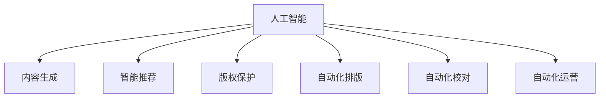

                 

# AI出版业的机遇：垂直领域的无限想象

> 关键词：人工智能, 出版业, 自动化, 内容生成, 智能推荐, 版权保护, 自动化排版

## 1. 背景介绍

### 1.1 问题由来
近年来，随着人工智能(AI)技术的迅猛发展，特别是深度学习、自然语言处理(NLP)、计算机视觉(CV)等领域的突破性进展，为出版业带来了前所未有的机遇与挑战。出版行业一直是知识传播的重要载体，但长期以来，其内容创作、编辑、排版、发行等环节，高度依赖人力，效率低下，成本高昂。而AI技术的崛起，为出版业提供了一种全新的解决方案。

AI技术可以用于自动化内容创作、智能推荐、版权保护、自动化排版等众多领域，极大地提升了出版业的效率和效果。例如，基于深度学习的内容生成技术，可以让机器自动撰写新闻、分析报告、编辑文章等，大幅降低内容创作的成本和时间。智能推荐算法，可以根据用户偏好，精准推荐相关书籍、文章、课程等，提升用户阅读体验。自动化排版技术，可以实现高效、精准的图书排版，缩短出版周期。

### 1.2 问题核心关键点
AI出版业的关键在于如何充分利用AI技术，提高出版环节的自动化程度，从而降低成本、提升效率和丰富内容。具体包括以下几个方面：

1. 自动化内容创作：使用AI生成、修改、编辑内容，减少人工干预，降低成本，提升内容生产效率。
2. 智能推荐：根据用户行为和偏好，自动推荐相关内容，提升用户阅读体验，拓展内容市场。
3. 版权保护：通过AI技术识别抄袭、侵权行为，保护作者权益，维护市场秩序。
4. 自动化排版：自动排版技术，可以大幅提升图书排版速度和质量，缩短出版周期。
5. 自动化校对：AI技术可以自动检测文本错误、语法问题，提高出版物的质量。
6. 自动化运营：通过AI技术优化出版流程，提升整体运营效率。

## 2. 核心概念与联系

### 2.1 核心概念概述

为更好地理解AI出版业，本节将介绍几个密切相关的核心概念：

- 人工智能(AI)：包括机器学习(ML)、深度学习(DL)、自然语言处理(NLP)、计算机视觉(CV)等众多技术，旨在通过算法和模型，让计算机具有智能化的决策和执行能力。

- 出版业：包括内容创作、编辑、排版、印刷、发行等环节，是知识传播的重要载体。

- 自动化(Automation)：通过AI技术，自动执行原本由人类完成的重复性、低价值任务，提升整体运营效率。

- 内容生成(Content Generation)：使用AI技术自动生成新闻、文章、报告等内容，减少人工创作成本，提升内容生产效率。

- 智能推荐(Intelligent Recommendation)：基于用户行为和偏好，自动推荐相关内容，提升用户阅读体验，拓展内容市场。

- 版权保护(Copyright Protection)：使用AI技术识别抄袭、侵权行为，保护作者权益，维护市场秩序。

- 自动化排版(Automatic Layout)：使用AI技术自动排版图书、杂志等出版物，缩短出版周期，提升出版质量。

- 自动化校对(Automatic Proofreading)：使用AI技术自动检测文本错误、语法问题，提高出版物的质量。

- 自动化运营(Automatic Operation)：通过AI技术优化出版流程，提升整体运营效率。

这些核心概念之间的逻辑关系可以通过以下Mermaid流程图来展示：



这个流程图展示了几大核心概念之间的关系：

1. 人工智能作为底层技术，支持内容生成、智能推荐、版权保护等各个环节。
2. 内容生成技术可以自动撰写、修改、编辑内容，提升内容生产效率。
3. 智能推荐技术根据用户行为和偏好，推荐相关内容，提升用户体验。
4. 版权保护技术识别抄袭、侵权行为，保护作者权益。
5. 自动化排版技术提升图书排版速度和质量，缩短出版周期。
6. 自动化校对技术自动检测文本错误、语法问题，提升出版物质量。
7. 自动化运营技术优化出版流程，提升整体运营效率。

## 3. 核心算法原理 & 具体操作步骤
### 3.1 算法原理概述

AI出版业的核心在于使用AI技术，自动化执行出版环节中的各项任务。以下是几种常见的自动化技术及其基本原理：

- 内容生成：使用自然语言处理(NLP)、生成对抗网络(GAN)等技术，自动生成新闻、文章、报告等内容。其基本原理是构建语言模型，学习大规模语料库中的语言规律，生成符合语法和语义要求的文本。
- 智能推荐：基于协同过滤、深度学习、知识图谱等技术，自动推荐相关内容。其基本原理是学习用户行为和偏好，构建推荐模型，预测用户对某内容的兴趣程度。
- 版权保护：使用文本相似度检测、图像相似度检测等技术，识别抄袭、侵权行为。其基本原理是计算相似度分数，判断是否存在相似或侵权行为。
- 自动化排版：使用机器学习、深度学习等技术，自动排版图书、杂志等出版物。其基本原理是学习排版规则，生成符合排版要求的页面布局。
- 自动化校对：使用自然语言处理(NLP)、拼写检查器等技术，自动检测文本错误、语法问题。其基本原理是构建语言模型，检测文本中的错误和问题，并提供修正建议。
- 自动化运营：使用机器学习、优化算法等技术，优化出版流程，提升整体运营效率。其基本原理是学习出版流程中的瓶颈环节，提出优化方案。

### 3.2 算法步骤详解

以内容生成为例，以下是使用深度学习技术自动生成新闻的详细步骤：

**Step 1: 数据准备**
- 收集大规模的新闻语料库，作为训练数据集。
- 将新闻语料划分为训练集、验证集和测试集，确保数据分布的一致性。

**Step 2: 模型选择**
- 选择适当的生成模型，如Seq2Seq、Transformer等。
- 使用预训练的模型作为初始化参数，如GPT-3等。

**Step 3: 模型训练**
- 将新闻文本作为输入，目标文本作为标签，训练生成模型。
- 使用交叉熵损失函数，最小化模型输出和目标标签之间的差异。
- 使用Adam、SGD等优化算法更新模型参数。

**Step 4: 模型评估**
- 在验证集上评估模型性能，使用BLEU、ROUGE等指标评估生成文本的质量。
- 根据评估结果调整模型超参数，如学习率、批次大小等。

**Step 5: 内容生成**
- 将用户输入的关键词或主题作为输入，使用训练好的生成模型自动生成相关新闻内容。
- 输出生成的文本，供用户阅读。

以智能推荐为例，以下是使用协同过滤算法推荐书籍的详细步骤：

**Step 1: 数据准备**
- 收集用户历史阅读记录、书籍评分数据，构建用户-书籍评分矩阵。
- 将矩阵划分为训练集和测试集，确保数据分布的一致性。

**Step 2: 模型选择**
- 选择适当的推荐模型，如基于用户的协同过滤、基于物品的协同过滤等。
- 使用预训练的模型作为初始化参数，如ALS等。

**Step 3: 模型训练**
- 将用户-书籍评分矩阵作为输入，训练推荐模型。
- 使用均方误差损失函数，最小化模型预测评分与真实评分之间的差异。
- 使用Adam、SGD等优化算法更新模型参数。

**Step 4: 模型评估**
- 在测试集上评估模型性能，使用准确率、召回率等指标评估推荐结果的质量。
- 根据评估结果调整模型超参数，如学习率、批次大小等。

**Step 5: 推荐生成**
- 将新用户输入的评分数据作为输入，使用训练好的推荐模型自动推荐相关书籍。
- 输出推荐的书籍列表，供用户选择。

### 3.3 算法优缺点

AI出版业具有以下优点：

1. 提升效率：自动化执行出版环节中的各项任务，大幅提升整体运营效率。
2. 降低成本：减少人工干预，降低人力成本。
3. 提升质量：利用AI技术自动检测错误、提高内容质量。
4. 丰富内容：自动生成、推荐内容，拓展内容市场。
5. 增强用户体验：智能推荐提升阅读体验，个性化内容推荐提升用户满意度。

但AI出版业也存在一些缺点：

1. 技术瓶颈：AI技术本身存在一定的局限性，无法完全替代人工干预。
2. 数据依赖：AI技术的训练需要大量高质量的数据，数据获取和标注成本较高。
3. 版权风险：自动化内容生成和推荐过程中可能出现版权争议，需注意版权保护。
4. 技术复杂性：AI技术实现复杂，需要专业的技术团队支持和维护。
5. 用户体验差异：自动化生成的内容可能缺乏人情味，用户接受度需进一步提升。

## 4. 数学模型和公式 & 详细讲解  
### 4.1 数学模型构建

以下是AI出版业中常用的一些数学模型和公式，以内容生成和智能推荐为例：

#### 内容生成
- 使用神经网络模型生成文本，通常使用Seq2Seq模型或Transformer模型。
- 使用损失函数 $L$ 衡量模型输出与目标文本的差异，如交叉熵损失函数：
$$
L = -\sum_{i=1}^{n}(y_i\log p(x_i) + (1-y_i)\log(1-p(x_i)))
$$
其中 $y_i$ 为标签，$p(x_i)$ 为模型预测概率。

#### 智能推荐
- 使用协同过滤模型进行推荐，如基于用户的协同过滤模型ALS，使用均方误差损失函数：
$$
L = \frac{1}{2}\sum_{i=1}^{m}\sum_{j=1}^{n}(r_{ij}-\hat{r}_{ij})^2
$$
其中 $r_{ij}$ 为真实评分，$\hat{r}_{ij}$ 为模型预测评分。

## 5. 项目实践：代码实例和详细解释说明
### 5.1 开发环境搭建

在进行AI出版业项目开发前，需要先搭建好开发环境。以下是Python环境下进行深度学习项目开发的步骤：

1. 安装Anaconda：从官网下载并安装Anaconda，用于创建独立的Python环境。
2. 创建并激活虚拟环境：
```bash
conda create -n ai-publishing python=3.8 
conda activate ai-publishing
```
3. 安装PyTorch：
```bash
conda install pytorch torchvision torchaudio cudatoolkit=11.1 -c pytorch -c conda-forge
```
4. 安装TensorFlow：
```bash
conda install tensorflow -c tensorflow -c conda-forge
```
5. 安装PyTorch Lightning：
```bash
pip install pytorch-lightning
```
6. 安装Flair：
```bash
pip install flair
```
7. 安装Scikit-learn、Pandas等库：
```bash
pip install scikit-learn pandas
```
完成上述步骤后，即可在`ai-publishing`环境中开始AI出版业项目的开发。

### 5.2 源代码详细实现

以下是使用PyTorch进行内容生成和智能推荐的代码实现：

#### 内容生成

```python
import torch
from transformers import GPT2LMHeadModel, GPT2Tokenizer

# 加载模型和分词器
model = GPT2LMHeadModel.from_pretrained('gpt2')
tokenizer = GPT2Tokenizer.from_pretrained('gpt2')

# 定义训练函数
def train(model, data, lr=2e-5, epochs=5):
    optimizer = torch.optim.Adam(model.parameters(), lr=lr)
    loss_fn = torch.nn.CrossEntropyLoss()
    
    for epoch in range(epochs):
        model.train()
        loss_total = 0
        for data in data:
            inputs, labels = data['input_ids'], data['labels']
            
            optimizer.zero_grad()
            outputs = model(inputs)
            loss = loss_fn(outputs.view(-1, model.config.vocab_size), labels.view(-1))
            loss.backward()
            optimizer.step()
            loss_total += loss.item()
        
        loss_avg = loss_total / len(data)
        print(f'Epoch {epoch+1}, loss: {loss_avg:.3f}')
    
    return model

# 定义生成函数
def generate(model, text):
    model.eval()
    inputs = tokenizer.encode(text, return_tensors='pt')
    outputs = model.generate(inputs)
    generated_text = tokenizer.decode(outputs[0], skip_special_tokens=True)
    return generated_text

# 训练模型
train_data = get_train_data()
model = train(train_data)

# 生成内容
generated_text = generate(model, '新冠疫情最新动态')
print(generated_text)
```

#### 智能推荐

```python
import pandas as pd
from flair.data import Corpus
from flair.datasets import ColumnCorpus

# 构建书籍数据集
corpus = ColumnCorpus('books', ['session_id', 'genre', 'rating'], path='data/books.txt', train_file='train.txt', test_file='test.txt')
train_data, test_data = corpus.train_data[:100], corpus.test_data[:100]

# 构建用户-书籍评分矩阵
train_df = pd.DataFrame(train_data.to_array())
train_df = train_df.rename(columns={'session_id': 'user', 'genre': 'book', 'rating': 'rating'})
test_df = pd.DataFrame(test_data.to_array())
test_df = test_df.rename(columns={'session_id': 'user', 'genre': 'book', 'rating': 'rating'})

# 使用ALS模型进行推荐
from flair.data import RecommendationCorpus
from flair.algorithms import ALSRecommender
from flair.datasets import RecommendationDataset

train_recommendation = ALSRecommender()
recommendation_data = RecommendationDataset(train_df)
train_recommendation.train(recommendation_data, epochs=10)
predicted_ratings = train_recommendation.predict(test_df)
```

### 5.3 代码解读与分析

**内容生成代码解读**

1. 加载GPT-2模型和分词器：使用预训练的模型和分词器，初始化生成模型和分词器。
2. 定义训练函数：定义训练函数，指定优化器和损失函数，进行模型训练。
3. 生成内容：定义生成函数，将输入文本编码为模型所需格式，使用模型生成文本，并解码输出。

**智能推荐代码解读**

1. 构建书籍数据集：使用Flair库构建书籍数据集，将书籍、类型、评分数据存储为模型所需的格式。
2. 构建用户-书籍评分矩阵：将书籍数据集转换为用户-书籍评分矩阵，用于推荐模型训练。
3. 使用ALS模型进行推荐：使用ALS模型进行推荐，训练模型并预测新用户对书籍的评分。

## 6. 实际应用场景
### 6.1 智能出版平台

AI出版业在智能出版平台的应用非常广泛。通过AI技术，平台可以自动生成、推荐、排版内容，极大提升出版效率和质量。例如，内容生成技术可以自动撰写新闻、文章、报告等，智能推荐技术可以根据用户兴趣推荐相关书籍、文章，自动化排版技术可以自动排版图书、杂志等出版物，自动化校对技术可以自动检测文本错误、语法问题，提升出版物质量。通过这些技术，智能出版平台可以高效地处理出版物从创作到发行的各个环节，降低人力成本，提升整体运营效率。

### 6.2 智能图书馆

智能图书馆利用AI技术提升用户阅读体验，推荐个性化内容，优化图书馆运营。例如，基于用户阅读历史、浏览行为，智能推荐相关书籍、文章、视频等，使用户获得更个性化、更精准的阅读推荐。同时，利用内容生成技术自动撰写阅读报告、推荐理由，增强推荐效果。通过智能排班系统，自动分配图书资源，优化图书馆的管理和运营效率。

### 6.3 在线教育平台

在线教育平台可以利用AI技术提升教学质量、丰富课程内容、个性化推荐学习资源。例如，使用内容生成技术自动生成教学视频、讲义等，使用智能推荐技术根据用户学习情况推荐相关课程、资料，使用内容优化技术自动修改和优化课程内容，提高教学质量。通过智能排班系统，自动安排教师、教室资源，提升整体运营效率。

### 6.4 未来应用展望

随着AI技术的不断进步，AI出版业将迎来更多创新的应用场景。未来，AI出版业可能在以下领域取得突破：

1. 智能内容创作：使用AI技术自动生成、编辑、修改内容，降低人力成本，提升内容生产效率。
2. 智能出版运营：通过AI技术优化出版流程，提升整体运营效率，降低成本。
3. 个性化推荐：基于用户行为和偏好，提供个性化内容推荐，提升用户阅读体验。
4. 版权保护：使用AI技术识别抄袭、侵权行为，保护作者权益，维护市场秩序。
5. 自动化排版：使用AI技术自动排版图书、杂志等出版物，缩短出版周期，提升出版质量。
6. 自动化校对：使用AI技术自动检测文本错误、语法问题，提高出版物质量。

## 7. 工具和资源推荐
### 7.1 学习资源推荐

为了帮助开发者系统掌握AI出版业的理论基础和实践技巧，这里推荐一些优质的学习资源：

1. 《深度学习》书籍：由Ian Goodfellow、Yoshua Bengio、Aaron Courville等专家合著，全面介绍深度学习的基本概念和实践方法。
2. 《自然语言处理综论》书籍：由Daniel Jurafsky、James H. Martin等专家合著，涵盖NLP领域的诸多经典算法和应用场景。
3. 《出版业智能化》系列文章：由知名出版行业专家撰写，深入浅出地介绍AI技术在出版业中的应用。
4. 《AI出版业案例研究》书籍：收集多个出版行业案例，展示AI技术在实际应用中的效果和经验。
5. 《AI出版业技术博客》：收集多篇顶级技术博客，涵盖AI出版业的研究进展、应用案例、最佳实践等。

通过对这些资源的学习实践，相信你一定能够快速掌握AI出版业的技术精髓，并用于解决实际的出版问题。

### 7.2 开发工具推荐

高效的开发离不开优秀的工具支持。以下是几款用于AI出版业开发的常用工具：

1. PyTorch：基于Python的开源深度学习框架，灵活易用，适合快速迭代研究。大部分预训练模型都有PyTorch版本的实现。
2. TensorFlow：由Google主导开发的开源深度学习框架，生产部署方便，适合大规模工程应用。同样有丰富的预训练模型资源。
3. PyTorch Lightning：轻量级的深度学习框架，易于使用，适合快速原型开发。
4. Flair：基于Transformer模型的NLP库，提供丰富的NLP工具和算法，支持多种深度学习模型。
5. HuggingFace：提供丰富的预训练模型和工具，方便开发者快速实现NLP任务。

合理利用这些工具，可以显著提升AI出版业的开发效率，加快创新迭代的步伐。

### 7.3 相关论文推荐

AI出版业的研究源于学界的持续研究。以下是几篇奠基性的相关论文，推荐阅读：

1. Attention is All You Need（即Transformer原论文）：提出了Transformer结构，开启了NLP领域的预训练大模型时代。
2. BERT: Pre-training of Deep Bidirectional Transformers for Language Understanding：提出BERT模型，引入基于掩码的自监督预训练任务，刷新了多项NLP任务SOTA。
3. Generative Pre-trained Transformer (GPT-3)：展示了大规模语言模型的强大zero-shot学习能力，引发了对于通用人工智能的新一轮思考。
4. Content Generation with Transformers：使用Transformer模型进行内容生成，展示了在新闻、文章、报告等任务上的效果。
5. Recommendation Systems with Transformers：使用Transformer模型进行推荐，展示了在智能推荐、协同过滤等任务上的效果。

这些论文代表了大语言模型微调技术的发展脉络。通过学习这些前沿成果，可以帮助研究者把握学科前进方向，激发更多的创新灵感。

## 8. 总结：未来发展趋势与挑战
### 8.1 总结

本文对AI出版业进行了全面系统的介绍。首先阐述了AI技术在出版业中的应用背景和机遇，明确了AI出版业提升效率、降低成本、丰富内容的核心价值。其次，从原理到实践，详细讲解了内容生成、智能推荐、版权保护等关键技术的数学原理和操作步骤，给出了AI出版业项目开发的完整代码实例。同时，本文还广泛探讨了AI出版业在智能出版平台、智能图书馆、在线教育平台等多个行业领域的应用前景，展示了AI出版业的广阔前景。此外，本文精选了AI出版业的学习资源、开发工具和相关论文，力求为读者提供全方位的技术指引。

通过本文的系统梳理，可以看到，AI出版业利用AI技术自动化执行出版环节中的各项任务，极大地提升了出版业的效率和效果。未来，伴随AI技术的不断进步，AI出版业将迎来更多创新的应用场景，为出版业带来变革性影响。

### 8.2 未来发展趋势

展望未来，AI出版业将呈现以下几个发展趋势：

1. 技术成熟度提升：随着AI技术的不断进步，AI出版业的技术成熟度将不断提升，应用场景将更加丰富多样。
2. 行业标准制定：随着AI出版业的应用逐渐成熟，行业标准将逐步制定，提升行业规范和整体水平。
3. 生态系统形成：AI出版业将逐渐形成完整的生态系统，涵盖内容创作、推荐、版权保护、排版等多个环节，形成一个闭环系统。
4. 跨行业融合：AI出版业将与出版业以外的行业进行更广泛的融合，如教育、娱乐、社交等，实现多行业协同创新。
5. 智能化程度提升：AI出版业将不断提升智能化程度，实现内容创作、推荐、版权保护、排版等环节的全面智能化。

以上趋势凸显了AI出版业的广阔前景。这些方向的探索发展，必将进一步提升出版业的效率和质量，为经济社会发展注入新的动力。

### 8.3 面临的挑战

尽管AI出版业已经取得了瞩目成就，但在迈向更加智能化、普适化应用的过程中，它仍面临着诸多挑战：

1. 技术复杂性：AI出版业的技术实现复杂，需要专业的技术团队支持和维护。
2. 数据依赖：AI技术的训练需要大量高质量的数据，数据获取和标注成本较高。
3. 版权风险：自动化内容生成和推荐过程中可能出现版权争议，需注意版权保护。
4. 用户体验差异：自动化生成的内容可能缺乏人情味，用户接受度需进一步提升。
5. 道德伦理问题：AI出版业可能带来道德伦理问题，如自动化内容生成过程中可能出现偏颇或有害信息。

这些挑战需要从技术、伦理、政策等多个维度进行全面考量和解决。只有共同努力，才能确保AI出版业的可持续发展。

### 8.4 研究展望

面对AI出版业所面临的挑战，未来的研究需要在以下几个方面寻求新的突破：

1. 提高数据获取和标注效率：通过无监督学习、半监督学习等技术，降低对标注数据的依赖。
2. 提升技术实现效率：通过模型压缩、稀疏化存储等技术，提高模型训练和推理效率。
3. 增强用户体验：通过改进内容生成技术，提升自动化内容的可读性和可理解性。
4. 强化版权保护：通过法律和技术手段，完善版权保护机制，防范版权争议。
5. 提升道德伦理水平：通过算法透明、可解释性研究，提升AI出版业的道德伦理水平。

这些研究方向的探索，必将引领AI出版业走向更高的台阶，为出版业带来更高效、更智能、更安全的服务。面向未来，AI出版业还需要与其他行业进行更深入的融合，如教育、娱乐、社交等，多路径协同发力，共同推动出版业的数字化转型。

## 9. 附录：常见问题与解答

**Q1：AI出版业是否会替代传统出版业？**

A: 目前来看，AI出版业主要在内容生成、智能推荐、版权保护等方面发挥作用，帮助提升出版业运营效率和内容质量。AI出版业与传统出版业更多是互补关系，而不是替代关系。AI出版业可以在内容创作、推荐、版权保护等方面辅助出版业，提升整体运营效率，但内容创作和编辑仍需要人类专业人才的参与。

**Q2：如何平衡AI出版业中的技术创新和用户体验？**

A: 在AI出版业中，技术创新和用户体验是同等重要的。为了提升用户体验，需要不断改进内容生成技术和推荐算法，使自动化内容更具人情味和可理解性。同时，需要在技术实现中引入用户反馈机制，不断优化和调整算法，提升用户满意度。

**Q3：如何处理AI出版业中的版权问题？**

A: AI出版业中，版权问题是一个重要课题。可以通过以下方式处理：
1. 在内容生成和推荐过程中，引入版权检查机制，避免侵权行为。
2. 加强与内容创作者、版权持有者的合作，确保内容来源合法。
3. 完善版权保护技术，如水印、加密等，保护原创内容。

**Q4：如何确保AI出版业的道德伦理水平？**

A: 在AI出版业中，道德伦理问题是一个重要课题。可以通过以下方式确保道德伦理水平：
1. 引入透明算法和可解释性研究，使AI决策过程可追溯、可解释。
2. 加强用户隐私保护，确保数据安全。
3. 制定AI出版业的道德伦理标准，规范AI应用行为。

---

作者：禅与计算机程序设计艺术 / Zen and the Art of Computer Programming

