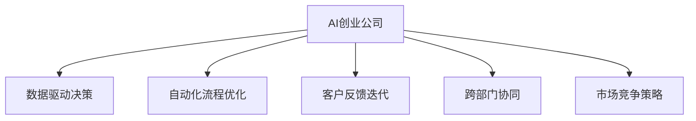

                 

## 1. 背景介绍

随着人工智能(AI)技术的飞速发展，越来越多的AI创业公司崭露头角。这些公司凭借创新算法、大数据和先进的机器学习技术，不断推动着人工智能应用的前沿。然而，如何实现规模化增长，使这些初创企业在激烈的市场竞争中脱颖而出，成为了每一位创始人和管理层的核心挑战。本文将深入探讨AI创业公司实现规模化增长的战略和实践方法，以期为业内人士提供有价值的参考。

## 2. 核心概念与联系

### 2.1 核心概念概述

为帮助读者更好地理解文章内容，本节将简要介绍几个关键概念：

- **AI创业公司**：指通过AI技术创新提供产品或服务的公司，典型代表如OpenAI、DeepMind、商汤科技等。
- **数据驱动决策**：指利用大数据和机器学习模型辅助制定业务策略和运营决策的实践方法。
- **自动化流程优化**：指通过引入自动化技术和机器学习算法，优化业务流程，提高效率和质量。
- **客户反馈迭代**：指基于用户反馈，不断迭代产品和服务，提升用户体验和满意度。
- **跨部门协同**：指在公司的各个部门间建立高效的沟通协作机制，确保各项业务流程的顺利推进。
- **市场竞争策略**：指公司为应对市场竞争所采用的各种战略手段，如市场细分、差异化竞争、并购整合等。

### 2.2 核心概念原理和架构的 Mermaid 流程图



这个流程图展示了AI创业公司实现规模化增长的关键流程和活动。

## 3. 核心算法原理 & 具体操作步骤

### 3.1 算法原理概述

实现AI创业公司规模化增长的核心算法原理主要包括数据驱动决策、自动化流程优化、客户反馈迭代、跨部门协同和市场竞争策略。这些原理通过机器学习、深度学习、自然语言处理等技术得以实现，具体步骤如下：

1. **数据驱动决策**：通过收集和分析大量的业务数据，使用机器学习模型进行预测和决策，优化业务流程和资源配置。
2. **自动化流程优化**：利用自动化技术（如RPA、机器人流程自动化等）对业务流程进行智能化改造，提高效率和准确性。
3. **客户反馈迭代**：利用自然语言处理技术对用户反馈进行情感分析和语义理解，据此优化产品和服务，提升用户体验。
4. **跨部门协同**：通过分布式计算和协作工具（如JIRA、Slack等），加强部门间的沟通和协作，提高工作效率。
5. **市场竞争策略**：利用市场分析和大数据挖掘技术，制定竞争策略，如市场细分、差异化竞争等。

### 3.2 算法步骤详解

以下是AI创业公司实现规模化增长的详细步骤：

**Step 1: 构建数据基础架构**
- 设置数据仓库，收集和存储业务数据。
- 进行数据清洗和预处理，确保数据质量。
- 搭建数据管道，自动化数据采集和同步。

**Step 2: 数据分析与决策支持**
- 利用机器学习算法（如回归分析、分类算法等）进行数据分析和预测。
- 使用决策支持系统（DSS）集成分析结果，辅助业务决策。

**Step 3: 流程自动化与优化**
- 识别并优化业务流程中的瓶颈环节。
- 引入自动化技术（如机器人流程自动化RPA、人工智能助手等）优化流程。
- 使用监控和报告工具跟踪自动化效果。

**Step 4: 客户反馈收集与分析**
- 部署自然语言处理（NLP）系统，自动分析用户反馈。
- 使用情感分析和主题建模技术，识别用户痛点和需求。
- 根据分析结果，迭代优化产品和服务。

**Step 5: 跨部门协作与沟通**
- 建立协同工具和平台，加强部门间信息共享。
- 利用分布式计算框架（如Spark、Kubernetes等），提高任务执行效率。
- 定期召开跨部门会议，促进团队协作。

**Step 6: 竞争策略制定与实施**
- 分析市场趋势和竞争对手情况。
- 制定市场细分、产品差异化等策略。
- 实施策略，监控效果并进行迭代优化。

### 3.3 算法优缺点

数据驱动决策、自动化流程优化、客户反馈迭代、跨部门协同和市场竞争策略具有以下优点：

- **提升效率**：通过自动化和智能化改造，业务流程效率显著提高。
- **精准决策**：基于数据分析和机器学习模型，决策更加精准。
- **优化体验**：根据用户反馈和需求，产品和服务持续迭代优化。
- **协同合作**：跨部门协同机制，增强团队合作和资源整合能力。
- **市场领先**：精准的市场分析帮助公司制定领先策略，占据市场优势。

同时，这些策略也存在一些缺点：

- **数据隐私**：业务数据收集和处理过程中存在隐私保护问题。
- **技术复杂**：实施过程中涉及多种技术，需高水平的技术团队。
- **成本投入**：技术和人才的投入较高，需较大资金支持。
- **文化转变**：跨部门协作和自动化需要企业文化和思维的转变。
- **策略风险**：市场竞争策略的制定和实施存在不确定性。

### 3.4 算法应用领域

这些算法在多个领域得到了广泛应用：

- **电商**：利用数据驱动决策优化库存管理和营销策略。
- **金融**：使用自动化流程优化提升风险控制和客户服务。
- **医疗**：通过客户反馈迭代改进医疗服务质量和患者体验。
- **制造**：采用跨部门协同提高生产效率和产品质量。
- **物流**：制定市场竞争策略优化配送路线和资源配置。

## 4. 数学模型和公式 & 详细讲解 & 举例说明

### 4.1 数学模型构建

为了更好地理解这些算法，本节将构建一些数学模型。

**数据驱动决策模型**
- **回归模型**：假设业务目标为预测销售额，模型为 $y = \beta_0 + \beta_1 x_1 + \beta_2 x_2 + \cdots + \beta_n x_n + \epsilon$，其中 $y$ 为销售额，$x_i$ 为影响因素，$\beta_i$ 为回归系数，$\epsilon$ 为误差项。
- **分类模型**：假设业务目标为识别客户流失率，模型为 $P(y=1|x) = \frac{e^{\beta_0 + \beta_1 x_1 + \beta_2 x_2 + \cdots + \beta_n x_n}}{1 + e^{\beta_0 + \beta_1 x_1 + \beta_2 x_2 + \cdots + \beta_n x_n}}$，其中 $y=1$ 表示客户流失，$x_i$ 为影响因素。

**自动化流程优化模型**
- **流程优化模型**：假设业务流程包含多个步骤，模型为 $Opt = \min_{\theta} f(\theta) = \sum_{i=1}^m \omega_i \cdot h(x_i;\theta)$，其中 $Opt$ 为流程优化目标，$h(x_i;\theta)$ 为第 $i$ 个步骤的优化函数，$\theta$ 为可调整参数，$\omega_i$ 为权重。

**客户反馈迭代模型**
- **情感分析模型**：假设客户反馈为 $x$，模型为 $E = \sum_{i=1}^n \omega_i \cdot f_i(x)$，其中 $E$ 为情感得分，$f_i(x)$ 为第 $i$ 个情感分析函数，$\omega_i$ 为权重。

**市场竞争策略模型**
- **市场细分模型**：假设市场分为 $k$ 个细分市场，模型为 $P_k = \sum_{i=1}^k \omega_i \cdot f_i(x)$，其中 $P_k$ 为第 $k$ 个细分市场的需求概率，$f_i(x)$ 为第 $i$ 个细分市场的预测函数，$\omega_i$ 为权重。

### 4.2 公式推导过程

为了更好地理解这些模型的推导过程，下面给出详细的公式推导：

**回归模型推导**
- 假设样本数据为 $(x_i, y_i)$，$i=1,2,\cdots,n$，则最小二乘法的目标函数为 $\sum_{i=1}^n (y_i - \hat{y}_i)^2$，其中 $\hat{y}_i$ 为预测值。
- 推导得 $\hat{\beta} = (X^T X)^{-1} X^T Y$，其中 $X$ 为特征矩阵，$Y$ 为样本标签。

**分类模型推导**
- 假设样本数据为 $(x_i, y_i)$，$i=1,2,\cdots,n$，则逻辑回归模型的目标函数为 $\sum_{i=1}^n -y_i \log P(y_i=1|x_i) - (1-y_i) \log (1-P(y_i=1|x_i))$。
- 推导得 $\hat{\beta} = (X^T X)^{-1} X^T Y$，其中 $X$ 为特征矩阵，$Y$ 为样本标签。

**情感分析模型推导**
- 假设客户反馈为 $x$，模型为 $E = \sum_{i=1}^n \omega_i \cdot f_i(x)$，其中 $f_i(x)$ 为第 $i$ 个情感分析函数，$\omega_i$ 为权重。
- 推导得 $E = \sum_{i=1}^n \omega_i \cdot f_i(x)$。

**市场细分模型推导**
- 假设市场分为 $k$ 个细分市场，模型为 $P_k = \sum_{i=1}^k \omega_i \cdot f_i(x)$，其中 $f_i(x)$ 为第 $i$ 个细分市场的预测函数，$\omega_i$ 为权重。
- 推导得 $P_k = \sum_{i=1}^k \omega_i \cdot f_i(x)$。

### 4.3 案例分析与讲解

**案例1: 电商销售额预测**
- 电商公司收集历史订单数据，利用回归模型预测未来销售额。
- 通过数据清洗和预处理，构建特征矩阵 $X$ 和样本标签 $Y$。
- 使用最小二乘法求解回归系数 $\hat{\beta}$，得到预测模型 $\hat{y} = X \hat{\beta}$。

**案例2: 客户流失率识别**
- 金融公司分析客户数据，利用分类模型识别潜在流失客户。
- 通过数据清洗和预处理，构建特征矩阵 $X$ 和样本标签 $Y$。
- 使用逻辑回归模型求解回归系数 $\hat{\beta}$，得到预测模型 $\hat{y} = 1$ 表示流失概率。

## 5. 项目实践：代码实例和详细解释说明

### 5.1 开发环境搭建

在进行项目实践前，需要准备开发环境。以下是使用Python进行机器学习开发的简单配置：

1. 安装Anaconda：从官网下载并安装Anaconda，用于创建独立的Python环境。

2. 创建并激活虚拟环境：
```bash
conda create -n ml-env python=3.8 
conda activate ml-env
```

3. 安装必要的库：
```bash
pip install pandas numpy scikit-learn matplotlib seaborn jupyter notebook
```

4. 准备数据集：
```bash
wget https://data.udacity.com/course/data/smile.csv
```

完成上述步骤后，即可在`ml-env`环境中开始实践。

### 5.2 源代码详细实现

以下是一个简单的回归模型预测示例代码，包含数据准备、模型训练、结果展示等步骤。

```python
import pandas as pd
from sklearn.linear_model import LinearRegression
import seaborn as sns
import matplotlib.pyplot as plt

# 读取数据集
data = pd.read_csv('smile.csv')

# 数据预处理
X = data[['miles', 'gallons', 'rep78', 'age', 'age^2']]
y = data['mpg']
X = X.drop(columns=['mpg'])
y = y.dropna()

# 模型训练
model = LinearRegression()
model.fit(X, y)

# 结果展示
sns.scatterplot(data=y, x=X['age'], hue=X['rep78'], palette='dark', alpha=0.5)
plt.xlabel('Age')
plt.ylabel('MPG')
plt.show()

# 预测新数据
new_data = [[3000, 15, 1, 5]]
prediction = model.predict(new_data)
print(f'预测结果: {prediction}')
```

### 5.3 代码解读与分析

让我们再详细解读一下关键代码的实现细节：

**数据预处理**
- 读取数据集，并进行初步清洗和处理，如去除NaN值、构建特征矩阵等。

**模型训练**
- 使用scikit-learn的线性回归模型进行训练。
- 通过fit方法训练模型，使用训练集数据。

**结果展示**
- 使用seaborn库绘制散点图，展示数据分布情况。
- 通过label和hue参数，分类显示数据点的属性信息。

**预测新数据**
- 构造新数据，使用训练好的模型进行预测。
- 输出预测结果。

## 6. 实际应用场景

### 6.1 电商销售额预测

电商公司利用回归模型预测未来销售额，通过数据驱动决策优化库存管理和营销策略，实现规模化增长。具体步骤如下：

1. 收集历史订单数据，包括订单数量、销售额、促销活动等。
2. 进行数据清洗和预处理，去除异常值和重复数据。
3. 使用线性回归模型进行销售额预测，构建预测模型。
4. 根据预测结果，优化库存管理和促销策略。

### 6.2 金融客户流失预测

金融公司通过分类模型识别潜在流失客户，实现客户保留和业务增长。具体步骤如下：

1. 收集客户数据，包括历史交易记录、信用评分、账户活跃度等。
2. 进行数据清洗和预处理，去除缺失值和异常数据。
3. 使用逻辑回归模型进行客户流失预测，构建预测模型。
4. 根据预测结果，制定针对性流失客户挽留策略。

### 6.3 医疗诊断和治疗建议

医疗公司利用分类模型进行疾病诊断和治疗建议，提升医疗服务质量和患者体验。具体步骤如下：

1. 收集患者数据，包括症状描述、病史记录、化验结果等。
2. 进行数据清洗和预处理，去除噪声和无关数据。
3. 使用决策树或随机森林模型进行疾病诊断，构建预测模型。
4. 根据预测结果，给出治疗建议和后续跟进方案。

### 6.4 未来应用展望

随着AI技术的不断进步，基于数据驱动和自动化流程优化的大规模增长方法将得到更广泛的应用。

**智能客服系统**
- 通过自然语言处理技术，构建智能客服系统，提升客户服务效率和体验。

**供应链优化**
- 利用机器学习模型，优化供应链管理，减少库存成本和运输成本。

**智能营销**
- 通过数据分析和预测，制定更精准的营销策略，提升客户转化率和销售额。

**个性化推荐**
- 利用协同过滤和内容推荐算法，提供个性化产品推荐，提高客户满意度和忠诚度。

## 7. 工具和资源推荐

### 7.1 学习资源推荐

为了帮助开发者深入掌握AI创业公司规模化增长的理论和实践，以下是一些推荐的资源：

1. **《深度学习》系列书籍**：由深度学习领域的权威学者撰写，涵盖深度学习的基本概念、算法和应用。
2. **Coursera和edX等在线课程**：提供丰富的深度学习课程和实战项目，帮助学习者系统掌握相关知识。
3. **Kaggle竞赛**：通过参加Kaggle数据科学竞赛，积累实战经验，提升解决实际问题的能力。
4. **GitHub开源项目**：GitHub上大量开源项目和代码示例，可以快速入门和学习。

### 7.2 开发工具推荐

以下是一些常用的开发工具，可以帮助开发者高效地进行AI项目开发：

1. **Jupyter Notebook**：开源的交互式计算环境，适合数据分析、机器学习等任务。
2. **Python环境**：Python是数据科学和机器学习的主流语言，拥有丰富的第三方库和框架。
3. **Google Colab**：Google提供的免费GPU/TPU环境，方便进行高性能计算。
4. **TensorFlow**：由Google开发的开源机器学习框架，支持分布式计算和深度学习模型训练。
5. **PyTorch**：由Facebook开发的开源深度学习框架，支持动态计算图和快速迭代开发。

### 7.3 相关论文推荐

以下是几篇在AI创业公司规模化增长领域有重要影响的论文，推荐阅读：

1. **《Deep Learning》(深度学习)一书**：Ian Goodfellow等著，系统介绍深度学习的基本概念、算法和应用。
2. **《机器学习实战》一书**：Peter Harrington著，提供大量的机器学习实战案例和代码示例。
3. **《深度学习与人工智能》(Deep Learning and Artificial Intelligence)一书**：Hanke et al.著，涵盖深度学习和人工智能的理论和实践。

## 8. 总结：未来发展趋势与挑战

### 8.1 研究成果总结

AI创业公司实现规模化增长的关键在于数据驱动决策、自动化流程优化、客户反馈迭代、跨部门协同和市场竞争策略。这些方法通过机器学习、深度学习、自然语言处理等技术得以实现。

### 8.2 未来发展趋势

未来，AI创业公司实现规模化增长的趋势将更加多元化，包括以下几个方面：

1. **数据驱动决策**：利用大数据和机器学习模型进行预测和决策，优化资源配置。
2. **自动化流程优化**：通过引入自动化技术和算法，提高业务流程效率和质量。
3. **客户反馈迭代**：通过自然语言处理技术，收集和分析用户反馈，不断优化产品和服务。
4. **跨部门协同**：建立高效的协作机制，加强部门间信息共享和资源整合。
5. **市场竞争策略**：利用市场分析和大数据挖掘技术，制定领先的市场策略。

### 8.3 面临的挑战

尽管AI创业公司在实现规模化增长方面取得了显著进展，但仍面临一些挑战：

1. **数据隐私**：业务数据收集和处理过程中存在隐私保护问题。
2. **技术复杂**：实施过程中涉及多种技术，需高水平的技术团队。
3. **成本投入**：技术和人才的投入较高，需较大资金支持。
4. **文化转变**：跨部门协作和自动化需要企业文化和思维的转变。
5. **策略风险**：市场竞争策略的制定和实施存在不确定性。

### 8.4 研究展望

未来，需要在以下几个方面进行深入研究：

1. **隐私保护技术**：开发更加安全、高效的数据隐私保护技术，确保数据安全。
2. **模型可解释性**：提高模型的可解释性，增强算法的透明性和可信度。
3. **自动化流程优化**：进一步优化自动化流程，提高效率和可靠性。
4. **跨部门协作机制**：建立更加灵活、高效的跨部门协作机制，促进团队合作。
5. **市场策略优化**：优化市场竞争策略，提升企业竞争力。

## 9. 附录：常见问题与解答

**Q1: 如何选择合适的机器学习模型？**

A: 选择合适的机器学习模型应考虑以下几个因素：
1. **任务类型**：根据任务类型（分类、回归、聚类等）选择适合的模型。
2. **数据规模**：根据数据规模（大小、维度、特征等）选择适合的模型。
3. **性能要求**：根据性能要求（准确率、召回率、F1值等）选择适合的模型。
4. **可解释性**：根据是否需要可解释性选择适合的模型。
5. **计算资源**：根据计算资源（硬件、软件、时间等）选择适合的模型。

**Q2: 如何处理数据不平衡问题？**

A: 数据不平衡问题可以通过以下方法解决：
1. **过采样**：对少数类样本进行复制，增加数据量。
2. **欠采样**：对多数类样本进行抽样，减少数据量。
3. **SMOTE**：通过合成少数类样本进行平衡。
4. **类别权重**：在模型训练时增加少数类的权重，提高模型对少数类的敏感度。
5. **集成学习**：通过集成多个模型来提升对少数类的预测能力。

**Q3: 如何评估模型的性能？**

A: 评估模型性能的方法包括：
1. **交叉验证**：使用交叉验证技术，评估模型的泛化能力。
2. **ROC曲线**：通过绘制ROC曲线，评估分类器的性能。
3. **混淆矩阵**：通过混淆矩阵，评估分类器的准确率、召回率、F1值等。
4. **AUC-ROC**：通过AUC-ROC值，评估分类器的性能。
5. **Kappa系数**：通过Kappa系数，评估分类器的稳定性和可靠性。

**Q4: 如何优化机器学习模型的性能？**

A: 优化机器学习模型性能的方法包括：
1. **特征工程**：通过特征选择和特征构造，提升模型的表达能力。
2. **模型选择**：选择更合适的模型，提高预测能力。
3. **参数调优**：通过网格搜索、随机搜索等方法，优化模型参数。
4. **正则化**：通过L1、L2正则化，防止过拟合。
5. **集成学习**：通过集成多个模型，提升预测能力。

---

作者：禅与计算机程序设计艺术 / Zen and the Art of Computer Programming

