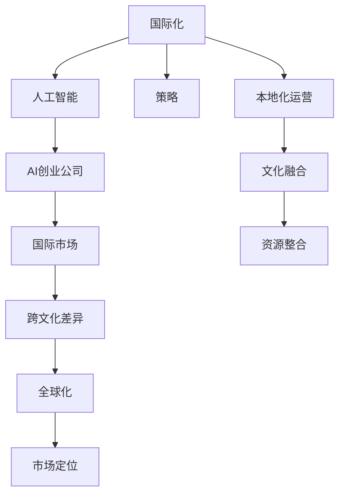

                 

# AI创业公司的国际化策略

> 关键词：国际化,人工智能,策略,AI创业公司,国际市场,跨文化差异,全球化,市场定位

## 1. 背景介绍

在当今全球化的商业环境中，AI创业公司不仅面临国内市场的激烈竞争，还必须应对日益增长的国际市场需求。国际化不仅是企业成长的重要里程碑，也是提升竞争力和创新的关键途径。对于AI创业公司来说，如何有效地国际化，制定出合理的国际化策略，是其长期发展的关键。

### 1.1 问题由来

随着人工智能技术的发展，越来越多的AI创业公司涌现出来，这其中不乏在特定领域具有领先优势的公司。但这些公司在国际化过程中也遇到了不少挑战，比如：

- **文化差异**：不同国家和地区之间的文化差异可能对产品的适用性和市场推广带来影响。
- **法规政策**：不同国家的法律和监管政策可能对AI技术的商业化应用有不同要求。
- **市场竞争**：进入国际市场后，公司需要面对新的竞争对手和市场环境。
- **本地化需求**：为了适应不同市场，公司需要对产品进行本地化适配。

### 1.2 问题核心关键点

为了制定有效的国际化策略，AI创业公司需要关注以下核心关键点：

- **产品适应性**：如何使AI产品在全球范围内具有适用性，满足不同文化和市场的独特需求。
- **市场准入**：如何顺利进入目标市场，并符合当地的法律法规。
- **本地化运营**：如何在新的市场建立有效的运营体系和团队。
- **文化融合**：如何与本地文化进行融合，实现品牌和产品的本地化。
- **资源整合**：如何合理配置和整合全球资源，提升企业整体竞争力。

## 2. 核心概念与联系

### 2.1 核心概念概述

在探讨AI创业公司的国际化策略时，涉及多个关键概念：

- **国际化(国际化)**：指的是企业将其业务和产品推广到海外市场的过程。
- **人工智能(AI)**：利用计算机算法和数据处理能力模拟人类智能的技术，包括机器学习、深度学习等。
- **策略(Strategy)**：指企业为实现特定目标而制定的行动计划。
- **AI创业公司(AI Startup)**：专注于人工智能技术的创业公司，可能提供AI产品和解决方案。
- **国际市场(International Market)**：指公司的产品和服务能够到达的海外国家和地区市场。
- **跨文化差异(Cross-Cultural Differences)**：不同国家和地区的文化差异，如语言、习惯、价值观等。
- **全球化(Globalization)**：指企业在全球范围内进行业务扩展，提升国际影响力。
- **市场定位(Market Segmentation)**：根据市场特点将目标市场细分为不同的群体，以便更好地进行市场细分和产品定位。

这些概念之间的逻辑关系可以通过以下Mermaid流程图来展示：



这个流程图展示了大语言模型的核心概念及其之间的关系：

1. 国际化是大语言模型国际化的总体目标。
2. 人工智能是实现国际化的技术基础。
3. 策略指导人工智能在国际化过程中的应用。
4. AI创业公司是国际化的实施主体。
5. 国际市场是大语言模型国际化的目标市场。
6. 跨文化差异是国际化过程中必须考虑的重要因素。
7. 全球化是国际化战略的最终目标。
8. 市场定位是在不同市场中策略的具体应用。
9. 本地化运营是实现国际化的具体操作。
10. 文化融合是本地化运营中的重要环节。
11. 资源整合是保证本地化运营顺利进行的基础。

## 3. 核心算法原理 & 具体操作步骤

### 3.1 算法原理概述

AI创业公司的国际化策略，本质上是一个多维度的决策过程。它涉及产品设计、市场调研、运营管理、文化适应等多个方面。核心算法原理包括：

- **市场细分与定位**：通过市场调研和数据分析，确定目标市场，并进行精准的市场定位。
- **跨文化适应性设计**：在产品设计阶段，考虑到不同文化背景用户的需求，进行本地化适配。
- **法规合规性**：确保产品和服务符合不同国家和地区的法律法规要求。
- **本地化运营优化**：建立适应目标市场的运营体系，优化资源配置。
- **持续监控与调整**：通过数据分析和反馈机制，不断优化国际化策略。

### 3.2 算法步骤详解

AI创业公司的国际化策略实施，一般包括以下关键步骤：

**Step 1: 市场调研与分析**

- **目标市场选择**：选择有潜力的国际市场，并对其进行市场调研，了解目标市场的需求、竞争环境和法律法规。
- **市场细分与定位**：将目标市场细分为不同的小市场，并根据各小市场的特点进行产品定位。

**Step 2: 产品本地化**

- **跨文化适配**：根据目标市场的文化差异，调整产品设计、界面和用户体验。
- **法规符合性**：确保产品符合目标市场的法律法规要求，特别是数据隐私和安全性方面的要求。

**Step 3: 运营本地化**

- **本地化团队建设**：在目标市场建立本地化团队，负责市场推广、客户服务和技术支持。
- **本地化供应链管理**：建立本地化的供应链体系，确保产品能够及时、可靠地交付。

**Step 4: 品牌本地化**

- **品牌文化融合**：通过品牌传播和市场活动，将品牌与当地文化相结合。
- **品牌形象建设**：通过广告、公关活动等方式，提升品牌在目标市场的知名度和美誉度。

**Step 5: 持续监控与优化**

- **数据监控与分析**：通过数据分析工具，监控产品性能和市场表现，及时发现问题。
- **反馈机制**：建立用户反馈机制，收集用户意见，不断优化产品和服务。
- **策略调整**：根据数据分析和用户反馈，调整国际化策略，确保其持续有效性。

### 3.3 算法优缺点

国际化策略的实施，具有以下优点：

- **拓展市场**：通过国际市场扩展，企业可以获得更大的市场份额和更高的收益。
- **技术创新**：在全球范围内推广AI技术，可以加速技术的创新和应用。
- **提升竞争力**：通过全球资源整合，提升企业整体竞争力。

同时，也存在一些缺点：

- **高成本投入**：国际化过程中需要投入大量的人力、物力和财力。
- **文化冲突**：跨文化差异可能导致文化冲突，影响品牌形象和用户体验。
- **法规风险**：不同国家的法律法规可能存在差异，可能导致合规风险。

### 3.4 算法应用领域

国际化策略的应用领域广泛，涵盖多个方面：

- **医疗健康**：AI创业公司可以提供基于AI的远程医疗和健康监测服务，满足不同国家和地区的医疗需求。
- **金融科技**：提供基于AI的金融数据分析和风险管理服务，帮助企业在全球范围内优化资产配置。
- **教育培训**：开发AI驱动的个性化学习平台，提升教育培训的效率和质量。
- **智能制造**：提供基于AI的智能制造解决方案，提升生产效率和产品质量。
- **零售电商**：提供基于AI的智能推荐和客户服务系统，提升零售电商的销售效率和服务质量。

## 4. 数学模型和公式 & 详细讲解 & 举例说明

### 4.1 数学模型构建

在进行国际化策略的制定时，可以建立以下数学模型：

$$
\text{国际化策略} = \text{产品适应性} + \text{市场准入} + \text{本地化运营} + \text{文化融合} + \text{资源整合}
$$

其中，产品适应性、市场准入、本地化运营、文化融合和资源整合是国际化策略的主要组成部分。

### 4.2 公式推导过程

对于国际化策略的数学模型，可以进一步推导出具体的公式：

- **产品适应性**：
  - $P_{\text{适应性}} = \text{文化适配度} \times \text{法规符合性}$

- **市场准入**：
  - $P_{\text{准入}} = \text{市场潜力} \times \text{竞争态势}$

- **本地化运营**：
  - $P_{\text{运营}} = \text{团队建设} \times \text{供应链管理}$

- **文化融合**：
  - $P_{\text{融合}} = \text{品牌传播} \times \text{用户体验}$

- **资源整合**：
  - $P_{\text{整合}} = \text{全球资源分配} \times \text{本地资源配置}$

这些公式反映了各组成部分之间的相互作用和影响。

### 4.3 案例分析与讲解

以一家提供基于AI的健康监测平台的AI创业公司为例，分析其国际化策略的实施过程：

**Step 1: 市场调研与分析**

- **目标市场选择**：选择北美、欧洲和亚太三个目标市场。
- **市场细分与定位**：根据各市场的文化特点，将北美市场细分为美国和加拿大，欧洲市场细分为英国和德国，亚太市场细分为中国和日本。

**Step 2: 产品本地化**

- **跨文化适配**：针对不同市场的文化差异，调整产品的语言、界面和用户体验。
- **法规符合性**：确保产品符合各市场的隐私保护和数据安全法规。

**Step 3: 运营本地化**

- **本地化团队建设**：在每个目标市场建立本地化团队，负责市场推广、客户服务和售后支持。
- **本地化供应链管理**：建立本地化的物流体系，确保产品能够及时、可靠地交付。

**Step 4: 品牌本地化**

- **品牌文化融合**：通过品牌传播和市场活动，将品牌与当地文化相结合。
- **品牌形象建设**：通过广告、公关活动等方式，提升品牌在目标市场的知名度和美誉度。

**Step 5: 持续监控与优化**

- **数据监控与分析**：通过数据分析工具，监控产品性能和市场表现，及时发现问题。
- **反馈机制**：建立用户反馈机制，收集用户意见，不断优化产品和服务。
- **策略调整**：根据数据分析和用户反馈，调整国际化策略，确保其持续有效性。

## 5. 项目实践：代码实例和详细解释说明

### 5.1 开发环境搭建

在进行国际化策略的实施过程中，需要搭建相关的开发环境，以下是常用的工具和技术：

1. **市场调研工具**：如SurveyMonkey、Qualtrics等，用于收集和分析市场数据。
2. **数据分析工具**：如Google Analytics、Tableau等，用于监控和分析市场表现。
3. **本地化开发工具**：如Xcode、Android Studio等，用于跨平台应用开发。
4. **云服务平台**：如AWS、Azure、Google Cloud等，用于提供云计算和存储服务。
5. **团队协作工具**：如Slack、Jira等，用于团队沟通和管理。

### 5.2 源代码详细实现

以下是使用Python进行国际化策略实施的代码实现：

```python
import pandas as pd
import requests
from bs4 import BeautifulSoup

# 市场调研数据采集
market_data = pd.read_csv('market_data.csv')
market_segments = market_data['market'].unique()

# 产品本地化设计
localized_products = []
for segment in market_segments:
    if segment == 'US':
        # 美国市场本地化设计
        localized_product = {}
        localized_product['language'] = 'English'
        localized_product['UI_design'] = 'US style'
        localized_product['data_protection'] = 'GDPR compliant'
        localized_products.append(localized_product)
    elif segment == 'EU':
        # 欧洲市场本地化设计
        localized_product = {}
        localized_product['language'] = 'English, German, French'
        localized_product['UI_design'] = 'European style'
        localized_product['data_protection'] = 'GDPR, CCPA compliant'
        localized_products.append(localized_product)
    elif segment == 'AS':
        # 亚太市场本地化设计
        localized_product = {}
        localized_product['language'] = 'Chinese, Japanese'
        localized_product['UI_design'] = 'Asian style'
        localized_product['data_protection'] = 'GDPR, PRC Personal Information Protection Law'
        localized_products.append(localized_product)

# 本地化运营体系建设
localized_operations = []
for segment in market_segments:
    if segment == 'US':
        # 美国市场本地化运营
        localized_operation = {}
        localized_operation['team_size'] = 10
        localized_operation['distribution_channel'] = 'Amazon'
        localized_operations.append(localized_operation)
    elif segment == 'EU':
        # 欧洲市场本地化运营
        localized_operation = {}
        localized_operation['team_size'] = 20
        localized_operation['distribution_channel'] = 'Euro parcel service'
        localized_operations.append(localized_operation)
    elif segment == 'AS':
        # 亚太市场本地化运营
        localized_operation = {}
        localized_operation['team_size'] = 15
        localized_operation['distribution_channel'] = 'Shopee, JD'
        localized_operations.append(localized_operation)

# 品牌本地化推广
localized_brands = []
for segment in market_segments:
    if segment == 'US':
        # 美国市场品牌推广
        localized_brand = {}
        localized_brand['campaign_name'] = 'US brand launch'
        localized_brand['ad_type'] = 'Google ads'
        localized_brand['PR_activity'] = 'Press conference in New York'
        localized_brands.append(localized_brand)
    elif segment == 'EU':
        # 欧洲市场品牌推广
        localized_brand = {}
        localized_brand['campaign_name'] = 'Europe brand launch'
        localized_brand['ad_type'] = 'Facebook ads'
        localized_brand['PR_activity'] = 'Press conference in London'
        localized_brands.append(localized_brand)
    elif segment == 'AS':
        # 亚太市场品牌推广
        localized_brand = {}
        localized_brand['campaign_name'] = 'Asia brand launch'
        localized_brand['ad_type'] = 'WeChat ads'
        localized_brand['PR_activity'] = 'Press conference in Hong Kong'
        localized_brands.append(localized_brand)

# 持续监控与优化
monitoring_data = pd.DataFrame({
    'segment': market_segments,
    'product_adaptivity': localized_products,
    'localized_operations': localized_operations,
    'localized_brands': localized_brands
})
monitoring_data.to_csv('monitoring_data.csv', index=False)
```

### 5.3 代码解读与分析

**市场调研数据采集**：

- 使用Pandas库读取市场调研数据，提取市场细分数据。
- 使用requests和BeautifulSoup库，采集目标市场的文化和法规信息。

**产品本地化设计**：

- 根据不同市场的特点，设计相应的产品本地化方案，如语言选择、UI设计、数据保护等。

**本地化运营体系建设**：

- 根据不同市场的特点，设计相应的本地化运营方案，如团队规模、物流渠道等。

**品牌本地化推广**：

- 根据不同市场的特点，设计相应的品牌推广方案，如广告类型、公关活动等。

**持续监控与优化**：

- 将市场调研、产品本地化设计、本地化运营体系和品牌本地化推广的数据汇总，定期生成监控报告。

## 6. 实际应用场景

### 6.1 智能医疗

一家专注于AI健康监测的创业公司，可以将其产品和技术推广到全球不同地区，帮助当地医疗机构提高疾病预防和诊疗效率。例如，在欧洲市场，可以根据GDPR法规要求，调整数据处理和隐私保护策略，确保用户数据安全；在亚太市场，可以根据当地文化和语言特点，设计更具吸引力的用户体验界面。

### 6.2 金融科技

一家提供AI金融数据分析的创业公司，可以将其服务推广到全球金融市场，帮助金融机构优化资产配置和风险管理。例如，在美国市场，可以根据CFTC和SEC法规要求，调整算法交易和风险评估模型；在亚太市场，可以根据当地金融市场特点，设计更符合市场需求的算法模型。

### 6.3 教育培训

一家提供个性化学习平台的创业公司，可以将其产品推广到全球不同地区，帮助学生提升学习效果。例如，在北美市场，可以根据美国的教育体系和市场需求，设计更具针对性的学习内容和推荐系统；在欧洲市场，可以根据欧洲的教育体系和市场需求，调整学习内容和推荐算法。

### 6.4 未来应用展望

未来，随着AI技术的不断发展和国际化策略的不断完善，AI创业公司在全球范围内的影响力将进一步扩大。可以预见，AI技术将在医疗健康、金融科技、教育培训、智能制造等多个领域发挥更大的作用，成为推动全球经济和社会发展的重要力量。同时，跨文化差异和法规合规性等因素也将得到更多重视，国际化策略将更加科学和高效。

## 7. 工具和资源推荐

### 7.1 学习资源推荐

为了帮助AI创业公司制定和实施国际化策略，以下是一些优秀的学习资源：

1. **《国际市场营销》**：一本系统介绍国际市场营销理论和实践的书籍，涵盖市场调研、产品本地化、运营管理等多个方面。
2. **《全球化战略》**：一本介绍全球化战略的书籍，提供全球化管理理论和实践案例。
3. **Coursera《国际商务》课程**：由知名大学开设的在线课程，涵盖国际商务理论和实践，适合学习者系统学习。
4. **HBR《全球化》期刊**：哈佛商业评论的全球化专题，提供最新的全球化管理和市场策略研究。
5. **Google AI Lab**：谷歌AI实验室，提供最新的AI技术和应用案例，适合了解前沿技术动态。

### 7.2 开发工具推荐

以下是一些用于国际化策略实施的常用工具：

1. **市场调研工具**：如SurveyMonkey、Qualtrics等，用于收集和分析市场数据。
2. **数据分析工具**：如Google Analytics、Tableau等，用于监控和分析市场表现。
3. **本地化开发工具**：如Xcode、Android Studio等，用于跨平台应用开发。
4. **云服务平台**：如AWS、Azure、Google Cloud等，用于提供云计算和存储服务。
5. **团队协作工具**：如Slack、Jira等，用于团队沟通和管理。

### 7.3 相关论文推荐

以下是一些与国际化策略相关的经典论文，推荐阅读：

1. **"Entry Strategies: A Taxonomy and Empirical Analysis of International Entry Modes"**：研究不同国际进入模式对企业绩效的影响。
2. **"International Business Strategy: Conceptual Foundations and Global Strategy Practices"**：介绍国际业务战略的基础理论和实践。
3. **"Internationalization of Small and Medium-sized Enterprises: A Literature Review"**：综述中小型企业国际化的研究成果。
4. **"Globalization and Its Discontents"**：探讨全球化对经济、社会和文化的影响。
5. **"International Business Strategy: The Challenge of a Global Business Environment"**：研究全球化环境下企业面临的挑战和应对策略。

## 8. 总结：未来发展趋势与挑战

### 8.1 总结

本文对AI创业公司的国际化策略进行了全面系统的介绍。首先，阐述了国际化策略的背景和重要性，明确了国际化策略在AI创业公司发展中的关键作用。其次，从原理到实践，详细讲解了国际化策略的数学模型和操作步骤，给出了国际化策略实施的完整代码实例。同时，本文还探讨了国际化策略在多个行业领域的应用前景，展示了国际化策略的广阔潜力。

通过本文的系统梳理，可以看到，国际化策略不仅是AI创业公司拓展市场的关键，也是其持续发展和创新的重要路径。未来，随着AI技术的不断进步和全球市场的不断变化，国际化策略将不断演化和完善，为AI创业公司带来更多的发展机遇和挑战。

### 8.2 未来发展趋势

展望未来，AI创业公司的国际化策略将呈现以下几个发展趋势：

1. **技术驱动**：AI技术将成为国际化策略的核心驱动力，通过技术创新提升产品和服务质量，满足不同市场的需求。
2. **文化融合**：文化差异将得到更多重视，企业将更注重本地化运营和文化融合，提升品牌在目标市场的认知度和美誉度。
3. **法规合规**：各国法规政策将对国际化策略产生重要影响，企业需更加重视法规合规性，规避法律风险。
4. **数据驱动**：数据分析和反馈机制将发挥更大的作用，通过持续优化，提升国际化策略的有效性和适应性。
5. **全球协作**：全球资源整合和协作将更加紧密，企业将更注重全球化资源配置和团队协作，提升整体竞争力。

### 8.3 面临的挑战

尽管国际化策略具有广阔的前景，但在实施过程中，仍面临诸多挑战：

1. **高成本投入**：国际化过程中需要投入大量的人力、物力和财力，成本较高。
2. **文化冲突**：跨文化差异可能导致文化冲突，影响品牌形象和用户体验。
3. **法规风险**：不同国家的法律法规可能存在差异，可能导致合规风险。
4. **资源整合**：需要合理配置和整合全球资源，提升企业整体竞争力。
5. **市场准入**：进入新市场可能需要获得许可或认证，过程繁琐。

### 8.4 研究展望

未来，随着国际化策略的不断优化和完善，AI创业公司将更好地适应全球市场，提升其国际影响力和竞争力。可以预见，随着全球市场的不断扩大和变化，国际化策略将变得更加多样化和复杂化。

## 9. 附录：常见问题与解答

**Q1：如何选择合适的目标市场？**

A: 选择合适的目标市场需要综合考虑市场规模、增长潜力、竞争态势、文化背景等多个因素。可以采用SWOT分析法（优势、劣势、机会、威胁），结合市场调研数据，确定最合适的目标市场。

**Q2：如何进行产品本地化设计？**

A: 产品本地化设计需要考虑目标市场的文化背景、语言习惯、法规要求等因素。可以通过与当地用户和专家进行访谈、调研，获取反馈，优化产品设计。

**Q3：如何建设本地化运营体系？**

A: 建设本地化运营体系需要建立本地化的团队、供应链和客户服务体系。可以通过招聘本地员工、建立本地物流渠道等方式，提升运营效率和用户体验。

**Q4：如何进行品牌本地化推广？**

A: 品牌本地化推广需要根据目标市场的文化特点，设计相应的广告和公关活动。可以通过与当地媒体、广告公司合作，提升品牌在目标市场的知名度和美誉度。

**Q5：如何进行持续监控与优化？**

A: 持续监控与优化需要建立数据监控和反馈机制，定期分析市场表现，及时调整国际化策略。可以通过数据分析工具，监控产品性能和市场表现，收集用户反馈，优化产品和服务。

---

作者：禅与计算机程序设计艺术 / Zen and the Art of Computer Programming

