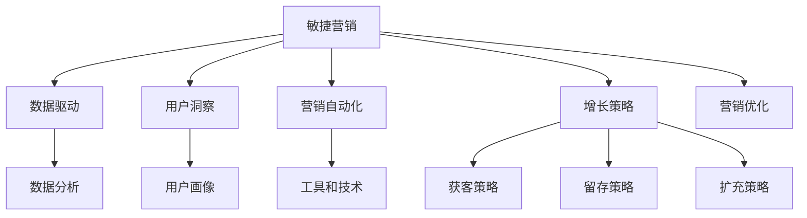

                 

# AI创业公司的敏捷营销策略

> 关键词：AI创业公司, 敏捷营销, 数据驱动, 用户洞察, 营销自动化, 增长策略, 营销优化

## 1. 背景介绍

### 1.1 问题由来
随着人工智能(AI)技术的迅猛发展，AI创业公司如雨后春笋般涌现，应用领域从金融、医疗到零售、娱乐，几乎覆盖了所有行业。然而，AI公司如何在大数据、算法、技术和市场环境复杂的今天，有效地进行营销活动，成为了一个重要且现实的问题。

传统的营销策略往往依赖于直觉和经验，缺乏科学依据，难以精准定位目标用户、快速响应市场变化。而敏捷营销则以数据驱动、用户洞察为核心，通过科学的方法和工具，实现营销活动的快速迭代和优化，极大地提升营销效果和ROI。

本文旨在介绍敏捷营销的概念、核心技术和实际操作流程，帮助AI创业公司掌握敏捷营销策略，提升市场竞争力。

## 2. 核心概念与联系

### 2.1 核心概念概述

为更好地理解敏捷营销，本节将介绍几个关键概念：

- **敏捷营销(Agile Marketing)**：一种基于数据驱动、用户洞察和迭代优化的营销模式。旨在快速响应市场变化，提高营销活动的效率和效果。

- **数据驱动(Leaveraged Data-Driven)**：利用数据来指导决策，通过数据分析和挖掘，优化营销策略和活动。

- **用户洞察(User Insight)**：深入理解目标用户的行为、需求和偏好，从而精准定位和满足用户需求。

- **营销自动化(Marketing Automation)**：通过自动化工具和技术，实现营销活动的自动化和规模化，提升效率。

- **增长策略(Growth Strategy)**：针对企业或产品发展的不同阶段，制定相应的增长策略，如获客、留存、扩充等。

- **营销优化(Optimization)**：通过数据分析和模型训练，持续优化营销策略和活动，实现最大化ROI。

这些核心概念之间的逻辑关系可以通过以下Mermaid流程图来展示：



这个流程图展示了一个典型的敏捷营销系统，其中：

- 数据驱动和用户洞察为敏捷营销提供基础，使营销策略更加精准和科学。
- 营销自动化提供技术支持，使得营销活动规模化和高效化。
- 增长策略指导营销活动的总体方向，包括如何获取新客户、留住现有客户、扩大市场份额等。
- 营销优化则持续改进营销活动，确保其最大化产出。

这些概念共同构成了敏捷营销的核心框架，为AI创业公司提供了一种有效的营销方法论。

## 3. 核心算法原理 & 具体操作步骤
### 3.1 算法原理概述

敏捷营销的核心理论可以简单概括为“数据驱动+迭代优化”，即通过数据和用户洞察来制定营销策略，并通过迭代优化来不断改进和提升营销效果。

具体而言，敏捷营销包括以下几个步骤：

1. **数据采集**：收集用户行为数据、市场数据和竞争数据。
2. **数据分析**：利用机器学习和统计分析方法，挖掘数据中的有价值信息。
3. **用户洞察**：通过数据分析，形成深入的用户画像和需求洞察。
4. **策略制定**：基于用户洞察和数据分析结果，制定精准的营销策略。
5. **营销自动化**：利用自动化工具和技术，实现策略的规模化实施。
6. **效果评估**：通过A/B测试等方法，持续评估营销活动的效果，进行优化调整。

### 3.2 算法步骤详解

敏捷营销的具体操作步骤如下：

**Step 1: 数据采集**
- 使用Google Analytics、Mixpanel等工具，收集用户行为数据，如点击率、停留时间、转化率等。
- 通过SurveyMonkey、UserVoice等平台，获取用户反馈和需求。
- 利用SEO工具如Ahrefs、SEMrush，收集竞争对手和市场数据。

**Step 2: 数据分析**
- 使用Python、R等编程语言，结合Pandas、NumPy等库，进行数据清洗和预处理。
- 利用Scikit-Learn、TensorFlow等机器学习框架，进行模型训练和预测。
- 通过Tableau、Power BI等数据可视化工具，形成数据洞察。

**Step 3: 用户洞察**
- 根据分析结果，使用用户行为数据、市场数据和反馈数据，构建用户画像，如用户年龄、性别、兴趣等。
- 利用聚类算法，如K-means、DBSCAN，将用户分为不同的群体。
- 使用情感分析技术，如TextBlob、NLTK，分析用户对产品或服务的情感倾向。

**Step 4: 策略制定**
- 根据用户画像和需求洞察，制定针对不同用户群体的营销策略，如邮件营销、社交媒体广告、内容营销等。
- 使用A/B测试，评估不同策略的效果，选择最优方案。

**Step 5: 营销自动化**
- 使用Marketo、HubSpot等营销自动化工具，实现营销活动的自动化和规模化。
- 利用Chrome Extension、Email Marketing Tools等工具，实现广告投放和邮件发送的自动化。

**Step 6: 效果评估**
- 使用Google Analytics、Mixpanel等工具，实时监控营销活动的效果。
- 通过A/B测试和随机抽样，评估不同策略的效果，并进行优化调整。

### 3.3 算法优缺点

敏捷营销的优势在于：

- **高效灵活**：快速响应市场变化，灵活调整策略。
- **数据驱动**：基于数据和用户洞察，制定精准的营销策略。
- **规模化实施**：利用自动化工具和技术，实现规模化营销。

同时，敏捷营销也存在一些局限：

- **数据依赖**：需要大量高质量的数据，获取成本较高。
- **技术门槛**：涉及数据分析、机器学习等多个领域，需要跨学科知识。
- **效果评估**：评估策略效果需要时间，难以短期内看到显著提升。

尽管如此，敏捷营销仍是一种高效、科学的营销方法，尤其适用于AI创业公司这种创新性强、市场变化快的企业。

### 3.4 算法应用领域

敏捷营销不仅适用于传统的消费品行业，在AI创业公司也具有广泛的应用前景：

- **产品推荐**：利用用户行为数据和分析结果，推荐个性化产品。
- **用户增长**：通过数据分析，优化获客策略，提升用户留存率。
- **市场分析**：利用市场和竞争数据，制定竞争策略，拓展市场份额。
- **客户支持**：通过用户反馈和情感分析，提供更优质的客户支持。
- **内容营销**：基于用户需求和洞察，创建有价值的内容，提升品牌影响力。

这些应用场景展示了敏捷营销的广泛适用性，无论在用户画像、数据分析还是策略制定上，都能有效提升AI创业公司的市场表现。

## 4. 数学模型和公式 & 详细讲解 & 举例说明

### 4.1 数学模型构建

敏捷营销的数学模型通常涉及以下几个方面：

- **用户画像模型**：使用K-means等聚类算法，对用户行为数据进行分组，形成用户画像。
- **情感分析模型**：使用情感词典或深度学习模型，分析用户对产品或服务的情感倾向。
- **预测模型**：使用线性回归、决策树等模型，预测用户行为和市场趋势。

### 4.2 公式推导过程

以用户画像模型为例，K-means算法的公式推导如下：

设用户行为数据为 $X$，目标为将 $X$ 分为 $K$ 个类别，即 $X \in \mathbb{R}^{n \times d}$，其中 $n$ 为样本数量，$d$ 为特征维度。

K-means算法通过以下步骤实现：
1. 随机选择 $K$ 个初始聚类中心 $\mu_1, \mu_2, ..., \mu_K$。
2. 对于每个样本 $x_i \in X$，计算其到每个聚类中心的距离 $d(x_i, \mu_k)$。
3. 将样本 $x_i$ 分配到距离最近的聚类中心 $\mu_k$ 所在的类别。
4. 重新计算每个聚类的质心 $\mu_k$。
5. 重复步骤2和4，直到聚类中心不再改变。

公式如下：

$$
\mu_k = \frac{1}{|C_k|}\sum_{x_i \in C_k} x_i
$$

其中 $C_k$ 为聚类 $k$ 的样本集合，$|C_k|$ 为该聚类的大小。

### 4.3 案例分析与讲解

假设某AI创业公司收集了用户在产品使用过程中的行为数据，包括点击率、停留时间、转化率等。通过K-means算法，将用户分为三个不同的群体：活跃用户、中等用户、不活跃用户。

- 活跃用户：点击率高、停留时间长、转化率高。
- 中等用户：点击率中等、停留时间中等、转化率中等。
- 不活跃用户：点击率低、停留时间短、转化率低。

根据用户画像，公司可以针对不同群体制定差异化的营销策略，如为活跃用户提供专属优惠，吸引中等用户进行进一步互动，提升不活跃用户的参与度。

## 5. 项目实践：代码实例和详细解释说明

### 5.1 开发环境搭建

在进行敏捷营销实践前，我们需要准备好开发环境。以下是使用Python进行数据分析和模型训练的环境配置流程：

1. 安装Anaconda：从官网下载并安装Anaconda，用于创建独立的Python环境。

2. 创建并激活虚拟环境：
```bash
conda create -n analytics-env python=3.8 
conda activate analytics-env
```

3. 安装Python数据科学库：
```bash
conda install pandas numpy matplotlib seaborn scikit-learn tensorflow pytorch torchvision
```

4. 安装机器学习库和工具：
```bash
conda install xgboost lightgbm catboost scikit-optimize optuna
```

5. 安装数据分析和可视化工具：
```bash
conda install statsmodels statsmodels-anova xlabel
```

完成上述步骤后，即可在`analytics-env`环境中开始数据分析和模型训练。

### 5.2 源代码详细实现

以下是使用Python进行用户画像分群的代码实现：

```python
import pandas as pd
from sklearn.cluster import KMeans
import matplotlib.pyplot as plt

# 加载用户行为数据
df = pd.read_csv('user_behavior.csv')

# 提取特征
X = df[['click_rate', 'stay_time', 'conversion_rate']]

# 使用K-means进行聚类
kmeans = KMeans(n_clusters=3, random_state=42)
kmeans.fit(X)

# 获取聚类标签
labels = kmeans.labels_

# 可视化聚类结果
plt.scatter(X['click_rate'], X['stay_time'], c=labels, cmap='viridis')
plt.xlabel('Click Rate')
plt.ylabel('Stay Time')
plt.title('User Behavior Clustering')
plt.show()
```

上述代码使用了Pandas库进行数据加载和处理，使用Scikit-Learn库的KMeans算法进行聚类，并使用Matplotlib库进行可视化展示。

### 5.3 代码解读与分析

**用户行为数据**：
- `user_behavior.csv` 文件包含用户点击率、停留时间和转化率等数据。

**特征提取**：
- 将用户行为数据中的点击率、停留时间和转化率作为特征，分别命名为 `click_rate`、`stay_time` 和 `conversion_rate`。

**K-means聚类**：
- 使用KMeans算法，将用户分为三个不同的群体，并获取对应的聚类标签。

**可视化展示**：
- 通过Matplotlib库，将用户行为数据可视化展示，帮助理解不同群体的特征和分布。

通过这段代码，可以初步实现用户画像的聚类分析，为后续的策略制定提供数据基础。

## 6. 实际应用场景

### 6.1 用户增长策略

敏捷营销在用户增长策略中的应用非常广泛。以某AI创业公司为例，通过数据分析，发现新用户的留存率较低，需要进行改进。

具体而言，可以从以下几个方面入手：

1. **渠道优化**：利用数据挖掘，找到效果最好的用户获取渠道，进行优化。
2. **内容营销**：根据用户画像，创建有价值的内容，吸引新用户。
3. **邮件营销**：通过用户行为数据，定制邮件内容，提高邮件打开率和点击率。
4. **个性化推荐**：根据用户行为和偏好，推荐个性化产品或服务，提升用户体验。

### 6.2 市场分析

敏捷营销在市场分析中的应用同样重要。假设某AI创业公司需要评估产品在多个市场的表现，可以通过以下步骤：

1. **市场调研**：收集不同市场的用户数据，包括点击率、停留时间、转化率等。
2. **数据分析**：利用机器学习模型，分析市场趋势和用户行为。
3. **竞争分析**：利用竞争对手数据，评估市场份额和竞争优势。
4. **市场策略**：根据分析结果，制定市场进入和扩展策略。

### 6.3 客户支持

敏捷营销在客户支持中的应用也十分显著。例如，某AI创业公司可以收集用户反馈和问题，进行情感分析，优化产品和服务。

具体而言，可以从以下几个方面入手：

1. **情感分析**：利用NLP技术，分析用户对产品的情感倾向。
2. **问题识别**：通过情感分析结果，识别用户最常见的问题和痛点。
3. **解决方案**：根据问题，提供有针对性的解决方案，提升用户满意度。
4. **反馈循环**：建立反馈机制，持续改进产品和服务。

## 7. 工具和资源推荐

### 7.1 学习资源推荐

为了帮助开发者系统掌握敏捷营销的理论基础和实践技巧，这里推荐一些优质的学习资源：

1. **《敏捷营销实战》**：由营销专家撰写，深入浅出地介绍了敏捷营销的核心概念、工具和技术。
2. **Coursera《数据驱动的营销》课程**：由密歇根大学开设的在线课程，涵盖数据分析、用户洞察和策略制定等关键内容。
3. **Kaggle竞赛平台**：提供大量数据分析和机器学习竞赛，帮助用户提升实战技能。
4. **Google Analytics Academy**：由Google提供的免费课程，介绍数据分析和用户洞察的实战技巧。

通过对这些资源的学习实践，相信你一定能够快速掌握敏捷营销的精髓，并用于解决实际的营销问题。

### 7.2 开发工具推荐

高效的开发离不开优秀的工具支持。以下是几款用于敏捷营销开发的常用工具：

1. **Tableau**：数据可视化工具，支持拖拽式操作，快速生成数据报告和图表。
2. **Google Analytics**：网站和应用的数据分析工具，提供用户行为数据的详细分析。
3. **Mixpanel**：用户行为分析平台，支持A/B测试和用户分组，提高营销活动的精准度。
4. **HubSpot**：营销自动化工具，支持CRM、邮件营销、广告投放等功能的整合。
5. **Marketo**：市场营销自动化平台，提供多渠道整合、营销活动管理和效果评估。

合理利用这些工具，可以显著提升敏捷营销任务的开发效率，加快创新迭代的步伐。

### 7.3 相关论文推荐

敏捷营销的研究涉及多个领域，以下是几篇奠基性的相关论文，推荐阅读：

1. **《数据驱动的营销策略》**：介绍如何使用数据科学方法，提升营销活动的精准度和效果。
2. **《用户行为分析：方法与技术》**：探讨用户行为分析的核心方法和工具，帮助理解用户需求和行为模式。
3. **《基于机器学习的市场预测》**：研究如何使用机器学习模型，预测市场趋势和用户行为。
4. **《敏捷营销框架》**：提出敏捷营销的体系框架，涵盖数据驱动、用户洞察和迭代优化等关键环节。

这些论文代表了大数据营销的发展脉络，通过学习这些前沿成果，可以帮助研究者把握学科前进方向，激发更多的创新灵感。

## 8. 总结：未来发展趋势与挑战

### 8.1 总结

本文对敏捷营销的概念、核心技术和实际操作流程进行了全面系统的介绍。首先介绍了敏捷营销的背景和意义，明确了敏捷营销在提升AI创业公司市场竞争力方面的独特价值。其次，从原理到实践，详细讲解了敏捷营销的数学模型和关键步骤，给出了具体代码实例和详细解读。同时，本文还广泛探讨了敏捷营销在用户增长、市场分析和客户支持等多个领域的应用场景，展示了敏捷营销的广泛适用性。此外，本文精选了敏捷营销的学习资源、开发工具和相关论文，力求为读者提供全方位的技术指引。

通过本文的系统梳理，可以看到，敏捷营销是一种高效、科学的营销方法，尤其适用于AI创业公司这种创新性强、市场变化快的企业。其以数据驱动和用户洞察为核心，通过科学的方法和工具，实现营销活动的快速迭代和优化，极大地提升营销效果和ROI。未来，伴随数据科学和人工智能技术的不断进步，敏捷营销必将在更多领域得到应用，为企业的市场竞争和业务增长提供更强大的支持。

### 8.2 未来发展趋势

展望未来，敏捷营销的发展趋势如下：

1. **AI技术的应用**：随着AI技术的不断进步，AI驱动的敏捷营销将成为常态。如使用自然语言处理技术，自动化分析用户反馈和情感，提高营销活动的精准度。
2. **多渠道整合**：未来的营销活动将更多地整合多渠道数据，实现全渠道的用户洞察和策略优化。
3. **个性化推荐**：基于用户行为和偏好的个性化推荐，将成为提升用户体验的重要手段。
4. **实时分析**：利用实时数据流，进行动态分析和调整，提升营销活动的实时响应能力。
5. **隐私保护**：随着数据隐私保护的法规越来越严格，如何在保护用户隐私的前提下进行数据驱动营销，将是一个重要课题。

以上趋势凸显了敏捷营销的广阔前景，这些方向的探索发展，必将进一步提升营销活动的效果和效率，为AI创业公司带来更多的商业机会。

### 8.3 面临的挑战

尽管敏捷营销在诸多领域取得了显著成效，但仍面临一些挑战：

1. **数据获取难度**：获取高质量的数据是一个重要难题，尤其是对于数据量较小的领域。如何低成本高效地获取所需数据，是一个挑战。
2. **技术门槛高**：敏捷营销涉及数据分析、机器学习等多个领域，需要跨学科知识，对技术要求较高。
3. **策略实施复杂**：敏捷营销需要持续优化和调整策略，操作复杂度较高。
4. **效果评估困难**：评估营销活动的效果需要时间，难以短期内看到显著提升。
5. **隐私和伦理问题**：如何在保护用户隐私的前提下进行数据驱动营销，是一个重要课题。

尽管如此，敏捷营销仍是一种高效、科学的营销方法，尤其适用于AI创业公司这种创新性强、市场变化快的企业。

### 8.4 研究展望

面对敏捷营销面临的挑战，未来的研究需要在以下几个方面寻求新的突破：

1. **自动化工具的开发**：开发更加智能、易用的自动化工具，降低技术门槛，提高工作效率。
2. **数据共享和整合**：推动不同渠道和平台的数据共享和整合，提高数据获取的效率和质量。
3. **实时分析方法**：研究高效的实时数据分析方法，提高营销活动的实时响应能力。
4. **用户隐私保护**：研究如何在保护用户隐私的前提下，进行数据驱动的营销活动。
5. **多学科融合**：将数据科学、人工智能、心理学、经济学等多学科知识进行融合，提升营销活动的效果。

这些研究方向的探索，必将引领敏捷营销技术迈向更高的台阶，为AI创业公司带来更多的商业机会。面向未来，敏捷营销需要与其他人工智能技术进行更深入的融合，共同推动市场竞争和业务增长的持续优化。

## 9. 附录：常见问题与解答

**Q1: 敏捷营销和传统营销有何不同？**

A: 敏捷营销与传统营销的最大不同在于其数据驱动、用户洞察和迭代优化的核心思想。传统营销依赖直觉和经验，缺乏科学依据；而敏捷营销通过数据分析和用户洞察，制定精准的营销策略，并通过迭代优化不断改进，从而提升营销效果。

**Q2: 敏捷营销是否适用于所有行业？**

A: 敏捷营销在数据驱动、用户洞察和迭代优化的思想下，适用于几乎所有行业。但在具体实施时，需要根据不同行业的特点进行适当调整。例如，金融行业需要更多的合规性和风险控制，而零售行业则更注重个性化推荐和用户增长。

**Q3: 如何获取高质量的数据？**

A: 高质量的数据是敏捷营销的关键。获取高质量数据的方法包括：
1. 利用现有市场数据和公共数据集。
2. 自行设计问卷调查，获取用户反馈。
3. 通过数据合作和数据共享平台，获取更多数据。
4. 利用爬虫技术，从互联网获取公开数据。
5. 合作第三方数据提供商，获取更多数据。

**Q4: 如何评估敏捷营销的效果？**

A: 评估敏捷营销效果的方法包括：
1. 利用A/B测试，对比不同策略的效果。
2. 利用统计分析，评估营销活动的ROI。
3. 利用用户行为数据，进行用户满意度调查。
4. 利用市场数据分析，评估市场份额和增长率。
5. 利用情感分析，评估用户情感倾向。

**Q5: 如何保护用户隐私？**

A: 保护用户隐私的方法包括：
1. 遵循数据隐私保护法规，如GDPR、CCPA等。
2. 使用匿名化和去标识化技术，保护用户数据。
3. 定期进行数据安全审计，防范数据泄露风险。
4. 告知用户数据使用目的，获取用户同意。
5. 建立数据共享协议，明确数据使用权责。

通过这些措施，可以在保护用户隐私的前提下，进行高效的数据驱动营销。

---

作者：禅与计算机程序设计艺术 / Zen and the Art of Computer Programming

