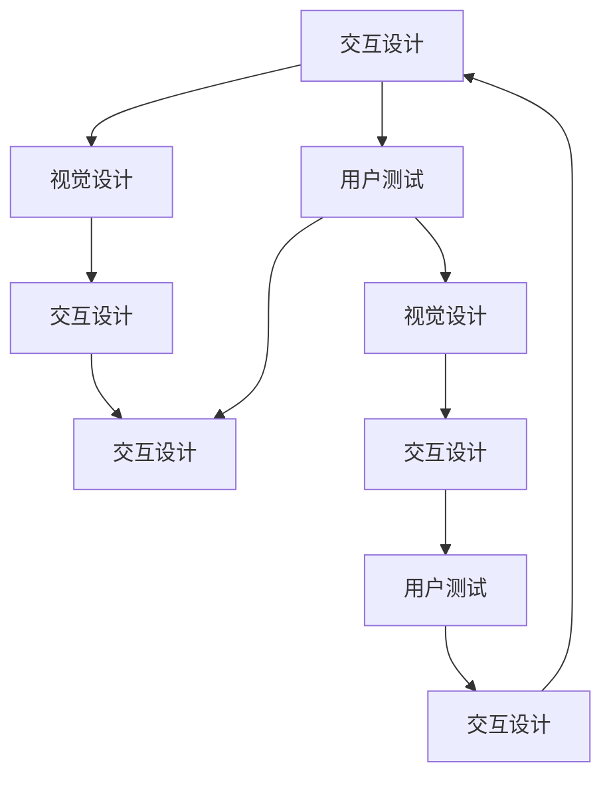

                 

# AI创业公司的用户体验优化：交互设计、视觉设计与用户测试

## 1. 背景介绍

随着人工智能技术的不断进步，AI创业公司如雨后春笋般涌现。但相比传统产品，AI产品的用户体验更加复杂多变，挑战也更为严峻。

### 1.1 问题由来

越来越多的AI产品通过深度学习和自然语言处理等技术，为用户提供个性化、智能化的服务。但这些产品往往缺乏人机交互的设计思路，导致用户体验不理想。AI创业公司如何设计出易用、高效、人性化的用户界面，是亟需解决的问题。

### 1.2 问题核心关键点

当前用户体验设计的核心在于交互设计、视觉设计和用户测试三者的有机结合。以用户为中心，通过交互设计引导用户自然顺畅地与AI产品互动，通过视觉设计传递出清晰的意图和情感，通过用户测试验证产品设计的有效性。

## 2. 核心概念与联系

### 2.1 核心概念概述

为了更好理解用户体验优化的技术要点，我们将介绍以下几个核心概念：

- **交互设计**：指设计系统与用户交互的方式，包括按钮、表单、菜单等控件的选择与布局，以及响应流程的设计。
- **视觉设计**：通过布局、颜色、字体等元素，传递产品的意图和情感，增强用户的使用体验。
- **用户测试**：通过实际用户的使用情况，评估产品的易用性和可靠性，指导产品迭代优化。

这三大设计环节相互支撑、相互反馈，共同构建出优质的用户体验。

### 2.2 核心概念原理和架构的 Mermaid 流程图



## 3. 核心算法原理 & 具体操作步骤
### 3.1 算法原理概述

用户体验优化的核心在于通过互动设计、视觉设计和用户测试三个环节，不断迭代产品设计，提升用户体验。主要算法流程包括：

1. 交互设计：选择适当的交互元素和布局，实现人机互动。
2. 视觉设计：设计简洁直观的界面布局，传递明确的产品意图。
3. 用户测试：评估界面易用性和用户反馈，指导产品改进。

### 3.2 算法步骤详解

**Step 1: 交互设计**

1. **用户调研**：通过问卷调查、用户访谈等方式，了解目标用户的使用场景、需求和痛点。
2. **原型设计**：根据调研结果，设计初步的交互原型，包括页面布局、按钮放置、菜单导航等。
3. **原型评审**：通过团队内评审，讨论设计的合理性和可用性。
4. **用户测试**：设计不同版本的原型，交由用户测试，收集反馈。

**Step 2: 视觉设计**

1. **风格设定**：根据品牌定位，设定视觉风格，包括字体、颜色、图标等元素。
2. **界面布局**：基于交互设计，设计界面布局，确保信息清晰、对称。
3. **视觉元素设计**：包括颜色搭配、字体选择、图标设计等，增强界面的吸引力和易用性。
4. **设计规范**：制定统一的视觉规范，保证产品各版本风格一致。

**Step 3: 用户测试**

1. **任务场景设计**：根据产品功能，设计具体的用户任务场景。
2. **任务流程模拟**：使用真实用户，模拟操作产品，记录行为数据。
3. **数据分析**：通过数据分析，评估用户完成任务的时间、错误率和满意度。
4. **迭代优化**：根据测试结果，进行产品优化，不断迭代设计。

### 3.3 算法优缺点

交互设计、视觉设计和用户测试的优点包括：
1. 提升用户体验：通过用户调研和测试，了解用户真实需求，设计出更加人性化的界面。
2. 降低用户门槛：通过合理的交互设计和视觉设计，简化操作流程，降低用户使用难度。
3. 提升产品竞争力：良好的用户体验是产品差异化的重要因素，能够增强用户粘性和口碑。

缺点主要包括：
1. 设计成本高：特别是初期阶段，需要通过大量调研和测试，耗费时间和资源。
2. 设计周期长：用户测试结果需要反馈迭代，增加了产品开发的周期。
3. 存在主观性：用户测试结果受个体差异影响，难以泛化推广。

### 3.4 算法应用领域

交互设计、视觉设计和用户测试广泛应用于各种AI创业公司的产品开发中，包括但不限于：

- **智能客服系统**：通过交互设计和视觉设计，引导用户输入问题，提供智能回复。
- **智能推荐系统**：通过交互设计实现个性化推荐，用户界面直观、易用。
- **智能健身设备**：通过交互设计实现健康数据监测，用户界面友好、易于操作。
- **智能家居系统**：通过交互设计实现设备控制，视觉设计符合家庭环境，增强用户粘性。
- **智能教育平台**：通过交互设计实现个性化学习，视觉设计体现教育氛围，提升用户学习体验。

## 4. 数学模型和公式 & 详细讲解 & 举例说明

### 4.1 数学模型构建

用户体验优化的核心在于设计合适的交互元素和视觉元素，并通过用户测试反馈进行迭代优化。我们可以通过数学模型来量化用户体验的多个维度，包括易用性、效率、满意度等。

假设用户体验可以分为多个维度 $U_1, U_2, ..., U_n$，每个维度上的得分分别为 $S_{u1}, S_{u2}, ..., S_{un}$。我们可以使用加权平均法来计算总的用户体验得分 $S_U$：

$$
S_U = \alpha_1 S_{u1} + \alpha_2 S_{u2} + ... + \alpha_n S_{un}
$$

其中，$\alpha_i$ 为各维度权重的系数，需要根据实际情况进行调整。

### 4.2 公式推导过程

以任务完成时间为例，通过数学模型来推导最优的用户界面设计。假设用户完成某项任务的时间为 $T$，界面设计的参数包括按钮大小 $B_s$、操作路径长度 $L$ 和提示信息数量 $N$。设各项参数对应的成本系数分别为 $c_{bs}, c_{l}, c_{n}$。则任务完成时间的数学模型为：

$$
T = \sum_{i=1}^n c_i x_i
$$

其中，$x_i$ 为设计参数 $i$ 的取值。

通过求解该模型，可以确定最优的设计参数，提升任务完成效率。

### 4.3 案例分析与讲解

以智能推荐系统为例，假设用户界面包括以下几个设计元素：

- 按钮大小：8x8、10x10、12x12
- 操作路径长度：1、2、3步
- 提示信息数量：0、1、2

通过用户调研，我们发现用户对按钮大小和操作路径长度最敏感，提示信息数量影响较小。因此，我们可以设置权重系数：$\alpha_{bs} = 0.5, \alpha_{l} = 0.3, \alpha_{n} = 0.2$。

通过上述模型计算，最优的推荐系统界面设计为按钮大小为10x10，操作路径长度为2步，提示信息数量为1。

## 5. 项目实践：代码实例和详细解释说明

### 5.1 开发环境搭建

在开始代码实现之前，我们需要搭建开发环境。这里使用Python和Django框架：

1. 安装Python：从官网下载安装最新版的Python。
2. 安装Django：通过pip安装Django，命令如下：

```bash
pip install django
```

3. 安装Django REST framework：用于构建API接口，命令如下：

```bash
pip install django-rest-framework
```

4. 安装用户界面设计工具：如Sketch、Adobe XD等，用于设计原型和界面。

### 5.2 源代码详细实现

下面是一个简单的用户界面原型设计实现，包含按钮、文本框和菜单等交互元素：

```python
# 定义交互元素
class Button:
    def __init__(self, size, color):
        self.size = size
        self.color = color

# 设计界面布局
def layout():
    button = Button('10x10', 'blue')
    textbox = TextBox('10x10', 'gray')
    menu = Menu(['Option 1', 'Option 2'], 'gray')
    return button, textbox, menu

# 创建界面原型
def prototype():
    button, textbox, menu = layout()
    return button, textbox, menu

# 模拟用户测试
def user_test():
    button, textbox, menu = prototype()
    # 模拟用户操作，记录行为数据
    user_interaction(button, textbox, menu)
```

### 5.3 代码解读与分析

**Button类**：定义了按钮元素，包括大小和颜色等属性。

**layout函数**：设计界面布局，返回按钮、文本框和菜单等交互元素。

**prototype函数**：创建原型，调用layout函数获取交互元素，并返回界面布局。

**user_test函数**：模拟用户测试，调用prototype函数创建界面原型，并记录用户行为数据。

这个代码实现简单，但可以直观地展示交互设计的逻辑。实际应用中，我们需要使用更复杂的设计工具和数据模型，来实现更加细致和全面的用户体验优化。

### 5.4 运行结果展示

在实际运行中，可以通过Django REST framework框架将原型部署为API接口，供用户测试和反馈。例如，使用Swagger工具创建API文档，方便用户理解和使用：

```python
from rest_framework import serializers

# 定义API数据模型
class ButtonSerializer(serializers.Serializer):
    size = serializers.CharField()
    color = serializers.CharField()

# 创建API接口
router = DefaultRouter()
router.register('buttons', ButtonSerializer)
```

这样，用户可以通过API接口发送测试数据，接收返回结果，进行分析和优化。

## 6. 实际应用场景

### 6.1 智能客服系统

智能客服系统的交互设计和视觉设计需要考虑用户的多样性，包括不同年龄、文化背景、语言习惯等。设计出易用、高效的客服界面，需要大量的用户测试和反馈迭代。

例如，通过用户测试，发现用户在操作回复功能时频繁出错，我们可以通过交互设计优化按钮布局，添加提示信息，减少操作步骤。

### 6.2 智能推荐系统

智能推荐系统需要通过交互设计引导用户输入偏好，通过视觉设计传递推荐结果。界面设计需要简洁直观，让用户轻松理解推荐内容。

例如，在推荐界面设计中，可以使用可视化图表展示推荐结果，并通过交互设计引导用户查看更多推荐内容。

### 6.3 智能健身设备

智能健身设备的用户界面需要关注数据的易读性和操作便捷性，通过视觉设计传递健身状态和指导信息。

例如，设计心率监测界面，使用动态图表展示实时心率变化，并提供个性化健身指导信息。

### 6.4 未来应用展望

未来，用户体验优化将更加注重人工智能技术的融合，实现智能推荐和个性化定制。例如，通过AI算法分析用户行为，智能调整界面元素和布局，提升用户体验。

同时，用户体验优化也将更加注重跨设备和跨平台的一致性，实现无缝的移动端和PC端体验。例如，使用Web technologies和Native开发相结合的方式，构建一致的移动端和PC端界面。

## 7. 工具和资源推荐

### 7.1 学习资源推荐

为了帮助开发者全面掌握用户体验优化的方法和工具，推荐以下学习资源：

1. **《用户体验设计要素》**：一本经典的UI设计书籍，系统讲解了交互设计和视觉设计的原理和实践。
2. **《Don't Make Me Think》**：一本介绍Web界面设计的畅销书籍，讲述了如何设计易用和吸引人的网站。
3. **《用户故事地图》**：一本介绍用户体验设计和用户测试的实用书籍，帮助产品经理和设计师构建完整的产品设计流程。
4. **Coursera《UX Design》课程**：斯坦福大学开设的线上课程，提供系统的用户体验设计理论和方法。
5. **UX Design Global**：一个在线社区，聚集了大量用户体验设计专家，分享设计心得和案例。

### 7.2 开发工具推荐

为了高效进行用户体验优化，推荐以下开发工具：

1. **Sketch**：一款专业的UI设计工具，支持多平台设计和原型制作。
2. **Adobe XD**：另一款流行的UI设计工具，具有强大的协作和共享功能。
3. **Figma**：一款基于Web的协作设计工具，支持实时编辑和协作。
4. **InVision**：一款原型设计和用户体验测试工具，支持用户行为数据记录和分析。
5. **UserTesting**：一款专业的用户测试平台，提供实时的用户反馈和行为数据。

### 7.3 相关论文推荐

用户体验优化是一个多学科交叉的研究领域，涉及心理学、人机交互学、设计学等多个学科。以下推荐几篇相关论文，帮助深入理解用户体验优化的理论和方法：

1. **《Human-Computer Interaction》**：一本经典的HCI教材，介绍了人机交互的基本原理和设计方法。
2. **《Designing With the Mind in Mind》**：一本介绍用户体验设计的实用书籍，涵盖设计原则和实践案例。
3. **《The Design of Everyday Things》**：一本经典的设计学书籍，讲述了设计的基本原则和方法。
4. **《Cognitive Modeling》**：一本介绍认知心理学在用户体验设计中的应用，帮助设计师理解用户心理模型。
5. **《Interaction Design Foundation》**：一个在线学习平台，提供丰富的用户体验设计课程和资源。

## 8. 总结：未来发展趋势与挑战

### 8.1 总结

本文对用户体验优化的交互设计、视觉设计和用户测试进行了系统介绍。通过交互设计引导用户自然顺畅地与AI产品互动，通过视觉设计传递明确的产品意图，通过用户测试验证设计有效性。

### 8.2 未来发展趋势

未来用户体验优化将更加注重人工智能技术和跨平台设计。通过智能推荐和个性化定制，提升用户满意度和粘性。同时，跨设备和跨平台的一致性设计，将实现无缝的用户体验。

### 8.3 面临的挑战

用户体验优化仍面临诸多挑战，包括设计成本高、设计周期长、存在主观性等。解决这些问题，需要不断优化设计流程，引入先进的工具和技术，实现高效的用户体验设计。

### 8.4 研究展望

未来，用户体验优化将更加注重用户数据驱动，通过AI算法分析用户行为，智能调整界面元素和布局，提升用户体验。同时，跨学科的研究将进一步推动用户体验设计的理论和方法创新。

## 9. 附录：常见问题与解答

**Q1：用户界面设计需要考虑哪些因素？**

A: 用户界面设计需要考虑多个因素，包括但不限于：

1. 用户需求：通过用户调研和访谈，了解用户的目标和使用场景。
2. 用户习惯：了解用户的交互习惯和行为模式，设计直观的操作方式。
3. 用户心理：关注用户的情感需求和使用心理，设计符合用户预期的界面。
4. 可用性：通过用户测试，评估界面的易用性和可操作性，不断优化设计。
5. 一致性：保持界面风格和布局的一致性，提升用户的熟悉感和认同感。

**Q2：如何设计有效的用户测试？**

A: 有效的用户测试需要遵循以下步骤：

1. 任务场景设计：根据产品功能，设计具体的用户任务场景，涵盖不同用户角色和操作路径。
2. 招募真实用户：选择具有代表性的真实用户，确保测试结果具有普适性。
3. 记录用户行为：使用测试工具记录用户的操作行为和反馈，评估界面易用性和可操作性。
4. 数据分析：通过数据分析，找出设计中的问题和不足，指导产品迭代优化。
5. 反馈迭代：根据用户反馈和测试结果，不断优化界面设计和用户体验。

**Q3：如何评估用户界面的易用性？**

A: 用户界面的易用性可以通过以下指标进行评估：

1. 任务完成时间：用户完成任务所需的时间，越短越好。
2. 错误率：用户在使用过程中出现的错误数量，越少越好。
3. 满意度：用户对界面的满意度评分，通过问卷调查等形式进行评估。
4. 完成率：用户完成特定任务的成功率，越高越好。
5. 易学性：用户对界面的操作学习成本，越低越好。

通过综合评估这些指标，可以全面了解用户界面的易用性，指导产品优化。

**Q4：用户体验优化需要哪些关键技术？**

A: 用户体验优化需要以下关键技术：

1. 用户调研：通过问卷调查、用户访谈等方式，了解用户需求和痛点。
2. 原型设计：使用Sketch、Adobe XD等工具，设计界面原型和交互流程。
3. 用户测试：通过UserTesting等平台，进行用户测试和行为记录。
4. 数据分析：通过数据分析工具，评估用户行为和反馈，指导产品优化。
5. AI技术：引入AI算法，智能分析用户行为，优化界面设计。

这些技术相互补充，共同实现良好的用户体验设计。

---

作者：禅与计算机程序设计艺术 / Zen and the Art of Computer Programming

