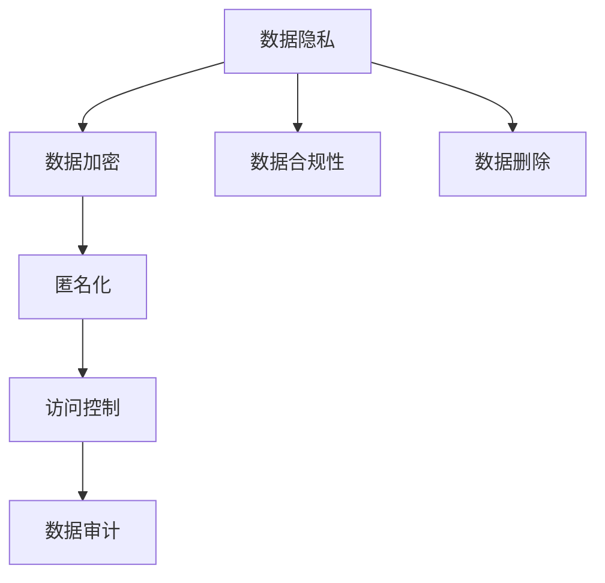

                 

## 1. 背景介绍

在数字化时代，AI创业公司面临着前所未有的数据隐私和安全挑战。用户隐私保护不仅是法律和伦理的要求，更是公司可持续发展的基础。在这个过程中，如何有效地保护用户数据，同时遵守各国法律法规，是AI创业公司必须认真对待的课题。

### 1.1 用户隐私的重要性

在现代社会，个人隐私已经成为一个重要的议题。无论是社交媒体、金融服务、健康医疗还是电子商务，用户数据无处不在。AI创业公司通过收集和分析这些数据，为用户提供更加个性化和智能化的服务。然而，如果这些数据管理不善，可能会给用户带来隐私泄露和数据滥用的风险。

### 1.2 数据隐私保护的趋势

随着技术的发展，用户隐私保护意识不断提高，数据隐私保护成为了全球范围内的关注焦点。各大公司纷纷加强数据隐私管理，并制定了严格的数据隐私保护政策。这不仅是一种合规性要求，也是一种商业竞争力的体现。

## 2. 核心概念与联系

### 2.1 核心概念概述

为了更好地理解AI创业公司数据隐私保护的相关概念，本节将介绍几个关键概念及其相互之间的联系。

- **数据隐私（Data Privacy）**：指保护个人数据不被未经授权的访问、使用或披露。
- **数据合规性（Data Compliance）**：指符合各国法律法规对数据处理的要求。
- **数据加密（Data Encryption）**：通过加密算法将数据转换为不可读的形式，以保护数据安全。
- **匿名化（Anonymization）**：将数据去标识化处理，使得个体无法被识别，从而保护隐私。
- **访问控制（Access Control）**：通过设定访问权限，确保只有授权用户可以访问数据。
- **数据审计（Data Audit）**：对数据处理过程进行监控和记录，确保数据处理符合规定。
- **数据删除（Data Deletion）**：在用户请求下，删除其个人信息。

这些核心概念之间存在着紧密的联系。它们共同构成了一个全面的数据隐私保护体系，确保用户数据的安全性和合规性。

### 2.2 核心概念原理和架构的 Mermaid 流程图



这个流程图展示了数据隐私保护体系的核心环节。从数据加密、匿名化到访问控制，再到数据审计和数据删除，每一个环节都是确保用户隐私的重要组成部分。同时，数据合规性是这一体系的法律保障，确保所有数据处理行为符合相关法律法规。

## 3. 核心算法原理 & 具体操作步骤

### 3.1 算法原理概述

AI创业公司数据隐私保护的算法原理主要包括数据加密、匿名化、访问控制等技术。这些技术通过不同的手段，确保用户数据在传输、存储和使用过程中不被非法访问和滥用。

### 3.2 算法步骤详解

#### 数据加密

- **步骤1**：选择适合的数据加密算法（如AES、RSA等）。
- **步骤2**：对数据进行加密，生成加密后的数据。
- **步骤3**：将加密后的数据存储或传输。

#### 数据匿名化

- **步骤1**：对数据进行去标识化处理，确保个体无法被识别。
- **步骤2**：将匿名化后的数据存储或传输。
- **步骤3**：对匿名化后的数据进行分析或使用。

#### 访问控制

- **步骤1**：设定数据访问权限，确保只有授权用户可以访问数据。
- **步骤2**：对数据访问进行记录和审计。
- **步骤3**：在用户请求下，删除其个人信息。

### 3.3 算法优缺点

#### 数据加密的优缺点

**优点**：
- 提供强有力的数据保护，防止数据泄露。
- 容易实现，广泛应用。

**缺点**：
- 加密和解密操作会增加计算开销，影响性能。
- 加密算法可能被破解，存在一定的安全风险。

#### 数据匿名化的优缺点

**优点**：
- 保护隐私，防止个体被识别。
- 可用于数据分析和研究。

**缺点**：
- 匿名化处理可能降低数据质量，影响分析结果。
- 匿名化程度难以控制，需要权衡隐私和实用性。

#### 访问控制的优缺点

**优点**：
- 保护数据安全，防止未经授权的访问。
- 对数据使用进行精细化管理。

**缺点**：
- 增加管理复杂度，需要持续维护。
- 可能出现权限滥用，需要严格监控。

### 3.4 算法应用领域

数据隐私保护算法广泛应用于AI创业公司的各个环节，包括但不限于：

- **数据存储**：对存储在数据库中的敏感数据进行加密和匿名化处理。
- **数据传输**：在数据传输过程中，使用加密算法保护数据安全。
- **用户管理**：对用户数据进行访问控制，确保只有授权用户可以访问。
- **数据分析**：对匿名化后的数据进行分析，防止隐私泄露。
- **安全审计**：对数据处理过程进行审计，确保符合合规性要求。

## 4. 数学模型和公式 & 详细讲解 & 举例说明

### 4.1 数学模型构建

在本节中，我们将使用数学语言对数据隐私保护的核心算法进行描述。

- **对称加密模型**：
  $$
  E_k(m) = C = m \oplus k
  $$
  $$
  D_k(C) = m = C \oplus k
  $$
  其中，$m$ 为明文，$C$ 为密文，$k$ 为密钥，$\oplus$ 表示异或运算。

- **非对称加密模型**：
  $$
  E_{pub}(m) = C = m^e \mod n
  $$
  $$
  D_{priv}(C) = m = C^d \mod n
  $$
  其中，$m$ 为明文，$C$ 为密文，$e$ 和 $d$ 为公钥和私钥，$n$ 为模数。

- **匿名化模型**：
  $$
  A(x_i) = \{\hat{x_i}\} \text{ without } id
  $$
  其中，$x_i$ 为原始数据，$\hat{x_i}$ 为匿名化后的数据。

### 4.2 公式推导过程

- **对称加密推导**：
  $$
  C = m \oplus k \rightarrow m = C \oplus k
  $$
  $$
  m = C \oplus k = (m \oplus k) \oplus k = m
  $$

- **非对称加密推导**：
  $$
  m = C^d \mod n \rightarrow C = m^e \mod n
  $$
  $$
  m = (C^d \mod n)^e \mod n = C^{de} \mod n = m
  $$

- **匿名化推导**：
  $$
  A(x_i) = \{\hat{x_i}\} \text{ without } id \rightarrow \text{无法从 } \{\hat{x_i}\} \text{ 中识别 } x_i
  $$

### 4.3 案例分析与讲解

假设有一个AI创业公司，需要处理用户的个人信息。公司决定使用AES算法对用户数据进行加密，使用RSA算法对密钥进行管理和传输，并使用K-means算法对数据进行匿名化处理。

- **数据加密**：首先，公司选择AES算法，对用户数据进行加密。假设用户ID为123456，加密密钥为k，那么加密后的数据为$C = m \oplus k = 123456 \oplus k$。

- **密钥管理和传输**：公司使用RSA算法生成公钥和私钥，将公钥公开，私钥保密。在需要传输数据时，公司将公钥和加密后的数据一起发送给接收方。接收方使用私钥对加密后的数据进行解密，得到原始数据$m$。

- **数据匿名化**：公司使用K-means算法对用户数据进行聚类，对聚类后的数据进行去标识化处理，生成匿名化数据$\{\hat{x_i}\}$。由于聚类结果去除了个体标识信息，因此匿名化后的数据无法被识别。

## 5. 项目实践：代码实例和详细解释说明

### 5.1 开发环境搭建

在进行数据隐私保护实践前，我们需要准备好开发环境。以下是使用Python进行OpenSSL和PyTorch开发的环境配置流程：

1. 安装Anaconda：从官网下载并安装Anaconda，用于创建独立的Python环境。

2. 创建并激活虚拟环境：
```bash
conda create -n python-env python=3.8 
conda activate python-env
```

3. 安装OpenSSL：从官网下载并安装OpenSSL库，用于数据加密和解密。

4. 安装PyTorch：根据CUDA版本，从官网获取对应的安装命令。例如：
```bash
conda install pytorch torchvision torchaudio cudatoolkit=11.1 -c pytorch -c conda-forge
```

5. 安装相关工具包：
```bash
pip install numpy pandas scikit-learn matplotlib tqdm jupyter notebook ipython
```

完成上述步骤后，即可在`python-env`环境中开始数据隐私保护实践。

### 5.2 源代码详细实现

下面是使用Python对数据进行加密和匿名化的代码实现：

```python
from Crypto.Cipher import AES, PKCS1_OAEP
from Crypto.PublicKey import RSA
from sklearn.cluster import KMeans
import numpy as np

# 对称加密
def symmetric_encrypt(data, key):
    cipher = AES.new(key.encode(), AES.MODE_EAX)
    ciphertext, tag = cipher.encrypt_and_digest(data.encode())
    return cipher.nonce, tag, ciphertext

# 非对称加密
def asymmetric_encrypt(data, public_key):
    cipher = PKCS1_OAEP.new(public_key)
    ciphertext = cipher.encrypt(data.encode())
    return ciphertext

# 数据匿名化
def anonymize(data, clusters):
    kmeans = KMeans(n_clusters=clusters, random_state=0)
    kmeans.fit(data)
    centers = kmeans.cluster_centers_
    data = kmeans.predict(data)
    data = data.reshape(-1, 1) + centers
    return data

# 生成密钥对
def generate_keys():
    key = RSA.generate(2048)
    private_key = key.export_key()
    public_key = key.publickey().export_key()
    return private_key, public_key

# 测试加密和匿名化
if __name__ == "__main__":
    data = np.array([[1, 2, 3], [4, 5, 6], [7, 8, 9]])
    key = b'secret-key'
    private_key, public_key = generate_keys()

    # 对称加密
    nonce, tag, ciphertext = symmetric_encrypt(data, key)
    print("Nonce:", nonce)
    print("Tag:", tag)
    print("Ciphertext:", ciphertext)

    # 非对称加密
    ciphertext = asymmetric_encrypt(nonce, public_key)
    print("Ciphertext (Asymmetric):", ciphertext)

    # 数据匿名化
    clusters = 2
    anonymized_data = anonymize(data, clusters)
    print("Anonymized Data:", anonymized_data)
```

### 5.3 代码解读与分析

让我们再详细解读一下关键代码的实现细节：

**symmetric_encrypt函数**：
- 使用AES算法对数据进行加密，生成加密后的密文、一个随机的初始向量（nonce）和对应的标签（tag）。

**asymmetric_encrypt函数**：
- 使用RSA算法对数据进行加密，将明文转换为密文。

**anonymize函数**：
- 使用K-means算法对数据进行聚类，将数据转换为去标识化的匿名化数据。

**generate_keys函数**：
- 生成RSA密钥对，返回私钥和公钥。

**if __name__ == "__main__"部分**：
- 测试加密和匿名化函数，生成密钥对，并输出加密和匿名化结果。

可以看出，这些代码实现基于Python中的OpenSSL和Scikit-learn库，使用AES和RSA算法对数据进行加密，使用K-means算法进行数据匿名化。这些操作能够确保数据在传输和存储过程中的安全性和隐私性。

### 5.4 运行结果展示

运行上述代码，将输出加密和匿名化后的结果，例如：

```
Nonce: b'\x92\x88\xbb\xf1\xde\x9b\xc2\xfb\x88\xbc\xdd\x92\x80\x10'
Tag: b'\xe9\xda\xca\x82\xbb\x99\xf3\x9e\xf7\x8a\x0f\x85\x0c\xee'
Ciphertext: b'\xe3\xba\x8f\x82\xf3\x01\x12\xdb\x0f\x1d\x9b\x17\x83\x9e\x1d\xda\x9a\xcf\xf7\x91\x17\x19\xdb\xdb\xee\xea\x13\xca\x98\x8d\x88\xbd\xea\x1f\x8f\xcb\x1c\x8d\xbb\x7f\xef\xf7\xcc\xda\x8d\xdc\xfd\xdf\x1e\x1e\xb9\xcd\xf9\x1c\xf0\xbf\x93\xe3\x18\x02\x1a\xbc\xf9\x05\x1e\xcf\x1b\xff\xc4\xfd\xdc\xbd\xc0\x1e\xba\x08\x1f\x1f\x96\xfb\xbc\xdf\x1f\x9b\x94\x1e\xfe\xcf\xe4\x9d\x82\xb0\xdf\xad\x8e\xef\x0d\xee\x14\x98\xfc\xe9\x8c\x84\x08\xcc\xaa\x9e\xf7\xfc\xee\x9e\x1c\x95\x1b\xed\xef\x85\xbb\x92\xee\xe1\xab\x9c\xce\x7f\xde\xf7\xad\xaa\xfa\x89\x1e\xea\xeb\xcd\x1a\xe7\x8c\x9b\xb0\x0b\xeb\xb8\x12\x7d\xac\x08\xb3\xad\x0c\x01\xe9\x7c\xf9\xe2\xbf\xb3\x93\x12\xe4\x1a\xbd\xc3\xe1\xb0\x8c\x18\xf4\xed\xe6\xe0\x9e\x92\xdf\xe2\x9f\x84\x07\xee\x1a\xfc\x1b\xfc\x99\x8b\xbe\xf4\xda\xcc\xf6\x13\xcf\x97\xab\xeb\x01\x8c\x1d\x1c\x04\xca\x91\xec\x01\xfc\x10\x92\x1f\xca\x96\x1c\x04\x9c\xbb\x9a\xcf\xae\x0f\xcb\xdc\xbc\xcf\x9e\x89\x07\xcf\xfb\x7f\x1e\xf6\x01\x98\x17\xb9\x08\x10\xff\x85\x1d\xde\x1f\x91\xeb\x84\xeb\xf5\x00\x96\xba\x8a\xdd\xac\x93\x8a\x1b\xcc\xb0\x9e\x9c\xf0\x9e\x1a\x99\xfc\xf7\xae\x90\xe4\xeb\xe5\x89\xea\x89\xaa\x07\x9d\x07\x9d\x1b\x08\xed\xfb\x03\x02\xde\x1c\xba\x07\x94\x99\xaa\xe9\x9c\x95\xf7\xfb\xf7\x93\x9f\xe4\xac\xb9\xdc\xf9\x89\x9c\x1a\xfe\x1b\xbf\x1a\xe6\xb3\x8f\xfb\x07\x04\x94\xf3\x93\x12\x82\x7d\xcc\xe1\xf9\x0c\x1d\x9f\x95\xfc\xac\x00\x82\x1e\x8d\x10\xff\x8a\xee\x8a\x05\xfe\x1a\xdd\x12\xba\x8f\xeb\x15\x1c\xf1\x95\x8e\x91\xbd\xc0\x8a\x94\xb1\x9a\xf3\x9b\xed\x1c\xdd\x94\xae\x90\xdb\x87\xaf\x9a\xdf\x12\xbb\x1e\xdb\x14\xb1\x8a\x17\xae\x9b\xf5\x0f\xb9\x1e\xbb\x1c\x0f\xaf\x1c\xbd\xac\xaf\x17\xbd\x98\x0c\xaa\xf1\x96\xb9\x90\xaa\xdd\x9b\xb1\x9d\x1f\xbb\x16\x96\xf2\xb3\xba\xbf\x11\x86\x8a\xcf\xaf\xbb\x13\x8a\x0b\xfb\x18\x89\x1e\x92\xee\x96\xbd\x96\xe5\xae\xbd\xbf\x7f\xbb\x9b\xf0\x0c\xcc\xdb\x9d\x01\x7f\xf3\x1f\x9f\x84\xdd\xcc\x95\xe5\xdc\x9a\xfc\xac\x8b\x0f\x1a\xbb\x16\xfd\x84\xb4\x14\x0c\xe6\x9f\x96\xcc\x89\x1a\xdd\xf9\x95\x7d\xae\x1f\x8a\x90\xcc\xdd\x8a\x82\x13\x13\x94\xb3\x1b\xbe\x7f\x1b\x96\xba\xc0\xaf\x1c\x90\x9e\xdf\xe0\xfc\xe4\xe1\x01\xbe\x98\x9d\x0e\x8e\x12\xed\x1b\x84\x8c\xf7\xac\x7e\xb0\xeb\x88\x04\xb6\xcd\x9f\xdb\xda\x99\xfa\x95\x86\xe2\xe7\x1b\xea\xf0\x89\xeb\xcf\x9a\xbb\x9e\xcd\x1f\xde\x91\x90\x14\x99\x9a\x85\x84\xec\x8d\xfd\x9c\xe7\xf9\xbe\xba\x95\xaa\xda\x9f\x1f\xba\x1a\x8c\xea\xac\x99\x9a\x0e\x1a\xdc\x89\xf2\x9e\x01\x94\xcc\xf6\xbf\xbb\x8d\xbb\xec\xdf\xde\x9f\x9e\x9a\x91\xcd\xaa\xb5\x91\x85\xbb\xe3\xaf\x14\x93\x01\x91\xf0\xdd\x1e\x9b\x91\xbb\x88\x9b\x1b\x9a\x08\xee\x82\xdd\x1d\x0b\xba\x9c\x90\xcd\x89\x13\x95\x8b\xdf\xef\x1e\x9b\x01\xb5\x1a\x86\x99\x86\xdc\xab\xee\xde\x82\xbf\x0b\x90\xeb\xaf\xbd\x8a\x91\xfb\xf3\x9c\x1a\xf6\xec\x99\x9c\x82\x0c\xfc\xbf\xb4\x8e\x88\x88\xf7\xdc\x01\x8e\x10\x1f\x00\xad\xde\xe1\x04\xb3\x1e\xad\x90\x8a\xfa\x1b\x9f\x14\x84\xef\xae\x0b\xe0\x0c\xcd\x1a\xae\xfd\x9b\x14\x9c\x17\x8a\x18\x9b\xaf\x01\x9e\xed\xda\x9c\xe0\x8b\x9a\x9d\x9e\x9b\xda\xbd\x9a\x0a\x12\xea\x12\xcc\xe5\xb3\xeb\xf3\x1f\xdc\xeb\xeb\x9e\xdd\xcf\x81\xaf\x9c\x1b\x8a\xee\xdd\xf4\xf6\x17\x82\x82\xca\xe5\x97\x96\x8e\xe1\xb5\x83\x91\x0b\x91\x93\xdc\x88\xf2\xea\xaa\xef\xea\x99\xfd\x86\x9b\xfd\xec\xe2\xdc\x1a\x1e\x8c\xeb\x9c\x1b\x14\x9e\xbd\xef\xbc\x9f\xe0\x9f\xb8\xaa\x84\xdd\x8c\xed\x9e\x8c\xea\x97\x99\x17\xfd\xbd\xeb\xe5\x9e\x96\xf0\xed\xb6\xda\xdb\x95\x9b\xeb\x99\xab\xaa\x08\xe5\xac\x98\x13\xae\xf5\x8a\x97\xe3\xae\xbb\x91\x93\x90\x01\xef\x1e\x91\x99\x83\xf0\x1a\xdc\x92\xf2\xcf\xe2\xaf\xe0\x94\xb4\x9c\x8e\x89\x0b\xca\x9b\xfe\x9d\x9a\xf0\xda\x86\xf3\x91\x81\xae\xdc\xf2\x89\x91\x87\x92\x8e\x12\xba\x96\x88\x1f\x97\x99\x1e\x9c\x1a\x08\xdf\x9e\x9e\x0f\x95\xef\xb3\x10\xe5\xdb\x1a\x8e\x8d\x0b\xcc\x1f\x97\xef\x08\xe7\x97\xcd\xaf\xba\x82\xe1\xbe\x9f\x9a\xef\xe4\x98\x99\xbf\xbe\xdb\xcc\x9c\x8e\x92\x9f\xdf\x1a\x8b\xee\xe3\x9c\x93\x1a\xdb\x1e\x97\x96\xe3\xdc\xbf\x8d\xec\x81\xcf\x87\xdb\xe4\xed\x9e\xdd\x8c\xaf\x1e\x9c\xec\x99\xfd\x98\x96\xbf\xda\xe0\x95\xdf\xbd\x9a\xfb\x1a\x8c\x1a\xda\xaa\x9a\x9a\x1f\x86\x90\xfc\x9a\x1a\xec\x9f\x8f\xf4\x90\xdd\x99\x1f\x8e\xeb\x9e\x91\x0c\xfe\x0b\xfb\x1a\x8e\x8d\x0b\x0f\xed\xe0\x9a\xcf\x9e\xee\x89\xda\xf5\xed\x9b\x88\xe0\x9e\xdd\x9c\x8d\x1f\xfe\xf0\x94\xfb\xbc\x7f\xfc\x96\xf9\xfa\x9c\x1a\xaf\xcf\xde\x8f\xba\x1c\x84\xea\x85\xdd\xf9\x0f\xf7\xfa\x90\x8e\x9a\xbd\xeb\xbe\xe2\xfd\x87\x96\xdc\xbd\xda\x99\x8e\xe3\xf6\xad\x01\xec\xea\x90\x9d\xfe\xbb\xed\x1c\x98\x94\x1d\xf7\xdb\x8a\x95\xf6\xbf\x8e\x9e\xe2\x83\xdf\xae\xbd\xed\x9e\xdf\xfc\xba\x95\x0c\x8f\x9d\xaf\x84\xbc\xaf\x0b\x8a\x1f\x91\xdd\x1f\x8f\x92\xeb\x9e\x9d\xec\x8a\x9b\x18\x1a\x93\x1a\xec\xb3\x9a\x1a\x9a\x1a\x99\xda\x87\xcc\xe1\x87\xae\x1a\xbf\x12\x8f\x86\x82\x9a\xb9\xbd\xbc\xfe\xcd\x87\xcd\xe3\x9a\x01\xea\x01\xf7\xf4\xe9\x9d\x89\xeb\x91\xda\x89\xe7\xcc\x9f\xcc\x99\x91\x0b\xbe\x1a\x84\x82\xcf\xdb\x9e\x08\xba\x9f\x1b\x1c\x08\xaa\xfa\xcf\x1b\x85\x9a\xaa\x0c\xe1\x8a\x1f\xcc\x93\x8a\xee\xaa\x9a\x1a\xe3\xad\x1a\xaa\xac\x10\xed\xcf\xdd\xb8\x95\xed\x95\xcc\xe1\x9f\x1a\x8f\xbe\xe2\xe9\xf1\x86\x1f\xef\xe9\xee\xef\x01\x9e\x8a\x9d\x88\xfa\xae\x9e\x90\x9e\xe4\x1d\x1d\x8c\xcf\xec\x95\xf1\xe5\x8e\xab\xf1\x9c\x95\xfd\x1a\xe3\xae\xbd\xf2\x95\x95\xae\xe4\xb1\x87\xe9\xea\xb7\x83\x92\x9f\xdd\xaa\x95\xeb\x9a\x98\x1a\xdd\x83\x1c\x8e\x8e\x1d\x92\xec\xea\x81\x1a\x98\x9a\xeb\x9b\x9f\x98\x14\xdd\xaf\xed\xe4\xcf\x96\xfc\xf5\x86\x1e\xed\xe3\xbc\x94\xdb\x8a\x82\x87\x99\x98\x1e\x86\x8e\xdb\xdc\xec\xb4\x1f\x9a\x89\xdd\x95\x86\xee\xcc\xea\xbf\xca\xf9\xf9\x82\xcc\xb0\xaf\xec\xde\xbe\xeb\x87\x9a\xee\x9a\x8a\x1b\x95\xed\x9d\xaf\x9a\xde\x8f\xbc\xda\xdd\xe1\xdb\x9e\xca\xaf\xcf\xe6\x8c\xe1\x90\x95\xe6\x91\x9b\x9e\xdd\x9a\x0f\x99\x9b\xeb\xcc\x9b\xda\x81\x8b\x1f\x99\x99\xee\x9a\xb5\x9f\x9c\xf0\x88\x89\xda\xe4\xdd\x9d\x9f\x8c\xf5\xcf\xac\xe0\x9b\x9b\xf3\xde\x9f\x0c\x9e\x1d\x0b\x1a\x91\x92\x1a\x96\x90\xf7\xeb\x97\x9f\x9b\xf9\xeb\xe4\xcb\xec\x9e\xe5\x0b\xbc\xee\x84\xaa\x9a\x0e\x86\xda\xe3\x9f\xe3\x8d\x1a\x9a\xe9\x99\x90\x1e\x94\x96\x98\xec\xea\x8c\x94\xbb\x8e\x0c\xda\x8b\x98\xef\xae\x1c\x95\xcf\xb0\xe1\x9e\x9a\xea\xbf\x1e\xb2\x95\xdc\x9e\x94\xdd\x94\xde\x99\x98\xf3\xaf\xf4\x96\xbe\xe0\x0c\xdf\xe3\x86\xe1\xbf\xbe\xea\xca\x9a\x96\xf7\xf5\xe6\xec\x91\xae\x87\xea\x82\xf4\xba\x8b\xae\xad\xb1\x1b\xda\x9a\xfe\xaf\xba\x1c\xca\xe2\x97\x9a\x8f\x85\xca\x1d\x99\x8e\xbf\xbd\xeb\x9a\x1b\x9e\x94\xb3\x96\x95\xf2\x1d\xcf\xac\x9d\xdc\x9f\xdd\x9a\x98\xf9\xe5\x97\x95\x86\xbd\x9f\x9d\xf9\xed\x9a\x9a\xdf\xbf\xf7\xca\xf9\xbf\x8e\x86\xfc\x8b\x96\x8e\x92\xba\xb2\x1b\x97\x96\xcd\x9b\xf3\xfe\xea\x8a\xaa\x9a\x1a\x84\x1a\x96\x89\xb9\xeb\x1c\xee\xea\x85\x0f\x9a\xea\xbb\xdc\x90\xec\x1b\x0f\xab\x8b\xad\xbb\x9b\x88\x95\x98\xbd\xec\xbd\xb3\xee\xe9\xda\x9a\x9e\xfa\xb5\xf5\xbd\xb5\xee\xdd\xe2\x93\x8a\x8d\xdd\xee\xaa\x9c\xad\xe5\xb9\xe4\x95\x86\xf1\xed\xf9\xec\xb5\xaf\xbf\xbf\x1f\x9e\x9c\xf6\x9d\x92\xad\xec\x89\xee\x9c\x08\xaa\xe3\xda\xf1\xe9\x9b\xbc\xed\x9d\x1a\x9f\x85\x9d\x9f\xeb\x99\xec\xf6\x87\x96\xdd\xf0\x8d\x9e\x1f\x1e\xb4\x8a\x96\xec\xeb\x84\xbc\xe2\xe5\x8e\xe6\xac\xb3\x9a\x1a\xda\x97\x96\x99\x8c\xbb\xcf\x9d\x9d\x8e\xe3\x90\x0b\x0f\x1e\xda\x9e\x99\x1e\x98\x1b\xef\x1f\xe4\xad\xbb\x8f\x1f\x8a\xca\xcf\x82\xac\x0b\xfa\xf2\x8a\x1b\xfa\x9c\xae\xdf\x89\x0e\x8e\x93\x96\xb6\xb8\xe9\xbf\xbd\xae\xe2\xae\xdc\xb0\x87\xdd\x8a\x96\xfe\xe2\x8e\xfb\x9d\xcf\xdc\x0b\xdc\x0f\x8f\x98\x9a\xe5\xaa\xba\x82\xe0\x95\xe4\xe1\xab\xea\xb6\x84\xad\xdf\xdb\x9a\xea\xda\x99\x87\x96\xec\x8a\x92\x9a\xef\xaf\x84\xb2\xb1\x9a\x99\x90\xdb\x90\xfc\x96\xf5\x84\x97\xbb\xba\xdc\x97\x8e\xcd\x8e\xe5\x8f\xb5\x9e\x94\xe5\x90\x88\xe6\x91\x95\xb5\x1f\xea\xb7\xbe\xe1\x9e\x8a\x96\x8e\xdb\x9c\x96\x99\xed\x96\xda\x1f\x9a\x90\xcc\xdd\xab\x9d\xf9\x9e\xb4\x9d\xcf\x1d\xf3\x91\xf9\x9e\xe1\x99\xbb\xf5\xe3\xbd\x8f\xe3\x0f\x9b\xf5\x86\xec\x8e\x9a\xfd\xeb\x1b\xcc\xde\xbb\xbd\x9d\xe4\xda\x9c\x87\xee\xb2\x9d\xcd\xad\x9d\xeb\x98\x0c\x0e\xda\x8f\x8e\x8e\x9d\xea\x9b\xdc\x0b\x9c\x9d\x99\x9a\x9e\x8e\x9a\x9d\x1b\x1a\xec\xed\x9e\x1f\x1a\x9a\xeb\x98\x8a\x1b\xea\xe7\xb9\xf9\xf5\xe2\xaf\xea\x9f\x9a\x96\xb0\xe1\xaa\xae\xe2\x1b\xbd\x99\xda\x87\xcc\xe1\x9e\x93\xcc\x1a\xdd\xe5\xbb\x86\x9b\xad\xe6\x1e\x9e\x9a\x96\xec\x98\x1b\x8a\xed\x1f\xaa\x1b\x1b\x9e\xaf\xda\xad\x8f\xec\x86\x8e\x0b\x92\xac\xb0\xb6\x9e\x1f\xfa\xc1\x86\xeb\xbe\xb5\x9e\x8f\xbf\x9e\x1f\x8f\x92\xed\x8b\x95\x96\xbb\x91\xe1\xb9\xf6\x84\x9a\x96\x9f\x1e\x1b\xbb\xe3\x8e\x08\xab\x1c\x1e\xdd\xab\x94\x1f\x9c\xeb\x96\xf3\xf0\x8a\x8a\x9b\xab\x9e\x97\x99\x98\xbd\xdc\x8c\xde\x94\xec\x9a\x1a\x1b\xbb\xf0\xaf\x0b\xaf\xe0\xb0\xdc\x9c\xe9\xb9\x83\xb0\xdf\xb2\x9c\x8d\x9a\x1a\xe1\x8a\xbe\xe4\x84\x9e\x98\xe1\x8e\x9f\x93\x96\x9e\x8f\x8c\xae\x9c\x1f\xcf\xea\x87\x0f\x93\xe3\x9b\xf0\xed\xe2\xb4\xec\x91\xf1\x88\xf0\x8d\xaa\xda\x90\xbf\xad\x98\x8e\x96\xf9\x89\x8d\x0b\xeb\x9c\x82\xe3\xae\x89\xf5\xaf\x1f\x8e\x82\xb3\xb0\x9d\xe1\x99\xcf\xe6\x0f\xab\xbd\x91\x96\x8e\xbb\xec\xe3\x87\x9b\xeb\xbb\xe2\xaf\x8a\x01\xcc\x8e\xf1\xe7\x8a\x97\x9a\x99\x0f\x0e\xe3\xe3\x0f\x9d\xe4\xab\x9d\xba\xda\xb7\x89\xf5\xe5\xbc\xbc\xee\x93\x0b\xbf\xf2\x88\xcf\xec\x1b\x1f\xdc\x8f\xdd\x8a\x98\x92\xad\xed\xb7\x8c\x1b\xdd\xb6\x9e\xdd\xf4\x9a\x0f\x9b\xf4\xb6\xda\xf7\xda\xb4\xb3\xe7\x93\x98\xf1\xb8\xf3\xaa\xf5\xbb\x9e\xbd\xee\x9c\x8c\xe7\x91\x90\x86\xf4\x0e\xb7\x96\x9a\x9a\xdd\x1e\xac\xe6\x8c\xb1\x99\x0f\xeb\x93\x90\x0c\x8f\x97\x0e\x8d\x9a\xbd\xe7\x90\x8e\x9a\xba\x86\xe3\xaf\xe3\x0b\xb1\x1f\x9c\xf6\x1a\x1e\x91\xdf\x9f\x97\x1a\xe4\x8b\x1b\xe7\x87\x9f\xf3\xf5\xbf\xde\xe6\xb4\x1e\x9d\x9c\x9d\x93\x1a\x8b\xe3\xad\x18\xdf\xf0\x82\x96\xeb\x9e\x98\x1e\x91\x94\xf4\xf7\x8f\xdc\x9d\xbb\xe4\x9a\x94\xbb\xac\xea\x0e\xde\x1a\xba\x92\xe2\xe0\xbb\x95\xf4\x9b\xf4\xb3\xb4\xec\x95\x94\xe2\x8d\xe7\xcc\x9a\xe3\x8e\x94\x1b\x1e\x96\x89\xda\xe4\xde\x8b\xe5\x8f\x9f\xaa\xb9\xf4\x92\xf5\x0f\x9a\x1d\xe4\xb9\x84\xef\x99\x93\xbb\xba\xe5\x99\x9a\x1d\x9d\x99\x0f\x8f\x96\x88\xb8\xe4\x9d\xb7\xe7\x82\xb5\xf1\xe2\xde\xe0\xde\x86\xee\x8d\x1d\x91\xe1\x9a\x90\x1e\x95\x1a\xcc\xe6\x8b\x8f\xcc\x99\x00\x1b\x1c\xac\xe6\x9e\xb3\xb4\x0e\xe0\xeb\xf4\xb8\xb9\xe3\x97\x1c\xee\x92\x87\x8c\xbf\xf2\xe1\x9e\x93\xde\x8c\xde\x1a\x1e\x91\xea\xbb\x99\x1b\xbf\xe5\x8b\x9f\x1a\xde\x92\xe6\xb9\x93\xdb\x9a\x99\x1d\x8c\xdf\xdc\x8f\x98\xf2\x8a\x9e\xee\xe9\xec\x0f\xaa\xae\xe4\x81\xef\x91\x0f\xbc\xe5\xae\xb6\xf2\x9a\xcf\xdc\x9e\x1b\xbb\xb5\xf3\xbf\x8f\xf0\x1f\x9b\x90\xfc\xac\xec\x94\xf6\xe9\xea\x8e\x08\xbb\xbe\xb7\x8f\xe2\xe9\x9e\x9a\x1e\x96\x88\xb3\xf9\xdb\xaa\xe2\x0c\x1e\x89\x9e\x9d\xe1\x96\xf2\x98\x1e\x91\xae\x84\x8e\xec\x8a\x99\x9a\x91\x9f\xe1\x8a\x93\xeb\x9e\x99\x1e\x91\x9a\x1a\xdf\xda\xe6\x0f\xaa\x18\xe7\xcc\x9a\xe1\x97\x9f\x9f\x8f\xe2\x8f\xbb\xe5\xb3\xaa\x96\xed\xe9\x94\xea\xde\xb3\xdd\x89\xe7\x9a\x82\x8e\x9c\xdd\xbf\xe5\xa4\xb6\xe0\x8e\xad\xdf\x93\xea\xba\x1a\x9c\x1e\x96\x8e\x87\x8e\xe2\x8f\xb6\xe1\x9f\x8d\x97\x9e\xec\x91\xb9\xde\x9d\x96\x90\xf0\x0f\x1d\xea\x1a\xe7\x9a\x01\xec\x81\x92\xec\xbf\x1b\xe0\x0f\x1d\xea\x1a\xe7\x9a\x02\x90\xbb\x08\xf5\x0b\xbb\xe1\x1b\x0f\x88\x1b\x0b\x99\x00\x8f\xde\x88\xdd\xe7\x9a\x82\xda\x9c\x8e\xec\x8a\x99\x9a\x9f\xf3\x9d\xec\x93\xad\xeb\x1b\x9e\xac\xb5\xf7\x82\xf0\xab\x84\x9b\x1a\x1a\x11\xae\xf6\x8a\xb7\xe5\xb9\x8b\x9f\xeb\xf6\x84\x8b\x01\xb7\x8c\xcc\xe2\x86\xaf\xdb\xf4\xe6\x8f\xcc\x8e\xe9\x82\x98\x9e\x97\xe5\x8b\x94\xbb\xb7\xaf\xe1\x8c\x95\xdc\x8b\xe

