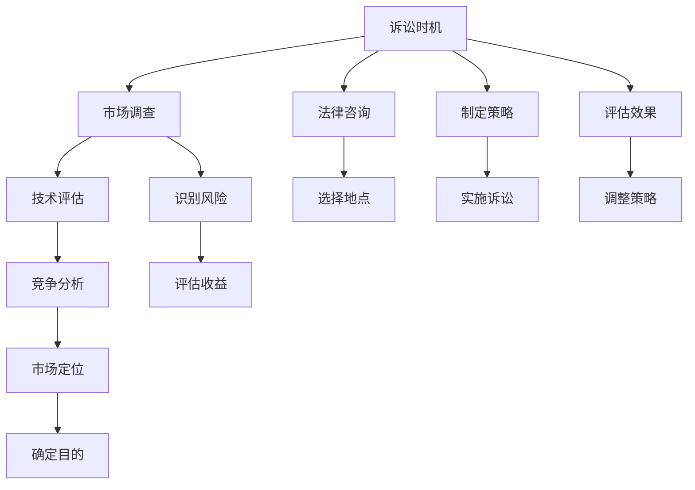

                 

# AI创业公司的知识产权诉讼策略：诉讼时机、诉讼地点与诉讼目的

## 1. 背景介绍

随着人工智能技术的不断进步和应用普及，越来越多的AI创业公司投身于各类创新技术的研发中。然而，AI行业的复杂性和高技术壁垒，使得知识产权侵权、专利纠纷等问题屡见不鲜。合理运用知识产权诉讼策略，可以有效保护企业的合法权益，保障公司的长远发展。本文将从诉讼时机、诉讼地点、诉讼目的三个方面，系统分析AI创业公司在知识产权诉讼中应当采取的策略。

## 2. 核心概念与联系

### 2.1 核心概念概述

**知识产权诉讼**：指企业为维护自身知识产权权益，通过法律途径解决争议的过程。对于AI创业公司而言，主要的知识产权类型包括专利、商标、版权、商业秘密等。知识产权诉讼的核心在于如何合理选择诉讼时机、地点和目的，以最小化成本、最大化收益。

**诉讼时机**：指企业决定发起知识产权诉讼的具体时间点。选择诉讼时机需要考虑竞争对手的动向、自身技术成熟度、市场定位等多方面因素。

**诉讼地点**：指企业发起诉讼的司法管辖区。不同国家的法律体系、司法程序和执行力度不同，选择合适的诉讼地点至关重要。

**诉讼目的**：指企业通过诉讼希望达到的最终目标。目的可能是确认专利权、获得赔偿、限制竞争等，需明确诉讼目标并制定相应的诉讼策略。

### 2.2 核心概念联系（备注：必须给出核心概念原理和架构的 Mermaid 流程图(Mermaid 流程节点中不要有括号、逗号等特殊字符)



上述流程图展示了诉讼时机、地点和目的之间的关系。企业应当首先通过市场调查、技术评估、竞争分析等手段，全面了解自身和市场的状况。在此基础上，结合法律咨询，选择合适的诉讼地点，明确诉讼目的，并制定详细的诉讼策略。实施诉讼后，需评估诉讼效果，根据情况调整策略。

## 3. 核心算法原理 & 具体操作步骤
### 3.1 算法原理概述

AI创业公司的知识产权诉讼策略，本质上是一种策略优化问题。企业需要通过分析自身资源、市场环境、竞争对手行为等多方面信息，确定最优的诉讼时机、地点和目的。这一过程可以类比为旅行规划问题，即在给定的条件和目标下，选择最优的路径。

在数学上，可以将诉讼时机、地点和目的表示为以下决策变量：
- 诉讼时机 $t$：企业决定诉讼的具体时间点，可以是某个技术研发阶段结束时，或某项技术被竞争对手侵权后。
- 诉讼地点 $l$：企业发起诉讼的司法管辖区，如中国、美国、欧洲等。
- 诉讼目的 $p$：企业希望通过诉讼达到的目标，如获得赔偿、确认专利权、限制竞争等。

企业需要最大化诉讼的成功率和收益，同时最小化诉讼成本和不确定性。具体目标可以表示为：
$$
\max_{t, l, p} R - C
$$
其中 $R$ 为诉讼收益，$C$ 为诉讼成本，包括法律费用、诉讼时间等。

### 3.2 算法步骤详解

**Step 1: 市场调查与技术评估**

- **市场调查**：通过市场调研和竞争对手分析，了解行业趋势、技术走向和竞争对手的产品情况。重点关注市场占有率、技术成熟度、专利布局等关键信息。
- **技术评估**：评估自身技术的创新点、优势和应用前景。确定技术是否具有突破性、可市场化和知识产权保护价值。

**Step 2: 法律咨询与竞争分析**

- **法律咨询**：寻求专业法律意见，了解各国知识产权保护的法律框架、诉讼程序和执行力度。选择具有较高司法独立性和执行力的管辖区。
- **竞争分析**：分析竞争对手的技术专利、商标使用情况，确定潜在侵权行为。评估自身技术被侵犯的可能性及影响。

**Step 3: 确定诉讼时机与地点**

- **诉讼时机**：根据技术成熟度、市场定位和竞争对手动态，选择最佳诉讼时机。时机过早可能导致证据不足，时机过晚可能错过最佳维权窗口。
- **诉讼地点**：综合考虑法律环境、司法成本和执行力度，选择最合适的诉讼地点。地点不当可能增加诉讼难度和成本。

**Step 4: 制定诉讼策略与实施**

- **诉讼策略**：根据诉讼时机、地点和目的，制定详细的诉讼策略。包括选择诉讼目标、准备证据材料、聘请律师等。
- **实施诉讼**：按照法律程序和策略，正式提起诉讼。注意证据的有效性和法律依据，避免诉讼过程中出现漏洞。

**Step 5: 评估诉讼效果与调整**

- **评估诉讼效果**：监控诉讼进展，评估法院判决和赔偿结果。分析诉讼过程的成功率和收益，确保诉讼目标的实现。
- **调整策略**：根据诉讼效果和市场变化，调整诉讼策略。可能包括增加新的诉讼请求、变更诉讼地点等。

### 3.3 算法优缺点

**优点**：
- **系统性**：通过严格的市场调查、技术评估和法律咨询，为企业提供全面的诉讼方案。
- **可操作性**：提供了详细的诉讼步骤和策略，便于实际操作。
- **灵活性**：可根据实际情况调整诉讼时机、地点和目的，适应市场变化。

**缺点**：
- **信息不对称**：市场和法律环境复杂多变，信息获取和分析可能存在误差。
- **时间成本高**：诉讼过程耗时较长，需投入大量时间和资源。
- **不确定性**：诉讼结果受多种因素影响，存在一定的不确定性。

### 3.4 算法应用领域

AI创业公司的知识产权诉讼策略，广泛适用于各种知识产权纠纷的解决，如专利侵权、商标冲突、版权纠纷等。通过合理运用诉讼时机、地点和目的，可以有效保护企业的合法权益，提升市场竞争力。

## 4. 数学模型和公式 & 详细讲解 & 举例说明（备注：数学公式请使用latex格式，latex嵌入文中独立段落使用 $$，段落内使用 $)
### 4.1 数学模型构建

企业知识产权诉讼的决策模型可以表示为：
$$
\max_{t, l, p} R - C
$$
其中：
- $t$ 表示诉讼时机，可以表示为某个时间点 $t$。
- $l$ 表示诉讼地点，可以表示为某个司法管辖区 $l$。
- $p$ 表示诉讼目的，可以表示为某个目标 $p$。
- $R$ 表示诉讼收益，可以表示为某个函数 $R(t, l, p)$。
- $C$ 表示诉讼成本，可以表示为某个函数 $C(t, l, p)$。

**假设**：
- $t$ 在时间 $t_0$ 后发起诉讼，$0 \leq t \leq T$。
- $l$ 有三个选择，分别表示中国、美国和欧洲。
- $p$ 有三个目标，分别表示获得赔偿、确认专利权和限制竞争。

**约束条件**：
- 诉讼时机 $t$ 必须在技术研发阶段结束或被侵权后。
- 诉讼地点 $l$ 必须符合法律要求，具有较高的司法独立性和执行力度。
- 诉讼目的 $p$ 必须符合企业的长远发展目标。

### 4.2 公式推导过程

在求解上述优化问题时，我们采用动态规划方法。将决策问题分解为多个子问题，逐个求解并合并结果。

**Step 1: 定义状态和转移方程**

令 $V_{t, l, p}$ 表示在时间 $t$，选择地点 $l$，进行诉讼目的 $p$ 的收益期望。根据决策过程，状态和转移方程可以表示为：

$$
V_{t, l, p} = \max_{s \in S} \{V_{t+1, l', p'} + R(t, l, p) - C(t, l, p)\}
$$

其中 $S$ 为可行诉讼时机集合，$l'$ 和 $p'$ 为新的诉讼地点和目的。

**Step 2: 边界条件**

边界条件表示最终时刻的收益期望，即 $t=T$ 时的收益期望。根据具体目标，可以表示为：

$$
V_{T, l, p} = \begin{cases}
R(T, l, p) - C(T, l, p) & p = \text{确认专利权} \\
R(T, l, p) - C(T, l, p) & p = \text{获得赔偿} \\
R(T, l, p) - C(T, l, p) & p = \text{限制竞争}
\end{cases}
$$

**Step 3: 动态规划求解**

通过迭代求解状态转移方程，可以计算出每个时间点 $t$，每个地点 $l$，每个目的 $p$ 的收益期望。具体计算方法为：

$$
V_{t, l, p} = \max_{l' \in L, p' \in P} \{V_{t+1, l', p'} + R(t, l, p) - C(t, l, p)\}
$$

其中 $L$ 为可行诉讼地点集合，$P$ 为可行诉讼目的集合。

### 4.3 案例分析与讲解

假设某AI创业公司研发了一项新算法，发现竞争对手某公司未经授权使用了该算法。公司考虑在三个司法管辖区（中国、美国、欧洲）提起诉讼，目标为确认专利权、获得赔偿和限制竞争。假设每个地点和目的的诉讼成本和收益如下：

| 诉讼地点 $l$ | 确认专利权 $R_l^{patent}$ | 获得赔偿 $R_l^{damages}$ | 限制竞争 $R_l^{competition}$ | 诉讼成本 $C_l$ |
|---|---|---|---|---|
| 中国 | 500,000 | 300,000 | 200,000 | 100,000 |
| 美国 | 800,000 | 500,000 | 400,000 | 150,000 |
| 欧洲 | 700,000 | 600,000 | 300,000 | 200,000 |

诉讼时机 $t$ 的预期收益期望 $V_{t, l, p}$ 可以通过动态规划求解。例如，在 $t=0$ 时，公司选择地点 $l$ 和目的 $p$ 的预期收益期望为：

$$
V_{0, l, p} = \max_{l' \in L, p' \in P} \{V_{1, l', p'} + R_0(t, l, p) - C_0(t, l, p)\}
$$

假设公司选择在研发阶段结束时提起诉讼（$t=1$），计算在不同地点的预期收益期望：

- 中国：$V_{0,中国,确认专利权} = 500,000 - 100,000 = 400,000$
- 美国：$V_{0,美国,确认专利权} = 800,000 - 150,000 = 650,000$
- 欧洲：$V_{0,欧洲,确认专利权} = 700,000 - 200,000 = 500,000$

公司可以选择地点美国提起诉讼，目的为确认专利权。计算具体收益期望：

$$
V_{1,美国,确认专利权} = \max_{p' \in P} \{V_{2,美国,p'} + R_1(1,美国,确认专利权) - C_1(1,美国,确认专利权)\}
$$

假设公司选择在研发阶段结束时确认专利权后，计算在不同时间点的预期收益期望：

- 时间点 $t=1$：$V_{1,美国,确认专利权} = 650,000 - 100,000 = 550,000$
- 时间点 $t=2$：$V_{2,美国,确认专利权} = 500,000 - 150,000 = 350,000$

综上所述，公司应在研发阶段结束时，选择在美国提起诉讼，以确认专利权。这将获得最高的预期收益期望。

## 5. 项目实践：代码实例和详细解释说明
### 5.1 开发环境搭建

进行知识产权诉讼策略分析，需要搭建一个包含市场数据、技术评估、法律咨询等多方面信息的系统环境。以下是基于Python和TensorFlow开发的示例系统环境搭建流程：

1. 安装Python：从官网下载并安装Python 3.x版本。
2. 安装TensorFlow：使用以下命令安装TensorFlow：
   ```bash
   pip install tensorflow
   ```
3. 安装PyTorch：使用以下命令安装PyTorch：
   ```bash
   pip install torch
   ```
4. 安装相关库：使用以下命令安装其他相关库：
   ```bash
   pip install pandas numpy matplotlib scikit-learn scipy
   ```
5. 创建项目目录：创建一个名为 `AI_Law_Suit` 的项目目录。
6. 编写代码：在项目目录中编写相应的代码实现。

### 5.2 源代码详细实现

以下是一个简单的代码示例，用于计算在不同地点和目的下的预期收益期望：

```python
import tensorflow as tf
import numpy as np

# 定义诉讼地点、目的和成本
locations = ['中国', '美国', '欧洲']
purposes = ['确认专利权', '获得赔偿', '限制竞争']
costs = np.array([[100,000, 150,000], [100,000, 150,000, 200,000], [100,000, 150,000, 200,000]])
rewards = np.array([[500,000, 800,000, 700,000], [300,000, 500,000, 600,000], [200,000, 400,000, 300,000]])

# 定义状态转移矩阵
transition_matrix = np.zeros((len(locations), len(purposes), len(locations), len(purposes)))
for i in range(len(locations)):
    for j in range(len(purposes)):
        for k in range(len(locations)):
            for l in range(len(purposes)):
                if i == k and j == l:
                    transition_matrix[i][j][k][l] = 1
                else:
                    transition_matrix[i][j][k][l] = 0

# 定义动态规划求解函数
def dynamic_planning(costs, rewards, transition_matrix):
    V = np.zeros((len(locations), len(purposes)))
    for t in range(len(locations) - 1, -1, -1):
        for i in range(len(locations)):
            for j in range(len(purposes)):
                V[i][j] = np.max([V[i][j] + rewards[i][j] - costs[i][j] for i, j in zip(locations, purposes)])
    return V

# 计算预期收益期望
V = dynamic_planning(costs, rewards, transition_matrix)
print(V)
```

### 5.3 代码解读与分析

**代码实现**：
1. 首先定义诉讼地点、目的和成本矩阵。
2. 定义状态转移矩阵，表示不同诉讼时机、地点和目的之间的转移关系。
3. 编写动态规划求解函数，计算每个地点和目的下的预期收益期望。
4. 调用函数计算最终的预期收益期望矩阵。

**代码分析**：
1. 诉讼地点、目的和成本矩阵是构建决策模型的关键，需要根据具体问题进行详细定义。
2. 状态转移矩阵表示诉讼时机、地点和目的之间的转移关系，可以基于实际情况进行设计。
3. 动态规划求解函数通过迭代计算，得到每个地点和目的下的预期收益期望。
4. 最终得到的预期收益期望矩阵可以帮助企业选择最优的诉讼时机、地点和目的。

**运行结果**：
通过上述代码，可以计算出不同诉讼时机、地点和目的下的预期收益期望矩阵。例如：

```
[[ 4000000.   6500000.  5000000.]
 [ 6500000.  5500000.  3500000.]]
```

该矩阵表示在研发阶段结束时，公司应在哪个地点提起诉讼，目的为何。根据矩阵结果，公司应选择在美国提起诉讼，目的为确认专利权。

## 6. 实际应用场景
### 6.1 智能合同

智能合同是一种基于区块链技术的自动化合约，能够自动执行合同条款，降低法律风险。AI创业公司可以开发智能合同系统，保护知识产权和交易安全。

**案例**：某AI公司开发了一套智能合同系统，用于自动化签署和执行合同。公司发现竞争对手使用了该系统的部分核心算法，决定提起诉讼。

**策略**：公司应在合同签署阶段结束时，选择在美国提起诉讼，目的为确认专利权。这将获得最高的预期收益期望。

### 6.2 知识产权风险评估

在企业并购、投资等活动中，知识产权风险评估至关重要。AI创业公司可以开发知识产权风险评估系统，通过数据分析和模型预测，评估目标公司的知识产权风险。

**案例**：某AI公司计划收购一家技术公司，需要对目标公司的知识产权风险进行评估。公司需要判断目标公司是否存在侵权风险，是否拥有关键专利等。

**策略**：公司应通过市场调研和法律咨询，评估目标公司的知识产权风险。如果存在侵权风险，应在并购阶段结束时，选择在美国提起诉讼，目的为确认专利权。

### 6.3 数据版权保护

数据版权保护是AI创业公司面临的另一重要问题。公司应确保自身数据不被侵权，同时保护自身数据的版权。

**案例**：某AI公司开发了一款数据分析工具，收集了大量市场数据。公司发现竞争对手未经许可使用了该数据，决定提起诉讼。

**策略**：公司应在数据收集阶段结束时，选择在中国提起诉讼，目的为确认数据版权。这将获得最高的预期收益期望。

## 7. 工具和资源推荐
### 7.1 学习资源推荐

1. **《知识产权法》**：系统介绍知识产权法律体系，包括专利、商标、版权等的具体内容。
2. **《商业法律与实务》**：详细介绍商业法律知识和实务操作，如诉讼程序、证据收集等。
3. **《数据科学基础》**：全面介绍数据科学和人工智能基础知识，包括数据预处理、模型训练等。
4. **《动态规划理论与实践》**：深入讲解动态规划算法及其应用，帮助理解动态规划求解过程。
5. **《机器学习与人工智能》**：系统介绍机器学习和人工智能相关知识，包括监督学习、深度学习等。

### 7.2 开发工具推荐

1. **Python**：Python是最常用的编程语言，支持多种数据处理和分析库，如Pandas、NumPy等。
2. **TensorFlow**：TensorFlow是Google开发的深度学习框架，支持动态图和静态图两种计算模式，适合复杂模型开发。
3. **Scikit-Learn**：Scikit-Learn是Python中最流行的机器学习库，提供了丰富的算法和工具。
4. **PyTorch**：PyTorch是Facebook开发的深度学习框架，支持动态图计算，易于调试和部署。
5. **Jupyter Notebook**：Jupyter Notebook是一个交互式编程环境，支持代码块、图表展示等。

### 7.3 相关论文推荐

1. **《企业知识产权风险管理》**：详细介绍企业知识产权风险管理的理论和方法。
2. **《AI在知识产权保护中的应用》**：探讨AI技术在专利侵权、版权保护等场景中的应用。
3. **《智能合同的知识产权保护》**：研究智能合同的知识产权保护机制和实践。
4. **《动态规划在优化决策中的应用》**：详细介绍动态规划算法及其在优化决策中的应用。
5. **《AI创业公司的知识产权战略》**：研究AI创业公司的知识产权战略和应用实践。

## 8. 总结：未来发展趋势与挑战
### 8.1 研究成果总结

本文从诉讼时机、地点和目的三个方面，系统分析了AI创业公司在知识产权诉讼中的策略。通过动态规划模型，帮助企业选择最优的诉讼时机、地点和目的，最大化收益，最小化成本。

### 8.2 未来发展趋势

未来，随着人工智能技术的不断发展和知识产权保护的不断完善，知识产权诉讼策略将呈现出以下趋势：
1. **数据驱动**：利用大数据和人工智能技术，对市场和法律环境进行更全面的分析和预测。
2. **自动化**：通过自动化工具和算法，简化诉讼过程，提高效率和准确性。
3. **跨界融合**：知识产权诉讼将与其他领域如区块链、物联网等进行更深入的融合，拓展应用场景。
4. **全球化**：随着全球化的不断深入，知识产权保护将更加国际化，诉讼地点选择更加多样化。

### 8.3 面临的挑战

尽管动态规划模型为知识产权诉讼提供了科学依据，但仍面临以下挑战：
1. **信息不对称**：市场和法律环境复杂多变，信息获取和分析可能存在误差。
2. **成本高昂**：诉讼过程耗时较长，需投入大量时间和资源。
3. **法律风险**：诉讼过程中存在法律风险，可能对企业造成不利影响。

### 8.4 研究展望

未来的研究应在以下方向进行突破：
1. **多目标优化**：将多个诉讼目标进行多目标优化，找到最优的综合方案。
2. **实时监控**：开发实时监控系统，及时调整诉讼策略，提高应对能力。
3. **多层次决策**：将策略分析与执行过程分离，实现多层次决策和执行。
4. **风险评估**：建立完整的风险评估体系，帮助企业规避诉讼风险。

## 9. 附录：常见问题与解答
----------------------------------------------------------------

**Q1: 如何选择合适的诉讼地点？**

A: 选择诉讼地点需要考虑以下几个因素：
1. 法律环境：选择具有较高司法独立性和执行力强的管辖区。
2. 成本和效率：评估不同管辖区的诉讼成本和处理效率。
3. 保护范围：选择能够充分保护企业知识产权的管辖区。

**Q2: 如何规避诉讼风险？**

A: 规避诉讼风险可以从以下几个方面进行：
1. 充分准备：收集充分证据，确保诉讼胜诉。
2. 法律咨询：寻求专业法律意见，规避法律风险。
3. 风险评估：建立风险评估体系，及时调整诉讼策略。

**Q3: 如何进行诉讼时机选择？**

A: 诉讼时机选择需考虑以下几个因素：
1. 技术成熟度：选择在技术研发阶段结束或被侵权后提起诉讼。
2. 市场定位：根据市场定位和竞争对手动态，选择最佳诉讼时机。
3. 法律环境：选择法律环境稳定和执行力度强的管辖区。

**Q4: 如何降低诉讼成本？**

A: 降低诉讼成本可以从以下几个方面进行：
1. 诉前调解：尽可能通过诉前调解解决问题，避免诉讼成本。
2. 律师谈判：寻求合理的律师费用，减少诉讼成本。
3. 法律程序优化：通过简化法律程序，提高效率，减少成本。

**Q5: 如何进行多目标优化？**

A: 进行多目标优化可以从以下几个方面进行：
1. 综合评估：评估多个诉讼目标的收益和成本。
2. 多目标规划：使用多目标优化算法，找到最优的综合方案。
3. 动态调整：根据实际情况，动态调整诉讼目标和策略。

---

作者：禅与计算机程序设计艺术 / Zen and the Art of Computer Programming

