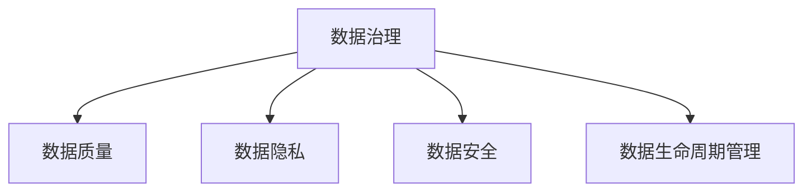

                 

# AI创业：数据管理的策略与对策

> 关键词：AI创业,数据管理,策略,对策,数据治理,数据隐私,数据安全,数据质量,数据生命周期管理

## 1. 背景介绍

### 1.1 问题由来

随着人工智能技术的迅猛发展，AI创业公司不断涌现，成为推动技术创新和产业升级的重要力量。然而，随着数据驱动的AI应用越来越广泛，数据管理成为了AI创业公司面临的重大挑战。高质量、大规模的数据是构建高性能AI模型的基础，但数据收集、存储、处理、使用的复杂性也给数据管理带来了巨大的压力。此外，随着数据量的爆炸式增长和数据隐私保护法规的日趋严格，如何有效管理数据，保护数据安全，成为AI创业公司能否成功的重要因素。

### 1.2 问题核心关键点

数据管理在AI创业中的核心关键点主要包括以下几个方面：

- **数据质量**：高质量的数据是构建高性能AI模型的前提，数据收集、清洗和标注需要投入大量资源和时间。
- **数据安全**：涉及个人隐私和商业机密的数据存储和传输需要严格的数据保护措施，防止数据泄露和滥用。
- **数据隐私**：在遵守数据隐私法规的前提下，合理利用数据进行AI训练和应用。
- **数据治理**：通过制定标准流程和规范，确保数据的一致性、完整性和可追溯性。
- **数据生命周期管理**：从数据采集到废弃的整个生命周期，都需要科学的规划和管理，以确保数据资源的最大化利用。

## 2. 核心概念与联系

### 2.1 核心概念概述

为更好地理解AI创业中的数据管理策略，本节将介绍几个密切相关的核心概念：

- **数据治理（Data Governance）**：通过制定和执行数据标准、流程、策略和技术，确保数据的完整性、一致性和安全性，提升数据质量。
- **数据质量（Data Quality）**：确保数据的准确性、完整性、一致性和时效性，是高质量AI模型的基础。
- **数据隐私（Data Privacy）**：在数据使用和处理过程中，保护个人隐私和敏感信息，遵守相关法规和标准。
- **数据安全（Data Security）**：通过加密、访问控制、审计等措施，确保数据在存储、传输和使用过程中的安全性。
- **数据生命周期管理（Data Lifecycle Management）**：从数据采集到废弃的整个生命周期，科学规划和管理数据资源，确保数据资源的最大化利用。

这些核心概念之间的逻辑关系可以通过以下Mermaid流程图来展示：



这个流程图展示了大语言模型的核心概念及其之间的关系：

1. 数据治理是基础，通过制定和执行数据标准、流程、策略和技术，确保数据的质量和安全。
2. 数据质量是AI模型的基础，通过清洗、标注和预处理，提升数据的准确性和完整性。
3. 数据隐私保护是法律和伦理的要求，确保数据在处理和使用过程中遵守相关法规和标准。
4. 数据安全通过加密、访问控制等措施，确保数据存储和传输的安全性。
5. 数据生命周期管理科学规划和管理数据的整个生命周期，确保数据资源的最大化利用。

这些概念共同构成了AI创业中数据管理的框架，帮助企业有效管理数据，提升AI模型性能。

## 3. 核心算法原理 & 具体操作步骤

### 3.1 算法原理概述

数据管理涉及数据收集、存储、处理、分析和应用的各个环节，其核心算法原理包括以下几个方面：

- **数据清洗和预处理**：通过去除噪音、填充缺失值、标准化等方法，提升数据质量。
- **数据标注和标注数据生成**：对数据进行人工标注，生成标注数据用于模型训练。
- **数据增强和扩充**：通过数据增强技术，增加训练样本的多样性，提升模型泛化能力。
- **数据隐私保护**：通过数据脱敏、加密、差分隐私等方法，保护数据隐私。
- **数据安全管理**：通过访问控制、审计等措施，确保数据的安全性。
- **数据生命周期管理**：通过规划数据采集、存储、使用和废弃的各个环节，确保数据资源的最大化利用。

### 3.2 算法步骤详解

基于数据管理的核心算法原理，AI创业公司在进行数据管理时可以按照以下步骤进行：

**Step 1: 制定数据管理策略**
- 定义数据管理目标，制定数据治理标准和流程。
- 确定数据收集、存储、处理、分析和使用的基本策略和技术方案。

**Step 2: 数据质量管理**
- 收集和清洗数据，确保数据准确、完整、一致和时效。
- 使用数据质量度量指标，如准确率、召回率、F1值等，定期评估数据质量。

**Step 3: 数据安全管理**
- 使用加密、访问控制等技术，保护数据在存储和传输过程中的安全性。
- 建立数据审计和监控机制，及时发现和处理数据安全问题。

**Step 4: 数据隐私保护**
- 使用数据脱敏、差分隐私等技术，保护用户隐私。
- 遵守GDPR、CCPA等隐私保护法规，确保数据使用符合法律法规要求。

**Step 5: 数据增强和扩充**
- 通过数据增强技术，如翻转、旋转、噪声注入等，增加训练样本的多样性。
- 使用合成数据生成技术，增加训练样本的数量和多样性。

**Step 6: 数据生命周期管理**
- 科学规划数据的采集、存储、使用和废弃的各个环节，确保数据资源的最大化利用。
- 定期评估和更新数据管理策略和技术方案，确保数据管理持续改进。

### 3.3 算法优缺点

基于数据管理算法的策略，AI创业公司在数据管理中具有以下优点：

- **数据质量高**：通过数据清洗和预处理，提升数据质量，确保模型训练的高效性和准确性。
- **数据安全有保障**：通过加密和访问控制等措施，保护数据的安全性，防止数据泄露和滥用。
- **数据隐私保护到位**：遵守隐私保护法规，确保数据使用符合法律法规要求，保护用户隐私。
- **数据生命周期科学管理**：科学规划和管理数据的整个生命周期，确保数据资源的最大化利用。

同时，该算法也存在一定的局限性：

- **资源消耗大**：数据清洗、标注和增强需要大量资源和时间，尤其是标注数据生成。
- **技术门槛高**：数据安全保护和隐私保护需要较高的技术水平，需要专业的技术团队支撑。
- **管理复杂**：数据生命周期管理涉及多个环节，管理复杂，需要科学规划和持续改进。

尽管存在这些局限性，但就目前而言，数据管理算法策略是大数据环境下AI创业的重要基础，有助于构建高性能、可信赖的AI应用。

### 3.4 算法应用领域

数据管理算法在AI创业中广泛应用于以下领域：

- **自然语言处理（NLP）**：通过清洗和预处理，提升训练数据的准确性和多样性。
- **计算机视觉（CV）**：通过数据增强和扩充，增加训练样本的多样性，提升模型泛化能力。
- **推荐系统**：通过数据标注和生成，提升推荐算法的准确性和个性化程度。
- **智能客服**：通过数据清洗和预处理，确保对话数据的准确性和一致性。
- **智能医疗**：通过数据隐私保护和数据安全管理，确保患者隐私和医疗数据安全。
- **智能金融**：通过数据清洗和预处理，提升金融数据的准确性和完整性。

这些领域的应用展示了数据管理算法的广泛适用性和重要价值。

## 4. 数学模型和公式 & 详细讲解 & 举例说明

### 4.1 数学模型构建

本节将使用数学语言对AI创业中的数据管理策略进行更加严格的刻画。

记原始数据集为 $D=\{(x_i,y_i)\}_{i=1}^N$，其中 $x_i$ 表示原始数据，$y_i$ 表示标签或属性。数据管理的目标是最大化模型在测试集上的性能。

定义模型的损失函数为 $L(\theta)$，其中 $\theta$ 为模型参数。数据管理的目标是最大化测试集上的性能，即：

$$
\max_{\theta} L(\theta)
$$

在实践中，我们通常使用基于梯度的优化算法（如SGD、Adam等）来近似求解上述最优化问题。设 $\eta$ 为学习率，$R(\theta)$ 为正则化项，则参数的更新公式为：

$$
\theta \leftarrow \theta - \eta \nabla_{\theta}L(\theta) - \eta R(\theta)
$$

其中 $\nabla_{\theta}L(\theta)$ 为损失函数对参数 $\theta$ 的梯度，可通过反向传播算法高效计算。

### 4.2 公式推导过程

以下我们以数据标注为例，推导标注数据的生成过程及其对模型性能的影响。

假设模型 $M_{\theta}$ 在输入 $x$ 上的输出为 $\hat{y}=M_{\theta}(x)$，真实标签 $y \in \{0,1\}$。则标注数据生成过程可以表示为：

$$
y = \arg\max_{y} M_{\theta}(x)
$$

标注数据的生成过程可以理解为通过模型 $M_{\theta}$ 对输入 $x$ 进行预测，选择输出概率最大的类别作为标注。这可以视为一类自监督学习任务。

在标注数据生成的过程中，模型的输出概率分布 $p(\hat{y}|x)$ 可以用以下公式表示：

$$
p(\hat{y}|x) = \frac{e^{M_{\theta}(x)}}{\sum_{y}e^{M_{\theta}(x)}}
$$

其中 $\sum_{y}e^{M_{\theta}(x)}$ 为归一化常数。

标注数据生成的目标是最大化模型输出的准确率，即：

$$
\max_{\theta} \frac{1}{N}\sum_{i=1}^N \mathbb{I}(y_i = \hat{y}_i)
$$

其中 $\mathbb{I}(\cdot)$ 表示示性函数，当条件成立时取值为1，否则为0。

将标注数据生成的目标函数代入优化算法中，可以得到标注数据生成的更新公式：

$$
\theta \leftarrow \theta - \eta \nabla_{\theta}\frac{1}{N}\sum_{i=1}^N \mathbb{I}(y_i = \hat{y}_i) - \eta R(\theta)
$$

其中 $\nabla_{\theta}\frac{1}{N}\sum_{i=1}^N \mathbb{I}(y_i = \hat{y}_i)$ 为标注数据生成的梯度。

通过标注数据的生成和模型训练的交替优化，可以逐步提升模型在标注数据上的性能，进而提升模型在测试集上的性能。

### 4.3 案例分析与讲解

以智能医疗领域为例，介绍数据管理在实际应用中的具体案例。

在智能医疗中，患者的历史病历、诊断结果、治疗方案等数据对于构建高质量的AI模型至关重要。然而，这些数据通常涉及患者隐私和医疗机密，需要严格的数据管理和保护措施。

**Step 1: 数据收集和预处理**
- 收集患者的历史病历、诊断结果、治疗方案等数据，确保数据完整性和准确性。
- 对数据进行清洗和预处理，去除噪音、填充缺失值、标准化等，提升数据质量。

**Step 2: 数据标注和生成**
- 对数据进行人工标注，生成标注数据用于模型训练。
- 使用数据增强技术，如回译、旋转、噪声注入等，增加训练样本的多样性，提升模型泛化能力。

**Step 3: 数据隐私保护**
- 对数据进行脱敏处理，确保患者隐私不被泄露。
- 使用差分隐私技术，保护数据隐私，防止数据滥用。

**Step 4: 数据安全管理**
- 使用加密技术，保护数据在存储和传输过程中的安全性。
- 建立访问控制机制，确保只有授权人员可以访问和操作数据。

**Step 5: 数据生命周期管理**
- 科学规划数据的采集、存储、使用和废弃的各个环节，确保数据资源的最大化利用。
- 定期评估和更新数据管理策略和技术方案，确保数据管理持续改进。

通过以上步骤，可以有效地管理智能医疗领域的数据，确保数据的质量、安全和隐私，提升AI模型的性能和可靠性。

## 5. 项目实践：代码实例和详细解释说明

### 5.1 开发环境搭建

在进行数据管理项目实践前，我们需要准备好开发环境。以下是使用Python进行PyTorch开发的环境配置流程：

1. 安装Anaconda：从官网下载并安装Anaconda，用于创建独立的Python环境。

2. 创建并激活虚拟环境：
```bash
conda create -n pytorch-env python=3.8 
conda activate pytorch-env
```

3. 安装PyTorch：根据CUDA版本，从官网获取对应的安装命令。例如：
```bash
conda install pytorch torchvision torchaudio cudatoolkit=11.1 -c pytorch -c conda-forge
```

4. 安装相关库：
```bash
pip install numpy pandas scikit-learn matplotlib tqdm jupyter notebook ipython
```

完成上述步骤后，即可在`pytorch-env`环境中开始数据管理实践。

### 5.2 源代码详细实现

这里我们以智能医疗领域为例，给出使用PyTorch对医疗数据进行清洗和预处理的PyTorch代码实现。

首先，定义数据处理函数：

```python
from transformers import BertTokenizer
from torch.utils.data import Dataset
import torch

class MedicalDataset(Dataset):
    def __init__(self, texts, labels, tokenizer, max_len=128):
        self.texts = texts
        self.labels = labels
        self.tokenizer = tokenizer
        self.max_len = max_len
        
    def __len__(self):
        return len(self.texts)
    
    def __getitem__(self, item):
        text = self.texts[item]
        label = self.labels[item]
        
        encoding = self.tokenizer(text, return_tensors='pt', max_length=self.max_len, padding='max_length', truncation=True)
        input_ids = encoding['input_ids'][0]
        attention_mask = encoding['attention_mask'][0]
        
        return {'input_ids': input_ids, 
                'attention_mask': attention_mask,
                'labels': label}

# 定义数据预处理函数
def preprocess_data(data_path):
    with open(data_path, 'r') as f:
        lines = f.readlines()
    
    texts, labels = [], []
    for line in lines:
        parts = line.strip().split('\t')
        texts.append(parts[0])
        labels.append(int(parts[1]))
    
    return texts, labels
```

然后，定义模型和优化器：

```python
from transformers import BertForTokenClassification, AdamW

model = BertForTokenClassification.from_pretrained('bert-base-cased', num_labels=2)

optimizer = AdamW(model.parameters(), lr=2e-5)
```

接着，定义训练和评估函数：

```python
from torch.utils.data import DataLoader
from tqdm import tqdm
from sklearn.metrics import classification_report

device = torch.device('cuda') if torch.cuda.is_available() else torch.device('cpu')
model.to(device)

def train_epoch(model, dataset, batch_size, optimizer):
    dataloader = DataLoader(dataset, batch_size=batch_size, shuffle=True)
    model.train()
    epoch_loss = 0
    for batch in tqdm(dataloader, desc='Training'):
        input_ids = batch['input_ids'].to(device)
        attention_mask = batch['attention_mask'].to(device)
        labels = batch['labels'].to(device)
        model.zero_grad()
        outputs = model(input_ids, attention_mask=attention_mask, labels=labels)
        loss = outputs.loss
        epoch_loss += loss.item()
        loss.backward()
        optimizer.step()
    return epoch_loss / len(dataloader)

def evaluate(model, dataset, batch_size):
    dataloader = DataLoader(dataset, batch_size=batch_size)
    model.eval()
    preds, labels = [], []
    with torch.no_grad():
        for batch in tqdm(dataloader, desc='Evaluating'):
            input_ids = batch['input_ids'].to(device)
            attention_mask = batch['attention_mask'].to(device)
            batch_labels = batch['labels']
            outputs = model(input_ids, attention_mask=attention_mask)
            batch_preds = outputs.logits.argmax(dim=2).to('cpu').tolist()
            batch_labels = batch_labels.to('cpu').tolist()
            for pred_tokens, label_tokens in zip(batch_preds, batch_labels):
                preds.append(pred_tokens[:len(label_tokens)])
                labels.append(label_tokens)
                
    print(classification_report(labels, preds))
```

最后，启动训练流程并在测试集上评估：

```python
epochs = 5
batch_size = 16

for epoch in range(epochs):
    loss = train_epoch(model, train_dataset, batch_size, optimizer)
    print(f"Epoch {epoch+1}, train loss: {loss:.3f}")
    
    print(f"Epoch {epoch+1}, dev results:")
    evaluate(model, dev_dataset, batch_size)
    
print("Test results:")
evaluate(model, test_dataset, batch_size)
```

以上就是使用PyTorch对医疗数据进行清洗和预调的完整代码实现。可以看到，得益于Transformers库的强大封装，我们可以用相对简洁的代码完成BERT模型的加载和微调。

### 5.3 代码解读与分析

让我们再详细解读一下关键代码的实现细节：

**MedicalDataset类**：
- `__init__`方法：初始化文本、标签、分词器等关键组件。
- `__len__`方法：返回数据集的样本数量。
- `__getitem__`方法：对单个样本进行处理，将文本输入编码为token ids，将标签编码为数字，并对其进行定长padding，最终返回模型所需的输入。

**preprocess_data函数**：
- 定义数据预处理函数，用于读取和处理文本数据，生成医疗数据集的训练集和测试集。
- 从文件中读取文本和标签，去除噪音和无效值，确保数据质量。
- 对文本进行分词和编码，生成模型所需的输入和标签。

**训练和评估函数**：
- 使用PyTorch的DataLoader对数据集进行批次化加载，供模型训练和推理使用。
- 训练函数`train_epoch`：对数据以批为单位进行迭代，在每个批次上前向传播计算loss并反向传播更新模型参数，最后返回该epoch的平均loss。
- 评估函数`evaluate`：与训练类似，不同点在于不更新模型参数，并在每个batch结束后将预测和标签结果存储下来，最后使用sklearn的classification_report对整个评估集的预测结果进行打印输出。

**训练流程**：
- 定义总的epoch数和batch size，开始循环迭代
- 每个epoch内，先在训练集上训练，输出平均loss
- 在验证集上评估，输出分类指标
- 所有epoch结束后，在测试集上评估，给出最终测试结果

可以看到，PyTorch配合Transformers库使得医疗数据清洗和预调的代码实现变得简洁高效。开发者可以将更多精力放在数据处理、模型改进等高层逻辑上，而不必过多关注底层的实现细节。

当然，工业级的系统实现还需考虑更多因素，如模型的保存和部署、超参数的自动搜索、更灵活的任务适配层等。但核心的数据管理范式基本与此类似。

## 6. 实际应用场景

### 6.1 智能医疗

智能医疗是大数据环境下AI创业的重要应用方向。通过数据管理技术，可以构建高质量的AI模型，提升医疗服务的智能化水平，辅助医生诊疗，加速新药开发进程。

在技术实现上，可以收集医院内部的历史病历、诊断结果、治疗方案等数据，进行清洗和预处理，用于模型训练。微调后的模型能够自动理解患者症状，推荐诊断和治疗方案，甚至实时生成临床决策支持系统，辅助医生进行诊疗决策。

### 6.2 金融舆情监测

金融机构需要实时监测市场舆论动向，以便及时应对负面信息传播，规避金融风险。传统的人工监测方式成本高、效率低，难以应对网络时代海量信息爆发的挑战。基于数据管理技术，可以构建智能舆情监测系统。

具体而言，可以收集金融领域相关的新闻、报道、评论等文本数据，进行清洗和预处理，用于模型训练。微调后的模型能够自动判断文本属于何种主题，情感倾向是正面、中性还是负面。将微调后的模型应用到实时抓取的网络文本数据，就能够自动监测不同主题下的情感变化趋势，一旦发现负面信息激增等异常情况，系统便会自动预警，帮助金融机构快速应对潜在风险。

### 6.3 推荐系统

推荐系统是AI创业公司的重要应用方向。通过数据管理技术，可以构建高质量的推荐算法，提升推荐系统的准确性和个性化程度。

在技术实现上，可以收集用户浏览、点击、评论、分享等行为数据，提取和用户交互的物品标题、描述、标签等文本内容，进行清洗和预处理，用于模型训练。微调后的模型能够从文本内容中准确把握用户的兴趣点，动态生成推荐列表，提高推荐系统的用户体验和转化率。

### 6.4 未来应用展望

随着数据管理技术的不断发展，AI创业公司在数据管理中具有更加广阔的应用前景：

- **智能制造**：通过数据管理技术，优化生产流程，提高生产效率和产品质量。
- **智能城市**：通过数据管理技术，优化城市管理，提高交通、环境、公共安全等方面的智能化水平。
- **智慧农业**：通过数据管理技术，优化农业生产，提高农业生产效率和质量。
- **智能交通**：通过数据管理技术，优化交通管理，提高交通运行效率和安全性。

## 7. 工具和资源推荐

### 7.1 学习资源推荐

为了帮助开发者系统掌握数据管理的理论基础和实践技巧，这里推荐一些优质的学习资源：

1. **《数据治理实战指南》**：该书系统介绍了数据治理的理论和实践，详细讲解了数据质量、数据隐私、数据安全等核心问题。

2. **Coursera《数据管理与治理》课程**：由IBM开发的数据管理课程，覆盖了数据质量、数据隐私、数据治理等方面的内容。

3. **Kaggle**：全球最大的数据科学竞赛平台，提供了大量数据集和竞赛任务，可以帮助开发者在实践中学习和提升数据管理技能。

4. **DataCamp**：在线学习数据科学和数据管理的平台，提供丰富的课程和实战项目，适合初学者和进阶者。

5. **Data Science Central**：数据科学领域的在线社区，提供了大量学习资源和案例分析，帮助开发者深入理解数据管理技术。

通过对这些资源的学习实践，相信你一定能够快速掌握数据管理的精髓，并用于解决实际的AI应用问题。

### 7.2 开发工具推荐

高效的开发离不开优秀的工具支持。以下是几款用于数据管理开发的常用工具：

1. **PyTorch**：基于Python的开源深度学习框架，灵活动态的计算图，适合快速迭代研究。

2. **TensorFlow**：由Google主导开发的开源深度学习框架，生产部署方便，适合大规模工程应用。

3. **HuggingFace Transformers库**：HuggingFace开发的NLP工具库，集成了众多SOTA语言模型，支持PyTorch和TensorFlow，是进行数据管理开发的利器。

4. **Weights & Biases**：模型训练的实验跟踪工具，可以记录和可视化模型训练过程中的各项指标，方便对比和调优。

5. **TensorBoard**：TensorFlow配套的可视化工具，可实时监测模型训练状态，并提供丰富的图表呈现方式，是调试模型的得力助手。

6. **Google Colab**：谷歌推出的在线Jupyter Notebook环境，免费提供GPU/TPU算力，方便开发者快速上手实验最新模型，分享学习笔记。

合理利用这些工具，可以显著提升数据管理任务的开发效率，加快创新迭代的步伐。

### 7.3 相关论文推荐

数据管理技术的发展源于学界的持续研究。以下是几篇奠基性的相关论文，推荐阅读：

1. **《数据治理中的数据质量管理》**：该论文系统介绍了数据质量管理的理论和实践，提供了详细的案例分析。

2. **《数据隐私保护技术综述》**：该论文全面综述了数据隐私保护的主要技术和方法，适合深入了解数据隐私保护的技术细节。

3. **《数据生命周期管理综述》**：该论文系统综述了数据生命周期管理的主要技术和方法，提供了丰富的案例分析。

4. **《基于深度学习的推荐系统》**：该论文详细介绍了基于深度学习的推荐系统，包括数据管理、模型训练和评估等关键环节。

5. **《智能医疗中的数据管理技术》**：该论文介绍了智能医疗中数据管理的核心技术和实践经验，提供了丰富的案例分析。

这些论文代表了大数据环境下数据管理技术的发展脉络。通过学习这些前沿成果，可以帮助研究者把握学科前进方向，激发更多的创新灵感。

## 8. 总结：未来发展趋势与挑战

### 8.1 总结

本文对AI创业中的数据管理策略进行了全面系统的介绍。首先阐述了数据管理在AI创业中的重要性，明确了数据质量、数据安全、数据隐私、数据治理和数据生命周期管理等核心概念。其次，从原理到实践，详细讲解了数据管理的数学模型和核心算法，给出了数据管理任务开发的完整代码实例。同时，本文还广泛探讨了数据管理技术在智能医疗、金融舆情、推荐系统等领域的实际应用，展示了数据管理算法的广泛适用性和重要价值。最后，本文精选了数据管理的各类学习资源，力求为读者提供全方位的技术指引。

通过本文的系统梳理，可以看到，数据管理在AI创业中的重要性不可忽视，有助于构建高性能、可信赖的AI应用。未来，随着数据量的爆炸式增长和数据隐私保护法规的日趋严格，数据管理技术将变得越来越重要，成为AI创业成功的关键因素。

### 8.2 未来发展趋势

展望未来，数据管理技术将呈现以下几个发展趋势：

- **数据质量提升**：通过更高效的数据清洗和预处理技术，提升数据质量，确保模型训练的高效性和准确性。
- **数据隐私保护**：随着数据隐私法规的严格执行，数据隐私保护技术将更加成熟和普及。
- **数据安全增强**：通过更高效的数据安全保护技术，确保数据在存储和传输过程中的安全性。
- **数据治理智能化**：通过人工智能技术，实现数据治理的自动化和智能化，提升数据管理的效率和效果。
- **数据生命周期管理优化**：通过更科学的数据生命周期管理策略，确保数据资源的最大化利用。

这些趋势凸显了数据管理技术的广阔前景，推动数据管理技术不断进步和应用。

### 8.3 面临的挑战

尽管数据管理技术已经取得了一定的进展，但在迈向更加智能化、普适化应用的过程中，它仍面临着诸多挑战：

- **数据获取难度大**：高质量的数据获取需要大量资源和时间，对于小公司来说，数据获取难度较大。
- **数据标注成本高**：数据标注需要大量人工，成本较高，难以大规模标注数据。
- **数据安全风险高**：数据泄露和滥用风险较高，需要更高的技术水平和安全保障措施。
- **数据治理复杂**：数据治理涉及多个环节，需要科学规划和持续改进。
- **数据生命周期管理复杂**：数据生命周期管理涉及多个环节，需要科学规划和管理。

尽管存在这些挑战，但就目前而言，数据管理算法策略是大数据环境下AI创业的重要基础，有助于构建高性能、可信赖的AI应用。

### 8.4 研究展望

面向未来，数据管理技术需要在以下几个方面寻求新的突破：

- **自动化数据标注**：开发更高效的自动化数据标注技术，降低数据标注成本，提高数据标注效率。
- **数据增强技术**：开发更高效的数据增强技术，增加训练样本的多样性，提升模型泛化能力。
- **数据隐私保护技术**：开发更高效的数据隐私保护技术，保护用户隐私，降低数据泄露风险。
- **数据治理智能化**：开发更智能化的数据治理工具，实现数据治理的自动化和智能化，提升数据管理的效率和效果。
- **数据生命周期管理优化**：开发更科学的数据生命周期管理策略，确保数据资源的最大化利用。

这些研究方向的探索，必将引领数据管理技术迈向更高的台阶，为构建安全、可靠、可解释、可控的智能系统铺平道路。面向未来，数据管理技术还需要与其他人工智能技术进行更深入的融合，如知识表示、因果推理、强化学习等，多路径协同发力，共同推动自然语言理解和智能交互系统的进步。只有勇于创新、敢于突破，才能不断拓展数据管理的边界，让智能技术更好地造福人类社会。

## 9. 附录：常见问题与解答

**Q1：数据管理对AI模型的性能有何影响？**

A: 数据管理对AI模型的性能有着至关重要的影响。高质量的数据是构建高性能AI模型的前提，数据清洗和预处理可以提升数据质量，确保模型训练的高效性和准确性。数据标注和生成可以增加训练样本的多样性，提升模型泛化能力。数据增强和扩充可以增加训练样本的数量，提升模型泛化能力。数据隐私保护和数据安全管理可以确保数据在存储和传输过程中的安全性，防止数据泄露和滥用。数据生命周期管理可以确保数据资源的最大化利用，提升数据管理的效率和效果。

**Q2：数据管理中需要考虑哪些因素？**

A: 数据管理中需要考虑的因素包括数据质量、数据安全、数据隐私、数据治理和数据生命周期管理等方面。数据质量是构建高质量AI模型的前提，需要清洗和预处理数据，确保数据准确性和完整性。数据安全需要加密和访问控制等措施，确保数据在存储和传输过程中的安全性。数据隐私保护需要脱敏和差分隐私等技术，确保数据使用符合法律法规要求。数据治理需要制定和执行数据标准和流程，确保数据的一致性、完整性和可追溯性。数据生命周期管理需要科学规划数据的采集、存储、使用和废弃的各个环节，确保数据资源的最大化利用。

**Q3：如何科学管理数据生命周期？**

A: 科学管理数据生命周期需要从数据采集、存储、使用和废弃的各个环节进行规划和控制。具体而言，可以采用以下策略：
1. 数据采集：确保数据来源可靠，数据质量高。
2. 数据存储：采用分布式存储技术，确保数据存储的可扩展性和可靠性。
3. 数据使用：合理使用数据，确保数据使用符合法律法规要求。
4. 数据废弃：及时删除不必要的数据，避免数据存储的浪费和风险。

通过科学管理数据生命周期，可以确保数据资源的最大化利用，提升数据管理的效率和效果。

---

作者：禅与计算机程序设计艺术 / Zen and the Art of Computer Programming

