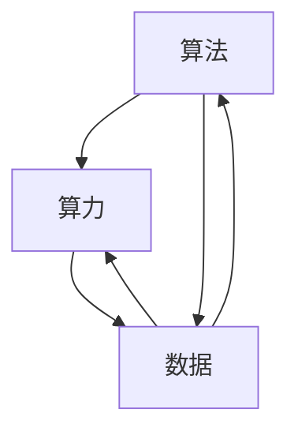

                 

## 1. 背景介绍

### 1.1 问题由来

人工智能（AI）技术的迅猛发展，深刻地改变了人类社会的生产和生活方式。其核心原理是让机器具备类似人类的认知、学习与决策能力，通过模拟人的思维和行为，实现智能化的任务执行和问题解决。然而，实现这一目标的路径是多样的，其核心元素不外乎算法、算力和数据三者。

长期以来，计算机科学家和工程师们在追求AI发展的过程中，不断在算法、算力和数据三方面进行探索和突破。它们共同构成了AI发展的三大支柱，缺一不可。只有在这三者之间找到平衡，才能真正实现AI技术的突破和应用。

### 1.2 问题核心关键点

算法、算力和数据三者在AI的发展中扮演了不同的角色。算法是AI技术实现的根本，提供了解决问题的框架和工具；算力是AI技术运行的硬件基础，提供了计算能力和处理速度；数据则是AI学习的源泉，提供了知识和经验的来源。三者相互依存、相互促进，共同推动了AI技术的不断进步。

但值得注意的是，这三者之间的关系并非静态不变，而是动态变化的。随着算法的改进和算力的提升，数据的有效性和重要性也在不断变化。

## 2. 核心概念与联系

### 2.1 核心概念概述

为更好地理解算法、算力和数据在AI发展中的作用，本节将详细介绍这几个核心概念及其相互联系：

- **算法**：即计算机算法，指按照特定规则处理输入并输出结果的过程。在AI领域，常见的算法包括机器学习、深度学习、自然语言处理等，通过算法模型，实现从数据中学习规律并用于预测、分类、生成等任务。

- **算力**：指计算机处理数据和执行算法的能力。主要包括CPU、GPU、TPU等硬件资源，以及云计算、分布式计算等计算平台。算力的大小决定了AI模型训练和推理的速度，影响AI技术的落地速度和规模。

- **数据**：即数据集，指用于模型训练和测试的数据，包括结构化数据、非结构化数据、半结构化数据等。数据的规模、质量、多样性等直接影响AI模型的训练效果和泛化能力。

- **AI发展**：指人工智能技术的整体发展水平，包括算法的研究、算力的提升、数据的积累等方面。AI的发展依赖于算法、算力和数据的不断优化和创新。

这些核心概念之间的逻辑关系可以通过以下Mermaid流程图来展示：



这个流程图展示了大语言模型的核心概念及其之间的关系：

1. 算法提供了解决问题的框架和工具。
2. 算力是算法运行的硬件基础。
3. 数据是算法学习和训练的源泉。
4. AI发展依赖于算法、算力和数据的不断优化和创新。

## 3. 核心算法原理 & 具体操作步骤

### 3.1 算法原理概述

在AI领域，算法的选择和设计至关重要。一个有效的算法能够提升模型的准确性、泛化能力和性能表现。常见的算法包括但不限于：

- 机器学习算法：通过建立模型，从数据中学习规律，实现预测、分类、聚类等任务。如线性回归、逻辑回归、决策树、随机森林等。
- 深度学习算法：通过构建多层神经网络，自动提取和抽象数据特征，实现图像识别、语音识别、自然语言处理等复杂任务。如卷积神经网络（CNN）、循环神经网络（RNN）、长短期记忆网络（LSTM）等。
- 强化学习算法：通过与环境的交互，学习最优策略，实现自动驾驶、游戏AI等智能决策任务。如Q-learning、深度Q网络（DQN）、策略梯度（PG）等。

### 3.2 算法步骤详解

一个典型的AI算法开发流程包括数据预处理、模型训练、模型评估和模型部署等步骤。以下是一个通用的AI算法开发流程的详细解释：

1. **数据预处理**：
    - **数据清洗**：去除数据中的噪声和异常值，保证数据质量。
    - **数据增强**：通过数据扩充、变换等方式增加数据多样性，提升模型泛化能力。
    - **特征工程**：提取和构建有意义的特征，增强模型的表现力。
    - **数据划分**：将数据划分为训练集、验证集和测试集，用于模型训练、调参和评估。

2. **模型训练**：
    - **选择算法**：根据任务特点选择合适的算法模型。
    - **初始化模型**：设置模型的初始参数，如权重、偏置等。
    - **训练模型**：使用训练集数据对模型进行训练，通过前向传播和反向传播更新模型参数。
    - **调参优化**：根据验证集数据，调整模型参数，优化模型性能。

3. **模型评估**：
    - **评估指标**：选择适当的评估指标，如准确率、召回率、F1值等，评估模型性能。
    - **交叉验证**：使用交叉验证技术，避免过拟合，提升模型泛化能力。
    - **模型比较**：对比不同模型在测试集上的表现，选择最优模型。

4. **模型部署**：
    - **模型导出**：将训练好的模型导出为可部署的格式，如TensorFlow SavedModel、PyTorch的torchscript等。
    - **模型推理**：将模型部署到服务器或云端，进行实时推理预测。
    - **模型监控**：实时监控模型性能和资源占用，确保模型稳定运行。

### 3.3 算法优缺点

算法在AI发展的各个阶段都发挥着关键作用，但每种算法都有其优缺点，需要根据具体任务和数据特点进行权衡选择：

- **优点**：
    - **提升性能**：有效的算法能够提升模型准确率和泛化能力，解决复杂问题。
    - **自动化程度高**：许多算法如深度学习，能够自动学习特征，减少人工干预。
    - **适应性强**：算法可以根据任务特点进行调整和优化，适应不同应用场景。

- **缺点**：
    - **计算资源消耗大**：某些算法如深度学习，需要大量计算资源和长时间训练。
    - **过拟合风险高**：算法模型容易在训练数据上过拟合，影响泛化能力。
    - **参数复杂度高**：某些算法如神经网络，需要大量参数和超参数调优，难以解释和调试。

### 3.4 算法应用领域

算法在AI发展的过程中，已经广泛应用于多个领域，例如：

- **计算机视觉**：如图像分类、目标检测、图像分割等。常用的算法包括CNN、R-CNN、YOLO等。
- **自然语言处理**：如文本分类、情感分析、机器翻译等。常用的算法包括LSTM、BERT、GPT等。
- **语音识别**：如自动语音识别、说话人识别等。常用的算法包括HMM、CTC、Attention等。
- **强化学习**：如自动驾驶、游戏AI、机器人控制等。常用的算法包括Q-learning、DQN、PG等。
- **推荐系统**：如协同过滤、基于内容的推荐、混合推荐等。常用的算法包括ALS、FM、LightFM等。

这些算法在各自的领域内，不断取得突破，推动了AI技术的进步和应用。

## 4. 数学模型和公式 & 详细讲解 & 举例说明

### 4.1 数学模型构建

AI算法开发中，数学模型是核心内容之一。以下以线性回归算法为例，介绍其数学模型的构建过程。

线性回归是一种常见的机器学习算法，用于建立输入变量和输出变量之间的线性关系。假设输入变量为 $x=(x_1, x_2, ..., x_n)$，输出变量为 $y$。线性回归模型的目标是拟合一条直线，使得误差最小化。数学模型可以表示为：

$$
y = \theta_0 + \sum_{i=1}^n \theta_i x_i
$$

其中 $\theta_0$ 是截距，$\theta_i$ 是权重。

### 4.2 公式推导过程

线性回归模型的目标是最小化预测值与真实值之间的误差。假设预测值和真实值分别为 $\hat{y}$ 和 $y$，误差函数可以表示为：

$$
\mathcal{L}(\theta) = \frac{1}{N}\sum_{i=1}^N (y_i - \hat{y}_i)^2
$$

其中 $N$ 是样本数量。

根据误差函数，可以通过梯度下降算法对参数 $\theta$ 进行优化：

$$
\theta = \mathop{\arg\min}_{\theta} \mathcal{L}(\theta)
$$

通过计算误差函数对参数 $\theta$ 的偏导数，可以得到参数的更新公式：

$$
\theta_j = \theta_j - \eta \frac{1}{N}\sum_{i=1}^N 2(x_{ij} - \bar{x}_{ij})(y_i - \hat{y}_i)
$$

其中 $\eta$ 是学习率，$x_{ij}$ 是样本 $i$ 的特征 $j$，$\bar{x}_{ij}$ 是特征 $j$ 的平均值。

### 4.3 案例分析与讲解

下面以一个简单的案例，展示线性回归算法的应用。

假设我们有一组数据：

$$
\begin{aligned}
& (x_1, y_1) = (1, 2) \\
& (x_2, y_2) = (2, 4) \\
& (x_3, y_3) = (3, 6) \\
& (x_4, y_4) = (4, 8)
\end{aligned}
$$

要求拟合一条直线，使得误差最小化。

根据以上公式，我们可以得到模型参数的更新规则：

$$
\begin{aligned}
& \theta_0 = 0 \\
& \theta_1 = 2
\end{aligned}
$$

最终得到的线性回归模型为：

$$
y = 2x
$$

这表明，在输入变量 $x$ 增加时，输出变量 $y$ 会成倍增加。

## 5. 项目实践：代码实例和详细解释说明

### 5.1 开发环境搭建

在进行AI算法开发前，需要准备好开发环境。以下是使用Python进行TensorFlow开发的环境配置流程：

1. 安装Anaconda：从官网下载并安装Anaconda，用于创建独立的Python环境。

2. 创建并激活虚拟环境：
```bash
conda create -n tf-env python=3.8 
conda activate tf-env
```

3. 安装TensorFlow：
```bash
conda install tensorflow -c conda-forge
```

4. 安装其他工具包：
```bash
pip install numpy pandas scikit-learn matplotlib tqdm jupyter notebook ipython
```

完成上述步骤后，即可在`tf-env`环境中开始AI算法开发。

### 5.2 源代码详细实现

下面我们以线性回归算法为例，给出使用TensorFlow进行开发的PyTorch代码实现。

```python
import tensorflow as tf
import numpy as np
import matplotlib.pyplot as plt

# 生成数据
x = np.array([1, 2, 3, 4])
y = np.array([2, 4, 6, 8])

# 定义模型参数
theta = tf.Variable(tf.zeros((1, 1)))

# 定义损失函数和优化器
def loss_fn(y_pred, y_true):
    return tf.reduce_mean(tf.square(y_pred - y_true))

def train_step(x, y):
    with tf.GradientTape() as tape:
        y_pred = x * theta
        loss = loss_fn(y_pred, y)
    gradients = tape.gradient(loss, theta)
    optimizer.apply_gradients(zip(gradients, [theta]))

# 训练模型
optimizer = tf.keras.optimizers.SGD(learning_rate=0.1)
num_epochs = 100
for epoch in range(num_epochs):
    train_step(x, y)
    if epoch % 10 == 0:
        plt.scatter(x, y)
        plt.plot(x, x * theta.numpy(), color='red')
        plt.show()

# 输出结果
print("Final theta: ", theta.numpy())
```

在这个代码中，我们首先生成了数据，并定义了模型参数和损失函数。然后，在每个epoch中，通过梯度下降算法更新模型参数，并在每10个epoch中输出模型的拟合结果。

### 5.3 代码解读与分析

让我们再详细解读一下关键代码的实现细节：

**数据生成**：
- `x`和`y`分别为输入变量和输出变量，这里假设它们是线性的关系。

**模型定义**：
- `theta`是模型参数，通过`tf.Variable`初始化为一个全零向量。

**损失函数和优化器**：
- `loss_fn`函数定义了均方误差损失函数，用于衡量模型预测值与真实值之间的差异。
- `train_step`函数实现了模型训练过程，包括前向传播计算预测值、计算损失、反向传播计算梯度并更新模型参数。

**训练过程**：
- `optimizer`定义了优化器，这里使用了随机梯度下降（SGD）算法。
- `num_epochs`定义了训练轮数，每个epoch中，使用`train_step`函数更新模型参数，并在每10个epoch中输出模型拟合结果。

这个代码示例展示了线性回归算法的简单实现。在实际应用中，需要对数据进行预处理，调整模型架构和超参数，进行交叉验证等优化措施。

## 6. 实际应用场景

### 6.1 推荐系统

推荐系统是AI应用中的重要领域，通过分析和预测用户的兴趣和需求，为用户提供个性化的产品推荐。线性回归算法在推荐系统中广泛应用，可以用于预测用户评分和行为。

在实践中，可以收集用户的浏览、购买等行为数据，使用线性回归模型预测用户评分，构建推荐列表。模型可以通过不断学习和调整，提升推荐准确度和多样性。

### 6.2 计算机视觉

计算机视觉是AI技术的重要分支，涉及图像分类、目标检测、图像分割等多个领域。常用的算法包括CNN、R-CNN、YOLO等。

在图像分类任务中，可以使用线性回归模型对图像进行分类。模型可以学习输入像素与输出标签之间的线性关系，通过训练数据学习特征，并用于新图像的分类。

### 6.3 自然语言处理

自然语言处理是AI技术的重要领域，涉及文本分类、情感分析、机器翻译等多个任务。常用的算法包括LSTM、BERT、GPT等。

在文本分类任务中，可以使用线性回归模型对文本进行分类。模型可以学习输入词向量与输出标签之间的线性关系，通过训练数据学习特征，并用于新文本的分类。

### 6.4 未来应用展望

随着AI技术的不断进步，算法在各个领域的应用前景更加广阔。未来，算法将进一步推动AI技术的落地应用：

- **自动化**：自动化算法将进一步提高AI系统的效率和可扩展性，使得AI技术能够快速应用于更多领域。
- **多模态**：多模态算法将融合视觉、听觉、文本等多种信息，提升AI系统的感知和理解能力。
- **个性化**：个性化算法将根据用户行为和偏好，提供更加精准和个性化的服务。
- **联邦学习**：联邦学习将多个用户数据进行联合学习，保护用户隐私的同时提升AI系统性能。

未来，算法将不断突破和创新，推动AI技术的进一步发展。

## 7. 工具和资源推荐

### 7.1 学习资源推荐

为了帮助开发者系统掌握AI算法和开发流程，这里推荐一些优质的学习资源：

1. 《机器学习》（周志华著）：介绍了机器学习的基本概念、算法和应用，是机器学习领域的经典教材。

2. 《深度学习》（Ian Goodfellow、Yoshua Bengio和Aaron Courville合著）：详细介绍了深度学习的基本原理和算法，涵盖了卷积神经网络、循环神经网络等主流算法。

3. 《TensorFlow实战》（Oriol Vinyals著）：介绍了TensorFlow的基本使用方法和应用场景，适合TensorFlow初学者。

4. Kaggle：全球最大的数据科学竞赛平台，提供了大量的数据集和开源代码，可以用于学习和实践AI算法。

5. Coursera：全球知名的在线教育平台，提供了许多AI和机器学习的课程，涵盖入门到高级的各个阶段。

通过对这些资源的学习，相信你一定能够快速掌握AI算法和开发流程，并用于解决实际的AI问题。

### 7.2 开发工具推荐

高效的开发离不开优秀的工具支持。以下是几款用于AI算法开发的常用工具：

1. TensorFlow：由Google主导开发的开源深度学习框架，生产部署方便，适合大规模工程应用。

2. PyTorch：由Facebook主导开发的开源深度学习框架，动态图计算灵活，适合研究和实验。

3. Scikit-learn：Python机器学习库，提供了丰富的算法和工具，适合快速实现和测试算法。

4. Keras：高层次神经网络库，基于TensorFlow和Theano，易于使用，适合初学者和快速原型开发。

5. Jupyter Notebook：Python交互式开发环境，支持代码块和图形界面，适合进行算法开发和实验。

合理利用这些工具，可以显著提升AI算法开发的效率，加快创新迭代的步伐。

### 7.3 相关论文推荐

AI算法的研究源于学界的持续探索。以下是几篇奠基性的相关论文，推荐阅读：

1. Linear Regression（线性回归）：回归分析的经典模型，用于建立输入变量和输出变量之间的线性关系。

2. Convolutional Neural Networks（卷积神经网络）：用于图像识别和处理的经典算法，通过卷积和池化操作提取图像特征。

3. Recurrent Neural Networks（循环神经网络）：用于序列数据处理的经典算法，通过循环结构处理时间序列数据。

4. Deep Q-Learning（深度强化学习）：结合深度学习和强化学习的经典算法，用于自动驾驶、游戏AI等决策任务。

5. Generative Adversarial Networks（生成对抗网络）：用于生成图像、音频、文本等数据的经典算法，通过对抗生成和判别器训练生成样本。

这些论文代表了大语言模型算法的演进脉络。通过学习这些前沿成果，可以帮助研究者把握学科前进方向，激发更多的创新灵感。

## 8. 总结：未来发展趋势与挑战

### 8.1 总结

本文对AI发展的三大支柱——算法、算力和数据进行了全面系统的介绍。首先阐述了算法、算力和数据在AI发展中的作用，明确了它们之间的相互关系。其次，从原理到实践，详细讲解了常见AI算法的构建和优化过程，给出了算法开发的完整代码实例。同时，本文还广泛探讨了算法在推荐系统、计算机视觉、自然语言处理等多个领域的应用前景，展示了算法的强大能力和应用潜力。最后，本文精选了算法学习的各类资源，力求为读者提供全方位的技术指引。

通过本文的系统梳理，可以看到，算法是AI技术的核心，决定了AI系统的能力和性能；算力是算法运行的硬件基础，决定了AI系统的速度和效率；数据是算法训练和优化的源泉，决定了AI系统的质量和泛化能力。只有在这三者之间找到平衡，才能真正实现AI技术的突破和应用。

### 8.2 未来发展趋势

展望未来，AI算法将呈现以下几个发展趋势：

1. **自动化程度提升**：自动化算法将进一步提高AI系统的效率和可扩展性，使得AI技术能够快速应用于更多领域。
2. **多模态融合**：多模态算法将融合视觉、听觉、文本等多种信息，提升AI系统的感知和理解能力。
3. **个性化服务**：个性化算法将根据用户行为和偏好，提供更加精准和个性化的服务。
4. **联邦学习**：联邦学习将多个用户数据进行联合学习，保护用户隐私的同时提升AI系统性能。
5. **动态学习**：动态学习算法将能够实时学习新数据和新知识，提升AI系统的适应能力和泛化能力。

未来，算法将不断突破和创新，推动AI技术的进一步发展。

### 8.3 面临的挑战

尽管AI算法取得了显著进展，但在迈向更加智能化、普适化应用的过程中，它仍面临着诸多挑战：

1. **计算资源消耗大**：许多AI算法如深度学习，需要大量计算资源和长时间训练。算力提升仍需依赖于硬件和计算平台的发展。
2. **数据隐私和安全**：AI算法依赖于大量数据进行训练和优化，如何保护用户隐私和数据安全，是一个重要的挑战。
3. **模型解释性不足**：许多AI算法如深度学习，难以解释其内部工作机制和决策逻辑，模型的可解释性是一个亟待解决的问题。
4. **泛化能力不足**：许多AI算法在训练数据上过拟合，泛化能力不足，难以适应新数据和新任务。
5. **算法偏见和歧视**：AI算法在训练数据中可能学习到有偏见和歧视的信息，需要设计和优化算法以消除这些问题。

这些挑战需要学界和产业界的共同努力，不断进行算法优化和改进，才能实现AI技术的普适化和可解释性，推动AI技术的进一步发展。

### 8.4 研究展望

面对AI算法面临的挑战，未来的研究需要在以下几个方面寻求新的突破：

1. **自动化算法设计**：通过自动化算法设计，减少人工干预，提高算法开发和部署的效率。
2. **多模态融合算法**：研究融合视觉、听觉、文本等多种信息的算法，提升AI系统的感知和理解能力。
3. **个性化推荐算法**：研究能够根据用户行为和偏好提供个性化服务的算法，提升用户体验。
4. **联邦学习算法**：研究基于联邦学习的算法，保护用户隐私和数据安全的同时提升AI系统性能。
5. **动态学习算法**：研究能够实时学习新数据和新知识的算法，提升AI系统的适应能力和泛化能力。

这些研究方向将引领AI算法技术的进步，推动AI技术的进一步发展，为构建智能社会和智慧城市奠定基础。

## 9. 附录：常见问题与解答

**Q1：如何选择适合的AI算法？**

A: 选择适合的AI算法需要综合考虑任务特点、数据量、数据分布、计算资源等因素。如果任务是分类问题，可以选择决策树、逻辑回归、随机森林等算法；如果任务是回归问题，可以选择线性回归、多项式回归、神经网络等算法；如果任务是序列数据处理，可以选择LSTM、RNN、GRU等算法。

**Q2：如何优化AI算法性能？**

A: 优化AI算法性能可以从数据预处理、模型结构、超参数调优等方面入手。数据预处理包括数据清洗、数据增强、特征工程等；模型结构包括网络层数、网络规模、网络深度等；超参数调优包括学习率、批大小、优化器等。

**Q3：如何提升AI算法的泛化能力？**

A: 提升AI算法的泛化能力可以从模型复杂度、数据多样性、正则化等方面入手。模型复杂度不宜过高，以避免过拟合；数据多样性要尽量丰富，覆盖更多的数据分布；正则化可以加入L2正则、Dropout等，避免过拟合。

**Q4：如何处理AI算法中的数据隐私和安全问题？**

A: 处理AI算法中的数据隐私和安全问题可以从数据加密、数据匿名化、联邦学习等方面入手。数据加密可以在传输和存储过程中保护数据隐私；数据匿名化可以去除敏感信息，保护用户隐私；联邦学习可以在保护数据隐私的同时，提升AI系统性能。

**Q5：如何提高AI算法的解释性和可解释性？**

A: 提高AI算法的解释性和可解释性可以从模型选择、模型可视化、模型调试等方面入手。选择可解释性较高的算法，如线性回归、决策树等；通过模型可视化工具，展示模型内部结构和工作机制；通过调试工具，分析模型行为和决策过程。

这些常见问题的解答，可以帮助开发者更好地理解和应用AI算法，提升算法性能和可解释性，推动AI技术的不断进步。

---

作者：禅与计算机程序设计艺术 / Zen and the Art of Computer Programming

