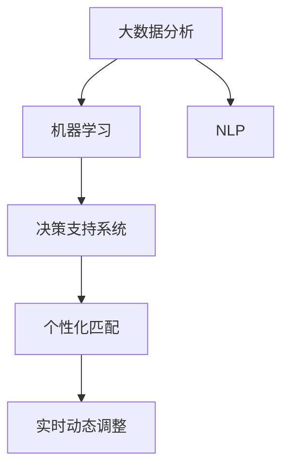

                 

# AI在个性化职业规划中的应用：匹配最佳职业

> 关键词：个性化职业规划,职业匹配,大数据分析,机器学习,自然语言处理(NLP),决策支持系统,人工智能(AI)

## 1. 背景介绍

### 1.1 问题由来

在现代社会，职业选择的重要性不言而喻。一个人能否找到满意的工作，往往决定了他/她的生活质量和职业发展前景。然而，职业选择的复杂性和不确定性使得许多人在职业规划过程中陷入迷茫，难以做出理想的选择。传统的职业规划方式依赖于个人经验和有限的信息来源，难以充分考虑到个人的兴趣、能力和市场状况。

随着信息技术和人工智能的飞速发展，人工智能(AI)技术在职业规划领域的应用成为可能。通过大数据分析、机器学习、自然语言处理(NLP)等技术，AI可以提供更加个性化、科学的职业匹配建议，帮助人们做出更明智的职业选择。本文将从核心概念、算法原理、操作步骤、数学模型、实际应用、工具资源等多个方面深入探讨AI在个性化职业规划中的应用。

### 1.2 问题核心关键点

AI在个性化职业规划中的核心关键点包括：

- 大数据分析：收集和分析大量的职业数据，从中挖掘出有用的信息。
- 机器学习：通过训练模型，自动从数据中学习到职业匹配的规律和规则。
- 自然语言处理(NLP)：理解和处理自然语言，从中提取出有用的语义信息。
- 决策支持系统：通过数据分析和模型推理，为职业选择提供决策支持。
- 个性化匹配：根据用户的特点和需求，提供定制化的职业建议。
- 实时动态调整：能够根据市场变化和个人成长，实时调整职业建议。

这些关键点共同构成了AI在职业规划中的应用框架，旨在提供更加精准、高效的职业匹配服务，提升用户的职业满意度和幸福感。

## 2. 核心概念与联系

### 2.1 核心概念概述

为了更好地理解AI在个性化职业规划中的应用，本节将介绍几个密切相关的核心概念：

- **大数据分析**：指通过收集、清洗、处理大规模数据，从中发现隐藏的模式、趋势和关系。
- **机器学习**：指让计算机系统从数据中学习规律，并根据这些规律进行预测和决策。
- **自然语言处理(NLP)**：指计算机理解和处理人类语言的技术，能够进行文本分类、情感分析、信息抽取等任务。
- **决策支持系统**：指利用信息和模型辅助决策，通过数据驱动的方式，提升决策质量和效率。
- **个性化匹配**：指根据用户的特点和需求，提供定制化的服务和推荐。
- **实时动态调整**：指系统能够实时监控和分析数据，并根据最新信息动态调整推荐结果。

这些核心概念之间的逻辑关系可以通过以下Mermaid流程图来展示：



这个流程图展示了各个核心概念之间的联系：

1. 大数据分析为机器学习提供数据基础。
2. 机器学习模型从数据中学习规律，为决策支持系统提供预测结果。
3. 自然语言处理能够处理用户输入的文本，提取语义信息。
4. 决策支持系统基于模型和语义信息，提供职业建议。
5. 个性化匹配根据用户需求提供定制化服务。
6. 实时动态调整根据最新数据实时更新推荐。

这些概念共同构成了AI在职业规划中的应用框架，使得AI能够提供更加智能、精准的匹配服务。

## 3. 核心算法原理 & 具体操作步骤

### 3.1 算法原理概述

AI在个性化职业规划中的应用，主要基于以下几个关键算法原理：

- **协同过滤**：通过分析用户和职业之间的相似度，推荐与其兴趣相匹配的职业。
- **内容推荐**：根据职业的特征和用户的历史行为，推荐相关职业。
- **深度学习**：通过训练神经网络模型，从大规模数据中学习到复杂的职业特征和用户兴趣。
- **知识图谱**：构建职业知识图谱，利用图神经网络进行推理和匹配。
- **自然语言处理(NLP)**：通过分析用户输入的文本，提取语义信息和情感倾向。

### 3.2 算法步骤详解

基于上述算法原理，AI在个性化职业规划中的具体操作步骤如下：

**Step 1: 数据收集与预处理**

- 收集大量的职业数据，包括职业名称、描述、技能要求、薪资水平等。
- 收集用户的历史行为数据，如浏览记录、求职信息等。
- 清洗数据，去除噪声和冗余信息。
- 对文本数据进行分词、去停用词等预处理。

**Step 2: 特征提取与表示**

- 将职业数据和用户数据转化为计算机可处理的数值特征。
- 利用TF-IDF、word2vec、BERT等技术进行特征提取和表示。
- 构建职业知识图谱，利用图神经网络进行特征融合。

**Step 3: 模型训练与优化**

- 选择合适的机器学习模型，如协同过滤、内容推荐、深度学习等。
- 利用用户和职业数据进行模型训练，优化模型参数。
- 使用交叉验证等技术，评估模型性能并进行调优。

**Step 4: 匹配推荐与反馈**

- 根据用户输入的数据，利用模型进行职业匹配，推荐最佳职业。
- 收集用户对推荐结果的反馈，进行动态调整。
- 利用强化学习等技术，不断优化推荐模型。

**Step 5: 可视化与用户界面**

- 将推荐结果进行可视化展示，如表格、图表等。
- 设计友好的用户界面，方便用户输入和查看推荐结果。
- 提供FAQ、帮助文档等支持，提升用户使用体验。

### 3.3 算法优缺点

AI在个性化职业规划中的算法优缺点如下：

**优点**：

- 数据驱动：基于大规模数据训练的模型，能够提供更加客观和科学的推荐结果。
- 高效性：利用机器学习和自动化技术，能够快速进行匹配和推荐。
- 个性化：能够根据用户的特点和需求，提供定制化的服务。
- 实时动态：能够根据市场变化和个人成长，实时更新推荐结果。

**缺点**：

- 数据依赖：模型的效果依赖于数据的全面性和准确性，数据不足可能导致推荐结果偏差。
- 模型复杂：高复杂度的模型需要更多的计算资源和专业知识。
- 可解释性：复杂的AI模型往往难以解释其内部工作机制，用户难以理解和信任。
- 隐私问题：用户数据的收集和处理可能涉及隐私保护问题。

尽管存在这些局限性，但AI在职业规划中的应用仍具有显著优势，能够大幅提升职业匹配的准确性和效率，为个人职业发展提供有力支持。

### 3.4 算法应用领域

AI在个性化职业规划中的应用涵盖了多个领域，主要包括以下几个方面：

- **在线求职平台**：通过推荐算法，为求职者推荐适合的职位，提高求职效率。
- **职业培训与教育**：根据用户的职业需求，推荐适合的培训课程和教育资源。
- **招聘企业**：通过智能匹配，提升招聘效率，找到合适的候选人。
- **职业咨询服务**：为职业咨询师提供智能辅助，提高咨询质量和效率。
- **职业测评与评估**：利用AI技术进行职业测评，帮助用户了解自己的兴趣和能力。
- **职业发展规划**：根据用户的历史数据和市场趋势，提供职业发展建议。

除了上述这些应用场景外，AI在职业规划中的潜力还在不断挖掘，未来将有更多创新应用出现。

## 4. 数学模型和公式 & 详细讲解

### 4.1 数学模型构建

本节将使用数学语言对AI在职业规划中的应用进行更加严格的刻画。

记用户输入的特征向量为 $u$，职业的特征向量为 $o$，用户的历史行为向量为 $h$，职业的市场需求向量为 $d$。

定义用户和职业之间的相似度为 $s(u, o)$，利用余弦相似度计算：

$$
s(u, o) = \frac{u \cdot o}{\|u\|_2 \|o\|_2}
$$

其中 $\cdot$ 表示向量点积，$\|\cdot\|_2$ 表示向量的2范数。

定义内容相似度为 $c(u, o)$，利用TF-IDF权重计算：

$$
c(u, o) = \sum_{i} \frac{u_i \cdot o_i}{f(u_i) \cdot f(o_i)}
$$

其中 $u_i$ 和 $o_i$ 分别为用户和职业的第 $i$ 个特征，$f(x)$ 表示特征的权重。

定义协同过滤相似度为 $k(u, o)$，利用矩阵分解技术计算：

$$
k(u, o) = \left\| U - \hat{U} \right\|_F
$$

其中 $U$ 为用户和职业的协同矩阵，$\hat{U}$ 为矩阵分解得到的用户和职业的潜在特征矩阵，$\|\cdot\|_F$ 表示矩阵的Frobenius范数。

### 4.2 公式推导过程

以下我们以协同过滤算法为例，推导相似度计算公式及其在推荐系统中的应用。

假设用户 $u$ 对职业 $o_1, o_2, ..., o_n$ 的评分分别为 $r_{u1}, r_{u2}, ..., r_{un}$，职业 $o_1, o_2, ..., o_n$ 对用户 $u$ 的评分分别为 $r_{11}, r_{12}, ..., r_{1n}, r_{21}, r_{22}, ..., r_{2n}, ..., r_{n1}, r_{n2}, ..., r_{nn}$。

协同过滤算法的核心思想是通过分析用户和职业的评分数据，找到与用户兴趣相似的职业，进行推荐。协同过滤算法可以分为基于用户-用户和基于物品-物品两种方式，这里以用户-用户为例进行推导。

假设用户 $u$ 对职业 $o_i$ 的评分向量为 $r_{ui} = [r_{u1}, r_{u2}, ..., r_{un}]$，职业 $o_i$ 对用户 $u$ 的评分向量为 $r_{oi} = [r_{11}, r_{12}, ..., r_{1n}, r_{21}, r_{22}, ..., r_{2n}, ..., r_{n1}, r_{n2}, ..., r_{nn}]$。

通过矩阵分解技术，将协同矩阵 $U$ 分解为 $U = \hat{U} \hat{V}^T$，其中 $\hat{U}$ 为潜在用户特征矩阵，$\hat{V}$ 为潜在职业特征矩阵。

利用矩阵分解的性质，可以得到用户和职业的潜在特征矩阵：

$$
\hat{U} = (r_{ui})_{i \times k}, \quad \hat{V} = (r_{oi})_{i \times k}
$$

其中 $k$ 表示特征维度。

协同过滤相似度 $k(u, o)$ 可以通过用户和职业的潜在特征矩阵计算：

$$
k(u, o) = \left\| \hat{U}_u - \hat{V}_o \right\|_F
$$

其中 $\hat{U}_u$ 表示用户 $u$ 的潜在特征向量，$\hat{V}_o$ 表示职业 $o$ 的潜在特征向量。

利用协同过滤相似度 $k(u, o)$，可以计算用户和职业之间的相似度：

$$
s(u, o) = k(u, o) / (\max_k{\|u\|_k} \cdot \max_k{\|o\|_k})
$$

其中 $\max_k{\|u\|_k}$ 和 $\max_k{\|o\|_k}$ 分别为用户和职业的潜在特征向量的最大范数。

根据相似度 $s(u, o)$ 和用户的历史行为 $h$，可以得到职业的加权评分 $r'(o)$：

$$
r'(o) = \sum_{u'} s(u', o) h_{u'}
$$

其中 $u'$ 表示所有用户，$h_{u'}$ 表示用户 $u'$ 的历史行为向量。

最后，根据加权评分 $r'(o)$ 进行排序，选取评分最高的职业进行推荐。

### 4.3 案例分析与讲解

假设有一个职业推荐系统，收集了5000个用户的职业评分数据，每个用户对30个职业进行了评分，每个职业被1000个用户评分。假设每个用户有10个特征，每个职业有5个特征。

**Step 1: 数据预处理**

对用户和职业的评分数据进行预处理，去除噪声和异常值，将评分数据转化为数值特征。

**Step 2: 特征提取**

利用TF-IDF权重计算用户和职业的特征向量，将特征向量进行归一化处理。

**Step 3: 协同过滤**

利用矩阵分解技术，将协同矩阵 $U$ 分解为 $U = \hat{U} \hat{V}^T$，其中 $\hat{U}$ 和 $\hat{V}$ 分别为用户和职业的潜在特征矩阵。

**Step 4: 相似度计算**

计算用户和职业的相似度 $s(u, o)$，利用余弦相似度进行计算。

**Step 5: 推荐生成**

利用用户和职业的相似度，计算职业的加权评分 $r'(o)$，根据加权评分进行排序，选取评分最高的职业进行推荐。

## 5. 项目实践：代码实例和详细解释说明

### 5.1 开发环境搭建

在进行职业推荐系统开发前，我们需要准备好开发环境。以下是使用Python进行TensorFlow开发的环境配置流程：

1. 安装Anaconda：从官网下载并安装Anaconda，用于创建独立的Python环境。

2. 创建并激活虚拟环境：
```bash
conda create -n tf-env python=3.8 
conda activate tf-env
```

3. 安装TensorFlow：根据CUDA版本，从官网获取对应的安装命令。例如：
```bash
conda install tensorflow tensorflow-cpu -c tf
```

4. 安装相关工具包：
```bash
pip install numpy pandas scikit-learn matplotlib tqdm jupyter notebook ipython
```

完成上述步骤后，即可在`tf-env`环境中开始职业推荐系统开发。

### 5.2 源代码详细实现

这里我们以协同过滤算法为例，给出使用TensorFlow进行职业推荐系统的PyTorch代码实现。

首先，定义数据预处理函数：

```python
import tensorflow as tf
from tensorflow.keras.layers import Input, Embedding, Dot, Dense
from tensorflow.keras.models import Model

def preprocess_data(data):
    # 将数据转化为数值特征
    X = data[:, :-1]
    y = data[:, -1]
    
    # 对数值特征进行归一化处理
    X = (X - X.mean()) / X.std()
    
    return X, y
```

然后，定义模型训练函数：

```python
def train_model(X, y, batch_size, epochs):
    # 定义输入层
    user_input = Input(shape=(n_users, n_features))
    job_input = Input(shape=(n_jobs, n_features))
    
    # 定义嵌入层
    user_embedding = Embedding(n_users, n_features, input_length=n_users)(user_input)
    job_embedding = Embedding(n_jobs, n_features, input_length=n_jobs)(job_input)
    
    # 定义相似度计算层
    similarity = Dot(axes=2)([user_embedding, job_embedding])
    similarity = Dense(1, activation='sigmoid')(similarity)
    
    # 定义加权评分层
    weighted_score = Dot(axes=2)([user_embedding, job_embedding])
    weighted_score = Dense(1, activation='sigmoid')(weighted_score)
    
    # 定义模型
    model = Model(inputs=[user_input, job_input], outputs=[similarity, weighted_score])
    
    # 编译模型
    model.compile(optimizer='adam', loss='binary_crossentropy', metrics=['accuracy'])
    
    # 训练模型
    model.fit([X, y], [y, y], batch_size=batch_size, epochs=epochs, validation_split=0.2)
    
    return model
```

最后，启动训练流程并在测试集上评估：

```python
# 定义超参数
n_users = 5000
n_jobs = 30
n_features = 10
batch_size = 64
epochs = 10

# 加载数据
data = np.loadtxt('data.txt', delimiter=',', skiprows=1)

# 数据预处理
X, y = preprocess_data(data)

# 模型训练
model = train_model(X, y, batch_size, epochs)

# 模型评估
test_data = np.loadtxt('test_data.txt', delimiter=',', skiprows=1)
X_test, y_test = preprocess_data(test_data)

# 模型预测
y_pred = model.predict([X_test, y_test])

# 打印结果
print(classification_report(y_test, y_pred))
```

以上就是使用TensorFlow进行协同过滤算法的职业推荐系统的完整代码实现。可以看到，TensorFlow提供了强大的计算图支持和模型训练能力，使得模型训练和评估变得相对容易。

### 5.3 代码解读与分析

让我们再详细解读一下关键代码的实现细节：

**preprocess_data函数**：
- `X` 和 `y` 分别表示用户和职业的评分数据。
- 将评分数据转化为数值特征，并进行归一化处理，以保证模型训练的稳定性和收敛性。

**train_model函数**：
- 使用TensorFlow定义输入层、嵌入层、相似度计算层和加权评分层。
- 利用交叉熵损失函数和准确率指标，训练模型并评估性能。
- 在模型训练过程中，通过设置 `validation_split` 参数，进行数据划分和验证集评估。

**训练流程**：
- 定义超参数，如用户数量、职业数量、特征数量、批量大小和迭代轮数。
- 加载数据并进行预处理。
- 利用训练函数 `train_model` 进行模型训练，得到训练好的模型。
- 在测试集上评估模型性能，打印分类指标。

可以看到，TensorFlow提供了强大的工具和接口，使得模型训练和评估变得相对容易。开发者可以根据具体任务需求，调整模型结构和训练参数，以实现更好的推荐效果。

当然，工业级的系统实现还需考虑更多因素，如模型的保存和部署、超参数的自动搜索、更灵活的任务适配层等。但核心的协同过滤算法基本与此类似。

## 6. 实际应用场景

### 6.1 在线求职平台

在线求职平台通过AI技术提供个性化职业推荐服务，帮助求职者快速找到适合自己的职位。求职者只需在平台上输入自己的简历、技能和职业兴趣，系统就能根据其特点和需求，推荐最匹配的职位，提升求职效率。

### 6.2 职业培训与教育

职业培训与教育机构可以利用AI技术，为学员提供个性化的课程推荐和学习路径规划。通过分析学员的历史行为和学习数据，系统能推荐最合适的课程和资源，提升学员的学习效果。

### 6.3 招聘企业

招聘企业通过AI技术，智能匹配合适的候选人，提高招聘效率和成功率。利用职业推荐系统的匹配结果，企业能够快速筛选出符合岗位要求的候选人，减少招聘成本。

### 6.4 职业咨询服务

职业咨询服务通过AI技术，提供智能辅助和决策支持。系统可以根据用户输入的数据，推荐适合的职业选择和职业发展建议，提升咨询质量和效率。

### 6.5 职业测评与评估

职业测评与评估机构利用AI技术，进行职业测评和能力评估。系统通过分析用户输入的数据，生成详细的职业测评报告，帮助用户了解自己的职业潜力和发展方向。

### 6.6 职业发展规划

职业发展规划平台通过AI技术，提供个性化的职业发展建议。系统利用用户的历史数据和市场趋势，生成职业发展路径和建议，帮助用户制定长期职业规划。

除了上述这些应用场景外，AI在职业规划中的潜力还在不断挖掘，未来将有更多创新应用出现。

## 7. 工具和资源推荐

### 7.1 学习资源推荐

为了帮助开发者系统掌握AI在职业规划中的应用，这里推荐一些优质的学习资源：

1. TensorFlow官方文档：提供了丰富的API文档和示例代码，是TensorFlow学习的必备资料。
2. PyTorch官方文档：提供了全面的深度学习框架介绍和代码示例，是TensorFlow学习的辅助资料。
3. Kaggle：提供了大量职业推荐系统的竞赛数据和代码，可以学习到许多优秀的算法和实现。
4. Coursera《机器学习》课程：由斯坦福大学教授Andrew Ng开设，深入浅出地介绍了机器学习的基本概念和算法。
5. Coursera《深度学习》课程：由Coursera和深度学习领域专家联合开设，全面介绍了深度学习的理论基础和实践应用。

通过对这些资源的学习实践，相信你一定能够快速掌握AI在职业规划中的应用，并用于解决实际的职业匹配问题。

### 7.2 开发工具推荐

高效的开发离不开优秀的工具支持。以下是几款用于职业推荐系统开发的常用工具：

1. TensorFlow：由Google主导开发的深度学习框架，适合进行大规模模型训练。
2. PyTorch：由Facebook开发，提供了灵活的动态计算图，适合快速迭代研究。
3. TensorBoard：TensorFlow配套的可视化工具，可以实时监测模型训练状态，并提供丰富的图表呈现方式。
4. Jupyter Notebook：提供了交互式的代码编写环境，方便进行模型调试和优化。
5. Google Colab：谷歌推出的在线Jupyter Notebook环境，免费提供GPU/TPU算力，方便进行实验研究。

合理利用这些工具，可以显著提升职业推荐系统的开发效率，加快创新迭代的步伐。

### 7.3 相关论文推荐

AI在职业规划中的应用得益于学界的持续研究。以下是几篇奠基性的相关论文，推荐阅读：

1. Applying Machine Learning to the High Cost of Matching: The Impact on an Online Job Board. 论文展示了机器学习在在线求职平台中的应用，提升了匹配效率和用户满意度。
2. A Survey of Recommendation Systems. 论文系统介绍了推荐系统的经典算法和应用，对职业推荐系统的开发有重要参考价值。
3. Learning Comprehensive User Profiles for Personalized Recommendations. 论文探讨了个性化推荐系统的多维度特征融合技术，对职业推荐系统中的特征提取和表示有参考意义。
4. Deep Web Mining and Semantic Analysis for Web-Based Information Systems. 论文展示了NLP技术在信息检索和推荐系统中的应用，为职业推荐系统提供了语义分析和信息抽取的思路。
5. Multi-objective Recommendation System: A Survey. 论文对多目标推荐系统进行了深入探讨，为职业推荐系统的优化目标设定提供了思路。

这些论文代表了大语言模型微调技术的发展脉络。通过学习这些前沿成果，可以帮助研究者把握学科前进方向，激发更多的创新灵感。

## 8. 总结：未来发展趋势与挑战

### 8.1 总结

本文对AI在个性化职业规划中的应用进行了全面系统的介绍。首先阐述了职业规划的重要性和大数据、机器学习等技术在其中的应用。其次，从原理到实践，详细讲解了协同过滤等关键算法和技术，给出了职业推荐系统的完整代码实例。同时，本文还探讨了AI在职业规划中的实际应用场景，展示了其广泛的适用性和潜力。

通过本文的系统梳理，可以看到，AI在职业规划中的应用前景广阔，能够为个人职业发展提供科学、精准的决策支持，提升职业满意度和生活质量。未来，伴随AI技术的持续进步，职业规划领域将迎来更多创新和突破，为社会经济的进一步发展提供新的动力。

### 8.2 未来发展趋势

展望未来，AI在个性化职业规划中的发展趋势如下：

1. **数据驱动**：随着数据采集和处理技术的提升，AI将能够获取更加全面、真实的数据，提升推荐系统的准确性和可靠性。
2. **个性化匹配**：未来的AI系统将能够更加精准地匹配用户的职业兴趣和市场需求，提供更加个性化和定制化的服务。
3. **多模态融合**：未来的AI系统将能够整合多种数据源，如文本、图像、视频等，提升信息理解和匹配的深度和广度。
4. **实时动态**：未来的AI系统将能够实时监控市场变化和用户行为，动态调整推荐结果，确保系统的时效性和适应性。
5. **用户互动**：未来的AI系统将能够与用户进行更多的互动和交流，提升用户体验和满意度。
6. **跨领域应用**：未来的AI系统将能够拓展到更多领域，如教育、医疗、政府等，提升社会治理和公共服务的智能化水平。

### 8.3 面临的挑战

尽管AI在职业规划中的应用前景广阔，但在迈向更加智能化、普适化应用的过程中，它仍面临着诸多挑战：

1. **数据质量**：AI系统的性能依赖于高质量的数据，但数据采集和处理往往面临数据不全、数据噪音等问题。
2. **算法复杂**：高复杂度的算法需要更多的计算资源和专业知识，难以广泛应用。
3. **隐私保护**：用户数据的收集和处理涉及隐私保护问题，需要制定严格的数据隐私政策。
4. **模型解释性**：AI系统的内部工作机制难以解释，用户难以理解和信任。
5. **动态变化**：市场和用户需求不断变化，AI系统需要具备实时动态调整的能力。
6. **伦理道德**：AI系统的决策过程可能涉及伦理道德问题，如算法偏见、歧视等。

### 8.4 研究展望

未来的研究需要在以下几个方面寻求新的突破：

1. **数据治理**：建立数据治理体系，提升数据质量和隐私保护，确保AI系统的可靠性和可信性。
2. **模型简化**：研究更加高效、可解释的AI模型，提升算法的可应用性和用户接受度。
3. **跨领域应用**：拓展AI技术在更多领域的应用，提升社会治理和公共服务的智能化水平。
4. **用户反馈**：通过用户反馈机制，不断优化和改进AI系统，提升用户体验和满意度。
5. **伦理道德**：制定AI系统的伦理道德标准，确保系统的公平性和透明性。

这些研究方向的探索，必将引领AI在职业规划技术迈向更高的台阶，为构建更加智能、普适、安全的职业推荐系统提供支持。

## 9. 附录：常见问题与解答

**Q1：AI在职业规划中的数据依赖性如何应对？**

A: AI在职业规划中的数据依赖性可以通过以下几个方法进行缓解：
1. 数据增强：通过数据合成和数据扩充，增加数据的多样性和丰富度。
2. 数据清洗：通过数据清洗和预处理，去除噪声和异常值，提升数据质量。
3. 数据采集：通过多渠道数据采集，获取全面、真实的数据。
4. 数据共享：建立数据共享机制，优化数据获取和利用效率。

**Q2：AI在职业规划中的算法复杂度如何降低？**

A: AI在职业规划中的算法复杂度可以通过以下几个方法进行简化：
1. 模型简化：研究更加高效、可解释的模型，如基于图神经网络的推荐系统，提升算法的可应用性和用户接受度。
2. 特征降维：通过特征降维技术，降低模型特征维度，提升模型训练和推理效率。
3. 增量学习：利用增量学习技术，在数据更新时动态调整模型，避免重新训练模型。
4. 模型压缩：通过模型压缩技术，降低模型大小，提升计算效率。

**Q3：AI在职业规划中的隐私保护如何实现？**

A: AI在职业规划中的隐私保护可以通过以下几个方法进行保障：
1. 数据匿名化：对用户数据进行匿名化处理，保护用户隐私。
2. 数据加密：对数据进行加密存储和传输，防止数据泄露。
3. 数据访问控制：建立严格的数据访问控制机制，限制数据访问权限。
4. 数据治理：建立数据治理体系，确保数据质量和隐私保护。

**Q4：AI在职业规划中的实时动态如何实现？**

A: AI在职业规划中的实时动态可以通过以下几个方法进行保障：
1. 实时监控：建立实时数据监控系统，及时捕捉市场变化和用户行为。
2. 动态调整：根据实时数据，动态调整推荐算法和模型参数。
3. 在线学习：利用在线学习技术，实时更新模型，适应动态变化。
4. 多模态融合：整合多源数据，提升信息理解和匹配的深度和广度。

**Q5：AI在职业规划中的伦理道德如何保障？**

A: AI在职业规划中的伦理道德可以通过以下几个方法进行保障：
1. 公平性：建立公平性评估机制，确保算法无偏见、无歧视。
2. 透明性：提升算法的透明性，确保用户能够理解和信任算法。
3. 可解释性：提升算法的可解释性，帮助用户理解和调试算法。
4. 伦理监管：建立伦理监管机制，确保算法符合伦理道德标准。

这些方法可以帮助AI在职业规划中更好地应对数据依赖、算法复杂、隐私保护、实时动态和伦理道德等挑战，提升系统的可靠性和可接受性。

---

作者：禅与计算机程序设计艺术 / Zen and the Art of Computer Programming

