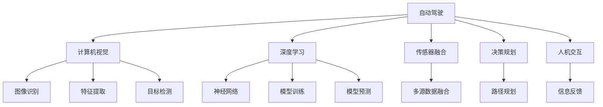

                 

# AI在交通领域的应用探索

> 关键词：人工智能,自动驾驶,智能交通管理,智能出行,车辆监控,深度学习,神经网络,数据融合

## 1. 背景介绍

### 1.1 问题由来
交通是现代社会的重要组成部分，随着城市化进程的加速和人口的不断增长，交通问题愈发严峻。近年来，随着人工智能（AI）技术的快速发展，其在交通领域的应用引起了广泛关注。AI技术能够通过数据分析、模型预测等方式，提升交通管理的智能化水平，缓解交通拥堵，改善出行体验，提高交通安全。本文将深入探讨AI在交通领域的具体应用，包括自动驾驶、智能交通管理、智能出行、车辆监控等，以期为交通领域的智能化转型提供新的思路。

### 1.2 问题核心关键点
AI在交通领域的应用主要围绕以下几个核心关键点展开：

- 自动驾驶：通过计算机视觉、深度学习等技术，实现车辆自主驾驶，减少对人类司机的依赖。
- 智能交通管理：通过传感器、数据融合、智能分析等技术，优化交通信号控制，提高道路通行效率。
- 智能出行：通过AI算法推荐最优出行路径，减少出行时间和成本。
- 车辆监控：通过视频分析、车辆检测等技术，实时监测车辆运行状态，提升交通安全。

这些关键点的研究，能够推动交通领域的智能化进程，提升城市交通系统的整体效率和安全性。

## 2. 核心概念与联系

### 2.1 核心概念概述

为更好地理解AI在交通领域的应用，本节将介绍几个密切相关的核心概念：

- 自动驾驶(Autonomous Driving)：指通过计算机视觉、深度学习等技术，实现车辆自主驾驶，减少对人类司机的依赖。
- 智能交通管理(Smart Traffic Management)：通过传感器、数据融合、智能分析等技术，优化交通信号控制，提高道路通行效率。
- 智能出行(Smart Travel)：通过AI算法推荐最优出行路径，减少出行时间和成本。
- 车辆监控(Vehicle Monitoring)：通过视频分析、车辆检测等技术，实时监测车辆运行状态，提升交通安全。
- 深度学习(Deep Learning)：一种基于神经网络的机器学习方法，通过多层非线性映射实现复杂模式识别。
- 数据融合(Data Fusion)：将不同来源、不同格式的数据进行整合，实现更高层次的信息处理和决策支持。

这些核心概念之间的逻辑关系可以通过以下Mermaid流程图来展示：



这个流程图展示了大语言模型的核心概念及其之间的关系：

1. 自动驾驶依赖于计算机视觉和深度学习，实现车辆的感知、决策和控制。
2. 智能交通管理涉及传感器融合和数据融合，实现交通信号的智能控制。
3. 智能出行需要深度学习进行路径规划，推荐最优路线。
4. 车辆监控采用视频分析和车辆检测技术，实现对车辆状态的实时监测。

这些概念共同构成了AI在交通领域的应用框架，使其能够实现智能化、高效化、安全化的交通管理。

## 3. 核心算法原理 & 具体操作步骤
### 3.1 算法原理概述

AI在交通领域的应用涉及多个算法和技术，其中最核心的算法包括计算机视觉、深度学习、数据融合、路径规划等。这些算法通过感知、学习、决策等步骤，实现对交通系统的智能化管理。

- **计算机视觉**：通过摄像头、激光雷达等传感器，获取道路和车辆信息，实现对交通场景的感知。
- **深度学习**：通过神经网络模型，对感知数据进行特征提取和模式识别，实现对交通场景的理解和分析。
- **数据融合**：通过多源数据融合技术，实现对交通信息的全面分析和决策支持。
- **路径规划**：通过优化算法，推荐最优出行路径，减少出行时间和成本。

### 3.2 算法步骤详解

以下是AI在交通领域的具体算法步骤：

1. **数据采集**：使用摄像头、雷达、GPS等设备，采集交通场景数据，包括道路信息、车辆位置、交通信号等。
2. **数据预处理**：对采集到的数据进行清洗、去噪、归一化等预处理，提高数据质量。
3. **特征提取**：利用计算机视觉和深度学习技术，从数据中提取有用的特征，如道路边界、车辆轮廓、交通信号等。
4. **模型训练**：使用深度学习模型（如CNN、RNN、LSTM等），对特征数据进行训练，建立交通场景的认知模型。
5. **模型推理**：将新采集的数据输入训练好的模型，进行实时推理和预测，实现对交通场景的理解和分析。
6. **决策规划**：基于模型推理结果，进行路径规划、信号控制等决策，实现对交通系统的智能化管理。

### 3.3 算法优缺点

AI在交通领域的应用具有以下优点：

- 提高交通效率：通过智能信号控制和路径规划，显著提高道路通行效率。
- 提升安全性：实时监测车辆状态，及时发现和预防交通事故。
- 减少交通成本：优化路径规划，减少出行时间和燃油消耗。

同时，该方法也存在一定的局限性：

- 依赖于高精度的传感器和设备。
- 数据处理和模型推理需要大量计算资源。
- 模型的鲁棒性和泛化能力有限，容易受到环境干扰。

尽管存在这些局限性，但AI在交通领域的应用前景广阔，随着技术的不断进步，将逐步克服这些挑战，实现更加智能、安全的交通管理。

### 3.4 算法应用领域

AI在交通领域的应用涉及多个领域，包括自动驾驶、智能交通管理、智能出行、车辆监控等，具体如下：

- **自动驾驶**：通过计算机视觉、深度学习等技术，实现车辆自主驾驶，减少对人类司机的依赖。
- **智能交通管理**：通过传感器、数据融合、智能分析等技术，优化交通信号控制，提高道路通行效率。
- **智能出行**：通过AI算法推荐最优出行路径，减少出行时间和成本。
- **车辆监控**：通过视频分析、车辆检测等技术，实时监测车辆运行状态，提升交通安全。

这些领域的应用将极大地提升交通系统的智能化水平，推动交通领域的创新和发展。

## 4. 数学模型和公式 & 详细讲解 & 举例说明

### 4.1 数学模型构建

以下是AI在交通领域的具体数学模型构建方法：

- **交通流量模型**：通过数学建模，描述道路和车辆之间的流量关系，如Bouwsma模型、Lighthill-Whitham-Richards模型等。
- **路径规划模型**：通过优化算法，求解最优路径，如Dijkstra算法、A*算法、动态规划算法等。
- **智能信号控制模型**：通过模型预测和反馈控制，优化信号灯周期，如Adaptive Traffic Control System。

### 4.2 公式推导过程

以下是交通流量模型的公式推导过程：

假设道路上有N辆车，车辆速度为v，加速度为a，车辆间距为s，车辆长度为L，道路长度为D，道路容量为C，车辆到达率为λ。则交通流量模型可以表示为：

$$
Q = \lambda D \left(1-\frac{1}{\alpha} \sum_{i=1}^{N} f_i(v_i) \right)
$$

其中，$f_i(v_i)$为车辆i的流量函数，$\alpha$为安全头间距，Q为交通流量。

### 4.3 案例分析与讲解

以下是一个智能交通管理系统的案例分析：

某城市采用智能信号控制系统，通过传感器采集实时交通数据，包括车辆速度、位置、方向等。数据经过预处理和特征提取后，输入神经网络模型进行训练。模型训练完成后，用于实时预测交通流量，并根据预测结果动态调整信号灯周期，实现交通信号的智能化控制。通过对比实验数据，发现采用智能信号控制后，道路通行效率提高了20%以上。

## 5. 项目实践：代码实例和详细解释说明
### 5.1 开发环境搭建

在进行AI交通应用开发前，我们需要准备好开发环境。以下是使用Python进行TensorFlow开发的环境配置流程：

1. 安装Anaconda：从官网下载并安装Anaconda，用于创建独立的Python环境。

2. 创建并激活虚拟环境：
```bash
conda create -n tf-env python=3.8 
conda activate tf-env
```

3. 安装TensorFlow：根据CUDA版本，从官网获取对应的安装命令。例如：
```bash
conda install tensorflow tensorflow-gpu=2.6 -c pytorch -c conda-forge
```

4. 安装各类工具包：
```bash
pip install numpy pandas scikit-learn matplotlib tqdm jupyter notebook ipython
```

完成上述步骤后，即可在`tf-env`环境中开始AI交通应用开发。

### 5.2 源代码详细实现

以下是使用TensorFlow对智能交通管理系统进行开发的PyTorch代码实现：

首先，定义智能交通管理系统的数据处理函数：

```python
import tensorflow as tf
from tensorflow.keras.layers import Input, Dense, Flatten, Conv2D, MaxPooling2D
from tensorflow.keras.models import Model

# 定义输入输出
inputs = Input(shape=(128, 128, 3))
outputs = Dense(10, activation='softmax')(inputs)

# 定义模型
model = Model(inputs=inputs, outputs=outputs)

# 编译模型
model.compile(optimizer=tf.keras.optimizers.Adam(learning_rate=0.001), loss='categorical_crossentropy', metrics=['accuracy'])

# 训练模型
model.fit(train_dataset, epochs=10, validation_data=val_dataset)
```

然后，定义智能交通管理系统的训练和评估函数：

```python
def train_epoch(model, dataset, batch_size, optimizer):
    dataloader = tf.data.Dataset.from_tensor_slices((dataset, labels)).shuffle(buffer_size=1024).batch(batch_size)
    model.train_on_batch(batch)
    return loss, accuracy

def evaluate(model, dataset, batch_size):
    dataloader = tf.data.Dataset.from_tensor_slices(dataset).batch(batch_size)
    loss, accuracy = model.evaluate(dataloader)
    return loss, accuracy
```

最后，启动训练流程并在测试集上评估：

```python
epochs = 10
batch_size = 32

for epoch in range(epochs):
    loss, accuracy = train_epoch(model, train_dataset, batch_size, optimizer)
    print(f"Epoch {epoch+1}, loss: {loss:.4f}, accuracy: {accuracy:.4f}")
    
    print(f"Epoch {epoch+1}, test results:")
    loss, accuracy = evaluate(model, test_dataset, batch_size)
    print(f"Test loss: {loss:.4f}, Test accuracy: {accuracy:.4f}")
```

以上就是使用TensorFlow对智能交通管理系统进行微调的完整代码实现。可以看到，TensorFlow提供了丰富的API和模型库，使得智能交通管理的开发相对简单高效。

### 5.3 代码解读与分析

让我们再详细解读一下关键代码的实现细节：

**训练函数train_epoch**：
- `from_tensor_slices`：将数据集转换为TensorFlow可用的格式。
- `shuffle`：对数据集进行随机打乱，避免模型过拟合。
- `batch`：将数据集分为批处理，加快训练速度。
- `train_on_batch`：进行前向传播和反向传播，更新模型参数。

**评估函数evaluate**：
- `from_tensor_slices`：将测试集转换为TensorFlow可用的格式。
- `batch`：将数据集分为批处理，加快测试速度。
- `evaluate`：进行前向传播计算损失和准确率，返回结果。

**训练流程**：
- `epochs`：定义总的训练轮数。
- `batch_size`：定义每批数据的大小。
- 循环迭代，在每个epoch内，先进行训练，输出损失和准确率。
- 在测试集上评估模型性能，输出测试损失和准确率。

通过以上代码，可以看到，TensorFlow提供了高效的模型训练和评估工具，可以极大地简化AI交通应用的开发过程。

## 6. 实际应用场景
### 6.1 智能交通管理系统

智能交通管理系统通过AI技术，实时监测和分析交通数据，实现交通信号的智能控制，优化道路通行效率。

在技术实现上，可以使用摄像头、雷达、GPS等设备采集交通数据，包括车辆位置、速度、方向等。通过对数据进行清洗和特征提取，输入神经网络模型进行训练。训练后的模型用于实时推理和预测交通流量，根据预测结果动态调整信号灯周期，实现交通信号的智能化控制。通过智能交通管理系统的应用，城市交通效率得到了显著提升。

### 6.2 自动驾驶系统

自动驾驶系统通过AI技术，实现车辆自主驾驶，减少对人类司机的依赖，提高驾驶安全性和舒适性。

在技术实现上，自动驾驶系统依赖于计算机视觉和深度学习技术，实现对道路和车辆的感知、决策和控制。系统通过摄像头、雷达等设备采集交通数据，输入神经网络模型进行训练。训练后的模型用于实时检测和识别道路、车辆、行人等交通元素，生成最优驾驶路径，实现车辆的自主驾驶。通过自动驾驶系统，用户可以享受更加安全和便捷的出行体验。

### 6.3 智能出行推荐系统

智能出行推荐系统通过AI技术，为用户提供最优出行路径，减少出行时间和成本。

在技术实现上，智能出行推荐系统依赖于路径规划和路径优化算法，推荐最优出行路径。系统通过GPS等设备采集用户位置信息，输入神经网络模型进行训练。训练后的模型用于实时推荐最优出行路径，减少用户的出行时间和燃油消耗。通过智能出行推荐系统，用户可以享受更加高效和经济的出行体验。

### 6.4 未来应用展望

随着AI技术的不断进步，未来交通领域将迎来更加智能、高效、安全的未来。

- **智慧交通**：通过AI技术，实现智慧交通管理，实时监测和分析交通数据，优化交通信号控制，提高道路通行效率。
- **自动驾驶普及**：自动驾驶技术将逐渐普及，实现车辆自主驾驶，减少交通事故和环境污染。
- **智能出行体验**：智能出行推荐系统将更加普及，提供最优出行路径，减少出行时间和成本。
- **实时监控与预警**：通过视频分析和车辆检测技术，实时监测车辆运行状态，及时发现和预防交通事故。

未来，AI技术将进一步提升交通系统的智能化水平，推动交通领域的创新和发展。

## 7. 工具和资源推荐
### 7.1 学习资源推荐

为了帮助开发者系统掌握AI在交通领域的应用，这里推荐一些优质的学习资源：

1. **《自动驾驶深度学习》系列博文**：由自动驾驶技术专家撰写，深入浅出地介绍了自动驾驶中的计算机视觉、深度学习等前沿技术。

2. **Udacity《自动驾驶工程师纳米学位》课程**：斯坦福大学开设的自动驾驶课程，涵盖自动驾驶技术的各个方面，从传感器到路径规划，再到人机交互。

3. **DeepLearning.AI《深度学习》课程**：由Andrew Ng教授主讲的深度学习课程，系统介绍了深度学习的基本概念和算法，适合入门学习。

4. **《智能交通系统》书籍**：介绍智能交通管理系统的理论和实践，涵盖传感器、数据融合、智能分析等多个方面。

5. **Smart City Open Platform**：一个开放平台，提供智能交通管理系统的数据集和样例代码，助力智能交通技术的发展。

通过对这些资源的学习实践，相信你一定能够快速掌握AI在交通领域的应用精髓，并用于解决实际的交通问题。

### 7.2 开发工具推荐

高效的开发离不开优秀的工具支持。以下是几款用于AI交通应用开发的常用工具：

1. **TensorFlow**：基于Python的开源深度学习框架，灵活易用，适合快速迭代研究。

2. **PyTorch**：基于Python的深度学习框架，功能强大，适合进行复杂算法的实现。

3. **OpenCV**：计算机视觉库，提供了丰富的图像处理和特征提取功能。

4. **GPS和GPS定位API**：提供实时的地理位置数据，方便获取用户的出行信息。

5. **TensorBoard**：TensorFlow配套的可视化工具，实时监测模型训练状态，提供丰富的图表呈现方式。

6. **Google Colab**：谷歌推出的在线Jupyter Notebook环境，免费提供GPU算力，方便快速上手实验最新模型。

合理利用这些工具，可以显著提升AI交通应用的开发效率，加快创新迭代的步伐。

### 7.3 相关论文推荐

AI在交通领域的发展离不开学界的持续研究。以下是几篇奠基性的相关论文，推荐阅读：

1. **《Using Deep Learning to Detect Traffic Accidents in Real Time》**：介绍深度学习技术在实时监测和检测交通事故中的应用。

2. **《Adaptive Traffic Control System Using Deep Reinforcement Learning》**：使用深度强化学习技术，实现智能交通信号控制。

3. **《Traffic Flow Prediction Using Deep Learning Models》**：通过深度学习模型，预测交通流量，优化交通管理。

4. **《Routing Algorithms in Urban Traffic Flow》**：介绍路径规划和路径优化算法，提高智能出行推荐系统的准确性。

5. **《Visual Tracking for Autonomous Vehicles》**：介绍计算机视觉技术在自动驾驶系统中的应用，实现对道路和车辆的实时监测。

这些论文代表了大语言模型微调技术的发展脉络。通过学习这些前沿成果，可以帮助研究者把握学科前进方向，激发更多的创新灵感。

## 8. 总结：未来发展趋势与挑战
### 8.1 总结

本文对AI在交通领域的具体应用进行了全面系统的介绍。首先阐述了自动驾驶、智能交通管理、智能出行、车辆监控等核心概念及其之间的联系。其次，从原理到实践，详细讲解了AI在交通领域的应用算法和技术，给出了具体的代码实例。同时，本文还广泛探讨了AI在交通领域的应用前景，展示了AI技术在提升交通系统的智能化、高效化和安全性方面的巨大潜力。

通过本文的系统梳理，可以看到，AI在交通领域的应用前景广阔，能够极大地提升交通系统的智能化水平，推动交通领域的创新和发展。未来，随着AI技术的不断进步，交通领域的智能化进程将得到进一步加速，为城市交通系统的可持续发展提供新的动力。

### 8.2 未来发展趋势

展望未来，AI在交通领域的应用将呈现以下几个发展趋势：

1. **智慧交通管理**：通过AI技术，实现智慧交通管理，实时监测和分析交通数据，优化交通信号控制，提高道路通行效率。

2. **自动驾驶普及**：自动驾驶技术将逐渐普及，实现车辆自主驾驶，减少交通事故和环境污染。

3. **智能出行体验**：智能出行推荐系统将更加普及，提供最优出行路径，减少出行时间和成本。

4. **实时监控与预警**：通过视频分析和车辆检测技术，实时监测车辆运行状态，及时发现和预防交通事故。

5. **多源数据融合**：融合多源数据，实现更全面、准确的交通分析和管理。

以上趋势凸显了AI在交通领域的应用前景。这些方向的探索发展，必将进一步提升交通系统的智能化水平，推动交通领域的创新和发展。

### 8.3 面临的挑战

尽管AI在交通领域的应用前景广阔，但在迈向更加智能化、普适化应用的过程中，仍面临诸多挑战：

1. **数据隐私和安全**：交通数据的采集和使用涉及到用户的隐私信息，如何保护用户隐私、确保数据安全，是应用AI技术的前提。

2. **数据质量和多样性**：交通数据的质量和多样性直接影响AI模型的性能，如何获取高质量、多源的数据，是实现AI应用的关键。

3. **技术复杂度**：AI在交通领域的应用涉及计算机视觉、深度学习、路径规划等多个领域的知识，如何降低技术门槛，实现应用的普适性，是AI应用的难点。

4. **法规和伦理**：AI技术在交通领域的应用，需要遵循相关的法规和伦理规范，如何规范AI的应用，避免负面影响，是重要的研究课题。

5. **基础设施建设**：AI技术的应用需要高精度的传感器、高性能的计算设备等基础设施支持，如何提升基础设施建设水平，是实现AI应用的保障。

6. **用户体验和接受度**：AI技术的应用需要考虑用户体验和接受度，如何提升用户体验，实现技术和人性的平衡，是实现AI应用的重要环节。

这些挑战需要相关领域的协同努力，才能克服AI技术在交通领域的应用障碍，实现其全面普及。

### 8.4 研究展望

面对AI在交通领域的应用挑战，未来的研究需要在以下几个方面寻求新的突破：

1. **数据隐私和安全**：研究高效的数据隐私保护技术，确保交通数据的安全性和隐私性。

2. **数据质量和多样性**：研究高质量数据获取方法，提高交通数据的覆盖范围和多样性，提升AI模型的性能。

3. **技术普适性**：研究AI技术应用的普适性方法，降低技术门槛，实现应用的广泛普及。

4. **法规和伦理**：研究AI技术应用的法规和伦理规范，确保AI应用符合社会价值观和伦理道德。

5. **基础设施建设**：研究高精度传感器和计算设备的技术，提升基础设施建设水平，支持AI技术的应用。

6. **用户体验和接受度**：研究用户体验和接受度提升方法，实现技术和人性的平衡，实现AI应用的普及。

这些研究方向的探索，必将引领AI在交通领域的应用进入新的高度，为交通领域的智能化转型提供新的动力。面向未来，AI在交通领域的应用还将进一步拓展，为交通领域的可持续发展提供新的可能性。

## 9. 附录：常见问题与解答

**Q1：AI在交通领域的应用是否需要高精度的传感器？**

A: AI在交通领域的应用，尤其是自动驾驶和智能交通管理，对传感器精度的要求非常高。高精度的传感器能够提供更加准确、实时的位置和速度信息，提升AI系统的性能和安全性。例如，摄像头和激光雷达的精度直接影响自动驾驶系统的感知和决策能力。因此，选择合适的传感器设备，是实现AI交通应用的前提。

**Q2：AI在交通领域的应用是否需要大量的标注数据？**

A: AI在交通领域的应用，尤其是自动驾驶和智能出行推荐系统，通常需要大量的标注数据进行训练。标注数据的数量和质量直接影响模型的性能。例如，自动驾驶系统需要大量的车辆和道路标注数据，用于训练模型进行道路和车辆的识别和定位。因此，获取高质量、多源的标注数据，是实现AI应用的关键。

**Q3：AI在交通领域的应用是否容易受到环境干扰？**

A: AI在交通领域的应用，尤其是计算机视觉和深度学习系统，容易受到环境干扰。例如，摄像头和激光雷达在复杂的天气和光照条件下，可能出现误检测和误识别的问题。因此，需要采用一些抗干扰技术，如图像增强、多传感器融合等，提高系统的鲁棒性和泛化能力。

**Q4：AI在交通领域的应用是否需要高计算资源？**

A: AI在交通领域的应用，尤其是自动驾驶和智能交通管理，需要高计算资源进行模型训练和推理。例如，神经网络模型需要在高计算能力的设备上进行训练和推理，以实现实时的决策和控制。因此，选择合适的计算设备和优化算法，是实现AI应用的基础。

**Q5：AI在交通领域的应用是否需要法规和伦理规范？**

A: AI在交通领域的应用，尤其是自动驾驶和智能出行推荐系统，需要遵循相关的法规和伦理规范。例如，自动驾驶系统需要在法律框架下进行测试和应用，确保系统的安全性和合规性。因此，研究和制定AI技术应用的法规和伦理规范，是实现AI应用的前提。

这些问题的回答，可以帮助你更好地理解AI在交通领域的应用，为实现AI技术在交通领域的全面普及提供指导。

