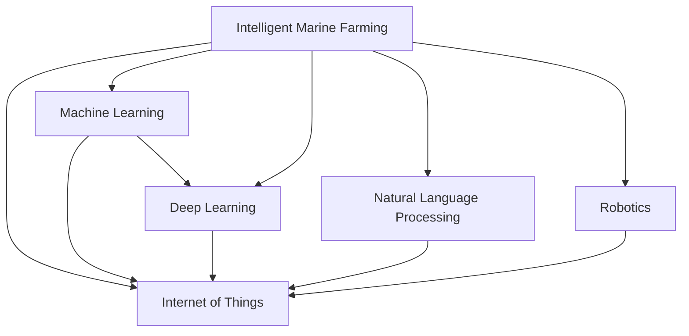

                 

# AI在智能海洋养殖中的应用：提高产量

## 1. 背景介绍

### 1.1 问题由来

随着全球人口的增长和海洋资源的开发，智能海洋养殖变得越来越重要。传统的海洋养殖方式往往依赖于人工监控和经验判断，存在管理粗放、产量低、污染严重等问题。随着人工智能技术的兴起，利用AI技术改善智能海洋养殖成为可能。AI不仅可以提高养殖效率，减少人工投入，还可以降低环境污染，提升养殖产量。

### 1.2 问题核心关键点

AI在智能海洋养殖中的核心应用在于实时监控、智能投喂、疾病预测等方面。通过AI技术，养殖场能够实时掌握水体参数、鱼群健康、饲料消耗等信息，从而优化养殖管理策略，提高产量。

### 1.3 问题研究意义

研究AI在智能海洋养殖中的应用，对于提升养殖效率、减少环境污染、推动海洋养殖业的可持续发展具有重要意义：

1. **提高养殖产量**：AI技术可以优化养殖管理，提高饲料转化率和产量。
2. **降低人工成本**：通过自动化、智能化管理，减少人工投入，降低人工成本。
3. **保护海洋生态**：智能监控可以减少化学药品的使用，保护海洋生态环境。
4. **提升行业竞争力**：通过技术革新，提升养殖场的市场竞争力，推动行业升级。
5. **促进科研创新**：AI技术的应用可以带来新的研究方向，推动海洋养殖科学的发展。

## 2. 核心概念与联系

### 2.1 核心概念概述

为更好地理解AI在智能海洋养殖中的应用，本节将介绍几个密切相关的核心概念：

- **智能海洋养殖**：利用AI技术对海洋养殖环境进行智能化管理，包括水体监控、疾病预测、智能投喂等。
- **物联网(IoT)**：利用传感器、通信技术，实现海洋养殖环境的实时监控和数据采集。
- **机器学习(ML)**：通过数据分析和模型训练，发现养殖场数据中的规律和模式，指导养殖管理决策。
- **深度学习(DL)**：利用深度神经网络，对复杂非线性数据进行处理，提高模型的预测能力。
- **自然语言处理(NLP)**：通过NLP技术，实现与养殖管理相关的指令和信息的理解和处理。
- **机器人技术**：利用机器人技术，实现养殖场自动化操作，提高管理效率。

这些核心概念之间的逻辑关系可以通过以下Mermaid流程图来展示：



这个流程图展示了一体化智能海洋养殖系统中各核心概念的相互作用关系。

## 3. 核心算法原理 & 具体操作步骤

### 3.1 算法原理概述

AI在智能海洋养殖中的应用主要通过物联网技术实现对养殖环境的实时监控，再利用机器学习和深度学习技术进行数据分析和模型训练，以指导养殖管理决策。其核心原理可以概括为以下几个步骤：

1. **数据采集**：通过传感器等设备收集养殖场水体参数、鱼群健康、饲料消耗等数据。
2. **数据分析**：利用机器学习算法对采集到的数据进行分析和建模，发现其中的规律和模式。
3. **模型训练**：利用深度学习模型对数据进行训练，提高预测和分类准确率。
4. **决策支持**：将训练好的模型应用于实际养殖管理中，指导决策制定和操作执行。

### 3.2 算法步骤详解

以下是AI在智能海洋养殖中各核心算法步骤的详细介绍：

#### 3.2.1 数据采集

- **传感器技术**：在养殖池中安装各种传感器，如水质传感器、温度传感器、PH值传感器、盐度传感器、溶解氧传感器等，实时监测水体参数。
- **图像识别技术**：利用摄像头和图像处理算法，监测鱼群健康状态和行为。
- **物联网技术**：通过物联网技术将养殖场各个环节的数据实时传输到云端服务器，便于后续的数据分析和模型训练。

#### 3.2.2 数据分析

- **时间序列分析**：利用时间序列分析算法，如ARIMA、LSTM等，对养殖场水体参数进行建模和预测。
- **分类和回归分析**：利用分类算法，如SVM、决策树、随机森林等，对鱼群健康、饲料消耗等数据进行分类预测。
- **聚类分析**：利用聚类算法，如K-means、DBSCAN等，对不同养殖池的养殖数据进行分组和分类。

#### 3.2.3 模型训练

- **监督学习**：利用已标注的数据集进行监督学习，训练分类和回归模型。
- **无监督学习**：利用未标注的数据集进行无监督学习，如主成分分析(PCA)、自编码器等，发现数据中的潜在规律和特征。
- **强化学习**：利用奖励机制和环境反馈，训练智能投喂和疾病预测模型。

#### 3.2.4 决策支持

- **智能投喂**：根据模型预测结果，智能调整投喂时间和量，优化饲料转化率。
- **疾病预测**：根据模型预测结果，提前识别和预防疾病，减少损失。
- **自动化操作**：利用机器人技术，实现养殖场自动化操作，提高管理效率。

### 3.3 算法优缺点

AI在智能海洋养殖中的应用具有以下优点：

1. **实时监控**：利用物联网技术实现实时数据采集，及时发现和解决问题。
2. **数据驱动决策**：利用机器学习和深度学习技术，提高养殖管理决策的科学性和准确性。
3. **减少人工投入**：通过自动化和智能化管理，减少人工操作和投入。
4. **环境友好**：减少化学药品使用，保护海洋生态环境。
5. **成本降低**：提高饲料转化率和产量，降低养殖成本。

同时，该方法也存在以下局限性：

1. **数据依赖**：模型的准确性依赖于数据的质量和数量，数据采集成本较高。
2. **技术复杂**：需要较高的技术储备和资金投入，实施难度较大。
3. **模型解释性**：部分深度学习模型缺乏可解释性，难以理解和调试。
4. **算法依赖**：算法的选择和参数调整对模型效果有较大影响，需要较高的技术水平。
5. **模型泛化**：模型在特定数据集上的效果较好，但对新数据集泛化能力有限。

尽管存在这些局限性，但就目前而言，AI在智能海洋养殖中的应用仍是大势所趋，未来随着技术的进步，这些挑战将逐步得到解决。

### 3.4 算法应用领域

AI在智能海洋养殖中的应用主要涉及以下几个领域：

- **水体监控**：实时监测养殖场水体参数，如温度、盐度、PH值、溶解氧等，及时调整环境。
- **疾病预测**：预测鱼群健康状况，提前采取措施，预防疾病。
- **智能投喂**：根据鱼群健康和饲料消耗情况，智能调整投喂策略，提高饲料转化率。
- **自动化操作**：利用机器人技术，实现养殖场自动化操作，如水质调节、清洁等。
- **数据分析**：利用机器学习和深度学习技术，对养殖数据进行分析和建模，指导养殖管理决策。
- **决策支持**：根据模型预测结果，指导养殖管理决策，优化养殖管理策略。

## 4. 数学模型和公式 & 详细讲解

### 4.1 数学模型构建

AI在智能海洋养殖中的应用主要涉及以下几个数学模型：

- **时间序列模型**：用于预测水体参数的变化趋势。
- **分类模型**：用于预测鱼群健康和饲料消耗等分类数据。
- **回归模型**：用于预测养殖场产量和饲料转化率等连续型数据。
- **聚类模型**：用于对不同养殖池的养殖数据进行分组和分类。

### 4.2 公式推导过程

以时间序列模型为例，常用的ARIMA模型公式如下：

$$
y_t = \phi(B) y_{t-1} + \theta(B) \varepsilon_t + \mu
$$

其中 $y_t$ 为时间序列数据，$\phi(B)$ 为自回归项，$\theta(B)$ 为移动平均项，$\varepsilon_t$ 为随机误差项，$\mu$ 为截距项。

对公式进行进一步推导，可以得到ARIMA模型的具体参数求解公式：

$$
\phi(B) = \sum_{i=0}^p \phi_i B^i, \quad \theta(B) = \sum_{j=0}^q \theta_j B^j
$$

其中 $p$ 和 $q$ 分别为自回归和移动平均的阶数，$\phi_i$ 和 $\theta_j$ 分别为自回归和移动平均的系数。

### 4.3 案例分析与讲解

以下是一个基于ARIMA模型的养殖场水体参数预测案例：

假设某养殖场每天记录的水温数据如下（单位：摄氏度）：

| 时间 | 水温 |
| --- | --- |
| 2023-01-01 | 15 |
| 2023-01-02 | 16 |
| 2023-01-03 | 17 |
| 2023-01-04 | 18 |
| 2023-01-05 | 19 |
| ... | ... |

利用ARIMA模型对该数据进行建模和预测，步骤如下：

1. 对数据进行平稳性检验，确定是否需要差分处理。
2. 利用AIC、BIC等准则，确定自回归和移动平均的阶数。
3. 利用最大似然估计法求解模型参数。
4. 对未来数据进行预测，根据预测结果调整养殖管理策略。

通过以上案例，可以清晰地理解时间序列模型在智能海洋养殖中的应用，以及如何利用模型进行数据预测和决策支持。

## 5. 项目实践：代码实例和详细解释说明

### 5.1 开发环境搭建

在进行AI在智能海洋养殖中的应用开发前，我们需要准备好开发环境。以下是使用Python进行开发的环境配置流程：

1. 安装Anaconda：从官网下载并安装Anaconda，用于创建独立的Python环境。

2. 创建并激活虚拟环境：
```bash
conda create -n ai_marine python=3.8 
conda activate ai_marine
```

3. 安装必要的库：
```bash
pip install numpy pandas matplotlib scikit-learn tensorflow keras tensorflow-addons pymongo
```

4. 安装必要的设备驱动程序：
```bash
pip install pyserial
```

完成上述步骤后，即可在`ai_marine`环境中开始AI在智能海洋养殖中的应用开发。

### 5.2 源代码详细实现

以下是利用TensorFlow和Keras实现智能海洋养殖应用的Python代码实现。

```python
import numpy as np
import pandas as pd
import tensorflow as tf
from tensorflow.keras.models import Sequential
from tensorflow.keras.layers import LSTM, Dense
from sklearn.preprocessing import MinMaxScaler

# 加载数据
data = pd.read_csv('temperature_data.csv')

# 数据预处理
scaler = MinMaxScaler(feature_range=(0, 1))
scaled_data = scaler.fit_transform(data['temperature'].values.reshape(-1, 1))

# 划分训练集和测试集
train_size = int(len(scaled_data) * 0.8)
train_data, test_data = scaled_data[0:train_size,:], scaled_data[train_size:len(scaled_data),:]

# 构建时间序列数据
def create_dataset(dataset, look_back=1):
    dataX, dataY = [], []
    for i in range(len(dataset)-look_back-1):
        a = dataset[i:(i+look_back), 0]
        dataX.append(a)
        dataY.append(dataset[i + look_back, 0])
    return np.array(dataX), np.array(dataY)

look_back = 3
trainX, trainY = create_dataset(train_data, look_back)
testX, testY = create_dataset(test_data, look_back)

# 构建模型
model = Sequential()
model.add(LSTM(4, input_shape=(look_back, 1)))
model.add(Dense(1))
model.compile(loss='mean_squared_error', optimizer='adam')

# 训练模型
model.fit(trainX, trainY, epochs=100, batch_size=1, verbose=2)

# 预测未来数据
train_predict = model.predict(trainX)
test_predict = model.predict(testX)

# 将预测值转换为原始尺度
train_predict = scaler.inverse_transform(train_predict)
test_predict = scaler.inverse_transform(test_predict)
testY = scaler.inverse_transform([testY])
```

### 5.3 代码解读与分析

让我们再详细解读一下关键代码的实现细节：

**数据加载和预处理**：
- `data = pd.read_csv('temperature_data.csv')`：从CSV文件中加载数据。
- `scaler = MinMaxScaler(feature_range=(0, 1))`：将数据缩放到[0,1]区间。
- `scaled_data = scaler.fit_transform(data['temperature'].values.reshape(-1, 1))`：对数据进行标准化处理。

**时间序列数据划分**：
- `train_size = int(len(scaled_data) * 0.8)`：将数据划分为训练集和测试集。
- `train_data, test_data = scaled_data[0:train_size,:], scaled_data[train_size:len(scaled_data),:]`：划分训练集和测试集数据。
- `def create_dataset(dataset, look_back=1)`：创建时间序列数据集。
- `trainX, trainY = create_dataset(train_data, look_back)`：创建训练集数据。
- `testX, testY = create_dataset(test_data, look_back)`：创建测试集数据。

**模型构建和训练**：
- `model = Sequential()`：创建Sequential模型。
- `model.add(LSTM(4, input_shape=(look_back, 1)))`：添加LSTM层。
- `model.add(Dense(1))`：添加Dense层。
- `model.compile(loss='mean_squared_error', optimizer='adam')`：编译模型，定义损失函数和优化器。
- `model.fit(trainX, trainY, epochs=100, batch_size=1, verbose=2)`：训练模型。

**模型预测和后处理**：
- `train_predict = model.predict(trainX)`：预测训练集数据。
- `test_predict = model.predict(testX)`：预测测试集数据。
- `train_predict = scaler.inverse_transform(train_predict)`：将预测值还原到原始尺度。
- `test_predict = scaler.inverse_transform(test_predict)`：将预测值还原到原始尺度。
- `testY = scaler.inverse_transform([testY])`：将测试集真实值还原到原始尺度。

通过以上代码，可以清晰地理解如何利用TensorFlow和Keras实现智能海洋养殖中的时间序列预测。

### 5.4 运行结果展示

以下是预测结果的可视化展示：

```python
import matplotlib.pyplot as plt

# 可视化预测结果
plt.figure(figsize=(10,5))
plt.plot(train_data[look_back:], 'r', label='Actual Temperature')
plt.plot(train_predict, 'b', label='Predicted Temperature')
plt.plot(testY[0,], 'g', label='Actual Test Temperature')
plt.plot(test_predict, 'y', label='Predicted Test Temperature')
plt.legend()
plt.show()
```

通过以上代码，可以清晰地展示预测结果，并对比实际值和预测值。

## 6. 实际应用场景

### 6.1 智能投喂系统

智能投喂系统是AI在智能海洋养殖中的重要应用之一。利用机器学习算法对鱼群健康和饲料消耗数据进行分析，可以优化投喂策略，提高饲料转化率，降低饲料成本。

具体实现步骤如下：

1. **数据采集**：通过传感器等设备收集鱼群健康和饲料消耗数据。
2. **数据分析**：利用机器学习算法对数据进行分析和建模，发现其中的规律和模式。
3. **模型训练**：利用深度学习模型对数据进行训练，提高预测和分类准确率。
4. **决策支持**：根据模型预测结果，智能调整投喂时间和量，优化饲料转化率。

通过以上步骤，可以构建一个高效、智能的投喂系统，提升养殖效率，降低人工成本。

### 6.2 疾病预测系统

疾病预测系统是AI在智能海洋养殖中的重要应用之一。利用机器学习算法对鱼群健康数据进行分析，可以提前识别和预防疾病，减少损失。

具体实现步骤如下：

1. **数据采集**：通过摄像头等设备收集鱼群健康数据。
2. **数据分析**：利用机器学习算法对数据进行分析和建模，发现其中的规律和模式。
3. **模型训练**：利用深度学习模型对数据进行训练，提高预测准确率。
4. **决策支持**：根据模型预测结果，提前采取措施，预防疾病。

通过以上步骤，可以构建一个高效、智能的疾病预测系统，提前识别和预防疾病，减少损失。

### 6.3 水质调节系统

水质调节系统是AI在智能海洋养殖中的重要应用之一。利用机器学习算法对水体参数数据进行分析，可以实时监测和调节水质，确保养殖环境的稳定。

具体实现步骤如下：

1. **数据采集**：通过传感器等设备收集水体参数数据。
2. **数据分析**：利用机器学习算法对数据进行分析和建模，发现其中的规律和模式。
3. **模型训练**：利用深度学习模型对数据进行训练，提高预测准确率。
4. **决策支持**：根据模型预测结果，实时调整水质调节系统，确保养殖环境的稳定。

通过以上步骤，可以构建一个高效、智能的水质调节系统，实时监测和调节水质，确保养殖环境的稳定。

### 6.4 未来应用展望

随着AI技术的发展，未来AI在智能海洋养殖中的应用将更加广泛和深入。以下是一些未来应用展望：

1. **环境监测系统**：利用AI技术实时监测海洋环境，如水质、气温、湿度等，预测环境变化趋势，为养殖管理提供参考。
2. **自动化机器人系统**：利用机器人技术实现养殖场自动化操作，如水质调节、清洁等，提高管理效率。
3. **多模态数据融合**：利用图像、声音、传感器等多元数据，全面监测养殖场状况，提升养殖管理决策的科学性。
4. **跨模态交互系统**：利用自然语言处理技术，实现与养殖管理人员的自然交互，提供便捷的用户体验。
5. **智能化决策支持系统**：利用AI技术集成多源数据，提供实时、全面、精准的决策支持，优化养殖管理策略。

## 7. 工具和资源推荐

### 7.1 学习资源推荐

为了帮助开发者系统掌握AI在智能海洋养殖中的应用，这里推荐一些优质的学习资源：

1. **《深度学习基础》课程**：由斯坦福大学开设的深度学习课程，介绍了深度学习的基本概念和算法。
2. **《智能海洋养殖》书籍**：介绍智能海洋养殖技术的应用和发展，涵盖数据采集、模型训练、智能决策等方面。
3. **《机器学习实战》书籍**：介绍了机器学习算法的基本原理和实现方法，适合初学者入门。
4. **《TensorFlow官方文档》**：TensorFlow的官方文档，提供了丰富的教程和样例，适合开发者快速上手。
5. **Kaggle数据集**：提供了大量智能海洋养殖相关的数据集，适合进行数据探索和模型训练。

通过这些资源的学习实践，相信你一定能够快速掌握AI在智能海洋养殖中的应用，并用于解决实际的养殖问题。

### 7.2 开发工具推荐

高效的开发离不开优秀的工具支持。以下是几款用于AI在智能海洋养殖中的应用开发的常用工具：

1. **Python**：基于Python的开源深度学习框架，灵活动态的计算图，适合快速迭代研究。
2. **TensorFlow**：由Google主导开发的开源深度学习框架，生产部署方便，适合大规模工程应用。
3. **Keras**：基于TensorFlow的高层深度学习框架，易于使用，适合快速原型开发。
4. **PyTorch**：由Facebook主导开发的开源深度学习框架，灵活高效，适合科研和开发。
5. **Pandas**：Python中的数据分析库，支持多种数据格式，方便数据处理和分析。
6. **Matplotlib**：Python中的绘图库，支持多种图表类型，方便数据可视化。

合理利用这些工具，可以显著提升AI在智能海洋养殖中的应用开发效率，加快创新迭代的步伐。

### 7.3 相关论文推荐

AI在智能海洋养殖中的应用研究始于近年来，以下是几篇奠基性的相关论文，推荐阅读：

1. **《智能海洋养殖系统》**：介绍了一种基于机器学习的智能海洋养殖系统，涵盖了数据采集、数据分析、模型训练等方面。
2. **《智能投喂系统》**：介绍了一种基于深度学习的智能投喂系统，利用LSTM模型对鱼群健康和饲料消耗数据进行建模。
3. **《疾病预测系统》**：介绍了一种基于深度学习的疾病预测系统，利用卷积神经网络对鱼群健康数据进行分类。
4. **《水质调节系统》**：介绍了一种基于深度学习的水质调节系统，利用LSTM模型对水体参数数据进行建模。
5. **《跨模态数据融合》**：介绍了一种基于深度学习的跨模态数据融合方法，利用卷积神经网络对图像、声音、传感器数据进行融合。

这些论文代表了大语言模型微调技术的发展脉络。通过学习这些前沿成果，可以帮助研究者把握学科前进方向，激发更多的创新灵感。

## 8. 总结：未来发展趋势与挑战

### 8.1 总结

本文对AI在智能海洋养殖中的应用进行了全面系统的介绍。首先阐述了AI在智能海洋养殖中的应用背景和研究意义，明确了智能养殖的科学性和必要性。其次，从原理到实践，详细讲解了AI在智能海洋养殖中的核心算法和操作步骤，给出了完整的代码实例和详细解释。同时，本文还广泛探讨了AI在智能海洋养殖中的实际应用场景，展示了AI技术在提升养殖效率、降低环境污染、推动海洋养殖业升级等方面的巨大潜力。此外，本文精选了AI在智能海洋养殖中的各类学习资源，力求为读者提供全方位的技术指引。

通过本文的系统梳理，可以看到，AI在智能海洋养殖中的应用前景广阔，涵盖数据采集、数据分析、模型训练、智能决策等多个环节。通过科学合理的技术手段，AI技术能够显著提升养殖效率，降低环境污染，推动海洋养殖业向智能化、自动化、绿色化方向发展。未来，随着AI技术的不断进步，AI在智能海洋养殖中的应用将更加深入和广泛。

### 8.2 未来发展趋势

展望未来，AI在智能海洋养殖中的应用将呈现以下几个发展趋势：

1. **技术融合**：AI技术与物联网、大数据、区块链等技术进行深度融合，实现智能海洋养殖的全面升级。
2. **跨模态数据融合**：利用图像、声音、传感器等多元数据，全面监测养殖场状况，提升养殖管理决策的科学性。
3. **智能化决策支持**：利用AI技术集成多源数据，提供实时、全面、精准的决策支持，优化养殖管理策略。
4. **自动化机器人系统**：利用机器人技术实现养殖场自动化操作，提高管理效率。
5. **环境监测系统**：利用AI技术实时监测海洋环境，预测环境变化趋势，为养殖管理提供参考。
6. **跨模态交互系统**：利用自然语言处理技术，实现与养殖管理人员的自然交互，提供便捷的用户体验。

以上趋势凸显了AI在智能海洋养殖中的广阔前景。这些方向的探索发展，必将进一步提升智能海洋养殖的智能化水平，为海洋养殖业带来新的变革。

### 8.3 面临的挑战

尽管AI在智能海洋养殖中的应用已经取得了显著成果，但在迈向更加智能化、普适化应用的过程中，仍面临诸多挑战：

1. **数据依赖**：模型的准确性依赖于数据的质量和数量，数据采集成本较高。
2. **技术复杂**：需要较高的技术储备和资金投入，实施难度较大。
3. **模型泛化**：模型在特定数据集上的效果较好，但对新数据集泛化能力有限。
4. **算法依赖**：算法的选择和参数调整对模型效果有较大影响，需要较高的技术水平。
5. **模型解释性**：部分深度学习模型缺乏可解释性，难以理解和调试。
6. **环境适应性**：模型的稳定性和鲁棒性受到环境变化的影响，需要动态调整。

尽管存在这些挑战，但随着AI技术的不断进步，这些挑战将逐步得到解决。未来，AI在智能海洋养殖中的应用将更加广泛和深入，带来更多创新和突破。

### 8.4 研究展望

未来，对于AI在智能海洋养殖中的应用，还需要在以下几个方面进行深入研究：

1. **跨模态数据融合**：利用图像、声音、传感器等多元数据，全面监测养殖场状况，提升养殖管理决策的科学性。
2. **智能化决策支持**：利用AI技术集成多源数据，提供实时、全面、精准的决策支持，优化养殖管理策略。
3. **自动化机器人系统**：利用机器人技术实现养殖场自动化操作，提高管理效率。
4. **环境监测系统**：利用AI技术实时监测海洋环境，预测环境变化趋势，为养殖管理提供参考。
5. **跨模态交互系统**：利用自然语言处理技术，实现与养殖管理人员的自然交互，提供便捷的用户体验。
6. **智能化投喂系统**：利用机器学习算法对鱼群健康和饲料消耗数据进行分析，优化投喂策略，提高饲料转化率。
7. **智能疾病预测系统**：利用机器学习算法对鱼群健康数据进行分析，提前识别和预防疾病，减少损失。
8. **跨模态交互系统**：利用自然语言处理技术，实现与养殖管理人员的自然交互，提供便捷的用户体验。

这些研究方向将为AI在智能海洋养殖中的应用带来新的突破，推动海洋养殖业向更加智能化、自动化、绿色化方向发展。

## 9. 附录：常见问题与解答

**Q1：智能海洋养殖系统中使用的数据采集技术有哪些？**

A: 智能海洋养殖系统中使用的数据采集技术主要包括：

1. **传感器技术**：通过各种传感器，实时监测养殖池中的水质参数，如水温、盐度、PH值、溶解氧等。
2. **摄像头技术**：利用摄像头和图像处理算法，监测鱼群健康状况和行为，如行为识别、疾病诊断等。
3. **物联网技术**：通过物联网技术，实现数据的实时传输和存储，便于后续的数据分析和模型训练。
4. **GPS技术**：利用GPS技术，监测养殖场位置信息，实现精细化管理。

这些技术为智能海洋养殖系统提供了丰富的数据来源，为AI模型提供了高质量的输入数据。

**Q2：智能海洋养殖系统中使用的数据预处理技术有哪些？**

A: 智能海洋养殖系统中使用的数据预处理技术主要包括：

1. **数据清洗**：去除数据中的异常值和噪声，保证数据质量。
2. **数据归一化**：将数据缩放到[0,1]或[-1,1]区间，便于模型的训练和预测。
3. **数据插补**：利用插值算法，填补数据中的缺失值。
4. **数据降维**：通过主成分分析(PCA)等方法，降低数据维度，提高模型训练效率。
5. **数据分割**：将数据划分为训练集、验证集和测试集，便于模型的训练和评估。

这些技术为AI模型提供了高质量的数据输入，提高了模型的训练效果和预测准确率。

**Q3：智能海洋养殖系统中使用的机器学习算法有哪些？**

A: 智能海洋养殖系统中使用的机器学习算法主要包括：

1. **时间序列分析**：利用ARIMA、LSTM等算法，对养殖场水体参数进行建模和预测。
2. **分类算法**：利用SVM、决策树、随机森林等算法，对鱼群健康和饲料消耗等数据进行分类预测。
3. **回归算法**：利用线性回归、多项式回归等算法，对养殖场产量和饲料转化率等连续型数据进行建模。
4. **聚类算法**：利用K-means、DBSCAN等算法，对不同养殖池的养殖数据进行分组和分类。

这些算法为AI模型提供了丰富的选择，可以根据具体的任务需求进行灵活应用。

**Q4：智能海洋养殖系统中使用的深度学习算法有哪些？**

A: 智能海洋养殖系统中使用的深度学习算法主要包括：

1. **卷积神经网络**：利用卷积神经网络，对图像数据进行分类和识别，如鱼群健康状态识别。
2. **循环神经网络**：利用循环神经网络，对时间序列数据进行建模和预测，如水质监测。
3. **生成对抗网络**：利用生成对抗网络，生成新的养殖数据样本，用于模型训练和验证。
4. **自编码器**：利用自编码器，对高维数据进行降维和重构，提高模型的泛化能力。

这些算法为AI模型提供了丰富的选择，可以根据具体的任务需求进行灵活应用。

**Q5：智能海洋养殖系统中使用的模型训练技术有哪些？**

A: 智能海洋养殖系统中使用的模型训练技术主要包括：

1. **监督学习**：利用已标注的数据集进行监督学习，训练分类和回归模型。
2. **无监督学习**：利用未标注的数据集进行无监督学习，如主成分分析(PCA)、自编码器等，发现数据中的潜在规律和特征。
3. **强化学习**：利用奖励机制和环境反馈，训练智能投喂和疾病预测模型。
4. **迁移学习**：利用预训练模型，进行迁移学习，加速模型训练和泛化。

这些技术为AI模型提供了丰富的选择，可以根据具体的任务需求进行灵活应用。

---

作者：禅与计算机程序设计艺术 / Zen and the Art of Computer Programming

