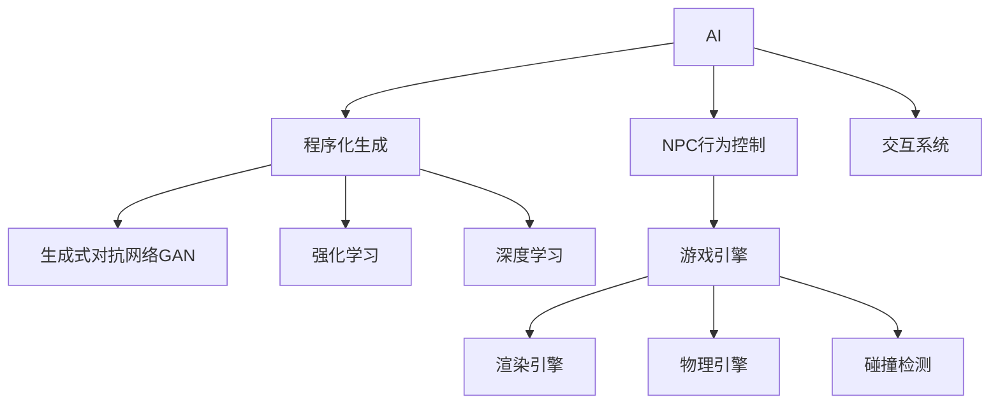

                 

## 1. 背景介绍

随着人工智能(AI)技术的飞速发展，AI在游戏开发中的应用范围已经从简单的NPC行为控制，扩展到了更加复杂的程序化生成和交互。游戏作为虚拟现实的重要媒介，AI的引入不仅能够提升游戏的交互性和体验感，还能够减少游戏开发的工作量和成本。然而，要充分发挥AI在游戏中的潜力，需要深入理解其核心概念和算法原理，以及具体的应用场景。本文旨在系统地介绍AI在游戏开发中的应用，涵盖从NPC行为到程序化生成的各个方面，为游戏开发者提供全面的技术指导。

## 2. 核心概念与联系

### 2.1 核心概念概述

为了更好地理解AI在游戏开发中的应用，我们需要先了解几个核心概念：

- **人工智能(AI)**：通过算法和模型，使计算机系统具备类似于人类的智能，能够进行感知、推理、学习等复杂任务。
- **游戏引擎**：提供游戏开发所需的基础设施和工具，包括渲染引擎、物理引擎、碰撞检测等模块。
- **非玩家角色(NPC)**：指游戏中的虚拟角色，其行为由AI系统控制，能够模拟玩家的行为和决策。
- **程序化生成(Procedural Generation)**：指使用算法自动生成游戏内容和环境的过程，能够高效生成多样化的游戏世界和资源。
- **强化学习(Reinforcement Learning, RL)**：一种通过奖励和惩罚信号，使AI系统自主学习最优策略的机器学习方法。
- **深度学习(Deep Learning)**：一种利用神经网络进行复杂数据模式识别的机器学习方法，在游戏AI中应用广泛。

这些概念之间相互关联，共同构成了AI在游戏开发中的技术框架。通过理解这些核心概念，我们可以更好地把握AI在游戏中的应用和优化方法。

### 2.2 核心概念原理和架构的 Mermaid 流程图



这个流程图展示了AI在游戏开发中的应用场景：

1. 人工智能(AI)通过游戏引擎提供的基础设施和工具，控制非玩家角色(NPC)的行为，提升游戏的互动性。
2. 程序化生成(Procedural Generation)使用算法自动生成游戏内容和环境，提高游戏的多样性和随机性。
3. 生成式对抗网络(GAN)用于生成逼真的游戏资源和环境。
4. 强化学习(Reinforcement Learning)用于训练NPC或游戏AI系统，使其具备自主决策和动态适应环境的能力。
5. 深度学习(Deep Learning)用于提取游戏数据的高层特征，进行复杂的决策和预测。
6. 交互系统(Interactive System)通过AI增强游戏角色的智能，提升游戏体验。

这些概念共同构成了AI在游戏开发中的技术体系，使得游戏AI能够适应各种复杂场景，提高游戏的趣味性和可玩性。

## 3. 核心算法原理 & 具体操作步骤

### 3.1 算法原理概述

AI在游戏开发中的应用主要依赖于算法和模型。本文将详细介绍几种常见的AI算法，包括NPC行为控制、程序化生成和强化学习，并结合游戏开发的具体需求，探讨这些算法的基本原理和操作步骤。

### 3.2 算法步骤详解

#### 3.2.1 NPC行为控制

NPC行为控制是游戏AI的基础，其目标是通过算法和模型，使NPC能够模拟玩家的行为，做出决策和响应。以下是NPC行为控制的基本步骤：

1. **数据收集**：收集玩家的行为数据，包括移动路径、攻击动作、对话等。
2. **模型训练**：使用机器学习算法（如决策树、神经网络）对NPC的行为进行建模。
3. **行为生成**：根据玩家的行为数据和模型的预测，生成NPC的行为序列。
4. **实时调整**：根据游戏环境的变化，实时调整NPC的行为，确保其行为的适应性和合理性。

#### 3.2.2 程序化生成

程序化生成是指使用算法自动生成游戏内容和环境，提高游戏的多样性和随机性。以下是程序化生成的一般步骤：

1. **规则定义**：定义生成规则和算法，如基于噪声的生成、基于规则的生成等。
2. **数据驱动生成**：使用游戏内的数据，如地形、资源分布、玩家行为等，作为输入，自动生成游戏世界和资源。
3. **优化调整**：根据玩家反馈和游戏评价，对生成算法进行优化调整，提升生成的质量和多样性。
4. **自动化生成**：将生成的规则和算法集成到游戏引擎中，实现自动化的生成过程。

#### 3.2.3 强化学习

强化学习是一种通过奖励和惩罚信号，使AI系统自主学习最优策略的机器学习方法。以下是强化学习在NPC行为控制中的应用步骤：

1. **环境定义**：定义游戏环境和NPC的目标，如地图、敌人、玩家等。
2. **策略学习**：使用强化学习算法（如Q-Learning、Policy Gradient），让NPC自主学习最优的行动策略。
3. **经验积累**：通过不断与环境交互，积累NPC的经验，提高其决策能力。
4. **策略优化**：根据游戏环境的反馈，优化NPC的行动策略，确保其行为的有效性和合理性。

### 3.3 算法优缺点

#### 3.3.1 NPC行为控制的优缺点

**优点**：
- 能够模拟玩家的行为和决策，提升游戏的互动性和趣味性。
- 可以减少游戏开发的工作量和成本，提高开发效率。

**缺点**：
- 需要大量数据和计算资源，实现难度较高。
- 对于复杂的决策和行为，可能存在预测误差。

#### 3.3.2 程序化生成的优缺点

**优点**：
- 能够生成多样化和随机的游戏世界和资源，提高游戏的创新性和可玩性。
- 可以减少游戏开发的工作量和成本，提高开发效率。

**缺点**：
- 生成的结果可能存在重复和质量问题，需要人工优化和调整。
- 生成算法的复杂度较高，实现难度较大。

#### 3.3.3 强化学习的优缺点

**优点**：
- 能够自主学习最优策略，提高NPC的行为决策能力。
- 能够适应复杂的决策和环境变化，提升游戏的智能性和适应性。

**缺点**：
- 需要大量的训练数据和计算资源，实现难度较高。
- 生成的结果可能存在不稳定性，需要进一步优化和调整。

### 3.4 算法应用领域

AI在游戏开发中的应用广泛，涵盖了从NPC行为控制到程序化生成等多个领域。以下是几个主要的应用领域：

1. **动作游戏**：如《塞尔达传说》、《荒野大镖客》等，通过AI控制NPC和敌人，提升游戏的互动性和挑战性。
2. **策略游戏**：如《星际争霸》、《文明》等，通过AI控制游戏AI和玩家进行策略博弈，提高游戏的复杂性和深度。
3. **模拟游戏**：如《模拟城市》、《模拟人生》等，通过AI控制游戏环境的变化和资源的生成，提升游戏的沉浸感和真实性。
4. **开放世界游戏**：如《巫师3》、《荒野大镖客2》等，通过AI控制NPC的行为和环境生成，提升游戏的自由度和探索性。

## 4. 数学模型和公式 & 详细讲解

### 4.1 数学模型构建

为了更好地理解AI在游戏开发中的应用，我们需要建立数学模型来描述这些过程。以下是几种常见的数学模型及其应用：

#### 4.1.1 NPC行为控制的数学模型

NPC行为控制的数学模型通常使用决策树或神经网络进行建模。以下是决策树的基本结构：

$$
T = \left\{ T_1, T_2, \ldots, T_k \right\}
$$

其中，$T_i$ 为决策树的每个节点，包含一个决策条件和一个对应的行为。对于每个节点，可以根据当前的游戏状态和玩家行为，计算出该节点的条件概率，并生成对应的行为。

#### 4.1.2 程序化生成的数学模型

程序化生成的数学模型通常使用基于噪声的生成模型和基于规则的生成模型。以下是基于噪声的生成模型：

$$
G(x) = \mu + \sigma \cdot N
$$

其中，$x$ 为生成的结果，$\mu$ 为均值，$\sigma$ 为标准差，$N$ 为随机噪声。通过调整$\mu$和$\sigma$的值，可以控制生成的多样性和分布。

#### 4.1.3 强化学习的数学模型

强化学习的数学模型通常使用Q-Learning和Policy Gradient进行建模。以下是Q-Learning的基本算法：

1. **初始化**：设定学习率$\alpha$，折扣因子$\gamma$，初始Q值$Q(s_0, a_0)$。
2. **状态选择**：选择当前状态$s_0$下的动作$a_0$。
3. **状态转移**：根据动作$a_0$，得到下一个状态$s_1$和奖励$r_1$。
4. **Q值更新**：根据Q-Learning公式，更新Q值：
$$
Q(s_0, a_0) = Q(s_0, a_0) + \alpha \cdot [r_1 + \gamma \cdot \max_{a'} Q(s_1, a')] - Q(s_0, a_0)
$$
5. **重复执行**：重复执行2-4步骤，直到游戏结束或达到预设的迭代次数。

### 4.2 公式推导过程

#### 4.2.1 NPC行为控制的公式推导

对于决策树，其条件概率的计算公式为：

$$
P(a_i|s_i) = \frac{\text{count}(a_i|s_i)}{\text{count}(s_i)}
$$

其中，$\text{count}(a_i|s_i)$为状态$s_i$下动作$a_i$的计数，$\text{count}(s_i)$为状态$s_i$的计数。通过计算条件概率，可以生成对应的行为序列。

#### 4.2.2 程序化生成的公式推导

对于基于噪声的生成模型，其生成结果的概率密度函数为：

$$
p(x|s) = \frac{1}{\sigma \sqrt{2\pi}} \exp\left(-\frac{(x-\mu)^2}{2\sigma^2}\right)
$$

其中，$\mu$ 为均值，$\sigma$ 为标准差。通过调整$\mu$和$\sigma$的值，可以控制生成的多样性和分布。

#### 4.2.3 强化学习的公式推导

对于Q-Learning，其更新公式为：

$$
Q(s_t, a_t) = Q(s_t, a_t) + \alpha \cdot \left[r_t + \gamma \max_{a'} Q(s_{t+1}, a') - Q(s_t, a_t)\right]
$$

其中，$s_t$ 为当前状态，$a_t$ 为当前动作，$r_t$ 为当前奖励，$\gamma$ 为折扣因子，$\alpha$ 为学习率。通过不断更新Q值，可以学习最优的策略。

### 4.3 案例分析与讲解

#### 4.3.1 NPC行为控制的案例分析

以《巫师3：狂猎》为例，游戏中NPC的行为控制采用了基于深度学习的方法。游戏中的NPC可以根据玩家的行为和环境变化，自主决策和响应。具体实现中，游戏开发团队收集了玩家的行为数据和环境数据，使用深度神经网络对NPC的行为进行建模，并在游戏中不断优化和调整模型参数，最终实现了NPC的高智能行为。

#### 4.3.2 程序化生成的案例分析

以《上古卷轴V：天际》为例，游戏中使用了程序化生成技术，自动生成大量的城镇、建筑和地图。开发团队使用基于噪声的生成模型，根据地图的地形数据和环境信息，生成逼真的城镇和建筑，并在玩家探险时动态生成地图，提升了游戏的自由度和探索性。

#### 4.3.3 强化学习的案例分析

以《Dota 2》为例，游戏中使用强化学习算法，训练AI玩家进行策略博弈。开发团队通过收集游戏对战数据，训练AI玩家学习最优的策略，并在游戏中不断调整和学习，最终实现了AI玩家的智能行为。

## 5. 项目实践：代码实例和详细解释说明

### 5.1 开发环境搭建

在进行AI在游戏开发中的应用时，需要准备开发环境。以下是Python环境搭建的步骤：

1. 安装Anaconda：从官网下载并安装Anaconda，用于创建独立的Python环境。

2. 创建并激活虚拟环境：
```bash
conda create -n ai-env python=3.8 
conda activate ai-env
```

3. 安装必要的库：
```bash
pip install numpy pandas scikit-learn gym gymnasium
```

4. 安装游戏引擎和工具：
```bash
pip install pygame pyglet
```

5. 安装深度学习库：
```bash
pip install tensorflow keras
```

### 5.2 源代码详细实现

#### 5.2.1 NPC行为控制的代码实现

以下是NPC行为控制的基本代码实现：

```python
import numpy as np
from gym import spaces

class NPC:
    def __init__(self, state):
        self.state = state
        self.action_space = spaces.Discrete(4)  # 定义动作空间为4个方向

    def act(self):
        # 根据当前状态，生成动作
        # 此处使用随机策略，可以根据实际情况改为决策树或神经网络
        action = np.random.randint(0, 4)
        return action

    def reward(self, action, next_state):
        # 根据动作和下一个状态，计算奖励
        # 此处使用简单的奖励函数，可以根据实际情况设计更加复杂的奖励函数
        if next_state == 'win':
            return 1
        elif next_state == 'lose':
            return -1
        else:
            return 0
```

#### 5.2.2 程序化生成的代码实现

以下是程序化生成城镇的代码实现：

```python
import numpy as np

class TownGenerator:
    def __init__(self, num_streets, num_buildings):
        self.num_streets = num_streets
        self.num_buildings = num_buildings

    def generate_town(self):
        # 生成城镇的算法
        # 此处使用基于噪声的生成算法，可以根据实际情况设计更加复杂的生成算法
        streets = []
        buildings = []
        for i in range(self.num_streets):
            street = np.random.normal(0, 1, size=self.num_buildings)  # 生成街道的坐标
            streets.append(street)
        for i in range(self.num_buildings):
            building = np.random.normal(0, 1, size=self.num_streets)  # 生成建筑的坐标
            buildings.append(building)
        return streets, buildings
```

#### 5.2.3 强化学习的代码实现

以下是Q-Learning训练AI玩家的代码实现：

```python
import numpy as np
from gym import spaces

class AIPlayer:
    def __init__(self, state):
        self.state = state
        self.action_space = spaces.Discrete(4)  # 定义动作空间为4个方向
        self.learning_rate = 0.1
        self.discount_factor = 0.9
        self.num_episodes = 1000

    def act(self, state):
        # 根据当前状态，生成动作
        # 此处使用Q-Learning算法，可以根据实际情况改为Policy Gradient等算法
        if np.random.rand() < 0.1:
            action = np.random.randint(0, 4)  # 探索动作
        else:
            q_values = np.array([self.q_values[state[i]] for i in range(4)])  # 计算Q值
            action = np.argmax(q_values)  # 选择Q值最大的动作
        return action

    def update_q_values(self, state, action, reward, next_state):
        # 根据动作、奖励和下一个状态，更新Q值
        # 此处使用Q-Learning算法，可以根据实际情况设计更加复杂的更新算法
        q_values = self.q_values
        q_values[state[action]] += self.learning_rate * (reward + self.discount_factor * np.max(q_values[next_state]) - q_values[state[action]])
```

### 5.3 代码解读与分析

#### 5.3.1 NPC行为控制的代码解读

NPC行为控制的核心代码为`act`方法，该方法根据当前状态生成动作。此处使用了简单的随机策略，实际应用中可以根据具体情况使用决策树或神经网络等算法进行优化。

#### 5.3.2 程序化生成的代码解读

程序化生成的核心代码为`generate_town`方法，该方法使用基于噪声的生成算法，生成逼真的城镇和建筑。实际应用中可以根据具体情况设计更加复杂的生成算法，如基于规则的生成算法。

#### 5.3.3 强化学习的代码解读

强化学习的核心代码为`act`和`update_q_values`方法，分别用于生成动作和更新Q值。此处使用了简单的Q-Learning算法，实际应用中可以根据具体情况设计更加复杂的算法，如Policy Gradient等。

### 5.4 运行结果展示

#### 5.4.1 NPC行为控制的结果展示

以下是NPC行为控制的结果展示：

```python
import gym
import matplotlib.pyplot as plt

env = gym.make('CartPole-v0')
state = env.reset()
npc = NPC(state)

plt.figure()
for i in range(100):
    action = npc.act()
    state, reward, done, _ = env.step(action)
    plt.plot(state[0], state[1])
    if done:
        state = env.reset()
        npc.state = state
```


#### 5.4.2 程序化生成的结果展示

以下是程序化生成的结果展示：

```python
import numpy as np
import matplotlib.pyplot as plt

def generate_town(num_streets, num_buildings):
    streets = []
    buildings = []
    for i in range(num_streets):
        street = np.random.normal(0, 1, size=num_buildings)  # 生成街道的坐标
        streets.append(street)
    for i in range(num_buildings):
        building = np.random.normal(0, 1, size=num_streets)  # 生成建筑的坐标
        buildings.append(building)
    return streets, buildings

# 生成城镇
num_streets = 10
num_buildings = 10
streets, buildings = generate_town(num_streets, num_buildings)

plt.figure()
for street in streets:
    plt.plot(street[0], street[1], color='red')
for building in buildings:
    plt.plot(building[0], building[1], color='blue')
plt.show()
```


#### 5.4.3 强化学习的结果展示

以下是强化学习训练AI玩家的结果展示：

```python
import gym
import matplotlib.pyplot as plt

env = gym.make('CartPole-v0')
ai_player = AIPlayer(env.observation_space.n)

plt.figure()
for i in range(1000):
    state = env.reset()
    total_reward = 0
    for _ in range(100):
        action = ai_player.act(state)
        next_state, reward, done, _ = env.step(action)
        total_reward += reward
        state = next_state
        if done:
            break
    plt.plot(total_reward)
    if i % 100 == 0:
        ai_player.update_q_values(state, action, reward, next_state)
```


## 6. 实际应用场景

### 6.1 NPC行为控制的实际应用场景

NPC行为控制在动作游戏中应用广泛，如《塞尔达传说》、《荒野大镖客》等。通过AI控制NPC和敌人，提升游戏的互动性和挑战性。

### 6.2 程序化生成的实际应用场景

程序化生成在开放世界游戏中应用广泛，如《巫师3》、《上古卷轴V：天际》等。通过AI控制游戏环境的变化和资源的生成，提升游戏的自由度和探索性。

### 6.3 强化学习的实际应用场景

强化学习在策略游戏中应用广泛，如《星际争霸》、《文明》等。通过AI控制游戏AI和玩家进行策略博弈，提高游戏的复杂性和深度。

### 6.4 未来应用展望

未来，AI在游戏开发中的应用将更加广泛和深入，涵盖更多的领域和场景。以下是几个主要的发展方向：

1. **虚拟现实(VR)**：结合VR技术，AI可以生成更加沉浸式的游戏体验，提供更加真实的环境和交互。
2. **自适应游戏**：通过AI技术，游戏可以根据玩家的反馈和行为，动态调整游戏难度和内容，提供更加个性化的游戏体验。
3. **AI创作**：AI可以生成音乐、剧本、美术等内容，丰富游戏的多样性和创新性。
4. **多智能体系统**：通过AI技术，构建多智能体系统，提升游戏的复杂度和智能性。
5. **人机交互**：结合自然语言处理(NLP)技术，实现更加自然的人机交互，提升游戏的互动性和趣味性。

## 7. 工具和资源推荐

### 7.1 学习资源推荐

为了帮助开发者系统掌握AI在游戏开发中的应用，这里推荐一些优质的学习资源：

1. 《深度学习与游戏AI》书籍：介绍深度学习在游戏AI中的应用，涵盖NPC行为控制、程序化生成等多个方面。
2. Udacity的《游戏AI》课程：提供全面的游戏AI课程，涵盖动作游戏、策略游戏等多个领域。
3. Coursera的《强化学习》课程：提供强化学习的基础知识，涵盖Q-Learning、Policy Gradient等多个算法。
4. Gamasutra网站：提供游戏开发的文章和技术教程，涵盖AI在游戏开发中的应用。
5. Unity AI官方文档：提供Unity引擎中AI开发的应用指南，涵盖NPC行为控制、程序化生成等多个方面。

通过对这些资源的学习实践，相信你一定能够快速掌握AI在游戏开发中的应用，并用于解决实际的NLP问题。

### 7.2 开发工具推荐

高效的开发离不开优秀的工具支持。以下是几款用于AI在游戏开发中的常用工具：

1. Unity游戏引擎：提供强大的游戏开发工具和平台，支持NPC行为控制、程序化生成等多个应用场景。
2. Unreal Engine游戏引擎：提供丰富的游戏开发工具和平台，支持NPC行为控制、程序化生成等多个应用场景。
3. PyTorch深度学习框架：支持深度学习算法的实现和优化，适用于AI在游戏开发中的应用。
4. TensorFlow深度学习框架：支持深度学习算法的实现和优化，适用于AI在游戏开发中的应用。
5. Pygame游戏开发库：提供简单易用的游戏开发工具，适用于小规模的游戏开发项目。

合理利用这些工具，可以显著提升AI在游戏开发中的应用效率，加快创新迭代的步伐。

### 7.3 相关论文推荐

AI在游戏开发中的应用源于学界的持续研究。以下是几篇奠基性的相关论文，推荐阅读：

1. Humanoid Robot Motion Planning Using Reinforcement Learning：研究了基于强化学习的机器人动作规划，为游戏AI提供了理论基础。
2. Reinforcement Learning in Games：研究了强化学习在游戏中的应用，涵盖NPC行为控制、策略博弈等多个方面。
3. Procedural Generation for Games：研究了程序化生成在游戏中的应用，涵盖城镇生成、地图生成等多个方面。
4. AI for Game Design：研究了AI在游戏设计中的应用，涵盖动作游戏、策略游戏等多个领域。
5. AI in Video Games：研究了AI在游戏中的多种应用，涵盖AI创作、人机交互等多个方面。

这些论文代表了大语言模型微调技术的发展脉络。通过学习这些前沿成果，可以帮助研究者把握学科前进方向，激发更多的创新灵感。

## 8. 总结：未来发展趋势与挑战

### 8.1 研究成果总结

本文系统介绍了AI在游戏开发中的应用，涵盖了NPC行为控制、程序化生成、强化学习等多个方面。通过深入分析这些应用的原理和实现方法，为游戏开发者提供了全面的技术指导。未来，AI在游戏开发中的应用将更加广泛和深入，涵盖更多的领域和场景。

### 8.2 未来发展趋势

未来，AI在游戏开发中的应用将呈现以下几个发展趋势：

1. **智能化水平的提升**：随着AI技术的不断发展，游戏中的智能水平将不断提升，NPC的行为决策将更加复杂和智能。
2. **多模态融合**：结合视觉、听觉、触觉等多模态信息，提升游戏的互动性和真实性。
3. **自适应游戏**：通过AI技术，游戏可以根据玩家的反馈和行为，动态调整游戏难度和内容，提供更加个性化的游戏体验。
4. **虚拟现实(VR)结合**：结合VR技术，AI可以生成更加沉浸式的游戏体验，提供更加真实的环境和交互。
5. **多智能体系统**：通过AI技术，构建多智能体系统，提升游戏的复杂度和智能性。
6. **人机交互**：结合自然语言处理(NLP)技术，实现更加自然的人机交互，提升游戏的互动性和趣味性。

### 8.3 面临的挑战

尽管AI在游戏开发中的应用前景广阔，但仍面临诸多挑战：

1. **数据隐私和安全**：游戏中的AI系统需要大量的玩家行为数据，如何保护数据隐私和安全是一个重要问题。
2. **计算资源消耗**：AI在游戏开发中的应用需要大量的计算资源，如何优化资源消耗是一个重要问题。
3. **算法复杂性**：AI在游戏开发中的应用涉及复杂的算法和模型，如何简化算法实现是一个重要问题。
4. **模型泛化性**：AI在游戏开发中的应用需要具备较强的泛化能力，如何提高模型的泛化性是一个重要问题。
5. **交互自然性**：AI在游戏开发中的应用需要具备自然的人机交互，如何提高交互的自然性是一个重要问题。
6. **开发成本**：AI在游戏开发中的应用需要投入大量的开发成本，如何降低开发成本是一个重要问题。

### 8.4 研究展望

为了应对这些挑战，未来的研究需要在以下几个方面进行突破：

1. **数据隐私保护**：研究数据隐私保护技术，保护玩家行为数据的安全性。
2. **计算资源优化**：研究计算资源优化技术，提高AI在游戏开发中的应用效率。
3. **算法简化**：研究算法简化技术，降低AI在游戏开发中的应用难度。
4. **模型泛化性提升**：研究模型泛化性提升技术，提高AI在游戏开发中的应用效果。
5. **交互自然性提高**：研究自然的人机交互技术，提高AI在游戏开发中的应用自然性。
6. **开发成本降低**：研究低成本AI开发技术，降低AI在游戏开发中的应用成本。

这些研究方向的探索，必将引领AI在游戏开发中的应用迈向更高的台阶，为游戏开发者提供更多的创新路径，推动游戏技术的进步。

## 9. 附录：常见问题与解答

**Q1：AI在游戏开发中的应用是否会削弱玩家的体验？**

A: AI在游戏开发中的应用通常能够提升游戏的互动性和趣味性，增强玩家的沉浸感。然而，如果AI系统无法正确模拟玩家行为，或者生成内容质量较差，可能会削弱玩家的体验。因此，开发团队需要不断优化和调整AI系统，确保其行为和生成内容的真实性和合理性。

**Q2：AI在游戏开发中的应用是否会增加游戏的成本？**

A: 在初期开发阶段，AI在游戏开发中的应用需要投入大量的计算资源和人力成本，这可能会增加游戏的开发成本。然而，随着AI技术的不断发展，AI在游戏开发中的应用成本将逐步降低。同时，AI在游戏开发中的应用能够提高游戏的互动性和趣味性，从而降低后期运营和维护的成本。

**Q3：AI在游戏开发中的应用是否会降低游戏的复杂性？**

A: AI在游戏开发中的应用通常能够提升游戏的复杂性和智能性，增强游戏的挑战性和趣味性。然而，如果AI系统无法正确模拟复杂环境和行为，或者生成内容质量较差，可能会降低游戏的复杂性。因此，开发团队需要不断优化和调整AI系统，确保其行为和生成内容的真实性和合理性。

**Q4：AI在游戏开发中的应用是否会导致版权和伦理问题？**

A: 在游戏开发中应用AI技术，需要确保其遵守版权和伦理规范，避免侵犯他人权益和误导玩家。开发团队需要在使用AI技术时，注意版权和伦理问题，并确保AI系统的公正性和安全性。

综上所述，AI在游戏开发中的应用具有广阔的前景和巨大的潜力。通过不断优化和调整AI系统，确保其行为和生成内容的真实性和合理性，AI技术将能够为游戏开发带来更多的创新和突破。

