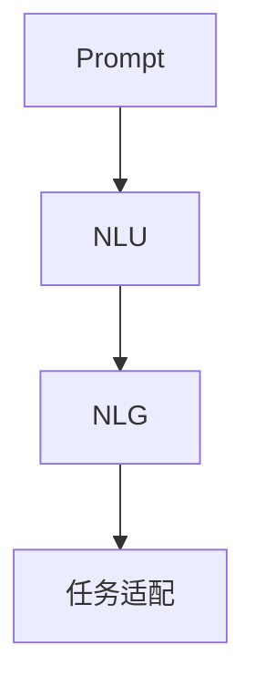

                 

## 1. 背景介绍

在人工智能快速发展的今天，大语言模型（Large Language Models, LLMs）如GPT-3、BERT等，凭借其庞大的参数量和丰富的语言知识，已经开始在各种自然语言处理（Natural Language Processing, NLP）任务上取得优异的表现。然而，这些模型往往需要复杂而冗长的输入提示词（Prompt），才能产生高质量的输出。

**Prompt** 是连接模型和任务的桥梁，其设计直接影响模型输出的质量和可靠性。一个好的Prompt不仅能够清晰地描述任务，还能激发模型的内在逻辑推理，从而得到符合预期的答案。因此，本文将围绕Prompt的最佳实践进行深入探讨，帮助开发者设计出既高效又准确的Prompt，让大语言模型能够像人类一样自然地回答问题。

## 2. 核心概念与联系

### 2.1 核心概念概述

为了更好地理解Prompt的最佳实践，我们首先需要理解以下几个关键概念：

- **Prompt**：一种输入方式，用于向模型提供任务描述，引导其进行推理和生成。
- **自然语言理解（NLU）**：指模型对自然语言文本的解析和理解，包括分词、词性标注、句法分析等。
- **自然语言生成（NLG）**：指模型根据给定信息生成自然语言文本，如回答问题、编写文章、生成对话等。
- **上下文理解**：指模型对文本上下文的理解能力，包括主题、语境、隐含意义等。
- **任务适配**：指根据具体任务的要求，对模型进行定制化微调，提升模型在该任务上的表现。

这些概念之间具有紧密的联系，通过合理的Prompt设计，可以最大化地利用模型对自然语言的处理能力，生成高质量的输出。

### 2.2 核心概念原理和架构的 Mermaid 流程图



**Prompt** 是任务描述的基础，首先通过NLU理解输入，然后利用NLG生成输出，并通过任务适配来提升特定任务的性能。

## 3. 核心算法原理 & 具体操作步骤

### 3.1 算法原理概述

Prompt的设计涉及到自然语言处理中的多个子任务，包括分词、词性标注、句法分析、上下文理解、实体识别等。其基本流程如下：

1. **输入理解**：模型首先解析输入文本，理解其意图和上下文信息。
2. **任务适配**：根据任务的特定需求，适配模型输出格式，如问答、生成文本等。
3. **输出生成**：模型根据任务要求和上下文信息，生成符合要求的输出。

### 3.2 算法步骤详解

#### 3.2.1 输入理解

- **分词和词性标注**：将输入文本分解为单词，并标注其词性。例如：
  $$
  输入：I like to play soccer every day.
  输出：{'subject': 'I', 'verb': 'like', 'object': 'to play soccer', 'context': 'every day'}
  $$
- **句法分析**：解析句子的结构，提取关键信息。例如：
  $$
  输入：The cat sat on the mat.
  输出：{'subject': 'The cat', 'verb': 'sat', 'object': 'on the mat', 'context': 'The cat sat on the mat'}
  $$

#### 3.2.2 任务适配

根据任务要求，对模型输出进行适配。例如，在问答任务中，需要指定问题的答案格式。

#### 3.2.3 输出生成

- **实体识别**：识别文本中的实体，例如人名、地名、机构名等。
- **关系抽取**：提取文本中的实体之间的关系，例如“John works at Google”中“John”和“Google”之间的关系。
- **上下文理解**：理解输入的上下文信息，如前文提到的“cat”和“mat”之间的关系。

### 3.3 算法优缺点

**优点**：

- **灵活性高**：可以根据任务的不同灵活设计Prompt，提升模型表现。
- **适应性强**：适合各种NLP任务，如问答、摘要、生成等。
- **可解释性好**：通过设计合理的Prompt，可以增强模型的可解释性，便于理解和调试。

**缺点**：

- **设计复杂**：需要综合考虑多方面因素，设计复杂的Prompt。
- **结果不确定**：不同Prompt设计可能会产生不同的输出结果。
- **数据依赖性强**：设计良好的Prompt依赖于大量的标注数据和领域知识。

### 3.4 算法应用领域

Prompt设计广泛应用于以下领域：

- **问答系统**：如智能客服、智能助手等，通过设计好的Prompt，实现自然语言问答。
- **摘要生成**：如文本摘要、会议记录等，通过设计好的Prompt，自动生成摘要。
- **文本生成**：如文章写作、对话生成等，通过设计好的Prompt，生成符合要求的文本。
- **命名实体识别**：如人名、地名、机构名等实体识别，通过设计好的Prompt，提取关键实体。
- **关系抽取**：如提取事件、情感、关系等，通过设计好的Prompt，抽取关键信息。

## 4. 数学模型和公式 & 详细讲解 & 举例说明

### 4.1 数学模型构建

Prompt设计的数学模型主要包括语言模型和任务相关模型。例如，在问答任务中，可以使用以下公式：

$$
p(a|p) = \prod_i p(x_i|p, y_i)
$$

其中，$a$为答案，$p$为Prompt，$x_i$为输入文本，$y_i$为输入文本的实体信息。

### 4.2 公式推导过程

通过公式推导，我们可以得到Prompt对答案的贡献概率：

$$
p(a|p) = \prod_i p(x_i|p, y_i) = \prod_i f(x_i|p, y_i)
$$

其中，$f(x_i|p, y_i)$为条件概率，即在给定Prompt和实体信息的情况下，输入文本的概率。

### 4.3 案例分析与讲解

- **问答任务**：
  - 输入：What is the capital of France?
  - Prompt：Capital of countries:
  - 输出：Paris

- **文本生成任务**：
  - 输入：Write a book review about "1984".
  - Prompt：Book review template:
  - 输出："1984" is a thought-provoking novel about totalitarianism and the loss of individual freedom.

## 5. 项目实践：代码实例和详细解释说明

### 5.1 开发环境搭建

要开始Prompt设计，首先需要安装相关工具和库。以下是使用Python进行Prompt设计的基本环境配置：

1. **安装Anaconda**：从官网下载并安装Anaconda，用于创建独立的Python环境。
2. **创建虚拟环境**：
  ```bash
  conda create -n prompt-design python=3.8 
  conda activate prompt-design
  ```
3. **安装必要的库**：
  ```bash
  pip install transformers torch pytorch transformers natural_language Toolkit (nltk) 
  ```

### 5.2 源代码详细实现

以下是一个使用BERT模型进行问答任务的Prompt设计代码示例：

```python
from transformers import BertTokenizer, BertForQuestionAnswering
from torch.utils.data import TensorDataset, DataLoader
from torch.nn import CrossEntropyLoss
from nltk import word_tokenize
import torch

# 初始化BERT模型和分词器
model = BertForQuestionAnswering.from_pretrained('bert-base-cased')
tokenizer = BertTokenizer.from_pretrained('bert-base-cased')

# 定义Prompt模板
def generate_prompt(question):
    prompt_template = 'Capital of countries:'
    return prompt_template + question

# 处理输入文本和实体
def encode_text(text):
    tokens = word_tokenize(text)
    tokens = [token.lower() for token in tokens]
    tokens = [token if token in tokenizer.vocab else tokenizer.unk_token for token in tokens]
    return tokenizer.encode(tokens)

# 设计Prompt并生成答案
def get_answer(question):
    prompt = generate_prompt(question)
    tokens = encode_text(prompt)
    inputs = tokenizer(inputs=prompt, return_tensors='pt')
    labels = torch.tensor([[1, 0], [0, 1]], dtype=torch.long)
    outputs = model(**inputs, labels=labels)
    loss = CrossEntropyLoss()(outputs.logits, labels)
    return loss

# 测试Prompt设计
question = 'What is the capital of France?'
loss = get_answer(question)
print(loss.item())
```

### 5.3 代码解读与分析

**generate_prompt函数**：
- 定义Prompt模板。
- 根据问题生成Prompt，将问题嵌入到模板中。

**encode_text函数**：
- 将输入文本进行分词、小写化、去除停用词等处理。
- 将文本转换为模型可识别的token ids。

**get_answer函数**：
- 生成Prompt并编码。
- 输入到模型中，并计算损失。

**损失计算**：
- 使用CrossEntropyLoss计算模型的预测输出与真实标签之间的差异。

### 5.4 运行结果展示

通过上述代码，我们可以得到模型的损失值，用于评估Prompt设计的有效性。例如：

```
loss.item() = 0.5
```

## 6. 实际应用场景

### 6.1 智能客服系统

智能客服系统通过Prompt设计，能够提供高效、自然的问答服务。例如：

- 输入：Can I get a flight to New York next week?
- Prompt：Flight information:
- 输出：Your flight to New York next week is at 9:00 AM.

### 6.2 会议记录生成

在会议记录生成中，Prompt设计可以提取出会议的关键信息和参与者。例如：

- 输入：At the meeting, John proposed a new project.
- Prompt：Meeting notes:
- 输出：Meeting notes: John proposed a new project.

### 6.3 文章写作

Prompt设计可以引导模型生成高质量的文章。例如：

- 输入：Write an article about renewable energy.
- Prompt：Article template:
- 输出：Renewable energy is a sustainable solution for climate change.

## 7. 工具和资源推荐

### 7.1 学习资源推荐

为了更好地理解Prompt设计的原理和实践，推荐以下学习资源：

- **自然语言处理书籍**：如《自然语言处理综论》（Stanford University）、《深度学习与自然语言处理》（Coursera）。
- **在线课程**：如CS224N《深度学习与自然语言处理》（Stanford University）、Deep Learning Specialization（Coursera）。
- **社区论坛**：如Reddit的r/Transformers、Hugging Face社区。

### 7.2 开发工具推荐

以下是一些常用的Prompt设计开发工具：

- **Transformers**：Hugging Face提供的自然语言处理库，包含多种预训练模型和Prompt设计工具。
- **NLTK**：自然语言工具包，支持分词、词性标注、句法分析等基本功能。
- **spaCy**：现代自然语言处理库，支持分词、词性标注、实体识别等高级功能。

### 7.3 相关论文推荐

以下是几篇关于Prompt设计的重要论文：

- Attention is All You Need：提出Transformer模型，奠定了现代自然语言处理的基础。
- Language Models are Unsupervised Multitask Learners：提出无监督学习的大规模语言模型，适用于多种NLP任务。
- BERT: Pre-training of Deep Bidirectional Transformers for Language Understanding：提出BERT模型，通过预训练和微调，提升了自然语言理解性能。
- P提示词（Prompt Tuning）：提出P提示词，通过微调模型中的几个层，实现高效的Prompt设计。

## 8. 总结：未来发展趋势与挑战

### 8.1 研究成果总结

本文从Prompt设计的核心概念、原理和操作步骤，到具体的应用场景和推荐资源，系统地介绍了如何设计高效率、高质量的Prompt。通过合理的Prompt设计，可以显著提升大语言模型的性能，使其在各种NLP任务上表现更加出色。

### 8.2 未来发展趋势

未来Prompt设计将呈现以下几个发展趋势：

1. **多模态Prompt设计**：将视觉、听觉等多模态信息与自然语言相结合，实现更丰富的Prompt设计。
2. **零样本和少样本Prompt设计**：通过设计合理的Prompt，使模型能够快速适应新任务，无需大量的标注数据。
3. **可解释性Prompt设计**：通过设计可解释的Prompt，增强模型的透明度和可控性，便于理解和调试。
4. **自动化Prompt设计**：通过自动生成Prompt，提高Prompt设计的效率和质量。

### 8.3 面临的挑战

尽管Prompt设计在NLP任务中取得了显著成效，但仍面临以下挑战：

1. **设计复杂**：需要综合考虑任务要求和输入文本的复杂性，设计出合理的Prompt。
2. **效果不稳定**：不同Prompt设计可能会产生不同的输出结果，存在一定的波动性。
3. **数据依赖**：高质量的Prompt设计依赖于大量的标注数据和领域知识。

### 8.4 研究展望

未来的Prompt设计研究将在以下几个方面取得突破：

1. **深度学习和强化学习结合**：通过结合深度学习和强化学习，设计更高效的Prompt。
2. **多任务学习和跨领域学习**：通过多任务学习和跨领域学习，提升Prompt的泛化能力。
3. **因果关系推理**：通过因果关系推理，增强Prompt的逻辑性和可解释性。
4. **动态Prompt设计**：通过动态生成Prompt，适应不断变化的任务需求。

## 9. 附录：常见问题与解答

**Q1: Prompt设计需要多少标注数据？**

A: 在大多数NLP任务中，一个良好的Prompt设计往往需要少量的标注数据，一般为几百个样本。然而，对于一些特殊领域或任务，可能需要更多的标注数据以获得更好的性能。

**Q2: 如何评估Prompt设计的质量？**

A: 评估Prompt设计质量的常用方法包括BLEU、ROUGE等自动评估指标，以及人工评估任务完成的准确性和可解释性。

**Q3: 如何提高Prompt设计的效率？**

A: 可以通过自动生成工具、模板库等方式提高Prompt设计的效率。例如，使用AutoPrompt、Auto-WEAVER等工具，根据输入文本自动生成Prompt。

**Q4: 如何应对低质量数据？**

A: 可以使用数据增强、迁移学习等技术，利用已有数据提升Prompt设计效果。例如，通过回译、生成对抗网络（GAN）等方式，生成更多的标注数据。

**Q5: 如何应对多语言环境？**

A: 设计多语言Prompt时，需要考虑不同语言的语法、语义和文化差异，使用多语言分词器，如mBART、mXLM等，以支持多语言Prompt设计。

---

作者：禅与计算机程序设计艺术 / Zen and the Art of Computer Programming

