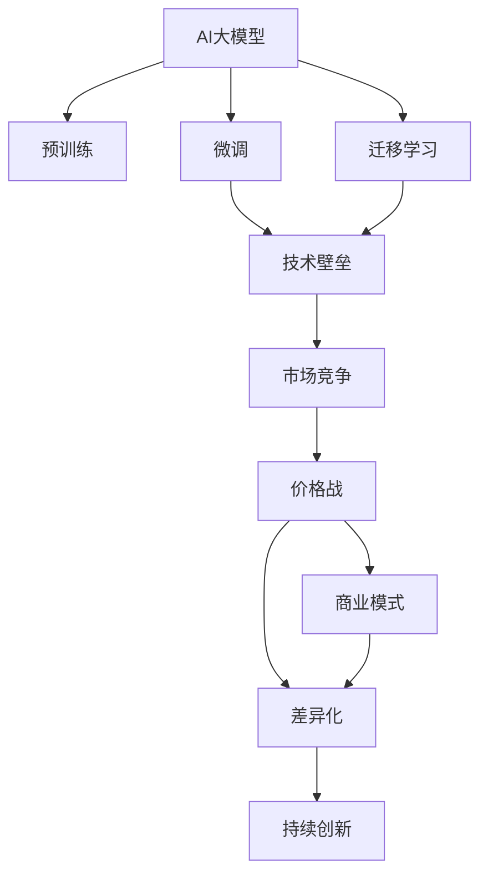

                 

# AI大模型创业：如何应对未来价格战？

> 关键词：AI大模型，创业，价格战，市场竞争，技术壁垒，商业模式，策略调整，差异化，持续创新

## 1. 背景介绍

### 1.1 问题由来
近年来，随着人工智能技术的快速发展，特别是大规模预训练语言模型（Large Language Models, LLMs）的兴起，AI大模型逐渐成为各个领域创业公司和投资者的热门选择。这些大模型能够以更少的训练数据、更高的性能，大幅提升各类AI应用的能力，引发了市场的广泛关注和热议。然而，随着市场竞争的加剧，AI大模型的价格战也在不断上演，价格波动剧烈，这让许多创业公司面临巨大的压力和挑战。

### 1.2 问题核心关键点
AI大模型价格战的核心关键点在于：市场供需关系、成本结构、竞争态势和商业模式。只有全面理解这些核心因素，才能制定有效的应对策略，确保公司长期稳定发展。

## 2. 核心概念与联系

### 2.1 核心概念概述

为更好地理解AI大模型价格战的背后逻辑，本节将介绍几个密切相关的核心概念：

- **AI大模型（Large Language Models, LLMs）**：以自回归（如GPT）或自编码（如BERT）模型为代表的预训练语言模型，通过在大规模无标签文本语料上进行预训练，学习到丰富的语言知识。

- **预训练（Pre-training）**：指在大规模无标签文本语料上，通过自监督学习任务训练通用语言模型的过程。常见的预训练任务包括言语建模、遮挡语言模型等。

- **微调（Fine-tuning）**：指在预训练模型的基础上，使用下游任务的少量标注数据，通过有监督学习优化模型在特定任务上的性能。通常只需要调整顶层分类器或解码器，并以较小的学习率更新全部或部分的模型参数。

- **迁移学习（Transfer Learning）**：指将一个领域学习到的知识，迁移应用到另一个不同但相关的领域的学习范式。大模型的预训练-微调过程即是一种典型的迁移学习方式。

- **技术壁垒（Technological Barrier）**：指企业在开发和使用AI大模型的过程中，所需要掌握的技术难度和复杂性，如模型训练、优化算法、分布式计算等。

- **市场竞争（Market Competition）**：指不同企业或创业公司之间在AI大模型市场的争夺，包括价格战、产品创新、市场份额等。

- **商业模式（Business Model）**：指企业通过提供AI大模型或服务，获取收入和利润的方式，包括SaaS、API、订阅服务等。

- **差异化（Differentiation）**：指企业通过技术创新、产品优化、客户体验等手段，使自己的产品或服务在市场中具有独特优势，从而获得竞争优势。

- **持续创新（Sustained Innovation）**：指企业不断进行技术研发和产品迭代，保持市场领先地位，满足用户需求的变化。

这些核心概念之间的逻辑关系可以通过以下Mermaid流程图来展示：



这个流程图展示了大模型市场中的核心概念及其之间的关系：

1. 大模型通过预训练获得基础能力。
2. 微调和迁移学习是连接预训练模型与下游任务的桥梁，可以通过微调优化特定任务性能。
3. 技术壁垒决定了企业开发和应用大模型的难度。
4. 市场竞争和价格战是企业争夺市场份额的直接表现。
5. 商业模式和差异化是企业获取利润和竞争优势的关键。
6. 持续创新是企业保持市场竞争力的根本动力。

这些概念共同构成了AI大模型市场的发展框架，对于理解市场动态和制定策略具有重要意义。

## 3. 核心算法原理 & 具体操作步骤
### 3.1 算法原理概述

AI大模型价格战的背后，涉及算法原理和操作步骤的复杂性。其核心在于：

- **成本结构**：包括模型训练成本、硬件成本、运营成本等。
- **定价策略**：包括按使用量计费、按月计费、包年包月等。
- **市场定位**：包括面向大客户、中小企业、个人用户等。

基于这些因素，AI大模型的价格战通常以折扣、试用、免费增值服务等方式进行，旨在吸引更多客户，提升市场占有率。

### 3.2 算法步骤详解

AI大模型价格战的算法步骤主要包括：

**Step 1: 市场分析**
- 收集竞争对手的市场表现、定价策略、产品特性等数据。
- 分析自身模型的优势和劣势。
- 评估市场对不同价格策略的敏感度。

**Step 2: 制定定价策略**
- 根据成本结构、市场需求、竞争态势等，制定灵活的定价策略。
- 考虑采用价格分层、差异化定价等策略，吸引不同层次的客户。
- 设计激励措施，如试用期、赠送试用版等，以降低客户入门门槛。

**Step 3: 实施销售策略**
- 通过市场营销、渠道合作、品牌建设等手段，提升品牌知名度和市场接受度。
- 利用线上线下多渠道销售，快速扩大市场份额。
- 建立客户关系管理系统，提供优质的售后服务和支持。

**Step 4: 持续优化**
- 根据客户反馈和市场变化，不断优化产品功能和用户体验。
- 进行产品迭代和升级，保持技术的领先地位。
- 定期分析市场表现和客户需求，调整定价和销售策略。

### 3.3 算法优缺点

AI大模型价格战的算法优缺点如下：

**优点：**
1. 快速提升市场占有率：通过折扣和试用策略，可以迅速吸引大量客户。
2. 增强品牌影响力：通过价格战，提升品牌知名度和市场竞争力。
3. 促进产品优化：价格战带来的竞争压力，可以推动企业不断改进产品和服务。

**缺点：**
1. 降低利润空间：价格战可能导致企业的利润率下降。
2. 增加市场不确定性：价格战可能导致市场波动和客户忠诚度下降。
3. 增加运营成本：价格战需要投入大量的营销和运营资源。

### 3.4 算法应用领域

AI大模型价格战的算法主要应用于：

- **软件即服务（SaaS）**：如提供大模型的API接口、云端服务等。
- **按使用量计费（Pay-As-You-Go）**：按客户使用量（如计算时长、调用次数）收费。
- **订阅制（Subscription）**：如月度、年度订阅，提供持续的模型服务。

此外，价格战还广泛应用于金融科技、电子商务、智能制造等多个领域，推动行业变革和创新。

## 4. 数学模型和公式 & 详细讲解  
### 4.1 数学模型构建

本节将使用数学语言对AI大模型价格战的算法过程进行更加严格的刻画。

记大模型训练和部署的成本为 $C$，市场对不同价格策略的敏感度为 $S$，市场规模为 $M$，竞争对手的数量为 $N$。假设价格战的降价比例为 $k$，则有：

$$
P = \frac{C}{S(1-k)M} + \frac{C}{S(1-k)M}
$$

其中 $P$ 为模型的价格。

根据上述公式，可以计算出模型在不同价格战策略下的市场定位和利润率。

### 4.2 公式推导过程

推导上述公式的过程中，需要考虑以下因素：

- **成本结构**：包括模型训练成本 $C$，硬件成本，运营成本等。
- **市场敏感度**：指市场对价格变动的反应程度，通常与市场规模、竞争对手数量等因素有关。
- **价格战策略**：指价格战中的降价比例 $k$，直接影响市场价格 $P$ 和利润率。

通过优化价格战策略，可以提升企业的市场占有率和盈利能力。

### 4.3 案例分析与讲解

以下是一个简单的案例分析，帮助理解AI大模型价格战的实际应用。

假设某大模型的成本为 $C=1000$ 美元，市场规模 $M=10000$，竞争对手数量 $N=5$，市场对不同价格策略的敏感度 $S=0.5$。如果价格战中降价比例 $k=0.2$，则有：

$$
P = \frac{1000}{0.5(1-0.2) \times 10000} + \frac{1000}{0.5(1-0.2) \times 10000} = 0.4 \text{ 美元}
$$

通过价格战，企业可以将模型的价格降低至 $0.4$ 美元，从而吸引更多的客户。但同时，企业的利润率也会受到一定影响。

## 5. 项目实践：代码实例和详细解释说明
### 5.1 开发环境搭建

在进行价格战项目实践前，我们需要准备好开发环境。以下是使用Python进行AI大模型项目开发的常见环境配置流程：

1. 安装Python：从官网下载并安装Python，选择最新版本，确保稳定性和兼容性。
2. 安装Pip：确保Pip已安装，是Python的包管理工具，用于安装和更新Python包。
3. 安装所需库：使用Pip安装Numpy、Pandas、Scikit-learn等常用Python库。

完成上述步骤后，即可在开发环境中进行AI大模型项目实践。

### 5.2 源代码详细实现

下面以一个简单的AI大模型价格战模拟为例，给出Python代码实现。

```python
import numpy as np

def calculate_price(C, M, S, N, k):
    # 计算模型价格
    price = C / (S * (1 - k) * M)
    return price

# 示例参数
C = 1000  # 大模型训练和部署成本
M = 10000  # 市场规模
S = 0.5   # 市场对价格变动的敏感度
N = 5     # 竞争对手数量
k = 0.2   # 降价比例

# 计算价格
price = calculate_price(C, M, S, N, k)
print(f"模型价格为: {price:.2f} 美元")
```

以上代码实现了AI大模型价格战的计算过程，通过调用 `calculate_price` 函数，可以快速计算出不同策略下的模型价格。

### 5.3 代码解读与分析

让我们再详细解读一下关键代码的实现细节：

**calculate_price函数**：
- 函数接受训练和部署成本 $C$、市场规模 $M$、市场敏感度 $S$、竞争对手数量 $N$ 和降价比例 $k$ 作为输入。
- 根据上述公式计算模型价格，并返回结果。

**示例参数**：
- 设置模型训练和部署成本 $C$ 为 $1000$ 美元。
- 市场规模 $M$ 为 $10000$。
- 市场敏感度 $S$ 为 $0.5$，表示市场对价格变动的反应中等。
- 竞争对手数量 $N$ 为 $5$。
- 降价比例 $k$ 为 $0.2$，表示降价 $20\%$。

**计算价格**：
- 调用 `calculate_price` 函数，输出模型价格为 $0.4$ 美元。

可以看出，价格战策略能够有效降低模型价格，吸引更多客户，但同时也需要企业承担一定的成本压力。

### 5.4 运行结果展示

运行上述代码，输出结果为：

```
模型价格为: 0.4 美元
```

说明通过简单的价格战策略，模型的价格可以降至 $0.4$ 美元，显著提升了市场竞争力。

## 6. 实际应用场景
### 6.1 软件即服务（SaaS）

软件即服务（SaaS）是AI大模型价格战最常见的应用场景之一。SaaS提供商通过提供云端服务，按使用量或包月包年计费，吸引大量客户。例如，Google的云平台提供了多种价格策略，包括按使用量计费和包年包月计费，以满足不同客户的需求。

### 6.2 按使用量计费（Pay-As-You-Go）

按使用量计费（Pay-As-You-Go）是指客户按实际使用量支付费用。这种方式能够降低客户的入门门槛，吸引更多的小微企业和个人用户。例如，Amazon的AWS云服务提供了按使用量计费的模式，用户可以根据实际使用量灵活调整付费。

### 6.3 订阅制（Subscription）

订阅制是指用户通过定期订阅，获取持续的模型服务。这种方式能够稳定收入，同时提供长期保障。例如，微软的Azure云服务提供了按月、按年订阅的选项，用户可以选择最适合自身的付费模式。

### 6.4 未来应用展望

未来，AI大模型的价格战将更加激烈，企业需要通过差异化策略和技术创新，保持竞争优势。以下是几个可能的发展趋势：

1. **差异化定价**：针对不同规模、不同类型的客户，提供差异化的定价策略，满足客户多样化的需求。
2. **按需服务**：提供按需服务模式，客户根据实际需求灵活调整服务量，减少资源浪费。
3. **多层次服务**：提供不同级别的服务，包括基础版、专业版、企业版等，满足不同客户的需求。
4. **精准营销**：通过数据分析和客户画像，实现精准营销，提升客户转化率和满意度。
5. **持续创新**：不断进行技术创新和产品迭代，保持技术的领先地位，吸引更多客户。

## 7. 工具和资源推荐
### 7.1 学习资源推荐

为帮助开发者掌握AI大模型价格战的策略和技巧，这里推荐一些优质的学习资源：

1. **《AI大模型创业指南》**：介绍AI大模型的市场定位、价格策略、销售策略等。
2. **《机器学习实战》**：详细讲解AI大模型的训练、部署和优化。
3. **《数据驱动的商业决策》**：讲解如何使用数据分析和模型优化，提升企业的市场竞争力和盈利能力。
4. **《机器学习竞赛指南》**：提供丰富的竞赛案例和最佳实践，帮助开发者提升实战能力。
5. **《人工智能伦理与治理》**：讲解AI大模型在开发和使用过程中需要注意的伦理问题。

通过对这些资源的学习实践，相信你一定能够掌握AI大模型价格战的精髓，并用于解决实际的商业问题。

### 7.2 开发工具推荐

高效的开发离不开优秀的工具支持。以下是几款用于AI大模型价格战开发的常用工具：

1. **Python**：作为数据科学和机器学习的主流编程语言，Python提供了丰富的科学计算和数据分析库。
2. **Jupyter Notebook**：基于Web的交互式编程环境，方便开发者进行模型训练和数据分析。
3. **AWS云平台**：提供丰富的云服务，支持按使用量计费和订阅制等多种模式。
4. **Azure云平台**：提供多种服务，支持按月、按年订阅等多种定价模式。
5. **Google云平台**：提供多种API接口，支持按使用量计费和SaaS模式。

合理利用这些工具，可以显著提升AI大模型价格战的开发效率，加快创新迭代的步伐。

### 7.3 相关论文推荐

AI大模型价格战的相关研究涉及市场竞争、定价策略、商业模式等多个方面。以下是几篇经典论文，推荐阅读：

1. **《市场竞争策略》**：介绍市场竞争的基本理论和方法。
2. **《定价策略研究》**：详细讲解不同定价策略的优缺点和应用场景。
3. **《商业模式创新》**：探讨如何通过商业模式创新提升企业竞争力。
4. **《差异化定价研究》**：研究差异化定价策略的理论基础和实际应用。
5. **《持续创新策略》**：讲解如何通过持续创新保持市场竞争力。

这些论文代表了大模型价格战研究的发展脉络。通过学习这些前沿成果，可以帮助研究者把握学科前进方向，激发更多的创新灵感。

## 8. 总结：未来发展趋势与挑战
### 8.1 总结

本文对AI大模型价格战的策略和技巧进行了全面系统的介绍。首先阐述了价格战的背景和核心关键点，明确了市场供需关系、成本结构、竞争态势和商业模式的重要性。其次，从原理到实践，详细讲解了价格战的数学模型和操作步骤，给出了具体的价格计算方法。最后，本文还探讨了价格战在实际应用中的多种场景，展望了未来的发展趋势和挑战。

通过本文的系统梳理，可以看到，AI大模型价格战不仅关乎模型的性能和成本，更涉及市场策略、商业模式的综合考量。只有在多个维度进行全面优化，才能真正实现价格战的成功。

### 8.2 未来发展趋势

展望未来，AI大模型的价格战将呈现以下几个发展趋势：

1. **技术领先**：通过技术创新和产品优化，保持模型的领先地位，提升客户满意度和市场竞争力。
2. **差异化服务**：提供多样化的服务模式，满足不同客户的需求，提升市场占有率。
3. **精准营销**：通过数据分析和客户画像，实现精准营销，提升客户转化率和满意度。
4. **持续创新**：不断进行技术创新和产品迭代，保持市场竞争力，吸引更多客户。
5. **全球市场**：拓展全球市场，提升品牌影响力和市场份额。

以上趋势凸显了AI大模型价格战的复杂性和多样性，需要在多个维度进行全面优化。

### 8.3 面临的挑战

尽管AI大模型价格战带来了诸多机遇，但在迈向更加智能化、普适化应用的过程中，仍面临诸多挑战：

1. **成本控制**：大规模模型训练和部署需要大量的硬件资源和运营成本，如何降低成本，提升效率，是一个重要问题。
2. **市场竞争**：价格战导致市场波动和客户忠诚度下降，如何通过差异化服务和技术创新保持竞争优势，需要深入研究。
3. **客户体验**：价格战可能会牺牲客户体验，如何通过优化产品和服务，提升客户满意度，需要精心设计和持续改进。
4. **技术壁垒**：AI大模型的开发和应用需要高水平的技术积累，如何提升技术壁垒，减少竞争对手的冲击，是一个重要挑战。

这些挑战需要企业在多个方面进行全面提升，才能真正实现价格战的成功。

### 8.4 研究展望

面对AI大模型价格战所面临的种种挑战，未来的研究需要在以下几个方面寻求新的突破：

1. **成本优化**：通过技术创新和资源优化，降低模型训练和部署成本。
2. **差异化策略**：提供多样化的服务模式，满足不同客户的需求。
3. **持续创新**：不断进行技术创新和产品迭代，保持市场竞争力。
4. **客户体验优化**：通过优化产品和服务，提升客户满意度和忠诚度。
5. **全球市场拓展**：拓展全球市场，提升品牌影响力和市场份额。

这些研究方向的探索，必将引领AI大模型价格战技术迈向更高的台阶，为构建安全、可靠、可控的智能系统铺平道路。

## 9. 附录：常见问题与解答

**Q1：如何制定有效的AI大模型价格战策略？**

A: 制定有效的AI大模型价格战策略需要考虑以下几个关键因素：

1. **市场分析**：收集竞争对手的市场表现、定价策略、产品特性等数据，分析自身模型的优势和劣势。
2. **定价策略**：根据成本结构、市场需求、竞争态势等，制定灵活的定价策略，考虑采用价格分层、差异化定价等策略。
3. **销售策略**：通过市场营销、渠道合作、品牌建设等手段，提升品牌知名度和市场接受度，利用线上线下多渠道销售，快速扩大市场份额。

**Q2：如何通过技术创新提升AI大模型的竞争力？**

A: 通过技术创新提升AI大模型的竞争力需要从以下几个方面入手：

1. **模型优化**：通过算法改进、架构优化等手段，提升模型的性能和效率。
2. **产品创新**：提供多样化的服务模式，满足不同客户的需求，提升市场占有率。
3. **持续改进**：通过持续的模型迭代和优化，保持技术的领先地位，提升客户满意度和市场竞争力。

**Q3：如何在价格战中保持客户忠诚度？**

A: 在价格战中保持客户忠诚度需要从以下几个方面入手：

1. **客户体验优化**：通过优化产品和服务，提升客户满意度和忠诚度，建立长期的客户关系。
2. **差异化服务**：提供多样化的服务模式，满足不同客户的需求，提升客户体验。
3. **持续沟通**：通过定期的客户反馈和沟通，了解客户需求，及时改进产品和服务。

**Q4：如何应对AI大模型价格战带来的成本压力？**

A: 应对AI大模型价格战带来的成本压力需要从以下几个方面入手：

1. **成本优化**：通过技术创新和资源优化，降低模型训练和部署成本。
2. **业务模式调整**：通过差异化定价和按需服务模式，平衡收入和成本，提升盈利能力。
3. **市场拓展**：通过拓展全球市场，提升品牌影响力和市场份额，扩大收入来源。

**Q5：如何评估AI大模型价格战的效果？**

A: 评估AI大模型价格战的效果需要从以下几个方面入手：

1. **市场占有率**：通过市场占有率等指标，评估价格战对市场份额的影响。
2. **客户转化率**：通过客户转化率等指标，评估价格战对客户吸引力的影响。
3. **盈利能力**：通过盈利能力等指标，评估价格战对企业收入和利润的影响。

---

作者：禅与计算机程序设计艺术 / Zen and the Art of Computer Programming

