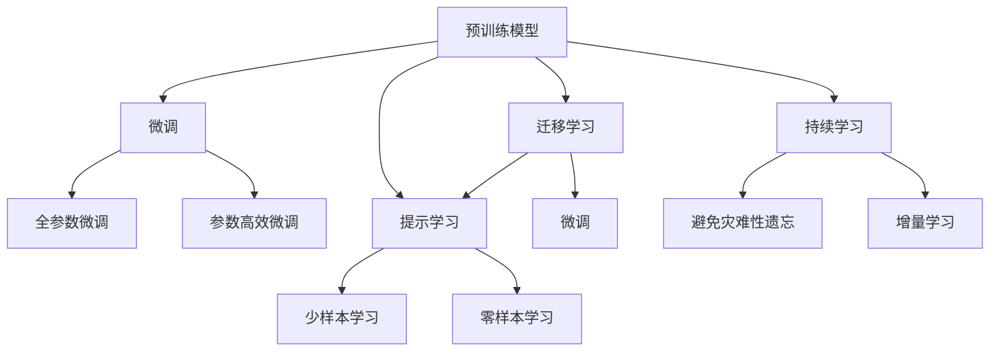

                 

# AI大模型创业：如何应对未来行业发展趋势？

## 1. 背景介绍

### 1.1 问题由来

近年来，人工智能(AI)技术迅猛发展，尤其是大模型（Large Language Models, LLMs）在自然语言处理（NLP）领域取得了突破性进展。OpenAI的GPT系列、Google的BERT、Hugging Face的XLNet等预训练语言模型，以及在大模型基础上的微调（Fine-Tuning）和迁移学习（Transfer Learning）技术，使NLP应用从传统的文本分类、情感分析等任务扩展到了多模态数据处理、自动生成、对话系统、问答系统等多个领域。

大模型驱动的AI创业浪潮已经兴起。越来越多的初创企业利用大模型的强大能力，开发定制化解决方案，驱动各种行业的智能化转型。然而，随着技术的发展和市场需求的不断变化，如何应对未来行业发展趋势，确保AI大模型的长期竞争力和市场价值，成为创业者和企业的核心挑战。

### 1.2 问题核心关键点

面对未来行业发展趋势，AI大模型创业需要关注的核心关键点包括：

- **数据质量与多样性**：高精度的AI模型依赖于高质量的训练数据。在未来，数据的多样性和实时性将成为主要挑战。
- **模型大小与资源**：大规模模型的训练与部署需要巨大的计算资源和存储空间，如何平衡性能与资源成本，是创业企业的首要难题。
- **应用场景与业务需求**：大模型需要在特定行业和场景中发挥作用，如何将其与业务需求紧密结合，是成功商业化的关键。
- **技术创新与持续优化**：技术日新月异，如何持续跟踪前沿进展，及时调整和优化模型，是保持竞争力的重要保障。
- **数据隐私与伦理合规**：数据隐私保护和伦理合规问题日益严峻，如何在商业化过程中解决这些问题，是确保企业可持续发展的基础。

## 2. 核心概念与联系

### 2.1 核心概念概述

大语言模型是经过大规模预训练的深度学习模型，能够理解并生成自然语言，广泛应用于NLP领域。其核心概念包括：

- **预训练模型**：如BERT、GPT等，在大规模无标签文本数据上学习通用语言表示。
- **微调**：在大模型基础上，使用下游任务的少量标注数据进行有监督训练，优化模型在特定任务上的表现。
- **迁移学习**：利用大模型的预训练能力，通过微调在新任务上提升性能，减少从头训练的时间和成本。
- **参数高效微调**：只更新少量模型参数，提高微调效率，避免过拟合。
- **提示学习**：通过设计输入模板，引导模型生成特定格式或内容的输出。
- **少样本学习**：使用少量标注样本进行学习，提升模型的泛化能力。
- **零样本学习**：模型在未见过的数据上，通过任务描述生成输出。

这些概念相互关联，共同构成了大模型的学习和应用框架。以下是其逻辑关系示意图：



### 2.2 核心概念原理和架构

大语言模型基于Transformer架构，通过自注意力机制（Self-Attention）学习输入序列中的语义关系。预训练模型如BERT使用掩码语言模型（Masked Language Modeling, MLM）任务，GPT使用自回归语言模型（Autoregressive Language Modeling）任务，学习语言表征。微调则是将预训练模型应用到特定任务上，通过有监督学习优化模型参数，提升模型在该任务上的表现。


Transformer架构的核心是多头自注意力机制，能够捕捉序列中的复杂语义关系，是预训练语言模型的重要基础。其训练过程分为两步：

1. 预训练阶段：在大规模语料库上进行无监督学习，学习语言的基本结构和统计特征。
2. 微调阶段：在特定任务上使用少量标注数据进行有监督学习，优化模型参数，提升任务性能。

## 3. 核心算法原理 & 具体操作步骤

### 3.1 算法原理概述

基于监督学习的大语言模型微调，其核心思想是将预训练模型作为特征提取器，使用下游任务的少量标注数据进行有监督训练，优化模型参数，使其适应特定任务。这一过程可以通过梯度下降等优化算法实现，步骤如下：

1. 准备预训练模型和标注数据集。
2. 设计任务适配层，包括输出层和损失函数。
3. 设置微调超参数，如学习率、批次大小、迭代轮数等。
4. 执行梯度训练，更新模型参数。
5. 在验证集上评估模型性能，避免过拟合。
6. 在测试集上测试微调后的模型，对比性能提升。
7. 在实际应用中集成和使用微调模型。

### 3.2 算法步骤详解

具体实现步骤如下：

1. **数据准备**：收集标注数据集，将其划分为训练集、验证集和测试集。选择预训练模型如BERT或GPT。

2. **模型初始化**：加载预训练模型，添加任务适配层，包括输出层和损失函数，如交叉熵损失。

3. **超参数设置**：设置学习率、批次大小、迭代轮数等，选择优化器如AdamW。

4. **模型训练**：使用训练集进行梯度下降训练，更新模型参数。在每个epoch后，使用验证集评估模型性能，避免过拟合。

5. **模型评估**：在测试集上测试微调后的模型，对比预训练模型的性能提升。

6. **模型部署**：将微调后的模型集成到实际应用中，如智能客服、金融舆情监测、个性化推荐等。

### 3.3 算法优缺点

大语言模型微调具有以下优点：

- 简单高效：使用少量标注数据，即可快速提升模型性能。
- 应用广泛：适用于多种NLP任务，如分类、匹配、生成等。
- 参数高效：利用参数高效微调技术，减少需优化参数，提高效率。

同时，其缺点包括：

- 依赖标注数据：微调效果很大程度上取决于标注数据质量。
- 迁移能力有限：当目标任务与预训练数据的分布差异较大时，效果不佳。
- 模型偏见：预训练模型可能包含固有偏见，影响微调结果。

## 4. 数学模型和公式 & 详细讲解 & 举例说明

### 4.1 数学模型构建

基于监督学习的大语言模型微调，其数学模型可以形式化表示为：

- 预训练模型：$M_{\theta}$，其中$\theta$为模型参数。
- 标注数据集：$D=\{(x_i,y_i)\}_{i=1}^N$，$x_i$为输入，$y_i$为标签。
- 损失函数：$\mathcal{L}(\theta)$，衡量模型输出与真实标签之间的差异。

目标是最小化损失函数：

$$
\hat{\theta} = \mathop{\arg\min}_{\theta} \mathcal{L}(\theta)
$$

### 4.2 公式推导过程

以二分类任务为例，假设模型输出为$\hat{y}=M_{\theta}(x) \in [0,1]$，真实标签$y \in \{0,1\}$。

交叉熵损失函数为：

$$
\ell(M_{\theta}(x),y) = -[y\log \hat{y} + (1-y)\log (1-\hat{y})]
$$

经验风险为：

$$
\mathcal{L}(\theta) = \frac{1}{N}\sum_{i=1}^N \ell(M_{\theta}(x_i),y_i)
$$

利用梯度下降算法更新参数：

$$
\theta \leftarrow \theta - \eta \nabla_{\theta}\mathcal{L}(\theta) - \eta\lambda\theta
$$

其中$\eta$为学习率，$\lambda$为正则化系数。

### 4.3 案例分析与讲解

以情感分析任务为例，假设使用BERT模型进行微调。首先，准备标注数据集，将其划分为训练集、验证集和测试集。加载预训练模型BERT，添加线性输出层和交叉熵损失函数。

设置超参数，如学习率2e-5、批次大小16、迭代轮数5。执行梯度训练，在每个epoch后使用验证集评估模型性能。最后，在测试集上测试微调后的模型，对比预训练模型的性能提升。

## 5. 项目实践：代码实例和详细解释说明

### 5.1 开发环境搭建

使用Python和PyTorch搭建开发环境：

1. 安装Anaconda，创建独立的虚拟环境。
2. 安装PyTorch、Hugging Face Transformers库，以及其他相关工具包。
3. 设置GPU/TPU环境，启动Jupyter Notebook或Google Colab。

### 5.2 源代码详细实现

以下是使用Hugging Face Transformers库进行BERT情感分析微调的Python代码示例：

```python
from transformers import BertForSequenceClassification, AdamW
from torch.utils.data import Dataset, DataLoader
from torch.nn import CrossEntropyLoss
from sklearn.metrics import accuracy_score

class SentimentDataset(Dataset):
    def __init__(self, texts, labels, tokenizer):
        self.texts = texts
        self.labels = labels
        self.tokenizer = tokenizer
    
    def __len__(self):
        return len(self.texts)
    
    def __getitem__(self, idx):
        text = self.texts[idx]
        label = self.labels[idx]
        
        encoding = self.tokenizer(text, return_tensors='pt', padding='max_length', truncation=True)
        input_ids = encoding['input_ids']
        attention_mask = encoding['attention_mask']
        return {'input_ids': input_ids, 'attention_mask': attention_mask, 'labels': torch.tensor(label, dtype=torch.long)}

def train_epoch(model, dataset, optimizer, device, loss_fn):
    model.train()
    epoch_loss = 0
    for batch in DataLoader(dataset, batch_size=16, shuffle=True):
        input_ids = batch['input_ids'].to(device)
        attention_mask = batch['attention_mask'].to(device)
        labels = batch['labels'].to(device)
        model.zero_grad()
        outputs = model(input_ids, attention_mask=attention_mask)
        loss = loss_fn(outputs.logits, labels)
        epoch_loss += loss.item()
        loss.backward()
        optimizer.step()
    return epoch_loss / len(dataset)

def evaluate(model, dataset, device, loss_fn):
    model.eval()
    preds, labels = [], []
    with torch.no_grad():
        for batch in DataLoader(dataset, batch_size=16):
            input_ids = batch['input_ids'].to(device)
            attention_mask = batch['attention_mask'].to(device)
            labels = batch['labels'].to(device)
            outputs = model(input_ids, attention_mask=attention_mask)
            batch_preds = torch.argmax(outputs.logits, dim=1).to('cpu').tolist()
            for pred_tokens, label_tokens in zip(batch_preds, labels):
                preds.append(pred_tokens)
                labels.append(label_tokens)
    
    return accuracy_score(labels, preds)

# 加载预训练模型和任务适配层
model = BertForSequenceClassification.from_pretrained('bert-base-cased', num_labels=2)
tokenizer = BertTokenizer.from_pretrained('bert-base-cased')

# 准备标注数据集
train_dataset = SentimentDataset(train_texts, train_labels, tokenizer)
dev_dataset = SentimentDataset(dev_texts, dev_labels, tokenizer)
test_dataset = SentimentDataset(test_texts, test_labels, tokenizer)

# 设置超参数和优化器
optimizer = AdamW(model.parameters(), lr=2e-5)
device = torch.device('cuda' if torch.cuda.is_available() else 'cpu')
loss_fn = CrossEntropyLoss()

# 训练和评估模型
epochs = 5
for epoch in range(epochs):
    loss = train_epoch(model, train_dataset, optimizer, device, loss_fn)
    print(f'Epoch {epoch+1}, train loss: {loss:.3f}')
    
    print(f'Epoch {epoch+1}, dev accuracy: {evaluate(model, dev_dataset, device, loss_fn):.3f}')
    
print(f'Test accuracy: {evaluate(model, test_dataset, device, loss_fn):.3f}')
```

### 5.3 代码解读与分析

该代码实现了使用BERT模型进行情感分析微调的过程。首先，定义数据集类`SentimentDataset`，处理文本数据和标签，并使用BERT分词器进行编码。然后，加载BERT模型和任务适配层，设置超参数和优化器。

训练和评估过程中，使用`train_epoch`函数在每个epoch更新模型参数，并使用`evaluate`函数在验证集和测试集上评估模型性能。

## 6. 实际应用场景

### 6.1 智能客服系统

智能客服系统是大语言模型在实际应用中的典型案例。通过微调，模型能够理解用户意图，匹配最佳回答，提供24/7的实时服务，提升客户满意度，降低人工成本。

### 6.2 金融舆情监测

金融行业需要实时监测舆情，避免负面信息传播，规避风险。微调模型可以在大规模数据上进行训练，识别金融领域特定的语言特征，提高舆情监测的准确性。

### 6.3 个性化推荐系统

推荐系统通过微调模型，理解用户兴趣，生成个性化推荐内容。利用微调模型的多模态融合能力，可以实现更精准、多样化的推荐，提升用户体验。

## 7. 工具和资源推荐

### 7.1 学习资源推荐

1. CS224N《深度学习自然语言处理》课程：提供NLP基础知识和前沿技术。
2. 《Transformer从原理到实践》系列博文：介绍Transformer架构和微调技术。
3. Hugging Face官方文档：提供预训练模型的使用指南和微调样例。
4. Weights & Biases和TensorBoard：用于实验跟踪和可视化。

### 7.2 开发工具推荐

1. PyTorch和TensorFlow：深度学习框架，支持大规模模型训练。
2. Hugging Face Transformers库：提供预训练模型的封装和微调工具。
3. Google Colab：免费提供GPU算力，支持Jupyter Notebook。

### 7.3 相关论文推荐

1. Attention is All You Need：介绍Transformer架构和预训练模型。
2. BERT: Pre-training of Deep Bidirectional Transformers for Language Understanding：提出BERT模型和预训练任务。
3. Parameter-Efficient Transfer Learning for NLP：介绍参数高效微调方法。
4. AdaLoRA: Adaptive Low-Rank Adaptation for Parameter-Efficient Fine-Tuning：提出低秩适应的微调方法。
5. AdaLoRA: Adaptive Low-Rank Adaptation for Parameter-Efficient Fine-Tuning：介绍AdaLoRA算法。

## 8. 总结：未来发展趋势与挑战

### 8.1 总结

本文系统介绍了大语言模型的微调原理和操作步骤，并详细讲解了其在情感分析、智能客服、金融舆情监测等多个实际应用场景中的应用。通过学习资源和开发工具推荐，希望能够帮助读者快速掌握大语言模型微调技术，并在创业实践中取得成功。

### 8.2 未来发展趋势

未来，大语言模型微调技术将呈现以下趋势：

1. **数据多样性和实时性**：数据多样性和实时性将成为模型训练的关键，更多的多模态数据和实时数据将提升模型性能。
2. **模型规模与资源**：模型规模将进一步扩大，资源优化技术如混合精度训练、模型压缩将变得愈发重要。
3. **多模态融合**：视觉、语音等多模态数据的融合将提升模型的全面感知能力。
4. **参数高效和计算高效**：参数高效微调和计算高效优化技术将提高微调效率和模型部署速度。
5. **持续学习和增量学习**：增量学习技术将帮助模型持续学习和适应数据分布的变化。

### 8.3 面临的挑战

未来，大语言模型微调技术仍面临以下挑战：

1. **数据隐私与伦理合规**：数据隐私和伦理合规问题将愈发严峻，模型必须能够处理敏感数据。
2. **过拟合与泛化能力**：模型在新任务上的泛化能力需进一步提升，避免过拟合。
3. **推理效率与实时性**：大模型的推理效率和实时性需进一步优化。
4. **模型可解释性**：模型的可解释性需进一步增强，确保用户对模型输出的理解。
5. **伦理与安全**：模型的伦理与安全需得到保障，避免误导性输出和有害内容。

### 8.4 研究展望

未来，大语言模型微调技术将持续向智能化、普适化方向发展，需解决以下研究方向：

1. **无监督和半监督学习**：提高模型在少样本情况下的学习能力。
2. **多模态融合与知识整合**：增强模型在不同模态数据上的融合能力。
3. **因果学习与博弈论**：提高模型决策的因果性和稳定性。
4. **伦理与安全**：确保模型的输出符合伦理和安全标准。

## 9. 附录：常见问题与解答

### Q1: 大语言模型微调是否适用于所有NLP任务？

A: 大语言模型微调适用于大多数NLP任务，但在特定领域，如医疗、法律等，可能仍需进一步预训练和微调。

### Q2: 微调过程中如何选择合适的学习率？

A: 学习率应根据任务和数据规模进行调整，通常从2e-5开始，逐步减小，避免破坏预训练权重。

### Q3: 微调模型在落地部署时需要注意哪些问题？

A: 注意模型裁剪、量化加速、服务化封装、弹性伸缩、监控告警和安全防护等问题，确保模型在实际应用中的稳定性。

---

作者：禅与计算机程序设计艺术 / Zen and the Art of Computer Programming

